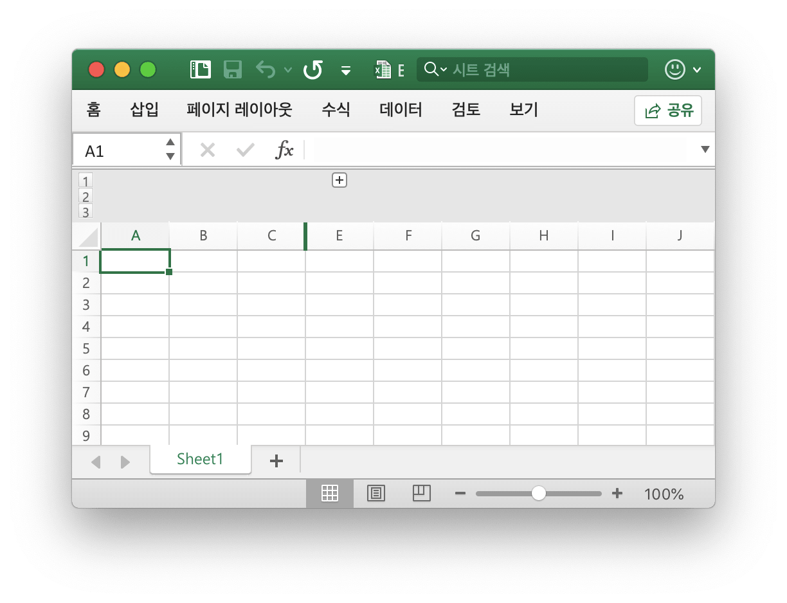

# 워크 시트

## 열 가시성 설정 {#SetColVisible}

```go
func (f *File) SetColVisible(sheet, col string, visible bool) error
```

SetColVisible 지정된 워크 시트 이름과 열 이름으로 단일 열의 표시를 설정 하는 기능을 제공 합니다. 예를 들어 `Sheet1` 에서 열 `D` 를 숨깁니다.

```go
err := f.SetColVisible("Sheet1", "D", false)
```

`D` 에서 `F` (포함) 까지의 열을 숨 깁니다:

```go
err := f.SetColVisible("Sheet1", "D:F", false)
```

## 열 너비 설정 {#SetColWidth}

```go
func (f *File) SetColWidth(sheet, startcol, endcol string, width float64) error
```

SetColWidth 는 단일 열 또는 여러 열의 너비를 설정하는 기능을 제공합니다. 예를 들어:

```go
f := excelize.NewFile()
err := f.SetColWidth("Sheet1", "A", "H", 20)
```

## 행 높이 설정 {#SetRowHeight}

```go
func (f *File) SetRowHeight(sheet string, row int, height float64) error
```

SetRowHeight 는 단일 행의 높이를 설정하는 기능을 제공합니다. 예를 들어 `Sheet1` 에서 첫 번째 행의 높이를 설정합니다.

```go
err := f.SetRowHeight("Sheet1", 1, 50)
```

## 행 가시성 설정 {#SetRowVisible}

```go
func (f *File) SetRowVisible(sheet string, row int, visible bool) error
```

SetRowVisible 지정된 워크 시트 이름 및 행 인덱스에 의해 단일 행의 표시를 설정 하는 함수를 제공 합니다. 예를 들어 `Sheet1` 에서 행 `2` 를 숨깁니다.

```go
err := f.SetRowVisible("Sheet1", 2, false)
```

## 워크 시트 이름 가져 오기 {#GetSheetName}

```go
func (f *File) GetSheetName(index int) string
```

GetSheetName 주어진 워크 시트 인덱스에 의해 XLSX 의 워크 시트 이름을 얻을 수 있는 함수를 제공 합니다. 지정된 시트 인덱스가 유효하지 않은 경우 빈 문자열을 반환합니다.

## 열 가시성 확보 {#GetColVisible}

```go
func (f *File) GetColVisible(sheet, column string) (bool, error)
```

GetColVisible 는 지정된 워크시트 이름과 열 이름으로 단일 열을 볼 수 있는 함수를 제공합니다. 예를 들어 `Sheet1` 에서 `D` 열의 표시 상태를 가져옵니다.

```go
visible, err := f.GetColVisible("Sheet1", "D")
```

## 열 너비 가져 오기 {#GetColWidth}

```go
func (f *File) GetColWidth(sheet, col string) (float64, error)
```

GetColWidth 는 지정된 워크시트 이름 및 열 인덱스를 통해 열 너비를 얻는 함수를 제공합니다.

## 행 높이 가져 오기 {#GetRowHeight}

```go
func (f *File) GetRowHeight(sheet string, row int) (float64, error)
```

GetRowHeight 는 지정된 워크 시트 이름 및 행 인덱스를 통해 행 높이를 얻는 함수를 제공합니다. 예를 들어 `Sheet1` 에서 첫 번째 행의 높이를 가져옵니다.

```go
height, err := f.GetRowHeight("Sheet1", 1)
```

## 행 가시성 확보 {#GetRowVisible}

```go
func (f *File) GetRowVisible(sheet string, row int) (bool, error)
```

GetRowVisible 지정된 워크 시트 이름 및 행 인덱스에 의해 단일 행의 표시를 얻을 수 있는 함수를 제공 합니다. 예를 들어 `Sheet1` 에서 행 `2` 의 표시 상태를 가져옵니다.

```go
err := f.GetRowVisible("Sheet1", 2)
```

## 워크 시트 색인 가져 오기 {#GetSheetIndex}

```go
func (f *File) GetSheetIndex(name string) int
```

GetSheetIndex 주어진 된 시트 이름으로 XLSX의 워크 시트 인덱스를 얻을 수 있는 함수를 제공 합니다. 지정된 워크시트 이름이 유효하지 않은 경우 정수 형식 값 `0` 을 반환합니다.

얻은 인덱스는 통합 문서 기본 워크시트를 설정할 때 [`SetActiveSheet()`](workbook.md#SetActiveSheet) 함수를 호출하는 매개 변수로 사용할 수 있습니다.

## 워크 시트 목록 가져 오기 {#GetSheetMap}

```go
func (f *File) GetSheetMap() map[int]string
```

GetSheetMap 은 XLSX 의 워크 시트 이름 및 인덱스 맵을 얻는 기능을 제공합니다. 예를 들어:

```go
f, err := excelize.OpenFile("./Book1.xlsx")
if err != nil {
    return
}
for index, name := range f.GetSheetMap() {
    fmt.Println(index, name)
}
```

## 워크 시트 속성 설정 {#SetSheetPrOptions}

```go
func (f *File) SetSheetPrOptions(name string, opts ...SheetPrOption) error
```

SetSheetPrOptions 는 워크 시트 속성을 설정하는 기능을 제공합니다.

사용 가능한 옵션:

| 선택적 속성 | 유형 |
|---|---|
|CodeName|string|
|EnableFormatConditionsCalculation|bool|
|Published|bool|
|FitToPage|bool|
|AutoPageBreaks|bool|
|OutlineSummaryBelow|bool|

예를 들어:

```go
f := excelize.NewFile()
const sheet = "Sheet1"

if err := f.SetSheetPrOptions(sheet,
    excelize.CodeName("code"),
    excelize.EnableFormatConditionsCalculation(false),
    excelize.Published(false),
    excelize.FitToPage(true),
    excelize.AutoPageBreaks(true),
    excelize.OutlineSummaryBelow(false),
); err != nil {
    panic(err)
}
```

## 워크 시트 속성 가져 오기 {#GetSheetPrOptions}

```go
func (f *File) GetSheetPrOptions(name string, opts ...SheetPrOptionPtr) error
```

GetSheetPrOptions 워크 시트 속성을 가져옵니다 하는 함수를 제공 합니다.

| 선택적 속성 | 유형 |
|---|---|
|CodeName|string|
|EnableFormatConditionsCalculation|bool|
|Published|bool|
|FitToPage|bool|
|AutoPageBreaks|bool|
|OutlineSummaryBelow|bool|

예를 들어:

```go
f := excelize.NewFile()
const sheet = "Sheet1"

var (
    codeName                          excelize.CodeName
    enableFormatConditionsCalculation excelize.EnableFormatConditionsCalculation
    published                         excelize.Published
    fitToPage                         excelize.FitToPage
    autoPageBreaks                    excelize.AutoPageBreaks
    outlineSummaryBelow               excelize.OutlineSummaryBelow
)

if err := f.GetSheetPrOptions(sheet,
    &codeName,
    &enableFormatConditionsCalculation,
    &published,
    &fitToPage,
    &autoPageBreaks,
    &outlineSummaryBelow,
); err != nil {
    panic(err)
}
fmt.Println("Defaults:")
fmt.Printf("- codeName: %q\n", codeName)
fmt.Println("- enableFormatConditionsCalculation:", enableFormatConditionsCalculation)
fmt.Println("- published:", published)
fmt.Println("- fitToPage:", fitToPage)
fmt.Println("- autoPageBreaks:", autoPageBreaks)
fmt.Println("- outlineSummaryBelow:", outlineSummaryBelow)
```

출력:

```text
Defaults:
- codeName: ""
- enableFormatConditionsCalculation: true
- published: true
- fitToPage: false
- autoPageBreaks: false
- outlineSummaryBelow: true
```

## 열 삽입 {#InsertCol}

```go
func (f *File) InsertCol(sheet, column string) error
```

InsertCol 은 지정된 열 인덱스 전에 새 열을 삽입하는 기능을 제공합니다. 예를 들어 `Sheet1` 에서 `C`  열 앞에 새 열을 만듭니다.

```go
err := f.InsertCol("Sheet1", "C")
```

## 행 삽입 {#InsertRow}

```go
func (f *File) InsertRow(sheet string, row int) error
```

InsertRow 는 1부터 Excel 행 번호가 지정된 후 새 행을 삽입하는 기능을 제공합니다. 예를 들어 `Sheet1` 에서 행 `3` 앞에 새 행을 만듭니다.

```go
err := f.InsertRow("Sheet1", 3)
```

## 중복 행 추가 {#DuplicateRow}

```go
func (f *File) DuplicateRow(sheet string, row int) error
```

DuplicateRow 는 지정된 아래 의 지정된 행의 복사본을 삽입합니다.

```go
err := f.DuplicateRow("Sheet1", 2)
```

수식, 차트 등과 같은 참조의 변경 에 영향을 주는 이 메서드를 주의해서 사용하십시오. 워크 시트에 참조 된 값이 있으면 워크 시트를 열 때 파일 오류가 발생합니다. Excelize 는 현재 이러한 참조를 부분적으로만 업데이트합니다.

## 중복 행 {#DuplicateRowTo}

```go
func (f *File) DuplicateRowTo(sheet string, row, row2 int) error
```

DuplicateRowTo 는 지정된 행의 복사본을 Excel 번호로 삽입하여 아래로 이동하는 지정된 행 위치는 대상 위치 다음의 행을 존재합니다.

```go
err := f.DuplicateRowTo("Sheet1", 2, 7)
```

수식, 차트 등과 같은 참조의 변경 에 영향을 주는 이 메서드를 주의해서 사용하십시오. 워크 시트에 참조 된 값이 있으면 워크 시트를 열 때 파일 오류가 발생합니다. Excelize 는 현재 이러한 참조를 부분적으로만 업데이트합니다.

## 행 개요 만들기 {#SetRowOutlineLevel}

```go
func (f *File) SetRowOutlineLevel(sheet string, row int, level uint8) error
```

SetRowOutlineLevel 은 지정된 워크 시트 이름과 Excel 행 번호로 단일 행의 개요 수준 번호를 설정하는 기능을 제공합니다. 예를 들어 `Sheet1` 의 행 2 를 수준 1로 윤곽선 으로 설명합니다.

<p align="center"></p>

```go
err := f.SetRowOutlineLevel("Sheet1", 2, 1)
```

## 열 개요 만들기 {#SetColOutlineLevel}

```go
func (f *File) SetColOutlineLevel(sheet, col string, level uint8) error
```

SetColOutlineLevel 은 지정된 워크시트 이름과 열 이름으로 단일 열의 윤곽선 수준을 설정하는 기능을 제공합니다. 예를 들어 `Sheet1` 에서 `D` 열의 윤곽선 수준을 2 로 설정합니다.

<p align="center"></p>

```go
err := f.SetColOutlineLevel("Sheet1", "D", 2)
```

## 행 개요 얻기 {#GetRowOutlineLevel}

```go
func (f *File) GetRowOutlineLevel(sheet string, row int) (uint8, error)
```

GetRowOutlineLevel 은 지정된 워크 시트 이름과 Excel 행 번호로 단일 행의 개요 수준 번호를 얻는 함수를 제공합니다. 예를 들어 `Sheet1` 에서 행 2 의 윤곽선 번호를 가져옵니다.

```go
err := f.GetRowOutlineLevel("Sheet1", 2)
```

## 칼럼 개요 얻기 {#GetColOutlineLevel}

```go
func (f *File) GetColOutlineLevel(sheet, col string) (uint8, error)
```

GetColOutlineLevel 은 지정된 워크시트 이름과 열 이름을 사용하여 단일 열의 개요 수준을 얻는 함수를 제공합니다. 예를 들어 `Sheet1` 에서 `D` 열의 윤곽선 수준을 가져옵니다.

```go
level, err := f.GetColOutlineLevel("Sheet1", "D")
```

## 행 반복기 {#Rows}

```go
func (f *File) Rows(sheet string) (*Rows, error)
```

행은 행 이터레이터를 반환합니다. 예를 들어:

```go
rows, err := f.Rows("Sheet1")
if err != nil {
    println(err.Error())
    return
}
for rows.Next() {
    row, err := rows.Columns()
    if err != nil {
        println(err.Error())
    }
    for _, colCell := range row {
        print(colCell, "\t")
    }
    println()
}
```

### 행 이터레이터 - 열

```go
func (rows *Rows) Columns() ([]string, error)
```

열은 현재 행의 열 값을 반환합니다.

### 행 이터레이터 - 트래빙

```go
func (rows *Rows) Next() bool
```

다음 다음 행 요소를 찾으면 `true` 를 반환합니다.

### 행 이터레이터 - 오류 처리

```go
func (rows *Rows) Error() error
```

다음 행 요소를 찾을 때 오류가 `error` 를 반환합니다.

## 검색 시트 {#SearchSheet}

```go
func (f *File) SearchSheet(sheet, value string, reg ...bool) ([]string, error)
```

SearchSheet 는 지정된 워크 시트 이름, 셀 값 및 정규식으로 좌표를 얻는 함수를 제공합니다. 이 함수는 계산된 결과, 서식이 지정된 숫자 및 조건부 조회에 대한 검색을 지원하지 않습니다. 병합된 셀인 경우 병합된 영역의 왼쪽 위 모서리의 좌표를 반환합니다.

예를 들어 `Sheet1` 에서 `100` 값의 좌표를 검색합니다.

```go
result, err := f.SearchSheet("Sheet1", "100")
```

예를 들어 `Sheet1` 의 `0-9` 범위의 숫자 값이 설명되는 좌표를 검색합니다.

```go
result, err := f.SearchSheet("Sheet1", "[0-9]", true)
```

## 보호 시트 {#ProtectSheet}

```go
func (f *File) ProtectSheet(sheet string, settings *FormatSheetProtection) error
```

ProtectSheet 는 다른 사용자가 워크시트에서 실수로 또는 의도적으로 데이터를 변경, 이동 또는 삭제하지 못하도록 하는 기능을 제공합니다. 예를 들어 보호 설정으로 `Sheet1` 을 보호합니다.

<p align="center"></p>

```go
err := f.ProtectSheet("Sheet1", &excelize.FormatSheetProtection{
    Password:      "password",
    EditScenarios: false,
})
```

## 보호되지 않은 시트 {#UnprotectSheet}

```go
func (f *File) UnprotectSheet(sheet string) error
```

보호 해제시트는 Excel 워크시트의 보호를 해제하는 기능을 제공합니다.

## 열 삭제 {#RemoveCol}

```go
func (f *File) RemoveCol(sheet, col string) error
```

RemoveCol 은 지정된 워크시트 이름 및 열 인덱스를 통해 단일 열을 제거하는 기능을 제공합니다. 예를 들어 `Sheet1` 에서 `C` 열을 제거합니다.

```go
err := f.RemoveCol("Sheet1", "C")
```

수식, 차트 등과 같은 참조의 변경 에 영향을 주는 이 메서드를 주의해서 사용하십시오. 워크 시트에 참조 된 값이 있으면 워크 시트를 열 때 파일 오류가 발생합니다. Excelize 는 현재 이러한 참조를 부분적으로만 업데이트합니다.

## 행 삭제 {#RemoveRow}

```go
func (f *File) RemoveRow(sheet string, row int) error
```

RemoveRow 는 지정된 워크 시트 이름과 Excel 행 번호로 단일 행을 제거하는 기능을 제공합니다. 예를 들어 `Sheet1` 에서 행 `3` 을 제거합니다.

```go
err := f.RemoveRow("Sheet1", 3)
```

수식, 차트 등과 같은 참조의 변경 에 영향을 주는 이 메서드를 주의해서 사용하십시오. 워크 시트에 참조 된 값이 있으면 워크 시트를 열 때 파일 오류가 발생합니다. Excelize 는 현재 이러한 참조를 부분적으로만 업데이트합니다.

## 행별 지정 {#SetSheetRow}

```go
func (f *File) SetSheetRow(sheet, axis string, slice interface{}) error
```

SetSheetRow는 지정된 워크 시트 이름, 시작 좌표 및 배열 유형 `slice` 에 대한 포인터로 행에 배열을 씁니다. 예를 들어 `6` 행에 배열을 `Sheet1` 의 셀 `B6` 로 시작합니다.

```go
err := f.SetSheetRow("Sheet1", "B6", &[]interface{}{"1", nil, 2})
```
