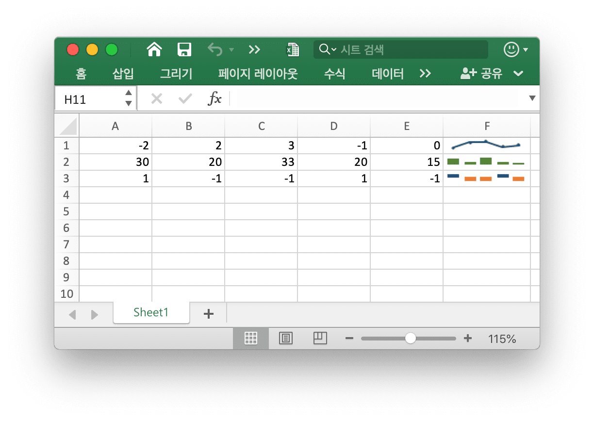
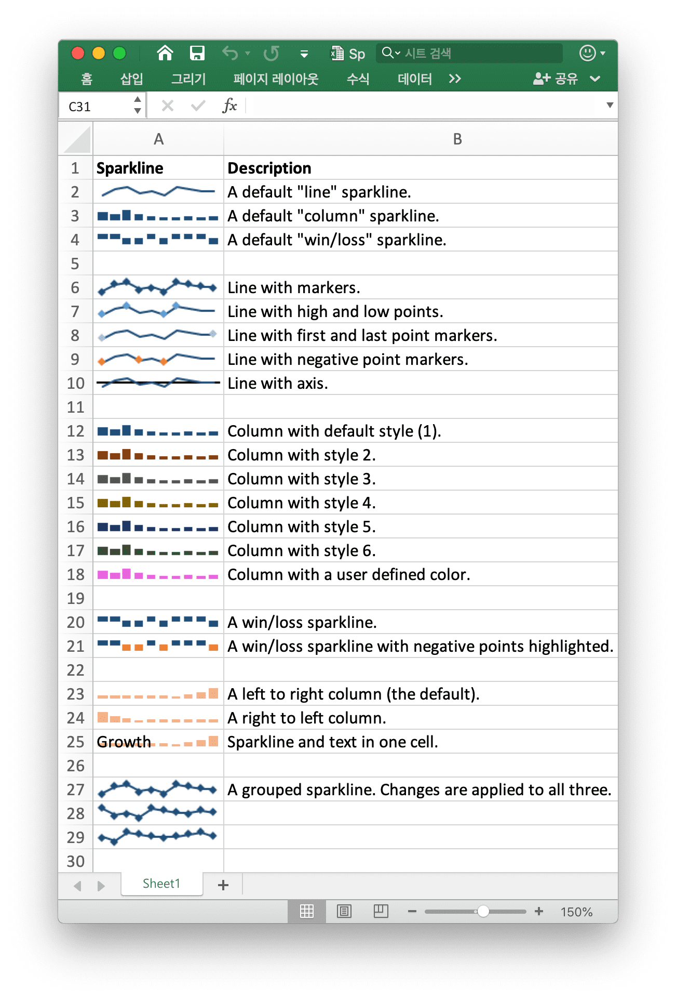

# 스파크라인

스파크 라인은 워크 시트 셀에 작은 차트를 추가 할 수있는 Excel 2010 +의 기능입니다. 이는 데이터의 시각적 추세를 압축 형식으로 표시하는 데 유용합니다.

<p align="center"></p>

[스파크라인](https://en.wikipedia.org/wiki/Sparklines) [Edward Tufte](https://en.wikipedia.org/wiki/Edward_Tufte) 에 의해 발명되었다.

## 스파크라인 추가

```go
func (f *File) AddSparkline(sheet string, opt *SparklineOption) error
```

AddSparkline 은 주어진 서식 옵션을 사용하여 워크시트에 스파크라인을 추가하는 기능을 제공합니다. 스파크라인은 단일 셀에 맞는 작은 차트로 데이터의 추세를 표시하는 데 사용됩니다. 스파크 라인은 Excel 2010 이상만의 기능입니다. Excel 2007에서 읽을 수 있지만 표시되지 않는 XLSX 파일에 쓸 수 있습니다. 예를 들어 그룹화된 스파크라인을 추가합니다. 변경 사항은 다음 세 가지 모두에 적용됩니다.

```go
err := f.AddSparkline("Sheet1", &excelize.SparklineOption{
    Location: []string{"A1", "A2", "A3"},
    Range:    []string{"Sheet2!A1:J1", "Sheet2!A2:J2", "Sheet2!A3:J3"},
    Markers:  true,
})
```

<p align="center"></p>

다음은 엑셀리즈에서 지원하는 스파라인의 서식 옵션을 보여 주며:

매개 변수 | 설명
---|---
Location  | 필수, `Range` 매개 변수와 동일한 번호가 있어야 합니다.
Range     | 필수, `Location` 매개 변수와 동일한 번호가 있어야 합니다.
Type      | 열거 값: `line`, `column`, `win_loss`
Style     | 값 범위: 0 - 35
Hight     | 스파크라인 고점 토글
Low       | 스파크라인 저점 토글
First     | 스파크라인 첫 번째 점 토글
Last      | 스파크라인 마지막 점 토글
Negative  | 스파크라인 네거티브 포인트 전환
Markers   | 스파크라인 마커 전환
ColorAxis | RGB 색상은 `RRGGBB` 로 지정됩니다.
Axis      | 스파크라인 축 표시
