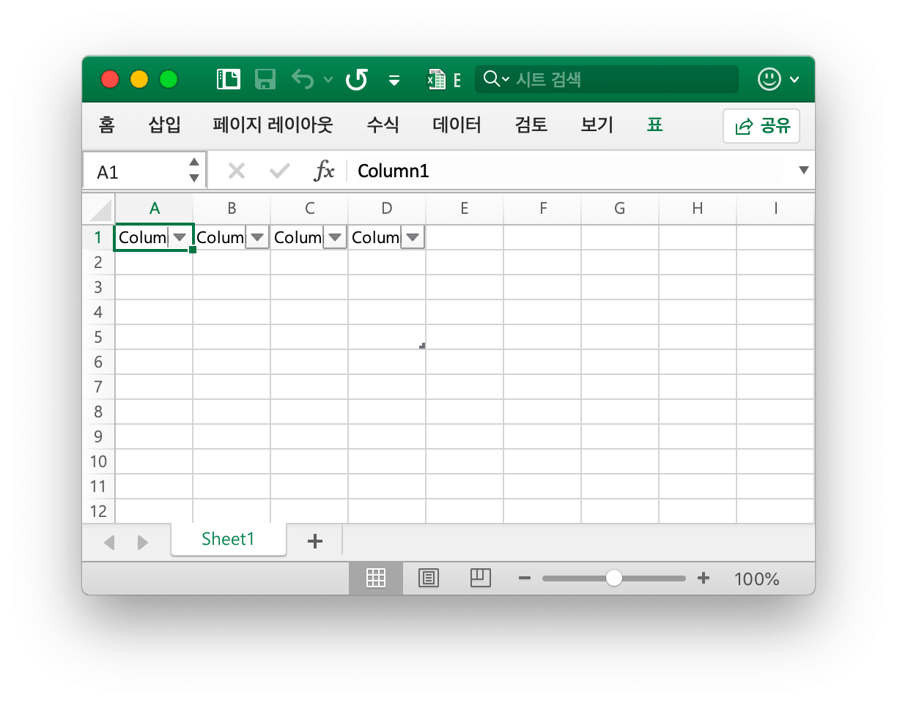
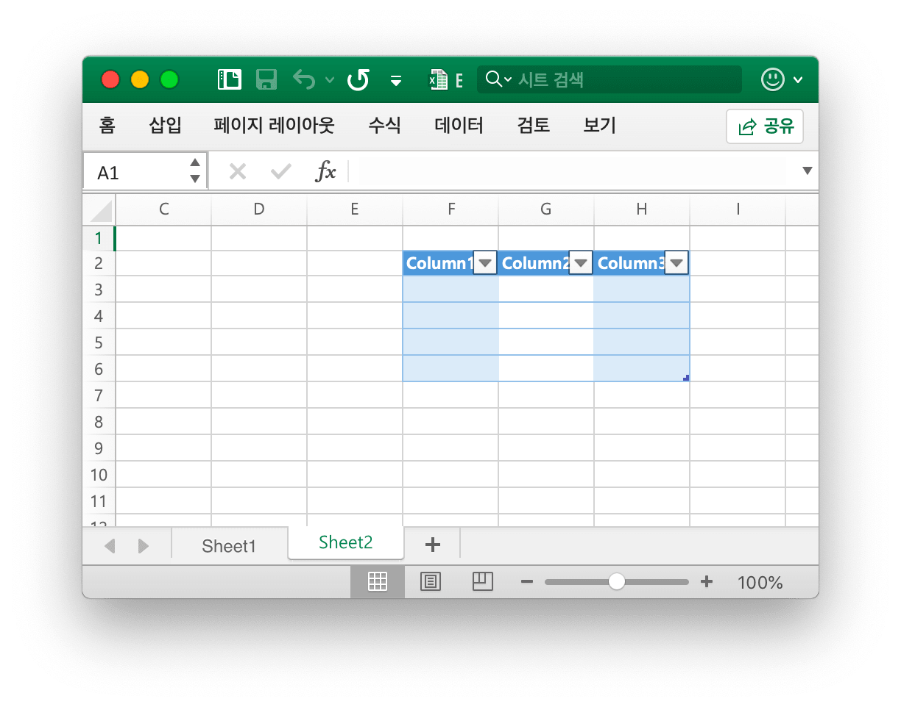
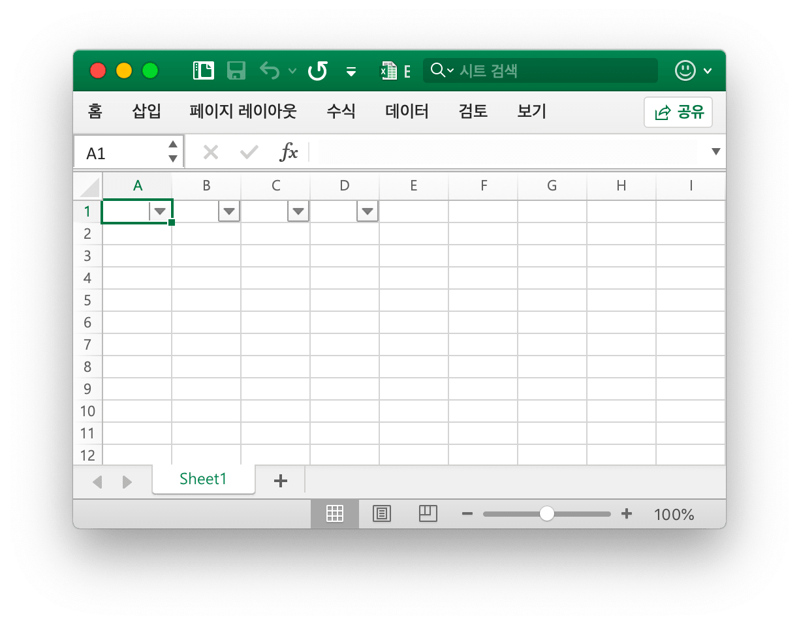
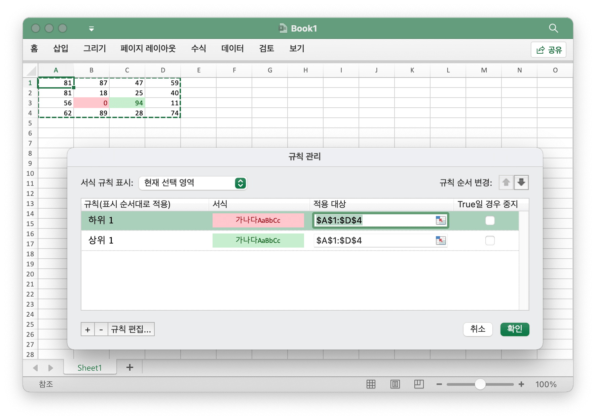
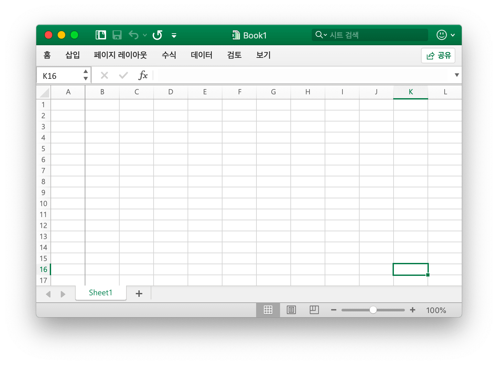
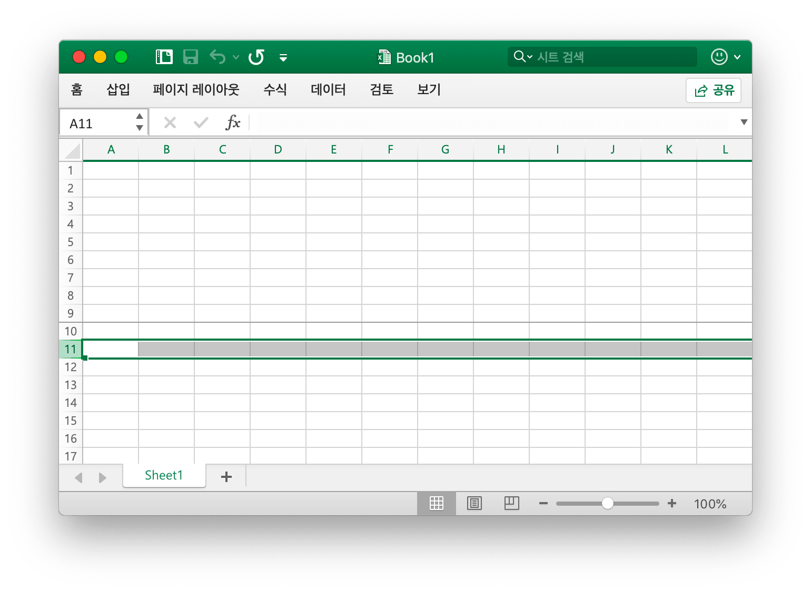
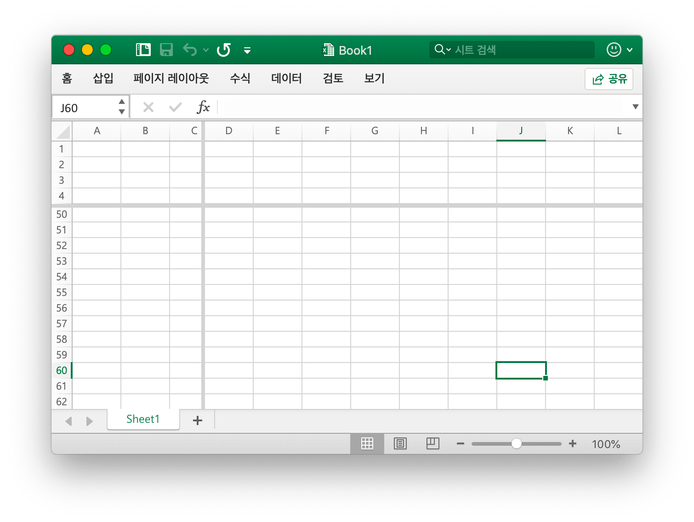

# 유틸리티 기능

ZipWriter 는 ZIP 아카이브에 파일을 쓰기 위한 인터페이스를 정의합니다. 아카이브 내에 새 파일을 생성하고, 파일 시스템에서 파일을 추가하고, 쓰기가 완료되면 아카이브를 닫는 메서드를 제공합니다.

```go
type ZipWriter interface {
    Create(name string) (io.Writer, error)
    AddFS(fsys fs.FS) error
    Close() error
}
```

## 테이블 추가 {#AddTable}

```go
func (f *File) AddTable(sheet string, table *Table) error
```

AddTable 은 지정된 워크 시트 이름, 좌표 영역 및 형식 집합으로 워크 시트에 테이블을 추가하는 방법을 제공합니다.

- 예제 1, 에서는 `Sheet1`에서 `A1:D5` 테이블을 만듭니다:

<p align="center"></p>

```go
err := f.AddTable("Sheet1", &excelize.Table{Range: "A1:D5"})
```

- 예제 2, 형식 집합으로 `Sheet2` 에서 `F2:H6` 테이블을 만듭니다:

<p align="center"></p>

```go
disable := false
err := f.AddTable("Sheet2", &excelize.Table{
    Range:             "F2:H6",
    Name:              "table",
    StyleName:         "TableStyleMedium2",
    ShowFirstColumn:   true,
    ShowLastColumn:    true,
    ShowRowStripes:    &disable,
    ShowColumnStripes: true,
})
```

표는 머리글을 포함하여 두 줄 이상이어야합니다. 헤더 셀은 문자열을 포함해야하며 고유해야하며 AddTable 함수를 호출하기 전에 테이블의 헤더 행 데이터를 설정해야합니다. 여러 테이블은 교차점이없는 영역을 조정합니다.

`Name`: 테이블의 이름은 테이블의 동일한 워크시트 이름에서 고유해야 합니다.

`StyleName`: 기본 제공 테이블 스타일 이름:

```text
TableStyleLight1 - TableStyleLight21
TableStyleMedium1 - TableStyleMedium28
TableStyleDark1 - TableStyleDark11
```

인덱스|스타일|인덱스|스타일|인덱스|스타일
---|---|---|---|---|---
||TableStyleLight1||TableStyleLight2|
TableStyleLight3||TableStyleLight4||TableStyleLight5|
TableStyleLight6||TableStyleLight7||TableStyleLight8|
TableStyleLight9||TableStyleLight10||TableStyleLight11|
TableStyleLight12||TableStyleLight13||TableStyleLight14|
TableStyleLight15||TableStyleLight16||TableStyleLight17|
TableStyleLight18||TableStyleLight19||TableStyleLight20|
TableStyleLight21||TableStyleMedium1||TableStyleMedium2|
TableStyleMedium3||TableStyleMedium4||TableStyleMedium5|
TableStyleMedium6||TableStyleMedium7||TableStyleMedium8|
TableStyleMedium9||TableStyleMedium10||TableStyleMedium11|
TableStyleMedium12||TableStyleMedium13||TableStyleMedium14|
TableStyleMedium15||TableStyleMedium16||TableStyleMedium17|
TableStyleMedium18||TableStyleMedium19||TableStyleMedium20|
TableStyleMedium21||TableStyleMedium22||TableStyleMedium23|
TableStyleMedium24||TableStyleMedium25||TableStyleMedium26|
TableStyleMedium27||TableStyleMedium28||TableStyleDark1|
TableStyleDark2||TableStyleDark3||TableStyleDark4|
TableStyleDark5||TableStyleDark6||TableStyleDark7|
TableStyleDark8||TableStyleDark9||TableStyleDark10|
TableStyleDark11|||||

## 테이블 가져오기 {#GetTables}

```go
func (f *File) GetTables(sheet string) ([]Table, error)
```

GetTables 는 지정된 워크시트 이름으로 워크시트의 모든 테이블을 가져오는 방법을 제공합니다.

## 테이블 삭제 {#DeleteTable}

```go
func (f *File) DeleteTable(name string) error
```

DeleteTable 은 주어진 테이블 이름으로 테이블을 삭제하는 방법을 제공합니다.

## 자동 필터 {#AutoFilter}

```go
func (f *File) AutoFilter(sheet, rangeRef string, opts []AutoFilterOptions) error
```

AutoFilter 는 지정된 워크시트 이름, 좌표 영역 및 설정으로 워크시트에 자동 필터를 추가하는 방법을 제공합니다. Excel 의 자동 필터는 몇 가지 간단한 기준에 따라 2D 데이터 범위를 필터링하는 방법입니다.

예제 1, `Sheet1` 의 셀 범위 `A1:D4` 에 자동 필터를 적용합니다:

<p align="center"></p>

```go
err := f.AutoFilter("Sheet1", "A1:D4", []excelize.AutoFilterOptions{})
```

예제 2, 에서는 자동 필터에서 데이터를 필터링합니다:

```go
err := f.AutoFilter("Sheet1", "A1:D4", []excelize.AutoFilterOptions{
    {Column: "B", Expression: "x != blanks"},
})
```

`Column` 은 간단한 기준에 따라 자동 필터 범위의 필터 열을 정의합니다.

필터 조건을 지정하는 것만으로는 충분하지 않습니다. 필터 조건과 일치하지 않는 행도 숨겨야 합니다. 행은 [`SetRowVisible()`](sheet.md#SetRowVisible) 방법을 사용하여 숨김이 있습니다. Excelize 는 파일 형식의 일부가 아니므로 행을 자동으로 필터링할 수 없습니다.

열에 대한 필터 기준 설정:

`Expression` 은 조건을 정의하며, 필터 조건을 설정하는 데 다음 연산자가 사용할 수 있습니다:

```text
==
!=
>
<
>=
<=
and
or
```

식은 `and` 및 `or` 연산자로 구분된 단일 문 또는 두 개의 문으로 구성할 수 있습니다. 예를 들어:

```text
x <  2000
x >  2000
x == 2000
x >  2000 and x <  5000
x == 2000 or  x == 5000
```

공백 또는 비블 데이터의 필터링은 식에서 공백 또는 비공백 값을 사용하여 수행할 수 있습니다:

```text
x == Blanks
x == NonBlanks
```

Office Excel 에서는 다음과 같은 간단한 문자열 일치 작업도 허용합니다:

```text
x == b*      // begins with b
x != b*      // doesn't begin with b
x == *b      // ends with b
x != *b      // doesn't end with b
x == *b*     // contains b
x != *b*     // doesn't contains b
```

`*` 를 사용하여 문자 나 숫자와 일치시키고 `?` 를 사용하여 단일 문자 또는 숫자와 일치시킬 수도 있습니다. Excel 의 필터에서 다른 정규식 수량자는 지원되지 않습니다. Excel의 정규 표현식 문자는 `~` 를 사용하여 이스케이프할 수 있습니다.

위의 예제에서 자리 표시자 변수 `x`를 간단한 문자열로 대체할 수 있습니다. 실제 자리 표시자 이름은 내부적으로 무시되므로 다음의 모든 이름이 동일합니다:

```text
x     < 2000
col   < 2000
Price < 2000
```

## 링크 된 값 업데이트 {#UpdateLinkedValue}

```go
func (f *File) UpdateLinkedValue() error
```

업데이트링크드밸류 수정 스프레드시트 내의 링크된 값은 Office Excel 2007 및 2010 에서 업데이트되지 않습니다. 이 함수는 셀에 연결된 값이 있을 때 값 태그를 제거합니다. 참조 [https://learn.microsoft.com/en-us/archive/msdn-technet-forums/e16bae1f-6a2c-4325-8013-e989a3479066](https://learn.microsoft.com/en-us/archive/msdn-technet-forums/e16bae1f-6a2c-4325-8013-e989a3479066). 주의 사항 : 열면 XLSX 파일 Excel 은 연결된 값을 업데이트하고 새 값을 생성하며 파일을 저장하거나 저장하라는 메시지가 표시됩니다.

통합 문서의 셀 캐시를 지우는 효과는 `<v>` 태그에 대한 수정으로 나타납니다. 예를 들어 지우기 전에 셀 캐시를 선택합니다:

```xml
<row r="19">
    <c r="B19">
        <f>SUM(Sheet2!D2,Sheet2!D11)</f>
        <v>100</v>
     </c>
</row>
```

셀 캐시를 지운 후:

```xml
<row r="19">
    <c r="B19">
        <f>SUM(Sheet2!D2,Sheet2!D11)</f>
    </c>
</row>
```

## 셀 이름 분할 {#SplitCellName}

```go
func SplitCellName(cell string) (string, int, error)
```

SplitCellName 열 이름과 행 번호로 셀 이름을 분할합니다. 예를 들어:

```go
excelize.SplitCellName("AK74") // return "AK", 74, nil
```

## 셀 이름 결합 {#JoinCellName}

```go
func JoinCellName(col string, row int) (string, error)
```

JoinCellName 열 이름 및 행 번호에서 셀 이름을 조인합니다.

## 열 이름을 숫자로 {#ColumnNameToNumber}

```go
func ColumnNameToNumber(name string) (int, error)
```

ColumnNameToNumber는 Excel 시트 열 이름을 `int` 로 변환하는 기능을 제공합니다. 열 이름 케이스를 구분하지 않습니다. 열 이름이 올바르지 않은 경우 함수에서 오류를 반환합니다. 예를 들어:

```go
excelize.ColumnNameToNumber("AK") // returns 37, nil
```

## 이름에 대 한 열 번호 {#ColumnNumberToName}

```go
func ColumnNumberToName(num int) (string, error)
```

ColumnNumberToName 은 정수를 Excel 시트 열 제목으로 변환하는 기능을 제공합니다. 예를 들어:

```go
excelize.ColumnNumberToName(37) // returns "AK", nil
```

## 좌표에 대 한 셀 이름 {#CellNameToCoordinates}

```go
func CellNameToCoordinates(cell string) (int, int, error)
```

CellNameToCoordinates 는 `[X, Y]` 좌표로 상형 셀 이름을 변환하거나 오류를 반환합니다. 예를 들어:

```go
excelize.CellNameToCoordinates("A1") // returns 1, 1, nil
excelize.CellNameToCoordinates("Z3") // returns 26, 3, nil
```

## 셀 이름에 좌표 지정 {#CoordinatesToCellName}

```go
func CoordinatesToCellName(col, row int, abs ...bool) (string, error)
```

CoordinatesToCellName 는 `[X, Y]` 좌표를 알파 숫자 셀 이름으로 변환하거나 오류를 반환합니다. 예를 들어:

```go
excelize.CoordinatesToCellName(1, 1) // returns "A1", nil
excelize.CoordinatesToCellName(1, 1, true) // returns "$A$1", nil
```

## 조건부 스타일 만들기 {#NewConditionalStyle}

```go
func (f *File) NewConditionalStyle(style *Style) (int, error)
```

NewConditionalStyle 지정된 스타일 형식에 의해 조건부 형식에 대 한 스타일을 만드는 함수를 제공 합니다. 매개 변수는 함수 [`NewStyle`](style.md#NewStyle) 와 동일합니다. 색상 필드는 RGB 색상 코드를 사용하고 현재 글꼴, 채우기, 정렬 및 테두리를 설정하기 위해 지원만 사용합니다.

## 조건부 스타일 가져오기 {#GetConditionalStyle}

```go
func (f *File) GetConditionalStyle(idx int) (*Style, error)
```

GetConditionalStyle 은 지정된 스타일 인덱스로 조건부 형식 스타일 정의를 반환합니다.

## 조건 형식 {#SetConditionalFormat}

```go
func (f *File) SetConditionalFormat(sheet, rangeRef string, opts []ConditionalFormatOptions) error
```

SetConditionalFormat 는 셀 값에 대한 조건부 서식 지정 규칙을 만드는 함수를 제공합니다. 조건부 서식지정은 특정 기준에 따라 셀 또는 셀 범위에 형식을 적용할 수 있는 Office Excel 의 기능입니다.

`Type` 옵션은 필수 매개 변수이며 기본값이 없습니다. 허용 형식 값과 관련 매개 변수는 다음과 같습니다:

<table>
    <thead>
        <tr>
            <th>형식</th>
            <th>매개 변수</th>
        </tr>
    </thead>
    <tbody>
        <tr>
            <td rowspan=4>cell</td>
            <td>Criteria</td>
        </tr>
        <tr>
            <td>Value</td>
        </tr>
        <tr>
            <td>MinValue</td>
        </tr>
        <tr>
            <td>MaxValue</td>
        </tr>
        <tr>
            <td>time_period</td>
            <td>Criteria</td>
        </tr>
        <tr>
            <td rowspan=2>text</td>
            <td>Criteria</td>
        </tr>
        <tr>
            <td>Value</td>
        </tr>
        <tr>
            <td>average</td>
            <td>Criteria</td>
        </tr>
        <tr>
            <td>duplicate</td>
            <td>(none)</td>
        </tr>
        <tr>
            <td>unique</td>
            <td>(none)</td>
        </tr>
        <tr>
            <td rowspan=2>top</td>
            <td>Criteria</td>
        </tr>
        <tr>
            <td>Value</td>
        </tr>
        <tr>
            <td rowspan=2>bottom</td>
            <td>Criteria</td>
        </tr>
        <tr>
            <td>Value</td>
        </tr>
        <tr>
            <td>blanks</td>
            <td>(none)</td>
        </tr>
        <tr>
            <td>no_blanks</td>
            <td>(none)</td>
        </tr>
        <tr>
            <td>errors</td>
            <td>(none)</td>
        </tr>
        <tr>
            <td>no_errors</td>
            <td>(none)</td>
        </tr>
        <tr>
            <td rowspan=6>2_color_scale</td>
            <td>MinType</td>
        </tr>
        <tr>
            <td>MaxType</td>
        </tr>
        <tr>
            <td>MinValue</td>
        </tr>
        <tr>
            <td>MaxValue</td>
        </tr>
        <tr>
            <td>MinColor</td>
        </tr>
        <tr>
            <td>MaxColor</td>
        </tr>
        <tr>
            <td rowspan=9>3_color_scale</td>
            <td>MinType</td>
        </tr>
        <tr>
            <td>MidType</td>
        </tr>
        <tr>
            <td>MaxType</td>
        </tr>
        <tr>
            <td>MinValue</td>
        </tr>
        <tr>
            <td>MidValue</td>
        </tr>
        <tr>
            <td>MaxValue</td>
        </tr>
        <tr>
            <td>MinColor</td>
        </tr>
        <tr>
            <td>MidColor</td>
        </tr>
        <tr>
            <td>MaxColor</td>
        </tr>
        <tr>
            <td rowspan=9>data_bar</td>
            <td>MinType</td>
        </tr>
        <tr>
            <td>MaxType</td>
        </tr>
        <tr>
            <td>MinValue</td>
        </tr>
        <tr>
            <td>MaxValue</td>
        </tr>
        <tr>
            <td>BarBorderColor</td>
        </tr>
        <tr>
            <td>BarColor</td>
        </tr>
        <tr>
            <td>BarDirection</td>
        </tr>
        <tr>
            <td>BarOnly</td>
        </tr>
        <tr>
            <td>BarSolid</td>
        </tr>
        <tr>
            <td rowspan=3>iconSet</td>
            <td>IconStyle</td>
        </tr>
        <tr>
            <td>ReverseIcons</td>
        </tr>
        <tr>
            <td>IconsOnly</td>
        </tr>
        <tr>
            <td>formula</td>
            <td>Criteria</td>
        </tr>
    </tbody>
</table>

`Criteria` 매개 변수는 셀 데이터가 평가되는 기준을 설정하는 데 사용됩니다. 기본값이 없습니다. `excelize.ConditionalFormatOptions{Type: "cell"}` 에 적용되는 가장 일반적인 기준은 다음과 같습니다:

텍스트 설명 문자|기호 표현
---|---
between|
not between|
equal to|==
not equal to|!=
greater than|>
less than|<
greater than or equal to|>=
less than or equal to|<=

위의 첫 번째 열에서 Excel 의 텍스트 설명 문자열을 사용하거나 보다 일반적인 기호 대안을 사용할 수 있습니다.

다른 조건부 형식 유형과 관련된 추가 기준은 아래 관련 섹션에 나와 있습니다.

`Value`: 값은 일반적으로 `Criteria` 매개 변수와 함께 사용되어 셀 데이터가 평가되는 규칙을 설정합니다:

```go
err := f.SetConditionalFormat("Sheet1", "D1:D10",
    []excelize.ConditionalFormatOptions{
        {
            Type:     "cell",
            Criteria: ">",
            Format:   &format,
            Value:    "6",
        },
    },
)
```

`Value` 속성은 셀 참조일 수도 있습니다:

```go
err := f.SetConditionalFormat("Sheet1", "D1:D10",
    []excelize.ConditionalFormatOptions{
        {
            Type:     "cell",
            Criteria: ">",
            Format:   &format,
            Value:    "$C$1",
        },
    },
)
```

type: `Format` - 조건부 서식 기준이 충족될 때 셀에 적용되는 형식을 지정하는 데 `Format` 매개 변수가 사용됩니다. 형식은 셀 형식과 동일한 방식으로 [`NewConditionalStyle()`](utils.md#NewConditionalStyle) 메서드를 사용하여 만들어집니다:

```go
format, err := f.NewConditionalStyle(
    &excelize.Style{
        Font: &excelize.Font{Color: "9A0511"},
        Fill: excelize.Fill{
            Type: "pattern", Color: []string{"FEC7CE"}, Pattern: 1,
        },
    },
)
if err != nil {
    fmt.Println(err)
}
err = f.SetConditionalFormat("Sheet1", "D1:D10",
    []excelize.ConditionalFormatOptions{
        {Type: "cell", Criteria: ">", Format: &format, Value: "6"},
    },
)
```

참고: Excel 에서 조건부 형식은 기존 셀 형식 위에 중첩되며 모든 셀 형식 속성을 수정할 수 있는 것은 아닙니다. 조건부 형식으로 수정할 수 없는 속성은 글꼴 이름, 글꼴 크기, 초중문자 및 하위 스크립트, 대각선 테두리, 모든 정렬 속성 및 모든 보호 속성입니다.

Excel 은 조건부 서식에 사용할 일부 기본 형식을 지정합니다. 다음과 같은 excelize 형식을 사용하여 복제할 수 있습니다:

```go
// 나쁜 조건부 장미 형식입니다.
format1, err := f.NewConditionalStyle(
    &excelize.Style{
        Font: &excelize.Font{Color: "9A0511"},
        Fill: excelize.Fill{
            Type: "pattern", Color: []string{"FEC7CE"}, Pattern: 1,
        },
    },
)

// 중립 조건부에 대한 밝은 노란색 형식입니다.
format2, err := f.NewConditionalStyle(
    &excelize.Style{
        Font: &excelize.Font{Color: "9B5713"},
        Fill: excelize.Fill{
            Type: "pattern", Color: []string{"FEEAA0"}, Pattern: 1,
        },
    },
)

// 좋은 조건부에 대한 밝은 녹색 형식입니다.
format3, err := f.NewConditionalStyle(
    &excelize.Style{
        Font: &excelize.Font{Color: "09600B"},
        Fill: excelize.Fill{
            Type: "pattern", Color: []string{"C7EECF"}, Pattern: 1,
        },
    },
)
```

type: `MinValue` - 최소 매개변수는 `Criteria` 가 `between` 또는 `not between` 일 때 하한 값을 설정하는 데 사용됩니다.

```go
// Highlight cells rules: between...
err := f.SetConditionalFormat("Sheet1", "A1:A10",
    []excelize.ConditionalFormatOptions{
        {
            Type:     "cell",
            Criteria: "between",
            Format:   &format,
            MinValue: "6",
            MaxValue: "8",
        },
    },
)
```

type: `MaxValue` - `maximum` 매개변수는 기준이 `between` 또는 `not between` 일 때 상한 값을 설정하는 데 사용됩니다. 이전 예제를 참조하십시오.

type: `average` - `average` 형식은 Office Excel 의 "Average" 스타일 조건부 형식을 지정하는 데 사용됩니다.

```go
// Top/Bottom rules: Above Average...
err := f.SetConditionalFormat("Sheet1", "A1:A10",
    []excelize.ConditionalFormatOptions{
        {
            Type:         "average",
            Criteria:     "=",
            Format:       &format1,
            AboveAverage: true,
        },
    },
)

// Top/Bottom rules: Below Average...
err := f.SetConditionalFormat("Sheet1", "B1:B10",
    []excelize.ConditionalFormatOptions{
        {
            Type:         "average",
            Criteria:     "=",
            Format:       &format2,
            AboveAverage: false,
        },
    },
)
```

type: `duplicate` - `duplicate` 유형은 범위의 중복 셀을 강조 표시하는 데 사용됩니다:

```go
// Highlight cells rules: Duplicate Values...
err := f.SetConditionalFormat("Sheet1", "A1:A10",
    []excelize.ConditionalFormatOptions{
        {Type: "duplicate", Criteria: "=", Format: &format},
    },
)
```

type: `unique` - 고유 유형은 범위의 고유한 셀을 강조 표시하는 데 사용됩니다:

```go
// Highlight cells rules: Not Equal To...
err := f.SetConditionalFormat("Sheet1", "A1:A10",
    []excelize.ConditionalFormatOptions{
        {Type: "unique", Criteria: "=", Format: &format},
    },
)
```

type: `top` - `top` 형식은 범위의 숫자 또는 백분율로 상위 n 값을 지정하는 데 사용됩니다:

```go
// Top/Bottom rules: Top 10.
err := f.SetConditionalFormat("Sheet1", "H1:H10",
    []excelize.ConditionalFormatOptions{
        {
            Type:     "top",
            Criteria: "=",
            Format:   &format,
            Value:    "6",
        },
    },
)
```

기준은 백분율 조건이 필요하다는 것을 나타내는 데 사용할 수 있습니다:

```go
err := f.SetConditionalFormat("Sheet1", "A1:A10",
    []excelize.ConditionalFormatOptions{
        {
            Type:     "top",
            Criteria: "=",
            Format:   &format,
            Value:    "6",
            Percent:  true,
        },
    },
)
```

type: `2_color_scale` - `2_color_scale` 형식은 Excel의 "2 색 배율" 스타일 조건부 형식을 지정하는 데 사용됩니다:

```go
// Color scales: 2 color.
err := f.SetConditionalFormat("Sheet1", "A1:A10",
    []excelize.ConditionalFormatOptions{
        {
            Type:     "2_color_scale",
            Criteria: "=",
            MinType:  "min",
            MaxType:  "max",
            MinColor: "#F8696B",
            MaxColor: "#63BE7B",
        },
    },
)
```

이 조건부 형식은 `MinType`, `MaxType`, `MinValue`, `MaxValue`, `MinColor` 및 `MaxColor` 로 수정할 수 있습니다. 아래를 참조하십시오.

type: `3_color_scale` - `3_color_scale` 형식은 Excel 의 "3 색 배율" 스타일 조건부 형식을 지정하는 데 사용됩니다:

```go
// Color scales: 3 color.
err := f.SetConditionalFormat("Sheet1", "A1:A10",
    []excelize.ConditionalFormatOptions{
        {
            Type:     "3_color_scale",
            Criteria: "=",
            MinType:  "min",
            MidType:  "percentile",
            MaxType:  "max",
            MinColor: "#F8696B",
            MidColor: "#FFEB84",
            MaxColor: "#63BE7B",
        },
    },
)
```

이 조건부 형식은 `MinType`, `MidType`, `MaxType`, `MinValue`, `MidValue`, `MaxValue`, `MinColor`, `MidColor` 및 `MaxColor` 로 수정할 수 있습니다. 아래를 참조하십시오.

type: `data_bar` - `data_bar` 형식은 Excel 의 "Data Bar" 스타일 조건부 형식을 지정하는 데 사용됩니다.

`MinType` - `MinType` 및 `MaxType` 속성은 조건부 서식 지정 유형이 `2_color_scale`, `3_color_scale` 또는 `data_bar` 인 경우에 사용할 수 있습니다. `MidType` 은 `3_color_scale` 에서 사용할 수 있습니다. 속성은 다음과 같이 사용됩니다:

```go
// Data Bars: Gradient Fill.
err := f.SetConditionalFormat("Sheet1", "K1:K10",
    []excelize.ConditionalFormatOptions{
        {
            Type:     "data_bar",
            Criteria: "=",
            MinType:  "min",
            MaxType:  "max",
            BarColor: "#638EC6",
        },
    },
)
```

사용 가능한 `min/mid/max` 유형은 다음과 같습니다:

매개 변수|설명
---|---
min|MinValue value (for `MinType` only)
num|Numeric
percent|Percentage
percentile|Percentile
formula|Formula
max|MaxValue (for `MaxType` only)

`MidType` - `3_color_scale` 에 사용. `MinType` 와 동일, 위의 참조.

`MaxType` - `MinType` 와 동일, 위의 참조.

`MinValue` - The `MinValue` and `MaxValue` properties are available when the conditional formatting type is `2_color_scale`, `3_color_scale` or `data_bar`. The `MidValue` is available for `3_color_scale`.

`MidValue` - `3_color_scale` 에 사용. `MinValue` 와 동일, 위의 참조.

`MaxValue` - `MinValue` 와 동일, 위의 참조.

`MinColor` - 조건부 서식 지정 유형이 `2_color_scale`, `3_color_scale` 또는 `data_bar` 인 경우 `MinColor` 및 `MaxColor` 속성을 사용할 수 있습니다. `MidColor` 는 `3_color_scale` 에서 사용할 수 있습니다. 속성은 다음과 같이 사용됩니다.

```go
// Color scales: 3 color.
err := f.SetConditionalFormat("Sheet1", "B1:B10",
    []excelize.ConditionalFormatOptions{
        {
            Type:     "3_color_scale",
            Criteria: "=",
            MinType:  "min",
            MidType:  "percentile",
            MaxType:  "max",
            MinColor: "#F8696B",
            MidColor: "#FFEB84",
            MaxColor: "#63BE7B",
        },
    },
)
```

`MidColor` - `3_color_scale` 에 사용. `MinColor` 와 동일, 위의 참조.

`MaxColor` - `MinColor` 와 동일, 위의 참조.

`BarColor` - `data_bar` 에 사용. `MinColor` 와 동일, 위의 참조.

`BarBorderColor` - 데이터 막대의 경계선 색상을 설정하는 데 사용되며 Excel 2010 이상에서만 볼 수 있습니다.

`BarDirection` - 데이터 막대의 방향을 설정하는 데 사용됩니다. 사용 가능한 옵션은 다음과 같습니다:

값|설명
---|---
context     | 데이터 막대 방향은 표시된 데이터의 컨텍스트를 기반으로 스프레드시트 응용 프로그램에 의해 설정됩니다.
leftToRight | 데이터 막대 방향은 오른쪽에서 왼쪽입니다.
rightToLeft | 데이터 막대 방향은 왼쪽에서 오른쪽입니다.

`BarOnly` - 세트에 사용되는 막대 데이터는 표시되지만 셀의 데이터는 표시되지 않습니다.

`BarSolid` - 데이터 막대의 단색(비그라데이션) 채우기를 설정하는 데 사용되며 Excel 2010 이상에서만 볼 수 있습니다.

`IconStyle` - 사용 가능한 옵션은 다음과 같습니다:

|값|
|---|
|3Arrows        |
|3ArrowsGray    |
|3Flags         |
|3Signs         |
|3Symbols       |
|3Symbols2      |
|3TrafficLights1|
|3TrafficLights2|
|4Arrows        |
|4ArrowsGray    |
|4Rating        |
|4RedToBlack    |
|4TrafficLights |
|5Arrows        |
|5ArrowsGray    |
|5Quarters      |
|5Rating        |

`ReverseIcons` - 반전된 아이콘 집합을 설정하는 데 사용됩니다.

`IconsOnly` - 셀 값 없이 표시되는 집합에 사용됩니다.

`StopIfTrue` - 둘 이상의 규칙이 셀 또는 셀 범위에 적용될 때 조건부 서식 규칙의 "참인 경우 중지" 기능을 설정하는 데 사용됩니다. 이 매개변수가 설정되면 현재 규칙이 참이면 후속 규칙이 평가되지 않습니다.

예를 들어 `Sheet1` 에 조건부 서식을 설정하여 `A1:D4` 셀 범위에서 가장 높은 값과 가장 낮은 값을 강조 표시합니다:

<p align="center"></p>

```go
func main() {
    f := excelize.NewFile()
    defer func() {
        if err := f.Close(); err != nil {
            fmt.Println(err)
        }
    }()
    for r := 1; r <= 4; r++ {
        row := []int{
            rand.Intn(100), rand.Intn(100), rand.Intn(100), rand.Intn(100),
        }
        if err := f.SetSheetRow("Sheet1", fmt.Sprintf("A%d", r), &row); err != nil {
            fmt.Println(err)
            return
        }
    }
    red, err := f.NewConditionalStyle(
        &excelize.Style{
            Font: &excelize.Font{
                Color: "9A0511",
            },
            Fill: excelize.Fill{
                Type:    "pattern",
                Color:   []string{"FEC7CE"},
                Pattern: 1,
            },
        },
    )
    if err != nil {
        fmt.Println(err)
        return
    }
    if err := f.SetConditionalFormat("Sheet1", "A1:D4",
        []excelize.ConditionalFormatOptions{
            {
                Type:     "bottom",
                Criteria: "=",
                Value:    "1",
                Format:   &red,
            },
        },
    ); err != nil {
        fmt.Println(err)
        return
    }
    green, err := f.NewConditionalStyle(
        &excelize.Style{
            Font: &excelize.Font{
                Color: "09600B",
            },
            Fill: excelize.Fill{
                Type:    "pattern",
                Color:   []string{"C7EECF"},
                Pattern: 1,
            },
        },
    )
    if err != nil {
        fmt.Println(err)
        return
    }
    if err := f.SetConditionalFormat("Sheet1", "A1:D4",
        []excelize.ConditionalFormatOptions{
            {
                Type:     "top",
                Criteria: "=",
                Value:    "1",
                Format:   &green,
            },
        },
    ); err != nil {
        fmt.Println(err)
        return
    }
    if err := f.SaveAs("Book1.xlsx"); err != nil {
        fmt.Println(err)
        return
    }
}
```

## 조건부 형식 가져오기 {#GetConditionalFormats}

```go
func (f *File) GetConditionalFormats(sheet string) (map[string][]ConditionalFormatOptions, error)
```

GetConditionalFormats 는 주어진 워크시트 이름으로 조건부 서식 설정을 반환합니다.

## 조건부 서식을 제거합니다 {#UnsetConditionalFormat}

```go
func (f *File) UnsetConditionalFormat(sheet, rangeRef string) error
```

UnsetConditionalFormat 은 주어진 워크 시트 이름과 범위에 따라 조건부 서식을 설정 해제하는 기능을 제공합니다.

## 창 설정 {#SetPanes}

```go
func (f *File) SetPanes(sheet string, panes *Panes) error
```

SetPanes 는 지정된 워크 시트 이름과 창 형식 집합으로 동결 창 및 분할 창을 만들고 제거하는 기능을 제공합니다.

`ActivePane` 는 활성 창을 정의합니다. 이 특성에 대한 가능한 값은 다음 표에 정의되어 있습니다:

열거 가치|설명
---|---
bottomLeft (Bottom Left Pane) |수직 및 수평 분할이 모두 적용되는 경우 왼쪽 아래 창입니다.<br><br>이 값은 창을 위쪽 및 하부 영역으로 분할하는 가로 분할만 적용된 경우에도 사용됩니다. 이 경우 이 값은 아래쪽 창을 지정합니다.
bottomRight (Bottom Right Pane) | 수직 및 수평 분할이 모두 적용되는 경우 오른쪽 아래 창입니다.
topLeft (Top Left Pane)|수직 및 수평 분할이 모두 적용되는 경우 왼쪽 상단 창입니다.<br><br>이 값은 창을 위쪽 및 하부 영역으로 분할하는 가로 분할만 적용된 경우에도 사용됩니다. 이 경우 이 값은 위쪽 창을 지정합니다.<br><br>이 값은 창을 오른쪽 및 왼쪽 영역으로 분할하는 세로 분할만 적용된 경우에도 사용됩니다. 이 경우 이 값은 왼쪽 창을 지정합니다.
topRight (Top Right Pane)|수직 및 수평 분할이 모두 적용되는 오른쪽 상단 창입니다.<br><br> 이 값은 창을 오른쪽 및 왼쪽 영역으로 분할하는 세로 분할만 적용된 경우에도 사용됩니다. 이 경우 이 값은 오른쪽 창을 지정합니다.

창 상태 유형은 다음 표에 현재 나열된 값으로 제한됩니다:

열거 가치|설명
---|---
frozen (Frozen)|창은 고정되지만 분할되지 않았습니다. 이 상태에서 창이 다시 고정해제되면 분할 없이 단일 창이 생성됩니다.<br><br>이 상태에서분할 막대는 조정할 수 없습니다.
split (Split)|창은 분할되지만 고정되지는 않습니다. 이 상태에서 분할 막대는 사용자가 조정할 수 있습니다.

`XSplit` - 분할의 수평 위치, 점의 1/20 에서; 0 이 없는 경우. 창이 고정된 경우 이 값은 위쪽 창에 표시되는 열 수를 나타냅니다.

`YSplit` - 분할의 수직 위치, 점의 1/20 에서; 0 이 없는 경우. 창이 고정되면 이 값은 왼쪽 창에 표시되는 행 수를 나타냅니다. 이 특성에 대한 가능한 값은 W3C XML 스키마 이중 데이터 입력에 의해 정의됩니다.

`TopLeftCell` - 오른쪽 하단 창에서 왼쪽 상단 셀의 위치 (왼쪽에서 오른쪽으로 이동).

`SQRef` - 선택 영역의 범위입니다. 비 연속 범위 집합일 수 있습니다.

예 1: `Sheet1` 에서 열 `A` 를 고정하고 활성 셀을 `Sheet1!K16` 로 설정합니다:

<p align="center"></p>

```go
err := f.SetPanes("Sheet1", &excelize.Panes{
    Freeze:      true,
    XSplit:      1,
    TopLeftCell: "B1",
    ActivePane:  "topRight",
    Selection: []excelize.Selection{
        {SQRef: "K16", ActiveCell: "K16", Pane: "topRight"},
    },
})
```

예 2: Sheet1 에서 행 1 - 9 행을 고정하고 `Sheet1!A11:XFD11` 에서 활성 셀 범위를 설정합니다:

<p align="center"></p>

```go
err := f.SetPanes("Sheet1", &excelize.Panes{
    Freeze:      true,
    YSplit:      9,
    TopLeftCell: "A34",
    ActivePane:  "bottomLeft",
    Selection: []excelize.Selection{
        {SQRef: "A11:XFD11", ActiveCell: "A11", Pane: "bottomLeft"},
    },
})
```

예 3: `Sheet1` 에서 분할 창을 만들고 `Sheet1!J60` 에서 활성 셀을 설정합니다:

<p align="center"></p>

```go
err := f.SetPanes("Sheet1", &excelize.Panes{
    Split:       true,
    XSplit:      3270,
    YSplit:      1800,
    TopLeftCell: "N57",
    ActivePane:  "bottomLeft",
    Selection: []excelize.Selection{
        {SQRef: "I36", ActiveCell: "I36"},
        {SQRef: "G33", ActiveCell: "G33", Pane: "topRight"},
        {SQRef: "J60", ActiveCell: "J60", Pane: "bottomLeft"},
        {SQRef: "O60", ActiveCell: "O60", Pane: "bottomRight"},
    },
})
```

예 4, 고정을 해제 하 고 `Sheet1` 에 있는 모든 창을 제거:

```go
err := f.SetPanes("Sheet1", &excelize.Panes{Freeze: false, Split: false})
```

## 창 가져오기 {#GetPanes}

```go
func (f *File) GetPanes(sheet string) (Panes, error)
```

GetPanes 는 지정된 워크시트 이름으로 고정 창, 분할 창 및 워크시트 보기를 가져오는 함수를 제공합니다.

## 색상 값 계산 {#ThemeColor}

```go
func (f *File) GetBaseColor(hexColor string, indexedColor int, themeColor *int) string
```

GetBaseColor 는 16 진수 색상 코드, 인덱스 색상 및 테마 색상을 제공하여 기본 16 진수 색상 코드를 반환합니다.

```go
func ThemeColor(baseColor string, tint float64) string
```

ThemeColor 는 Tint 값으로 색상을 적용했습니다.

스프레드시트의 텍스트 색상에는 16 진수 색상, 인덱스 색상, 테마 색상 등 3 가지 종류가 있습니다. 이러한 색상의 우선 순위는 16 진수 색상이 테마 색상보다 우선하고 테마 색상이 인덱스 색상보다 우선한다는 것입니다. 또한 색상은 Hex 색상을 기준으로 색조 값 적용을 지원하므로 계산된 Hex 색상 값을 얻으려면 ThemeColor 함수를 사용하여 기반 색상에 색조를 적용해야 합니다. 예를 들어:

```go
package main

import (
    "fmt"

    "github.com/xuri/excelize/v2"
)

func main() {
    f, err := excelize.OpenFile("Book1.xlsx")
    if err != nil {
        fmt.Println(err)
        return
    }
    defer func() {
        if err := f.Close(); err != nil {
            fmt.Println(err)
        }
    }()
    runs, err := f.GetCellRichText("Sheet1", "A1")
    if err != nil {
        fmt.Println(err)
        return
    }
    for _, run := range runs {
        var hexColor string
        if run.Font != nil {
            baseColor := f.GetBaseColor(run.Font.Color, run.Font.ColorIndexed, run.Font.ColorTheme)
            hexColor = strings.TrimPrefix(excelize.ThemeColor(baseColor, run.Font.ColorTint), "FF")
        }
        fmt.Printf("text: %s, color: %s\r\n", run.Text, hexColor)
    }
}
```

## RGB 를 HSL 로 변환 {#RGBToHSL}

```go
func RGBToHSL(r, g, b uint8) (h, s, l float64)
```

RGBToHSL 은 RGB 트리플을 HSL 트리플로 변환합니다.

## HSL 을 RGB 로 변환 {#HSLToRGB}

```go
func HSLToRGB(h, s, l float64) (r, g, b uint8)
```

HSLToRGB 는 HSL 트리플을 RGB 트리플로 변환합니다.

## 파일 작성자 {#FileWriter}

### Write {#Write}

```go
func (f *File) Write(w io.Writer, opts ...Options) error
```

쓰기는 `io.Writer` 에 쓸 수 있는 함수를 제공합니다.

### WriteTo {#WriteTo}

```go
func (f *File) WriteTo(w io.Writer, opts ...Options) (int64, error)
```

WriteTo 파일을 작성 하는 `io.WriterTo` 를 구현 합니다.

### WriteToBuffer {#WriteToBuffer}

```go
func (f *File) WriteToBuffer() (*bytes.Buffer, error)
```

WriteToBuffer 저장 된 파일에서 `*bytes.Buffer` 를 얻을 수 있는 함수를 제공 합니다.

## VBA 프로젝트 추가 {#AddVBAProject}

```go
func (f *File) AddVBAProject(file []byte) error
```

AddVBAProject 는 함수 및/또는 매크로를 포함하는 `vbaProject.bin` 파일을 추가하는 방법을 제공합니다. 파일 확장은 `.xlsm` 또는 `.xltm` 이어야 합니다. 예를 들어:

```go
codeName := "Sheet1"
if err := f.SetSheetProps("Sheet1", &excelize.SheetPropsOptions{
    CodeName: &codeName,
}); err != nil {
    fmt.Println(err)
    return
}
file, err := os.ReadFile("vbaProject.bin")
if err != nil {
    fmt.Println(err)
    return
}
if err := f.AddVBAProject(file); err != nil {
    fmt.Println(err)
    return
}
if err := f.SaveAs("macros.xlsm"); err != nil {
    fmt.Println(err)
    return
}
```

## Excel 날짜를 시간으로 변환 {#ExcelDateToTime}

```go
func ExcelDateToTime(excelDate float64, use1904Format bool) (time.Time, error)
```

ExcelDateToTime 은 `float` 기반 Excel 날짜 표현을 `time.Time` 으로 변환합니다.

## 문자셋 트랜스 코더 {#CharsetTranscoder}

```go
func (f *File) CharsetTranscoder(fn func(charset string, input io.Reader) (rdr io.Reader, err error)) *File
```

CharsetTranscoder UTF-8 이외의 인코딩에서 열린 XLSX에 대한 사용자 정의 코드 페이지 트랜스 코더 기능을 설정합니다.

## ZIP 작성기 설정 {#SetZipWriter}

```go
func (f *File) SetZipWriter(fn func(io.Writer) ZipWriter) *File
```

SetZipWriter 는 통합 문서를 저장하기 위한 사용자 정의 ZIP 파일 작성기 기능을 설정합니다.
