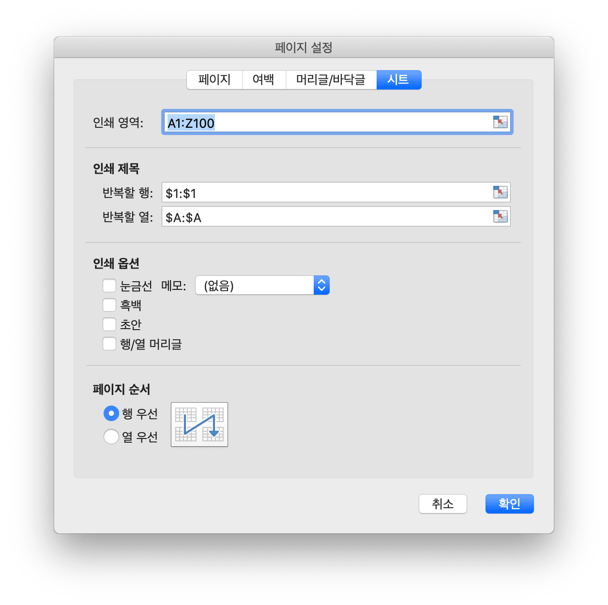

# 통합 문서

Options 는 열려있는 스프레드 시트에 대한 옵션을 정의합니다.

```go
type Options struct {
    Password       string
    UnzipSizeLimit int64
}
```

## Excel 문서 만들기 {#NewFile}

```go
func NewFile() *File
```

`NewFile` 을 사용 하 여 새 Excel 통합 문서를 만들고 새로 만든 통합 문서에는 기본적으로 `Sheet1` 이라는 워크시트가 포함 됩니다.

## 열기 {#OpenFile}

```go
func OpenFile(filename string, opt ...Options) (*File, error)
```

`OpenFile` 을 사용 하 여 기존 Excel 문서를 엽니다. 예를 들어, 암호로 보호 된 스프레드 시트를 엽니 다:

```go
f, err := excelize.OpenFile("Book1.xlsx", excelize.Options{Password: "password"})
if err != nil {
    return
}
```

Excelize 는 현재 암호화를 지원하지 않고 해독 만 지원하므로 [`Save()`](workbook.md#Save) 및 [`SaveAs()`](workbook.md#SaveAs) 로 저장된 스프레드 시트는 보호되지 않은 암호가 없습니다.

`UnzipSizeLimit` 은 스프레드시트를 열 때 압축 해제 크기 제한을 바이트 단위로 지정했으며 기본 크기 제한은 16GB 입니다.

## 열린 데이터 스트림 {#OpenReader}

```go
func OpenReader(r io.Reader, opt ...Options) (*File, error)
```

OpenReader 는 `io.Reader` 에서 데이터 스트림을 읽고 채워진 스프레드 시트 파일을 반환합니다.

예를 들어, 업로드 템플리트를 처리 할 HTTP 서버를 작성한 후 새 워크 시트가 추가 된 응답 다운로드 파일:

```go
package main

import (
    "fmt"
    "net/http"

    "github.com/xuri/excelize/v2"
)

func process(w http.ResponseWriter, req *http.Request) {
    file, _, err := req.FormFile("file")
    if err != nil {
        fmt.Fprintf(w, err.Error())
        return
    }
    defer file.Close()
    f, err := excelize.OpenReader(file)
    if err != nil {
        fmt.Fprintf(w, err.Error())
        return
    }
    f.NewSheet("NewSheet")
    w.Header().Set("Content-Disposition", "attachment; filename=Book1.xlsx")
    w.Header().Set("Content-Type", req.Header.Get("Content-Type"))
    if _, err := f.WriteTo(w); err != nil {
        fmt.Fprintf(w, err.Error())
    }
    return
}

func main() {
    http.HandleFunc("/process", process)
    http.ListenAndServe(":8090", nil)
}
```

cURL 로 테스트:

```bash
curl --location --request GET 'http://127.0.0.1:8090/process' \
--form 'file=@/tmp/template.xlsx' -O -J
curl: Saved to filename 'Book1.xlsx'
```

## 저장 {#Save}

```go
func (f *File) Save() error
```

`Save` 을 사용 하 여 Excel 문서에 대 한 편집 내용을 저장 합니다.

## 다른 이름으로 저장 {#SaveAs}

```go
func (f *File) SaveAs(name string) error
```

Excel 문서를 지정 된 파일로 저장 하려면 `SaveAs` 를 사용 하십시오.

## 워크 시트 만들기 {#NewSheet}

```go
func (f *File) NewSheet(name string) int
```

NewSheet 는 워크 시트 이름을 지정하여 새 시트를 만드는 기능을 제공하고 추가 된 후 통합 문서 (스프레드 시트)의 시트 인덱스를 반환합니다. 새 스프레드 시트 파일을 만들 때 `Sheet1` 이라는 기본 워크 시트가 생성됩니다.

## 워크 시트 삭제 {#DeleteSheet}

```go
func (f *File) DeleteSheet(name string)
```

지정 된 워크시트 이름을 기반으로 지정한 워크시트를 삭제 합니다. 이 메서드는 삭제 된 워크시트와 관련 된 수식, 참조, 차트 및 기타 요소에 영향을 주는 주의 해 서 사용 해야 합니다. 삭제 된 워크시트에서 값을 참조 하는 다른 구성 요소가 있는 경우 오류 프롬프트가 발생 하 고 통합 문서를 열지 못하게 됩니다. 하나의 워크시트가 통합 문서에 포함 된 경우이 메서드를 호출 해도 유효 하지 않습니다.

## 워크 시트 복사 {#CopySheet}

```go
func (f *File) CopySheet(from, to int) error
```

대상 워크시트 인덱스에는 지정 된 복사 된 워크시트와 워크시트를 복사 하는 대상 워크시트 인덱스에 따라 개발자가 이미 존재 하는지 확인 해야 합니다. 셀 값과 수식이 포함 된 워크시트 간의 복제는 현재 지원 되며 테이블, 그림, 차트 및 피벗 테이블과 같은 요소를 포함 하는 워크시트 간의 복제를 지원 하지 않습니다.

```go
// Sheet1 이름이 있는 워크시트가 이미 있습니다 ...
index := f.NewSheet("Sheet2")
err := f.CopySheet(1, index)
return err
```

## 워크 시트 배경 {#SetSheetBackground}

```go
func (f *File) SetSheetBackground(sheet, picture string) error
```

지정 된 워크시트 이름과 그림 주소를 기준으로 지정한 워크시트에 대 한 타일 효과의 배경 그림을 설정 합니다.

## 기본 워크 시트 설정 {#SetActiveSheet}

```go
func (f *File) SetActiveSheet(index int)
```

SetActiveSheet 는 지정된 인덱스로 통합 문서의 기본 활성 시트를 설정하는 기능을 제공합니다. 활성 인덱스는 [`GetSheetMap`](sheet.md#GetSheetMap) 함수가 리턴 한 ID와 다릅니다. 총 워크 시트 수보다 `0` 보다 크거나 같아야합니다.

## 활성 시트 색인 가져 오기 {#GetActiveSheetIndex}

```go
func (f *File) GetActiveSheetIndex() int
```

기본 워크시트의 인덱스를 가져오고 기본 워크시트를 찾을 수 없는 경우 `0` 을 반환 합니다.

## 워크 시트 가시성 설정 {#SetSheetVisible}

```go
func (f *File) SetSheetVisible(name string, visible bool) error
```

SetSheetVisible 은 지정된 워크 시트 이름으로 표시되는 워크 시트를 설정하는 함수를 제공합니다. 통합 문서에는 최소한 하나의 보이는 워크 시트가 있어야합니다. 지정된 워크 시트가 활성화 된 경우이 설정은 무효화됩니다. [SheetStateValues Enum](https://docs.microsoft.com/ko-kr/dotnet/api/documentformat.openxml.spreadsheet.sheetstatevalues?view=openxml-2.8.1) 에 정의 된 시트 상태 값:

|워크 시트 상태 값|
|---|
|visible|
|hidden|
|veryHidden|

예를 들어,`Sheet1` 을 숨 깁니다.

```go
err := f.SetSheetVisible("Sheet1", false)
```

## 워크 시트 가시성 확보 {#GetSheetVisible}

```go
func (f *File) GetSheetVisible(name string) bool
```

GetSheetVisible 은 주어진 워크 시트 이름으로 볼 수있는 워크 시트를 가져 오는 기능을 제공합니다. 예를 들어, `Sheet1` 의 표시 상태 가져 오기:

```go
f.GetSheetVisible("Sheet1")
```

## 워크 시트 형식 속성 설정 {#SetSheetFormatPr}

```go
func (f *File) SetSheetFormatPr(sheet string, opts ...SheetFormatPrOptions) error
```

SetSheetFormatPr 은 워크 시트 서식 속성을 설정하는 기능을 제공합니다.

사용 가능한 옵션:

선택적 형식 매개 변수 | 유형
---|---
BaseColWidth | uint8
DefaultColWidth | float64
DefaultRowHeight | float64
CustomHeight | bool
ZeroHeight | bool
ThickTop | bool
ThickBottom | bool

예를 들어, 워크 시트 행을 기본적으로 숨김으로 설정하십시오:

<p align="center"></p>

```go
f := excelize.NewFile()
const sheet = "Sheet1"
if err := f.SetSheetFormatPr("Sheet1", excelize.ZeroHeight(true)); err != nil {
    fmt.Println(err)
}
if err := f.SetRowVisible("Sheet1", 10, true); err != nil {
    fmt.Println(err)
}
f.SaveAs("Book1.xlsx")
```

## 워크 시트 형식 속성 가져 오기 {#GetSheetFormatPr}

```go
func (f *File) GetSheetFormatPr(sheet string, opts ...SheetFormatPrOptionsPtr) error
```

GetSheetFormatPr 은 워크 시트 서식 속성을 가져 오는 기능을 제공합니다.

사용 가능한 옵션:

선택적 형식 매개 변수 | 유형
---|---
BaseColWidth | uint8
DefaultColWidth | float64
DefaultRowHeight | float64
CustomHeight | bool
ZeroHeight | bool
ThickTop | bool
ThickBottom | bool

예를 들면:

```go
f := excelize.NewFile()
const sheet = "Sheet1"

var (
    baseColWidth     excelize.BaseColWidth
    defaultColWidth  excelize.DefaultColWidth
    defaultRowHeight excelize.DefaultRowHeight
    customHeight     excelize.CustomHeight
    zeroHeight       excelize.ZeroHeight
    thickTop         excelize.ThickTop
    thickBottom      excelize.ThickBottom
)

if err := f.GetSheetFormatPr(sheet,
    &baseColWidth,
    &defaultColWidth,
    &defaultRowHeight,
    &customHeight,
    &zeroHeight,
    &thickTop,
    &thickBottom,
); err != nil {
    fmt.Println(err)
}
fmt.Println("Defaults:")
fmt.Println("- baseColWidth:", baseColWidth)
fmt.Println("- defaultColWidth:", defaultColWidth)
fmt.Println("- defaultRowHeight:", defaultRowHeight)
fmt.Println("- customHeight:", customHeight)
fmt.Println("- zeroHeight:", zeroHeight)
fmt.Println("- thickTop:", thickTop)
fmt.Println("- thickBottom:", thickBottom)
```

출력 가져오기:

```text
Defaults:
- baseColWidth: 0
- defaultColWidth: 0
- defaultRowHeight: 15
- customHeight: false
- zeroHeight: false
- thickTop: false
- thickBottom: false
```

## 워크 시트보기 속성 설정 {#SetSheetViewOptions}

```go
func (f *File) SetSheetViewOptions(name string, viewIndex int, opts ...SheetViewOption) error
```

SetSheetViewOptions 는 시트보기 옵션을 설정합니다. `viewIndex` 는 음수 일 수 있으며, 그럴 경우 역으로 계산됩니다 (`-1` 이 마지막보기).

선택적 뷰 매개 변수 | 유형
---|---
DefaultGridColor|bool
RightToLeft|bool
ShowFormulas|bool
ShowGridLines|bool
ShowRowColHeaders|bool
ZoomScale|float64
TopLeftCell|string
ShowZeros|bool

- 예 1:

```go
err = f.SetSheetViewOptions("Sheet1", -1, ShowGridLines(false))
```

- 예 2:

```go
f := excelize.NewFile()
const sheet = "Sheet1"

if err := f.SetSheetViewOptions(sheet, 0,
    excelize.DefaultGridColor(false),
    excelize.RightToLeft(false),
    excelize.ShowFormulas(true),
    excelize.ShowGridLines(true),
    excelize.ShowRowColHeaders(true),
    excelize.ZoomScale(80),
    excelize.TopLeftCell("C3"),
); err != nil {
    fmt.Println(err)
}

var zoomScale excelize.ZoomScale
fmt.Println("Default:")
fmt.Println("- zoomScale: 80")

if err := f.SetSheetViewOptions(sheet, 0, excelize.ZoomScale(500)); err != nil {
    fmt.Println(err)
}

if err := f.GetSheetViewOptions(sheet, 0, &zoomScale); err != nil {
    fmt.Println(err)
}

fmt.Println("Used out of range value:")
fmt.Println("- zoomScale:", zoomScale)

if err := f.SetSheetViewOptions(sheet, 0, excelize.ZoomScale(123)); err != nil {
    fmt.Println(err)
}

if err := f.GetSheetViewOptions(sheet, 0, &zoomScale); err != nil {
    fmt.Println(err)
}

fmt.Println("Used correct value:")
fmt.Println("- zoomScale:", zoomScale)
```

출력 가져오기:

```text
Default:
- zoomScale: 80
Used out of range value:
- zoomScale: 80
Used correct value:
- zoomScale: 123
```

## 워크 시트 뷰 속성 가져 오기 {#GetSheetViewOptions}

```go
func (f *File) GetSheetViewOptions(name string, viewIndex int, opts ...SheetViewOptionPtr) error
```

지정 된 워크 시트 이름, 뷰 인덱스 및 뷰 매개 변수를 기반으로 워크 시트 보기 속성 가져 오기, `viewIndex` 가 음수 이면 역방향으로 계산 됩니다 (`-1` 은 마지막 보기를 나타냄).

선택적 뷰 매개 변수 | 유형
---|---
DefaultGridColor|bool
RightToLeft|bool
ShowFormulas|bool
ShowGridLines|bool
ShowRowColHeaders|bool
ZoomScale|float64
TopLeftCell|string
ShowZeros|bool

- 예 1: `Sheet1` 이라는 워크 시트의 마지막 뷰에 대 한 그리드 선 특성 설정을 가져옵니다.

```go
var showGridLines excelize.ShowGridLines
err = f.GetSheetViewOptions("Sheet1", -1, &showGridLines)
```

- 예 2:

```go
f := excelize.NewFile()
const sheet = "Sheet1"

var (
    defaultGridColor  excelize.DefaultGridColor
    rightToLeft       excelize.RightToLeft
    showFormulas      excelize.ShowFormulas
    showGridLines     excelize.ShowGridLines
    showZeros         excelize.ShowZeros
    showRowColHeaders excelize.ShowRowColHeaders
    zoomScale         excelize.ZoomScale
    topLeftCell       excelize.TopLeftCell
)

if err := f.GetSheetViewOptions(sheet, 0,
    &defaultGridColor,
    &rightToLeft,
    &showFormulas,
    &showGridLines,
    &showZeros,
    &showRowColHeaders,
    &zoomScale,
    &topLeftCell,
); err != nil {
    fmt.Println(err)
}

fmt.Println("Default:")
fmt.Println("- defaultGridColor:", defaultGridColor)
fmt.Println("- rightToLeft:", rightToLeft)
fmt.Println("- showFormulas:", showFormulas)
fmt.Println("- showGridLines:", showGridLines)
fmt.Println("- showZeros:", showZeros)
fmt.Println("- showRowColHeaders:", showRowColHeaders)
fmt.Println("- zoomScale:", zoomScale)
fmt.Println("- topLeftCell:", `"`+topLeftCell+`"`)

if err := f.SetSheetViewOptions(sheet, 0, excelize.TopLeftCell("B2")); err != nil {
    fmt.Println(err)
}

if err := f.GetSheetViewOptions(sheet, 0, &topLeftCell); err != nil {
    fmt.Println(err)
}

if err := f.SetSheetViewOptions(sheet, 0, excelize.ShowGridLines(false)); err != nil {
    fmt.Println(err)
}

if err := f.GetSheetViewOptions(sheet, 0, &showGridLines); err != nil {
    fmt.Println(err)
}

if err := f.SetSheetViewOptions(sheet, 0, excelize.ShowZeros(false)); err != nil {
    fmt.Println(err)
}

if err := f.GetSheetViewOptions(sheet, 0, &showZeros); err != nil {
    fmt.Println(err)
}

fmt.Println("After change:")
fmt.Println("- showGridLines:", showGridLines)
fmt.Println("- showZeros:", showZeros)
fmt.Println("- topLeftCell:", topLeftCell)
```

출력 가져오기:

```text
Default:
- defaultGridColor: true
- rightToLeft: false
- showFormulas: false
- showGridLines: true
- showZeros: true
- showRowColHeaders: true
- zoomScale: 0
- topLeftCell: ""
After change:
- showGridLines: false
- showZeros: false
- topLeftCell: B2
```

## 워크 시트 페이지 레이아웃 설정 {#SetPageLayout}

```go
func (f *File) SetPageLayout(sheet string, opts ...PageLayoutOption) error
```

지정 된 워크시트 이름 및 페이지 레이아웃 매개 변수를 기반으로 워크시트의 페이지 레이아웃 속성을 설정 합니다. 현재 설정에 대해 지원 되는 페이지 레이아웃 속성:

- `BlackAndWhite` 방법을 사용하여 단색 인쇄 `true` 또는 `false` 를 설정합니다. 기본값은 `false` 입니다.

- `FirstPageNumber` 방법을 사용하여 페이지 시작 페이지 번호를 기본값으로 설정합니다.

- `PageLayoutOrientation` 메서드로 페이지 레이아웃 방향 설정, 기본 페이지 레이아웃 방향은 "세로" 입니다. 다음 표는 Excelize 에서 페이지 레이아웃 방향의 `PageLayoutOrientation` 매개 변수 목록입니다:

매개 변수 | 방향
---|---
OrientationPortrait | 세로
OrientationLandscape | 가로

- `PageLayoutPaperSize` 방법을 사용 하 여 페이지 용지의 크기를 설정 합니다, 기본 페이지 레이아웃 크기는 "Letter paper (8.5 in. by 11 in.)" 입니다. 다음 표는 excel에서 페이지 레이아웃 크기와 인덱스 `PageLayoutPaperSize` 매개 변수를 비교한 것입니다:

색인 | 용지 크기
---|---
1   | Letter paper (8.5 in. × 11 in.)
2   | Letter small paper (8.5 in. × 11 in.)
3   | Tabloid paper (11 in. × 17 in.)
4   | Ledger paper (17 in. × 11 in.)
5   | Legal paper (8.5 in. × 14 in.)
6   | Statement paper (5.5 in. × 8.5 in.)
7   | Executive paper (7.25 in. × 10.5 in.)
8   | A3 paper (297 mm × 420 mm)
9   | A4 paper (210 mm × 297 mm)
10  | A4 small paper (210 mm × 297 mm)
11  | A5 paper (148 mm × 210 mm)
12  | B4 paper (250 mm × 353 mm)
13  | B5 paper (176 mm × 250 mm)
14  | Folio paper (8.5 in. × 13 in.)
15  | Quarto paper (215 mm × 275 mm)
16  | Standard paper (10 in. × 14 in.)
17  | Standard paper (11 in. × 17 in.)
18  | Note paper (8.5 in. × 11 in.)
19  | #9 envelope (3.875 in. × 8.875 in.)
20  | #10 envelope (4.125 in. × 9.5 in.)
21  | #11 envelope (4.5 in. × 10.375 in.)
22  | #12 envelope (4.75 in. × 11 in.)
23  | #14 envelope (5 in. × 11.5 in.)
24  | C paper (17 in. × 22 in.)
25  | D paper (22 in. × 34 in.)
26  | E paper (34 in. × 44 in.)
27  | DL envelope (110 mm × 220 mm)
28  | C5 envelope (162 mm × 229 mm)
29  | C3 envelope (324 mm × 458 mm)
30  | C4 envelope (229 mm × 324 mm)
31  | C6 envelope (114 mm × 162 mm)
32  | C65 envelope (114 mm × 229 mm)
33  | B4 envelope (250 mm × 353 mm)
34  | B5 envelope (176 mm × 250 mm)
35  | B6 envelope (176 mm × 125 mm)
36  | Italy envelope (110 mm × 230 mm)
37  | Monarch envelope (3.875 in. × 7.5 in.).
38  | 6¾ envelope (3.625 in. × 6.5 in.)
39  | US standard fanfold (14.875 in. × 11 in.)
40  | German standard fanfold (8.5 in. × 12 in.)
41  | German legal fanfold (8.5 in. × 13 in.)
42  | ISO B4 (250 mm × 353 mm)
43  | Japanese postcard (100 mm × 148 mm)
44  | Standard paper (9 in. × 11 in.)
45  | Standard paper (10 in. × 11 in.)
46  | Standard paper (15 in. × 11 in.)
47  | Invite envelope (220 mm × 220 mm)
50  | Letter extra paper (9.275 in. × 12 in.)
51  | Legal extra paper (9.275 in. × 15 in.)
52  | Tabloid extra paper (11.69 in. × 18 in.)
53  | A4 extra paper (236 mm × 322 mm)
54  | Letter transverse paper (8.275 in. × 11 in.)
55  | A4 transverse paper (210 mm × 297 mm)
56  | Letter extra transverse paper (9.275 in. × 12 in.)
57  | SuperA/SuperA/A4 paper (227 mm × 356 mm)
58  | SuperB/SuperB/A3 paper (305 mm × 487 mm)
59  | Letter plus paper (8.5 in. × 12.69 in.)
60  | A4 plus paper (210 mm × 330 mm)
61  | A5 transverse paper (148 mm × 210 mm)
62  | JIS B5 transverse paper (182 mm × 257 mm)
63  | A3 extra paper (322 mm × 445 mm)
64  | A5 extra paper (174 mm × 235 mm)
65  | ISO B5 extra paper (201 mm × 276 mm)
66  | A2 paper (420 mm × 594 mm)
67  | A3 transverse paper (297 mm × 420 mm)
68  | A3 extra transverse paper (322 mm × 445 mm)
69  | Japanese Double Postcard (200 mm × 148 mm)
70  | A6 (105 mm × 148 mm)
71  | Japanese Envelope Kaku #2
72  | Japanese Envelope Kaku #3
73  | Japanese Envelope Chou #3
74  | Japanese Envelope Chou #4
75  | Letter Rotated (11 × 8½ in.)
76  | A3 Rotated (420 mm × 297 mm)
77  | A4 Rotated (297 mm × 210 mm)
78  | A5 Rotated (210 mm × 148 mm)
79  | B4 (JIS) Rotated (364 mm × 257 mm)
80  | B5 (JIS) Rotated (257 mm × 182 mm)
81  | Japanese Postcard Rotated (148 mm × 100 mm)
82  | Double Japanese Postcard Rotated (148 mm × 200 mm)
83  | A6 Rotated (148 mm × 105 mm)
84  | Japanese Envelope Kaku #2 Rotated
85  | Japanese Envelope Kaku #3 Rotated
86  | Japanese Envelope Chou #3 Rotated
87  | Japanese Envelope Chou #4 Rotated
88  | B6 (JIS) (128 mm × 182 mm)
89  | B6 (JIS) Rotated (182 mm × 128 mm)
90  | (12 in × 11 in)
91  | Japanese Envelope You #4
92  | Japanese Envelope You #4 Rotated
93  | PRC 16K (146 mm × 215 mm)
94  | PRC 32K (97 mm × 151 mm)
95  | PRC 32K(Big) (97 mm × 151 mm)
96  | PRC Envelope #1 (102 mm × 165 mm)
97  | PRC Envelope #2 (102 mm × 176 mm)
98  | PRC Envelope #3 (125 mm × 176 mm)
99  | PRC Envelope #4 (110 mm × 208 mm)
100 | PRC Envelope #5 (110 mm × 220 mm)
101 | PRC Envelope #6 (120 mm × 230 mm)
102 | PRC Envelope #7 (160 mm × 230 mm)
103 | PRC Envelope #8 (120 mm × 309 mm)
104 | PRC Envelope #9 (229 mm × 324 mm)
105 | PRC Envelope #10 (324 mm × 458 mm)
106 | PRC 16K Rotated
107 | PRC 32K Rotated
108 | PRC 32K(Big) Rotated
109 | PRC Envelope #1 Rotated (165 mm × 102 mm)
110 | PRC Envelope #2 Rotated (176 mm × 102 mm)
111 | PRC Envelope #3 Rotated (176 mm × 125 mm)
112 | PRC Envelope #4 Rotated (208 mm × 110 mm)
113 | PRC Envelope #5 Rotated (220 mm × 110 mm)
114 | PRC Envelope #6 Rotated (230 mm × 120 mm)
115 | PRC Envelope #7 Rotated (230 mm × 160 mm)
116 | PRC Envelope #8 Rotated (309 mm × 120 mm)
117 | PRC Envelope #9 Rotated (324 mm × 229 mm)
118 | PRC Envelope #10 Rotated (458 mm × 324 mm)

- `FitToHeight` 방법을 사용하여 페이지 확대/축소 조정 페이지 너비를 기본값으로 설정합니다.

- `FitToWidth` 메서드를 사용하여 페이지 확대/축소 조정 페이지 높이 (기본값 `1`) 를 설정합니다.

- `PageLayoutScale` 메서드를 사용하여 페이지 배율을 10 에서 400, 즉 10%에서 400%로 설정하고 기본값은 `100` 일반 크기입니다.

- 예를 들어 `Sheet1` 이라는 시트 페이지 레이아웃을 단색 인쇄로 설정하고, 시작 페이지 번호를 `2` 로 설정하고, 가로로, A4(작은) 210× 297mm 용지 사용, 너비 2, 높이 2페이지 및 배율 50% 로 조정합니다.

```go
f := excelize.NewFile()
if err := f.SetPageLayout(
    "Sheet1",
    excelize.BlackAndWhite(true),
    excelize.FirstPageNumber(2),
    excelize.PageLayoutOrientation(excelize.OrientationLandscape),
    excelize.PageLayoutPaperSize(10),
    excelize.FitToHeight(2),
    excelize.FitToWidth(2),
    excelize.PageLayoutScale(50),
); err != nil {
    fmt.Println(err)
}
```

## 워크 시트 페이지 레이아웃 가져 오기 {#GetPageLayout}

```go
func (f *File) GetPageLayout(sheet string, opts ...PageLayoutOptionPtr) error
```

지정 된 워크시트 이름 및 페이지 레이아웃 매개 변수를 기반으로 워크시트의 페이지 레이아웃 속성을 가져옵니다.

- `PageLayoutOrientation` 방법으로 페이지 레이아웃 방향 가져오기
- `PageLayoutPaperSize` 방법으로 페이지 용지 크기 가져오기

예를 들어 `Sheet1` 이라는 워크시트 페이지 레이아웃 설정을 가져옵니다:

```go
f := excelize.NewFile()
const sheet = "Sheet1"
var (
    orientation excelize.PageLayoutOrientation
    paperSize   excelize.PageLayoutPaperSize
)
if err := f.GetPageLayout("Sheet1", &orientation); err != nil {
    fmt.Println(err)
}
if err := f.GetPageLayout("Sheet1", &paperSize); err != nil {
    fmt.Println(err)
}
fmt.Println("Defaults:")
fmt.Printf("- orientation: %q\n", orientation)
fmt.Printf("- paper size: %d\n", paperSize)
```

출력:

```text
Defaults:
- orientation: "portrait"
- paper size: 1
```

## 워크 시트 페이지 여백 설정 {#SetPageMargins}

```go
func (f *File) SetPageMargins(sheet string, opts ...PageMarginsOptions) error
```

SetPageMargins 는 워크 시트 페이지 여백을 설정하는 기능을 제공합니다. 사용 가능한 옵션:

옵션|유형
---|---
PageMarginBotom|float64
PageMarginFooter|float64
PageMarginHeader|float64
PageMarginLeft|float64
PageMarginRight|float64
PageMarginTop|float64

- 예를 들어 `Sheet1` 의 페이지 여백을 설정하십시오:

```go
f := excelize.NewFile()
const sheet = "Sheet1"

if err := f.SetPageMargins(sheet,
    excelize.PageMarginBottom(1.0),
    excelize.PageMarginFooter(1.0),
    excelize.PageMarginHeader(1.0),
    excelize.PageMarginLeft(1.0),
    excelize.PageMarginRight(1.0),
    excelize.PageMarginTop(1.0),
); err != nil {
    fmt.Println(err)
}
```

## 워크 시트 페이지 여백 가져 오기 {#GetPageMargins}

GetPageMargins 는 워크 시트 페이지 여백을 얻는 기능을 제공합니다. 사용 가능한 옵션:

옵션|유형
---|---
PageMarginBotom|float64
PageMarginFooter|float64
PageMarginHeader|float64
PageMarginLeft|float64
PageMarginRight|float64
PageMarginTop|float64

- 예를 들어 `Sheet1` 의 페이지 여백을 가져옵니다:

```go
f := excelize.NewFile()
const sheet = "Sheet1"

var (
    marginBottom excelize.PageMarginBottom
    marginFooter excelize.PageMarginFooter
    marginHeader excelize.PageMarginHeader
    marginLeft   excelize.PageMarginLeft
    marginRight  excelize.PageMarginRight
    marginTop    excelize.PageMarginTop
)

if err := f.GetPageMargins(sheet,
    &marginBottom,
    &marginFooter,
    &marginHeader,
    &marginLeft,
    &marginRight,
    &marginTop,
); err != nil {
    fmt.Println(err)
}
fmt.Println("Defaults:")
fmt.Println("- marginBottom:", marginBottom)
fmt.Println("- marginFooter:", marginFooter)
fmt.Println("- marginHeader:", marginHeader)
fmt.Println("- marginLeft:", marginLeft)
fmt.Println("- marginRight:", marginRight)
fmt.Println("- marginTop:", marginTop)
```

출력:

```text
Defaults:
- marginBottom: 0.75
- marginFooter: 0.3
- marginHeader: 0.3
- marginLeft: 0.7
- marginRight: 0.7
- marginTop: 0.75
```

## 머리글 및 바닥 글 설정 {#SetHeaderFooter}

```go
func (f *File) SetHeaderFooter(sheet string, settings *FormatHeaderFooter) error
```

SetHeaderFooter 는 주어진 워크 시트 이름과 제어 문자로 머리글과 바닥 글을 설정하는 기능을 제공합니다.

머리글과 바닥 글은 다음 설정 필드를 사용하여 지정됩니다.

Fields           | Description
---|---
AlignWithMargins | Align header footer margins with page margins
DifferentFirst   | Different first-page header and footer indicator
DifferentOddEven | Different odd and even page headers and footers indicator
ScaleWithDoc     | Scale header and footer with document scaling
OddFooter        | Odd Page Footer
OddHeader        | Odd Header
EvenFooter       | Even Page Footer
EvenHeader       | Even Page Header
FirstFooter      | First Page Footer
FirstHeader      | First Page Header

다음 형식 코드는 6 개의 문자열 형식 필드에서 사용할 수 있습니다: `OddHeader`, `OddFooter`, `EvenHeader`, `EvenFooter`, `FirstFooter`, `FirstHeader`

<table>
    <thead>
        <tr>
            <th>Formatting Code</th>
            <th>Description</th>
        </tr>
    </thead>
    <tbody>
        <tr>
            <td><code>&amp;&amp;</code></td>
            <td>The character &quot;&amp;&quot;</td>
        </tr>
        <tr>
            <td><code>&amp;font-size</code></td>
            <td>Size of the text font, where font-size is a decimal font size in points</td>
        </tr>
        <tr>
            <td><code>&amp;&quot;font name,font type&quot;</code></td>
            <td>A text font-name string, font name, and a text font-type string, font type</td>
        </tr>
        <tr>
            <td><code>&amp;&quot;-,Regular&quot;</code></td>
            <td>Regular text format. Toggles bold and italic modes to off</td>
        </tr>
        <tr>
            <td><code>&amp;A</code></td>
            <td>Current worksheet&#39;s tab name</td>
        </tr>
        <tr>
            <td><code>&amp;B</code> or <code>&amp;&quot;-,Bold&quot;</code></td>
            <td>Bold text format, from off to on, or vice versa. The default mode is off</td>
        </tr>
        <tr>
            <td><code>&amp;D</code></td>
            <td>Current date</td>
        </tr>
        <tr>
            <td><code>&amp;C</code></td>
            <td>Center section</td>
        </tr>
        <tr>
            <td><code>&amp;E</code></td>
            <td>Double-underline text format</td>
        </tr>
        <tr>
            <td><code>&amp;F</code></td>
            <td>Current workbook&#39;s file name</td>
        </tr>
        <tr>
            <td><code>&amp;G</code></td>
            <td>Drawing object as background</td>
        </tr>
        <tr>
            <td><code>&amp;H</code></td>
            <td>Shadow text format</td>
        </tr>
        <tr>
            <td><code>&amp;I</code> or <code>&amp;&quot;-,Italic&quot;</code></td>
            <td>Italic text format</td>
        </tr>
        <tr>
            <td><code>&amp;K</code></td>
            <td>Text font color<br>An RGB Color is specified as RRGGBB<br>A Theme Color is specified as TTSNNN where TT is the theme color Id, S is either &quot;+&quot; or &quot;-&quot; of the tint/shade value, and NNN is the tint/shade value</td>
        </tr>
        <tr>
            <td><code>&amp;L</code></td>
            <td>Left section</td>
        </tr>
        <tr>
            <td><code>&amp;N</code></td>
            <td>Total number of pages</td>
        </tr>
        <tr>
            <td><code>&amp;O</code></td>
            <td>Outline text format</td>
        </tr>
        <tr>
            <td><code>&amp;P[[+\|-]n]</code></td>
            <td>Without the optional suffix, the current page number in decimal</td>
        </tr>
        <tr>
            <td><code>&amp;R</code></td>
            <td>Right section</td>
        </tr>
        <tr>
            <td><code>&amp;S</code></td>
            <td>Strikethrough text format</td>
        </tr>
        <tr>
            <td><code>&amp;T</code></td>
            <td>Current time</td>
        </tr>
        <tr>
            <td><code>&amp;U</code></td>
            <td>Single-underline text format. If double-underline mode is on, the next occurrence in a section specifier toggles double-underline mode to off; otherwise, it toggles single-underline mode, from off to on, or vice versa. The default mode is off</td>
        </tr>
        <tr>
            <td><code>&amp;X</code></td>
            <td>Superscript text format</td>
        </tr>
        <tr>
            <td><code>&amp;Y</code></td>
            <td>Subscript text format</td>
        </tr>
        <tr>
            <td><code>&amp;Z</code></td>
            <td>Current workbook&#39;s file path</td>
        </tr>
    </tbody>
</table>

예:

```go
err := f.SetHeaderFooter("Sheet1", &excelize.FormatHeaderFooter{
    DifferentFirst:   true,
    DifferentOddEven: true,
    OddHeader:        "&R&P",
    OddFooter:        "&C&F",
    EvenHeader:       "&L&P",
    EvenFooter:       "&L&D&R&T",
    FirstHeader:      `&CCenter &"-,Bold"Bold&"-,Regular"HeaderU+000A&D`,
})
```

이 예는 다음과 같습니다:

- 첫 페이지에는 고유 한 머리말과 꼬리말이 있습니다.
- 홀수 페이지와 짝수 페이지는 서로 다른 머리글과 바닥 글을 가지고 있습니다.
- 홀수 페이지 헤더의 오른쪽 섹션에있는 현재 페이지 번호
홀수 페이지 바닥 글의 가운데 섹션에있는 현재 통합 문서의 파일 이름
- 짝수 페이지 헤더의 왼쪽 섹션에있는 현재 페이지 번호
- 왼쪽 섹션의 현재 날짜와 짝수 페이지 바닥 글의 오른쪽 섹션의 현재 시간
- 첫 번째 페이지의 가운데 섹션의 첫 번째 줄에있는 텍스트 "Center Bold Header"과 같은 페이지의 가운데 섹션의 두 번째 줄에있는 날짜
- 첫 페이지에 꼬리말 없음

## 이름 설정 {#SetDefinedName}

```go
func (f *File) SetDefinedName(definedName *DefinedName) error
```

지정된 이름과 범위를 기반으로 이름을 설정합니다. 기본 범위는 통합 문서입니다. 예:

```go
f.SetDefinedName(&excelize.DefinedName{
    Name:     "Amount",
    RefersTo: "Sheet1!$A$2:$D$5",
    Comment:  "defined name comment",
    Scope:    "Sheet2",
})
```

워크 시트의 인쇄 영역 및 인쇄 제목 설정:

<p align="center"></p>

```go
f.SetDefinedName(&excelize.DefinedName{
    Name:     "_xlnm.Print_Area",
    RefersTo: "Sheet1!$A$1:$Z$100",
    Scope:    "Sheet1",
})
f.SetDefinedName(&excelize.DefinedName{
    Name:     "_xlnm.Print_Titles",
    RefersTo: "Sheet1!$A:$A,Sheet1!$1:$1",
    Scope:    "Sheet1",
})
```

## 이름 가져 오기 {#GetDefinedName}

```go
func (f *File) GetDefinedName() []DefinedName
```

범위에있는 통합 문서 및 워크 시트의 이름 목록을 얻습니다.

## 정의 된 이름 삭제 {#DeleteDefinedName}

```go
func (f *File) DeleteDefinedName(definedName *DefinedName) error
```

DeleteDefinedName 은 통합 문서 또는 워크 시트의 정의 된 이름을 삭제하는 기능을 제공합니다. 범위를 지정하지 않으면 기본 범위는 통합 문서입니다. 예를 들면 다음과 같습니다:

```go
f.DeleteDefinedName(&excelize.DefinedName{
    Name:     "Amount",
    Scope:    "Sheet2",
})
```

## 통합 문서 속성 설정 {#SetDocProps}

```go
func (f *File) SetDocProps(docProperties *DocProperties) error
```

통합 문서의 핵심 속성을 설정합니다. 설정할 수있는 속성은 다음과 같습니다:

속성            | 기술
---|---
Title          | 리소스에 지정된 이름입니다.
Subject        | 자원 내용의 주제.
Creator        | 자원의 내용을 만드는 일을 주로 담당하는 주체.
Keywords       | 검색 및 색인 생성을 지원하는 구분 된 키워드 집합입니다. 일반적으로 속성의 다른 곳에서는 사용할 수없는 용어 목록입니다.
Description    | 자원의 내용에 대한 설명.
LastModifiedBy | 마지막 수정을 수행 한 사용자입니다. 식별은 환경에 따라 다릅니다.
Language       | 자원의 지적 내용의 언어.
Identifier     | 지정된 컨텍스트 내의 리소스에 대한 모호하지 않은 참조입니다.
Revision       | 자원 내용의 주제.
ContentStatus  | 내용의 상태. 예: "Draft", "Reviewed" 및 "Final"
Category       | 이 패키지의 내용을 분류합니다.
Version        | 버전 번호. 이 값은 사용자 또는 응용 프로그램에 의해 설정됩니다.

예:

```go
err := f.SetDocProps(&excelize.DocProperties{
    Category:       "category",
    ContentStatus:  "Draft",
    Created:        "2019-06-04T22:00:10Z",
    Creator:        "Go Excelize",
    Description:    "This file created by Go Excelize",
    Identifier:     "xlsx",
    Keywords:       "Spreadsheet",
    LastModifiedBy: "Go Author",
    Modified:       "2019-06-04T22:00:10Z",
    Revision:       "0",
    Subject:        "Test Subject",
    Title:          "Test Title",
    Language:       "en-US",
    Version:        "1.0.0",
})
```

## 통합 문서 속성 가져 오기 {#GetDocProps}

```go
func (f *File) GetDocProps() (*DocProperties, error)
```

통합 문서의 핵심 속성을 가져옵니다.
