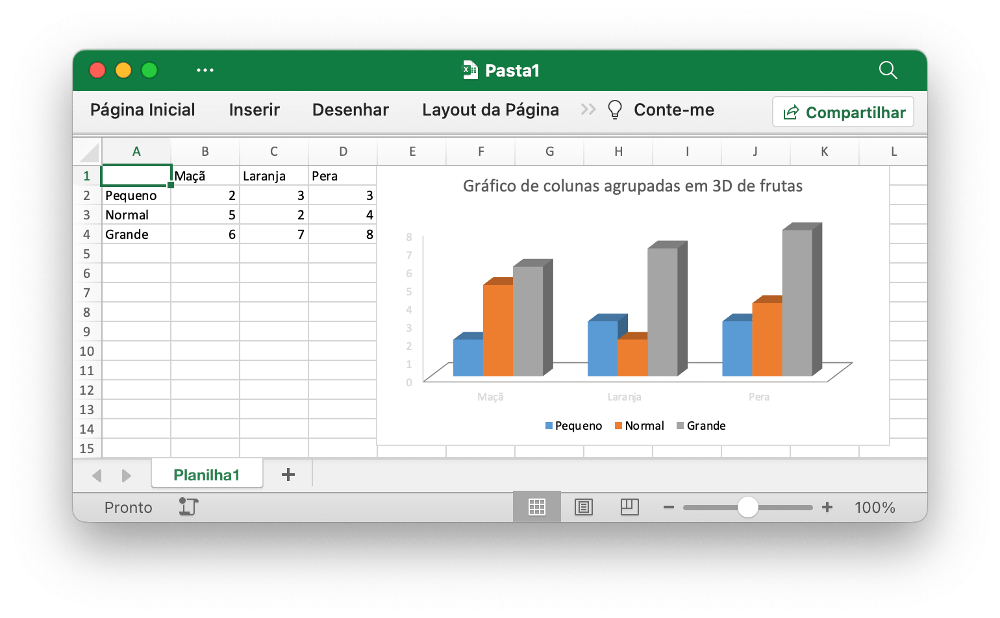

# Uso Básico

## Instalação {#install}

A tabela a seguir mostra os requisitos mínimos da linguagem Go com cada versão lançada do Excelize:

Versão Excelize | Requisitos mínimos de versão do idioma Go
---|---
v2.9.1 ~ master | 1.23.0
v2.8.1 ~ v2.9.0 | 1.18
v2.7.0 ~ v2.8.0 | 1.16
v2.4.0 ~ v2.6.1 | 1.15
v2.0.2 ~ v2.3.2 | 1.10
v1.0.0 ~ v2.0.1 | 1.6

Usar a versão mais recente da biblioteca Excelize requer Go versão 1.23.0 ou posterior. Observe que, existem [algumas alterações incompatíveis](https://github.com/golang/go/issues/61881) no Go 1.21.0, a biblioteca Excelize não pode funcionar normalmente com essa versão, se você estiver usando o Go 1.21.x, atualize para o Go 1.21.1 e versão posterior.

- Instalação

```bash
go get github.com/xuri/excelize
```

- Se o seu gerenciamento de pacotes for [Go Modules](https://go.dev/blog/using-go-modules), instale com o seguinte comando.

```bash
go get github.com/xuri/excelize/v2
```

## Atualização {#update}

- Atualizar para a versão estável mais recente

```bash
go get -u github.com/xuri/excelize/v2
```

- Atualizar para o código da ramificação de desenvolvimento mais recente

```bash
go get -u github.com/xuri/excelize/v2@master
```

## Crie uma planilha {#NewFile}

Aqui está um exemplo mínimo de uso que criará um arquivo de planilha:

```go
package main

import (
    "fmt"

    "github.com/xuri/excelize/v2"
)

func main() {
    f := excelize.NewFile()
    defer func() {
        if err := f.Close(); err != nil {
            fmt.Println(err)
        }
    }()
    // Crie uma nova planilha
    index, err := f.NewSheet("Planilha2")
    if err != nil {
        fmt.Println(err)
        return
    }
    // Defina o valor de uma célula.
    f.SetCellValue("Planilha2", "A2", "Olá Mundo.")
    if err := f.SetSheetName("Sheet1", "Planilha1"); err != nil {
        fmt.Println(err)
        return
    }
    f.SetCellValue("Planilha1", "B2", 100)
    // Defina a planilha ativa da pasta de trabalho.
    f.SetActiveSheet(index)
    // Salve a planilha pelo caminho indicado.
    if err := f.SaveAs("Pasta1.xlsx"); err != nil {
        fmt.Println(err)
    }
}
```

## Lendo uma planilha {#read}

O seguinte constitui o básico para ler um documento de planilha:

```go
package main

import (
    "fmt"

    "github.com/xuri/excelize/v2"
)

func main() {
    f, err := excelize.OpenFile("Pasta1.xlsx")
    if err != nil {
        fmt.Println(err)
        return
    }
    defer func() {
        // Feche a planilha.
        if err := f.Close(); err != nil {
            fmt.Println(err)
        }
    }()
    // Obtenha o valor da célula por determinado nome de planilha e referência de célula.
    cell, err := f.GetCellValue("Planilha1", "B2")
    if err != nil {
        fmt.Println(err)
        return
    }
    fmt.Println(cell)
    // Obtenha todas as linhas do Planilha1.
    rows, err := f.GetRows("Planilha1")
    if err != nil {
        fmt.Println(err)
        return
    }
    for _, row := range rows {
        for _, colCell := range row {
            fmt.Print(colCell, "\t")
        }
        fmt.Println()
    }
}
```

## Crie um gráfico em uma planilha {#chart}

Com o Excelize, a geração e o gerenciamento de gráficos são tão fáceis quanto algumas linhas de código. Você pode construir gráficos com base nos dados da sua planilha ou gerar gráficos sem nenhum dado na sua planilha.

<p align="center"></p>

```go
package main

import (
    "fmt"

    "github.com/xuri/excelize/v2"
)

func main() {
    f := excelize.NewFile()
    defer func() {
        if err := f.Close(); err != nil {
            fmt.Println(err)
        }
    }()
    if err := f.SetSheetName("Sheet1", "Planilha1"); err != nil {
        fmt.Println(err)
        return
    }
    for idx, row := range [][]interface{}{
        {nil, "Maçã", "Laranja", "Pera"}, {"Pequeno", 2, 3, 3},
        {"Normal", 5, 2, 4}, {"Grande", 6, 7, 8},
    } {
        cell, err := excelize.CoordinatesToCellName(1, idx+1)
        if err != nil {
            fmt.Println(err)
            return
        }
        f.SetSheetRow("Planilha1", cell, &row)
    }
    if err := f.AddChart("Planilha1", "E1", &excelize.Chart{
        Type: excelize.Col3DClustered,
        Series: []excelize.ChartSeries{
            {
                Name:       "Planilha1!$A$2",
                Categories: "Planilha1!$B$1:$D$1",
                Values:     "Planilha1!$B$2:$D$2",
            },
            {
                Name:       "Planilha1!$A$3",
                Categories: "Planilha1!$B$1:$D$1",
                Values:     "Planilha1!$B$3:$D$3",
            },
            {
                Name:       "Planilha1!$A$4",
                Categories: "Planilha1!$B$1:$D$1",
                Values:     "Planilha1!$B$4:$D$4",
            }},
        Title: []excelize.RichTextRun{
            {
                Text: "Gráfico de colunas agrupadas em 3D de frutas",
            },
        },
    }); err != nil {
        fmt.Println(err)
        return
    }
    // Salve a planilha pelo caminho indicado.
    if err := f.SaveAs("Pasta1.xlsx"); err != nil {
        fmt.Println(err)
    }
}
```

## Inserir imagem na planilha {#image}

```go
package main

import (
    "fmt"
    _ "image/gif"
    _ "image/jpeg"
    _ "image/png"

    "github.com/xuri/excelize/v2"
)

func main() {
    f, err := excelize.OpenFile("Pasta1.xlsx")
    if err != nil {
        fmt.Println(err)
        return
    }
    defer func() {
        // Feche a planilha.
        if err := f.Close(); err != nil {
            fmt.Println(err)
        }
    }()
    // Insira uma imagem.
    if err := f.AddPicture("Planilha1", "A2", "image.png", nil); err != nil {
        fmt.Println(err)
    }
    // Insira uma imagem na planilha com dimensionamento.
    if err := f.AddPicture("Planilha1", "D2", "image.jpg",
        &excelize.GraphicOptions{ScaleX: 0.5, ScaleY: 0.5}); err != nil {
        fmt.Println(err)
    }
    // Insira um deslocamento de imagem na célula com suporte de impressão.
    enable, disable := true, false
    if err := f.AddPicture("Planilha1", "H2", "image.gif",
        &excelize.GraphicOptions{
            PrintObject:     &enable,
            LockAspectRatio: false,
            OffsetX:         15,
            OffsetY:         10,
            Locked:          &disable,
        }); err != nil {
        fmt.Println(err)
    }
    // Salve a planilha com o caminho de origem.
    if err = f.Save(); err != nil {
        fmt.Println(err)
    }
}
```
