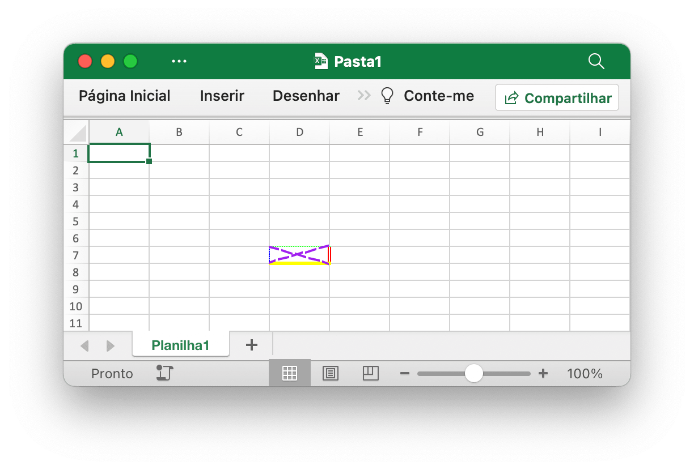
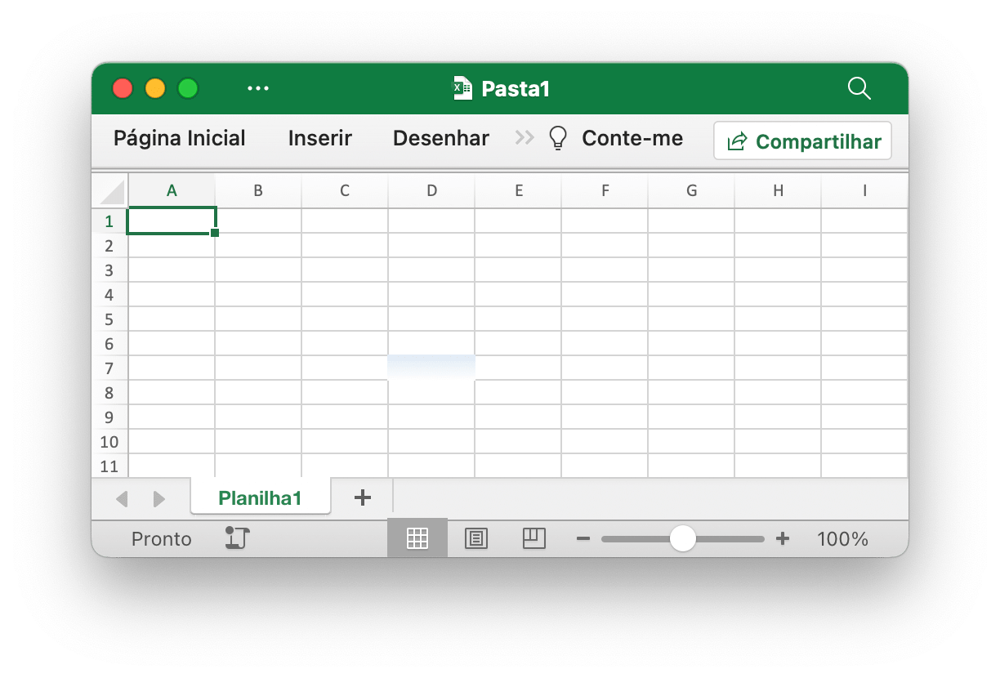
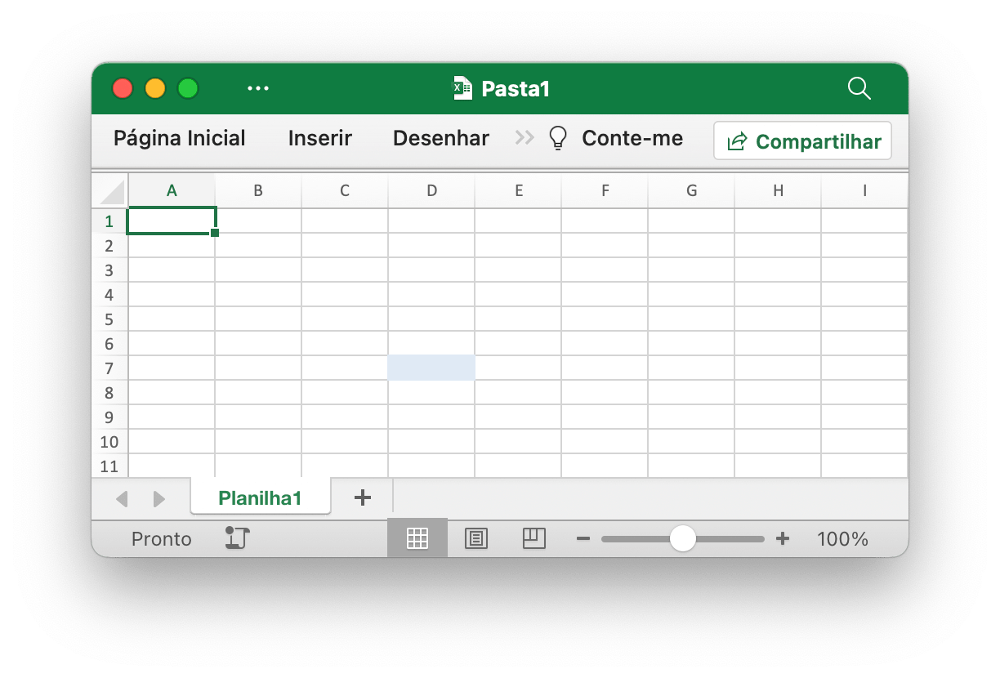
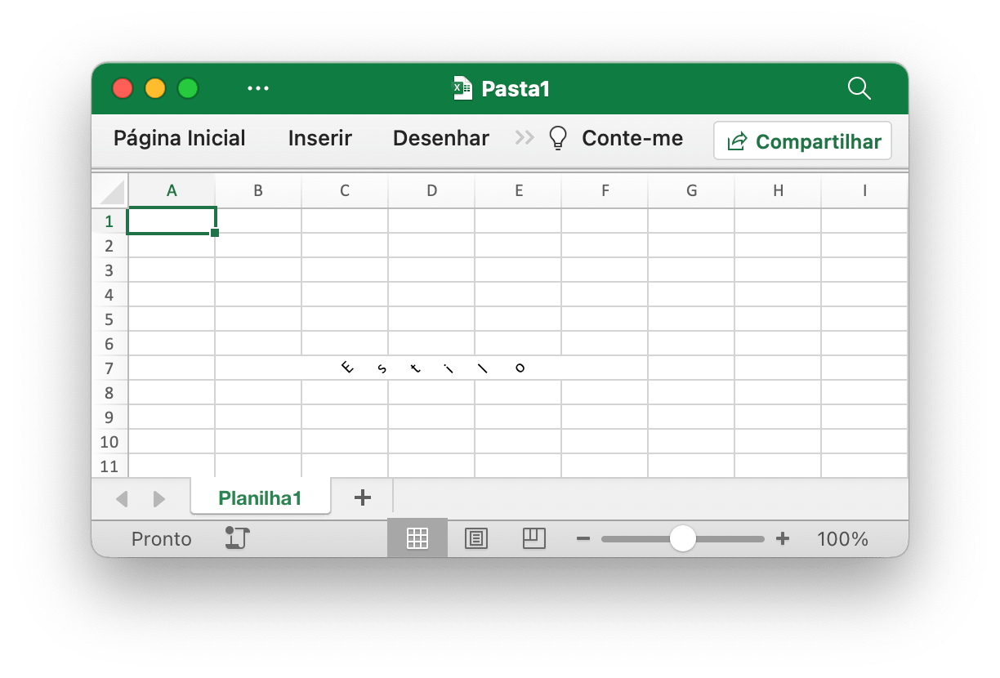
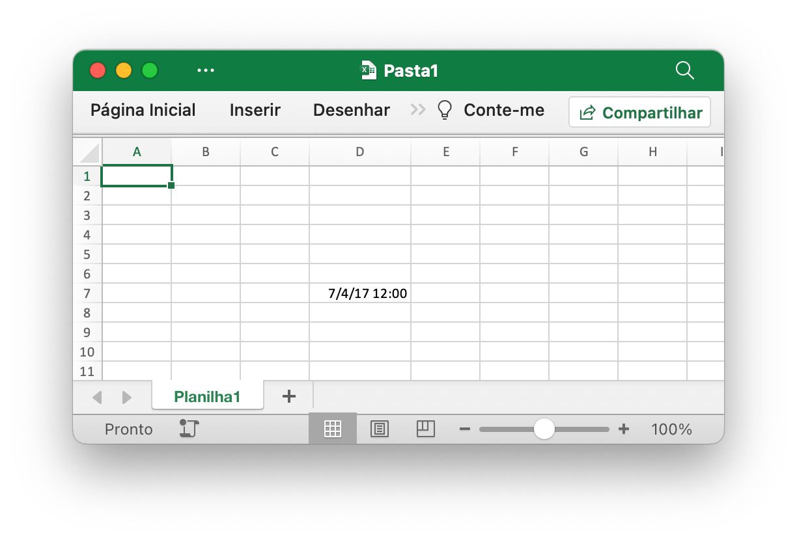
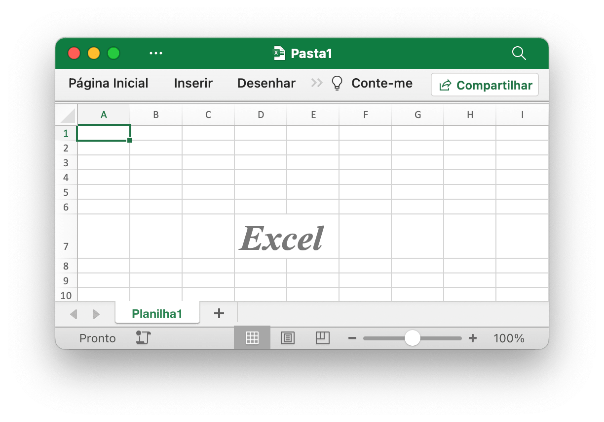
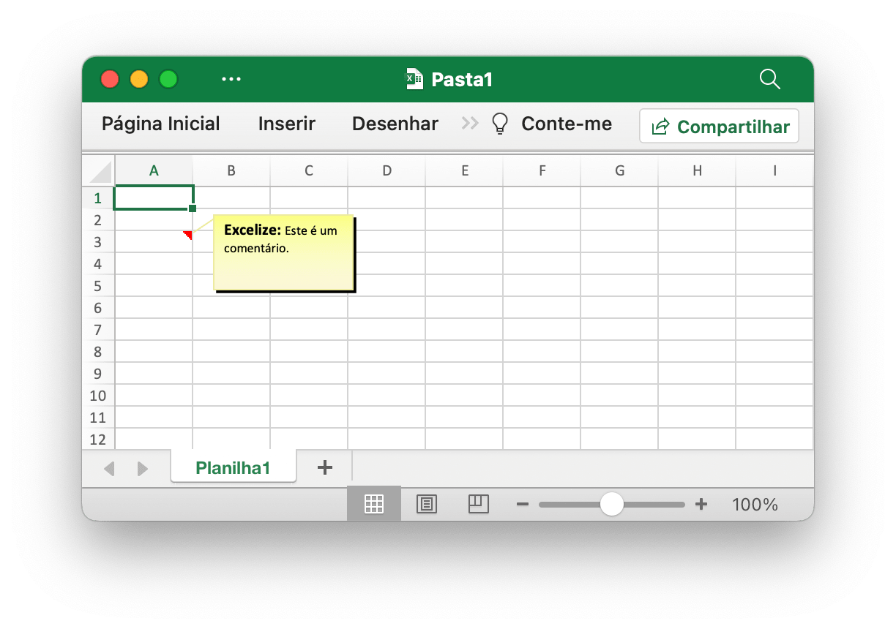

# Célula

`RichTextRun` mapeia diretamente as configurações da execução de rich text.

```go
type RichTextRun struct {
    Font *Font
    Text string
}
```

`HyperlinkOpts` pode ser passado para [`SetCellHyperlink`](cell.md#SetCellHyperlink) definir atributos de hiperlink opcionais (por exemplo, texto a ser exibido e texto de dica de tela).

```go
type HyperlinkOpts struct {
    Display *string
    Tooltip *string
}
```

`FormulaOpts` pode ser passado para [`SetCellFormula`](cell.md#SetCellFormula) para usar outros tipos de fórmula.

```go
type FormulaOpts struct {
    Type *string // Tipo de fórmula
    Ref  *string // Referência de fórmula compartilhada
}
```

## Definir valor da célula {#SetCellValue}

```go
func (f *File) SetCellValue(sheet, cell string, value interface{}) error
```

SetCellValue fornece uma função para definir o valor de uma célula. Esta função é segura para simultaneidade. As coordenadas especificadas não devem estar na primeira linha da tabela; um número complexo pode ser definido com uma string de texto. Veja a seguir os tipos de dados suportados:

|Tipos de dados suportados|
|---|
|int|
|int8|
|int16|
|int32|
|int64|
|uint|
|uint8|
|uint16|
|uint32|
|uint64|
|float32|
|float64|
|string|
|[]byte|
|time.Duration|
|time.Time|
|bool|
|nil|

Observe que o formato de data padrão é `m/d/yy h:mm` do valor do tipo `time.Time`. Você pode definir o formato dos números pela função [`SetCellStyle`](cell.md#SetCellStyle). Se você precisar definir a data especializada no Excel como 0 de janeiro de 1900 ou 29 de fevereiro de 1900, esses horários não podem ser representados no tipo de dados `time.Time` da linguagem Go. Defina o valor da célula como número 0 ou 60 e, em seguida, crie e vincule o estilo de formato numérico de data e hora para a célula.

## Definir valor booleano {#SetCellBool}

```go
func (f *File) SetCellBool(sheet, cell string, value bool) error
```

SetCellBool fornece uma função para definir o valor do tipo bool de uma célula por determinado nome de planilha, referência de célula e valor de célula.

## Definir valor RAW {#SetCellDefault}

```go
func (f *File) SetCellDefault(sheet, cell, value string) error
```

SetCellDefault fornece uma função para definir o valor do tipo string de uma célula como formato padrão sem escapar da célula.

## Definir valor inteiro {#SetCellInt}

```go
func (f *File) SetCellInt(sheet, cell string, value int) error
```

SetCellInt fornece uma função para definir o valor do tipo int de uma célula por determinado nome de planilha, referência de célula e valor de célula.

## Definir valor inteiro sem sinal {#SetCellUint}

```go
func (f *File) SetCellUint(sheet, cell string, value uint64) error
```

SetCellUint fornece uma função para definir o valor do tipo de dados inteiro não assinado de uma célula por determinado nome de planilha, referência de célula e valor de célula.

## Definir valor de ponto flutuante {#SetCellFloat}

```go
func (f *File) SetCellFloat(sheet, cell string, value float64, precision, bitSize int) error
```

SetCellFloat define um valor de ponto flutuante em uma célula. O parâmetro `precision` especifica quantas casas decimais serão mostradas após o decimal, enquanto `-1` é um valor especial que usará quantas casas decimais forem necessárias para representar o número. `bitSize` é `32` ou `64` dependendo se `float32` ou `float64` foi originalmente usado para o valor.

## Definir valor da string {#SetCellStr}

```go
func (f *File) SetCellStr(sheet, cell, value string) error
```

SetCellStr fornece uma função para definir o valor do tipo string de uma célula. O número total de caracteres que uma célula pode conter `32767` caracteres.

## Definir estilo de célula {#SetCellStyle}

```go
func (f *File) SetCellStyle(sheet, topLeftCell, bottomRightCell string, styleID int) error
```

SetCellStyle fornece uma função para adicionar atributos de estilo para células por determinado nome de planilha, referência de intervalo e ID de estilo. Esta função é segura para simultaneidade. Os índices de estilo podem ser obtidos com a função [`NewStyle`](style.md#NewStyle). Observe que as bordas do tipo `diagonalDown` e `diagonalUp` devem usar a mesma cor no mesmo intervalo. SetCellStyle substituirá os estilos existentes na célula, não anexará ou mesclará o estilo com os estilos existentes.

- Exemplo 1, crie bordas da célula `D7` em `Planilha1`:

```go
style, err := f.NewStyle(&excelize.Style{
    Border: []excelize.Border{
        {Type: "left", Color: "0000FF", Style: 3},
        {Type: "top", Color: "00FF00", Style: 4},
        {Type: "bottom", Color: "FFFF00", Style: 5},
        {Type: "right", Color: "FF0000", Style: 6},
        {Type: "diagonalDown", Color: "A020F0", Style: 8},
        {Type: "diagonalUp", Color: "A020F0", Style: 8},
    },
})
if err != nil {
    fmt.Println(err)
}
err = f.SetCellStyle("Planilha1", "D7", "D7", style)
```

<p align="center"></p>

As quatro bordas da célula `D7` são definidas com diferentes estilos e cores. Isso está relacionado aos parâmetros ao chamar a função [`NewStyle`](style.md#NewStyle). Você precisa definir estilos diferentes para consultar a documentação desse capítulo.

- Exemplo 2, definindo o estilo de gradiente para a célula `D7` da planilha chamada `Planilha1`:

```go
style, err := f.NewStyle(&excelize.Style{
    Fill: excelize.Fill{Type: "gradient", Color: []string{"FFFFFF", "E0EBF5"}, Shading: 1},
})
if err != nil {
    fmt.Println(err)
}
err = f.SetCellStyle("Planilha1", "D7", "D7", style)
```

<p align="center"></p>

A célula `D7` é definida com o preenchimento de cor do efeito gradiente. O efeito de preenchimento gradiente está relacionado ao parâmetro quando a função [`NewStyle`](style.md#NewStyle) é chamada. Você precisa definir estilos diferentes para consultar a documentação deste capítulo.

- Exemplo 3, defina um preenchimento sólido para a célula `D7` chamada `Planilha1`:

```go
style, err := f.NewStyle(&excelize.Style{
    Fill: excelize.Fill{Type: "pattern", Color: []string{"E0EBF5"}, Pattern: 1},
})
if err != nil {
    fmt.Println(err)
}
err = f.SetCellStyle("Planilha1", "D7", "D7", style)
```

<p align="center"></p>

A célula `D7` é definida com um preenchimento sólido.

- Exemplo 4, defina o espaçamento dos caracteres e o ângulo de rotação para a célula `D7` chamada `Planilha1`:

```go
f.SetCellValue("Planilha1", "D7", "Estilo")
style, err := f.NewStyle(&excelize.Style{
    Alignment: &excelize.Alignment{
        Horizontal:      "center",
        Indent:          1,
        JustifyLastLine: true,
        ReadingOrder:    0,
        RelativeIndent:  1,
        ShrinkToFit:     true,
        TextRotation:    45,
        Vertical:        "",
        WrapText:        true,
    },
})
if err != nil {
    fmt.Println(err)
}
err = f.SetCellStyle("Planilha1", "D7", "D7", style)
```

<p align="center"></p>

- Exemplo 5, a data e hora no Excel são representadas por números reais, por exemplo `2017/7/4 12:00:00 PM` pode ser representado pelo número `42920.5`. Defina o formato da hora para a célula `D7` da planilha chamada `Planilha1`:

```go
f.SetCellValue("Planilha1", "D7", 42920.5)
f.SetColWidth("Planilha1", "D", "D", 13)
style, err := f.NewStyle(&excelize.Style{NumFmt: 22})
if err != nil {
    fmt.Println(err)
}
err = f.SetCellStyle("Planilha1", "D7", "D7", style)
```

<p align="center"></p>

A célula `D7` está definida para o formato de hora. Observe que quando a largura da célula com o formato de hora aplicado for muito estreita para ser totalmente exibida, ela será exibida como `####`, você pode arrastar e soltar a largura da coluna ou definir a coluna para o tamanho apropriado chamando o comando Função `SetColWidth` para torná-la exibição normal.

- Exemplo 6, definindo a fonte, o tamanho da fonte, a cor e o estilo de inclinação para a célula da planilha `D7` chamada `Planilha1`:

```go
f.SetCellValue("Planilha1", "D7", "Excel")
style, err := f.NewStyle(&excelize.Style{
    Font: &excelize.Font{
        Bold:   true,
        Italic: true,
        Family: "Times New Roman",
        Size:   36,
        Color:  "777777",
    },
})
if err != nil {
    fmt.Println(err)
}
err = f.SetCellStyle("Planilha1", "D7", "D7", style)
```

<p align="center"></p>

- Exemplo 7, bloqueando e ocultando a célula `D7` da planilha chamada `Planilha1`:

```go
style, err := f.NewStyle(&excelize.Style{
    Protection: &excelize.Protection{
        Hidden: true,
        Locked: true,
    },
})
if err != nil {
    fmt.Println(err)
}
err = f.SetCellStyle("Planilha1", "D7", "D7", style)
```

Para bloquear uma célula ou ocultar uma fórmula, proteja a planilha. Na aba “Revisão”, clique em “Proteger Planilha”.

## Definir hiperlink {#SetCellHyperLink}

```go
func (f *File) SetCellHyperLink(sheet, cell, link, linkType string, opts ...HyperlinkOpts) error
```

SetCellHyperLink fornece uma função para definir hiperlinks de células por determinado nome de planilha e endereço URL do link. LinkType define dois tipos de hiperlinks `External` para o site ou `Location` para mover para uma das células desta pasta de trabalho. O limite máximo de hiperlinks em uma planilha é `65530`. Esta função é usada apenas para definir o hiperlink da célula e não afeta o valor da célula. Se você precisar definir o valor da célula, use outras funções como [`SetCellStyle`](cell.md#SetCellStyle) ou [`SetSheetRow`](sheet.md#SetSheetRow). Abaixo está um exemplo de link externo.

- Exemplo 1, adicionando um link externo à célula `A3` da planilha chamada `Planilha1`:

```go
display, tooltip := "https://github.com/xuri/excelize", "Excelize on GitHub"
if err := f.SetCellHyperLink("Planilha1", "A3",
    "https://github.com/xuri/excelize", "External", excelize.HyperlinkOpts{
        Display: &display,
        Tooltip: &tooltip,
    }); err != nil {
    fmt.Println(err)
}
// Set the font and underline style for the cell
style, err := f.NewStyle(&excelize.Style{
    Font: &excelize.Font{Color: "1265BE", Underline: "single"},
})
if err != nil {
    fmt.Println(err)
}
err = f.SetCellStyle("Planilha1", "A3", "A3", style)
```

- Exemplo 2, adicionando um link de localização interno à célula `A3` chamada `Planilha1`:

```go
err := f.SetCellHyperLink("Planilha1", "A3", "Planilha1!A40", "Location")
```

## Definir rich text da célula {#SetCellRichText}

```go
func (f *File) SetCellRichText(sheet, cell string, runs []RichTextRun) error
```

SetCellRichText fornece uma função para definir uma célula com rich text por determinada planilha.

Por exemplo, defina rich text na célula `A1` da planilha chamada `Planilha1`:

<p align="center"></p>

```go
package main

import (
    "fmt"

    "github.com/xuri/excelize/v2"
)

func main() {
    f := excelize.NewFile()
    defer func() {
        if err := f.Close(); err != nil {
            fmt.Println(err)
        }
    }()
    if err := f.SetSheetName("Sheet1", "Planilha1"); err != nil {
        fmt.Println(err)
        return
    }
    if err := f.SetRowHeight("Planilha1", 1, 35); err != nil {
        fmt.Println(err)
        return
    }
    if err := f.SetColWidth("Planilha1", "A", "A", 48); err != nil {
        fmt.Println(err)
        return
    }
    if err := f.SetCellRichText("Planilha1", "A1", []excelize.RichTextRun{
        {
            Text: "texto em negrito",
            Font: &excelize.Font{
                Bold:   true,
                Color:  "2354E8",
                Family: "Times New Roman",
            },
        },
        {
            Text: " e ",
            Font: &excelize.Font{
                Family: "Times New Roman",
            },
        },
        {
            Text: "itálico ",
            Font: &excelize.Font{
                Bold:   true,
                Color:  "E83723",
                Italic: true,
                Family: "Times New Roman",
            },
        },
        {
            Text: "com cor e família de fontes,",
            Font: &excelize.Font{
                Bold:   true,
                Color:  "2354E8",
                Family: "Times New Roman",
            },
        },
        {
            Text: "\r\nltexto grande com ",
            Font: &excelize.Font{
                Size:  14,
                Color: "AD23E8",
            },
        },
        {
            Text: "tachado",
            Font: &excelize.Font{
                Color:  "E89923",
                Strike: true,
            },
        },
        {
            Text: " sobrescrito",
            Font: &excelize.Font{
                Color:     "DBC21F",
                VertAlign: "superscript",
            },
        },
        {
            Text: " e ",
            Font: &excelize.Font{
                Size:      14,
                Color:     "AD23E8",
                VertAlign: "baseline",
            },
        },
        {
            Text: "sublinhado",
            Font: &excelize.Font{
                Color:     "23E833",
                Underline: "single",
            },
        },
        {
            Text: " subscrito.",
            Font: &excelize.Font{
                Color:     "017505",
                VertAlign: "subscript",
            },
        },
    }); err != nil {
        fmt.Println(err)
        return
    }
    style, err := f.NewStyle(&excelize.Style{
        Alignment: &excelize.Alignment{
            WrapText: true,
        },
    })
    if err != nil {
        fmt.Println(err)
        return
    }
    if err := f.SetCellStyle("Planilha1", "A1", "A1", style); err != nil {
        fmt.Println(err)
        return
    }
    if err := f.SaveAs("Pasta1.xlsx"); err != nil {
        fmt.Println(err)
    }
}
```

## Obtenha rich text de célula {#GetCellRichText}

```go
func (f *File) GetCellRichText(sheet, cell string) ([]RichTextRun, error)
```

GetCellRichText fornece uma função para obter o rich text das células de uma determinada planilha.

## Obtenha o valor da célula {#GetCellValue}

```go
func (f *File) GetCellValue(sheet, cell string, opts ...Options) (string, error)
```

GetCellValue fornece uma função para obter o valor formatado da célula por determinado nome da planilha e referência de célula na planilha. O valor de retorno é convertido para o tipo `string`. Esta função é segura para simultaneidade. Se o formato da célula puder ser aplicado ao valor de uma célula, o valor aplicado será retornado, caso contrário, o valor original será retornado. Os valores de todas as células serão iguais em um intervalo mesclado.

## Obtenha o tipo de célula {#GetCellType}

```go
func (f *File) GetCellType(sheet, cell string) (CellType, error)
```

GetCellType fornece uma função para obter o tipo de dados da célula por meio do nome da planilha e da referência da célula no arquivo de planilha.

## Obtenha todos os valores das células por colunas {#GetCols}

```go
func (f *File) GetCols(sheet string, opts ...Options) ([][]string, error)
```

GetCols obtém o valor de todas as células por colunas da planilha com base no nome da planilha fornecido, retornado como um array bidimensional, onde o valor da célula é convertido para o tipo `string`. Se o formato da célula puder ser aplicado ao valor da célula, o valor aplicado será usado, caso contrário, o valor original será usado.

Por exemplo, obtenha e percorra o valor de todas as células por colunas em uma planilha chamada `Planilha1`:

```go
cols, err := f.GetCols("Planilha1")
if err != nil {
    fmt.Println(err)
    return
}
for _, col := range cols {
    for _, rowCell := range col {
        fmt.Print(rowCell, "\t")
    }
    fmt.Println()
}
```

## Obtenha todos os valores das células por linhas {#GetRows}

```go
func (f *File) GetRows(sheet string, opts ...Options) ([][]string, error)
```

GetRows retorna todas as linhas de uma planilha por determinado nome de planilha, retornado como um array bidimensional, onde o valor da célula é convertido para o tipo `string`. Se o formato da célula puder ser aplicado ao valor da célula, o valor aplicado será usado, caso contrário, o valor original será usado. GetRows buscou as linhas com células de valor ou fórmula, as células continuamente em branco no final de cada linha serão ignoradas, portanto, o comprimento de cada linha pode ser inconsistente.

Por exemplo, obtenha e percorra o valor de todas as células por linhas em uma planilha chamada `Planilha1`:

```go
rows, err := f.GetRows("Planilha1")
if err != nil {
    fmt.Println(err)
    return
}
for _, row := range rows {
    for _, colCell := range row {
        fmt.Print(colCell, "\t")
    }
    fmt.Println()
}
```

## Obter hiperlink {#GetCellHyperLink}

```go
func (f *File) GetCellHyperLink(sheet, cell string) (bool, string, error)
```

GetCellHyperLink obtém um hiperlink de célula com base no nome da planilha e na referência de célula fornecidos. Se a célula tiver um hiperlink, ela retornará `true` e o endereço do link, caso contrário retornará `false` e um endereço de link vazio.

Por exemplo, obtenha um hiperlink para uma célula `H6` em uma planilha chamada `Planilha1`:

```go
link, target, err := f.GetCellHyperLink("Planilha1", "H6")
```

## Obtenha índice de estilo {#GetCellStyle}

```go
func (f *File) GetCellStyle(sheet, cell string) (int, error)
```

O índice de estilo de célula é obtido a partir do nome da planilha e da referência de célula fornecidos, e o índice obtido pode ser usado como parâmetro para chamar a função `SetCellValue` ao copiar o estilo de célula.

## Mesclar células {#MergeCell}

```go
func (f *File) MergeCell(sheet, topLeftCell, bottomRightCell string) error
```

MergeCell fornece uma função para mesclar células por referência de intervalo e nome de planilha. A mesclagem de células mantém apenas o valor da célula superior esquerda e descarta os outros valores. Por exemplo, mescle células na área `D3:E9` em uma planilha chamada `Planilha1`:

```go
err := f.MergeCell("Planilha1", "D3", "E9")
```

Se você criar uma célula mesclada que se sobreponha a outra célula mesclada existente, as células mescladas que já existem serão removidas.

## Desfazer a mesclagem de células {#UnmergeCell}

```go
func (f *File) UnmergeCell(sheet, topLeftCell, bottomRightCell string) error
```

UnmergeCell fornece uma função para desfazer a mesclagem de uma determinada referência de intervalo. Por exemplo, desmembrar a área `D3:E9` em `Planilha1`:

```go
err := f.UnmergeCell("Planilha1", "D3", "E9")
```

Atenção: as áreas sobrepostas também não serão mescladas.

## Obtenha células mescladas {#GetMergeCells}

GetMergeCells fornece uma função para obter todas as células mescladas de uma planilha específica.

```go
func (f *File) GetMergeCells(sheet string) ([]MergeCell, error)
```

### Obtenha o valor da célula mesclada

```go
func (m *MergeCell) GetCellValue() string
```

GetCellValue retorna o valor da célula mesclada.

### Obtenha a referência da célula superior esquerda do intervalo mesclado

```go
func (m *MergeCell) GetStartAxis() string
```

GetStartAxis retorna a referência de célula superior esquerda do intervalo mesclado, por exemplo: `C2`.

### Obtenha a referência da célula inferior direita do intervalo mesclado

```go
func (m *MergeCell) GetEndAxis() string
```

GetEndAxis retorna a referência de célula inferior direita do intervalo mesclado, por exemplo: `D4`.

## Obtenha células de imagem {#GetPictureCells}

```go
func (f *File) GetPictureCells(sheet string) ([]string, error)
```

GetPictureCells retorna todas as referências de células de imagem em uma planilha por um nome de planilha específico.

## Adicionar comentário {#AddComment}

```go
func (f *File) AddComment(sheet string, comment Comment) error
```

AddComment fornece o método para adicionar comentários em uma planilha por determinado índice, célula e conjunto de formatos da planilha (como autor e texto). Observe que o comprimento máximo do autor é 255 e o comprimento máximo do texto é 32512. Por exemplo, adicione um comentário em `Planilha1!$A$3`:

<p align="center"></p>

```go
err := f.AddComment("Planilha1", excelize.Comment{
    Cell:   "A3",
    Author: "Excelize",
    Paragraph: []excelize.RichTextRun{
        {Text: "Excelize: ", Font: &excelize.Font{Bold: true}},
        {Text: "Este é um comentário."},
    },
})
```

## Obter comentário {#GetComments}

```go
func (f *File) GetComments(sheet string) ([]Comment, error)
```

GetComments recupera todos os comentários em uma planilha por determinado nome de planilha.

## Excluir comentário {#DeleteComment}

```go
func (f *File) DeleteComment(sheet, cell string) error
```

DeleteComment fornece o método para excluir comentários em uma planilha por determinado nome de planilha. Por exemplo, exclua o comentário em `Sheet1!$A$30`:

```go
err := f.DeleteComment("Sheet1", "A30")
```

## Definir fórmula de célula {#SetCellFormula}

```go
func (f *File) SetCellFormula(sheet, cell, formula string, opts ...FormulaOpts) error
```

SetCellFormula fornece uma função para definir a fórmula na célula de acordo com o nome da planilha fornecido e as configurações da fórmula da célula. O resultado da célula da fórmula pode ser calculado quando a planilha é aberta pelo aplicativo Office Excel ou pode usar a função [CalcCellValue](cell.md#CalcCellValue) também pode obter o valor calculado da célula. Se o aplicativo Excel não calcular a fórmula automaticamente quando a pasta de trabalho for aberta, chame [UpdateLinkedValue](utils.md#UpdateLinkedValue) após definir as funções da fórmula da célula.

- Exemplo 1, defina a fórmula normal `=SUM(A1,B1)` para a célula `A3` em `Planilha1`:

```go
err := f.SetCellFormula("Planilha1", "A3", "=SUM(A1,B1)")
```

- Exemplo 2, defina a fórmula `1;2;3` de matriz constante vertical unidimensional (matriz de coluna) para a célula `A3` em `Planilha1`:

```go
err := f.SetCellFormula("Planilha1", "A3", "={1;2;3}")
```

- Exemplo 3, defina a fórmula de array constante horizontal unidimensional (matriz de linha) `"a","b","c"` para a célula `A3` em `Planilha1`:

```go
err := f.SetCellFormula("Planilha1", "A3", "={\"a\",\"b\",\"c\"}")
```

- Exemplo 4, defina a fórmula de matriz de constante bidimensional `{1,2;"a","b"}` para a célula `A3` no `Planilha1`:

```go
formulaType, ref := excelize.STCellFormulaTypeArray, "A3:A3"
err := f.SetCellFormula("Planilha1", "A3", "={1,2;\"a\",\"b\"}",
    excelize.FormulaOpts{Ref: &ref, Type: &formulaType})
```

- Exemplo 5, defina a fórmula de matriz de intervalo `A1:A2` para a célula `A3` em `Planilha1`:

```go
formulaType, ref := excelize.STCellFormulaTypeArray, "A3:A3"
err := f.SetCellFormula("Planilha1", "A3", "=A1:A2",
    excelize.FormulaOpts{Ref: &ref, Type: &formulaType})
```

- Exemplo 6, defina a fórmula compartilhada `=A1+B1` para as células `C1:C5` na `Planilha1`, `C1` é a célula mestre:

```go
formulaType, ref := excelize.STCellFormulaTypeShared, "C1:C5"
err := f.SetCellFormula("Planilha1", "C1", "=A1+B1",
    excelize.FormulaOpts{Ref: &ref, Type: &formulaType})
```

- Exemplo 7, defina a fórmula da tabela `=SUM(Tabela1[[A]:[B]])` para a célula `C2` no `Planilha1`:

```go
package main

import (
    "fmt"

    "github.com/xuri/excelize/v2"
)

func main() {
    f := excelize.NewFile()
    defer func() {
        if err := f.Close(); err != nil {
            fmt.Println(err)
        }
    }()
    if err := f.SetSheetName("Sheet1", "Planilha1"); err != nil {
        fmt.Println(err)
        return
    }
    for idx, row := range [][]interface{}{{"A", "B", "C"}, {1, 2}} {
        if err := f.SetSheetRow("Planilha1", fmt.Sprintf("A%d", idx+1), &row); err != nil {
            fmt.Println(err)
            return
        }
    }
    if err := f.AddTable("Planilha1",
        &excelize.Table{
            Range:     "A1:C2",
            Name:      "Tabela1",
            StyleName: "TableStyleMedium2",
        }); err != nil {
        fmt.Println(err)
        return
    }
    formulaType := excelize.STCellFormulaTypeDataTable
    if err := f.SetCellFormula("Planilha1", "C2", "=SUM(Tabela1[[A]:[B]])",
        excelize.FormulaOpts{Type: &formulaType}); err != nil {
        fmt.Println(err)
        return
    }
    if err := f.SaveAs("Pasta1.xlsx"); err != nil {
        fmt.Println(err)
    }
}
```

## Obtenha a fórmula da célula {#GetCellFormula}

```go
func (f *File) GetCellFormula(sheet, cell string) (string, error)
```

GetCellFormula fornece uma função para obter fórmulas de células por determinado nome de planilha e referência de célula na planilha.

## Calcular o valor da célula {#CalcCellValue}

```go
func (f *File) CalcCellValue(sheet, cell string, opts ...Options) (string, error)
```

CalcCellValue fornece uma função para obter o valor calculado da célula. Este recurso está atualmente em processamento funcional. Cálculo iterativo, interseção implícita, interseção explícita, fórmula de matriz, fórmula de tabela e algumas outras fórmulas não são suportadas atualmente.

Fórmulas suportadas:

Nome da função | Descrição
---|---
ABS                      | Devolve o valor absoluto de um número
JUROSACUM                | Devolve os juros acumulados de um título que paga juros periódicos
JUROSACUMV               | Devolve os juros acumulados de um título que paga juros no vencimento
ACOS                     | Devolve o arco de cosseno de um número
ACOSH                    | Devolve o cosseno hiperbólico inverso de um número
ACOT                     | Devolve o arco de tangente de um número
ACOTH                    | Devolve o arco de tangente hiperbólico de um número
AGGREGATE                | Devolve uma agregação numa lista ou base de dados
ADDRESS                  | Devolve uma referência a uma única célula numa folha de cálculo como texto
AMORDEGRC                | Devolve a depreciação correspondente a cada período contabilístico utilizando um coeficiente de depreciação
AMORLINC                 | Devolve a depreciação correspondente a cada período contabilístico
AND                      | Devolve VERDADEIRO se todos os respetivos argumentos corresponderem a VERDADEIRO
ÁRABE                    | Converte um número Romano em Árabe, como número
MATRIZPARATEXTO          | Devolve uma matriz de valores de texto a partir de qualquer intervalo especificado
ASEN                     | Devolve o arco de seno de um número
ASINH                    | Devolve o seno hiperbólico inverso de um número
ATAN                     | Devolve o arco de tangente de um número
ATAN2                    | Devolve o arco de tangente das coordenadas x e y
ATANH                    | Devolve a tangente hiperbólica inversa de um número
AVEDEV                   | Devolve a média aritmética dos desvios absolutos à média dos pontos de dados
AVERAGE                  | Devolve a média dos respetivos argumentos
AVERAGEA                 | Devolve uma média dos respetivos argumentos, incluindo números, texto e valores lógicos
AVERAGEIF                | Devolve a média aritmética de todas as células num intervalo que cumprem determinado critério
AVERAGEIFS               | Devolve a média aritmética de todas as células que cumprem múltiplos critérios
BASE                     | Converte um número numa representação de texto com a raiz (base) indicada
BESSELI                  | Devolve a função de Bessel modificada In(x)
BESSELJ                  | Devolve a função de Bessel Jn(x)
BESSELK                  | Devolve a função de Bessel modificada Kn(x)
BESSELY                  | Devolve a função de Bessel Yn(x)
BETADIST                 | Devolve a função de distribuição cumulativa beta
BETA.DIST                | Devolve a função de distribuição cumulativa beta
BETAINV                  | Devolve o inverso da função de distribuição cumulativa relativamente a uma distribuição beta específica
BETA.INV                 | Devolve o inverso da função de distribuição cumulativa relativamente a uma distribuição beta específica
BIN2DEC                  | Converte um número binário em decimal
BIN2HEX                  | Converte um número binário em hexadecimal
BIN2OCT                  | Converte um número binário em octal
BINOMDIST                | Devolve a probabilidade de distribuição binomial de termo individual
BINOM.DIST               | Devolve a probabilidade de distribuição binomial de termo individual
DIST.BINOM.INTERVALO     | Devolve a probabilidade de um resultado experimental utilizando uma distribuição binomial
BINOM.INV                | Devolve o menor valor em que a distribuição binomial cumulativa é menor ou igual a um valor de critério
BITAND                   | Devolve um valor "Bit a Bit E" de dois números
BITDESL.ESQ              | Devolve um número deslocado à esquerda por valor_da_deslocação bits
BITOR                    | Devolve um valor "OU bit a bit" de 2 números
BITDESL.DIR              | Devolve um número deslocado à direita por valor_da_deslocação bits
BITXOR                   | Devolve um valor "OU bit a bit" de 2 números
CEILING                  | Arredonda um número para o número inteiro mais próximo ou para o múltiplo de significância mais próximo
ARRED.EXCESSO.MAT        | Arredonda um número para cima para o número inteiro mais próximo ou para o múltiplo significante mais próximo
CEILING.PRECISE          | Arredonda um número para o número inteiro mais próximo ou para o múltiplo de significância mais próximo. Independentemente do sinal do número, o número é arredondado
CHAR                     | Devolve o caráter especificado pelo número de código
CHIDIST                  | Devolve a probabilidade unicaudal da distribuição chi-quadrada
CHIINV                   | Devolve o inverso da probabilidade unicaudal da distribuição chi-quadrada
CHITEST                  | Devolve o teste para independência
CHISQ.DIST               | Devolve a função de densidade de probabilidade beta cumulativa
CHISQ.DIST.RT            | Devolve a probabilidade unicaudal da distribuição chi-quadrada
CHISQ.INV                | Devolve a função de densidade de probabilidade beta cumulativa
CHISQ.INV.RT             | Devolve o inverso da probabilidade unicaudal da distribuição chi-quadrada
CHISQ.TEST               | Devolve o teste para independência
CHOOSE                   | Seleciona um valor a partir de uma lista de valores
LIMPARB                  | Remove todos os carateres do texto que não é possível imprimir
CODE                     | Devolve um código numérico correspondente ao primeiro caráter numa cadeia de texto
COLUMN                   | Devolve o número de coluna numa referência
COLUMNS                  | Devolve o número de colunas numa referência
COMBIN                   | Devolve o número de combinações de um determinado número de objetos
COMBIN.R                 | Devolve o número de combinações com repetições relativamente a um determinado número de objetos
COMPLEXO                 | Converte coeficientes reais e imaginários num número complexo
CONCAT                   | Combina o texto de múltiplos intervalos e/ou cadeias, mas não fornece os argumentos IgnoreEmpty e delimitador
CONCATENATE              | Agrupa vários itens de texto num único item de texto
CONFIDENCE               | Devolve o intervalo de confiança correspondente a uma média de população
CONFIDENCE.NORM          | Devolve o intervalo de confiança correspondente a uma média de população
CONFIDENCE.T             | Devolve o intervalo de confiança para uma média da população, utilizando uma distribuição t de Student
CONVERT                  | Converte um número de um sistema de medição noutro
CORREL                   | Devolve o coeficiente de correlação entre dois conjuntos de dados
COS                      | Devolve o cosseno de um número
COSH                     | Devolve o cosseno hiperbólico de um número
COT                      | Devolve o cosseno hiperbólico de um número
COTH                     | Devolve a cotangente de um ângulo
COUNT                    | Conta os números que existem na lista de argumentos
COUNTA                   | Conta os valores que existem na lista de argumentos
COUNTBLANK               | Conta o número de células em branco num intervalo
COUNTIF                  | Calcula o número de células num intervalo que correspondem aos critérios determinados
COUNTIFS                 | Conta o número de células num intervalo que cumprem múltiplos critérios
CUPDIASINLIQ             | Devolve o número de dias entre o início do período do cupão e a data de regularização
CUPDIAS                  | Devolve o número de dias no período do cupão que contém a data de regularização
CUPDIASPRÓ               | Devolve o número de dias entre a data de regularização e a data do cupão seguinte
CUPDATAPRÓX              | Devolve a data do cupão seguinte após a data de regularização
CUPNÚM                   | Devolve o número de cupões a serem pagos entre a data de regularização e a data de vencimento
CUPDATAANT               | Devolve a data do cupão anterior antes da data de regularização
COVAR                    | Devolve a covariância, que é a média dos produtos de desvios de pares
COVARIANCE.P             | Devolve a covariância, que é a média dos produtos de desvios de pares
COVARIANCE.S             | Devolve a covariância de amostra, a média dos desvios de produtos para cada par de pontos de dados em dois conjuntos de dados
CRITBINOM                | Devolve o menor valor em que a distribuição binomial cumulativa é menor ou igual a um valor de critério
CSC                      | Devolve a cossecante de um ângulo
CSCH                     | Devolve a cossecante hiperbólica de um ângulo
PGTOJURACUM              | Devolve os juros cumulativos pagos entre dois períodos
PGTOCAPACUM              | Devolve o capital cumulativo pago a título de empréstimo entre dois períodos
DATE                     | Devolve o número de série de uma determinada data
DATEDIF                  | Calcula o número de dias, meses ou anos entre duas datas. Esta função é útil em fórmulas nas quais tem de calcular uma idade
DATEVALUE                | Converte uma data em forma de texto num número de série
DAVERAGE                 | Devolve a média das entradas da base de dados selecionadas
DAY                      | Converte um número de série num dia do mês
DAYS                     | Devolve o número de dias entre duas datas
DAYS360                  | Calcula o número de dias entre duas datas com base num ano com 360 dias
BD                       | Devolve a depreciação de um ativo relativo a um período especificado utilizando o método de redução fixa do saldo
DCOUNT                   | Conta as células que contêm números numa base de dados
DCOUNTA                  | Conta as células que não estejam em branco numa base de dados
DDB                      | Devolve a depreciação de um ativo relativo a um período especificado utilizando o método de redução dupla do saldo ou qualquer outro método especificado
DECABIN                  | Converte um número decimal em binário
DECAHEX                  | Converte um número decimal em hexadecimal
DECAOCT                  | Converte um número decimal em octal
DECIMAL                  | Converte uma representação textual de um número numa base num número decimal
DEGREES                  | Converte radianos em graus
DELTA                    | Testa se dois valores são iguais
DEVSQ                    | Devolve a soma dos quadrados dos desvios
DGET                     | Extrai de uma base de dados um único registo que corresponde aos critérios especificados
DESC                     | Devolve a taxa de desconto de um título
DMAX                     | Devolve o valor máximo das entradas da base de dados selecionada
DMIN                     | Devolve o valor mínimo das entradas da base de dados selecionada
DOLLARDE                 | Converte um preço em unidade monetária expresso como uma fração, num preço em unidade monetária expresso como um número decimal
DOLLARFR                 | Converte um preço em unidade monetária expresso como um número decimal, num preço em unidade monetária expresso como uma fração
DPRODUCT                 | Multiplica os valores de um determinado campo de registos que correspondem aos critérios numa base de dados
BDDESVPAD                | Calcula o desvio-padrão com base numa amostra de entradas da base de dados selecionadas
DSTDEVP                  | Calcula o desvio-padrão com base na população total das entradas da base de dados selecionadas
DSUM                     | Adiciona os números na coluna de campo dos registos de base de dados que correspondem aos critérios
DURAÇÃO                  | Devolve a duração anual de um título com pagamentos de juros periódicos
DVAR                     | Calcula a variância com base numa amostra das entradas de base de dados selecionadas
DVARP                    | Calcula a variância com base na população total das entradas de base de dados selecionadas
DATAM                    | Devolve um número de série de data que corresponde ao número de meses indicado antes ou depois da data de início
EFECTIVA                 | Devolve a taxa de juro anual EFETIVA, dada a taxa de juro nominal anual e o número de períodos compostos por ano
ENCODEURL                | Devolve uma cadeia URL codificada
FIMMÊS                   | Devolve o número de série do último dia do mês antes ou depois de um número de meses especificado
FUNCERRO                 | Devolve a função de erro
FUNCERRO.PRECISO         | Devolve a função de erro
FUNCERROCOMPL            | Devolve a função de erro complementar
FUNCERROCOMPL.PRECISO    | Devolve a função FUNCERRO complementar integrada entre x e infinito.
ERROR.TYPE               | Devolve um número correspondente a um tipo de erro
EUROCONVERT              | Converte um valor para euros, converte um valor em euros para a moeda de um país da zona euro ou converte um valor na moeda de um país da Zona Euro para a moeda de outro país da Zona Euro, utilizando o euro como valor intermédio (triangulação)
EVEN                     | Arredonda um número por excesso para o número par mais próximo
EXACT                    | Verifica se dois valores de texto são idênticos
EXP                      | Devolve e elevado à potência de um determinado número
EXPON.DIST               | Devolve a distribuição exponencial
EXPONDIST                | Devolve a distribuição exponencial
FACT                     | Devolve o fatorial de um número
FACTDUPLO                | Devolve o fatorial duplo de um número.
FALSE                    | Devolve o valor lógico FALSO
F.DIST                   | Devolve a distribuição da probabilidade F
FDIST                    | Devolve a distribuição da probabilidade F
F.DIST.RT                | Devolve a distribuição da probabilidade F
FIND                     | Localiza um valor de texto dentro de outro (sensível às maiúsculas e minúsculas)
FINDB                    | Localiza um valor de texto dentro de outro (sensível às maiúsculas e minúsculas)
F.INV                    | Devolve o inverso da distribuição da probabilidade F
F.INV.RT                 | Devolve o inverso da distribuição da probabilidade F
FINV                     | Devolve o inverso da distribuição da probabilidade F
FISHER                   | Devolve a transformação Fisher
FISHERINV                | Devolve o inverso da transformação Fisher
FIXED                    | Formata um número como texto com um número fixo de decimais
FLOOR                    | Arredonda um número por defeito até zero
ARRED.DEFEITO.MAT        | Arredonda um número para baixo para o número inteiro mais próximo ou para o múltiplo significativo mais próximo
FLOOR.PRECISE            | Arredonda um número para o número inteiro mais próximo ou para o múltiplo de significância mais próximo. Independentemente do sinal do número, o número é arredondado
FORECAST                 | Devolve um valor ao longo de uma tendência linear
FORECAST.LINEAR          | Devolve um valor ao longo de uma tendência linear
FORMULATEXT              | Devolve a fórmula numa referência como texto
FREQUENCY                | Devolve uma distribuição de frequência como uma matriz vertical
F.TEST                   | Devolve o resultado de um teste F
FTEST                    | Devolve o resultado de um teste F
FV                       | Devolve o valor futuro de um investimento
VFPLANO                  | Devolve o valor futuro de um capital inicial após a aplicação de uma série de taxas de juros compostas
GAMMA                    | Devolve o valor da função Gama
GAMMA.DIST               | Devolve a distribuição gama
GAMMADIST                | Devolve a distribuição gama
GAMMA.INV                | Devolve o inverso da distribuição gama cumulativa
GAMMAINV                 | Devolve o inverso da distribuição gama cumulativa
GAMMALN                  | Devolve o algoritmo natural da função gama, Γ(x)
GAMMALN.PRECISE          | Devolve o algoritmo natural da função gama, Γ(x)
GAUSS                    | Devolve menos 0,5 do que a distribuição cumulativa normal padrão
MDC                      | Devolve o maior divisor comum
GEOMEAN                  | Devolve a média geométrica
DEGRAU                   | Testa se um número é maior que um valor limite
GROWTH                   | Devolve valores ao longo de uma tendência exponencial
HARMEAN                  | Devolve a média harmónica
HEXABIN                  | Converte um número hexadecimal em binário
HEXADEC                  | Converte um número hexadecimal em decimal
HEXAOCT                  | Converte um número hexadecimal em octal
HLOOKUP                  | Procura na linha superior de uma matriz e devolve o valor da célula indicada
HOUR                     | Converte um número de série numa hora
HIPERLIGAÇÃO             | Cria um atalho ou hiperligação que abre um documento armazenado num servidor de rede, numa intranet ou na Internet
HYPGEOM.DIST             | Devolve a distribuição hipergeométrica
HYPGEOMDIST              | Devolve a distribuição hipergeométrica
SE                       | Especifica um teste lógico a ser executado
IFERROR                  | Devolve o valor que especificou se a fórmula for avaliada num erro; caso contrário devolve o resultado da fórmula
SEND                     | Devolve o valor que especificar se a expressão resultar em #N/D; caso contrário, devolve o resultado da expressão
SE.S                     | Verifica se uma ou mais condições são cumpridas e devolve um valor que corresponde à primeira condição VERDADEIRO
IMABS                    | Devolve o valor absoluto (módulo) de um número complexo
IMAGINÁRIO               | Devolve o coeficiente imaginário de um número complexo
IMARG                    | Devolve o argumento Teta, um ângulo expresso em radianos
IMCONJ                   | Devolve o conjugado complexo de um número complexo
IMCOS                    | Devolve o cosseno de um número complexo
IMCOSH                   | Devolve o cosseno hiperbólico ou um número complexo
IMCOT                    | Devolve a cotangente de um número complexo
IMCSC                    | Devolve a cossecante de um número complexo
IMCSCH                   | Devolve a cossecante hiperbólica de um número complexo
IMDIV                    | Devolve o quociente de dois números complexos
IMEXP                    | Devolve o exponencial de um número complexo
IMLN                     | Devolve o logaritmo natural de um número complexo
IMLOG10                  | Devolve o logaritmo de base 10 de um número complexo
IMLOG2                   | Devolve o logaritmo de base 2 de um número complexo
IMPOT                    | Devolve um número complexo elevado a uma potência inteira
IMPROD                   | Devolve o produto de números complexos
IMREAL                   | Devolve o coeficiente real de um número complexo
IMSEC                    | Devolve a secante de um número complexo
IMSECH                   | Devolve a secante hiperbólica de um número complexo
IMSENO                   | Devolve o seno de um número complexo
IMSENOH                  | Returns the hyperbolic sine of a complex number
IMRAIZ                   | Devolve a raiz quadrada de um número complexo
IMSUBTR                  | Devolve a diferença entre dois números complexos
IMSOMA                   | Devolve a soma de números complexos
IMTAN                    | Devolve a tangente de um número complexo
INDEX                    | Utiliza um índice para escolher um valor de uma referência ou de uma matriz
INDIRECT                 | Devolve uma referência indicada por um valor de texto
INT                      | Arredonda um número por defeito para o número inteiro mais próximo
INTERCEPT                | Devolve a interceção da linha de regressão linear
TAXAJUROS                | Devolve a taxa de juros de um título investido na totalidade
IPMT                     | Devolve o pagamento dos juros de um investimento durante um determinado período
IRR                      | Devolve a taxa de rentabilidade interna para uma série de fluxos monetários
É.CÉL.VAZIA              | Devolve VERDADEIRO se o valor estiver em branco
É.ERROS                  | Devolve VERDADEIRO se o valor for um valor de erro
É.ERRO                   | Devolve VERDADEIRO se o valor for um valor de erro
ÉPAR                     | Devolve VERDADEIRO se o número for par
É.FORMULA                | Devolve VERDADEIRO se existir uma referência a uma célula que contenha uma fórmula
É.LÓGICO                 | Devolve VERDADEIRO se o valor for lógico
É.NÃO.DISP               | Devolve VERDADEIRO se o valor for o valor de erro #N/D
É.NÃO.TEXTO              | Retorna VERDADEIRO se o valor é diferente de texto
ÉNÚM                     | Devolve VERDADEIRO se o valor for um número
ÉIMPAR                   | Retorna VERDADEIRO se o número é ímpar
ÉREF                     | Retorna VERDADEIRO se o valor é uma referência
É.TEXTO                  | Devolve VERDADEIRO se o valor for texto
ISO.TETO                 | Devolve um número arredondado para o número inteiro mais próximo ou para o múltiplo de significância mais próximo
NÚMSEMANAISO             | Devolve o número correspondente ao número ISO da semana do ano para uma determinada data
ÉPGTO                    | Calcula os juros pagos durante um período específico de um investimento
CURT                     | Retorna a curtose de um conjunto de dados
MAIOR                    | Retorna o maior valor k-ésimo de um conjunto de dados
MMC                      | Retorna o mínimo múltiplo comum
ESQUERDA                 | Retorna os caracteres mais à esquerda de um valor de texto
ESQUERDA                 | Retorna os caracteres mais à esquerda de um valor de texto
NÚM.CARACT               | Devolve o número de carateres de uma cadeia de texto
LENB                     | Devolve o número de carateres de uma cadeia de texto
LN                       | Devolve o logaritmo natural de um número
LOG                      | Devolve o logaritmo de um número com uma base especificada
LOG10                    | Devolve o logaritmo de base 10 de um número
LOGINV                   | Devolve o inverso da distribuição cumulativa normal logarítmica
LOGNORM.DIST             | Devolve a distribuição normal logarítmica cumulativa
LOGNORMDIST              | Devolve a distribuição normal logarítmica cumulativa
LOGNORM.INV              | Devolve o inverso da distribuição cumulativa normal logarítmica
LOOKUP                   | Procura valores num vetor ou numa matriz
MINÚSCULA                | Converte o texto em minúsculas
CORRESP                  | Procura valores em uma referência ou uma matriz
MÁXIMO                   | Retorna o valor máximo em uma lista de argumentos
MÁXIMOA                  | Retorna o valor máximo em uma lista de argumentos, inclusive números, texto e valores lógicos
MAXIFS                   | Devolve o valor máximo entre as células especificadas por um conjunto específico de condições ou critérios
MATRIZ.DETERM            | Retorna o determinante da matriz de uma variável do tipo matriz
MDURAÇÃO                 | Retorna a duração de Macauley modificada para um título com um valor de paridade equivalentea100
MED                      | Retorna a mediana dos números indicados
MID                      | Devolve um número específico de carateres de uma cadeia de texto, a partir da posição especificada
MIDB                     | Devolve um número específico de carateres de uma cadeia de texto, a partir da posição especificada
MÍNIMO                   | Retorna o valor mínimo em uma lista de argumentos
MINIFS                   | Devolve o valor mínimo entre células especificadas por um conjunto específico de condições ou critérios.
MÍNIMOA                  | Retorna o menor valor em uma lista de argumentos, inclusive números, texto e valores lógicos
MINUTO                   | Converte um número de série num minuto
MATRIZ.INVERSO           | Retorna a matriz inversa de uma variável do tipo matriz
MTIR                     | Devolve a taxa interna de rentabilidade em que os fluxos monetários positivos e negativos são financiados com taxas diferentes
MATRIZ.MULT              | Retorna o produto de duas matrizes
MOD                      | Devolve o resto da divisão
MODO                     | Devolve o valor mais comum num conjunto de dados
MODO.MULT                | Retorna uma matriz vertical dos valores que ocorrem com mais frequência, ou repetidamente, emuma matriz ou intervalo de dados
MODO.ÚNICO               | Retorna o valor mais comum em um conjunto de dados
MÊS                      | Converte um número de série em um mês
MARRED                   | Retorna um número Arredondado para o múltiplo desejado
MULTINOMIAL              | Retorna o multinômio de um conjunto de números
MUNIT                    | Retorna a matriz da unidade ou dimensão especificada
N                        | Retorna um valor convertido em número
NÃO.DISP                 | Retorna o valor de erro #N/D
DIST.BIN.NEG.N           | Retorna a distribuição binomial negativa
DIST.BIN.NEG             | Retorna a distribuição binomial negativa
DIATRABALHOTOTAL         | Retorna o número de dias úteis inteiros entre duas datas
DIATRABALHOTOTAL.INTL    | Retorna o número de dias úteis inteiros entre duas datas usando parâmetros para indicar quaise quantos dias são dias de fim de semana
NOMINAL                  | Devolve a taxa de juros nominal anual
DIST.NORM.N              | Devolve a distribuição cumulativa normal
DIST.NORM                | Devolve a distribuição cumulativa normal
INV.NORM                 | Retorna o inverso da distribuição cumulativa normal
INV.NORM.N               | Retorna o inverso da distribuição cumulativa normal
DIST.NORMP.N             | Retorna a distribuição cumulativa normal
DIST.NORMP               | Retorna a distribuição cumulativa normal padrão
INV.NORMP.N              | Retorna o inverso da distribuição cumulativa normal padrão
INV.NORMP                | Retorna o inverso da distribuição cumulativa normal padrão
NÃO                      | Inverte o valor lógico do argumento
AGORA                    | Retorna o número de série da data e da hora atuais
NPER                     | Retorna o número de períodos de um investimento
VPL                      | Retorna o valor líquido atual de um investimento com base em uma série de fluxos de caixa periódicos e uma taxa de desconto
OCTABIN                  | Converte um número octal em binário
OCTADEC                  | Converte um número octal em decimal
OCTAHEX                  | Converte um número octal em hexadecimal
ÍMPAR                    | Arredonda um número para cima até o inteiro ímpar mais próximo
PREÇOPRIMINC             | Retorna o preço por R$ 100,00 do valor nominal de um título com um período inicial incompleto
LUCROPRIMINC             | Retorna o rendimento de um título com um período inicial incompleto
PREÇOÚLTINC              | Retorna o preço por R$ 100,00 do valor nominal de um título com um período final incompleto
LUCROÚLTINC              | Retorna o rendimento de um título com um período final incompleto
OU                       | Retorna VERDADEIRO se qualquer argumento for VERDADEIRO
DURAÇÃOP                 | Retorna o número de períodos necessários para que um investimento atinja um valor especificado
PEARSON                  | Devolve o coeficiente de correlação momento/produto de Pearson
PERCENTIL.EXC            | Retorna o k-ésimo percentil de valores em um intervalo, em que k está no intervalo 0..1, exclusivamente
PERCENTIL.INC            | Retorna o k-ésimo percentil de valores em um intervalo
PERCENTIL                | Retorna o k-ésimo percentil de valores em um intervalo
ORDEM.PORCENTUAL.EXC     | Retorna a ordem de um valor em um conjunto de dados definido como um percentual (0..1, exclusivamente) do conjunto de dados
ORDEM.PORCENTUAL.INC     | Retorna a ordem percentual de um valor em um conjunto de dados
ORDEM.PORCENTUAL         | Retorna a ordem percentual de um valor em um conjunto de dados
PERMUT                   | Retorna o número de permutações de um determinado número de objetos
PERMUTAS                 | Retorna o número de permutações referentes a determinado número de objetos (com repetições)que podem ser selecionadas nos objetos totais
PHI                      | Retorna o valor da função de densidade referente a uma distribuição padrão normal
PI                       | Retorna o valor de pi
IPGTO                    | Retorna o pagamento de juros para um investimento em um determinado período
DIST.POISSON             | Retorna a distribuição de Poisson
POISSON                  | Retorna a distribuição de Poisson
POTÊNCIA                 | Retorna o resultado de um número elevado a uma potência
PPGTO                    | Retorna o pagamento de capital para determinado período de investimento
PREÇO                    | Retorna o preço por R$ 100,00 do valor nominal de um título que paga juros periódicos
PREÇODESC                | Retorna o preço por R$ 100,00 do valor nominal de um título desContado
PREÇOVENC                | Retorna o preço por R$ 100,00 do valor nominal de um título que paga juros no vencimento
PROB                     | Devolve a probabilidade de os valores num intervalo se encontrarem entre dois limites
PRODUTO                  | Multiplica seus argumentos
PROPER                   | Coloca em maiúsculas a primeira letra de cada palavra de um valor de texto
VP                       | Devolve o valor atual de um investimento
QUARTIL                  | Retorna o quartil de um conjunto de dados
QUARTIL.EXC              | Retorna o quartil do conjunto de dados, com base nos valores de percentil de 0..1, exclusivamente
QUARTIL.INC              | Retorna o quartil de um conjunto de dados
QUOCIENTE                | Retorna a parte inteira de uma divisão
RADIANOS                 | Converte graus em radianos
ALEATÓRIO                | Retorna um número aleatório entre 0 e 1
ALEATÓRIOENTRE           | Retorna um número aleatório entre os números especificados
ORDEM.EQ                 | Retorna a posição de um número em uma lista de números
ORDEM                    | Retorna a posição de um número em uma lista de números
TAXA                     | Retorna a taxa de juros por período de uma anuidade
RECEBER                  | Retorna a quantia recebida no vencimento de um título totalmente investido
MUDAR                    | Muda os caracteres dentro do texto
REPLACEB                 | Muda os caracteres dentro do texto
REPT                     | Repete texto um determinado número de vezes
DIREITA                  | Devolve os carateres mais à direita de um valor de texto
RIGHTB                   | Devolve os carateres mais à direita de um valor de texto
ROMANO                   | Converte um algarismo arábico em romano, como texto
ARRED                    | Arredonda um número para um número de dígitos especificado
ARREDONDAR.PARA.BAIXO    | Arredonda um número para baixo até zero
ARREDONDAR.PARA.CIMA     | Arredonda um número para cima, afastando-o de zero
LIN                      | Retorna o número da linha de uma referência
LINS                     | Retorna o número de linhas em uma referência
TAXAJURO                 | Retorna uma taxa de juros equivalente referente ao crescimento de um investimento
RQUAD                    | Retorna o quadrado do coeficiente de correlação do momento do produto de Pearson
LOCALIZAR                | Localiza um valor de texto dentro de outro (não diferencia maiúsculas de minúsculas)
SEARCHB                  | Localiza um valor de texto dentro de outro (não diferencia maiúsculas de minúsculas)
SEC                      | Devolve a secante de um ângulo
SECH                     | Devolve a secante hiperbólica de um ângulo
SEGUNDO                  | Converte um número de série num segundo
SOMASEQUÊNCIA            | Retorna a Soma de uma sequência polinomial baseada na fórmula
PLAN                     | Retorna o número da planilha referenciada
PLANS                    | Retorna o número de planilhas em uma referência
SINAL                    | Retorna o sinal de um número
SEN                      | Retorna o seno do ângulo fornecido
SENH                     | Retorna o seno hiperbólico de um número
DISTORÇÃO                | Retorna a distorção de uma distribuição
DISTORÇÃO.P              | Retorna a inclinação de uma distribuição com base em uma população
DPD                      | Retorna a depreciação linear de um ativo para um período
INCLINAÇÃO               | Retorna a inclinação da linha de regressão linear
MENOR                    | Retorna o menor valor k-ésimo em um conjunto de dados
RAIZ                     | Retorna uma raiz quadrada positiva
RAIZPI                   | Retorna a raiz quadrada de (número* pi)
PADRONIZAR               | Retorna um valor normalizado
DESVPAD                  | Estima o desvio padrão com base em uma amostra
DESVPAD.P                | Calcula o desvio padrão com base na população total
DESVPAD.S                | Estima o desvio padrão com base em uma amostra
DESVPADA                 | Estima o desvio padrão com base em uma amostra, inclusive números, texto e valores lógicos
DESVPADP                 | Calcula o desvio padrão com base na população total
DESVPADPA                | Calcula o desvio padrão com base na população total, inclusive números, texto e valores lógicos
EPADYX                   | Devolve o erro-padrão do valor-y previsto para cada x na regressão
SUBSTITUIR               | Substitui um texto antigo por um novo texto em uma cadeia de texto
SUBTOTAL                 | Devolve um subtotal numa lista ou base de dados
SOMA                     | Adiciona os respetivos argumentos
SOMASE                   | Adiciona as células especificadas por um determinado critério
SOMASES                  | Adiciona as células a um intervalo que cumpre vários critérios
SOMARPRODUTO             | Retorna a Soma dos produtos dos componentes correspondentes da matriz
SOMAQUAD                 | Retorna a Soma dos quadrados dos argumentos
SOMAX2DY2                | Retorna a Soma da diferença dos quadrados dos valores correspondentes em duas matrizes
SOMAX2SY2                | Retorna a Soma da Soma dos quadrados dos valores correspondentes em duas matrizes
SOMAXMY2                 | Retorna a Soma dos quadrados das diferenças dos valores correspondentes em duas matrizes
PARÂMETRO                | Avalia uma expressão em relação a uma lista de valores e Retorna o resultado correspondente para o primeiro valor coincidente. Se não houver nenhuma correspondência, um valor padrão opcional pode ser Retornado
SDA                      | Retorna a depreciação dos dígitos da Soma dos anos de um ativo para um período especificado
T                        | Converte os argumentos em texto
TAN                      | Devolve a tangente de um número
TANH                     | Devolve a tangente hiperbólica de um número
OTN                      | Retorna o rendimento equivalente a um título para uma letra do tesouro
OTNVALOR                 | Retorna o preço por R$ 100,00 do valor nominal de uma letra do tesouro
OTNLUCRO                 | Retorna o rendimento de uma letra do tesouro
DIST.T                   | Retorna os pontos percentuais (probabilidade) para a distribuição t de Student
DIST.T.BC                | Retorna os pontos percentuais (probabilidade) para a distribuição t de Student
DIST.T.CD                | Retorna a distribuição t de Student
DISTT                    | Retorna a distribuição t de Student
TEXTO                    | Formata um número e Converte-o em texto
TEXTODEPOIS              | Devolve texto que ocorre depois de um determinado caráter ou cadeia
TEXTOANTES               | Devolve texto que ocorre antes de um determinado caráter ou cadeia
UNIRTEXTO                | Combina o texto a partir de múltiplos intervalos e/ou cadeias
TEMPO                    | Devolve o número de série de um determinado tempo
VALOR.TEMPO              | Converte um tempo em forma de texto num número de série
INV.T                    | Retorna o valor t da distribuição t de Student como uma função da probabilidade e dos grausdeliberdade
INV.T.BC                 | Retorna o inverso da distribuição t de Student
INVT                     | Retorna o inverso da distribuição t de Student
HOJE                     | Retorna o número de série da data de hoje
TRANSPOR                 | Retorna a transposição de uma matriz
TENDÊNCIA                | Retorna valores ao longo de uma tendência linear
ARRUMAR                  | Remove os espaços do texto
MÉDIA.INTERNA            | Retorna a média do interior de um conjunto de dados
VERDADEIRO               | Retorna o valor lógico VERDADEIRO
TRUNC                    | Truncates a number to an integer
TESTE.T                  | Retorna a probabilidade associada ao teste t de Student
TESTET                   | Retorna a probabilidade associada ao teste t de Student
TIPO                     | Retorna um número indicando o tipo de dados de um valor
CARACTUNICODE            | Retorna o caractere Unicode referenciado por determinado valor numérico
UNICODE                  | Devolve o número (ponto de código) correspondente ao primeiro caráter do texto
MAIÚSCULA                | Converte texto em maiúsculas
VALOR                    | Converte um argumento de texto em um número
VALORPARATEXTO           | Devolve texto a partir de qualquer valor especificado
VAREST                   | Estima a variância com base em uma amostra
VAR.P                    | Calcula a variância com base na população tota
VAR.S                    | Calcula a variância com base numa amostra
VARA                     | Calcula a variância com base numa amostra, incluindo números, texto e valores lógicos
VARP                     | Calcula a variância com base na população total
VARPA                    | Calcula a variância com base na população total, incluindo números, texto e valores lógicos
BDV                      | Retorna a depreciação de um ativo para um período especificado ou parcial usando um método debalanço decrescente
PROCV                    | Procura na primeira coluna de uma matriz e move-se ao longo da linha para Retornar o valor deuma célula
DIA.DA.SEMANA            | Converte um número de série em um dia da semana
NÚMSEMANA                | Converte um número de série em um número que representa onde a semana cai numericamente em umano
WEIBULL                  | Calcula a variância com base na população total, incluindo números, texto e valores lógicos
DIST.WEIBULL             | Retorna a distribuição de Weibull
DIATRABALHO              | Retorna o número de série da data antes ou depois de um número específico de dias úteis
DIATRABALHO.INTL         | Retorna o número de série da data antes ou depois de um número específico de dias úteis usandoparâmetros para indicar quais e quantos dias são de fim de semana
XTIR                     | Devolve a taxa interna de rentabilidade de um plano de fluxos monetários que não seja necessariamente periódica
PROCX                    | Procura um intervalo ou uma matriz e devolve um item correspondente à primeira correspondência que encontrar. Se não existir uma correspondência, PROCX pode devolver a correspondência mais próxima (aproximada)
XVPL                     | Retorna o valor líquido presente de um programa de fluxos de caixa que não é necessariamente periódico
XOR                      | Retorna um OU exclusivo lógico de todos os argumentos
ANO                      | Converte um número de série em um ano
FRAÇÃOANO                | Retorna a fração do ano que representa o número de dias inteiros entre data_inicial e data_final
LUCRO                    | Retorna o lucro de um título que paga juros periódicos
LUCRODESC                | Retorna o rendimento anual de um título desContado; por exemplo, uma letra do tesouro
LUCROVENC                | Retorna o lucro anual de um título que paga juros no vencimento
TESTE.Z                  | Retorna o valor de probabilidade unicaudal de um teste z
TESTEZ                   | Retorna o valor de probabilidade unicaudal de um teste z
