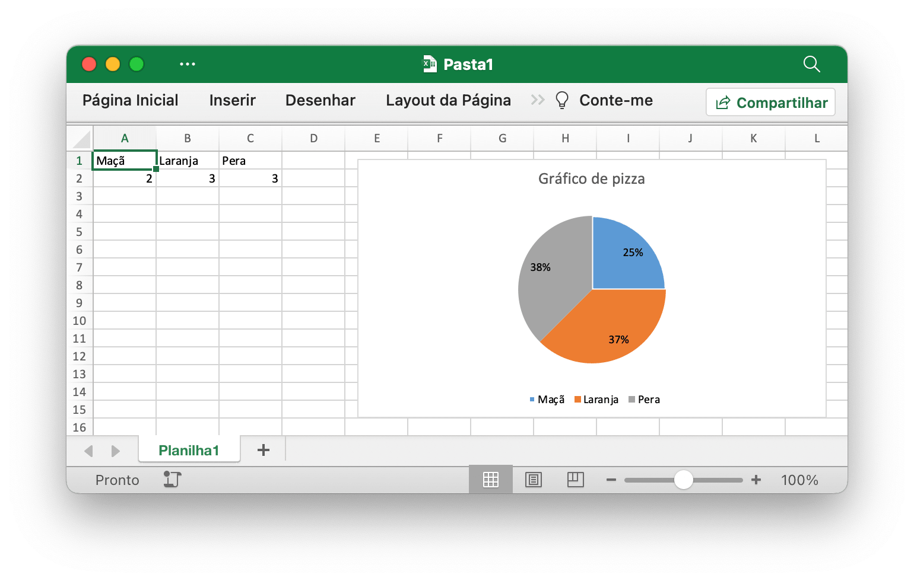

# Gráfico de pizza {#pie}

Por exemplo, adicione um gráfico de pizza como este:

<p align="center"></p>

```go
package main

import (
    "fmt"

    "github.com/xuri/excelize/v2"
)

func main() {
    f := excelize.NewFile()
    defer func() {
        if err := f.Close(); err != nil {
            fmt.Println(err)
        }
    }()
    if err := f.SetSheetName("Sheet1", "Planilha1"); err != nil {
        fmt.Println(err)
        return
    }
    for idx, row := range [][]interface{}{
        {"Maçã", "Laranja", "Pera"},
        {2, 3, 3},
    } {
        cell, err := excelize.CoordinatesToCellName(1, idx+1)
        if err != nil {
            fmt.Println(err)
            return
        }
        if err := f.SetSheetRow("Planilha1", cell, &row); err != nil {
            fmt.Println(err)
            return
        }
    }
    if err := f.AddChart("Planilha1", "E1", &excelize.Chart{
        Type: excelize.Pie,
        Series: []excelize.ChartSeries{
            {
                Name:       "Quantia",
                Categories: "Planilha1!$A$1:$C$1",
                Values:     "Planilha1!$A$2:$C$2",
            },
        },
        Format: excelize.GraphicOptions{
            OffsetX: 15,
            OffsetY: 10,
        },
        Title: []excelize.RichTextRun{
            {
                Text: "Gráfico de pizza",
            },
        },
        PlotArea: excelize.ChartPlotArea{
            ShowPercent: true,
        },
    }); err != nil {
        fmt.Println(err)
        return
    }
    // Salva a pasta de trabalho
    if err := f.SaveAs("Pasta1.xlsx"); err != nil {
        fmt.Println(err)
    }
}
```
