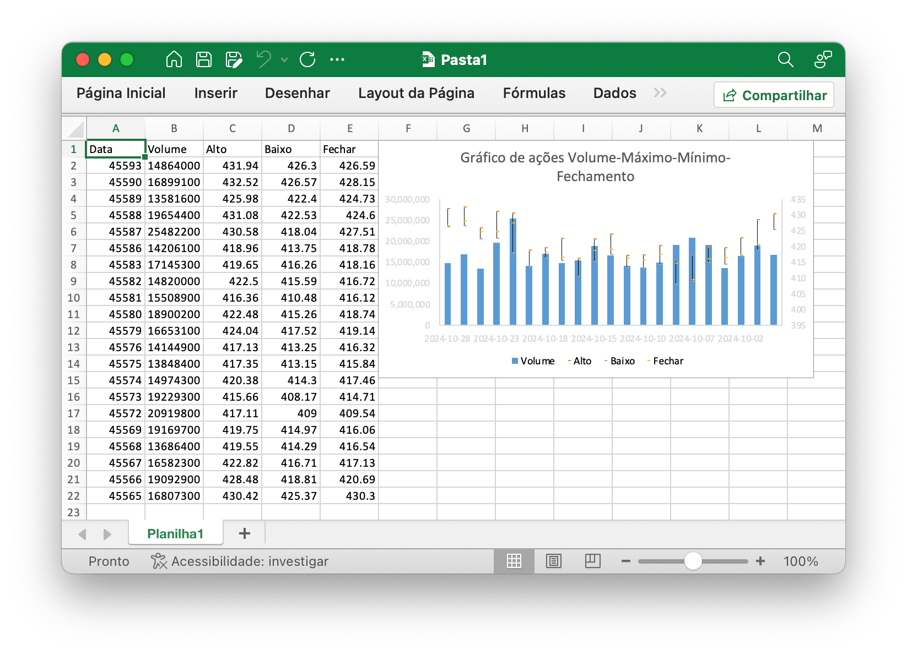

# Gráfico de ações Volume-Máximo-Mínimo-Fechamento {#stockVolumeHighLowClose}

Por exemplo, adicione um Gráfico de ações Volume-Máximo-Mínimo-Fechamento semelhante a este:

<p align="center"></p>

```go
package main

import (
    "fmt"

    "github.com/xuri/excelize/v2"
)

func main() {
    f := excelize.NewFile()
    defer func() {
        if err := f.Close(); err != nil {
            fmt.Println(err)
        }
    }()
    if err := f.SetSheetName("Sheet1", "Planilha1"); err != nil {
        fmt.Println(err)
        return
    }
    for idx, row := range [][]interface{}{
        {"Data", "Volume", "Alto", "Baixo", "Fechar"},
        {45593, 14864000, 431.94, 426.3, 426.59},
        {45590, 16899100, 432.52, 426.57, 428.15},
        {45589, 13581600, 425.98, 422.4, 424.73},
        {45588, 19654400, 431.08, 422.53, 424.6},
        {45587, 25482200, 430.58, 418.04, 427.51},
        {45586, 14206100, 418.96, 413.75, 418.78},
        {45583, 17145300, 419.65, 416.26, 418.16},
        {45582, 14820000, 422.5, 415.59, 416.72},
        {45581, 15508900, 416.36, 410.48, 416.12},
        {45580, 18900200, 422.48, 415.26, 418.74},
        {45579, 16653100, 424.04, 417.52, 419.14},
        {45576, 14144900, 417.13, 413.25, 416.32},
        {45575, 13848400, 417.35, 413.15, 415.84},
        {45574, 14974300, 420.38, 414.3, 417.46},
        {45573, 19229300, 415.66, 408.17, 414.71},
        {45572, 20919800, 417.11, 409, 409.54},
        {45569, 19169700, 419.75, 414.97, 416.06},
        {45568, 13686400, 419.55, 414.29, 416.54},
        {45567, 16582300, 422.82, 416.71, 417.13},
        {45566, 19092900, 428.48, 418.81, 420.69},
        {45565, 16807300, 430.42, 425.37, 430.3},
    } {
        cell, err := excelize.CoordinatesToCellName(1, idx+1)
        if err != nil {
            fmt.Println(err)
            return
        }
        if err := f.SetSheetRow("Planilha1", cell, &row); err != nil {
            fmt.Println(err)
            return
        }
    }
    if err := f.AddChart("Planilha1", "F1", &excelize.Chart{
        Type: excelize.Col,
        Series: []excelize.ChartSeries{
            {
                Name:       "Planilha1!$B$1",
                Categories: "Planilha1!$A$2:$A$22",
                Values:     "Planilha1!$B$2:$B$22",
            },
        },
        XAxis: excelize.ChartAxis{
            NumFmt: excelize.ChartNumFmt{CustomNumFmt: "yyyy-mm-dd"},
        },
        YAxis: excelize.ChartAxis{
            NumFmt: excelize.ChartNumFmt{CustomNumFmt: "#,##0"},
        },
        Title: []excelize.RichTextRun{
            {Text: "Gráfico de ações Volume-Máximo-Mínimo-Fechamento"},
        },
    }, &excelize.Chart{
        Type: excelize.StockHighLowClose,
        Series: []excelize.ChartSeries{
            {
                Name:       "Planilha1!$C$1",
                Categories: "Planilha1!$A$2:$A$22",
                Values:     "Planilha1!$C$2:$C$22",
            },
            {
                Name:       "Planilha1!$D$1",
                Categories: "Planilha1!$A$2:$A$22",
                Values:     "Planilha1!$D$2:$D$22",
            },
            {
                Name:       "Planilha1!$E$1",
                Categories: "Planilha1!$A$2:$A$22",
                Values:     "Planilha1!$E$2:$E$22",
            },
        },
        YAxis: excelize.ChartAxis{Secondary: true},
    }); err != nil {
        fmt.Println(err)
        return
    }
    // Salva a pasta de trabalho
    if err := f.SaveAs("Pasta1.xlsx"); err != nil {
        fmt.Println(err)
    }
}
```
