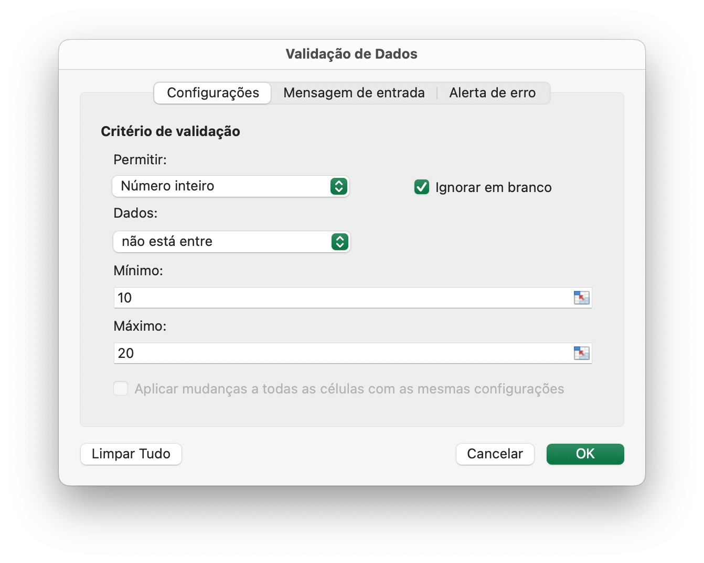
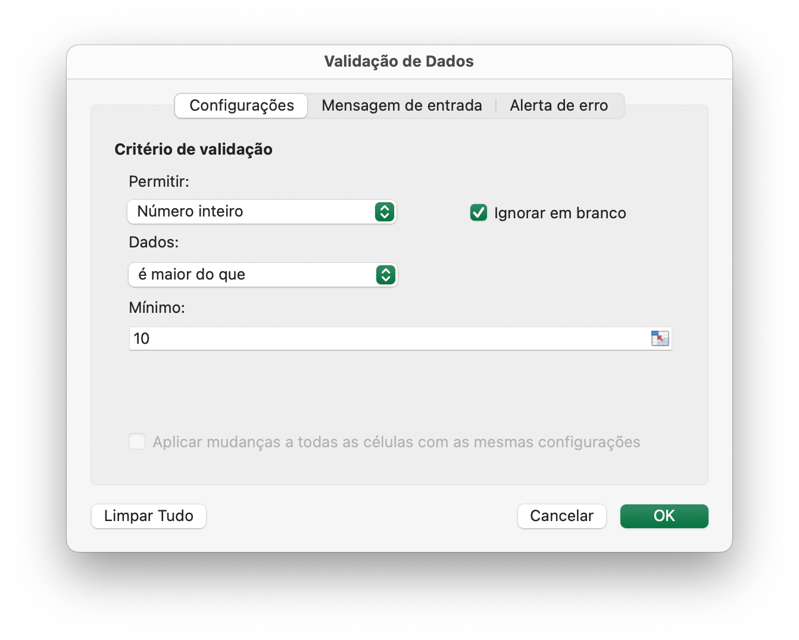
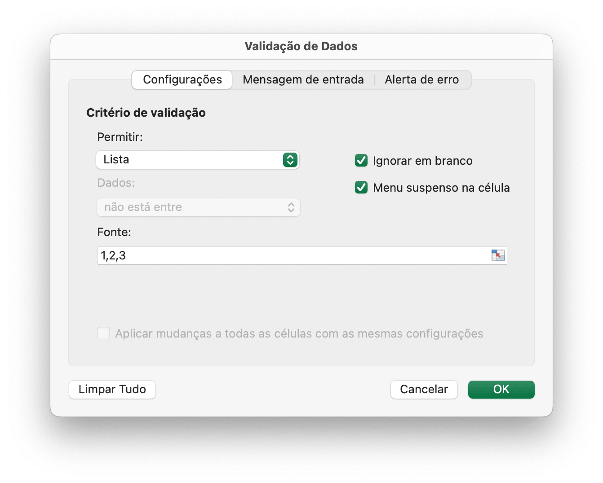
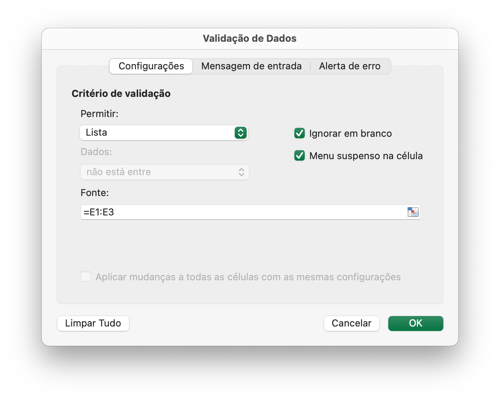

# Dados

## Adicionar validação de dados {#AddDataValidation}

```go
func (f *File) AddDataValidation(sheet string, dv *DataValidation)
```

AddDataValidation fornece validação de dados definida em um intervalo da planilha por determinado objeto de validação de dados e nome da planilha. O objeto de validação de dados pode ser criado pela função `NewDataValidation`. O tipo e os operadores de validação de dados podem ser encontrados na seção [Constantes](constants.md).

Exemplo 1, defina a validação de dados em `Planilha1!A1:B2` com configurações de critérios de validação, mostre alerta de erro após dados inválidos serem inseridos com estilo "Stop" e título personalizado "corpo do erro":

<p align="center"></p>

```go
dv := excelize.NewDataValidation(true)
dv.SetSqref("A1:B2")
dv.SetRange(10, 20, excelize.DataValidationTypeWhole, excelize.DataValidationOperatorBetween)
dv.SetError(excelize.DataValidationErrorStyleStop, "título do erro", "corpo do erro")
f.AddDataValidation("Planilha1", dv)
```

Exemplo 2, defina a validação de dados em `Planilha1!A3:B4` com configurações de critérios de validação e mostre a mensagem de entrada quando a célula for selecionada:

<p align="center"></p>

```go
dv = excelize.NewDataValidation(true)
dv.SetSqref("A3:B4")
dv.SetRange(10, 20, excelize.DataValidationTypeWhole, excelize.DataValidationOperatorGreaterThan)
dv.SetInput("título de entrada", "corpo de entrada")
f.AddDataValidation("Planilha1", dv)
```

Exemplo 3, defina a validação de dados em `Planilha1!A5:B6` com configurações de critérios de validação, crie um menu suspenso na célula permitindo a origem da lista:

<p align="center"></p>

```go
dv = excelize.NewDataValidation(true)
dv.SetSqref("A5:B6")
dv.SetDropList([]string{"1", "2", "3"})
f.AddDataValidation("Planilha1", dv)
```

Se você digitar os itens na caixa de diálogo de validação de dados (uma lista delimitada), o limite será de 255 caracteres, incluindo os separadores. Se a fórmula de origem da sua lista de validação de dados estiver acima do limite máximo de comprimento, defina os valores permitidos nas células da planilha e use a função `SetSqrefDropList` para definir a referência para suas células.

Exemplo 4, defina a validação de dados em `Planilha1!A7:B8` com as configurações de origem dos critérios de validação `Planilha1!E1:E3`, crie um menu suspenso na célula permitindo a fonte da lista:

<p align="center"></p>

```go
dv := excelize.NewDataValidation(true)
dv.SetSqref("A7:B8")
dv.SetSqrefDropList("E1:E3")
f.AddDataValidation("Planilha1", dv)
```

Há limites para o número de itens que serão exibidos em uma lista suspensa de validação de dados: A lista pode mostrar até 32.768 itens de uma lista na planilha. Se precisar de mais itens do que isso, você pode criar uma lista suspensa dependente, dividida por categoria.

## Obtenha validações de dados {#GetDataValidations}

```go
func (f *File) GetDataValidations(sheet string) ([]*DataValidation, error)
```

GetDataValidations retorna uma lista de validações de dados por determinado nome de planilha.

## Excluir validação de dados {#DeleteDataValidation}

```go
func (f *File) DeleteDataValidation(sheet string, sqref ...string) error
```

DeleteDataValidation exclui a validação de dados por determinado nome de planilha e sequência de referência. Todas as validações de dados na planilha serão excluídas caso não seja especificado o parâmetro de sequência de referência.

## Adicionar fatiador {#AddSlicer}

`SlicerOptions` representa as configurações do slicer.

```go
type SlicerOptions struct {
    Name          string
    Table         string
    Cell          string
    Caption       string
    Macro         string
    Width         uint
    Height        uint
    DisplayHeader *bool
    ItemDesc      bool
    Format        GraphicOptions
}
```

`Name` especifica o nome do slicer, deve ser um nome de campo existente da tabela ou tabela dinâmica fornecida, esta configuração é obrigatória.

`Table` especifica o nome da tabela ou tabela dinâmica, esta configuração é obrigatória.

`Cell` especifica que a célula superior esquerda coordena a posição para inserir a segmentação de dados; esta configuração é obrigatória.

`Caption` especifica a legenda da segmentação de dados, esta configuração é opcional.

`Macro` usado para definir macro para a segmentação de dados, a extensão da pasta de trabalho deve ser XLSM ou XLTM.

`Width` especifica a largura da segmentação de dados, esta configuração é opcional.

`Height` especifica a altura da segmentação de dados, esta configuração é opcional.

`DisplayHeader` especifica se o cabeçalho da segmentação de dados é exibido, esta configuração é opcional, a configuração padrão é exibição.

`ItemDesc` especifica a classificação decrescente de itens (Z-A), esta configuração é opcional e a configuração padrão é `false` (representa crescente).

`Format` especifica o formato da segmentação de dados, esta configuração é opcional.

```go
func (f *File) AddSlicer(sheet string, opts *SlicerOptions) error
```

A função AddSlicer insere uma segmentação de dados fornecendo o nome da planilha e as configurações da segmentação de dados. Por exemplo, insira uma segmentação de dados em `Planilha1!E1` com o campo `Coluna1` para a tabela chamada `Tabela1`:

```go
err := f.AddSlicer("Planilha1", &excelize.SlicerOptions{
    Name:       "Coluna1",
    Cell:       "E1",
    TableSheet: "Planilha1",
    TableName:  "Tabela1",
    Caption:    "Coluna1",
    Width:      200,
    Height:     200,
})
```
