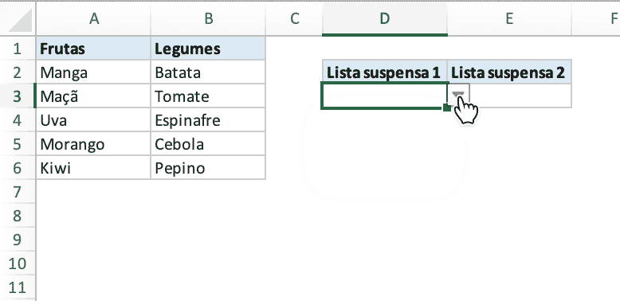

# Lista suspensa de dependentes

Crie uma lista suspensa dependente na planilha com Excelize usando Go:

<p align="center"></p>

```go
package main

import (
    "fmt"

    "github.com/xuri/excelize/v2"
)

func main() {
    // criar uma nova planilha
    f := excelize.NewFile()
    var (
        // valores de células
        data = [][]interface{}{
            {"Frutas", "Legumes"},
            {"Manga", "Batata", nil, "Lista suspensa 1", "Lista suspensa 2"},
            {"Maçã", "Tomate"},
            {"Uva", "Espinafre"},
            {"Morango", "Cebola"},
            {"Kiwi", "Pepino"},
        }
        addr                    string
        err                     error
        cellsStyle, headerStyle int
    )
    if err := f.SetSheetName("Sheet1", "Planilha1"); err != nil {
        fmt.Println(err)
        return
    }
    // set each cell value
    for r, row := range data {
        if addr, err = excelize.JoinCellName("A", r+1); err != nil {
            fmt.Println(err)
            return
        }
        if err = f.SetSheetRow("Planilha1", addr, &row); err != nil {
            fmt.Println(err)
            return
        }
    }
    // set data validation
    dvRange1 := excelize.NewDataValidation(true)
    dvRange1.Sqref = "D3:D3"
    dvRange1.SetSqrefDropList("$A$1:$B$1")
    if err = f.AddDataValidation("Planilha1", dvRange1); err != nil {
        fmt.Println(err)
        return
    }
    dvRange2 := excelize.NewDataValidation(true)
    dvRange2.Sqref = "E3:E3"
    dvRange2.SetSqrefDropList("INDIRECT(D3)")
    if err = f.AddDataValidation("Planilha1", dvRange2); err != nil {
        fmt.Println(err)
        return
    }
    // set defined name
    if err = f.SetDefinedName(&excelize.DefinedName{
        Name:     "Frutas",
        RefersTo: "Planilha1!$A$2:$A$6",
        Scope:    "Planilha1",
    }); err != nil {
        fmt.Println(err)
        return
    }
    if err = f.SetDefinedName(&excelize.DefinedName{
        Name:     "Legumes",
        RefersTo: "Planilha1!$B$2:$B$6",
        Scope:    "Planilha1",
    }); err != nil {
        fmt.Println(err)
        return
    }
    // definir largura de coluna personalizada
    for col, width := range map[string]float64{
        "A": 12, "B": 12, "C": 6, "D": 13, "E": 13} {
        if err = f.SetColWidth("Planilha1", col, col, width); err != nil {
            fmt.Println(err)
            return
        }
    }
    // ocultar linhas de grade da planilha
    disable := false
    if err := f.SetSheetView("Planilha1", -1, &excelize.ViewOptions{
        ShowGridLines: &disable,
    }); err != nil {
        fmt.Println(err)
    }
    // definir o estilo da borda
    border := []excelize.Border{
        {Type: "top", Style: 1, Color: "CCCCCC"},
        {Type: "left", Style: 1, Color: "CCCCCC"},
        {Type: "right", Style: 1, Color: "CCCCCC"},
        {Type: "bottom", Style: 1, Color: "CCCCCC"},
    }
    // definir o estilo das células
    if cellsStyle, err = f.NewStyle(&excelize.Style{
        Font:   &excelize.Font{Color: "333333"},
        Border: border}); err != nil {
        fmt.Println(err)
        return
    }
    // definir o estilo da linha do cabeçalho
    if headerStyle, err = f.NewStyle(&excelize.Style{
        Font: &excelize.Font{Bold: true},
        Fill: excelize.Fill{
            Type: "pattern", Color: []string{"DAE9F3"}, Pattern: 1},
        Border: border},
    ); err != nil {
        fmt.Println(err)
        return
    }
    // definir estilo de célula
    if err = f.SetCellStyle("Planilha1", "A2", "B6", cellsStyle); err != nil {
        fmt.Println(err)
        return
    }
    if err = f.SetCellStyle("Planilha1", "D3", "E3", cellsStyle); err != nil {
        fmt.Println(err)
        return
    }
    // definir o estilo da célula para a linha do cabeçalho
    if err = f.SetCellStyle("Planilha1", "A1", "B1", headerStyle); err != nil {
        fmt.Println(err)
        return
    }
    if err = f.SetCellStyle("Planilha1", "D2", "E2", headerStyle); err != nil {
        fmt.Println(err)
        return
    }
    // salvar arquivo de planilha
    if err := f.SaveAs("Pasta1.xlsx"); err != nil {
        fmt.Println(err)
    }
}
```
