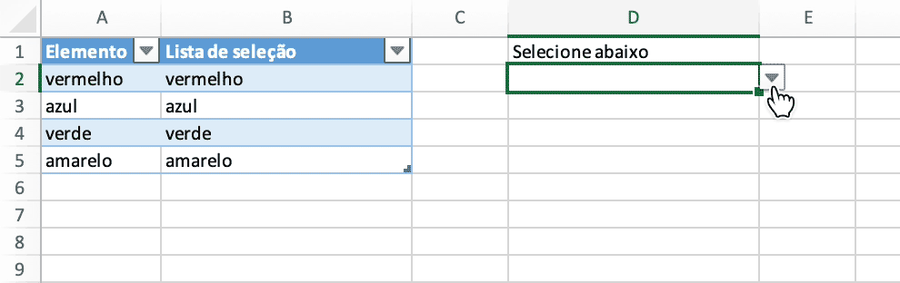

# Lista suspensa de seleção múltipla

Crie uma lista suspensa de seleção múltipla sem VBA na planilha com Excelize usando Go:

<p align="center"></p>

```go
package main

import (
    "fmt"

    "github.com/xuri/excelize/v2"
)

func main() {
    // criar uma nova planilha
    f := excelize.NewFile()
    var (
        sheetName = "Planilha1"
        selection = []string{"vermelho", "azul", "verde", "amarelo"}
        // valores de células
        data = [][]interface{}{
            {"Elemento", "Lista de seleção", nil, "Selecione abaixo"},
            {selection[0] + " "},
            {selection[1] + " "},
            {selection[2] + " "},
            {selection[3] + " "},
        }
        cell string
        err  error
    )
    if err := f.SetSheetName("Sheet1", sheetName); err != nil {
        fmt.Println(err)
        return
    }
    // definir cada valor de célula
    for r, row := range data {
        if cell, err = excelize.JoinCellName("A", r+1); err != nil {
            fmt.Println(err)
            return
        }
        if err = f.SetSheetRow(sheetName, cell, &row); err != nil {
            fmt.Println(err)
            return
        }
    }
    // definir nome definido
    for index, value := range selection {
        if cell, err = excelize.CoordinatesToCellName(1, index+2, true); err != nil {
            fmt.Println(err)
            return
        }
        if err = f.SetDefinedName(&excelize.DefinedName{
            Name:     value,
            RefersTo: fmt.Sprintf("%s!%s", sheetName, cell),
            Scope:    sheetName,
        }); err != nil {
            fmt.Println(err)
            return
        }
        if cell, err = excelize.CoordinatesToCellName(2, index+2); err != nil {
            fmt.Println(err)
            return
        }
        formula := fmt.Sprintf("=IF(ISNUMBER(FIND(%s,D2)),\"\",D2&%s)", value, value)
        if err := f.SetCellFormula(sheetName, cell, formula); err != nil {
            fmt.Println(err)
            return
        }
    }
    // definir validação de dados
    dv := excelize.NewDataValidation(true)
    dv.SetSqref("D2:D2")
    dv.SetSqrefDropList("$B$2:$B$5")
    if err = f.AddDataValidation(sheetName, dv); err != nil {
        fmt.Println(err)
        return
    }
    // definir largura de coluna personalizada
    for col, width := range map[string]float64{"A": 11, "B": 23, "D": 23} {
        if err = f.SetColWidth(sheetName, col, col, width); err != nil {
            fmt.Println(err)
            return
        }
    }
    // criar uma tabela
    if err = f.AddTable(sheetName,
        &excelize.Table{
            Range:     "A1:B5",
            Name:      "table",
            StyleName: "TableStyleMedium2",
        },
    ); err != nil {
        fmt.Println(err)
        return
    }
    // salvar arquivo de planilha
    if err := f.SaveAs("Pasta1.xlsx"); err != nil {
        fmt.Println(err)
    }
}
```
