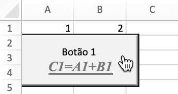
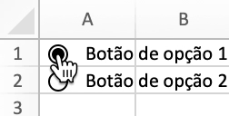

# Controles de formulário

FormControl mapeia diretamente as informações dos controles do formulário.

```go
type FormControl struct {
    Cell         string
    Macro        string
    Width        uint
    Height       uint
    Checked      bool
    CurrentVal   uint
    MinVal       uint
    MaxVal       uint
    IncChange    uint
    PageChange   uint
    Horizontally bool
    CellLink     string
    Text         string
    Paragraph    []RichTextRun
    Type         FormControlType
    Format       GraphicOptions
}
```

## Adicionar controle de formulário {#AddFormControl}

```go
func (f *File) AddFormControl(sheet string, opts FormControl) error
```

AddFormControl fornece o método para adicionar botão de controle de formulário em uma planilha por meio do nome da planilha e das opções de controle de formulário. Tipo de controle de formulário suportado: botão, caixa de seleção, caixa de grupo, rótulo, botão de opção, barra de rolagem e controle giratório. Se definir macro para o controle de formulário, a extensão da pasta de trabalho deverá ser `.xlsm` ou `.xltm`. O valor de rolagem deve estar entre 0 e 30.000.

Exemplo 1, adicione controle de formulário de botão com macro, rich text, tamanho de botão personalizado, propriedade de impressão em `Planilha1!A2` e deixe o botão não se mover ou dimensionar com células:

<p align="center"></p>

```go
enable := true
err := f.AddFormControl("Planilha1", excelize.FormControl{
    Cell:   "A2",
    Type:   excelize.FormControlButton,
    Macro:  "Button1_Click",
    Width:  140,
    Height: 60,
    Text:   "Botão 1\r\n",
    Paragraph: []excelize.RichTextRun{
        {
            Font: &excelize.Font{
                Bold:      true,
                Italic:    true,
                Underline: "single",
                Family:    "Times New Roman",
                Size:      14,
                Color:     "777777",
            },
            Text: "C1=A1+B1",
        },
    },
    Format: excelize.GraphicOptions{
        PrintObject: &enable,
        Positioning: "absolute",
    },
})
```

Exemplo 2, adicione controles de formulário de botão de opção com status verificado e texto em `Planilha1!A1` e `Planilha1!A2`:

<p align="center"></p>

```go
if err := f.AddFormControl("Planilha1", excelize.FormControl{
    Cell:    "A1",
    Type:    excelize.FormControlOptionButton,
    Text:    "Botão de opção 1",
    Checked: true,
    Height:  20,
}); err != nil {
    fmt.Println(err)
}
if err := f.AddFormControl("Planilha1", excelize.FormControl{
    Cell:    "A2",
    Type:    excelize.FormControlOptionButton,
    Text:    "Botão de opção 2",
    Height:  20,
}); err != nil {
    fmt.Println(err)
}
```

Exemplo 3, adicione o controle de formulário do botão giratório em `Planilha1!B1` para aumentar ou diminuir o valor de `Planilha1!A1`:

<p align="center"></p>

```go
err := f.AddFormControl("Planilha1", excelize.FormControl{
    Cell:       "B1",
    Type:       excelize.FormControlSpinButton,
    Width:      15,
    Height:     40,
    CurrentVal: 7,
    MinVal:     5,
    MaxVal:     10,
    IncChange:  1,
    CellLink:   "A1",
})
```

Exemplo 4, adicione o controle de formulário da barra de rolagem horizontal em `Planilha1!A2` para alterar o valor de `Planilha1!A1` clicando nas setas de rolagem ou arrastando a caixa de rolagem:

<p align="center"></p>

```go
err := f.AddFormControl("Planilha1", excelize.FormControl{
    Cell:         "A2",
    Type:         excelize.FormControlScrollBar,
    Width:        140,
    Height:       20,
    CurrentVal:   50,
    MinVal:       10,
    MaxVal:       100,
    IncChange:    1,
    PageChange:   1,
    CellLink:     "A1",
    Horizontally: true,
})
```

## Obtenha controles de formulário {#GetFormControls}

```go
func (f *File) GetFormControls(sheet string) ([]FormControl, error)
```

GetFormControls recupera todos os controles de formulário em uma planilha por um determinado nome de planilha. Observe que esta função não suporta a obtenção da largura e altura dos controles do formulário atualmente.

## Excluir controle de formulário {#DeleteFormControl}

```go
func (f *File) DeleteFormControl(sheet, cell string) error
```

DeleteFormControl fornece o método para excluir o controle de formulário em uma planilha por meio do nome da planilha e da referência de célula. Por exemplo, exclua o controle de formulário em `Planilha1!$A$1`:

```go
err := f.DeleteFormControl("Planilha1", "A1")
```
