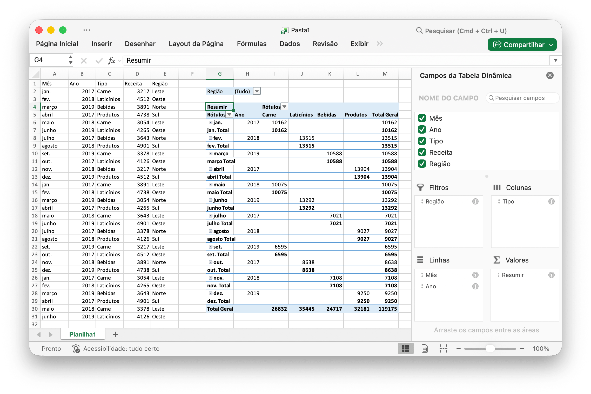

# Tabela dinâmica {#PivotTable}

Uma tabela dinâmica é uma tabela de estatísticas que resume os dados de uma tabela mais extensa (como de um banco de dados, planilha ou programa de business intelligence). Este resumo pode incluir somas, médias ou outras estatísticas, que a tabela dinâmica agrupa de maneira significativa.

`PivotTableOptions` mapeia diretamente as configurações de formato da tabela dinâmica.

```go
type PivotTableOptions struct {
    DataRange           string
    PivotTableRange     string
    Rows                []PivotTableField
    Columns             []PivotTableField
    Data                []PivotTableField
    Filter              []PivotTableField
    RowGrandTotals      bool
    ColGrandTotals      bool
    ShowDrill           bool
    UseAutoFormatting   bool
    PageOverThenDown    bool
    MergeItem           bool
    CompactData         bool
    ShowError           bool
    ShowRowHeaders      bool
    ShowColHeaders      bool
    ShowRowStripes      bool
    ShowColStripes      bool
    ShowLastColumn      bool
    PivotTableStyleName string
    // contém campos filtrados ou não exportados
}
```

`PivotTableStyleName`: Os nomes de estilo de tabela dinâmica integrados:

```text
PivotStyleLight1 - PivotStyleLight28
PivotStyleMedium1 - PivotStyleMedium28
PivotStyleDark1 - PivotStyleDark28
```

`PivotTable Field` mapeia diretamente as configurações de campo da tabela dinâmica.

```go
type PivotTableField struct {
    Compact         bool
    Data            string
    Name            string
    Outline         bool
    Subtotal        string
    DefaultSubtotal bool
}
```

`Subtotal` especifica a função de agregação que se aplica a este campo de dados. O valor padrão é `Soma`. Os valores possíveis para este atributo são:

|Valor Opcional|
|---|
|Average|
|Count|
|CountNums|
|Max|
|Min|
|Product|
|StdDev|
|StdDevp|
|Sum|
|Var|
|Varp|

`Name` especifica o nome do campo de dados. São permitidos no máximo `255` caracteres no nome do campo de dados; os caracteres em excesso serão truncados.

## Criar tabela dinâmica {#AddPivotTable}

```go
func (f *File) AddPivotTable(opts *PivotTableOptions) error
```

AddPivotTable fornece o método para adicionar tabela dinâmica por meio de determinadas opções de tabela dinâmica.

Por exemplo, crie uma tabela dinâmica na área `Planilha1!$G$2:$M$34` com a região `Planilha1!$A$1:$E$31` como fonte de dados, resumindo por soma para vendas:

<p align="center"></p>

```go
package main

import (
    "fmt"
    "math/rand"

    "github.com/xuri/excelize/v2"
)

func main() {
    f := excelize.NewFile()
    defer func() {
        if err := f.Close(); err != nil {
            fmt.Println(err)
        }
    }()
    if err := f.SetSheetName("Sheet1", "Planilha1"); err != nil {
        fmt.Println(err)
        return
    }
    // Crie alguns dados em uma planilha
    month := []string{"jan.", "fev.", "março", "abril", "maio",
        "junho", "julho", "agosto", "set.", "out.", "nov.", "dez."}
    year := []int{2017, 2018, 2019}
    types := []string{"Carne", "Laticínios", "Bebidas", "Produtos"}
    region := []string{"Leste", "Oeste", "Norte", "Sul"}
    f.SetSheetRow("Planilha1", "A1", &[]string{"Mês", "Ano", "Tipo", "Vendas", "Região"})
    for row := 2; row < 32; row++ {
        f.SetCellValue("Planilha1", fmt.Sprintf("A%d", row), month[rand.Intn(12)])
        f.SetCellValue("Planilha1", fmt.Sprintf("B%d", row), year[rand.Intn(3)])
        f.SetCellValue("Planilha1", fmt.Sprintf("C%d", row), types[rand.Intn(4)])
        f.SetCellValue("Planilha1", fmt.Sprintf("D%d", row), rand.Intn(5000))
        f.SetCellValue("Planilha1", fmt.Sprintf("E%d", row), region[rand.Intn(4)])
    }
    if err := f.AddPivotTable(&excelize.PivotTableOptions{
        DataRange:       "Planilha1!A1:E31",
        PivotTableRange: "Planilha1!G2:M34",
        Rows: []excelize.PivotTableField{
            {Data: "Mês", DefaultSubtotal: true}, {Data: "Ano"}},
        Filter: []excelize.PivotTableField{
            {Data: "Região"}},
        Columns: []excelize.PivotTableField{
            {Data: "Tipo", DefaultSubtotal: true}},
        Data: []excelize.PivotTableField{
            {Data: "Vendas", Name: "Resumir", Subtotal: "Sum"}},
        RowGrandTotals: true,
        ColGrandTotals: true,
        ShowDrill:      true,
        ShowRowHeaders: true,
        ShowColHeaders: true,
        ShowLastColumn: true,
    }); err != nil {
        fmt.Println(err)
        return
    }
    if err := f.SaveAs("Pasta1.xlsx"); err != nil {
        fmt.Println(err)
    }
}
```

## Obtenha tabelas dinâmicas {#GetPivotTables}

```go
func (f *File) GetPivotTables(sheet string) ([]PivotTableOptions, error)
```

GetPivotTables retorna todas as definições de tabela dinâmica em uma planilha por determinado nome de planilha.

## Excluir tabela dinâmica {#DeletePivotTable}

```go
func (f *File) DeletePivotTable(sheet, name string) error
```

Excluir tabela dinâmica exclui uma tabela dinâmica fornecendo o nome da planilha e o nome da tabela dinâmica. Observe que esta função não limpa os valores das células no intervalo da tabela dinâmica.
