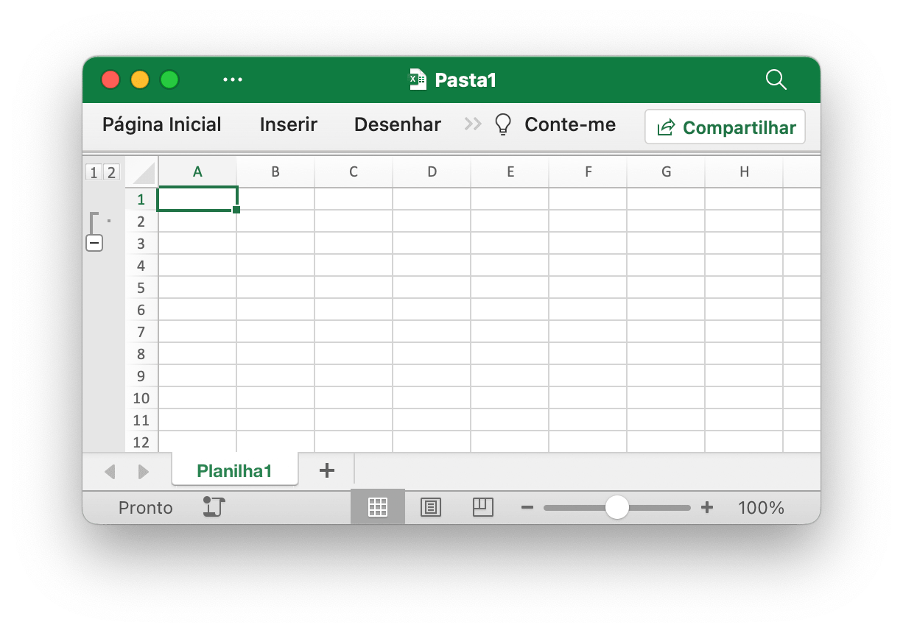
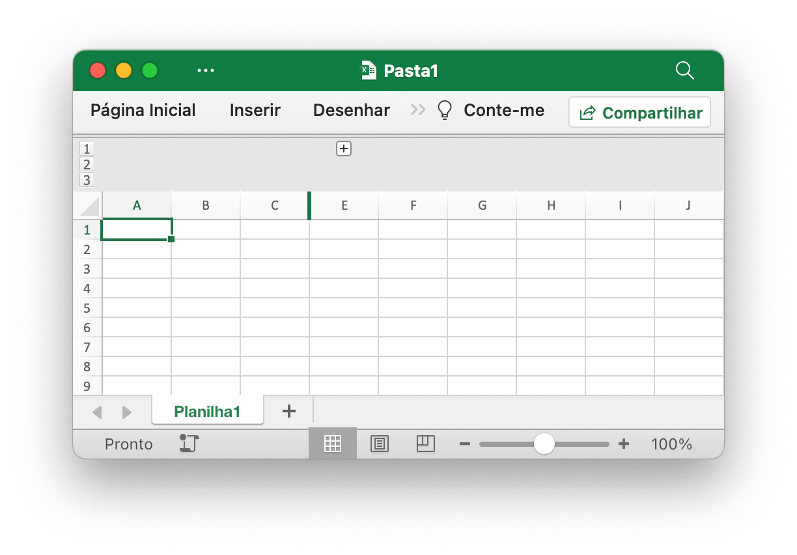
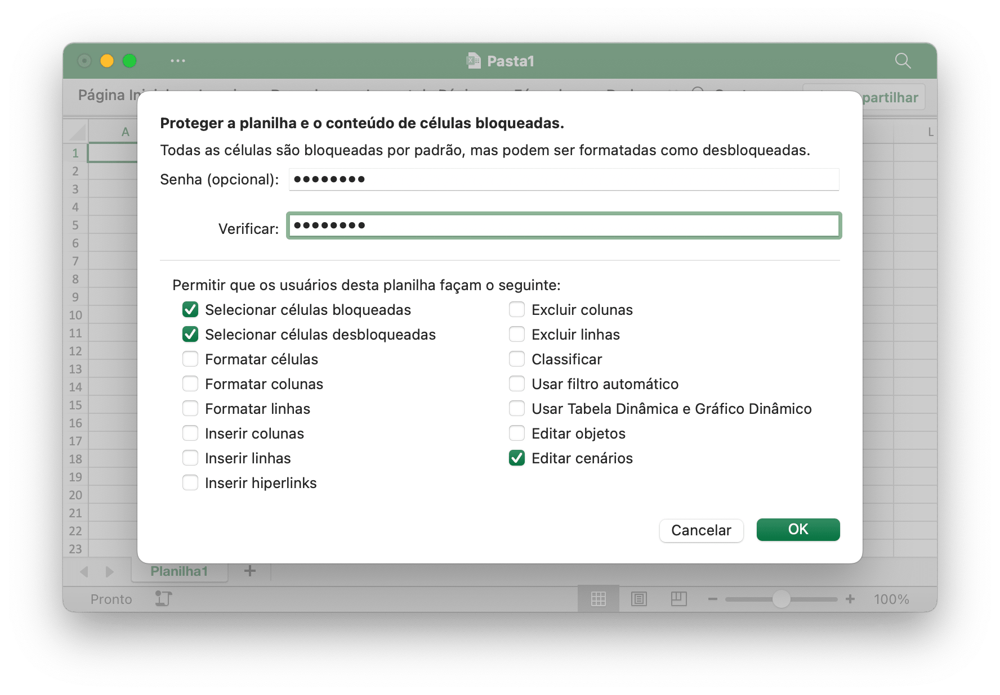

# Planilha

## Definir visibilidade da coluna {#SetColVisible}

```go
func (f *File) SetColVisible(sheet, col string, visible bool) error
```

SetColVisible fornece uma função para definir a visibilidade de uma única coluna por determinado nome de planilha e nome de coluna. Esta função é segura para simultaneidade. Por exemplo, oculte a coluna `D` em `Planilha1`:

```go
err := f.SetColVisible("Planilha1", "D", false)
```

Oculte as colunas de `D` a `F` (incluídas):

```go
err := f.SetColVisible("Planilha1", "D:F", false)
```

## Definir largura da coluna {#SetColWidth}

```go
func (f *File) SetColWidth(sheet, startCol, endCol string, width float64) error
```

SetColWidth fornece uma função para definir a largura de uma única coluna ou de várias colunas. Esta função é segura para simultaneidade. Por exemplo:

```go
f := excelize.NewFile()
err := f.SetColWidth("Planilha1", "A", "H", 20)
```

## Definir altura da linha {#SetRowHeight}

```go
func (f *File) SetRowHeight(sheet string, row int, height float64) error
```

SetRowHeight fornece uma função para definir a altura de uma única linha. Se o valor da altura for `0`, ocultará a linha especificada; se o valor da altura for `-1`, desativa a altura da linha personalizada. Por exemplo, defina a altura da primeira linha em `Planilha1`:

```go
err := f.SetRowHeight("Planilha1", 1, 50)
```

## Definir visibilidade da linha {#SetRowVisible}

```go
func (f *File) SetRowVisible(sheet string, row int, visible bool) error
```

SetRowVisible fornece uma função para definir a visibilidade de uma única linha por determinado nome de planilha e número de linha. Por exemplo, oculte a linha `2` em `Planilha1`:

```go
err := f.SetRowVisible("Planilha1", 2, false)
```

## Obter o nome da planilha {#GetSheetName}

```go
func (f *File) GetSheetName(index int) string
```

GetSheetName fornece uma função para obter o nome da planilha da pasta de trabalho pelo índice da planilha fornecido. Se o índice da planilha fornecido for inválido, ele retornará uma string vazia.

## Obtenha visibilidade da coluna {#GetColVisible}

```go
func (f *File) GetColVisible(sheet, column string) (bool, error)
```

GetColVisible fornece uma função para tornar visível uma única coluna por determinado nome de planilha e nome de coluna. Esta função é segura para simultaneidade. Por exemplo, obtenha o estado visível da coluna `D` em `Planilha1`:

```go
visible, err := f.GetColVisible("Planilha1", "D")
```

## Obtenha largura da coluna {#GetColWidth}

```go
func (f *File) GetColWidth(sheet, col string) (float64, error)
```

GetColWidth fornece uma função para obter a largura da coluna, fornecendo o nome da planilha e o nome da coluna. Esta função é segura para simultaneidade.

## Obtenha a altura da linha {#GetRowHeight}

```go
func (f *File) GetRowHeight(sheet string, row int) (float64, error)
```

GetRowHeight fornece uma função para obter a altura da linha por determinado nome da planilha e número da linha. Por exemplo, obtenha a altura da primeira linha em `Planilha1`:

```go
height, err := f.GetRowHeight("Planilha1", 1)
```

## Obtenha visibilidade de linha {#GetRowVisible}

```go
func (f *File) GetRowVisible(sheet string, row int) (bool, error)
```

GetRowVisible fornece uma função para tornar visível uma única linha por determinado nome de planilha e número de linha. Por exemplo, obtenha o estado visível da linha `2` em `Planilha1`:

```go
visible, err := f.GetRowVisible("Planilha1", 2)
```

## Obtenha o índice da planilha {#GetSheetIndex}

```go
func (f *File) GetSheetIndex(sheet string) (int, error)
```

GetSheetIndex fornece uma função para obter um índice de planilha da pasta de trabalho pelo nome da planilha fornecido. Se o nome da planilha fornecido for inválido ou a planilha não existir, ele retornará um valor de tipo inteiro -1.

O índice obtido pode ser usado como parâmetro para chamar a função [`SetActiveSheet()`](workbook.md#SetActiveSheet) ao definir a planilha padrão da pasta de trabalho.

## Obter mapa de planilha {#GetSheetMap}

```go
func (f *File) GetSheetMap() map[int]string
```

GetSheetMap fornece uma função para obter planilhas, planilhas de gráfico, ID de planilhas de diálogo e mapas de nomes da pasta de trabalho. Por exemplo:

```go
f, err := excelize.OpenFile("Pasta1.xlsx")
if err != nil {
    return
}
defer func() {
    if err := f.Close(); err != nil {
        fmt.Println(err)
    }
}()
for index, name := range f.GetSheetMap() {
    fmt.Println(index, name)
}
```

## Obter lista de planilhas {#GetSheetList}

```go
func (f *File) GetSheetList() []string
```

GetSheetList fornece uma função para obter planilhas, planilhas de gráfico e lista de nomes de planilhas de diálogo da pasta de trabalho.

## Definir nome da planilha {#SetSheetName}

```go
func (f *File) SetSheetName(source, target string) error
```

SetSheetName fornece uma função para definir o nome da planilha, fornecendo os nomes da planilha de origem e de destino. São permitidos no máximo 31 caracteres no título da planilha e esta função apenas altera o nome da planilha e não atualizará o nome da planilha na fórmula ou referência associada à célula. Portanto, pode haver um erro de fórmula problemática ou falta de referência.

## Inserir colunas {#InsertCols}

```go
func (f *File) InsertCols(sheet, col string, n int) error
```

InsertCols fornece uma função para inserir novas colunas antes do nome da coluna e do número de colunas fornecidos. Por exemplo, crie duas colunas antes da coluna `C` em `Planilha1`:

```go
err := f.InsertCols("Planilha1", "C", 2)
```

## Inserir linhas {#InsertRows}

```go
func (f *File) InsertRows(sheet string, row, n int) error
```

InsertRows fornece uma função para inserir novas linhas após o número de linha fornecido do Excel, começando em `1` e o número de linhas. Por exemplo, crie duas linhas antes da linha `3` em `Planilha1`:

```go
err := f.InsertRows("Planilha1", 3, 2)
```

## Anexar linha duplicada {#DuplicateRow}

```go
func (f *File) DuplicateRow(sheet string, row int) error
```

DuplicateRow insere uma cópia da linha específica abaixo especificada, por exemplo:

```go
err := f.DuplicateRow("Planilha1", 2)
```

Use este método com cuidado, pois afetará alterações em referências como fórmulas, gráficos e assim por diante. Se houver algum valor referenciado da planilha, isso causará um erro de arquivo ao abri-lo. O Excelize atualiza apenas parcialmente essas referências atualmente.

## Linha duplicada {#DuplicateRowTo}

```go
func (f *File) DuplicateRowTo(sheet string, row, row2 int) error
```

DuplicateRowTo insere uma cópia da linha especificada por seu número do Excel na posição da linha especificada, movendo para baixo as linhas existentes após a posição de destino, por exemplo:

```go
err := f.DuplicateRowTo("Planilha1", 2, 7)
```

Use este método com cuidado, pois afetará alterações em referências como fórmulas, gráficos e assim por diante. Se houver algum valor referenciado da planilha, isso causará um erro de arquivo ao abri-lo. O Excelize atualiza apenas parcialmente essas referências atualmente.

## Criar contorno de linha {#SetRowOutlineLevel}

```go
func (f *File) SetRowOutlineLevel(sheet string, row int, level uint8) error
```

SetRowOutlineLevel fornece uma função para definir o número do nível de estrutura de tópicos de uma única linha por determinado nome da planilha e número da linha do Excel. Por exemplo, delineie a linha 2 em `Planilha1` para o nível 1:

<p align="center"></p>

```go
err := f.SetRowOutlineLevel("Planilha1", 2, 1)
```

## Criar contorno de coluna {#SetColOutlineLevel}

```go
func (f *File) SetColOutlineLevel(sheet, col string, level uint8) error
```

SetColOutlineLevel fornece uma função para definir o nível de estrutura de tópicos de uma única coluna por determinado nome de planilha e nome de coluna. Por exemplo, defina o nível de contorno da coluna `D` em `Planilha1` como 2:

<p align="center"></p>

```go
err := f.SetColOutlineLevel("Planilha1", "D", 2)
```

## Obtenha o contorno da linha {#GetRowOutlineLevel}

```go
func (f *File) GetRowOutlineLevel(sheet string, row int) (uint8, error)
```

GetRowOutlineLevel fornece uma função para obter o número do nível de estrutura de tópicos de uma única linha por meio do nome da planilha e do número da linha. Por exemplo, obtenha o número do contorno da linha 2 em `Planilha1`:

```go
level, err := f.GetRowOutlineLevel("Planilha1", 2)
```

## Obtenha o contorno da coluna {#GetColOutlineLevel}

```go
func (f *File) GetColOutlineLevel(sheet, col string) (uint8, error)
```

GetColOutlineLevel fornece uma função para obter o nível de estrutura de tópicos de uma única coluna por determinado nome de planilha e nome de coluna. Por exemplo, obtenha o nível de contorno da coluna `D` em `Planilha1`:

```go
level, err := f.GetColOutlineLevel("Planilha1", "D")
```

## Iterador de coluna {#Cols}

```go
func (f *File) Cols(sheet string) (*Cols, error)
```

Cols retorna um iterador de coluna, usado para streaming de leitura de dados para uma planilha com grandes dados. Esta função é segura para simultaneidade. Por exemplo:

```go
cols, err := f.Cols("Planilha1")
if err != nil {
    fmt.Println(err)
    return
}
for cols.Next() {
    col, err := cols.Rows()
    if err != nil {
        fmt.Println(err)
    }
    for _, rowCell := range col {
        fmt.Print(rowCell, "\t")
    }
    fmt.Println()
}
```

### Iterador de coluna - Colunas

```go
func (cols *Cols) Rows(opts ...Options) ([]string, error)
```

Rows retorna os valores de linha da coluna atual.

### Iterador de coluna - Atravessando

```go
func (cols *Cols) Next() bool
```

Next retornará `true` se a próxima coluna for encontrada.

### Iterador de coluna – Tratamento de erros

```go
func (cols *Cols) Error() error
```

Error retornará o `error` quando o erro ocorrer.

## Iterador de linha {#Rows}

```go
func (f *File) Rows(sheet string) (*Rows, error)
```

Rows retorna um iterador de linhas, usado para transmitir dados de leitura para uma planilha com dados grandes. Esta função é segura para simultaneidade. Por exemplo:

```go
rows, err := f.Rows("Planilha1")
if err != nil {
    fmt.Println(err)
    return
}
for rows.Next() {
    row, err := rows.Columns()
    if err != nil {
        fmt.Println(err)
    }
    for _, colCell := range row {
        fmt.Print(colCell, "\t")
    }
    fmt.Println()
}
if err = rows.Close(); err != nil {
    fmt.Println(err)
}
```

### Iterador de linha - Colunas

```go
func (rows *Rows) Columns(opts ...Options) ([]string, error)
```

As colunas retornam os valores das colunas da linha atual. Isso busca os dados da planilha como um fluxo, retorna cada célula em uma linha como está e não ignora linhas vazias no final da planilha.

### Iterador de linha - Atravessando

```go
func (rows *Rows) Next() bool
```

Next retornará `true` se encontrar o próximo elemento da linha.

### Iterador de linha - tratamento de erros

```go
func (rows *Rows) Error() error
```

Error retornará o `error` quando o erro ocorrer.

### Iterador de linha – Obtenha opções de linha

```go
func (rows *Rows) GetRowOpts() RowOpts
```

GetRowOpts retornará o `RowOpts` da linha atual.

### Iterador de linha - Fechar

```go
func (rows *Rows) Close() error
```

Close fecha o arquivo XML da planilha aberta no diretório temporário do sistema.

## Pesquisar na planilha {#SearchSheet}

```go
func (f *File) SearchSheet(sheet, value string, reg ...bool) ([]string, error)
```

SearchSheet fornece uma função para obter referência de célula por determinado nome de planilha, valor de célula e expressão regular. A função não suporta pesquisa no resultado calculado, números formatados e pesquisa condicional atualmente. Se for uma célula mesclada, retornará a referência da célula superior esquerda da referência do intervalo mesclado.

Por exemplo, pesquise a referência de célula do valor `100` em `Planilha1`:

```go
result, err := f.SearchSheet("Planilha1", "100")
```

Por exemplo, pesquise a referência da célula onde está descrito o valor numérico no intervalo `0-9` de `Planilha1`:

```go
result, err := f.SearchSheet("Planilha1", "[0-9]", true)
```

## Proteger planilha {#ProtectSheet}

```go
func (f *File) ProtectSheet(sheet string, opts *SheetProtectionOptions) error
```

ProtectSheet fornece uma função para evitar que outros usuários alterem, movam ou excluam acidentalmente ou deliberadamente dados em uma planilha. O campo opcional `AlgorithmName` especificado algoritmo de hash, suporte XOR, MD4, MD5, SHA-1, SHA-256, SHA-384 e SHA-512 atualmente, se nenhum algoritmo de hash especificado, usará o algoritmo XOR como padrão. Por exemplo, proteja `Planilha1` com configurações de proteção:

<p align="center"></p>

```go
err := f.ProtectSheet("Planilha1", &excelize.SheetProtectionOptions{
    AlgorithmName:       "SHA-512",
    Password:            "password",
    SelectLockedCells:   true,
    SelectUnlockedCells: true,
    EditScenarios:       true,
})
```

SheetProtectionOptions mapeia diretamente as configurações de proteção de planilha.

```go
type SheetProtectionOptions struct {
    AlgorithmName       string
    AutoFilter          bool
    DeleteColumns       bool
    DeleteRows          bool
    EditObjects         bool
    EditScenarios       bool
    FormatCells         bool
    FormatColumns       bool
    FormatRows          bool
    InsertColumns       bool
    InsertHyperlinks    bool
    InsertRows          bool
    Password            string
    PivotTables         bool
    SelectLockedCells   bool
    SelectUnlockedCells bool
    Sort                bool
}
```

## Desproteger planilha {#UnprotectSheet}

```go
func (f *File) UnprotectSheet(sheet string, password ...string) error
```

UnprotectSheet fornece uma função para remover a proteção de uma planilha, especificando o segundo parâmetro de senha opcional para remover a proteção da planilha com verificação de senha.

## Obter opções de proteção da planilha {#GetSheetProtection}

```go
func (f *File) GetSheetProtection(sheet string) (SheetProtectionOptions, error)
```

GetSheetProtection fornece uma função para obter as configurações de proteção da planilha pelo nome da planilha fornecido. Observe que a senha no resultado da função estará sempre vazia.

## Remover coluna {#RemoveCol}

```go
func (f *File) RemoveCol(sheet, col string) error
```

RemoveCol fornece uma função para remover uma única coluna por determinado nome de planilha e índice de coluna. Por exemplo, remova a coluna `C` em `Planilha1`:

```go
err := f.RemoveCol("Planilha1", "C")
```

Use este método com cuidado, pois afetará alterações em referências como fórmulas, gráficos e assim por diante. Se houver algum valor referenciado da planilha, isso causará um erro de arquivo ao abri-lo. O Excelize atualiza apenas parcialmente essas referências atualmente.

## Remover linha {#RemoveRow}

```go
func (f *File) RemoveRow(sheet string, row int) error
```

RemoveRow fornece uma função para remover uma única linha por determinado nome de planilha e número de linha do Excel. Por exemplo, remova a linha `3` em `Planilha1`:

```go
err := f.RemoveRow("Planilha1", 3)
```

Use este método com cuidado, pois afetará alterações em referências como fórmulas, gráficos e assim por diante. Se houver algum valor referenciado da planilha, isso causará um erro de arquivo ao abri-lo. O Excelize atualiza apenas parcialmente essas referências atualmente.

## Definir valores de coluna {#SetSheetCol}

```go
func (f *File) SetSheetCol(sheet, cell string, slice interface{}) error
```

SetSheetCol grava um array na coluna pelo nome da planilha, iniciando a referência da célula e um ponteiro para o tipo de array `slice`. Por exemplo, escreve um array na coluna `B` começando pela célula `B6` no `Planilha1`:

```go
err := f.SetSheetCol("Planilha1", "B6", &[]interface{}{"1", nil, 2})
```

## Definir valores de linha {#SetSheetRow}

```go
func (f *File) SetSheetRow(sheet, cell string, slice interface{}) error
```

SetSheetRow grava um array na linha por determinado nome de planilha, iniciando a referência de célula e um ponteiro para o tipo de array `slice`. Esta função é segura para simultaneidade. Por exemplo, escreve um array na linha `6` começando com a célula `B6` no `Planilha1`:

```go
err := f.SetSheetRow("Planilha1", "B6", &[]interface{}{"1", nil, 2})
```

## Inserir quebra de página {#InsertPageBreak}

```go
func (f *File) InsertPageBreak(sheet, cell string) error
```

InsertPageBreak cria uma quebra de página para determinar onde termina a página impressa e onde começa a próxima, com base no nome da planilha e na referência de célula, de forma que o conteúdo antes da quebra de página seja impresso em uma página e depois da quebra em outra.

## Remover quebra de página {#RemovePageBreak}

```go
func (f *File) RemovePageBreak(sheet, cell string) error
```

RemovePageBreak remove uma quebra de página por determinado nome de planilha e referência de célula.

## Definir dimensão da planilha {#SetSheetDimension}

```go
func (f *File) SetSheetDimension(sheet string, rangeRef string) error
```

SetSheetDimension fornece o método para definir ou remover o intervalo usado da planilha por uma determinada referência de intervalo. Ele especifica os limites de linha e coluna das células usadas na planilha. A referência de intervalo é definida usando o estilo de referência A1 (por exemplo, `A1:D5`). Passar uma referência de intervalo vazio removerá o intervalo usado da planilha.

## Obter dimensão da planilha {#GetSheetDimension}

```go
func (f *File) GetSheetDimension(sheet string) (string, error)
```

GetSheetDimension fornece o método para obter o intervalo usado da planilha.
