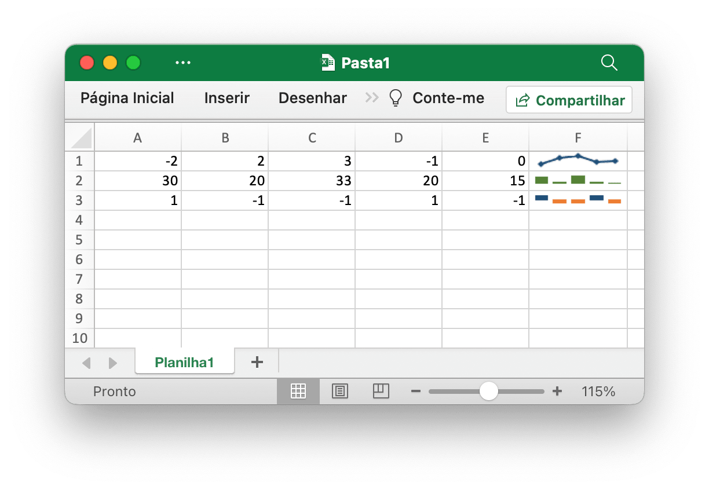
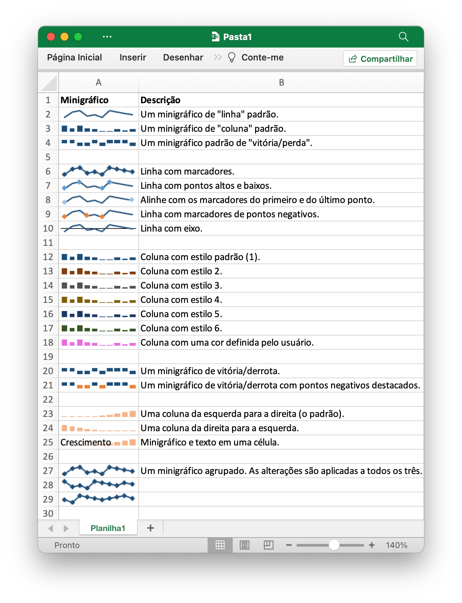

# Minigráficos

Minigráficos são um recurso do Excel 2010+ que permite adicionar pequenos gráficos às células da planilha. Eles são úteis para mostrar tendências visuais em dados em formato compacto.

<p align="center"></p>

[Minigráficos](https://pt.wikipedia.org/wiki/Sparklines) foi inventado por [Edward Tufte](https://pt.wikipedia.org/wiki/Edward_Tufte).

## Adicionar minigráfico

```go
func (f *File) AddSparkline(sheet string, opts *SparklineOptions) error
```

AddSparkline fornece uma função para adicionar minigráficos à planilha com base em opções de formatação. Minigráficos são pequenos gráficos que cabem em uma única célula e são usados para mostrar tendências nos dados. Minigráficos são um recurso apenas do Excel 2010 e posterior. Você pode gravá-los em um arquivo de planilha que pode ser lido pelo Excel 2007, mas eles não serão exibidos. Por exemplo, adicione um minigráfico agrupado. As alterações são aplicadas a todos os três:

```go
err := f.AddSparkline("Planilha1", &excelize.SparklineOptions{
    Location: []string{"A1", "A2", "A3"},
    Range:    []string{"Planilha2!A1:J1", "Planilha2!A2:J2", "Planilha2!A3:J3"},
    Markers:  true,
})
```

<p align="center"></p>

A seguir mostramos as opções de formatação de minigráfico suportadas pelo Excelize:

Parâmetro | Descrição
---|---
Location    | Obrigatório, deve ter o mesmo número com o parâmetro `Range`
Range       | Obrigatório, deve ter o mesmo número com o parâmetro `Location`
Type        | Valor de enumeração: `line`, `column`, `win_loss`
Style       | Faixa de valores: 0 - 35
Hight       | Alternar pontos altos do minigráfico
Low         | Alternar pontos baixos do minigráfico
First       | Alternar os primeiros pontos do minigráfico
Last        | Alternar os últimos pontos do minigráfico
Negative    | Alternar pontos negativos do minigráfico
Markers     | Alternar marcadores de minigráfico
Axis        | Usado para especificar se mostrar o eixo horizontal
Reverse     | Usado para especificar se os dados de plotagem estão habilitados da direita para a esquerda
SeriesColor | Uma cor hexadecimal é especificada como `RRGGBB`
