

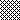
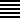
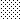
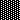

# Estilo

Alignment mapeia diretamente as configurações de alinhamento das células.

```go
type Alignment struct {
    Horizontal      string
    Indent          int
    JustifyLastLine bool
    ReadingOrder    uint64
    RelativeIndent  int
    ShrinkToFit     bool
    TextRotation    int
    Vertical        string
    WrapText        bool
}
```

Border mapeia diretamente as configurações de borda das células.

```go
type Border struct {
    Type  string
    Color string
    Style int
}
```

Font mapeia diretamente as configurações de fonte das fontes.

```go
type Font struct {
    Bold         bool
    Italic       bool
    Underline    string
    Family       string
    Size         float64
    Strike       bool
    Color        string
    ColorIndexed int
    ColorTheme   *int
    ColorTint    float64
    VertAlign    string
}
```

Fill mapeia diretamente as configurações de preenchimento das células.

```go
type Fill struct {
    Type         string
    Pattern      int
    Color        []string
    Shading      int
    Transparency int
}
```

Protection mapeia diretamente as configurações de proteção das células.

```go
type Protection struct {
    Hidden bool
    Locked bool
}
```

Style mapeia diretamente as configurações de estilo das células.

```go
type Style struct {
    Border        []Border
    Fill          Fill
    Font          *Font
    Alignment     *Alignment
    Protection    *Protection
    NumFmt        int
    DecimalPlaces int
    CustomNumFmt  *string
    NegRed        bool
}
```

## Criar estilo {#NewStyle}

```go
func (f *File) NewStyle(style *Style) (int, error)
```

NewStyle fornece uma função para criar o estilo para células por meio de determinadas opções de estilo e retorna o índice de estilo. O mesmo índice de estilo não pode ser usado em pastas de trabalho diferentes. Esta função é segura para simultaneidade. Observe que o campo `Font.Color` usa uma cor hexadecimal representada em notação hexadecimal `RRGGBB`.

### Fronteira {#border}

A tabela a seguir mostra os tipos de borda usados em `Border.Type` suportados pelo Excelize:

Tipo|Descrição|Tipo|Descrição
---|---|---|---
left|Borda esquerda|top|Borda superior
right|Borda direita|bottom|Borda inferior
diagonalDown|Borda diagonal para baixo|diagonalUp|Fronteira diagonal para cima

A tabela a seguir mostra os estilos de borda usados em `Border.Style` suportados pelo número de índice do Excelize:

Índice|Estilo|Linha|Visualização
---|---|---|---
0|Nenhum|0|
1|Contínuo|1|
2|Contínuo|2|
3|Tracejada|1|
4|Ponto|1|
5|Contínuo|3|
6|Double|3|
7|Contínuo|0|
8|Tracejada|2|
9|Tracejada Ponto|1|
10|Tracejada Ponto|2|
11|Tracejada Ponto Ponto|1|
12|Tracejada Ponto Ponto|2|
13|SlantDash Ponto|2|

A tabela a seguir mostra os estilos de borda usados em `Border.Style` na ordem mostrada na caixa de diálogo do Excel:

Índice|Visualização|Índice|Preview
---|---|---|---
0||12|
7||13|
4||10|
11||8|
9||2|
3||5|
1||6|

### Preenchimento de cor {#shading}

A tabela a seguir mostra os estilos de sombreamento usados em `Fill.Shading` suportados pelo número de índice do Excelize:

Índice|Estilo|Índice|Estilo
---|---|---|---
0|Horizontal|3|Diagonal para baixo
1|Vertical|4|Do canto
2|Diagonal para cima|5|Do centro

### Preenchimento de padrão {#pattern}

A tabela a seguir mostra os estilos de padrão usados em `Fill.Pattern` suportados pelo número de índice do Excelize:

Índice|Estilo|Índice|Estilo
---|---|---|---
0|Nenhum|10|
1||11|
2||12|
3||13|
4||14|
5||15|
6||16|
7||17|
8||18|
9|||

### Transparência {#transparency}

A função `Fill.Transparency` é usada apenas para definir a transparência do gráfico e da forma, não sendo usada para células. O valor deve ser um número de 0 a 100, que representa de 0% a 100%. O valor padrão é 0, representando opacidade total (não transparente).

### Alinhamento {#align}

#### Recuar

O `Indent` é um valor inteiro, onde um incremento de 1 representa 3 espaços. Indica o número de espaços (da fonte de estilo normal) de recuo do texto em uma célula. O número de espaços a recuar é calculado da seguinte forma:

Número de espaços para recuar = valor de recuo * 3

Por exemplo, um valor de recuo 1 significa que o texto começa a 3 larguras de espaço (da fonte de estilo normal) a partir da borda da célula. Nota: A largura de um caractere de espaço é definida pela fonte. Somente alinhamentos horizontais esquerdo, direito e distribuído são suportados.

#### Alinhamento horizontal

A tabela a seguir mostra o tipo de alinhamento horizontal das células usado em `Alignment.Horizontal`:

Tipo|Estilo
---|---
left|Esquerda (recuado)
center|Centralizado
right|Direita (recuado)
fill|Enchimento
justify|Justificado
centerContinuous|Centrado em colunas cruzadas
distributed|Alinhamento descentralizado (recuado)

#### Alinhamento vertical

A tabela a seguir mostra o tipo de alinhamento vertical das células usado em `Alignment.Vertical`:

Tipo|Estilo
---|---
top|Alinhamento superior
center|Centralizado
justify|Justificado
distributed|Alinhamento descentralizado

#### Ordem de leitura

`ReadingOrder` é um valor uint64 que indica se a ordem de leitura da célula é da esquerda para a direita, da direita para a esquerda ou depende do contexto. o valor válido deste campo era:

Valor|Descrição
---|---
0 | Dependente do contexto - a ordem de leitura é determinada pela varredura do texto em busca do primeiro caractere que não seja um espaço em branco: se for um caractere forte da direita para a esquerda, a ordem de leitura será da direita para a esquerda; caso contrário, a ordem de leitura da esquerda para a direita.
1 | Da esquerda para a direita: a ordem de leitura é da esquerda para a direita na célula, como em inglês.
2 | Da direita para a esquerda: a ordem de leitura é da direita para a esquerda na célula, como em hebraico.

#### Recuo relativo

`RelativeIndent` é um valor inteiro para indicar o número adicional de espaços de recuo para ajustar o texto em uma célula.

### Sublinhado da fonte {#underline}

A tabela a seguir mostra o tipo de estilo de sublinhado de fonte usado em `Font.Underline`:

Tipo|Estilo
---|---
single|Única linha
double|Linha dupla

### Formato numérico {#number_format}

Os formatos integrados de todos os idiomas do Excel (o campo `Style.NumFmt`) são mostrados na tabela a seguir:

Índice|Tipo
---|---
0|`General`
1|`0`
2|`0.00`
3|`#,##0`
4|`#,##0.00`
5|`($#,##0_);($#,##0)`
6|`($#,##0_);[Red]($#,##0)`
7|`($#,##0.00_);($#,##0.00)`
8|`($#,##0.00_);[Red]($#,##0.00)`
9|`0%`
10|`0.00%`
11|`0.00E+00`
12|`# ?/?`
13|`# ??/??`
14|`mm-dd-yy`
15|`d-mmm-yy`
16|`d-mmm`
17|`mmm-yy`
18|`h:mm AM/PM`
19|`h:mm:ss AM/PM`
20|`h:mm`
21|`h:mm:ss`
22|`m/d/yy h:mm`
...|`...`
37|`(#,##0_);(#,##0)`
38|`(#,##0_);[Red](#,##0)`
39|`(#,##0.00_);(#,##0.00)`
40|`(#,##0.00_);[Red](#,##0.00)`
41|`_(* #,##0_);_(* (#,##0);_(* "-"_);_(@_)`
42|`_($* #,##0_);_($* (#,##0);_($* "-"_);_(@_)`
43|`_(* #,##0.00_);_(* (#,##0.00);_(* "-"??_);_(@_)`
44|`_($* #,##0.00_);_($* (#,##0.00);_($* "-"??_);_(@_)`
45|`mm:ss`
46|`[h]:mm:ss`
47|`mm:ss.0`
48|`##0.0E+0`
49|`@`

#### Formato numérico chinês tradicional

Código de formato numérico na linguagem `zh-tw`:

Índice|Tipo
---|---
27|`[$-404]e/m/d`
28|`[$-404]e"年"m"月"d"日"`
29|`[$-404]e"年"m"月"d"日"`
30|`m/d/yy`
31|`yyyy"年"m"月"d"日"`
32|`hh"時"mm"分"`
33|`hh"時"mm"分"ss"秒"`
34|`上午/下午 hh"時"mm"分"`
35|`上午/下午 hh"時"mm"分"ss"秒"`
36|`[$-404]e/m/d`
50|`[$-404]e/m/d`
51|`[$-404]e"年"m"月"d"日"`
52|`上午/下午 hh"時"mm"分"`
53|`上午/下午 hh"時"mm"分"ss"秒"`
54|`[$-404]e"年"m"月"d"日"`
55|`上午/下午 hh"時"mm"分"`
56|`上午/下午 hh"時"mm"分"ss"秒"`
57|`[$-404]e/m/d`
58|`[$-404]e"年"m"月"d"日"`

#### Formato numérico chinês simplificado

Código de formato numérico na linguagem `zh-cn`:

Índice|Tipo
---|---
27|`yyyy"年"m"月"`
28|`m"月"d"日"`
29|`m"月"d"日"`
30|`m-d-yy`
31|`yyyy"年"m"月"d"日"`
32|`h"时"mm"分"`
33|`h"时"mm"分"ss"秒"`
34|`上午/下午 h"时"mm"分"`
35|`上午/下午 h"时"mm"分"ss"秒`
36|`yyyy"年"m"月`
50|`yyyy"年"m"月`
51|`m"月"d"日`
52|`yyyy"年"m"月`
53|`m"月"d"日`
54|`m"月"d"日`
55|`上午/下午 h"时"mm"分`
56|`上午/下午 h"时"mm"分"ss"秒`
57|`yyyy"年"m"月`
58|`m"月"d"日"`

#### Formato numérico japonês

Código de formato numérico na linguagem `ja-jp`:

Índice|Tipo
---|---
27|`[$-411]ge.m.d`
28|`[$-411]ggge"年"m"月"d"日`
29|`[$-411]ggge"年"m"月"d"日`
30|`m/d/y`
31|`yyyy"年"m"月"d"日`
32|`h"時"mm"分`
33|`h"時"mm"分"ss"秒`
34|`yyyy"年"m"月`
35|`m"月"d"日`
36|`[$-411]ge.m.d`
50|`[$-411]ge.m.d`
51|`[$-411]ggge"年"m"月"d"日`
52|`yyyy"年"m"月`
53|`m"月"d"日`
54|`[$-411]ggge"年"m"月"d"日`
55|`yyyy"年"m"月`
56|`m"月"d"日`
57|`[$-411]ge.m.d`
58|`[$-411]ggge"年"m"月"d"日"`

#### Formato numérico coreano

Código de formato numérico na linguagem `ko-kr`:

Índice|Tipo
---|---
27|`yyyy"年" mm"月" dd"日`
28|`mm-d`
29|`mm-d`
30|`mm-dd-y`
31|`yyyy"년" mm"월" dd"일`
32|`h"시" mm"분`
33|`h"시" mm"분" ss"초`
34|`yyyy-mm-d`
35|`yyyy-mm-d`
36|`yyyy"年" mm"月" dd"日`
50|`yyyy"年" mm"月" dd"日`
51|`mm-d`
52|`yyyy-mm-d`
53|`yyyy-mm-d`
54|`mm-d`
55|`yyyy-mm-d`
56|`yyyy-mm-d`
57|`yyyy"年" mm"月" dd"日`
58|`mm-dd`

#### Formato numérico do idioma tailandês

Código de formato numérico na linguagem `th-th`:

Índice|Tipo
---|---
59|`t`
60|`t0.0`
61|`t#,##`
62|`t#,##0.0`
67|`t0`
68|`t0.00`
69|`t# ?/`
70|`t# ??/?`
71|`ว/ด/ปปป`
72|`ว-ดดด-ป`
73|`ว-ดด`
74|`ดดด-ป`
75|`ช:น`
76|`ช:นน:ท`
77|`ว/ด/ปปปป ช:น`
78|`นน:ท`
79|`[ช]:นน:ท`
80|`นน:ทท.`
81|`d/m/bb`

### Formato de moeda

Os formatos de moeda integrados do Excelize são mostrados na tabela a seguir, suportam apenas esses tipos na tabela a seguir (o número do índice é usado apenas para marcação e não é usado dentro de um arquivo Excel e você não pode obter o valor formatado pela função [`GetCellValue`](cell.md#GetCellValue)) atualmente:

Índice|Formato de moeda
---|---
164|¥
165|$ Inglês (Estados Unidos)
166|$ Cherokee (Estados Unidos)
167|$ Chinês (Singapura)
168|$ Chinês (Taiwan)
169|$ Inglês (Austrália)
170|$ Inglês (Belize)
171|$ Inglês (Canadá)
172|$ Inglês (Jamaica)
173|$ Inglês (Nova Zelândia)
174|$ Inglês (Singapura)
175|$ Inglês (Trindade e Tobago)
176|$ Inglês (Ilhas Virgens Americanas)
177|$ Inglês (Estados Unidos)
178|$ Francês (Canadá)
179|$ Havaiano (Estados Unidos)
180|$ Malaio (Brunei)
181|$ Quechua (Equador)
182|$ Espanhol (Chile)
183|$ Espanhol (Colômbia)
184|$ Espanhol (Equador)
185|$ Espanhol (El Salvador)
186|$ Espanhol (México)
187|$ Espanhol (Porto Rico)
188|$ Espanhol (Estados Unidos)
189|$ Espanhol (Uruguai)
190|£ Inglês (Reino Unido)
191|£ Gaélico Escocês (Reino Unido)
192|£ Galês (Reino Unido)
193|¥ Chinês (China)
194|¥ Japonês (Japão)
195|¥ Sichuan Yi (China)
196|¥ Tibetano (China)
197|¥ Uigur (China)
198|֏ Armênio (Armênia)
199|؋ Pashto (Afeganistão)
200|؋ Persa (Afeganistão)
201|৳ Bengali (Bangladesh)
202|៛ Khmer (Camboja)
203|₡ Espanhol (Costa Rica)
204|₦ Hausa (Nigéria)
205|₦ Igbo (Nigéria)
206|₩ Coreano (Coreia do Sul)
207|₪ Hebraico (Israel)
208|₫ Vietnamita (Vietnã)
209|€ Basco (Espanha)
210|€ Bretão (França)
211|€ Catalão (Espanha)
212|€ Córsega (França)
213|€ Holandês (Bélgica)
214|€ Holandês (Holanda)
215|€ Inglês (Irlanda)
216|€ Estónio (Estónia)
217|€ Euros (€ 123)
218|€ Euros (123€)
219|€ Finlandês (Finlândia)
220|€ Francês (Bélgica)
221|€ Francês (França)
222|€ Francês (Luxemburgo)
223|€ Francês (Mónaco)
224|€ Francês (Reunião)
225|€ Galego (Espanha)
226|€ Alemão (Áustria)
227|€ Alemão (Alemão)
228|€ Alemão (Luxemburgo)
229|€ Grego (Grécia)
230|€ Inari Sami (Finlândia)
231|€ Irlandês (Irlanda)
232|€ Italiano (Itália)
233|€ Latim (Itália)
234|€ Latim, Sérvio (Montenegro)
235|€ Larvian (Letónia)
236|€ Lituano (Lituânia)
237|€ Baixo Sorbio (Alemanha)
238|€ Luxemburguês (Luxemburgo)
239|€ Maltês (Malta)
240|€ Sami do Norte (Finlândia)
241|€ Occitano (França)
242|€ Português (Portugal)
243|€ Sérvio (Montenegro)
244|€ Skolt Sami (Finlândia)
245|€ Eslovaco (Eslováquia)
246|€ Esloveno (Eslovénia)
247|€ Espanhol (Espanha)
248|€ Sueco (Finlândia)
249|€ Suíço Alemão (França)
250|€ Alto Sorbio (Alemanha)
251|€ Frísia Ocidental (Holanda)
252|₭ Laos (Laos)
253|₮ Mongol (Mongólia)
254|₮ Mongol, Mongol (Mongólia)
255|₱ Inglês (Filipinas)
256|₱ Filipino (Filipinas)
257|₴ Ucraniano (Ucrânia)
258|₸ Cazaquistão (Cazaquistão)
259|$ Árabe, Caxemira (Índia)
260|$ Inglês (Índia)
261|$ Guzerate (Índia)
262|$ Hindi (Índia)
263|$ Kannada (Índia)
264|$ Caxemira (Índia)
265|$ Inglês (Índia)
266|$ Manipuri (Índia)
267|$ Marathi (Índia)
268|$ Nepalês (Índia)
269|$ Oriya (Índia)
270|$ Punjabi (Índia)
271|$ Sânscrito (Índia)
272|$ Sindi (Índia)
273|$ Tâmil (Índia)
274|$ Urdu (Índia)
275|₺ Turco (Turquia)
276|4 Azerbaijão (Azerbaijão)
277|4 Cirílico, Azerbaijão (Azerbaijão)
278|₽ Russo (Russo)
279|₽ Sakha (Rússia)
280|₾ Georgiano (Geórgia)
281|B/. Espanhol (Panamá)
282|Br Inglês (Etiópia)
283|Ir. Somália (Etiópia)
284|Irmão Tigrinya (Etiópia)
285|Bs Inglês (Bolívia)
286|Bs Espanhol (Bolívia)
287|BS. Espanhol (Venezuela)
288|BWP Inglês (Inglês)
289|C$ Espanhol (Nicarágua)
290|CA$ Latim, Inuktitut (Canadá)
291|CA$ Mohawk (Canadá)
292|CA$ Silábicos Aborígenes Canadenses Unificados, Inuktitut (Canadá)
293|CFA Francês (Reino Unido)
294|CFA Francês (Senegal)
295|CFA (Senegal)
296|CFA (CFA)
297|CHF Francês (Suíça)
298|CHF Alemão (Liechtenstein)
299|CHF Alemão (Suíça)
300|CHF Italiano (Suíça)
301|CHF Romanche (Suíça)
302|CLP Mapuche (Chile)
303|CN¥ Mongol, Mongol (China)
304|DZD Central Atlas Tamazight (Argélia)
305|FCFA Francês (Camarões)
306|Ft Húngaro (Hungria)
307|G Francês (Haiti)
308|Gs. Espanhol (Paraguai)
309|GTQ Quiche' (Guatemala)
310|HK$ Chinês (Hong Kong (China))
311|HK$ Inglês (Hong Kong (China))
312|HRK Croata (Croácia)
313|IDR Inglês (Indonésia)
314|IQD Árbico, Curdo Central (Iraque)
315|ISK islandês (Islândia)
316|K Birmanês (Myanmar (Birmânia))
317|Kč Checa (República Checa)
318|KM Bósnio (Bósnia e Herzegovina)
319|KM Croata (Bósnia e Herzegovina)
320|KM Latina, Sérvia (Bósnia e Herzegovina)
321|kr Faroês (Ilhas Faroé)
322|kr Sami do Norte (Noruega)
323|kr Sami do Norte (Suécia)
324|kr Norueguês Bokmål (Noruega)
325|kr Norueguês Nynorsk (Noruega)
326|kr Sueco (Suécia)
327|cr. Dinamarquês (Dinamarca)
328|kr. Barcos de pesca (Groenlândia)
329|Ksh Suaíli (Quênia)
330|L Romeno (Moldávia)
331|L Russo (Moldávia)
332|L Espanhol (Honduras)
333|Lekë Albanês (Albânia)
334|MAD Árabe, Central Atlas Tamazight (Marrocos)
335|MAD Francês (Marrocos)
336|MAD Tifinagh, Central Atlas Tamazight (Marrocos)
337|MOP$ Chinês (Macau (China))
338|MVR Divehi (Maldivas)
339|Nfk Tigrinya (Eritreia)
340|NGN Bini (Nigéria)
341|NGN Fulah (Nigéria)
342|NGN Ibibio (Nigéria)
343|NGN Kanuri (Nigéria)
344|NOK Lule Sami (Noruega)
345|NOK Southern Sami (Noruega)
346|NZ$ Maori (Nova Zelândia)
347|PKR Sindi (Paquistão)
348|Dólar PYG (Paraguai)
349|Q Espanhol (Guatemala)
350|R Inglês (Sul Africano)
351|R Inglês (África do Sul)
352|R Zulu (África do Sul)
353|R$ Português (Brasileiro)
354|RD$ Espanhol (República Dominicana)
355|RF Inglês (Ruanda)
356|RM Inglês (Malaio)
357|RM Malaio (Malásia)
358|RON Romeno (Romênia)
359|Rp Indonésio (Indonésia)
360|Rs Urdu (Paquistão)
361|Rs. Tâmil (Sri Lanca)
362|RSD Latim, Sérvio (Sérvia)
363|RSD Sérvio (Sérvia)
364|RUB Bashkir (Rússia)
365|RUB tártaro (Rússia)
366|S/. Quéchua (Peru)
367|S/. Espanhol (Peru)
368|SEK Lule Sami (Suécia)
369|SEK Sami do Sul (Suécia)
370|soʻm latim, uzbeque (Uzbequistão)
371|soʻm Uzbeque (Uzbequistão)
372|SYP Siríaco (Síria)
373|THB Tailandês (Tailândia)
374|TMT Turquemenistão (Turquemenistão)
375|US$ Inglês (Zimbabuense)
376|ZAR Inglês (África do Sul)
377|ZAR Inglês (África do Sul)
378|ZAR Inglês (Sul Africano)
379|ZAR Inglês (Sul Africano)
380|ZAR Venda (África do Sul)
381|ZAR Inglês (África do Sul)
382|zł Polonês (Polônia)
383|ден Macedônio (Macedônia)
384|KM cirílico, bósnio (Bósnia e Herzegovina)
385|KM Sérvia (Bósnia e Herzegovina)
386|pág. Búlgaro (Bulgária)
387|pág. Bielorrusso (Bielorrússia)
388|600 Quirguistão (Quirguistão)
389|600 Tadjique (Tadjiquistão)
390|ج.م. árabe (Egito)
391|د.أ. árabe (Jordânia)
392|د.أ. árabe (Emirados Árabes Unidos)
393|د.ب. árabe (Bahrein)
394|د.ت. árabe (Tunísia)
395|د.ج. árabe (Argélia)
396|د.ع. árabe (Iraque)
397|د.ك. árabe (Kuwait)
398|د.ل. árabe (Líbia)
399|د.م. árabe (Marrocos)
400|ر punjabi (Paquistão)
401|ر.س. árabe (Saudi Arabia)
402|ر.ع. árabe (Omã)
403|ر.ق. árabe (Catar)
404|ر.ي. árabe (Iémen)
405|ریال persa (Irã)
406|ل.س. árabe (Síria)
407|ل.ل. árabe (Líbano)
408|ብር amárico (Etiópia)
409|रू Nepal (Nepal)
410|රු. Cingalês (Sri Lanka)
411|ADP
412|AED
413|AFA
414|AFN
415|ALL
416|AMD
417|ANG
418|AOA
419|ARS
420|ATS
421|AUD
422|AWG
423|AZM
424|AZN
425|BAM
426|BBD
427|BDT
428|BEF
429|BGL
430|BGN
431|BHD
432|BIF
433|BMD
434|BND
435|BOB
436|BOV
437|BRL
438|BSD
439|BTN
440|BWP
441|BYR
442|BZD
443|CAD
444|CDF
445|CHE
446|CHF
447|CHW
448|CLF
449|CLP
450|CNY
451|COP
452|COU
453|CRC
454|CSD
455|CUC
456|CVE
457|CYP
458|CZK
459|DEM
460|DJF
461|DKK
462|DOP
463|DZD
464|ECS
465|ECV
466|EEK
467|EGP
468|ERN
469|ESP
470|ETB
471|EUR
472|FIM
473|FJD
474|FKP
475|FRF
476|GBP
477|GEL
478|GHC
479|GHS
480|GIP
481|GMD
482|GNF
483|GRD
484|GTQ
485|GYD
486|HKD
487|HNL
488|HRK
489|HTG
490|HUF
491|IDR
492|IEP
493|ILS
494|INR
495|IQD
496|IRR
497|ISK
498|ITL
499|JMD
500|JOD
501|JPY
502|KAF
503|KES
504|KGS
505|KHR
506|KMF
507|KPW
508|KRW
509|KWD
510|KYD
511|KZT
512|LAK
513|LBP
514|LKR
515|LRD
516|LSL
517|LTL
518|LUF
519|LVL
520|LYD
521|MAD
522|MDL
523|MGA
524|MGF
525|MKD
526|MMK
527|MNT
528|MOP
529|MRO
530|MTL
531|MUR
532|MVR
533|MWK
534|MXN
535|MXV
536|MYR
537|MZM
538|MZN
539|NAD
540|NGN
541|NIO
542|NLG
543|NOK
544|NPR
545|NTD
546|NZD
547|OMR
548|PAB
549|PEN
550|PGK
551|PHP
552|PKR
553|PLN
554|PTE
555|PYG
556|QAR
557|ROL
558|RON
559|RSD
560|RUB
561|RUR
562|RWF
563|SAR
564|SBD
565|SCR
566|SDD
567|SDG
568|SDP
569|SEK
570|SGD
571|SHP
572|SIT
573|SKK
574|SLL
575|SOS
576|SPL
577|SRD
578|SRG
579|STD
580|SVC
581|SYP
582|SZL
583|THB
584|TJR
585|TJS
586|TMM
587|TMT
588|TND
589|TOP
590|TRL
591|TRY
592|TTD
593|TWD
594|TZS
595|UAH
596|UGX
597|USD
598|USN
599|USS
600|UYI
601|UYU
602|UZS
603|VEB
604|VEF
605|VND
606|VUV
607|WST
608|XAF
609|XAG
610|XAU
611|XB5
612|XBA
613|XBB
614|XBC
615|XBD
616|XCD
617|XDR
618|XFO
619|XFU
620|XOF
621|XPD
622|XPF
623|XPT
624|XTS
625|XXX
626|YER
627|YUM
628|ZAR
629|ZMK
630|ZMW
631|ZWD
632|ZWL
633|ZWN
634|ZWR

Excelize suporta definir formato de número personalizado para célula. Por exemplo, defina o número como tipo de data no formato Uruguai (espanhol) para `Planilha1!A6`:

<p align="center"></p>

```go
f := excelize.NewFile()
defer func() {
    if err := f.Close(); err != nil {
        fmt.Println(err)
    }
}()
if err := f.SetSheetName("Sheet1", "Planilha1"); err != nil {
    fmt.Println(err)
    return
}
if err := f.SetCellValue("Planilha1", "A6", 42920.5); err != nil {
    fmt.Println(err)
    return
}
exp := "[$-380A]dddd\\,\\ dd\" de \"mmmm\" de \"yyyy;@"
style, err := f.NewStyle(&excelize.Style{CustomNumFmt: &exp})
if err != nil {
    fmt.Println(err)
    return
}
err = f.SetCellStyle("Planilha1", "A6", "A6", style)
```

Célula `Planilha1!A6` no Aplicativo Excel: `martes, 04 de Julio de 2017`

## Obtenha estilo {#GetStyle}

```go
func (f *File) GetStyle(idx int) (*Style, error)
```

GetStyle fornece uma função para obter definição de estilo por determinado índice de estilo.

## Definir estilo de coluna {#SetColStyle}

```go
func (f *File) SetColStyle(sheet, columns string, styleID int) error
```

SetColStyle fornece uma função para definir o estilo das colunas por determinado nome da planilha, intervalo de colunas e ID do estilo. Esta função é segura para simultaneidade. Observe que isso substituirá os estilos existentes nas colunas e não acrescentará ou mesclará o estilo com os estilos existentes.

Por exemplo, defina o estilo da coluna `H` em `Planilha1`:

```go
err = f.SetColStyle("Planilha1", "H", style)
```

Defina o estilo das colunas `C:F` na `Planilha1`:

```go
err = f.SetColStyle("Planilha1", "C:F", style)
```

## Obter estilo de coluna {#GetColStyle}

```go
func (f *File) GetColStyle(sheet, col string) (int, error)
```

GetColStyle fornece uma função para obter o ID do estilo da coluna por determinado nome da planilha e nome da coluna. Esta função é segura para simultaneidade.

## Definir estilo de linha {#SetRowStyle}

```go
func (f *File) SetRowStyle(sheet string, start, end, styleID int) error
```

SetRowStyle fornece uma função para definir o estilo das linhas por determinado nome da planilha, intervalo de linhas e ID do estilo. Observe que isso substituirá os estilos existentes nas linhas, mas não acrescentará ou mesclará o estilo com os estilos existentes.

Por exemplo, defina o estilo da linha 1 em `Planilha1`:

```go
err := f.SetRowStyle("Planilha1", 1, 1, styleID)
```

Defina o estilo das linhas 1 a 10 em `Planilha1`:

```go
err := f.SetRowStyle("Planilha1", 1, 10, styleID)
```

## Definir fonte padrão {#SetDefaultFont}

```go
func (f *File) SetDefaultFont(fontName string)
```

SetDefaultFont altera a fonte padrão na pasta de trabalho.

## Obter fonte padrão {#GetDefaultFont}

```go
func (f *File) GetDefaultFont() string
```

GetDefaultFont fornece o nome da fonte padrão atualmente definido na pasta de trabalho. A planilha gerada pela fonte padrão do Excelize é Calibri.
