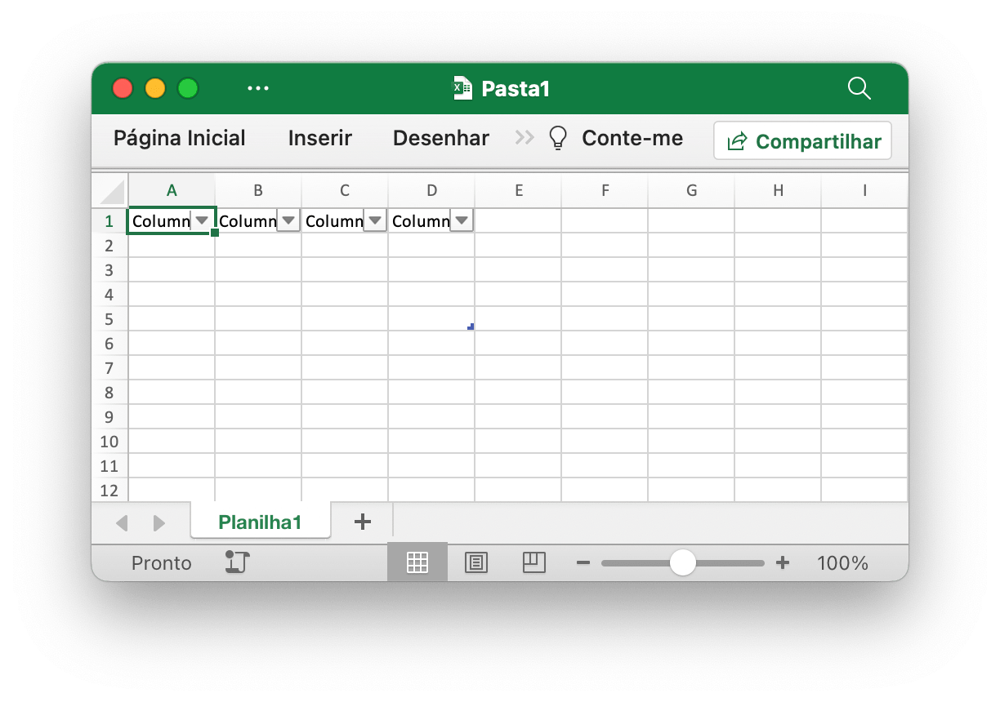
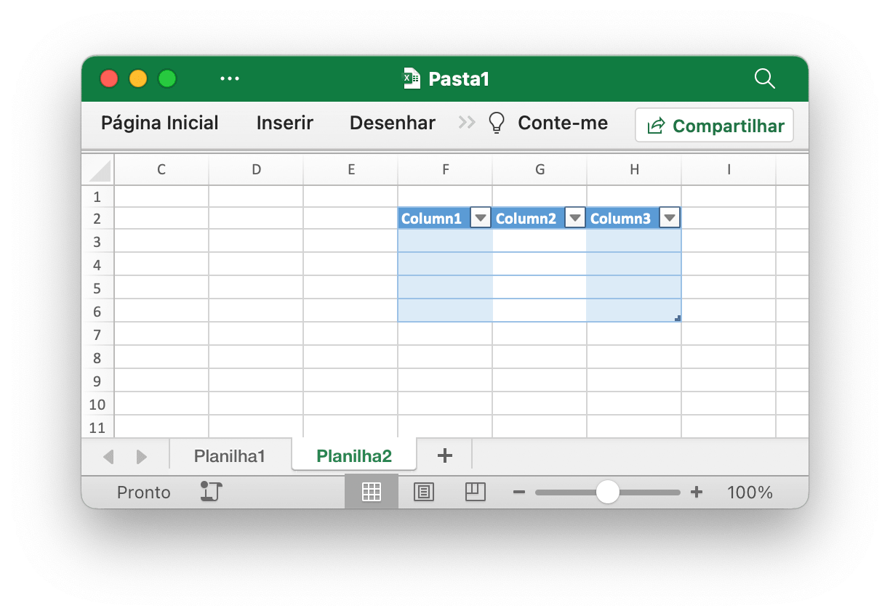
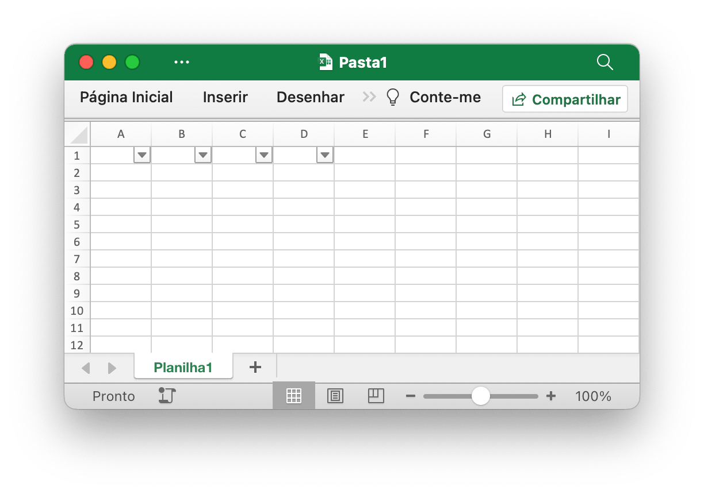
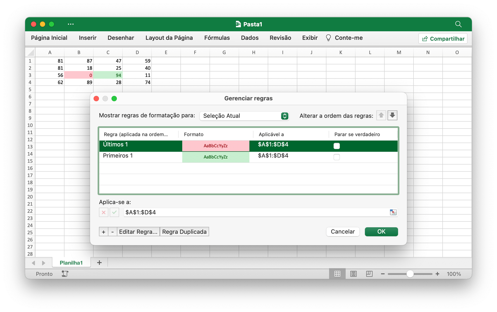
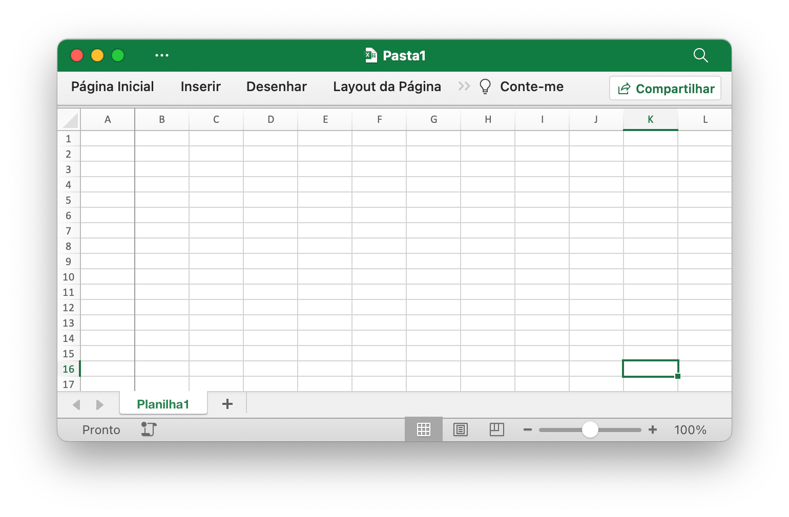
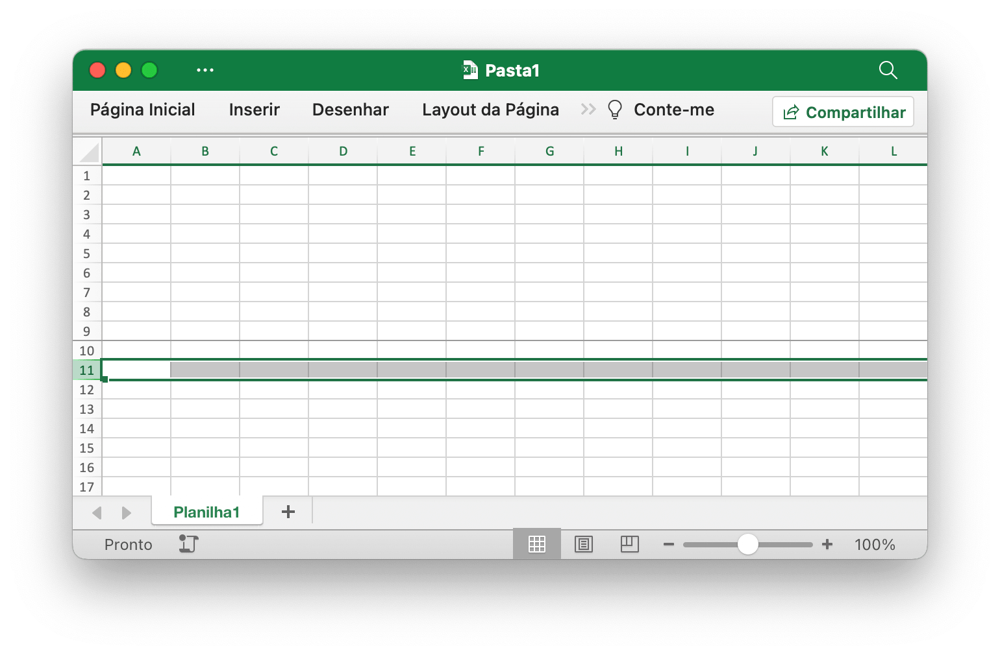
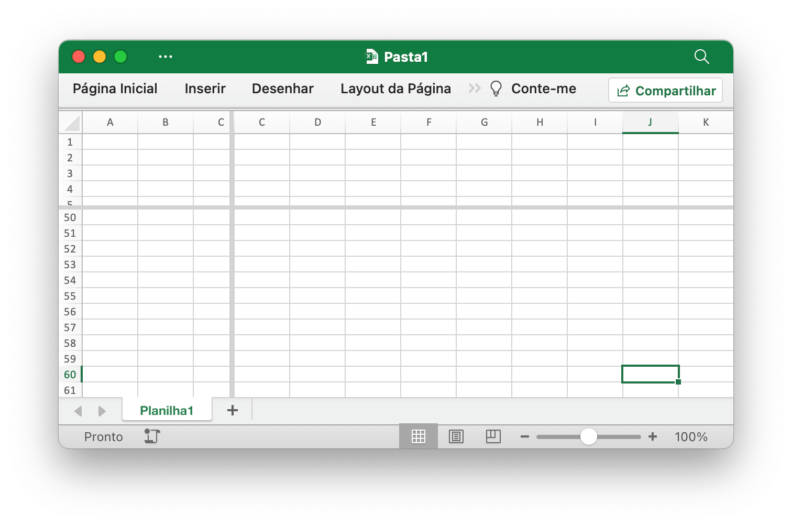

# Útil

## Adicionar tabela {#AddTable}

```go
func (f *File) AddTable(sheet string, table *Table) error
```

AddTable fornece o método para adicionar uma tabela em uma planilha por determinado nome de planilha, referência de intervalo e conjunto de formato.

- Exemplo 1, crie uma tabela de `A1:D5` em `Planilha1`:

<p align="center"></p>

```go
err := f.AddTable("Planilha1", &excelize.Table{Range: "A1:D5"})
```

- Exemplo 2, crie uma tabela de `F2:H6` em `Planilha2` com o formato definido:

<p align="center"></p>

```go
disable := false
err := f.AddTable("Planilha2", &excelize.Table{
    Range:             "F2:H6",
    Name:              "Tabela",
    StyleName:         "TableStyleMedium2",
    ShowFirstColumn:   true,
    ShowLastColumn:    true,
    ShowRowStripes:    &disable,
    ShowColumnStripes: true,
})
```

Observe que a tabela deve ter pelo menos duas linhas incluindo o cabeçalho. As células do cabeçalho devem conter strings e devem ser exclusivas, e devem definir os dados da linha do cabeçalho da tabela antes de chamar a função AddTable. Referência de intervalo de várias tabelas que não pode ter uma interseção.

`Nome`: O nome da tabela, no mesmo nome da planilha da tabela, deve ser único.

`StyleName`: Os nomes de estilo de tabela integrados:

```text
TableStyleLight1 - TableStyleLight21
TableStyleMedium1 - TableStyleMedium28
TableStyleDark1 - TableStyleDark11
```

Índice|Estilo|Índice|Estilo|Índice|Estilo
---|---|---|---|---|---
||TableStyleLight1||TableStyleLight2|
TableStyleLight3||TableStyleLight4||TableStyleLight5|
TableStyleLight6||TableStyleLight7||TableStyleLight8|
TableStyleLight9||TableStyleLight10||TableStyleLight11|
TableStyleLight12||TableStyleLight13||TableStyleLight14|
TableStyleLight15||TableStyleLight16||TableStyleLight17|
TableStyleLight18||TableStyleLight19||TableStyleLight20|
TableStyleLight21||TableStyleMedium1||TableStyleMedium2|
TableStyleMedium3||TableStyleMedium4||TableStyleMedium5|
TableStyleMedium6||TableStyleMedium7||TableStyleMedium8|
TableStyleMedium9||TableStyleMedium10||TableStyleMedium11|
TableStyleMedium12||TableStyleMedium13||TableStyleMedium14|
TableStyleMedium15||TableStyleMedium16||TableStyleMedium17|
TableStyleMedium18||TableStyleMedium19||TableStyleMedium20|
TableStyleMedium21||TableStyleMedium22||TableStyleMedium23|
TableStyleMedium24||TableStyleMedium25||TableStyleMedium26|
TableStyleMedium27||TableStyleMedium28||TableStyleDark1|
TableStyleDark2||TableStyleDark3||TableStyleDark4|
TableStyleDark5||TableStyleDark6||TableStyleDark7|
TableStyleDark8||TableStyleDark9||TableStyleDark10|
TableStyleDark11|||||

## Obter tabela {#GetTables}

```go
func (f *File) GetTables(sheet string) ([]Table, error)
```

GetTables fornece o método para obter todas as tabelas em uma planilha por determinado nome de planilha.

## Excluir tabela {#DeleteTable}

```go
func (f *File) DeleteTable(name string) error
```

DeleteTable fornece o método para excluir tabela por determinado nome de tabela.

## Filtro automático {#AutoFilter}

```go
func (f *File) AutoFilter(sheet, rangeRef string, opts []AutoFilterOptions) error
```

AutoFilter fornece o método para adicionar um filtro automático em uma planilha por determinado nome de planilha, referência de intervalo e configurações. Um filtro automático no Excel é uma forma de filtrar um intervalo 2D de dados com base em alguns critérios simples.

Exemplo 1, aplicando um filtro automático a um intervalo de células `A1:D4` na `Planilha1`:

<p align="center"></p>

```go
err := f.AutoFilter("Planilha1", "A1:D4", []excelize.AutoFilterOptions{})
```

Exemplo 2, filtrar dados em um filtro automático:

```go
err := f.AutoFilter("Planilha1", "A1:D4", []excelize.AutoFilterOptions{
    {Column: "B", Expression: "x != blanks"},
})
```

`Column` define as colunas de filtro em um intervalo de filtro automático com base em critérios simples.

Não é suficiente apenas especificar a condição do filtro. Você também deve ocultar todas as linhas que não correspondam à condição do filtro. As linhas são ocultadas usando o método [`SetRowVisible()`](sheet.md#SetRowVisible). O Excelize não pode filtrar linhas automaticamente, pois isso não faz parte do formato do arquivo.

Configurando critérios de filtro para uma coluna:

`Expression` define as condições, os seguintes operadores estão disponíveis para definir os critérios de filtro:

```text
==
!=
>
<
>=
<=
and
or
```

Uma expressão pode compreender uma única instrução ou duas instruções separadas pelos operadores `and` e `or`. Por exemplo:

```text
x <  2000
x >  2000
x == 2000
x >  2000 and x <  5000
x == 2000 or  x == 5000
```

A filtragem de dados em branco ou não em branco pode ser obtida usando um valor de Blanks ou NonBlanks na expressão:

```text
x == Blanks
x == NonBlanks
```

O Office Excel também permite algumas operações simples de correspondência de strings:

```text
x == b*      // começa com b
x != b*      // não começa com b
x == *b      // termina com b
x != *b      // não termina com b
x == *b*     // contém b
x != *b*     // não contém b
```

Você também pode usar `*` para corresponder a qualquer caractere ou número e `?` para corresponder a qualquer caractere ou número. Nenhum outro quantificador de expressão regular é suportado pelos filtros do Excel. Os caracteres de expressão regular do Excel podem ser escapados usando `~`.

A variável de espaço reservado `x` nos exemplos acima pode ser substituída por qualquer string simples. O nome real do espaço reservado é ignorado internamente, portanto os itens a seguir são todos equivalentes:

```text
x     < 2000
col   < 2000
Price < 2000
```

## Atualizar valor vinculado {#UpdateLinkedValue}

```go
func (f *File) UpdateLinkedValue() error
```

UpdateLinkedValue corrige valores vinculados em uma planilha que não são atualizados no Office Excel 2007 e 2010. Esta função removerá a tag de valor quando uma célula tiver um valor vinculado. Referência [https://social.technet.microsoft.com/Forums/office/en-US/e16bae1f-6a2c-4325-8013-e989a3479066/excel-2010-linked-cells-not-updating](https://social.technet.microsoft.com/Forums/office/en-US/e16bae1f-6a2c-4325-8013-e989a3479066/excel-2010-linked-cells-not-updating) Aviso: após abrir o arquivo da planilha o Excel estará atualizando o valor vinculado e gerará um novo valor e solicitará o salvamento do arquivo ou não.

O efeito de limpar o cache da célula na pasta de trabalho aparece como uma modificação na tag `<v>`, por exemplo, o cache da célula antes da limpeza:

```xml
<row r="19" spans="2:2">
    <c r="B19">
        <f>SUM(Sheet2!D2,Sheet2!D11)</f>
        <v>100</v>
     </c>
</row>
```

After clearing the cell cache:

```xml
<row r="19" spans="2:2">
    <c r="B19">
        <f>SUM(Sheet2!D2,Sheet2!D11)</f>
    </c>
</row>
```

## Nome da célula dividida {#SplitCellName}

```go
func SplitCellName(cell string) (string, int, error)
```

SplitCellName divide o nome da célula em nome da coluna e número da linha. Por exemplo:

```go
excelize.SplitCellName("AK74") // return "AK", 74, nil
```

## Junte-se ao nome da célula {#JoinCellName}

```go
func JoinCellName(col string, row int) (string, error)
```

JoinCellName une o nome da célula do nome da coluna e do número da linha.

## Nome da coluna para número {#ColumnNameToNumber}

```go
func ColumnNameToNumber(name string) (int, error)
```

ColumnNameToNumber fornece uma função para converter o nome da coluna da planilha Excel em `int`. O nome da coluna não diferencia maiúsculas de minúsculas. A função retorna um erro se o nome da coluna estiver incorreto. Por exemplo:

```go
excelize.ColumnNameToNumber("AK") // returns 37, nil
```

## Número da coluna a ser nomeada {#ColumnNumberToName}

```go
func ColumnNumberToName(num int) (string, error)
```

ColumnNumberToName fornece uma função para converter o número inteiro no título da coluna da planilha do Excel. Por exemplo:

```go
excelize.ColumnNumberToName(37) // returns "AK", nil
```

## Nome da célula para coordenadas {#CellNameToCoordinates}

```go
func CellNameToCoordinates(cell string) (int, int, error)
```

CellNameToCoordens converte o nome da célula alfanumérica em coordenadas `[X, Y]` ou retorna um erro. Por exemplo:

```go
excelize.CellNameToCoordinates("A1") // returns 1, 1, nil
excelize.CellNameToCoordinates("Z3") // returns 26, 3, nil
```

## Coordenadas para o nome da célula {#CoordinatesToCellName}

```go
func CoordinatesToCellName(col, row int, abs ...bool) (string, error)
```

CoordensToCellName converte coordenadas `[X, Y]` em nome de célula alfanumérico ou retorna um erro. Por exemplo:

```go
excelize.CoordinatesToCellName(1, 1) // returns "A1", nil
excelize.CoordinatesToCellName(1, 1, true) // returns "$A$1", nil
```

## Crie um estilo condicional {#NewConditionalStyle}

```go
func (f *File) NewConditionalStyle(style *Style) (int, error)
```

NewConditionalStyle fornece uma função para criar um estilo para o formato condicional por determinado formato de estilo. Os parâmetros são os mesmos da função [`NewStyle`](style.md#NewStyle). Observe que o campo de cores usa código de cores RGB e atualmente suporta apenas a configuração de fonte, preenchimentos, alinhamento e bordas.

## Obtenha estilo condicional {#GetConditionalStyle}

```go
func (f *File) GetConditionalStyle(idx int) (*Style, error)
```

GetConditionalStyle retorna a definição de estilo de formato condicional por índice de estilo especificado.

## Definir formato condicional {#SetConditionalFormat}

```go
func (f *File) SetConditionalFormat(sheet, rangeRef string, opts []ConditionalFormatOptions) error
```

SetConditionalFormat fornece uma função para criar uma regra de formatação condicional para o valor da célula. A formatação condicional é um recurso do Office Excel que permite aplicar um formato a uma célula ou intervalo de células com base em determinados critérios.

A opção `Type` é um parâmetro obrigatório e não possui valor padrão. Os valores de tipo permitidos e seus parâmetros associados são:

<table>
    <thead>
        <tr>
            <th>Tipo</th>
            <th>Parâmetros</th>
        </tr>
    </thead>
    <tbody>
        <tr>
            <td rowspan=4>cell</td>
            <td>Criteria</td>
        </tr>
        <tr>
            <td>Value</td>
        </tr>
        <tr>
            <td>MinValue</td>
        </tr>
        <tr>
            <td>MaxValue</td>
        </tr>
        <tr>
            <td>time_period</td>
            <td>Criteria</td>
        </tr>
        <tr>
            <td rowspan=2>text</td>
            <td>Criteria</td>
        </tr>
        <tr>
            <td>Value</td>
        </tr>
        <tr>
            <td>average</td>
            <td>Criteria</td>
        </tr>
        <tr>
            <td>duplicate</td>
            <td>(none)</td>
        </tr>
        <tr>
            <td>unique</td>
            <td>(none)</td>
        </tr>
        <tr>
            <td rowspan=2>top</td>
            <td>Criteria</td>
        </tr>
        <tr>
            <td>Value</td>
        </tr>
        <tr>
            <td rowspan=2>bottom</td>
            <td>Criteria</td>
        </tr>
        <tr>
            <td>Value</td>
        </tr>
        <tr>
            <td>blanks</td>
            <td>(none)</td>
        </tr>
        <tr>
            <td>no_blanks</td>
            <td>(none)</td>
        </tr>
        <tr>
            <td>errors</td>
            <td>(none)</td>
        </tr>
        <tr>
            <td>no_errors</td>
            <td>(none)</td>
        </tr>
        <tr>
            <td rowspan=6>2_color_scale</td>
            <td>MinType</td>
        </tr>
        <tr>
            <td>MaxType</td>
        </tr>
        <tr>
            <td>MinValue</td>
        </tr>
        <tr>
            <td>MaxValue</td>
        </tr>
        <tr>
            <td>MinColor</td>
        </tr>
        <tr>
            <td>MaxColor</td>
        </tr>
        <tr>
            <td rowspan=9>3_color_scale</td>
            <td>MinType</td>
        </tr>
        <tr>
            <td>MidType</td>
        </tr>
        <tr>
            <td>MaxType</td>
        </tr>
        <tr>
            <td>MinValue</td>
        </tr>
        <tr>
            <td>MidValue</td>
        </tr>
        <tr>
            <td>MaxValue</td>
        </tr>
        <tr>
            <td>MinColor</td>
        </tr>
        <tr>
            <td>MidColor</td>
        </tr>
        <tr>
            <td>MaxColor</td>
        </tr>
        <tr>
            <td rowspan=9>data_bar</td>
            <td>MinType</td>
        </tr>
        <tr>
            <td>MaxType</td>
        </tr>
        <tr>
            <td>MinValue</td>
        </tr>
        <tr>
            <td>MaxValue</td>
        </tr>
        <tr>
            <td>BarBorderColor</td>
        </tr>
        <tr>
            <td>BarColor</td>
        </tr>
        <tr>
            <td>BarDirection</td>
        </tr>
        <tr>
            <td>BarOnly</td>
        </tr>
        <tr>
            <td>BarSolid</td>
        </tr>
        <tr>
            <td rowspan=3>iconSet</td>
            <td>IconStyle</td>
        </tr>
        <tr>
            <td>ReverseIcons</td>
        </tr>
        <tr>
            <td>IconsOnly</td>
        </tr>
        <tr>
            <td>formula</td>
            <td>Criteria</td>
        </tr>
    </tbody>
</table>

O parâmetro `Criteria` é usado para definir os critérios pelos quais os dados da célula serão avaliados. Não tem valor padrão. Os critérios mais comuns aplicados a `excelize.ConditionalFormatOptions{Type: "cell"}` são:

Caractere de descrição de texto|Representação simbólica
---|---
between|
not between|
equal to|==
not equal to|!=
greater than|>
less than|<
greater than or equal to|>=
less than or equal to|<=

Você pode usar as strings de descrição textual do Excel, na primeira coluna acima, ou as alternativas simbólicas mais comuns.

Critérios adicionais específicos para outros tipos de formato condicional são mostrados nas seções relevantes abaixo.

`Value`: O valor geralmente é usado junto com o parâmetro `Criteria` para definir a regra pela qual os dados da célula serão avaliados:

```go
err := f.SetConditionalFormat("Planilha1", "D1:D10",
    []excelize.ConditionalFormatOptions{
        {
            Type:     "cell",
            Criteria: ">",
            Format:   format,
            Value:    "6",
        },
    },
)
```

A propriedade `Value` também pode ser uma referência de célula:

```go
err := f.SetConditionalFormat("Planilha1", "D1:D10",
    []excelize.ConditionalFormatOptions{
        {
            Type:     "cell",
            Criteria: ">",
            Format:   format,
            Value:    "$C$1",
        },
    },
)
```

type: `Format` - O parâmetro `Format` é usado para especificar o formato que será aplicado à célula quando o critério de formatação condicional for atendido. O formato é criado usando o método [`NewConditionalStyle()`](utils.md#NewConditionalStyle) da mesma forma que os formatos de célula:

```go
format, err := f.NewConditionalStyle(
    &excelize.Style{
        Font: &excelize.Font{Color: "9A0511"},
        Fill: excelize.Fill{
            Type: "pattern", Color: []string{"FEC7CE"}, Pattern: 1,
        },
    },
)
if err != nil {
    fmt.Println(err)
}
err = f.SetConditionalFormat("Planilha1", "D1:D10",
    []excelize.ConditionalFormatOptions{
        {Type: "cell", Criteria: ">", Format: format, Value: "6"},
    },
)
```

Nota: No Excel, um formato condicional é sobreposto ao formato de célula existente e nem todas as propriedades de formato de célula podem ser modificadas. As propriedades que não podem ser modificadas em um formato condicional são nome da fonte, tamanho da fonte, sobrescrito e subscrito, bordas diagonais, todas as propriedades de alinhamento e todas as propriedades de proteção.

O Excel especifica alguns formatos padrão a serem usados ​​com formatação condicional. Eles podem ser replicados usando os seguintes formatos do Excel:

```go
// Formato Rose para condições ruins.
format1, err := f.NewConditionalStyle(
    &excelize.Style{
        Font: &excelize.Font{Color: "9A0511"},
        Fill: excelize.Fill{
            Type: "pattern", Color: []string{"FEC7CE"}, Pattern: 1,
        },
    },
)

// Formato amarelo claro para condicional neutra.
format2, err := f.NewConditionalStyle(
    &excelize.Style{
        Font: &excelize.Font{Color: "9B5713"},
        Fill: excelize.Fill{
            Type: "pattern", Color: []string{"FEEAA0"}, Pattern: 1,
        },
    },
)

// Formato verde claro para boas condições.
format3, err := f.NewConditionalStyle(
    &excelize.Style{
        Font: &excelize.Font{Color: "09600B"},
        Fill: excelize.Fill{
            Type: "pattern", Color: []string{"C7EECF"}, Pattern: 1,
        },
    },
)
```

tipo: `MinValue` - O parâmetro `MinValue` é usado para definir o valor limite inferior quando o `Critério` é `between` ou `not between`.

```go
// Regra de realçar células: entre...
err := f.SetConditionalFormat("Planilha1", "A1:A10",
    []excelize.ConditionalFormatOptions{
        {
            Type:     "cell",
            Criteria: "between",
            Format:   format,
            MinValue: "6",
            MaxValue: "8",
        },
    },
)
```

tipo: `MaxValue` - O parâmetro `máximo` é usado para definir o valor limite superior quando os critérios são `between` ou `not between`. Veja o exemplo anterior.

type: `average` - O tipo `average` é usado para especificar o formato condicional do estilo "Average" do Office Excel:

```go
// Regras superiores/inferiores: acima da média...
err := f.SetConditionalFormat("Planilha1", "A1:A10",
    []excelize.ConditionalFormatOptions{
        {
            Type:         "average",
            Criteria:     "=",
            Format:       format1,
            AboveAverage: true,
        },
    },
)

// Regras superiores/inferiores: abaixo da média...
err := f.SetConditionalFormat("Planilha1", "B1:B10",
    []excelize.ConditionalFormatOptions{
        {
            Type:         "average",
            Criteria:     "=",
            Format:       format2,
            AboveAverage: false,
        },
    },
)
```

type: `duplicate` - O tipo `duplicate` é usado para destacar células duplicadas em um intervalo:

```go
// Regras de realçar células: valores duplicados...
err := f.SetConditionalFormat("Planilha1", "A1:A10",
    []excelize.ConditionalFormatOptions{
        {Type: "duplicate", Criteria: "=", Format: format},
    },
)
```

type: `unique` - O tipo `unique` é usado para destacar células únicas em um intervalo:

```go
// Regras de realçar células: diferente de...
err := f.SetConditionalFormat("Planilha1", "A1:A10",
    []excelize.ConditionalFormatOptions{
        {Type: "unique", Criteria: "=", Format: format},
    },
)
```

type: `top` - O tipo `top` é usado para especificar os n principais valores por número ou porcentagem em um intervalo:

```go
// Regras superiores/inferiores: 10 principais.
err := f.SetConditionalFormat("Planilha1", "H1:H10",
    []excelize.ConditionalFormatOptions{
        {
            Type:     "top",
            Criteria: "=",
            Format:   format,
            Value:    "6",
        },
    },
)
```

Os critérios podem ser usados para indicar que uma condição percentual é necessária:

```go
err := f.SetConditionalFormat("Planilha1", "A1:A10",
    []excelize.ConditionalFormatOptions{
        {
            Type:     "top",
            Criteria: "=",
            Format:   format,
            Value:    "6",
            Percent:  true,
        },
    },
)
```

type: `2_color_scale` - O tipo `2_color_scale` é usado para especificar o formato condicional do estilo "2 escala de cores" do Excel:

```go
// Escalas de cores: 2 cores.
err := f.SetConditionalFormat("Planilha1", "A1:A10",
    []excelize.ConditionalFormatOptions{
        {
            Type:     "2_color_scale",
            Criteria: "=",
            MinType:  "min",
            MaxType:  "max",
            MinColor: "#F8696B",
            MaxColor: "#63BE7B",
        },
    },
)
```

Este tipo condicional pode ser modificado com `MinType`, `MaxType`, `MinValue`, `MaxValue`, `MinColor` e `MaxColor`, veja abaixo.

type: `3_color_scale` - O tipo `3_color_scale` é usado para especificar o formato condicional do estilo "3 escala de cores" do Excel:

```go
// Escalas de cores: 3 cores.
err := f.SetConditionalFormat("Planilha1", "A1:A10",
    []excelize.ConditionalFormatOptions{
        {
            Type:     "3_color_scale",
            Criteria: "=",
            MinType:  "min",
            MidType:  "percentile",
            MaxType:  "max",
            MinColor: "#F8696B",
            MidColor: "#FFEB84",
            MaxColor: "#63BE7B",
        },
    },
)
```

Este tipo condicional pode ser modificado com `MinType`, `MidType`, `MaxType`, `MinValue`, `MidValue`, `MaxValue`, `MinColor`, `MidColor` e `MaxColor`, veja abaixo.

type: `data_bar` - O tipo `data_bar` é usado para especificar o formato condicional do estilo "Barra de dados" do Excel.

`MinType` - As propriedades `MinType` e `MaxType` estão disponíveis quando o tipo de formatação condicional é `2_color_scale`, `3_color_scale` ou `data_bar`. O `MidType` está disponível para `3_color_scale`. As propriedades são usadas da seguinte forma:

```go
// Barras de dados: preenchimento gradiente.
err := f.SetConditionalFormat("Planilha1", "K1:K10",
    []excelize.ConditionalFormatOptions{
        {
            Type:     "data_bar",
            Criteria: "=",
            MinType:  "min",
            MaxType:  "max",
            BarColor: "#638EC6",
        },
    },
)
```

Os tipos `min/mid/max` disponíveis são:

Parâmetro|Explicação
---|---
min|Valor MinValue (somente para `MinType`)
num|Numérico
percent|Percentagem
percentile|Percentil
formula|Fórmula
max|MaxValue (apenas para `MaxType`)

`MidType` - Usado para `3_color_scale`. O mesmo que `MinType`, veja acima.

`MaxType` - O mesmo que `MinType`, veja acima.

`MinValue` - As propriedades `MinValue` e `MaxValue` estão disponíveis quando o tipo de formatação condicional é `2_color_scale`, `3_color_scale` ou `data_bar`. O `MidValue` está disponível para `3_color_scale`.

`MidValue` - Usado para `3_color_scale`. O mesmo que `MinValue`, veja acima.

`MaxValue` - O mesmo que `MinValue`, veja acima.

`MinColor` - As propriedades `MinColor` e `MaxValue` estão disponíveis quando o tipo de formatação condicional é `2_color_scale`, `3_color_scale` ou `data_bar`. O `MidColor` está disponível para `3_color_scale`. As propriedades são usadas da seguinte forma:

```go
// Escalas de cores: 3 cores.
err := f.SetConditionalFormat("Planilha1", "B1:B10",
    []excelize.ConditionalFormatOptions{
        {
            Type:     "3_color_scale",
            Criteria: "=",
            MinType:  "min",
            MidType:  "percentile",
            MaxType:  "max",
            MinColor: "#F8696B",
            MidColor: "#FFEB84",
            MaxColor: "#63BE7B",
        },
    },
)
```

`MidColor` - Usado para `3_color_scale`. O mesmo que `MinColor`, veja acima.

`MaxColor` - O mesmo que `MinColor`, veja acima.

`BarColor` - Usado para `data_bar`. O mesmo que `MinColor`, veja acima.

`BarBorderColor` - Usado para definir a cor da linha da borda de uma barra de dados, visível apenas no Excel 2010 e posterior.

`BarDirection` - Usado para definir a direção das barras de dados. As opções disponíveis são:

Valor|Explicação
---|---
context     | A direção da barra de dados é definida pelo aplicativo de planilha com base no contexto dos dados exibidos.
leftToRight | A direção da barra de dados é da direita para a esquerda.
rightToLeft | A direção da barra de dados é da esquerda para a direita.

`BarOnly` - Usado para definir exibe os dados da barra, mas não os dados nas células.

`BarSolid` - Usado para ativar um preenchimento sólido (sem gradiente) para barras de dados, isso só é visível no Excel 2010 e posterior.

`IconStyle` - As opções disponíveis são:

|Valor|
|---|
|3Arrows        |
|3ArrowsGray    |
|3Flags         |
|3Signs         |
|3Symbols       |
|3Symbols2      |
|3TrafficLights1|
|3TrafficLights2|
|4Arrows        |
|4ArrowsGray    |
|4Rating        |
|4RedToBlack    |
|4TrafficLights |
|5Arrows        |
|5ArrowsGray    |
|5Quarters      |
|5Rating        |

`ReverseIcons` - Usado para definir conjuntos de ícones invertidos.

`IconsOnly` - Usado para conjunto exibido sem o valor da célula.

`StopIfTrue` - Usado para definir o recurso "parar se verdadeiro" de uma regra de formatação condicional quando mais de uma regra é aplicada a uma célula ou intervalo de células. Quando este parâmetro é definido, as regras subsequentes não serão avaliadas se a regra atual for verdadeira.

Por exemplo, destaque os valores mais altos e mais baixos em um intervalo de células `A1:D4` definindo a formatação condicional em `Planilha1`:

<p align="center"></p>

```go
func main() {
    f := excelize.NewFile()
    defer func() {
        if err := f.Close(); err != nil {
            fmt.Println(err)
        }
    }()
    if err := f.SetSheetName("Sheet1", "Planilha1"); err != nil {
        fmt.Println(err)
        return
    }
    for r := 1; r <= 4; r++ {
        row := []int{
            rand.Intn(100), rand.Intn(100), rand.Intn(100), rand.Intn(100),
        }
        if err := f.SetSheetRow("Planilha1", fmt.Sprintf("A%d", r), &row); err != nil {
            fmt.Println(err)
            return
        }
    }
    red, err := f.NewConditionalStyle(
        &excelize.Style{
            Font: &excelize.Font{
                Color: "9A0511",
            },
            Fill: excelize.Fill{
                Type:    "pattern",
                Color:   []string{"FEC7CE"},
                Pattern: 1,
            },
        },
    )
    if err != nil {
        fmt.Println(err)
        return
    }
    if err := f.SetConditionalFormat("Planilha1", "A1:D4",
        []excelize.ConditionalFormatOptions{
            {
                Type:     "bottom",
                Criteria: "=",
                Value:    "1",
                Format:   red,
            },
        },
    ); err != nil {
        fmt.Println(err)
        return
    }
    green, err := f.NewConditionalStyle(
        &excelize.Style{
            Font: &excelize.Font{
                Color: "09600B",
            },
            Fill: excelize.Fill{
                Type:    "pattern",
                Color:   []string{"C7EECF"},
                Pattern: 1,
            },
        },
    )
    if err != nil {
        fmt.Println(err)
        return
    }
    if err := f.SetConditionalFormat("Planilha1", "A1:D4",
        []excelize.ConditionalFormatOptions{
            {
                Type:     "top",
                Criteria: "=",
                Value:    "1",
                Format:   green,
            },
        },
    ); err != nil {
        fmt.Println(err)
        return
    }
    if err := f.SaveAs("Pasta1.xlsx"); err != nil {
        fmt.Println(err)
        return
    }
}
```

## Obtenha formato condicional {#GetConditionalFormats}

```go
func (f *File) GetConditionalFormats(sheet string) (map[string][]ConditionalFormatOptions, error)
```

GetConditionalFormats retorna configurações de formato condicional por determinado nome de planilha.

## Remover formato condicional {#UnsetConditionalFormat}

```go
func (f *File) UnsetConditionalFormat(sheet, rangeRef string) error
```

UnsetConditionalFormat fornece uma função para cancelar a definição do formato condicional por determinado nome de planilha e referência de intervalo.

## Definir painéis {#SetPanes}

```go
func (f *File) SetPanes(sheet string, panes *Panes) error
```

SetPanes fornece uma função para criar e remover painéis congelados e painéis divididos por determinado nome de planilha e conjunto de formato de painéis.

`ActivePane` define o painel que está ativo. Os valores possíveis para este atributo estão definidos na tabela a seguir:

Valor de enumeração|Descrição
---|---
bottomLeft (Painel inferior esquerdo) |Painel inferior esquerdo, quando as divisões verticais e horizontais são aplicadas.<br><br>Este valor também é usado quando apenas uma divisão horizontal foi aplicada, dividindo o painel nas regiões superior e inferior. Nesse caso, esse valor especifica o painel inferior.
bottomRight (Painel inferior direito) | Painel inferior direito, quando as divisões verticais e horizontais são aplicadas.
topLeft (Painel superior esquerdo)|Painel superior esquerdo, quando as divisões verticais e horizontais são aplicadas.<br><br>Este valor também é usado quando apenas uma divisão horizontal foi aplicada, dividindo o painel nas regiões superior e inferior. Nesse caso, esse valor especifica o painel superior.<br><br>Este valor também é usado quando apenas uma divisão vertical foi aplicada, dividindo o painel nas regiões direita e esquerda. Nesse caso, esse valor especifica o painel esquerdo.
topRight (Painel superior direito)|Painel superior direito, quando as divisões verticais e horizontais são aplicadas.<br><br>Este valor também é usado quando apenas uma divisão vertical foi aplicada, dividindo o painel nas regiões direita e esquerda. Nesse caso, esse valor especifica o painel direito.

O tipo de estado do painel é restrito aos valores suportados atualmente listados na tabela a seguir:

Valor de enumeração|Descrição
---|---
frozen (Congeladas)|Os painéis estão congelados, mas não foram divididos ao serem congelados. Neste estado, quando os painéis são descongelados novamente, resulta um único painel, sem divisão.<br><br>Neste estado, as barras divididas não são ajustáveis.
split (Dividir)|Os painéis estão divididos, mas não congelados. Neste estado, as barras divididas são ajustáveis pelo usuário.

`XSplit` - Posição horizontal da divisão, em 1/20 de ponto; 0 (zero) se nenhum. Se o painel estiver congelado, esse valor indica o número de colunas visíveis no painel superior.

`YSplit` - Posição vertical da divisão, em 1/20 de ponto; 0 (zero) se nenhum. Se o painel estiver congelado, esse valor indica o número de linhas visíveis no painel esquerdo. Os valores possíveis para este atributo são definidos pelo tipo de dados duplo do Esquema XML do W3C.

`TopLeftCell` - Localização da célula visível superior esquerda no painel inferior direito (quando no modo da esquerda para a direita).

`SQRef` - Faixa da seleção. Pode ser um conjunto não contíguo de intervalos.

Exemplo 1: congele a coluna `A` em `Planilha1` e defina a célula ativa em `Planilha1!K16`:

<p align="center"></p>

```go
err := f.SetPanes("Planilha1", &excelize.Panes{
    Freeze:      true,
    XSplit:      1,
    TopLeftCell: "B1",
    ActivePane:  "topRight",
    Selection: []excelize.Selection{
        {SQRef: "K16", ActiveCell: "K16", Pane: "topRight"},
    },
})
```

Exemplo 2: congele as linhas 1 a 9 em `Planilha1` e defina os intervalos de células ativos em `Planilha1!A11:XFD11`:

<p align="center"></p>

```go
err := f.SetPanes("Planilha1", &excelize.Panes{
    Freeze:      true,
    YSplit:      9,
    TopLeftCell: "A34",
    ActivePane:  "bottomLeft",
    Selection: []excelize.Selection{
        {SQRef: "A11:XFD11", ActiveCell: "A11", Pane: "bottomLeft"},
    },
})
```

Exemplo 3: crie painéis divididos em `Planilha1` e defina a célula ativa em `Planilha1!J60`:

<p align="center"></p>

```go
err := f.SetPanes("Planilha1", &excelize.Panes{
    Split:       true,
    XSplit:      3270,
    YSplit:      1800,
    TopLeftCell: "N57",
    ActivePane:  "bottomLeft",
    Selection: []excelize.Selection{
        {SQRef: "I36", ActiveCell: "I36"},
        {SQRef: "G33", ActiveCell: "G33", Pane: "topRight"},
        {SQRef: "J60", ActiveCell: "J60", Pane: "bottomLeft"},
        {SQRef: "O60", ActiveCell: "O60", Pane: "bottomRight"},
    },
})
```

Exemplo 4, descongele e remova todos os painéis em `Planilha1`:

```go
err := f.SetPanes("Planilha1", &excelize.Panes{Freeze: false, Split: false})
```

## Obter painéis {#GetPanes}

```go
func (f *File) GetPanes(sheet string) (Panes, error)
```

GetPanes fornece uma função para obter painéis congelados, painéis divididos e visualizações de planilha por determinado nome de planilha.

## Cor {#ThemeColor}

```go
func (f *File) GetBaseColor(hexColor string, indexedColor int, themeColor *int) string
```

GetBaseColor retorna o código de cor hexadecimal preferido, fornecendo código de cor hexadecimal, cor indexada e cor do tema.

```go
func ThemeColor(baseColor string, tint float64) string
```

ThemeColor aplicou a cor com valor de tonalidade.

Existem 3 tipos de cores para o texto na planilha: cor hexadecimal, cor indexada e cor do tema. A prioridade dessas cores é que a cor hexadecimal tem precedência sobre a cor do tema, e a cor do tema tem precedência sobre a cor indexada. Além disso, a cor também suporta a aplicação do valor de tonalidade com base na cor hexadecimal, portanto, precisamos usar a função ThemeColor para aplicar a tonalidade da cor baseada para obter o valor de cor hexadecimal calculado. Por exemplo:

```go
package main

import (
    "fmt"

    "github.com/xuri/excelize/v2"
)

func main() {
    f, err := excelize.OpenFile("Pasta1.xlsx")
    if err != nil {
        fmt.Println(err)
        return
    }
    defer func() {
        if err := f.Close(); err != nil {
            fmt.Println(err)
        }
    }()
    runs, err := f.GetCellRichText("Planilha1", "A1")
    if err != nil {
        fmt.Println(err)
        return
    }
    for _, run := range runs {
        var hexColor string
        if run.Font != nil {
            baseColor := f.GetBaseColor(run.Font.Color, run.Font.ColorIndexed, run.Font.ColorTheme)
            hexColor = strings.TrimPrefix(excelize.ThemeColor(baseColor, run.Font.ColorTint), "FF")
        }
        fmt.Printf("texto: %s, cor: %s\r\n", run.Text, hexColor)
    }
}
```

## Converter RGB em HSL {#RGBToHSL}

```go
func RGBToHSL(r, g, b uint8) (h, s, l float64)
```

RGBToHSL converte um triplo RGB em um triplo HSL.

## Converter HSL em RGB {#HSLToRGB}

```go
func HSLToRGB(h, s, l float64) (r, g, b uint8)
```

HSLToRGB converte um triplo HSL em um triplo RGB.

## Gravador de arquivo {#FileWriter}

### Write {#Write}

```go
func (f *File) Write(w io.Writer, opts ...Options) error
```

Write fornece uma função para escrever em um `io.Writer`.

### WriteTo {#WriteTo}

```go
func (f *File) WriteTo(w io.Writer, opts ...Options) (int64, error)
```

WriteTo implementa `io.WriterTo` para gravar o arquivo.

### WriteToBuffer {#WriteToBuffer}

```go
func (f *File) WriteToBuffer() (*bytes.Buffer, error)
```

WriteToBuffer fornece uma função para obter `*bytes.Buffer` do arquivo salvo.

## Adicionar projeto VBA {#AddVBAProject}

```go
func (f *File) AddVBAProject(file []byte) error
```

AddVBAProject fornece o método para adicionar o arquivo `vbaProject.bin` que contém funções e/ou macros. A extensão do arquivo deve ser `.xlsm` ou `.xltm`. Por exemplo:

```go
codeName := "Sheet1"
if err := f.SetSheetProps("Sheet1", &excelize.SheetPropsOptions{
    CodeName: &codeName,
}); err != nil {
    fmt.Println(err)
    return
}
file, err := os.ReadFile("vbaProject.bin")
if err != nil {
    fmt.Println(err)
    return
}
if err := f.AddVBAProject(file); err != nil {
    fmt.Println(err)
    return
}
if err := f.SaveAs("macros.xlsm"); err != nil {
    fmt.Println(err)
    return
}
```

## Excel de vez em quando {#ExcelDateToTime}

```go
func ExcelDateToTime(excelDate float64, use1904Format bool) (time.Time, error)
```

ExcelDateToTime converte uma representação de data do Excel baseada em flutuação em `time.Time`.

## Transcodificador de conjunto de caracteres {#CharsetTranscoder}

```go
func (f *File) CharsetTranscoder(fn charsetTranscoderFn) *File
```

CharsetTranscoder define a função de transcodificador de página de código definida pelo usuário para abrir a planilha a partir de codificação não UTF-8.
