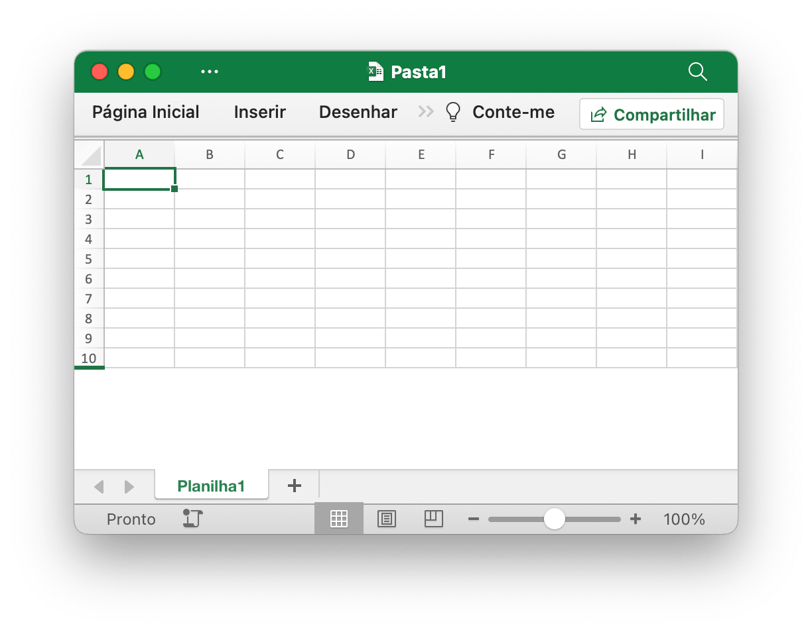
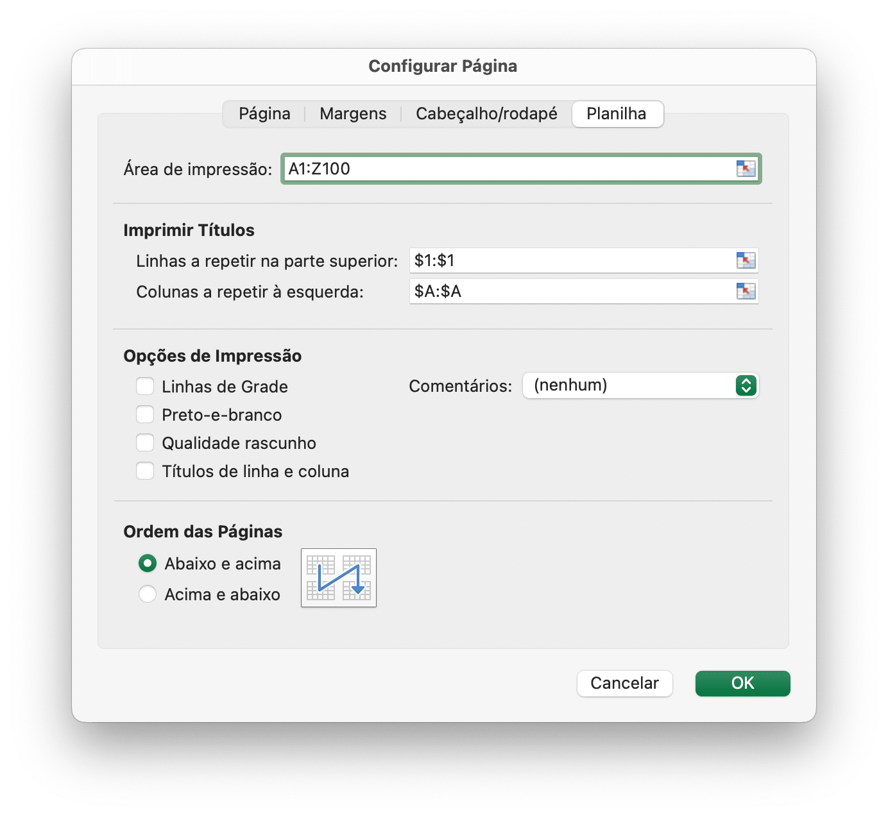

# Pasta de trabalho

`Options` define as opções para leitura e escrita de planilhas.

```go
type Options struct {
    MaxCalcIterations uint
    Password          string
    RawCellValue      bool
    UnzipSizeLimit    int64
    UnzipXMLSizeLimit int64
    ShortDatePattern  string
    LongDatePattern   string
    LongTimePattern   string
    CultureInfo       CultureName
}
```

`MaxCalcIterations` especifica o máximo de iterações para cálculo iterativo, o valor padrão é 0.

`Password` especifica a senha da planilha em texto simples.

`RawCellValue` especifica se aplica o formato numérico ao valor da célula ou obtém o valor bruto.

`UnzipSizeLimit` especifica o limite de tamanho de descompactação em bytes ao abrir a planilha, este valor deve ser maior ou igual a `UnzipXMLSizeLimit`, o limite de tamanho padrão é 16GB.

`UnzipXMLSizeLimit` especifica o limite de memória para descompactar a planilha e a tabela de strings compartilhadas em bytes, o XML da planilha será extraído para o diretório temporário do sistema quando o tamanho do arquivo ultrapassar esse valor, esse valor deve ser menor ou igual a `UnzipSizeLimit`, o padrão o valor é 16MB.

`ShortDatePattern` especifica o código de formato de número de data abreviada. Nos aplicativos de planilha, os formatos de data exibem números de série de data e hora como valores de data. Os formatos de data que começam com um asterisco (\*) respondem às alterações nas configurações regionais de data e hora especificadas para o sistema operacional. Os formatos sem asterisco não são afetados pelas configurações do sistema operacional. O `ShortDatePattern` usado para especifica a aplicação de formatos de data que começam com um asterisco.

`LongDatePattern` especifica o código de formato de número de data longa.

`LongTimePattern` especifica o código de formato de número longo.

`CultureInfo` especifica o código do país para aplicar o código de formato de número de idioma integrado, que é afetado pelas configurações de idioma local do sistema.

## Criar nova pasta de trabalho {#NewFile}

```go
func NewFile(opts ...Options) *File
```

NewFile fornece uma função para criar um novo arquivo por modelo padrão. A pasta de trabalho recém-criada conterá, por padrão, uma planilha chamada `Sheet1`. Por exemplo:

## Abrir pasta de trabalho {#OpenFile}

```go
func OpenFile(filename string, opts ...Options) (*File, error)
```

OpenFile pega o nome de um arquivo de planilha e retorna uma estrutura de arquivo de planilha preenchida para ele. Por exemplo, abra uma planilha protegida por senha:

```go
f, err := excelize.OpenFile("Pasta1.xlsx", excelize.Options{Password: "senha"})
if err != nil {
    return
}
```

Feche a pasta de trabalho com [`Close()`](workbook.md#Close) após abrir a planilha.

## Fluxo de dados aberto {#OpenReader}

```go
func OpenReader(r io.Reader, opts ...Options) (*File, error)
```

O OpenReader lê o fluxo de dados de `io.Reader` e retorna um arquivo de planilha preenchido.

Por exemplo, crie um servidor HTTP para lidar com o modelo de upload e, em seguida, baixe o arquivo de resposta com a nova planilha adicionada:

```go
package main

import (
    "fmt"
    "net/http"

    "github.com/xuri/excelize/v2"
)

func process(w http.ResponseWriter, req *http.Request) {
    file, _, err := req.FormFile("file")
    if err != nil {
        fmt.Fprint(w, err.Error())
        return
    }
    defer file.Close()
    f, err := excelize.OpenReader(file)
    if err != nil {
        fmt.Fprint(w, err.Error())
        return
    }
    f.Path = "Pasta1.xlsx"
    f.NewSheet("Nova planilha")
    w.Header().Set("Content-Disposition", fmt.Sprintf("attachment; filename=%s", f.Path))
    w.Header().Set("Content-Type", req.Header.Get("Content-Type"))
    if err := f.Write(w); err != nil {
        fmt.Fprint(w, err.Error())
    }
}

func main() {
    http.HandleFunc("/process", process)
    http.ListenAndServe(":8090", nil)
}
```

Test with cURL:

```bash
curl --location --request GET 'http://127.0.0.1:8090/process' \
--form 'file=@/tmp/modelo.xltx' -O -J
```

## Salvar {#Save}

```go
func (f *File) Save(opts ...Options) error
```

Salvar fornece uma função para substituir a pasta de trabalho pelo caminho de origem.

## Salvar como {#SaveAs}

```go
func (f *File) SaveAs(name string, opts ...Options) error
```

SaveAs fornece uma função para criar ou atualizar a pasta de trabalho no caminho fornecido.

## Fechar pasta de trabalho {#Close}

```go
func (f *File) Close() error
```

Fechar fecha e limpa o arquivo temporário aberto da planilha.

## Criar planilha {#NewSheet}

```go
func (f *File) NewSheet(sheet string) (int, error)
```

NewSheet fornece a função de criar uma nova planilha com um nome de planilha e retorna o índice das planilhas na pasta de trabalho (planilha) após ser anexado. Observe que ao criar uma nova pasta de trabalho, a planilha padrão chamada `Sheet1` será criada.

## Excluir planilha {#DeleteSheet}

```go
func (f *File) DeleteSheet(sheet string) error
```

DeleteSheet fornece uma função para excluir planilha em uma pasta de trabalho por determinado nome de planilha. Use este método com cuidado, pois afetará alterações em referências como fórmulas, gráficos e assim por diante. Se houver algum valor referenciado da planilha excluída, isso causará um erro de arquivo ao abri-lo. Esta função será inválida quando sobrar apenas uma planilha.

## Copiar planilha {#CopySheet}

```go
func (f *File) CopySheet(from, to int) error
```

CopySheet fornece uma função para duplicar uma planilha por meio de um índice de planilha de origem e destino. Observe que atualmente não oferece suporte a pastas de trabalho duplicadas que contenham tabelas, gráficos ou imagens. Por exemplo:

```go
// Sheet1 já existe...
index, err := f.NewSheet("Planilha2")
if err != nil {
    fmt.Println(err)
    return
}
err := f.CopySheet(1, index)
```

## Planilhas de grupo {#GroupSheets}

```go
func (f *File) GroupSheets(sheets []string) error
```

GroupSheets fornece uma função para agrupar planilhas por determinados nomes de planilhas. As planilhas de grupo devem conter uma planilha ativa.

## Desagrupar planilhas {#UngroupSheets}

```go
func (f *File) UngroupSheets() error
```

UngroupSheets fornece uma função para desagrupar planilhas.

## Definir plano de fundo da planilha {#SetSheetBackground}

```go
func (f *File) SetSheetBackground(sheet, picture string) error
```

SetSheetBackground fornece uma função para definir a imagem de fundo por determinado nome de planilha e caminho de arquivo. Tipos de imagem suportados: BMP, EMF, EMZ, GIF, JPEG, JPG, PNG, SVG, TIF, TIFF, WMF e WMZ.

```go
func (f *File) SetSheetBackgroundFromBytes(sheet, extension string, picture []byte) error
```

SetSheetBackgroundFromBytes fornece uma função para definir a imagem de fundo por determinado nome de planilha, nome de extensão e dados de imagem. Tipos de imagem suportados: BMP, EMF, EMZ, GIF, JPEG, JPG, PNG, SVG, TIF, TIFF, WMF e WMZ.

## Definir planilha padrão {#SetActiveSheet}

```go
func (f *File) SetActiveSheet(index int)
```

SetActiveSheet fornece uma função para definir a planilha ativa padrão da pasta de trabalho por um determinado índice. Observe que o índice ativo é diferente do ID retornado pela função [`GetSheetMap`](sheet.md#GetSheetMap). Deve ser maior ou igual a 0 e menor que o número total da planilha.

## Obtenha o índice da planilha ativa {#GetActiveSheetIndex}

```go
func (f *File) GetActiveSheetIndex() int
```

GetActiveSheetIndex fornece uma função para obter uma planilha ativa da pasta de trabalho. Se não for encontrada, a planilha ativa retornará o número inteiro `0`.

## Definir planilha visível {#SetSheetVisible}

```go
func (f *File) SetSheetVisible(sheet string, visible bool, veryHidden ...bool) error
```

SetSheetVisible fornece uma função para definir a planilha visível por determinado nome de planilha. Uma pasta de trabalho deve conter pelo menos uma planilha visível. Se a planilha fornecida tiver sido ativada, esta configuração será invalidada. O terceiro parâmetro opcional `veryHidden` só funciona quando `visible` é `false`.

Por exemplo, oculte `Planilha1`:

```go
err := f.SetSheetVisible("Planilha1", false)
```

## Obtenha planilha visível {#GetSheetVisible}

```go
func (f *File) GetSheetVisible(sheet string) (bool, error)
```

GetSheetVisible fornece uma função para tornar a planilha visível por determinado nome de planilha. Por exemplo, obtenha o estado visível de `Planilha1`:

```go
visible, err := f.GetSheetVisible("Planilha1")
```

## Definir propriedades da planilha {#SetSheetProps}

```go
func (f *File) SetSheetProps(sheet string, opts *SheetPropsOptions) error
```

SetSheetProps fornece uma função para definir propriedades da planilha. As propriedades que podem ser definidas são:

Opções|Tipo|Descrição
---|---|---
CodeName                          | `*string`  | Especifica um nome estável da planilha, que não deve mudar com o tempo e não muda com a entrada do usuário. Este nome deve ser usado pelo código para fazer referência a uma planilha específica
EnableFormatConditionsCalculation | `*bool`    | Indicando se os cálculos de formatação condicional serão avaliados. Se definido como falso, os valores mínimo/máximo das escalas de cores ou barras de dados ou valores limite nas N principais regras não serão atualizados. Essencialmente, a formatação condicional "calc" está desativada
Published                         | `*bool`    | Indicando se a planilha está publicada, o valor padrão é `true`
AutoPageBreaks                    | `*bool`    | Indicando se a planilha exibe quebras de página automáticas, o valor padrão é `true`
FitToPage                         | `*bool`    | Indicando se a opção de impressão Ajustar à página está habilitada, o valor padrão é `false`
TabColorIndexed                   | `*int`     | Representa o valor da cor indexada
TabColorRGB                       | `*string`  | Representa o valor de cor padrão ARGB (Alpha Red Green Blue)
TabColorTheme                     | `*int`     | Representa o índice baseado em zero na coleção, referenciando um valor específico expresso na parte Tema
TabColorTint                      | `*float64` | Especifica o valor da tonalidade aplicada à cor, o valor padrão é `0,0`
OutlineSummaryBelow               | `*bool`    | Indicando se as linhas de resumo aparecem abaixo dos detalhes em uma estrutura de tópicos, ao aplicar uma estrutura de tópicos, o valor padrão é `true`
OutlineSummaryRight               | `*bool`    | Indicando se as colunas de resumo aparecem à direita do detalhe em um esquema, ao aplicar um esquema, o valor padrão é `true`
BaseColWidth                      | `*uint8`   | Especifica o número de caracteres da largura máxima de dígitos da fonte do estilo normal. Este valor não inclui preenchimento de margem ou preenchimento extra para linhas de grade. É apenas o número de caracteres, o valor padrão é `8`
DefaultColWidth                   | `*float64` | Especifica a largura padrão da coluna medida como o número de caracteres da largura máxima de dígitos da fonte do estilo normal
DefaultRowHeight                  | `*float64` | Especifica a altura padrão da linha medida em tamanho de ponto. Otimização para que não precisemos escrever a altura em todas as linhas. Isso pode ser escrito se a maioria das linhas tiver altura personalizada, para obter a otimização
CustomHeight                      | `*bool`    | Especifica a altura personalizada, o valor padrão é `false`
ZeroHeight                        | `*bool`    | Especifica se as linhas estão ocultas, o valor padrão é `false`
ThickTop                          | `*bool`    | Especifica se as linhas têm uma borda superior espessa por padrão, o valor padrão é `false`
ThickBottom                       | `*bool`    | Especifica se as linhas têm uma borda inferior espessa por padrão, o valor padrão é `false`

Por exemplo, torne as linhas da planilha ocultas como padrão:

<p align="center"></p>

```go
f, enable := excelize.NewFile(), true
if err := f.SetSheetName("Sheet1", "Planilha1"); err != nil {
    fmt.Println(err)
    return
}
if err := f.SetSheetProps("Planilha1", &excelize.SheetPropsOptions{
    ZeroHeight: &enable,
}); err != nil {
    fmt.Println(err)
}
if err := f.SetRowVisible("Planilha1", 10, true); err != nil {
    fmt.Println(err)
}
f.SaveAs("Pasta1.xlsx")
```

## Obtenha propriedades da planilha {#GetSheetProps}

```go
func (f *File) GetSheetProps(sheet string) (SheetPropsOptions, error)
```

GetSheetProps fornece uma função para obter propriedades da planilha.

## Definir propriedades de visualização da planilha {#SetSheetView}

```go
func (f *File) SetSheetView(sheet string, viewIndex int, opts *ViewOptions) error
```

SetSheetView define propriedades de visualização de planilha. O `viewIndex` pode ser negativo e, nesse caso, é contado regressivamente (`-1` é a última visualização). As propriedades que podem ser definidas são:

Opções|Tipo|Descrição
---|---|---
DefaultGridColor  | `*bool`    | Indicando que a aplicação consumidora deve utilizar a cor padrão das linhas de grade (dependente do sistema). Substitui qualquer cor especificada em colorId, o valor padrão é `true`
RightToLeft       | `*bool`    | Indicando se a planilha está no modo de exibição “da direita para a esquerda”. Quando neste modo, a Coluna A está na extrema direita, Coluna B; há uma coluna à esquerda da Coluna A e assim por diante. Além disso, as informações nas células são exibidas no formato da direita para a esquerda, o valor padrão é `false`
ShowFormulas      | `*bool`    | Indicando se esta planilha deve exibir fórmulas, o valor padrão é `false`
ShowGridLines     | `*bool`    | Indicando se esta planilha deve exibir linhas de grade, o valor padrão é `true`
ShowRowColHeaders | `*bool`    | Indicando se a planilha deve exibir títulos de linhas e colunas, o valor padrão é `true`
ShowRuler         | `*bool`    | Indicar que esta planilha deve exibir uma régua, o valor padrão é `true`
ShowZeros         | `*bool`    | Indicando se deve "mostrar zero nas células que possuem valor zero". Ao usar uma fórmula para fazer referência a outra célula que está vazia, o valor referenciado torna-se `0` quando o sinalizador é `true`, o valor padrão é `true`
TopLeftCell       | `*string`  | Especifica um local da célula visível superior esquerda Localização da célula visível superior esquerda no painel inferior direito (quando no modo da esquerda para a direita)
View              | `*string`  | Indicando como a planilha é exibida, por padrão usa string vazia, opções disponíveis: `normal`,`pageBreakPreview` e `pageLayout`
ZoomScale         | `*float64` | Especifica uma ampliação de zoom da janela para a visualização atual que representa valores percentuais. Este atributo está restrito a valores que variam de `10` a `400`. Escala horizontal e vertical juntas, o valor padrão é `100`

## Obtenha propriedades de visualização de planilha {#GetSheetView}

```go
func (f *File) GetSheetView(sheet string, viewIndex int) (ViewOptions, error)
```

GetSheetView obtém o valor das propriedades da visualização da planilha. O `viewIndex` pode ser negativo e, nesse caso, é contado regressivamente (`-1` é a última visualização).

## Definir layout de página da planilha {#SetPageLayout}

```go
func (f *File) SetPageLayout(sheet string, opts *PageLayoutOptions) error
```

SetPageLayout fornece uma função para definir o layout da página da planilha. Opções disponíveis:

`Size` especificou o tamanho do papel da planilha, o tamanho padrão do papel da planilha é "Papel carta (8,5 pol. por 11 pol.)". O seguinte mostra o tamanho do papel classificado pelo número de índice do Excelize:

Índice|Tamanho do papel
---|---
1 | Papel carta (8,5 pol. × 11 pol.)
2 | Papel carta pequeno (8,5 pol. × 11 pol.)
3 | Papel tablóide (11 pol. × 17 pol.)
4 | Papel contábil (17 pol. × 11 pol.)
5 | Papel ofício (8,5 pol. × 14 pol.)
6 | Papel de declaração (5,5 pol. × 8,5 pol.)
7 | Papel executivo (7,25 pol. × 10,5 pol.)
8 | Papel A3 (297 mm × 420 mm)
9 | Papel A4 (210 mm × 297 mm)
10 | Papel pequeno A4 (210 mm × 297 mm)
11 | Papel A5 (148 mm × 210 mm)
12 | Papel B4 (250 mm × 353 mm)
13 | Papel B5 (176 mm × 250 mm)
14 | Papel fólio (8,5 pol. × 13 pol.)
15 | Papel Quarto (215 mm × 275 mm)
16 | Papel padrão (10 pol. × 14 pol.)
17 | Papel padrão (11 pol. × 17 pol.)
18 | Papel para anotações (8,5 pol. × 11 pol.)
19 | Envelope nº 9 (3,875 pol. × 8,875 pol.)
20 | Envelope nº 10 (4,125 pol. × 9,5 pol.)
21 | Envelope nº 11 (4,5 pol. × 10,375 pol.)
22 | Envelope nº 12 (4,75 pol. × 11 pol.)
23 | Envelope nº 14 (5 pol. × 11,5 pol.)
24 | Papel C (17 pol. × 22 pol.)
25 | Papel D (22 pol. × 34 pol.)
26 | Papel E (34 pol. × 44 pol.)
27 | Envelope DL (110 mm × 220 mm)
28 | Envelope C5 (162 mm × 229 mm)
29 | Envelope C3 (324 mm × 458 mm)
30 | Envelope C4 (229 mm × 324 mm)
31 | Envelope C6 (114 mm × 162 mm)
32 | Envelope C65 (114 mm × 229 mm)
33 | Envelope B4 (250 mm × 353 mm)
34 | Envelope B5 (176 mm × 250 mm)
35 | Envelope B6 (176 mm × 125 mm)
36 | Envelope Itália (110 mm × 230 mm)
37 | Envelope Monarca (3,875 pol. × 7,5 pol.).
38 | Envelope de 6¾ (3,625 pol. × 6,5 pol.)
39 | Fanfold padrão dos EUA (14,875 pol. × 11 pol.)
40 | Fanfold padrão alemão (8,5 pol. × 12 pol.)
41 | Fanfold legal alemão (8,5 pol. × 13 pol.)
42 | ISO B4 (250 mm × 353 mm)
43 | Postal japonês (100 mm × 148 mm)
44 | Papel padrão (9 pol. × 11 pol.)
45 | Papel padrão (10 pol. × 11 pol.)
46 | Papel padrão (15 pol. × 11 pol.)
47 | Envelope de convite (220 mm × 220 mm)
50 | Papel extra carta (9,275 pol. × 12 pol.)
51 | Papel extra ofício (9,275 pol. × 15 pol.)
52 | Papel extra para tablóide (11,69 pol. × 18 pol.)
53 | Papel extra A4 (236 mm × 322 mm)
54 | Papel carta transversal (8,275 pol. × 11 pol.)
55 | Papel transversal A4 (210 mm × 297 mm)
56 | Papel carta extra transversal (9,275 pol. × 12 pol.)
57 | Papel SuperA/SuperA/A4 (227 mm × 356 mm)
58 | Papel SuperB/SuperB/A3 (305 mm × 487 mm)
59 | Carta mais papel (8,5 pol. × 12,69 pol.)
60 | Papel A4 mais (210 mm × 330 mm)
61 | Papel transversal A5 (148 mm × 210 mm)
62 | Papel transversal JIS B5 (182 mm × 257 mm)
63 | Papel extra A3 (322 mm × 445 mm)
64 | Papel extra A5 (174 mm × 235 mm)
65 | Papel extra ISO B5 (201 mm × 276 mm)
66 | Papel A2 (420 mm × 594 mm)
67 | Papel transversal A3 (297 mm × 420 mm)
68 | Papel extra transversal A3 (322 mm × 445 mm)
69 | Postal Duplo Japonês (200 mm × 148 mm)
70 | A6 (105 mm × 148 mm)
71 | Envelope Japonês Kaku #2
72 | Envelope Japonês Kaku #3
73 | Envelope Japonês Chou #3
74 | Envelope Japonês Chou #4
75 | Letra girada (11 × 8½ pol.)
76 | A3 girado (420 mm × 297 mm)
77 | A4 girado (297 mm × 210 mm)
78 | A5 girado (210 mm × 148 mm)
79 | B4 (JIS) girado (364 mm × 257 mm)
80 | B5 (JIS) girado (257 mm × 182 mm)
81 | Postal japonês girado (148 mm × 100 mm)
82 | Postal japonês duplo girado (148 mm × 200 mm)
83 | A6 girado (148 mm × 105 mm)
84 | Envelope Japonês Kaku #2 Girado
85 | Envelope Japonês Kaku #3 Girado
86 | Envelope Japonês Chou #3 Girado
87 | Envelope Japonês Chou #4 Girado
88 | B6 (JIS) (128 mm × 182 mm)
89 | B6 (JIS) girado (182 mm × 128 mm)
90 | (12 pol. X 11 pol.)
91 | Envelope Japonês Você #4
92 | Envelope Japonês Você #4 Girado
93 | PRC 16K (146 mm × 215 mm)
94 | PRC 32K (97 mm × 151 mm)
95 | PRC 32K (Grande) (97 mm × 151 mm)
96 | Envelope PRC nº 1 (102 mm × 165 mm)
97 | Envelope PRC nº 2 (102 mm × 176 mm)
98 | Envelope PRC nº 3 (125 mm × 176 mm)
99 | Envelope PRC nº 4 (110 mm × 208 mm)
100 | Envelope PRC nº 5 (110 mm × 220 mm)
101 | Envelope PRC nº 6 (120 mm × 230 mm)
102 | Envelope PRC nº 7 (160 mm × 230 mm)
103 | Envelope PRC nº 8 (120 mm × 309 mm)
104 | Envelope PRC nº 9 (229 mm × 324 mm)
105 | Envelope PRC nº 10 (324 mm × 458 mm)
106 | RPC 16K girado
107 | RPC 32K girado
108 | PRC 32K (grande) girado
109 | Envelope PRC nº 1 girado (165 mm × 102 mm)
110 | Envelope PRC nº 2 girado (176 mm × 102 mm)
111 | Envelope PRC nº 3 girado (176 mm × 125 mm)
112 | Envelope PRC nº 4 girado (208 mm × 110 mm)
113 | Envelope PRC nº 5 girado (220 mm × 110 mm)
114 | Envelope PRC nº 6 girado (230 mm × 120 mm)
115 | Envelope PRC nº 7 girado (230 mm × 160 mm)
116 | Envelope PRC nº 8 girado (309 mm × 120 mm)
117 | Envelope PRC nº 9 girado (324 mm × 229 mm)
118 | Envelope PRC nº 10 girado (458 mm × 324 mm)

`Orientation` orientação especificada da planilha, a orientação padrão é `portrait`. Os valores possíveis para este campo são `portrait` e `landscape`.

`FirstPageNumber` especificou o número da primeira página impressa. Se nenhum valor for especificado, então será assumido "automático".

`AdjustTo` especificou o dimensionamento de impressão. Este atributo está restrito a valores que variam de 10 (10%) a 400 (400%). Esta configuração é substituída quando `FitToWidth` e/ou `FitToHeight` estão em uso.

`FitToHeight` especificou o número de páginas verticais nas quais caber.

`FitToWidth` especificou o número de páginas horizontais nas quais caber.

`BlackAndWhite` especificou impressão em preto e branco.

Por exemplo, defina o layout da página para `Planilha1` com impressão em preto e branco, número da primeira página impressa a partir de `2`, papel pequeno A4 paisagem (210 mm por 297 mm), 2 páginas verticais para caber e 2 páginas horizontais para caber :

```go
f := excelize.NewFile()
var (
    size                 = 10
    orientation          = "landscape"
    firstPageNumber uint = 2
    adjustTo        uint = 100
    fitToHeight          = 2
    fitToWidth           = 2
    blackAndWhite        = true
)
if err := f.SetSheetName("Sheet1", "Planilha1"); err != nil {
    fmt.Println(err)
    return
}
if err := f.SetPageLayout("Planilha1", &excelize.PageLayoutOptions{
    Size:            &size,
    Orientation:     &orientation,
    FirstPageNumber: &firstPageNumber,
    AdjustTo:        &adjustTo,
    FitToHeight:     &fitToHeight,
    FitToWidth:      &fitToWidth,
    BlackAndWhite:   &blackAndWhite,
}); err != nil {
    fmt.Println(err)
}
```

## Obtenha layout da página da planilha {#GetPageLayout}

```go
func (f *File) GetPageLayout(sheet string) (PageLayoutOptions, error)
```

GetPageLayout fornece uma função para obter o layout da página da planilha.

## Definir margens da página da planilha {#SetPageMargins}

```go
func (f *File) SetPageMargins(sheet string, opts *PageLayoutMarginsOptions) error
```

SetPageMargins fornece uma função para definir as margens da página da planilha. Opções disponíveis:

Opções|Tipo|Descrição
---|---|---
Bottom       | `*float64` | Fundo
Footer       | `*float64` | Rodapé
Header       | `*float64` | Cabeçalho
Left         | `*float64` | Esquerda
Right        | `*float64` | Certo
Top          | `*float64` | Principal
Horizontally | `*bool`    | Centralizar na página: horizontalmente
Vertically   | `*bool`    | Centralizar na página: Verticalmente

## Obtenha margens da página da planilha {#GetPageMargins}

```go
func (f *File) GetPageMargins(sheet string) (PageLayoutMarginsOptions, error)
```

GetPageMargins fornece uma função para obter as margens da página da planilha.

## Definir propriedades da pasta de trabalho {#SetWorkbookProps}

```go
func (f *File) SetWorkbookProps(opts *WorkbookPropsOptions) error
```

SetWorkbookProps fornece uma função para definir propriedades da pasta de trabalho. Opções disponíveis:

Opções|Tipo|Descrição
---|---|---
Date1904      | `*bool`   | Indica se deve ser usado um sistema de datas de 1900 ou 1904 ao converter datas e horas seriais na pasta de trabalho em datas.
FilterPrivacy | `*bool`   | Especifica um valor booliano que indica se o aplicativo inspecionou a pasta de trabalho em busca de PII (informações de identificação pessoal). Se esse sinalizador estiver definido, o aplicativo avisará o usuário sempre que ele executar uma ação que inserirá PII no documento.
CodeName      | `*string` | Especifica o codinome do aplicativo que criou esta pasta de trabalho. Use esse atributo para rastrear o conteúdo do arquivo em versões incrementais do aplicativo.

## Obtenha propriedades da pasta de trabalho {#GetWorkbookProps}

```go
func (f *File) GetWorkbookProps() (WorkbookPropsOptions, error)
```

GetWorkbookProps fornece uma função para obter propriedades da pasta de trabalho.

## Definir cabeçalho e rodapé {#SetHeaderFooter}

```go
func (f *File) SetHeaderFooter(sheet string, opts *HeaderFooterOptions) error
```

SetHeaderFooter fornece uma função para definir cabeçalhos e rodapés por determinado nome de planilha e caracteres de controle.

Cabeçalhos e rodapés são especificados usando os seguintes campos de configuração:

Campos           | Descrição
---|---
AlignWithMargins | Alinhe as margens do rodapé do cabeçalho com as margens da página
DifferentFirst   | Indicador diferente de cabeçalho e rodapé de primeira página
DifferentOddEven | Indicador diferente de cabeçalhos e rodapés de páginas pares e ímpares
ScaleWithDoc     | Dimensionar cabeçalho e rodapé com dimensionamento de documento
OddFooter        | Rodapé da página ímpar ou rodapé da página principal se `DifferentOddEven` for `false`
OddHeader        | Cabeçalho ímpar ou cabeçalho da página principal se `DifferentOddEven` for `false`
EvenFooter       | Rodapé de página uniforme
EvenHeader       | Cabeçalho de página uniforme
FirstFooter      | Rodapé da primeira página
FirstHeader      | Cabeçalho da primeira página

Os seguintes códigos de formatação podem ser usados em 6 campos de tipo string: `OddHeader`, `OddFooter`, `EvenHeader`, `EvenFooter`, `FirstFooter`, `FirstHeader`

<table>
    <thead>
        <tr>
            <th>Código de formatação</th>
            <th>Descrição</th>
        </tr>
    </thead>
    <tbody>
        <tr>
            <td><code>&amp;&amp;</code></td>
            <td>O personagem &quot;&amp;&quot;</td>
        </tr>
        <tr>
            <td><code>&amp;font-size</code></td>
            <td>Tamanho da fonte do texto, onde font-size é um tamanho de fonte decimal em pontos</td>
        </tr>
        <tr>
            <td><code>&amp;&quot;font name,font type&quot;</code></td>
            <td>Uma string de nome de fonte de texto, nome da fonte e uma string de tipo de fonte de texto, tipo de fonte</td>
        </tr>
        <tr>
            <td><code>&amp;&quot;-,Regular&quot;</code></td>
            <td>Formato de texto normal. Desativa os modos negrito e itálico</td>
        </tr>
        <tr>
            <td><code>&amp;A</code></td>
            <td>Nome da guia da planilha atual</td>
        </tr>
        <tr>
            <td><code>&amp;B</code> or <code>&amp;&quot;-,Bold&quot;</code></td>
            <td>Formato de texto em negrito, de desligado para ligado ou vice-versa. O modo padrão está desativado</td>
        </tr>
        <tr>
            <td><code>&amp;D</code></td>
            <td>Data atual</td>
        </tr>
        <tr>
            <td><code>&amp;C</code></td>
            <td>Seção central</td>
        </tr>
        <tr>
            <td><code>&amp;E</code></td>
            <td>Formato de texto com sublinhado duplo</td>
        </tr>
        <tr>
            <td><code>&amp;F</code></td>
            <td>Nome do arquivo da pasta de trabalho atual</td>
        </tr>
        <tr>
            <td><code>&amp;G</code></td>
            <td>Objeto de desenho como plano de fundo (atualmente não é compatível)</td>
        </tr>
        <tr>
            <td><code>&amp;H</code></td>
            <td>Formato de texto sombra</td>
        </tr>
        <tr>
            <td><code>&amp;I</code> or <code>&amp;&quot;-,Italic&quot;</code></td>
            <td>Formato de texto em itálico</td>
        </tr>
        <tr>
            <td><code>&amp;K</code></td>
            <td>Cor da fonte do texto<br>Uma cor hexadecimal é especificada como RRGGBB<br>Uma cor de tema é especificada como TTSNNN onde TT é o ID da cor do tema, S é &quot;+&quot; ou &quot;-&quot; do valor de tonalidade/sombra e NNN é o valor de tonalidade/sombra</td>
        </tr>
        <tr>
            <td><code>&amp;L</code></td>
            <td>Seção esquerda</td>
        </tr>
        <tr>
            <td><code>&amp;N</code></td>
            <td>Número total de páginas</td>
        </tr>
        <tr>
            <td><code>&amp;O</code></td>
            <td>Formato de texto de contorno</td>
        </tr>
        <tr>
            <td><code>&amp;P[[+\|-]n]</code></td>
            <td>Sem o sufixo opcional, o número da página atual em decimal</td>
        </tr>
        <tr>
            <td><code>&amp;R</code></td>
            <td>Seção direita</td>
        </tr>
        <tr>
            <td><code>&amp;S</code></td>
            <td>Formato de texto tachado</td>
        </tr>
        <tr>
            <td><code>&amp;T</code></td>
            <td>Hora atual</td>
        </tr>
        <tr>
            <td><code>&amp;U</code></td>
            <td>Formato de texto com sublinhado único. Se o modo de sublinhado duplo estiver ativado, a próxima ocorrência em um especificador de seção desativa o modo de sublinhado duplo; caso contrário, ele alterna o modo de sublinhado único, de desativado para ativado ou vice-versa. O modo padrão está desativado</td>
        </tr>
        <tr>
            <td><code>&amp;X</code></td>
            <td>Formato de texto sobrescrito</td>
        </tr>
        <tr>
            <td><code>&amp;Y</code></td>
            <td>Formato de texto subscrito</td>
        </tr>
        <tr>
            <td><code>&amp;Z</code></td>
            <td>Caminho do arquivo da pasta de trabalho atual</td>
        </tr>
    </tbody>
</table>

Por exemplo:

```go
err := f.SetHeaderFooter("Planilha1", &excelize.HeaderFooterOptions{
    DifferentFirst:   true,
    DifferentOddEven: true,
    OddHeader:        "&R&P",
    OddFooter:        "&C&F",
    EvenHeader:       "&L&P",
    EvenFooter:       "&L&D&R&T",
    FirstHeader:      `&CCentro &"-,Bold"Bold&"-,Regular"CabeçalhoU+000A&D`,
})
```

Este exemplo mostra:

- A primeira página possui cabeçalho e rodapé próprios
- Páginas ímpares e pares têm cabeçalhos e rodapés diferentes
- Número da página atual na seção direita dos cabeçalhos de páginas ímpares
- Nome do arquivo da pasta de trabalho atual na seção central dos rodapés de páginas ímpares
- Número da página atual na seção esquerda dos cabeçalhos de páginas pares
- Data atual na seção esquerda e hora atual na seção direita dos rodapés das páginas pares
- O texto "Center Bold Header" na primeira linha da seção central da primeira página e a data na segunda linha da seção central da mesma página
- Sem rodapé na primeira página

## Definir nome definido {#SetDefinedName}

```go
func (f *File) SetDefinedName(definedName *DefinedName) error
```

SetDefinedName fornece uma função para definir os nomes definidos da pasta de trabalho ou planilha. Se o escopo não for especificado, o escopo padrão será a pasta de trabalho. Por exemplo:

```go
err := f.SetDefinedName(&excelize.DefinedName{
    Name:     "Quantia",
    RefersTo: "Planilha1!$A$2:$D$5",
    Comment:  "defined name comment",
    Scope:    "Planilha2",
})
```

Configurações de área de impressão e títulos de impressão para a planilha:

<p align="center"></p>

```go
if err := f.SetDefinedName(&excelize.DefinedName{
    Name:     "_xlnm.Print_Area",
    RefersTo: "Planilha1!$A$1:$Z$100",
    Scope:    "Planilha1",
}); err != nil {
    fmt.Println(err)
}
if err := f.SetDefinedName(&excelize.DefinedName{
    Name:     "_xlnm.Print_Titles",
    RefersTo: "Planilha1!$A:$A,Planilha1!$1:$1",
    Scope:    "Planilha1",
}); err != nil {
    fmt.Println(err)
}
```

Se preencher a propriedade `RefersTo` com apenas um intervalo de colunas sem vírgula, apenas funcionará como "Colunas para repetir à esquerda". Por exemplo:

```go
if err := f.SetDefinedName(&excelize.DefinedName{
    Name:     "_xlnm.Print_Titles",
    RefersTo: "Planilha1!$A:$A",
    Scope:    "Planilha1",
}); err != nil {
    fmt.Println(err)
}
```

Se preencher a propriedade `RefersTo` com apenas um intervalo de linhas sem vírgula, apenas funcionará como "Linhas para repetir no topo". Por exemplo:

```go
if err := f.SetDefinedName(&excelize.DefinedName{
    Name:     "_xlnm.Print_Titles",
    RefersTo: "Planilha1!$1:$1",
    Scope:    "Planilha1",
}); err != nil {
    fmt.Println(err)
}
```

## Obter nome definido {#GetDefinedName}

```go
func (f *File) GetDefinedName() []DefinedName
```

GetDefinedName fornece uma função para obter os nomes definidos da pasta de trabalho ou planilha.

## Excluir nome definido {#DeleteDefinedName}

```go
func (f *File) DeleteDefinedName(definedName *DefinedName) error
```

DeleteDefinedName fornece uma função para excluir os nomes definidos da pasta de trabalho ou planilha. Se o escopo não for especificado, o escopo padrão será a pasta de trabalho. Por exemplo:

```go
err := f.DeleteDefinedName(&excelize.DefinedName{
    Name:     "Quantia",
    Scope:    "Planilha2",
})
```

## Definir propriedades do aplicativo {#SetAppProps}

```go
func (f *File) SetAppProps(appProperties *AppProperties) error
```

SetAppProps fornece uma função para definir propriedades do aplicativo de documento. As propriedades que podem ser definidas são:

Propriedade       | Descrição
---|---
Application       | O nome do aplicativo que criou este documento.
ScaleCrop         | Indica o modo de exibição da miniatura do documento. Defina este elemento como `true` para permitir o dimensionamento da miniatura do documento para exibição. Defina este elemento como `false` para permitir o corte da miniatura do documento para mostrar apenas as seções que cabem na exibição.
DocSecurity       | Nível de segurança de um documento como um valor numérico. A segurança do documento é definida como:<br>1 - O documento é protegido por senha.<br>2 - Recomenda-se que o documento seja aberto como somente leitura.<br>3 - O documento é obrigado a ser aberto como somente leitura.<br>4 - O documento está bloqueado para anotação.
Company           | O nome de uma empresa associada ao documento.
LinksUpToDate     | Indica se os hiperlinks em um documento estão atualizados. Defina este elemento como `true` para indicar que os hiperlinks estão atualizados. Defina este elemento como `false` para indicar que os hiperlinks estão desatualizados.
HyperlinksChanged | Especifica que um ou mais hiperlinks nesta parte foram atualizados exclusivamente nesta parte por um produtor. O próximo produtor a abrir este documento deverá atualizar os relacionamentos dos hiperlinks com os novos hiperlinks especificados nesta parte.
AppVersion        | Especifica a versão do aplicativo que produziu este documento. O conteúdo deste elemento deverá estar no formato XX.YYYY onde X e Y representam valores numéricos, ou o documento será considerado não conforme.

Por exemplo:

```go
err := f.SetAppProps(&excelize.AppProperties{
    Application:       "Microsoft Excel",
    ScaleCrop:         true,
    DocSecurity:       3,
    Company:           "nome da empresa",
    LinksUpToDate:     true,
    HyperlinksChanged: true,
    AppVersion:        "16.0000",
})
```

## Obtenha propriedades do aplicativo {#GetAppProps}

```go
func (f *File) GetAppProps() (*AppProperties, error)
```

GetAppProps fornece uma função para obter propriedades do aplicativo de documento.

## Definir propriedades do documento {#SetDocProps}

```go
func (f *File) SetDocProps(docProperties *DocProperties) error
```

SetDocProps fornece uma função para definir as propriedades principais do documento. As propriedades que podem ser definidas são:

Propriedade    | Descrição
---|---
Category       | Uma categorização do conteúdo deste pacote.
ContentStatus  | O status do conteúdo. Por exemplo: os valores podem incluir "Rascunho", "Revisado" e "Final"
Created        | A hora de criação do conteúdo do recurso que representa no formato ISO 8601 UTC, por exemplo `2019-06-04T22:00:10Z`.
Creator        | Uma entidade responsável principalmente pela criação do conteúdo do recurso.
Description    | Uma explicação do conteúdo do recurso.
Identifier     | Uma referência inequívoca ao recurso dentro de um determinado contexto.
Keywords       | Um conjunto delimitado de palavras-chave para dar suporte à pesquisa e indexação. Normalmente, trata-se de uma lista de termos que não estão disponíveis em outras partes das propriedades.
Language       | A linguagem do conteúdo intelectual do recurso.
LastModifiedBy | O usuário que realizou a última modificação. A identificação é específica do ambiente.
Modified       | A hora modificada do conteúdo do recurso que representa no formato ISO 8601 UTC, por exemplo `2019-06-04T22:00:10Z`.
Revision       | O número de revisão do conteúdo do recurso.
Subject        | O tópico do conteúdo do recurso.
Title          | O nome dado ao recurso.
Version        | O número da versão. Este valor é definido pelo usuário ou pela aplicação.

For example:

```go
err := f.SetDocProps(&excelize.DocProperties{
    Category:       "categoria",
    ContentStatus:  "Draft",
    Created:        "2019-06-04T22:00:10Z",
    Creator:        "Go Excelize",
    Description:    "Este arquivo criado por Go Excelize",
    Identifier:     "xlsx",
    Keywords:       "Planilha",
    LastModifiedBy: "Nome do autor",
    Modified:       "2019-06-04T22:00:10Z",
    Revision:       "0",
    Subject:        "Cobaia",
    Title:          "Título do teste",
    Language:       "en-US",
    Version:        "1.0.0",
})
```

## Obtenha propriedades do documento {#GetDocProps}

```go
func (f *File) GetDocProps() (*DocProperties, error)
```

GetDocProps fornece uma função para obter as propriedades principais do documento.

## Proteger pasta de trabalho {#ProtectWorkbook}

```go
func (f *File) ProtectWorkbook(opts *WorkbookProtectionOptions) error
```

ProtectWorkbook fornece uma função para evitar que outros usuários alterem, movam ou excluam dados de uma pasta de trabalho acidental ou deliberadamente. O campo opcional `AlgorithmName` especificado algoritmo de hash, suporte XOR, MD4, MD5, SHA-1, SHA2-56, SHA-384 e SHA-512 atualmente, se nenhum algoritmo de hash especificado, usará o algoritmo XOR como padrão. Por exemplo, proteja a pasta de trabalho com configurações de proteção:

```go
err := f.ProtectWorkbook(&excelize.WorkbookProtectionOptions{
    Password:      "senha",
    LockStructure: true,
})
```

WorkbookProtectionOptions mapeia diretamente as configurações de proteção da pasta de trabalho.

```go
type WorkbookProtectionOptions struct {
    AlgorithmName string
    Password      string
    LockStructure bool
    LockWindows   bool
}
```

## Desproteger pasta de trabalho {#UnprotectWorkbook}

```go
func (f *File) UnprotectWorkbook(password ...string) error
```

UnprotectWorkbook fornece uma função para remover a proteção da pasta de trabalho, especificando o parâmetro de senha opcional para remover a proteção da pasta de trabalho com verificação de senha.
