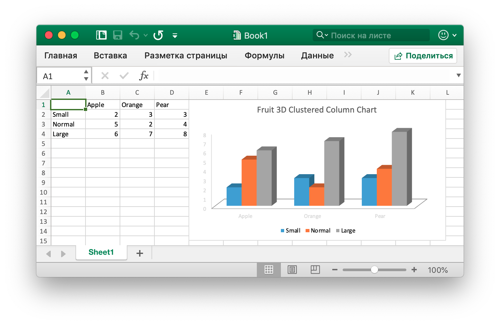

# Основное использование

## Установка {#install}

Для использования библиотеки Excelize последней версии требуется версия Go 1.10 или более поздняя.

- Установка

```bash
go get github.com/360EntSecGroup-Skylar/excelize
```

- Если ваш пакет управления с помощью [Go Modules](https://blog.golang.org/using-go-modules), пожалуйста, установите с помощью следующей команды.

```bash
go get github.com/360EntSecGroup-Skylar/excelize/v2@v2.1.0
```

## Обновление {#update}

- Обновление

```bash
go get -u github.com/360EntSecGroup-Skylar/excelize
```

## Создать документ Excel {#NewFile}

Вот минимальный пример использования, который будет создавать файл XLSX:

```go
package main

import "github.com/360EntSecGroup-Skylar/excelize"

func main() {
    f := excelize.NewFile()
    // Создать новый лист
    index := f.NewSheet("Sheet2")
    // Установленное значение ячейки
    f.SetCellValue("Sheet2", "A2", "Hello world.")
    f.SetCellValue("Sheet1", "B2", 100)
    // Установить активный лист рабочей книги
    f.SetActiveSheet(index)
    // Сохранить файл xlsx по данному пути
    if err := f.SaveAs("Book1.xlsx"); err != nil {
        println(err.Error())
    }
}
```

## Чтение документа Excel {#read}

Ниже представляет собой голое прочитать документ XLSX:

```go
package main

import "github.com/360EntSecGroup-Skylar/excelize"

func main() {
    f, err := excelize.OpenFile("Book1.xlsx")
    if err != nil {
        println(err.Error())
        return
    }
    // Получить значение из ячейки по заданному имени и оси листа
    cell, err := f.GetCellValue("Sheet1", "B2")
    if err != nil {
        println(err.Error())
        return
    }
    println(cell)
    // Получить все строки в Sheet1
    rows, err := f.GetRows("Sheet1")
    for _, row := range rows {
        for _, colCell := range row {
            print(colCell, "\t")
        }
        println()
    }
}
```

## Добавить диаграмму в документ Excel {#chart}

С Excelize создание и управление диаграммами так же просто, как несколько строк кода. Вы можете создавать диаграммы на основе данных на вашем листе или создавать диаграммы без каких-либо данных на вашем листе вообще.

<p align="center"></p>

```go
package main

import "github.com/360EntSecGroup-Skylar/excelize"

func main() {
    categories := map[string]string{"A2": "Small", "A3": "Normal", "A4": "Large", "B1": "Apple", "C1": "Orange", "D1": "Pear"}
    values := map[string]int{"B2": 2, "C2": 3, "D2": 3, "B3": 5, "C3": 2, "D3": 4, "B4": 6, "C4": 7, "D4": 8}
    f := excelize.NewFile()
    for k, v := range categories {
        f.SetCellValue("Sheet1", k, v)
    }
    for k, v := range values {
        f.SetCellValue("Sheet1", k, v)
    }
    if err := f.AddChart("Sheet1", "E1", `{"type":"col3DClustered","series":[{"name":"Sheet1!$A$2","categories":"Sheet1!$B$1:$D$1","values":"Sheet1!$B$2:$D$2"},{"name":"Sheet1!$A$3","categories":"Sheet1!$B$1:$D$1","values":"Sheet1!$B$3:$D$3"},{"name":"Sheet1!$A$4","categories":"Sheet1!$B$1:$D$1","values":"Sheet1!$B$4:$D$4"}],"title":{"name":"Fruit 3D Clustered Column Chart"}}`); err != nil {
        println(err.Error())
        return
    }
    // Сохранить файл xlsx по данному пути
    if err := f.SaveAs("Book1.xlsx"); err != nil {
        println(err.Error())
    }
}
```

## Добавить изображение в документ Excel {#image}

```go
package main

import (
    _ "image/gif"
    _ "image/jpeg"
    _ "image/png"

    "github.com/360EntSecGroup-Skylar/excelize"
)

func main() {
    f, err := excelize.OpenFile("Book1.xlsx")
    if err != nil {
        println(err.Error())
        return
    }
    // Вставить картинку
    if err := f.AddPicture("Sheet1", "A2", "image.png", ""); err != nil {
        println(err.Error())
    }
    // Вставка изображения в рабочий лист с масштабированием
    if err := f.AddPicture("Sheet1", "D2", "image.jpg", `{"x_scale": 0.5, "y_scale": 0.5}`); err != nil {
        println(err.Error())
    }
    // Вставьте смещение изображения в ячейке с поддержкой печати
    if err := f.AddPicture("Sheet1", "H2", "image.gif", `{"x_offset": 15, "y_offset": 10, "print_obj": true, "lock_aspect_ratio": false, "locked": false}`); err != nil {
        println(err.Error())
    }
    // Сохраните файл xlsx с исходным путем
    if err = f.Save(); err != nil {
        println(err.Error())
    }
}
```