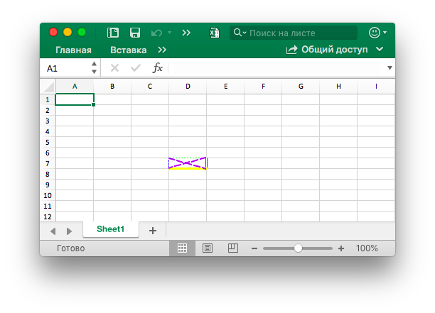
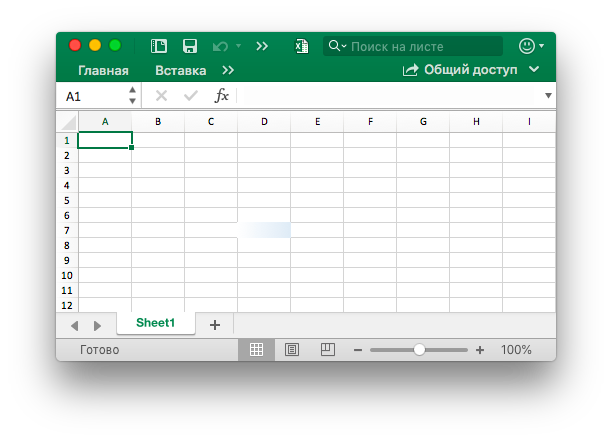
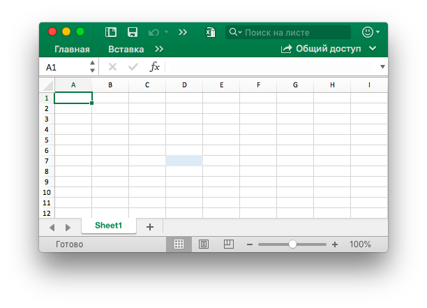
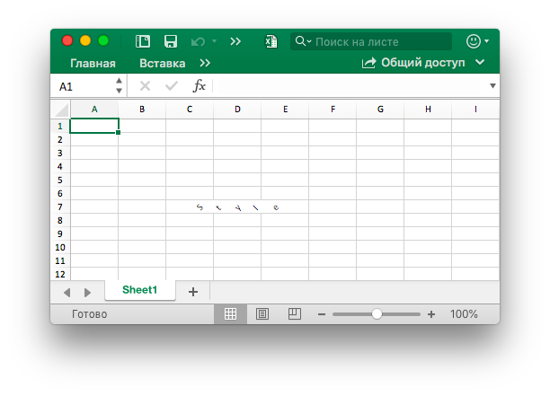
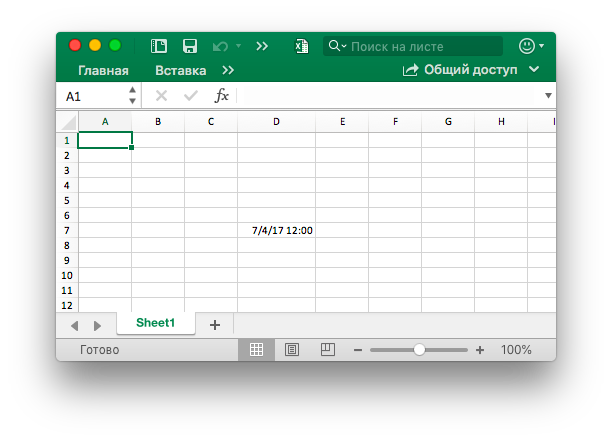
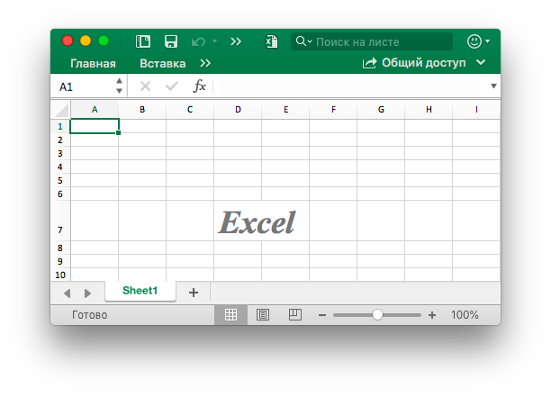
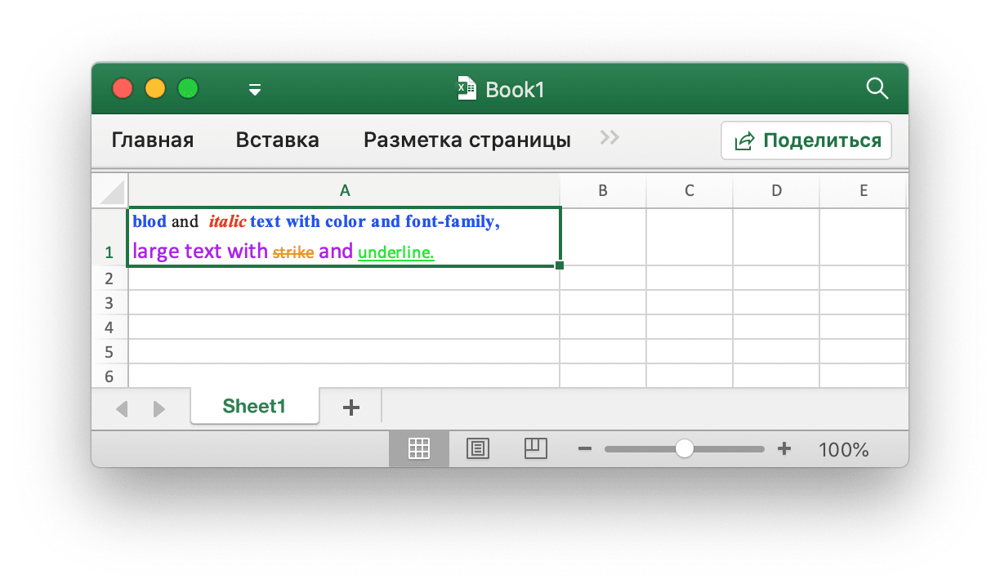
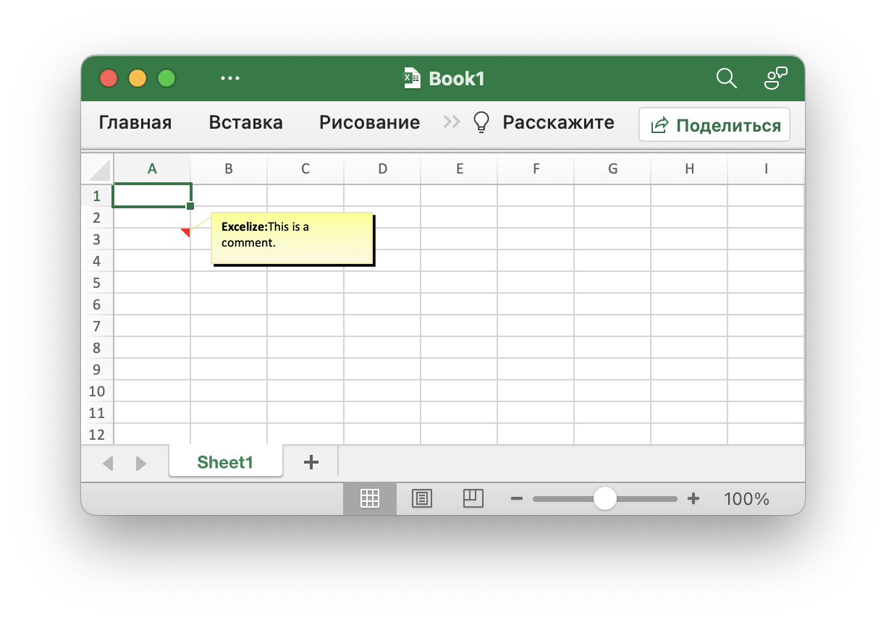

# клетка

`RichTextRun` напрямую отображает настройки прогона расширенного текста.

```go
type RichTextRun struct {
    Font *Font
    Text string
}
```

`HyperlinkOpts` можно передать в [`SetCellHyperlink`](cell.md#SetCellHyperlink) для установки дополнительных атрибутов гиперссылки (например, отображаемого текста и текста подсказки на экране).

```go
type HyperlinkOpts struct {
    Display *string
    Tooltip *string
}
```

`FormulaOpts` может быть передана [`SetCellFormula`](cell.md#SetCellFormula) для использования других типов формул.

```go
type FormulaOpts struct {
    Type *string // Тип формулы
    Ref  *string // Общие ссылки на формулы
}
```

## Установить значение ячейки {#SetCellValue}

```go
func (f *File) SetCellValue(sheet, cell string, value interface{}) error
```

SetCellValue предоставляет функцию для установки значения ячейки. Эта функция может быть использована для безопасности параллелизма. Указанные координаты не должны быть в первом ряду таблицы. Ниже приведены поддерживаемые типы данных:

|Поддерживаемые типы данных|
|---|
|int|
|int8|
|int16|
|int32|
|int64|
|uint|
|uint8|
|uint16|
|uint32|
|uint64|
|float32|
|float64|
|string|
|[]byte|
|time.Duration|
|time.Time|
|bool|
|nil|

Обратите внимание, что формат даты по умолчанию — `m/d/yy h:mm` со значением типа `time.Time`. Вы можете установить формат чисел с помощью метода [`SetCellStyle`](cell.md#SetCellStyle). Если вам нужно установить специальную дату в Excel, например 0 января 1900 года или 29 февраля 1900 года, это время не может быть представлено в типе данных `time.Time` языка Go. Установите значение ячейки как число 0 или 60, затем создайте и привяжите стиль формата даты и времени для ячейки.

## Установить логическое значение {#SetCellBool}

```go
func (f *File) SetCellBool(sheet, cell string, value bool) error
```

SetCellBool предоставляет функцию для установки значения типа bool ячейки с помощью заданного имени листа, координат ячейки и значения ячейки.

## Установить значение RAW {#SetCellDefault}

```go
func (f *File) SetCellDefault(sheet, cell, value string) error
```

SetCellDefault предоставляет функцию для установки значения типа строки ячейки как формата по умолчанию, не выходя из ячейки.

## Установить целочисленное значение {#SetCellInt}

```go
func (f *File) SetCellInt(sheet, cell string, value int) error
```

SetCellInt предоставляет функцию для установки значения типа int ячейки с помощью заданного имени листа, координат ячейки и значения ячейки.

## Установить беззнаковое целое значение {#SetCellUint}

```go
func (f *File) SetCellUint(sheet, cell string, value uint64) error
```

SetCellUint предоставляет функцию для установки значения целочисленного типа данных без знака для ячейки по заданному имени рабочего листа, ссылке на ячейку и значению ячейки.

## Установить значение с плавающей запятой {#SetCellFloat}

```go
func (f *File) SetCellFloat(sheet, cell string, value float64, precision, bitSize int) error
```

SetCellFloat устанавливает значение с плавающей запятой в ячейку. Параметр `precision` указывает, сколько знаков после запятой будет отображаться, а `-1` — это специальное значение, которое будет использовать столько знаков после запятой, сколько необходимо для представления числа. `bitSize` равен `32` или `64` в зависимости от того, использовался ли изначально для значения `float32` или `float64`.

## Установить строковое значение {#SetCellStr}

```go
func (f *File) SetCellStr(sheet, cell, value string) error
```

SetCellStr предоставляет функцию для установки значения типа строки для ячейки. Общее количество символов, которое ячейка может содержать символы `32767`.

## Установить стиль ячейки {#SetCellStyle}

```go
func (f *File) SetCellStyle(sheet, hCell, vCell string, styleID int) error
```

SetCellStyle предоставляет функцию добавления атрибута стиля для ячеек по заданному имени рабочего листа, области координат и идентификатору стиля. Эта функция может быть использована для безопасности параллелизма. Индексы стиля можно получить с помощью функции [`NewStyle`](style.md#NewStyle). Обратите внимание, что границы `diagonalDown` и `diagonalUp` должны использоваться одинаковым цветом в одной и той же координатной области. SetCellStyle перезапишет существующие стили для ячейки, он не будет добавлять или объединять стиль с существующими стилями.

- Пример 1, создайте границы ячейки `D7` на `Sheet1`:

```go
style, err := f.NewStyle(&excelize.Style{
    Border: []excelize.Border{
        {Type: "left", Color: "0000FF", Style: 3},
        {Type: "top", Color: "00FF00", Style: 4},
        {Type: "bottom", Color: "FFFF00", Style: 5},
        {Type: "right", Color: "FF0000", Style: 6},
        {Type: "diagonalDown", Color: "A020F0", Style: 8},
        {Type: "diagonalUp", Color: "A020F0", Style: 8},
    },
})
if err != nil {
    fmt.Println(err)
}
err = f.SetCellStyle("Sheet1", "D7", "D7", style)
```

<p align="center"></p>

Четыре границы ячейки `D7` установлены с разными стилями и цветами. Это связано с параметрами при вызове функции [`NewStyle`](style.md#NewStyle). Вам нужно установить разные стили для ссылки на документацию для этой главы.

- Пример 2, установив стиль градиента для ячейки `D7` листа `Sheet1`:

```go
style, err := f.NewStyle(&excelize.Style{
    Fill: excelize.Fill{Type: "gradient", Color: []string{"FFFFFF", "E0EBF5"}, Shading: 1},
})
if err != nil {
    fmt.Println(err)
}
err = f.SetCellStyle("Sheet1", "D7", "D7", style)
```

<p align="center"></p>

В ячейке `D7` задается цветовая заливка эффекта градиента. Эффект градиентной заливки связан с параметром при вызове функции [`NewStyle`](style.md#NewStyle). Вам нужно установить разные стили для ссылки на документацию этой главы.

- Пример 3, установите сплошную заливку для ячейки `D7` с именем `Sheet1`:

```go
style, err := f.NewStyle(&excelize.Style{
    Fill: excelize.Fill{Type: "pattern", Color: []string{"E0EBF5"}, Pattern: 1},
})
if err != nil {
    fmt.Println(err)
}
err = f.SetCellStyle("Sheet1", "D7", "D7", style)
```

<p align="center"></p>

Ячейка `D7` установлена с заполнением.

- Пример 4, задайте расстояние между символами и угол поворота для ячейки `D7` с именем `Sheet1`:

```go
f.SetCellValue("Sheet1", "D7", "样式")
style, err := f.NewStyle(&excelize.Style{
    Alignment: &excelize.Alignment{
        Horizontal:      "center",
        Indent:          1,
        JustifyLastLine: true,
        ReadingOrder:    0,
        RelativeIndent:  1,
        ShrinkToFit:     true,
        TextRotation:    45,
        Vertical:        "",
        WrapText:        true,
    },
})
if err != nil {
    fmt.Println(err)
}
err = f.SetCellStyle("Sheet1", "D7", "D7", style)
```

<p align="center"></p>

- Пример 5, дата и время в Excel представлены действительными числами, например `2017/7/4  12:00:00 PM` могут быть представлены числом `42920.5`. Установите формат времени для ячейки таблицы `D7` с именем `Sheet1`:

```go
f.SetCellValue("Sheet1", "D7", 42920.5)
f.SetColWidth("Sheet1", "D", "D", 13)
style, err := f.NewStyle(&excelize.Style{NumFmt: 22})
if err != nil {
    fmt.Println(err)
}
err = f.SetCellStyle("Sheet1", "D7", "D7", style)
```

<p align="center"></p>

В ячейке `D7` установлен формат времени. Обратите внимание, что когда ширина ячейки с применяемым временным форматом слишком узкая, чтобы ее можно было полностью отобразить, она будет отображаться как `####`, вы можете перетащить ширину столбца или установить столбец в соответствующий размер, вызвав `SetColWidth`, чтобы сделать его нормальным. дисплей.

- Пример 6, установив шрифт, размер шрифта, цвет и стиль перекоса для ячейки `D7` листа `Sheet1`:

```go
f.SetCellValue("Sheet1", "D7", "Excel")
style, err := f.NewStyle(&excelize.Style{
    Font: &excelize.Font{
        Bold:   true,
        Italic: true,
        Family: "Times New Roman",
        Size:   36,
        Color:  "777777",
    },
})
if err != nil {
    fmt.Println(err)
}
err = f.SetCellStyle("Sheet1", "D7", "D7", style)
```

<p align="center"></p>

- Пример 7, блокировка и скрытие ячейки `D7` с именем `Sheet1`:

```go
style, err := f.NewStyle(&excelize.Style{
    Protection: &excelize.Protection{
        Hidden: true,
        Locked: true,
    },
})
if err != nil {
    fmt.Println(err)
}
err = f.SetCellStyle("Sheet1", "D7", "D7", style)
```

Чтобы заблокировать ячейку или скрыть формулу, защитите рабочий лист. На вкладке «Обзор» нажмите «Защитить рабочий лист».

## Установить гиперссылку {#SetCellHyperLink}

```go
func (f *File) SetCellHyperLink(sheet, cell, link, linkType string, opts ...HyperlinkOpts) error
```

SetCellHyperLink предоставляет функцию для установки гиперссылки на ячейки с помощью заданного имени рабочего листа и URL-адреса URL-адреса. LinkType определяет два типа гиперссылки `External` для сайта или `Location` для перехода к одной из сот в этой книге. Максимальный лимит гиперссылок на листе составляет `65530`. Эта функция используется только для установки гиперссылки ячейки и не влияет на значение ячейки. Если вам нужно установить значение ячейки, используйте другие функции, такие как [`SetCellStyle`](cell.md#SetCellStyle) или [`SetSheetRow`](sheet.md#SetSheetRow). Ниже приведен пример внешней ссылки.

- Пример 1, добавление внешней ссылки на ячейку `A3` на листе с именем `Sheet1`:

```go
display, tooltip := "https://github.com/xuri/excelize", "Excelize on GitHub"
if err := f.SetCellHyperLink("Sheet1", "A3",
    "https://github.com/xuri/excelize", "External", excelize.HyperlinkOpts{
        Display: &display,
        Tooltip: &tooltip,
    }); err != nil {
    fmt.Println(err)
}
// Задайте стиль шрифта и подчеркивания для ячейки
style, err := f.NewStyle(&excelize.Style{
    Font: &excelize.Font{Color: "1265BE", Underline: "single"},
})
if err != nil {
    fmt.Println(err)
}
err = f.SetCellStyle("Sheet1", "A3", "A3", style)
```

- Пример 2: добавление внутренней ссылки на ячейку `A3` с именем `Sheet1`:

```go
err := f.SetCellHyperLink("Sheet1", "A3", "Sheet1!A40", "Location")
```

## Установить форматированный текст для ячейки {#SetCellRichText}

```go
func (f *File) SetCellRichText(sheet, cell string, runs []RichTextRun) error
```

SetCellRichText предоставляет функцию для установки ячейки с расширенным текстом по заданному рабочему листу.

Например, установите расширенный текст в ячейке `A1` листа с именем `Sheet1`:

<p align="center"></p>

```go
package main

import (
    "fmt"

    "github.com/xuri/excelize/v2"
)

func main() {
    f := excelize.NewFile()
    defer func() {
        if err := f.Close(); err != nil {
            fmt.Println(err)
        }
    }()
    if err := f.SetRowHeight("Sheet1", 1, 35); err != nil {
        fmt.Println(err)
        return
    }
    if err := f.SetColWidth("Sheet1", "A", "A", 44); err != nil {
        fmt.Println(err)
        return
    }
    if err := f.SetCellRichText("Sheet1", "A1", []excelize.RichTextRun{
        {
            Text: "bold",
            Font: &excelize.Font{
                Bold:   true,
                Color:  "2354E8",
                Family: "Times New Roman",
            },
        },
        {
            Text: " and ",
            Font: &excelize.Font{
                Family: "Times New Roman",
            },
        },
        {
            Text: "italic ",
            Font: &excelize.Font{
                Bold:   true,
                Color:  "E83723",
                Italic: true,
                Family: "Times New Roman",
            },
        },
        {
            Text: "text with color and font-family,",
            Font: &excelize.Font{
                Bold:   true,
                Color:  "2354E8",
                Family: "Times New Roman",
            },
        },
        {
            Text: "\r\nlarge text with ",
            Font: &excelize.Font{
                Size:  14,
                Color: "AD23E8",
            },
        },
        {
            Text: "strike",
            Font: &excelize.Font{
                Color:  "E89923",
                Strike: true,
            },
        },
        {
            Text: " superscript",
            Font: &excelize.Font{
                Color:     "DBC21F",
                VertAlign: "superscript",
            },
        },
        {
            Text: " and ",
            Font: &excelize.Font{
                Size:      14,
                Color:     "AD23E8",
                VertAlign: "baseline",
            },
        },
        {
            Text: "underline",
            Font: &excelize.Font{
                Color:     "23E833",
                Underline: "single",
            },
        },
        {
            Text: " subscript.",
            Font: &excelize.Font{
                Color:     "017505",
                VertAlign: "subscript",
            },
        },
    }); err != nil {
        fmt.Println(err)
        return
    }
    style, err := f.NewStyle(&excelize.Style{
        Alignment: &excelize.Alignment{
            WrapText: true,
        },
    })
    if err != nil {
        fmt.Println(err)
        return
    }
    if err := f.SetCellStyle("Sheet1", "A1", "A1", style); err != nil {
        fmt.Println(err)
        return
    }
    if err := f.SaveAs("Book1.xlsx"); err != nil {
        fmt.Println(err)
    }
}
```

## Получить форматированный текст ячейки {#GetCellRichText}

```go
func (f *File) GetCellRichText(sheet, cell string) ([]RichTextRun, error)
```

GetCellRichText предоставляет функцию для получения форматированного текста ячеек по заданному листу.

## Получить значение ячейки {#GetCellValue}

```go
func (f *File) GetCellValue(sheet, cell string, opts ...Options) (string, error)
```

Значение ячейки извлекается в соответствии с данным рабочим листом и координатами ячейки, а возвращаемое значение преобразуется в тип `string`. Эта функция может быть использована для безопасности параллелизма. Если формат ячейки можно применить к значению ячейки, прикладное значение будет возвращено, иначе исходное значение будет возвращено. Значения всех ячеек будут одинаковыми в объединенном диапазоне.

## Получить тип данных ячейки {#GetCellType}

```go
func (f *File) GetCellType(sheet, cell string) (CellType, error)
```

GetCellType предоставляет функцию для получения типа данных ячейки по заданному имени листа и оси в файле электронной таблицы.

## Получить все значения ячейки по столбцам {#GetCols}

```go
func (f *File) GetCols(sheet string, opts ...Options) ([][]string, error)
```

GetCols получает значение всех ячеек по столбцам на рабочем листе на основе заданного имени рабочего листа, возвращаемого в виде двумерного массива, где значение ячейки преобразуется в тип `строка`. Если формат ячейки можно применить к значению ячейки, будет использовано примененное значение, в противном случае будет использовано исходное значение.

Например, получить и пройти значение всех ячеек по столбцам на листе с именем `Лист1`:

```go
cols, err := f.GetCols("Лист1")
if err != nil {
    fmt.Println(err)
    return
}
for _, col := range cols {
    for _, rowCell := range col {
        fmt.Print(rowCell, "\t")
    }
    fmt.Println()
}
```

## Получить все значения ячеек по строкам {#GetRows}

```go
func (f *File) GetRows(sheet string, opts ...Options) ([][]string, error)
```

GetRows возвращает все строки на листе по заданному имени рабочего листа, возвращаемые в виде двумерного массива, где значение ячейки преобразуется в тип `string`. Если формат ячейки можно применить к значению ячейки, будет использовано примененное значение, в противном случае будет использовано исходное значение. GetRows извлекает строки со значениями или ячейками формулы, постоянно пустые ячейки в хвосте каждой строки будут пропущены, поэтому длина каждой строки может быть непоследовательной.

Например, получить и пройти значение всех ячеек по строкам на листе с именем `Лист1`:

```go
rows, err := f.GetRows("Лист1")
if err != nil {
    fmt.Println(err)
    return
}
for _, row := range rows {
    for _, colCell := range row {
        fmt.Print(colCell, "\t")
    }
    fmt.Println()
}
```

## Получить гиперссылку {#GetCellHyperLink}

```go
func (f *File) GetCellHyperLink(sheet, cell string) (bool, string, error)
```

Получает гиперссылку на ячейку на основе заданного имени листа и координат ячейки. Если ячейка имеет гиперссылку, она вернет `true` и адрес ссылки, иначе он вернет `false` и пустой адрес ссылки.

Например, получите гиперссылку на ячейку `H6` на листе с именем `Лист1`:

```go
link, target, err := f.GetCellHyperLink("Лист1", "H6")
```

## Получить индекс стиля {#GetCellStyle}

```go
func (f *File) GetCellStyle(sheet, cell string) (int, error)
```

Индекс стиля ячейки получается из заданного имени листа и координат ячейки, а полученный индекс может использоваться как параметр для вызова функции `SetCellStyle` при копировании стиля ячейки.

## Объединить ячейки {#MergeCell}

```go
func (f *File) MergeCell(sheet, hCell, vCell string) error
```

Объединить ячейки на основе заданного имени листа и областей координат ячейки. При объединении ячеек сохраняется только значение верхней левой ячейки, а остальные значения отбрасываются. Например, слияние ячеек в области `D3:E9` на листе с именем `Лист1`:

```go
err := f.MergeCell("Лист1", "D3", "E9")
```

Если заданная координатная область ячейки перекрывается с другими существующими объединенными ячейками, существующие объединенные ячейки будут удалены.

## Отменить объединение ячеек {#UnmergeCell}

```go
func (f *File) UnmergeCell(sheet string, hCell, vCell string) error
```

UnmergeCell предоставляет функцию для объединения заданной координатной области. Например, удалите область `D3:E9` на `Лист1`:

```go
err := f.UnmergeCell("Лист1", "D3", "E9")
```

Внимание: перекрывающиеся области также не будут объединены.

## Получить ячейки слияния {#GetMergeCells}

GetMergeCells предоставляет функцию для получения всех объединенных ячеек из рабочего листа.

```go
func (f *File) GetMergeCells(sheet string) ([]MergeCell, error)
```

### Получить значение объединенной ячейки

```go
func (m *MergeCell) GetCellValue() string
```

GetCellValue возвращает значение объединенной ячейки.

### Получить координаты верхней левой ячейки объединенного диапазона

```go
func (m *MergeCell) GetStartAxis() string
```

GetStartAxis возвращает координаты верхней левой ячейки объединенного диапазона, например: `C2`.

### Получить координаты нижней правой ячейки объединенного диапазона

```go
func (m *MergeCell) GetEndAxis() string
```

GetEndAxis возвращает координаты нижней правой ячейки объединенного диапазона, например: `D4`.

## Получить клетки изображения {#GetPictureCells}

```go
func (f *File) GetPictureCells(sheet string) ([]string, error)
```

GetPictureCells возвращает все ссылки на ячейки изображений на листе по определенному имени листа.

## Добавить комментарий {#AddComment}

```go
func (f *File) AddComment(sheet string, comment Comment) error
```

AddComment предоставляет метод добавления комментариев в листе с помощью заданного индекса, набора ячеек и формата (например, автора и текста). Обратите внимание, что максимальная длина автора равна 255, а максимальная длина текста - 32512. Например, добавьте комментарий в `Sheet1!A3`:

<p align="center"></p>

```go
err := f.AddComment("Sheet1", excelize.Comment{
    Cell:   "A3",
    Author: "Excelize",
    Paragraph: []excelize.RichTextRun{
        {Text: "Excelize: ", Font: &excelize.Font{Bold: true}},
        {Text: "This is a comment."},
    },
})
```

## Получить комментари {#GetComments}

```go
func (f *File) GetComments(sheet string) ([]Comment, error)
```

GetComments извлекает все комментарии на листе по заданному имени листа.

## Удалить комментарий {#DeleteComment}

```go
func (f *File) DeleteComment(sheet, cell string) error
```

DeleteComment предоставляет метод для удаления комментария на листе по заданному рабочему листу. Например, удалить комментарий в `Лист1!A30`:

```go
err := f.DeleteComment("Лист1", "A30")
```

## Установить формулу ячейки {#SetCellFormula}

```go
func (f *File) SetCellFormula(sheet, cell, formula string, opts ...FormulaOpts) error
```

SetCellFormula предоставляет функцию для установки формулы в ячейке в соответствии с заданным именем рабочего листа и настройками формулы ячейки. Результат ячейки формулы может быть рассчитан, когда лист открыт приложением Office Excel или может использовать функцию [CalcCellValue](cell.md#CalcCellValue) также может получить рассчитанное значение ячейки. Если приложение Excel не вычисляет формулу автоматически при открытии книги, вызовите [UpdateLinkedValue](utils.md#UpdateLinkedValue) после установки функций формулы ячейки.

- Пример 1, установите обычную формулу `=SUM(A1,B1)` для ячейки `A3` на `Лист1`:

```go
err := f.SetCellFormula("Лист1", "A3", "=SUM(A1,B1)")
```

- Пример 2, установить одномерный вертикальный постоянный массив (массив столбцов) формулой `1;2;3` для ячейки `A3` на `Лист1`:

```go
err := f.SetCellFormula("Лист1", "A3", "={1;2;3}")
```

- Пример 3, установить одномерный горизонтальный массив констант (массив строк) формулой `"a","b","c"` для ячейки `A3` на `Лист1`:

```go
err := f.SetCellFormula("Лист1", "A3", "={\"a\",\"b\",\"c\"}")
```

- Пример 4, установить двумерную формулу массива констант `{1,2;"a","b"}` для ячейки `A3` на `Лист1`:

```go
formulaType, ref := excelize.STCellFormulaTypeArray, "A3:A3"
err := f.SetCellFormula("Лист1", "A3", "={1,2;\"a\",\"b\"}",
    excelize.FormulaOpts{Ref: &ref, Type: &formulaType})
```

- Пример 5, установить формулу массива диапазонов `A1:A2` для ячейки `A3` на `Лист1`:

```go
formulaType, ref := excelize.STCellFormulaTypeArray, "A3:A3"
err := f.SetCellFormula("Лист1", "A3", "=A1:A2",
    excelize.FormulaOpts{Ref: &ref, Type: &formulaType})
```

- Пример 6, установить общую формулу `=A1+B1` для ячеек `C1:C5` на `Лист1`, `C1` - это основная ячейка:

```go
formulaType, ref := excelize.STCellFormulaTypeShared, "C1:C5"
err := f.SetCellFormula("Лист1", "C1", "=A1+B1",
    excelize.FormulaOpts{Ref: &ref, Type: &formulaType})
```

- Пример 7, установить формулу таблицы `=SUM(Table1[[A]:[B]])` для ячейки `C2` на `Лист1`:

```go
package main

import (
    "fmt"

    "github.com/xuri/excelize/v2"
)

func main() {
    f := excelize.NewFile()
    defer func() {
        if err := f.Close(); err != nil {
            fmt.Println(err)
        }
    }()
    if err := f.SetSheetName("Sheet1", "Лист1"); err != nil {
        fmt.Println(err)
        return
    }
    for idx, row := range [][]interface{}{{"A", "B", "C"}, {1, 2}} {
        if err := f.SetSheetRow("Лист1", fmt.Sprintf("A%d", idx+1), &row); err != nil {
            fmt.Println(err)
            return
        }
    }
    if err := f.AddTable("Лист1",
        &excelize.Table{
            Range:     "A1:C2",
            Name:      "Table1",
            StyleName: "TableStyleMedium2",
        }); err != nil {
        fmt.Println(err)
        return
    }
    formulaType := excelize.STCellFormulaTypeDataTable
    if err := f.SetCellFormula("Лист1", "C2", "=SUM(Table1[[A]:[B]])",
        excelize.FormulaOpts{Type: &formulaType}); err != nil {
        fmt.Println(err)
        return
    }
    if err := f.SaveAs("Книга1.xlsx"); err != nil {
        fmt.Println(err)
    }
}
```

## Получить формулу ячейки {#GetCellFormula}

```go
func (f *File) GetCellFormula(sheet, cell string) (string, error)
```

Получите формулу в ячейке на основе заданного имени листа и координат ячейки.

## Рассчитать значение ячейки {#CalcCellValue}

```go
func (f *File) CalcCellValue(sheet, cell string, opts ...Options) (string, error)
```

CalcCellValue предоставляет функцию для получения рассчитанного значения ячейки. Эта функция в настоящее время находится в рабочей обработке. Итеративное вычисление, неявное пересечение, явное пересечение, формула массива, формула таблицы и некоторые другие формулы в настоящее время не поддерживаются.

Поддерживаемые формулы:

Имя функции | Тип и описание
---|---
ABS                             | Возвращает абсолютную величину числа
НАКОПДОХОД                      | Возвращает накопленный процент по ценной бумаге с периодической выплатой процентов
НАКОПДОХОДПОГАШ                 | Возвращает накопленный процент по ценной бумаге, процент по которой выплачивается в срок погашения
ACOS                            | Возвращает арккосинус числа
ACOSH                           | Возвращает обратный гиперболический косинус числа (ареакосинус)
ACOT                            | Возвращает арккотангенс числа
ACOTH                           | Возвращает гиперболический арккотангенс числа
АГРЕГАТ                         | Возвращает агрегированное выражение списка или базы данных
АДРЕС                           | Возвращает ссылку на отдельную ячейку листа в виде текста
АМОРУМ                          | Возвращает величину амортизации для каждого учетного периода, используя коэффициент амортизации
АМОРУВ                          | Возвращает величину амортизации для каждого учетного периода
И                               | Возвращает значение TRUE, если все аргументы имеют значение TRUE
АРАБСКОЕ                        | Преобразует римское число в арабское
МАССИВВТЕКСТ                    | Возвращает массив текстовых значений из любого указанного диапазона
ASIN                            | Возвращает арксинус числа
ASINH                           | Возвращает обратный гиперболический синус числа (ареасинус)
ATAN                            | Возвращает арктангенс числа
ATAN2                           | Возвращает арктангенс для заданных координат x и y
ATANH                           | Возвращает обратный гиперболический тангенс числа (ареатангенс)
СРОТКЛ                          | Возвращает среднее арифметическое абсолютных отклонений значений от их среднего
СРЗНАЧ                          | Возвращает среднее арифметическое аргументов
СРЗНАЧА                         | Возвращает среднее значение аргументов (включая числовые, текстовые и логические)
СРЗНАЧЕСЛИ                      | Возвращает среднее арифметическое всех ячеек в диапазоне, соответствующих определенному условию
AVERAGEIFS                      | Возвращает среднее значение (среднее арифметическое) всех ячеек, которые удовлетворяют нескольким условиям
ОСНОВАНИЕ                       | Преобразует число в текстовое представление с заданным основанием (базой)
БЕССЕЛЬ.I                       | Возвращает модифицированную функцию Бесселя In(x)
БЕССЕЛЬ.J                       | Возвращает функцию Бесселя Jn(x)
БЕССЕЛЬ.K                       | Возвращает модифицированную функцию Бесселя Kn(x)
БЕССЕЛЬ.Y                       | Возвращает функцию Бесселя Yn(x)
БЕТАРАСП                        | Возвращает функцию интегрального бета-распределения. В Excel 2007 это статистическая функция
БЕТА.РАСП                       | Возвращает функцию интегрального бета-распределения
БЕТАОБР                         | Возвращает обратную функцию к интегральной функции указанного бета-распределения. В Excel 2007 это статистическая функция
БЕТА.ОБР                        | Возвращает обратную функцию к интегральной функции указанного бета-распределения
ДВ.В.ДЕС                        | Преобразует двоичное число в десятичное
ДВ.В.ШЕСТН                      | Преобразует двоичное число в шестнадцатеричное
ДВ.В.ВОСЬМ                      | Преобразует двоичное число в восьмеричное
БИНОМРАСП                       | Возвращает вероятность биномиального распределения отдельного условия. В Excel 2007 это статистическая функция
БИНОМ.РАСП                      | Возвращает вероятность биномиального распределения отдельного условия
БИНОМ.РАСП.ДИАП                 | Возвращает вероятность получения определенного результата испытания с помощью биномиального распределения
БИНОМ.ОБР                       | Возвращает наименьшее значение, при котором интегральное биномиальное распределение будет меньше заданного критерия или равно ему
БИТ.И                           | Возвращает результат операции поразрядного И для двух чисел
БИТ.СДВИГЛ                      | Возвращает число со сдвигом влево на указанное число бит
БИТ.ИЛИ                         | Возвращает результат операции поразрядного ИЛИ для двух чисел
БИТ.СДВИГП                      | Возвращает число со сдвигом вправо на указанное число бит
БИТ.ИСКЛИЛИ                     | Возвращает результат операции поразрядного исключающего ИЛИ для двух чисел
ОКРВВЕРХ                        | Округляет число до ближайшего целого или кратного
ОКРВВЕРХ.МАТ                    | Округляет число к большему до ближайшего целого или до ближайшего кратного значения с указанной точностью
ОКРВВЕРХ.ТОЧН                   | Округляет число до ближайшего целого или до ближайшего кратного значения с указанной точностью. Число округляется до большего значения вне зависимости от его знака
СИМВОЛ                          | Возвращает символ с указанным кодом
ХИ2РАСП                         | Возвращает одностороннюю вероятность распределения хи-квадрат. В Excel 2007 это статистическая функция
ХИ2ОБР                          | Возвращает обратное значение односторонней вероятности распределения хи-квадрат. В Excel 2007 это статистическая функция
ХИ2ТЕСТ                         | Возвращает тест на независимость. В Excel 2007 это статистическая функция
CHISQ.DIST                      | Возвращает интегральную функцию плотности бета-распределения
ХИ2.РАСП.ПХ                     | Возвращает одностороннюю вероятность распределения хи-квадрат
CHISQ.INV                       | Возвращает интегральную функцию плотности бета-распределения
ХИ2.ОБР.ПХ                      | Возвращает обратное значение односторонней вероятности распределения хи-квадрат
CHISQ.TEST                      | Возвращает тест на независимость
ВЫБОР                           | Выбирает значение из списка значений
ПЕЧСИМВ                         | Удаляет из текста все непечатаемые символы
КОДСИМВ                         | Возвращает числовой код первого символа в текстовой строке
СТОЛБЕЦ                         | Возвращает номер столбца, на который указывает ссылка
ЧИСЛСТОЛБ                       | Возвращает количество столбцов в ссылке
ЧИСЛКОМБ                        | Возвращает количество комбинаций для заданного числа объектов
ЧИСЛКОМБА                       | Возвращает количество комбинаций, которые можно составить из заданного числа элементов, с повторами
КОМПЛЕКСН                       | Преобразует коэффициенты при вещественной и мнимой частях комплексного числа в комплексное число
СЦЕП                            | Объединяет текст из нескольких диапазонов или строк, но не добавляет разделитель или аргументы IgnoreEmpty
СЦЕПИТЬ                         | Объединяет несколько текстовых элементов в один
ДОВЕРИТ                         | Возвращает доверительный интервал для среднего значения по генеральной совокупности. В Excel 2007 это статистическая функция
ДОВЕРИТ.НОРМ                    | Возвращает доверительный интервал для среднего значения по генеральной совокупности
CONFIDENCE.T                    | Возвращает доверительный интервал для среднего значения генеральной совокупности, используя распределение Стьюдента
ПРЕОБР                          | Преобразует значение из одной системы измерения в другую
КОРРЕЛ                          | Возвращает коэффициент корреляции между двумя множествами данных
COS                             | Возвращает косинус числа
COSH                            | Возвращает гиперболический косинус числа
COT                             | Возвращает гиперболический косинус числа
COTH                            | Возвращает котангенс угла
СЧЁТ                            | Подсчитывает количество чисел в списке аргументов
СЧЁТЗ                           | Подсчитывает количество значений в списке аргументов
СЧИТАТЬПУСТОТЫ                  | Подсчитывает количество пустых ячеек в диапазоне
СЧЁТЕСЛИ                        | Подсчитывает количество ячеек в диапазоне, соответствующих определенному условию
COUNTIFS                        | Подсчитывает количество ячеек в диапазоне, соответствующих нескольким условиям
ДНЕЙКУПОНДО                     | Возвращает количество дней с начала купонного периода до даты расчета
ДНЕЙКУПОН                       | Возвращает количество дней расчета в купонном периоде
ДНЕЙКУПОНПОСЛЕ                  | Возвращает количество дней между датой расчета и следующей датой выплаты процентов
ДАТАКУПОНПОСЛЕ                  | Возвращает дату выплаты процентов, следующую после даты расчета
ЧИСЛКУПОН                       | Возвращает количество процентных выплат между датой расчета и датой погашения
ДАТАКУПОНДО                     | Возвращает дату выплаты процентов, которая предшествует дате расчета
КОВАР                           | Возвращает значение ковариации, среднее произведений парных отклонений. В Excel 2007 это статистическая функция
КОВАРИАЦИЯ.Г                    | Возвращает значение ковариации, среднее произведений парных отклонений
COVARIANCE.S                    | Возвращает значение ковариации выборки, среднее попарных произведений отклонений для всех точек данных в двух наборах данных
КРИТБИНОМ                       | Возвращает наименьшее значение, при котором интегральное биномиальное распределение будет меньше заданного критерия или равно ему. В Excel 2007 это статистическая функция
CSC                             | Возвращает косеканс угла
CSCH                            | Возвращает гиперболический косеканс угла
ОБЩПЛАТ                         | Возвращает кумулятивную сумму процентов, выплачиваемую между двумя периодами
ОБЩДОХОД                        | Возвращает кумулятивную сумму, выплачиваемую для погашения займа между двумя периодами
ДАТА                            | Возвращает порядковый номер определенной даты
РАЗНДАТ                         | Вычисляет количество дней, месяцев или лет между двумя датами. Эта функция полезна в формулах для расчета возраста
ДАТАЗНАЧ                        | Преобразует дату из текстового формата в числовой
ДСРЗНАЧ                         | Возвращает среднее значение выбранных записей базы данных
ДЕНЬ                            | Преобразует порядковый номер в день месяца
DAYS                            | Возвращает количество дней между двумя датами
ДНЕЙ360                         | Вычисляет количество дней между двумя датами на основании 360-дневного года
ФУО                             | Возвращает сумму амортизации актива за определенный период, начисляемую по методу фиксированного убывающего остатка
БСЧЁТ                           | Подсчитывает количество ячеек в базе данных, содержащих числа
БСЧЁТА                          | Подсчитывает количество непустых ячеек в базе данных
ДДОБ                            | Возвращает сумму амортизации актива за определенный период, начисляемую методом двойного убывающего остатка или иным указанным методом
ДЕС.В.ДВ                        | Преобразует десятичное число в двоичное
ДЕС.В.ШЕСТН                     | Преобразует десятичное число в шестнадцатеричное
ДЕС.В.ВОСЬМ                     | Преобразует десятичное число в восьмеричное
ДЕС                             | Преобразует текстовое представление числа c указанным основанием в десятичное
ГРАДУСЫ                         | Преобразует радианы в градусы
ДЕЛЬТА                          | Проверяет равенство двух значений
КВАДРОТКЛ                       | Возвращает сумму квадратов отклонений
БИЗВЛЕЧЬ                        | Извлекает из базы данных одну запись, соответствующую заданному условию
СКИДКА                          | Возвращает ставку дисконтирования ценной бумаги
ДМАКС                           | Возвращает наибольшее значение из выбранных записей базы данных
ДМИН                            | Возвращает наименьшее значение из выбранных записей базы данных
РУБЛЬ.ДЕС                       | Преобразует цену в рублях, представленную в виде десятичной дроби, в десятичное число
РУБЛЬ.ДРОБЬ                     | Преобразует цену в рублях, представленную в виде десятичного числа, в десятичную дробь
DPRODUCT                        | Перемножает значения определенного поля записей, соответствующих условию, в базе данных
ДСТАНДОТКЛ                      | Оценивает стандартное отклонение для выборки записей базы данных
ДСТАНДОТКЛП                     | Вычисляет стандартное отклонение для генеральной совокупности выбранных записей базы данных
БДСУММ                          | Суммирует числа в поле (столбце) записей базы данных, соответствующих условию
ДЛИТ                            | Возвращает продолжительность Маколея для ценных бумаг, по которым выплачивается периодический процент
DVAR                            | Оценивает дисперсию для выборки записей базы данных
БДДИСПП                         | Вычисляет дисперсию для генеральной совокупности выбранных записей базы данных
ДАТАМЕС                         | Возвращает порядковый номер даты, отстоящей на заданное количество месяцев вперед или назад от начальной даты
ЭФФЕКТ                          | Возвращает эффективную годовую процентную ставку
ENCODEURL                       | Возвращает строку запроса, зашифрованную в виде URL-адреса Эта функция недоступна в Excel в Интернете
КОНМЕСЯЦА                       | Возвращает порядковый номер последнего дня месяца, отстоящего на заданное число месяцев вперед или назад от начальной даты
ФОШ                             | Возвращает функцию ошибок
ERF.PRECISE                     | Возвращает функцию ошибок
ДФОШ                            | Возвращает дополнительную функцию ошибок
ERFC.PRECISE                    | Возвращает дополнительную функцию ФОШ, проинтегрированную от x до бесконечности
ERROR.TYPE                      | Возвращает номер, соответствующий типу ошибки
EUROCONVERT                     | Преобразует число в значение в евро, преобразует значения в евро в значение в национальной валюте стран, использующих евро, или преобразует число из одной национальной валюты в другую, используя в качестве промежуточного результата значение в евро (триангуляция)
ЧЁТН                            | Округляет число к большему до ближайшего четного целого
СОВПАД                          | Проверяет идентичность двух текстовых значений
EXP                             | Возвращает число e, возведенное в указанную степень
ЭКСП.РАСП                       | Возвращает экспоненциальное распределение
ЭКСПРАСП                        | Возвращает экспоненциальное распределение. В Excel 2007 это статистическая функция
ФАКТР                           | Возвращает факториал числа
ДВФАКТР                         | Возвращает двойной факториал числа
ЛОЖЬ                            | Возвращает логическое значение FALSE
F.DIST                          | Возвращает F-распределение вероятности
FРАСП                           | Возвращает F-распределение вероятности. В Excel 2007 это статистическая функция
F.DIST.RT                       | Возвращает F-распределение вероятности
НАЙТИ                           | Находит одно текстовое значение в другом (с учетом регистра)
НАЙТИБ                          | Находит одно текстовое значение в другом (с учетом регистра)
F.INV                           | Возвращает обратное F-распределение вероятности
F.INV.RT                        | Возвращает обратное F-распределение вероятности
FРАСПОБР                        | Возвращает обратное F-распределение вероятности. В Excel 2007 это статистическая функция
ФИШЕР                           | Возвращает преобразование Фишера
ФИШЕРОБР                        | Возвращает обратное преобразование Фишера
ФИКСИРОВАННЫЙ                   | Форматирует число, отображая определенное количество знаков после запятой
ОКРВНИЗ                         | Округляет число с понижением к нулю. В Excel 2007 и Excel 2010 это математическая и тригонометрическая функция
ОКРВНИЗ.МАТ                     | Округляет число к меньшему до ближайшего целого или до ближайшего кратного с указанной точностью
FLOOR.PRECISE                   | Округляет число до ближайшего целого или до ближайшего кратного значения с указанной точностью. Число округляется до большего значения вне зависимости от его знака
ПРЕДСКАЗ                        | Возвращает значение линейного тренда
FORECAST.LINEAR                 | Возвращает значение линейного тренда
Ф.ТЕКСТ                         | Возвращает формулу в заданной ссылке в виде текста
ЧАСТОТА                         | Возвращает распределение частот в виде вертикального массива
F.TEST                          | Возвращает результат F-теста
ФТЕСТ                           | Возвращает результат F-теста.. В Excel 2007 это статистическая функция
БС                              | Возвращает будущую стоимость инвестиций
БЗРАСПИС                        | Возвращает будущую стоимость первоначальной основной суммы после применения ряда ставок сложных процентов
ГАММА                           | Возвращает значение гамма-функции
ГАММА.РАСП                      | Возвращает гамма-распределение
ГАММАРАСП                       | Возвращает гамма-распределение. В Excel 2007 это статистическая функция
ГАММА.ОБР                       | Возвращает обратное интегральное гамма-распределение
ГАММАОБР                        | Возвращает обратное интегральное гамма-распределение. В Excel 2007 это статистическая функция
ГАММАНЛОГ                       | Возвращает натуральный логарифм гамма-функции, Γ(x)
GAMMALN.PRECISE                 | Возвращает натуральный логарифм гамма-функции, Γ(x)
ГАУСС                           | Возвращает значение на 0,5 меньше стандартного нормального интегрального распределения
НОД                             | Возвращает наибольший общий делитель
СРГЕОМ                          | Возвращает среднее геометрическое значение
ПОРОГ                           | Проверяет, превышает ли число пороговое значение
GROWTH                          | Возвращает значения в соответствии с экспоненциальным трендом
СРГАРМ                          | Возвращает среднее гармоническое значение
ШЕСТН.В.ДВ                      | Преобразует шестнадцатеричное число в двоичное
ШЕСТН.В.ДЕС                     | Преобразует шестнадцатеричное число в десятичное
ШЕСТН.В.ВОСЬМ                   | Преобразует шестнадцатеричное число в восьмеричное
HLOOKUP                         | Выполняет поиск в первой строке массива и возвращает значение указанной ячейки
HOUR                            | Преобразует порядковый номер в часы
ГИПЕРССЫЛКА                     | Создает гиперссылку на документ, расположенный на сетевом сервере, в интрасети или Интернете
HYPGEOM.DIST                    | Возвращает гипергеометрическое распределение
HYPGEOMDIST                     | Возвращает гипергеометрическое распределение. В Excel 2007 это статистическая функция
ЕСЛИ                            | Выполняет указанную логическую проверку
ЕСЛИОШИБКА                      | Возвращает введенное значение, если вычисление по формуле вызывает ошибку; в противном случае возвращает результат вычисления
ЕСНД                            | Возвращает значение, которое задается, если выражение принимает значение #Н/Д. В противном случае возвращает результат выражения
IFS                             | Проверяет соответствие одному или нескольким условиям и возвращает значение для первого условия, принимающего значение TRUE
МНИМ.ABS                        | Возвращает абсолютную величину (модуль) комплексного числа
МНИМ.ЧАСТЬ                      | Возвращает коэффициент при мнимой части комплексного числа
МНИМ.АРГУМЕНТ                   | Возвращает значение аргумента комплексного числа (тета) — угол, выраженный в радианах
МНИМ.СОПРЯЖ                     | Возвращает комплексно-сопряженное число для комплексного числа
МНИМ.COS                        | Возвращает косинус комплексного числа
МНИМ.COSH                       | Возвращает гиперболический косинус комплексного числа
МНИМ.COT                        | Возвращает котангенс комплексного числа
МНИМ.CSC                        | Возвращает косеканс комплексного числа
МНИМ.CSCH                       | Возвращает гиперболический косеканс комплексного числа
МНИМ.ДЕЛ                        | Возвращает частное от деления двух комплексных чисел
МНИМ.EXP                        | Возвращает экспоненту комплексного числа
МНИМ.LN                         | Возвращает натуральный логарифм комплексного числа
МНИМ.LOG10                      | Возвращает десятичный логарифм комплексного числа
МНИМ.LOG2                       | Возвращает двоичный логарифм комплексного числа
МНИМ.СТЕПЕНЬ                    | Возвращает комплексное число, возведенное в степень с целочисленным показателем
МНИМ.ПРОИЗВЕД                   | Возвращает произведение комплексных чисел
МНИМ.ВЕЩ                        | Возвращает коэффициент при вещественной (действительной) части комплексного числа
МНИМ.SEC                        | Возвращает секанс комплексного числа
МНИМ.SECH                       | Возвращает гиперболический секанс комплексного числа
МНИМ.SIN                        | Возвращает синус комплексного числа
МНИМ.SINH                       | Возвращает гиперболический синус комплексного числа
МНИМ.КОРЕНЬ                     | Возвращает значение квадратного корня из комплексного числа
МНИМ.РАЗН                       | Возвращает разность двух комплексных чисел
МНИМ.СУММ                       | Возвращает сумму комплексных чисел
МНИМ.TAN                        | Возвращает тангенс комплексного числа
ИНДЕКС                          | Использует индекс для выбора значения из ссылки или массива
ДВССЫЛ                          | Возвращает ссылку, заданную текстовым значением
ЦЕЛОЕ                           | Округляет число к меньшему до ближайшего целого
ОТРЕЗОК                         | Возвращает отрезок, отсекаемый на оси линией линейной регрессии
ИНОРМА                          | Возвращает процентную ставку для полностью инвестированной ценной бумаги
ПРПЛТ                           | Возвращает сумму процентных выплат по инвестиции за определенный период
ВСД                             | Возвращает внутреннюю норму доходности на основании ряда денежных потоков
ЕПУСТО                          | Возвращает значение TRUE, если аргумент является ссылкой на пустую ячейку
ЕОШ                             | Возвращает значение TRUE, если ячейка содержит ошибку (кроме #Н/Д)
ЕОШИБКА                         | Возвращает значение TRUE, если ячейка содержит значение ошибки
ЕЧЁТН                           | Возвращает значение TRUE, если ячейка содержит четное число
ЕФОРМУЛА                        | Возвращает значение TRUE, если ячейка содержит формулу
ЕЛОГИЧ                          | Возвращает значение TRUE, если ячейка содержит логическое значение
ЕНД                             | Возвращает значение TRUE, если ячейка содержит значение ошибки #Н/Д
ЕНЕТЕКСТ                        | Возвращает значение TRUE, если ячейка содержит любое значение, кроме текстового
ЕЧИСЛО                          | Возвращает значение TRUE, если ячейка содержит числовое значение
ЕНЕЧЁТ                          | Возвращает значение ИСТИНА, если ячейка содержит нечетное число
ЕССЫЛКА                         | Возвращает значение TRUE, если ячейка содержит ссылку
ЕТЕКСТ                          | Возвращает значение TRUE, если ячейка содержит текст
ISO.CEILING                     | Возвращает число, округленное к большему до ближайшего целого или до ближайшего кратного с указанной точностью
НОМНЕДЕЛИ.ISO                   | Возвращает номер недели в году для определенной даты в соответствии со стандартами ISO
ПРОЦПЛАТ                        | Вычисляет сумму процентов, выплачиваемую в течение определенного инвестиционного периода
ЭКСЦЕСС                         | Возвращает эксцесс набора данных
НАИБОЛЬШИЙ                      | Возвращает k-е наибольшее значение в наборе данных
НОК                             | Возвращает наименьшее общее кратное
ЛЕВСИМВ                         | Возвращают первые символы в текстовой строке
ЛЕВБ                            | Возвращают первые символы в текстовой строке
ДЛСТР                           | Возвращает количество символов в текстовой строке
ДЛИНБ                           | Возвращает количество символов в текстовой строке
LN                              | Возвращает натуральный логарифм числа
LOG                             | Возвращает логарифм числа по заданному основанию
LOG10                           | Возвращает десятичный логарифм числа
ЛОГНОРМОБР                      | Возвращает обратное интегральное логнормальное распределение
ЛОГНОРМ.РАСП                    | Возвращает интегральное логнормальное распределение
ЛОГНОРМРАСП                     | Возвращает интегральное логнормальное распределение
ЛОГНОРМ.ОБР                     | Возвращает обратное интегральное логнормальное распределение
ПРОСМОТР                        | Ищет значения в векторе или массиве
СТРОЧН                          | Преобразует текст в нижний регистр
ПОИСКПОЗ                        | Ищет значения в ссылке или массиве
МАКС                            | Возвращает максимальное значение в списке аргументов
МАКСА                           | Возвращает максимальное значение в списке аргументов (включая числовые, текстовые и логические)
МАКСЕСЛИМН                      | Возвращает максимальное значение из заданных определенными условиями или критериями ячеек
МОПРЕД                          | Возвращает определитель матрицы массива
МДЛИТ                           | Возвращает модифицированную продолжительность Маколея для ценных бумаг с предполагаемой номинальной стоимостью 100 р
МЕДИАНА                         | Возвращает медиану заданных чисел
ПСТР                            | Возвращают определенное количество знаков из текстовой строки, начиная с указанной позиции
ПСТРБ                           | Возвращают определенное количество знаков из текстовой строки, начиная с указанной позиции
МИН                             | Возвращает минимальное значение в списке аргументов
МИНЕСЛИМН                       | Возвращает минимальное значение из заданных определенными условиями или критериями ячеек
МИНА                            | Возвращает минимальное значение в списке аргументов (включая числовые, текстовые и логические)
МИНУТЫ                          | Преобразует порядковый номер в минуты
МОБР                            | Возвращает обратную матрицу массива
МВСД                            | Возвращает внутреннюю ставку доходности, при которой положительные и отрицательные денежные потоки имеют разные значения ставки
МУМНОЖ                          | Возвращает матричное произведение двух массивов
ОСТАТ                           | Возвращает остаток от деления
МОДА                            | Возвращает наиболее распространенное значение в наборе данных. В Excel 2007 это статистическая функция
MODE.MULT                       | Возвращает вертикальный массив наиболее часто встречающихся или повторяющихся значений в массиве или диапазоне данных
МОДА.ОДН                        | Возвращает наиболее распространенное значение в наборе данных
МЕСЯЦ                           | Преобразует порядковый номер в месяц
ОКРУГЛТ                         | Возвращает число, округленное с заданной точностью
МУЛЬТИНОМ                       | Возвращает мультиномиальный коэффициент множества чисел
МЕДИН                           | Возвращает матрицу единицы или заданный размер
Ч                               | Возвращает значение, преобразованное в число
НД                              | Возвращает ошибку #Н/Д
ОТРБИНОМ.РАСП                   | Возвращает отрицательное биномиальное распределение
ОТРБИНОМРАСП                    | Возвращает отрицательное биномиальное распределение. В Excel 2007 это статистическая функция
ЧИСТРАБДНИ                      | Возвращает количество полных рабочих дней между двумя датами
NETWORKDAYS.INTL                | Возвращает количество полных рабочих дней между двумя датами с использованием параметров, определяющих, сколько в неделе выходных и какие дни являются выходными
НОМИНАЛ                         | Возвращает номинальную годовую процентную ставку
НОРМ.РАСП                       | Возвращает нормальное распределение
НОРМРАСП                        | Возвращает нормальное распределение. В Excel 2007 это статистическая функция
НОРМОБР                         | Возвращает обратное значение нормального интегрального распределения
НОРМ.ОБР                        | Возвращает обратное значение нормального интегрального распределения. В Excel 2007 это статистическая функция
НОРМ.СТ.РАСП                    | Возвращает стандартное нормальное интегральное распределение
НОРМРАСП                        | Возвращает стандартное нормальное интегральное распределение. В Excel 2007 это статистическая функция
НОРМ.СТ.ОБР                     | Возвращает обратное значение стандартного нормального интегрального распределения
НОРМСТОБР                       | Возвращает обратное значение стандартного нормального интегрального распределения. В Excel 2007 это статистическая функция
НЕ                              | Меняет значение аргумента на противоположное
ТДАТА                           | Возвращает порядковый номер текущей даты и времени
КПЕР                            | Возвращает количество периодов для инвестиций
ЧПС                             | Возвращает чистую приведенную стоимость инвестиций. Вычисления основываются на ряде периодических денежных потоков и ставки дисконтирования
ВОСЬМ.В.ДВ                      | Преобразует восьмеричное число в двоичное
ВОСЬМ.В.ДЕС                     | Преобразует восьмеричное число в десятичное
ВОСЬМ.В.ШЕСТН                   | Преобразует восьмеричное число в шестнадцатеричное
НЕЧЁТ                           | Округляет число к большему до ближайшего нечетного целого
ЦЕНАПЕРВНЕРЕГ                   | Возвращает стоимость ценной бумаги номиналом 100 рублей с нерегулярным первым периодом
ДОХОДПЕРВНЕРЕГ                  | Возвращает доходность ценной бумаги с нерегулярным первым периодом
ЦЕНАПОСЛНЕРЕГ                   | Возвращает стоимость ценной бумаги номиналом 100 рублей с нерегулярным последним периодом
ДОХОДПОСЛНЕРЕГ                  | Возвращает доходность ценной бумаги с нерегулярным последним периодом
ИЛИ                             | Возвращает значение TRUE, если по крайней мере один аргумент имеет значение TRUE
ПДЛИТ                           | Возвращает количество периодов, необходимых инвестициям для достижения определенной стоимости
ПИРСОН                          | Возвращает коэффициент корреляции Пирсона
PERCENTILE.EXC                  | Возвращает k-ю процентиль для значений диапазона, где k — число от 0 до 1 (исключительно)
ПРОЦЕНТИЛЬ.ВКЛ                  | Возвращает k-ю процентиль для значений диапазона
ПЕРСЕНТИЛЬ                      | Возвращает k-ю процентиль для значений диапазона. В Excel 2007 это статистическая функция
PERCENTRANK.EXC                 | Возвращает процентный ранг значения в наборе данных (от 0 до 1 исключительно)
ПРОЦЕНТРАНГ.ВКЛ                 | Возвращает процентный ранг значения в наборе данных
ПРОЦЕНТРАНГ                     | Возвращает процентный ранг значения в наборе данных. В Excel 2007 это статистическая функция
ПЕРЕСТ                          | Возвращает число перестановок для заданного количества объектов
ПЕРЕСТА                         | Возвращает число перестановок для заданного количества объектов (с повторами), которые можно выбрать из общего количества объектов
PHI                             | Возвращает значение функции плотности для стандартного нормального распределения
ПИ                              | Возвращает значение числа "пи"
ПЛТ                             | Возвращает регулярный платеж годичной ренты
ПУАССОН.РАСП                    | Возвращает распределение Пуассона
ПУАССОН                         | Возвращает распределение Пуассона. В Excel 2007 это статистическая функция
СТЕПЕНЬ                         | Возвращает число, возведенное в степень
ОСПЛТ                           | Возвращает размер платежа для погашения основной суммы инвестиции за определенный период
ЦЕНА                            | Возвращает стоимость ценной бумаги номиналом 100 рублей с периодической выплатой процентов
ЦЕНАСКИДКА                      | Возвращает стоимость дисконтной ценной бумаги номиналом 100 рублей
ЦЕНАПОГАШ                       | Возвращает стоимость ценной бумаги номиналом 100 рублей с выплатой процентов в срок погашения
ВЕРОЯТНОСТЬ                     | Возвращает вероятность того, что значения в диапазоне будут находиться внутри заданных пределов
ПРОИЗВЕД                        | Умножает аргументы
ПРОПНАЧ                         | Преобразует первые буквы всех слов в заглавные
ПС                              | Возвращает текущую стоимость инвестиций
КВАРТИЛЬ                        | Возвращает квартиль набора данных. В Excel 2007 это статистическая функция
QUARTILE.EXC                    | Возвращает квартиль набора данных на основании значений процентили от 0 до 1 (исключительно)
КВАРТИЛЬ.ВКЛ                    | Возвращает квартиль набора данных
ЧАСТНОЕ                         | Возвращает целую часть от деления
РАДИАНЫ                         | Преобразует градусы в радианы
СЛЧИС                           | Возвращает случайное число от 0 до 1
СЛУЧМЕЖДУ                       | Возвращает случайное число между двумя заданными числами
РАНГ.РВ                         | Возвращает ранг числа в списке чисел
РАНГ                            | Возвращает ранг числа в списке чисел. В Excel 2007 это статистическая функция
СТАВКА                          | Возвращает процентную ставку по аннуитету за один период
ПОЛУЧЕНО                        | Возвращает сумму, полученную в конце срока погашения по полностью инвестированной ценной бумаге
ЗАМЕНИТЬ                        | Заменяют знаки в тексте
ЗАМЕНИТЬБ                       | Заменяют знаки в тексте
ПОВТОР                          | Повторяет текст заданное число раз
ПРАВСИМВ                        | Возвращают последние символы в текстовой строке
ПРАВБ                           | Возвращают последние символы в текстовой строке
РИМСКОЕ                         | Преобразует арабские числа в римские в виде текста
ОКРУГЛ                          | Округляет число до указанного количества цифр
ОКРУГЛВНИЗ                      | Округляет число с понижением к нулю
ОКРУГЛВВЕРХ                     | Округляет число к большему значению, от нуля
СТРОКА                          | Возвращает номер строки, определяемой ссылкой
ЧСТРОК                          | Возвращает количество строк в ссылке
ЭКВ.СТАВКА                      | Возвращает эквивалентную процентную ставку для роста инвестиций
КВПИРСОН                        | Возвращает квадрат коэффициента корреляции Пирсона
ПОИСК                           | Ищут вхождения одного текстового значения в другом (без учета регистра)
ПОИСКБ                          | Ищут вхождения одного текстового значения в другом (без учета регистра)
SEC                             | Возвращает секанс угла
SECH                            | Возвращает гиперболический секанс угла
СЕКУНДЫ                         | Преобразует порядковый номер в секунды
ПОСЛЕД                          | Создает список последовательных чисел в массиве, например 1, 2, 3, 4
РЯД.СУММ                        | Возвращает сумму степенного ряда, вычисленную по формуле
SHEET                           | Возвращает номер указанного листа
SHEETS                          | Возвращает количество листов в ссылке
ЗНАК                            | Возвращает знак числа
SIN                             | Возвращает синус заданного угла
SINH                            | Возвращает гиперболический синус числа
СКОС                            | Возвращает асимметрию распределения
СКОС.Г                          | Возвращает асимметрию распределения на основании совокупности: характеристика степени асимметрии распределения относительно среднего значения
АПЛ                             | Возвращает сумму амортизации актива за один период, рассчитанную линейным методом
НАКЛОН                          | Возвращает наклон линии линейной регрессии
КОРЕНЬ                          | Возвращает положительный квадратный корень
КОРЕНЬПИ                        | Возвращает квадратный корень из значения выражения (число \* пи)
STANDARDIZE                     | Возвращает нормализованное значение
СТАНДОТКЛОН                     | Извлекает исторические данные о финансовом инструменте
СТАНДОТКЛОН.Г                   | Вычисляет стандартное отклонение для генеральной совокупности
СТАНДОТКЛОН.В                   | Оценивает стандартное отклонение для выборки
СТАНДОТКЛОНА                    | Оценивает стандартное отклонение для выборки, включая числовые, текстовые и логические значения
СТАНДОТКЛОНП                    | Вычисляет стандартное отклонение для генеральной совокупности. В Excel 2007 это статистическая функция
СТАНДОТКЛОНПА                   | Вычисляет стандартное отклонение по генеральной совокупности, включая числовые, текстовые и логические значения
СТОШYX                          | Возвращает стандартную ошибку предсказанных значений y для каждого значения x в регрессии
ПОДСТАВИТЬ                      | Заменяет в текстовой строке старый текст новым
ПРОМЕЖУТОЧНЫЕ.ИТОГИ             | Возвращает промежуточный итог в список или базу данных
СУММ                            | Суммирует аргументы
СУММЕСЛИ                        | Суммирует ячейки, соответствующие определенному условию
SUMIFS                          | Суммирует ячейки в диапазоне, соответствующие нескольким условиям
СУММПРОИЗВ                      | Возвращает сумму произведений соответствующих элементов массивов
СУММКВ                          | Возвращает сумму квадратов аргументов
СУММРАЗНКВ                      | Возвращает сумму разностей квадратов соответствующих значений в двух массивах
СУММСУММКВ                      | Возвращает сумму сумм квадратов соответствующих элементов двух массивов
СУММКВРАЗН                      | Возвращает сумму квадратов разностей соответствующих значений в двух массивах
SWITCH                          | Сравнивает выражение со списком значений и возвращает результат, соответствующий первому совпадающему значению. Если совпадений не выявлено, может возвращаться указанное значение по умолчанию
АСЧ                             | Возвращает сумму амортизации актива за указанный период, рассчитанную методом суммы годовых цифр
Т                               | Преобразует аргументы в текст
TAN                             | Возвращает тангенс числа
TANH                            | Возвращает гиперболический тангенс числа
РАВНОКЧЕК                       | Возвращает облигационно-эквивалентную доходность для Казначейского векселя
ЦЕНАКЧЕК                        | Возвращает цену Казначейского векселя номиналом 100 рублей
ДОХОДКЧЕК                       | Возвращает доходность Казначейского векселя
T.DIST                          | Возвращает процентные точки (вероятность) для t-распределения Стьюдента
T.DIST.2T                       | Возвращает процентные точки (вероятность) для t-распределения Стьюдента
T.DIST.RT                       | Возвращает t-распределение Стьюдента
TDIST                           | Возвращает t-распределение Стьюдента
TEXT                            | Форматирует число и преобразует его в текст
ТЕКСТПОСЛЕ                      | Возвращает текст, следующий за заданным символом или строкой
ТЕКСТДО                         | Возвращает текст, предшествующий заданному символу или строке
ОБЪЕДИНИТЬ                      | Объединяет текст из нескольких диапазонов или строк
ВРЕМЯ                           | Возвращает порядковый номер определенного времени
ВРЕМЗНАЧ                        | Преобразует время из текстового формата в порядковый номер
T.INV                           | Возвращает значение t для t-распределения Стьюдента как функцию вероятности и степеней свободы
T.INV.2T                        | Возвращает обратное t-распределение Стьюдента
TINV                            | Возвращает обратное t-распределение Стьюдента
СЕГОДНЯ                         | Возвращает порядковый номер текущей даты
ТРАНСП                          | Возвращает транспонированный массив
TREND                           | Возвращает значения в соответствии с линейным трендом
СЖПРОБЕЛЫ                       | Удаляет из текста пробелы
УРЕЗСРЕДНЕЕ                     | Возвращает среднее арифметическое внутренних значений набора данных
ИСТИНА                          | Возвращает логическое значение TRUE
ОТБР                            | Отбрасывает дробную часть числа
СТЬЮДЕНТ.ТЕСТ                   | Возвращает вероятность, соответствующую проверке по критерию Стьюдента
ТТЕСТ                           | Возвращает вероятность, соответствующую проверке по критерию Стьюдента. В Excel 2007 это статистическая функция
ТИП                             | Возвращает число, обозначающее тип данных значения
ЮНИСИМВ                         | Возвращает символ Юникод, который соответствует указанному числовому значению
UNICODE                         | Возвращает числовой код, который соответствует первому символу в текстовой строке
ПРОПИСН                         | Преобразует текст в верхний регистр
ЗНАЧЕН                          | Преобразует текстовый аргумент в число
ЗНАЧЕНИЕВТЕКСТ                  | Возвращает текст из любого указанного значения
ДИСП                            | Оценивает дисперсию для выборки. В Excel 2007 это статистическая функция
ДИСП.Г                          | Вычисляет дисперсию для генеральной совокупности
ДИСП.В                          | Оценивает дисперсию для выборки
ДИСПА                           | Оценивает дисперсию для выборки, включая числовые, текстовые и логические значения
ДИСПР                           | Вычисляет дисперсию для генеральной совокупности. В Excel 2007 это статистическая функция
ДИСПРА                          | Вычисляет дисперсию для генеральной совокупности, включая числовые, текстовые и логические значения
ПУО                             | Возвращает сумму амортизации актива за указанный или неполный период, начисляемую по методу убывающего остатка
ВПР                             | Ищет значение в первом столбце массива и возвращает значение из ячейки в найденной строке
ДЕНЬНЕД                         | Преобразует порядковый номер в день недели
НОМНЕДЕЛИ                       | Преобразует порядковый номер в число, обозначающее номер недели в году
ВЕЙБУЛЛ                         | Вычисляет дисперсию для генеральной совокупности, включая числовые, текстовые и логические значения. В Excel 2007 это статистическая функция
ВЕЙБУЛЛ.РАСП                    | Возвращает распределение Вейбулла
РАБДЕНЬ                         | Возвращает дату до или после указанного числа рабочих дней
WORKDAY.INTL                    | Возвращает числовое значение даты, предшествующей заданному количеству рабочих дней или следующей за ними, руководствуясь при этом параметрами, указывающими выходные дни и их количество
ЧИСТВНДОХ                       | Возвращает внутреннюю норму доходности на основании ряда нерегулярных выплат
ПРОСМОТРX                       | Выполняет поиск в диапазоне или массиве и возвращает элемент, соответствующий первому найденному совпадению. Если совпадение отсутствует, функция ПРОСМОТРX может вернуть ближайшее (приблизительное) совпадение
ЧИСТНЗ                          | Возвращает чистую приведенную стоимость на основании ряда нерегулярных выплат
ИСКЛИЛИ                         | Возвращает логическое исключающее ИЛИ всех аргументов
ГОД                             | Преобразует порядковый номер в год
ДОЛЯГОДА                        | Возвращает количество лет, в том числе неполных, между начальной и конечной датами
ДОХОД                           | Возвращает доходность ценной бумаги с периодическими выплатами процентов
ДОХОДСКИДКА                     | Возвращает годовую доходность дисконтной ценной бумаги, например Казначейского векселя
ДОХОДПОГАШ                      | Возвращает годовую доходность ценной бумаги с выплатой процентов в срок погашения
Z.ТЕСТ                          | Возвращает одностороннее вероятностное значение z-теста
ZТЕСТ                           | Возвращает одностороннее вероятностное значение z-теста. В Excel 2007 это статистическая функция
