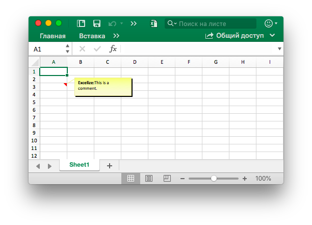

# клетка

RichTextRun напрямую отображает настройки прогона расширенного текста.

```go
type RichTextRun struct {
    Font *Font
    Text string
}
```

HyperlinkOpts можно передать в [`SetCellHyperlink`](cell.md#SetCellHyperlink) для установки дополнительных атрибутов гиперссылки (например, отображаемого текста и текста подсказки на экране).

```go
type HyperlinkOpts struct {
    Display *string
    Tooltip *string
}
```

FormulaOpts может быть передана [`SetCellFormula`](cell.md#SetCellFormula) для использования других типов формул.

```go
type FormulaOpts struct {
    Type *string // Тип формулы
    Ref  *string // Общие ссылки на формулы
}
```

## Установить значение ячейки {#SetCellValue}

```go
func (f *File) SetCellValue(sheet, axis string, value interface{}) error
```

SetCellValue предоставляет функцию для установки значения ячейки. Указанные координаты не должны быть в первом ряду таблицы. Ниже приведены поддерживаемые типы данных:

|Поддерживаемые типы данных|
|---|
|int|
|int8|
|int16|
|int32|
|int64|
|uint|
|uint8|
|uint16|
|uint32|
|uint64|
|float32|
|float64|
|string|
|[]byte|
|time.Duration|
|time.Time|
|bool|
|nil|

## Установить логическое значение {#SetCellBool}

```go
func (f *File) SetCellBool(sheet, axis string, value bool) error
```

SetCellBool предоставляет функцию для установки значения типа bool ячейки с помощью заданного имени листа, координат ячейки и значения ячейки.

## Установить значение RAW {#SetCellDefault}

```go
func (f *File) SetCellDefault(sheet, axis, value string) error
```

SetCellDefault предоставляет функцию для установки значения типа строки ячейки как формата по умолчанию, не выходя из ячейки.

## Установить целочисленное значение {#SetCellInt}

```go
func (f *File) SetCellInt(sheet, axis string, value int) error
```

SetCellInt предоставляет функцию для установки значения типа int ячейки с помощью заданного имени листа, координат ячейки и значения ячейки.

## Установить строковое значение {#SetCellStr}

```go
func (f *File) SetCellStr(sheet, axis, value string) error
```

SetCellStr предоставляет функцию для установки значения типа строки для ячейки. Общее количество символов, которое ячейка может содержать символы `32767`.

## Установить стиль ячейки {#SetCellStyle}

```go
func (f *File) SetCellStyle(sheet, hcell, vcell string, styleID int) error
```

SetCellStyle предоставляет функцию добавления атрибута стиля для ячеек по заданному имени рабочего листа, области координат и идентификатору стиля. Индексы стиля можно получить с помощью функции [`NewStyle`](style.md#NewStyle). Обратите внимание, что границы `diagonalDown` и `diagonalUp` должны использоваться одинаковым цветом в одной и той же координатной области. SetCellStyle перезапишет существующие стили для ячейки, он не будет добавлять или объединять стиль с существующими стилями.

- Пример 1, создайте границы ячейки `D7` на` Sheet1`:

```go
style, err := f.NewStyle(`{
    "border": [
    {
        "type": "left",
        "color": "0000FF",
        "style": 3
    },
    {
        "type": "top",
        "color": "00FF00",
        "style": 4
    },
    {
        "type": "bottom",
        "color": "FFFF00",
        "style": 5
    },
    {
        "type": "right",
        "color": "FF0000",
        "style": 6
    },
    {
        "type": "diagonalDown",
        "color": "A020F0",
        "style": 7
    },
    {
        "type": "diagonalUp",
        "color": "A020F0",
        "style": 8
    }]
}`)
if err != nil {
    fmt.Println(err)
}
err = f.SetCellStyle("Sheet1", "D7", "D7", style)
```


Четыре границы ячейки `D7` установлены с разными стилями и цветами. Это связано с параметрами при вызове функции [`NewStyle`](style.md#NewStyle). Вам нужно установить разные стили для ссылки на документацию для этой главы.

- Пример 2, установив стиль градиента для ячейки `D7` листа `Sheet1`:

```go
style, err := f.NewStyle(`{"fill":{"type":"gradient","color":["#FFFFFF","#E0EBF5"],"shading":1}}`)
if err != nil {
    fmt.Println(err)
}
err = f.SetCellStyle("Sheet1", "D7", "D7", style)
```


В ячейке `D7` задается цветовая заливка эффекта градиента. Эффект градиентной заливки связан с параметром при вызове функции [`NewStyle`](style.md#NewStyle). Вам нужно установить разные стили для ссылки на документацию этой главы.

- Пример 3, установите сплошную заливку для ячейки `D7` с именем `Sheet1`:

```go
style, err := f.NewStyle(`{"fill":{"type":"pattern","color":["#E0EBF5"],"pattern":1}}`)
if err != nil {
    fmt.Println(err)
}
err = f.SetCellStyle("Sheet1", "D7", "D7", style)
```


Ячейка `D7` установлена с заполнением.

- Пример 4, задайте расстояние между символами и угол поворота для ячейки `D7` с именем `Sheet1`:

```go
f.SetCellValue("Sheet1", "D7", "样式")
style, err := f.NewStyle(`{
    "alignment":
    {
        "horizontal": "center",
        "ident": 1,
        "justify_last_line": true,
        "reading_order": 0,
        "relative_indent": 1,
        "shrink_to_fit": true,
        "text_rotation": 45,
        "vertical": "",
        "wrap_text": true
    }
}`)
if err != nil {
    fmt.Println(err)
}
err = f.SetCellStyle("Sheet1", "D7", "D7", style)
```


- Пример 5, дата и время в Excel представлены действительными числами, например `2017/7/4  12:00:00 PM` могут быть представлены числом `42920.5`. Установите формат времени для ячейки таблицы `D7` с именем `Sheet1`:

```go
f.SetCellValue("Sheet1", "D7", 42920.5)
f.SetColWidth("Sheet1", "D", "D", 13)
style, err := f.NewStyle(`{"number_format": 22}`)
if err != nil {
    fmt.Println(err)
}
err = f.SetCellStyle("Sheet1", "D7", "D7", style)
```


В ячейке `D7` установлен формат времени. Обратите внимание, что когда ширина ячейки с применяемым временным форматом слишком узкая, чтобы ее можно было полностью отобразить, она будет отображаться как `####`, вы можете перетащить ширину столбца или установить столбец в соответствующий размер, вызвав `SetColWidth`, чтобы сделать его нормальным. дисплей.

- Пример 6, установив шрифт, размер шрифта, цвет и стиль перекоса для ячейки `D7` листа `Sheet1`:

```go
f.SetCellValue("Sheet1", "D7", "Excel")
style, err := f.NewStyle(`{
    "font":
    {
        "bold": true,
        "italic": true,
        "family": "Times New Roman",
        "size": 36,
        "color": "#777777"
    }
}`)
if err != nil {
    fmt.Println(err)
}
err = f.SetCellStyle("Sheet1", "D7", "D7", style)
```

<p align="center"></p>

- Пример 7, блокировка и скрытие ячейки `D7` с именем `Sheet1`:

```go
style, err := f.NewStyle(`{"protection":{"hidden":true, "locked":true}}`)
if err != nil {
    fmt.Println(err)
}
err = f.SetCellStyle("Sheet1", "D7", "D7", style)
```

Чтобы заблокировать ячейку или скрыть формулу, защитите рабочий лист. На вкладке «Обзор» нажмите «Защитить рабочий лист».

## Установить гиперссылку {#SetCellHyperLink}

```go
func (f *File) SetCellHyperLink(sheet, axis, link, linkType string) error
```

SetCellHyperLink предоставляет функцию для установки гиперссылки на ячейки с помощью заданного имени рабочего листа и URL-адреса URL-адреса. LinkType определяет два типа гиперссылки `External` для сайта или `Location` для перехода к одной из сот в этой книге. Максимальный лимит гиперссылок на листе составляет `65530`. Ниже приведен пример внешней ссылки.

- Пример 1, добавление внешней ссылки на ячейку `A3` на листе с именем `Sheet1`:

```go
err := f.SetCellHyperLink("Sheet1", "A3",
    "https://github.com/xuri/excelize", "External")
// Задайте стиль шрифта и подчеркивания для ячейки
style, err := f.NewStyle(`{"font":{"color":"#1265BE","underline":"single"}}`)
err = f.SetCellStyle("Sheet1", "A3", "A3", style)
```

- Пример 2: добавление внутренней ссылки на ячейку `A3` с именем `Sheet1`:

```go
err := f.SetCellHyperLink("Sheet1", "A3", "Sheet1!A40", "Location")
```

## Установить форматированный текст для ячейки {#SetCellRichText}

```go
func (f *File) SetCellRichText(sheet, cell string, runs []RichTextRun) error
```

SetCellRichText предоставляет функцию для установки ячейки с расширенным текстом по заданному рабочему листу.

Например, установите расширенный текст в ячейке `A1` листа с именем `Sheet1`:

<p align="center"></p>

```go
package main

import (
    "fmt"

    "github.com/xuri/excelize/v2"
)

func main() {
    f := excelize.NewFile()
    if err := f.SetRowHeight("Sheet1", 1, 35); err != nil {
        fmt.Println(err)
        return
    }
    if err := f.SetColWidth("Sheet1", "A", "A", 44); err != nil {
        fmt.Println(err)
        return
    }
    if err := f.SetCellRichText("Sheet1", "A1", []excelize.RichTextRun{
        {
            Text: "bold",
            Font: &excelize.Font{
                Bold:   true,
                Color:  "2354e8",
                Family: "Times New Roman",
            },
        },
        {
            Text: " and ",
            Font: &excelize.Font{
                Family: "Times New Roman",
            },
        },
        {
            Text: "italic",
            Font: &excelize.Font{
                Bold:   true,
                Color:  "e83723",
                Italic: true,
                Family: "Times New Roman",
            },
        },
        {
            Text: "text with color and font-family,",
            Font: &excelize.Font{
                Bold:   true,
                Color:  "2354e8",
                Family: "Times New Roman",
            },
        },
        {
            Text: "\r\nlarge text with ",
            Font: &excelize.Font{
                Size:  14,
                Color: "ad23e8",
            },
        },
        {
            Text: "strike",
            Font: &excelize.Font{
                Color:  "e89923",
                Strike: true,
            },
        },
        {
            Text: " and ",
            Font: &excelize.Font{
                Size:  14,
                Color: "ad23e8",
            },
        },
        {
            Text: "underline.",
            Font: &excelize.Font{
                Color:     "23e833",
                Underline: "single",
            },
        },
    }); err != nil {
        fmt.Println(err)
        return
    }
    style, err := f.NewStyle(&excelize.Style{
        Alignment: &excelize.Alignment{
            WrapText: true,
        },
    })
    if err != nil {
        fmt.Println(err)
        return
    }
    if err := f.SetCellStyle("Sheet1", "A1", "A1", style); err != nil {
        fmt.Println(err)
        return
    }
    if err := f.SaveAs("Book1.xlsx"); err != nil {
        fmt.Println(err)
    }
}
```

## Получить форматированный текст ячейки {#GetCellRichText}

```go
func (f *File) GetCellRichText(sheet, cell string) (runs []RichTextRun, err error)
```

GetCellRichText предоставляет функцию для получения форматированного текста ячеек по заданному листу.

## Получить значение ячейки {#GetCellValue}

```go
func (f *File) GetCellValue(sheet, axis string, opts ...Options) (string, error)
```

Значение ячейки извлекается в соответствии с данным рабочим листом и координатами ячейки, а возвращаемое значение преобразуется в тип `string`. Если формат ячейки можно применить к значению ячейки, прикладное значение будет возвращено, иначе исходное значение будет возвращено. Значения всех ячеек будут одинаковыми в объединенном диапазоне.

## Получить тип данных ячейки {#GetCellType}

```go
func (f *File) GetCellType(sheet, axis string) (CellType, error)
```

GetCellType предоставляет функцию для получения типа данных ячейки по заданному имени листа и оси в файле электронной таблицы.

## Получить все значения ячейки по столбцам {#GetCols}

```go
func (f *File) GetCols(sheet string, opts ...Options) ([][]string, error)
```

Получает значение всех ячеек по столбцам на рабочем листе на основе заданного имени рабочего листа (с учетом регистра), возвращаемого в виде двумерного массива, где значение ячейки преобразуется в тип `string`. Если формат ячейки можно применить к значению ячейки, будет использовано примененное значение, в противном случае будет использовано исходное значение.

Например, получить и пройти значение всех ячеек по столбцам на листе с именем `Sheet1`:

```go
cols, err := f.GetCols("Sheet1")
if err != nil {
    fmt.Println(err)
    return
}
for _, col := range cols {
    for _, rowCell := range col {
        fmt.Print(rowCell, "\t")
    }
    fmt.Println()
}
```

## Получить все значения ячеек по строкам {#GetRows}

```go
func (f *File) GetRows(sheet string, opts ...Options) ([][]string, error)
```

Получает значение всех ячеек по строкам на рабочем листе на основе заданного имени рабочего листа (с учетом регистра), возвращаемого в виде двумерного массива, где значение ячейки преобразуется в тип `string`. Если формат ячейки можно применить к значению ячейки, будет использовано примененное значение, в противном случае будет использовано исходное значение. GetRows извлекает строки со значениями или ячейками с формулой, хвостовая постоянно пустая ячейка будет пропущена.

Например, получить и пройти значение всех ячеек по строкам на листе с именем `Sheet1`:

```go
rows, err := f.GetRows("Sheet1")
if err != nil {
    fmt.Println(err)
    return
}
for _, row := range rows {
    for _, colCell := range row {
        fmt.Print(colCell, "\t")
    }
    fmt.Println()
}
if err = rows.Close(); err != nil {
    fmt.Println(err)
}
```

## Получить гиперссылку {#GetCellHyperLink}

```go
func (f *File) GetCellHyperLink(sheet, axis string) (bool, string, error)
```

Получает гиперссылку на ячейку на основе заданного имени листа (с учетом регистра) и координат ячейки. Если ячейка имеет гиперссылку, она вернет `true` и адрес ссылки, иначе он вернет `false` и пустой адрес ссылки.

Например, получите гиперссылку на ячейку `H6` на листе с именем `Sheet1`:

```go
link, target, err := f.GetCellHyperLink("Sheet1", "H6")
```

## Получить индекс стиля {#GetCellStyle}

```go
func (f *File) GetCellStyle(sheet, axis string) (int, error)
```

Индекс стиля ячейки получается из заданного имени листа (с учетом регистра) и координат ячейки, а полученный индекс может использоваться как параметр для вызова функции `SetCellValue` при копировании стиля ячейки.

## Объединить ячейки {#MergeCell}

```go
func (f *File) MergeCell(sheet, hcell, vcell string) error
```

Объединить ячейки на основе заданного имени листа (с учетом регистра) и областей координат ячейки. При объединении ячеек сохраняется только значение верхней левой ячейки, а остальные значения отбрасываются. Например, слияние ячеек в области `D3:E9` на листе с именем `Sheet1`:

```go
err := f.MergeCell("Sheet1", "D3", "E9")
```

Если заданная координатная область ячейки перекрывается с другими существующими объединенными ячейками, существующие объединенные ячейки будут удалены.

## Отменить объединение ячеек {#UnmergeCell}

```go
func (f *File) UnmergeCell(sheet string, hcell, vcell string) error
```

UnmergeCell предоставляет функцию для объединения заданной координатной области. Например, удалите область `D3:E9` на `Sheet1`:

```go
err := f.UnmergeCell("Sheet1", "D3", "E9")
```

Внимание: перекрывающиеся области также не будут объединены.

## Получить ячейки слияния {#GetMergeCells}

GetMergeCells предоставляет функцию для получения всех объединенных ячеек из рабочего листа.

```go
func (f *File) GetMergeCells(sheet string) ([]MergeCell, error)
```

## Добавить комментарий {#AddComment}

```go
func (f *File) AddComment(sheet, cell, format string) error
```

AddComment предоставляет метод добавления комментариев в листе с помощью заданного индекса, набора ячеек и формата (например, автора и текста). Обратите внимание, что максимальная длина автора равна 255, а максимальная длина текста - 32512. Например, добавьте комментарий в `Sheet1!$A$3`:



```go
err := f.AddComment("Sheet1", "A3", `{"author":"Excelize: ","text":"This is a comment."}`)
```

## Получить комментари {#GetComments}

```go
func (f *File) GetComments() (comments map[string][]Comment)
```

GetComments извлекает все комментарии и возвращает карту имени рабочего листа в комментарии рабочего листа.

## Установить формулу ячейки {#SetCellFormula}

```go
func (f *File) SetCellFormula(sheet, axis, formula string, opts ...FormulaOpts) error
```

Формула на ячейке берется согласно заданному имени листа (с учетом регистра) и настройкам формулы ячейки. Результат ячейки формулы может быть рассчитан, когда лист открыт приложением Office Excel или может использовать функцию [CalcCellValue](cell.md#CalcCellValue) также может получить рассчитанное значение ячейки. Если приложение Excel не вычисляет формулу автоматически при открытии книги, вызовите [UpdateLinkedValue](utils.md#UpdateLinkedValue) после установки функций формулы ячейки.

- Пример 1, установите обычную формулу  `=SUM(A1,B1)` для ячейки `A3` на `Sheet1`:

```go
err := f.SetCellFormula("Sheet1", "A3", "=SUM(A1,B1)")
```

- Пример 2, установить одномерный вертикальный постоянный массив (массив строк) формулой `1,2,3` для ячейки `A3` на `Sheet1`:

```go
err := f.SetCellFormula("Sheet1", "A3", "={1,2,3}")
```

- Пример 3, установить одномерный горизонтальный массив констант (массив столбцов) формулой `"a","b","c"` для ячейки `A3` на `Sheet1`:

```go
err := f.SetCellFormula("Sheet1", "A3", "={\"a\",\"b\",\"c\"}")
```

- Пример 4, установить двумерную формулу массива констант `{1,2,"a","b"}` для ячейки `A3` на `Sheet1`:

```go
formulaType, ref := excelize.STCellFormulaTypeArray, "A3:A3"
err := f.SetCellFormula("Sheet1", "A3", "={1,2,\"a\",\"b\"}",
    excelize.FormulaOpts{Ref: &ref, Type: &formulaType})
```

- Пример 5, установить формулу массива диапазонов `A1:A2` для ячейки `A3` на `Sheet1`:

```go
formulaType, ref := excelize.STCellFormulaTypeArray, "A3:A3"
err := f.SetCellFormula("Sheet1", "A3", "=A1:A2",
    excelize.FormulaOpts{Ref: &ref, Type: &formulaType})
```

- Пример 6, установить общую формулу `=A1+B1` для ячеек `C1:C5` на `Sheet1`, `C1` - это основная ячейка:

```go
formulaType, ref := excelize.STCellFormulaTypeShared, "C1:C5"
err := f.SetCellFormula("Sheet1", "C1", "=A1+B1",
    excelize.FormulaOpts{Ref: &ref, Type: &formulaType})
```

- Пример 7, установить формулу таблицы `=SUM(Table1[[A]:[B]])` для ячейки `C2` на `Sheet1`:

```go
package main

import (
    "fmt"

    "github.com/xuri/excelize/v2"
)

func main() {
    f := excelize.NewFile()
    for idx, row := range [][]interface{}{{"A", "B", "C"}, {1, 2}} {
        if err := f.SetSheetRow("Sheet1", fmt.Sprintf("A%d", idx+1), &row); err != nil {
            fmt.Println(err)
            return
        }
    }
    if err := f.AddTable("Sheet1", "A1", "C2",
        `{"table_name":"Table1","table_style":"TableStyleMedium2"}`); err != nil {
        fmt.Println(err)
        return
    }
    formulaType := excelize.STCellFormulaTypeDataTable
    if err := f.SetCellFormula("Sheet1", "C2", "=SUM(Table1[[A]:[B]])",
        excelize.FormulaOpts{Type: &formulaType}); err != nil {
        fmt.Println(err)
        return
    }
    if err := f.SaveAs("Book1.xlsx"); err != nil {
        fmt.Println(err)
    }
}
```

## Получить формулу ячейки {#GetCellFormula}

```go
func (f *File) GetCellFormula(sheet, axis string) (string, error)
```

Получите формулу в ячейке на основе заданного имени листа (с учетом регистра) и координат ячейки.

## Рассчитать значение ячейки {#CalcCellValue}

```go
func (f *File) CalcCellValue(sheet, cell string) (result string, err error)
```

CalcCellValue предоставляет функцию для получения вычисленного значения ячейки. Эта функция в настоящее время находится в рабочей обработке. Формула массива, формула таблицы и некоторые другие формулы в настоящее время не поддерживаются.

Поддерживаемые формулы:

```text
ABS
ACOS
ACOSH
ACOT
ACOTH
AND
ARABIC
ASIN
ASINH
ATAN
ATAN2
ATANH
AVERAGE
AVERAGEA
BASE
BESSELI
BESSELJ
BESSELK
BESSELY
BIN2DEC
BIN2HEX
BIN2OCT
BITAND
BITLSHIFT
BITOR
BITRSHIFT
BITXOR
CEILING
CEILING.MATH
CEILING.PRECISE
CHAR
CHOOSE
CLEAN
CODE
COLUMN
COLUMNS
COMBIN
COMBINA
COMPLEX
CONCAT
CONCATENATE
COS
COSH
COT
COTH
COUNT
COUNTA
COUNTBLANK
CSC
CSCH
CUMIPMT
CUMPRINC
DATE
DATEDIF
DATEVALUE
DAY
DB
DDB
DEC2BIN
DEC2HEX
DEC2OCT
DECIMAL
DEGREES
DOLLARDE
DOLLARFR
EFFECT
ENCODEURL
EVEN
EXACT
EXP
FACT
FACTDOUBLE
FALSE
FIND
FINDB
FISHER
FISHERINV
FIXED
FLOOR
FLOOR.MATH
FLOOR.PRECISE
FV
FVSCHEDULE
GAMMA
GAMMALN
GCD
HARMEAN
HEX2BIN
HEX2DEC
HEX2OCT
HLOOKUP
IF
IFERROR
IMABS
IMAGINARY
IMARGUMENT
IMCONJUGATE
IMCOS
IMCOSH
IMCOT
IMCSC
IMCSCH
IMDIV
IMEXP
IMLN
IMLOG10
IMLOG2
IMPOWER
IMPRODUCT
IMREAL
IMSEC
IMSECH
IMSIN
IMSINH
IMSQRT
IMSUB
IMSUM
IMTAN
INT
IPMT
IRR
ISBLANK
ISERR
ISERROR
ISEVEN
ISNA
ISNONTEXT
ISNUMBER
ISODD
ISTEXT
ISO.CEILING
ISPMT
KURT
LARGE
LCM
LEFT
LEFTB
LEN
LENB
LN
LOG
LOG10
LOOKUP
LOWER
MATCH
MAX
MDETERM
MEDIAN
MID
MIDB
MIN
MINA
MIRR
MOD
MONTH
MROUND
MULTINOMIAL
MUNIT
N
NA
NOMINAL
NORM.DIST
NORMDIST
NORM.INV
NORMINV
NORM.S.DIST
NORMSDIST
NORM.S.INV
NORMSINV
NOT
NOW
NPER
NPV
OCT2BIN
OCT2DEC
OCT2HEX
ODD
OR
PDURATION
PERCENTILE.INC
PERCENTILE
PERMUT
PERMUTATIONA
PI
PMT
POISSON.DIST
POISSON
POWER
PPMT
PRODUCT
PROPER
QUARTILE
QUARTILE.INC
QUOTIENT
RADIANS
RAND
RANDBETWEEN
REPLACE
REPLACEB
REPT
RIGHT
RIGHTB
ROMAN
ROUND
ROUNDDOWN
ROUNDUP
ROW
ROWS
SEC
SECH
SHEET
SIGN
SIN
SINH
SKEW
SMALL
SQRT
SQRTPI
STDEV
STDEV.S
STDEVA
SUBSTITUTE
SUM
SUMIF
SUMSQ
T
TAN
TANH
TODAY
TRIM
TRUE
TRUNC
UNICHAR
UNICODE
UPPER
VAR.P
VARP
VLOOKUP
WEIBULL
WEIBULL.DIST
XOR
YEAR
Z.TEST
ZTEST
```
