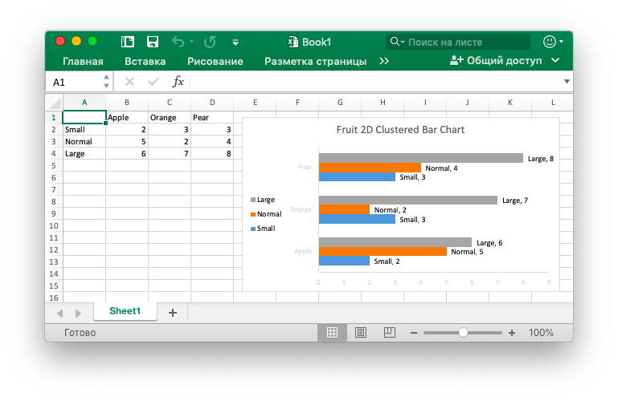
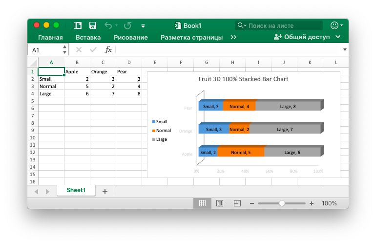
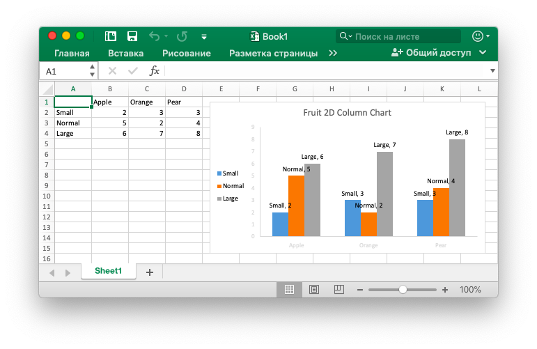
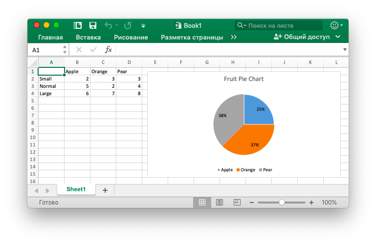
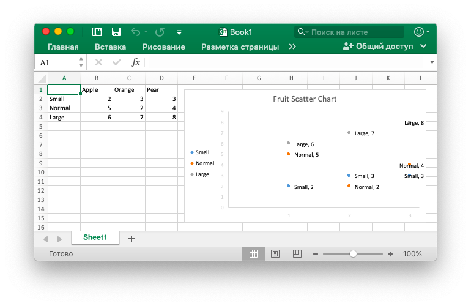

# Диаграмма

## Добавить диаграмму

```go
func (f *File) AddChart(sheet, cell, format string) error
```

AddChart предоставляет метод добавления диаграммы на листе с помощью заданного набора формата диаграммы (например, смещение, масштаб, настройка соотношения сторон и параметры печати) и набор свойств.

Ниже показано `type` диаграммы, поддерживаемый excelize:

Тип|Диаграмма
---|---
area                 | 2D диаграмма области
areaStacked          | 2D диаграмма области с накоплением
areaPercentStacked   | 2D 100% диаграмма области с накоплением
area3D               | 3D диаграмма области
area3DStacked        | 3D диаграмма области с накоплением
area3DPercentStacked | 3D 100% диаграмма области с накоплением
bar                  | 2D кластерная гистограмма
barStacked           | 2D Двухстрочная гистограмма
barPercentStacked    | 2D 100% сложная гистограмма
bar3DClustered       | 3D кластерная гистограмма
bar3DStacked         | 3D гистограмма
bar3DPercentStacked  | 3D 100% сложная гистограмма
col                  | 2D группированная диаграмма столбцов
colStacked           | 2D сложены диаграммы колонки
colPercentStacked    | 2D 100% сложены диаграммы колонки
col3DClustered       | 3D группированная диаграмма столбцов
col3D                | 3D диаграмма столбца
col3DStacked         | 3D сложены диаграммы колонки
col3DPercentStacked  | 3D 100% сложены диаграммы колонки
doughnut             | диаграмма пончика
line                 | линейный график
pie                  | круговая диаграмма
pie3D                | 3D круговая диаграмма
radar                | радиолокационная карта
scatter              | Точечная диаграмма

В области данных диаграммы Office Excel `series` определяет набор информации, для которой данные рисовать, легенда пункт (серии), и горизонтальной (категория) метки оси.

Параметры `series`, которые могут быть установлены:

Параметр|Объяснение
---|---
name|Элемент легенды (серия), отображаемый в легенде диаграммы и в строке формул. Параметр `name` является необязательным. Если вы не укажете это значение, по умолчанию будет `Series 1 .. n`. `name` для представления формул, например: `Sheet1!$A$1`.
categories|Горизонтальная (категория) метка оси. Параметр `categories` является необязательным в большинстве типов диаграмм, по умолчанию это непрерывная последовательность формы `1..n`.
values|Область данных диаграммы, которая является наиболее важным параметром в `series`, является единственным обязательным параметром при создании диаграммы. Этот параметр связывает диаграмму с отображаемыми данными листа.

Задайте свойства легенды диаграммы. Возможные параметры:

Параметр|Тип|Объяснение
---|---|---
position|string|Позиция легенды диаграммы
show_legend_key|bool|Показывать легенду, но не перекрывать диаграмму

Установите `position` легенды диаграммы. Положение легенды по умолчанию является `right`. Доступные позиции:

Параметр|Объяснение
---|---
top|верх
bottom|дно
left|оставил
right|правильно
top_right|в правом верхнем углу

Параметр `show_legend_key`, задающий ключи легенды, должен отображаться в метках данных. Значение по умолчанию равно `false`.

Название диаграммы задается путем выбора параметра `name` объекта` title`, и заголовок будет отображаться над диаграммой. Параметр `name` поддерживает использование представлений формул, таких как` Sheet1!$A$1`, если вы не укажете заголовок значка, значение по умолчанию равно null.

Параметр `show_blanks_as` предоставляет настройку «Скрыть и пустые ячейки». Значение по умолчанию: `gap` т.е. «пустая ячейка отображается как»: «пространство». Ниже приведены необязательные значения для этого параметра:

Параметр|Объяснение
---|---
gap|пространство
span|Соединить точки данных с прямыми линиями
zero|нулевое значение

The parameter `format` provides settings for parameters such as chart offset, scale, aspect ratio settings, and print properties, as well as those used in the [`AddPicture()`](image.md#AddPicture) function.

Параметр `format` предоставляет параметры для таких параметров, как смещение графика, масштаб, параметры соотношения сторон и свойства печати, а также те, которые используются в функции [`AddPicture()`](image.md#AddPicture).

Задайте положение области графика по площади участка. Свойства, которые могут быть установлены:

Параметр|Тип|По умолчанию|Объяснение
---|---|---|---
show_bubble_size|bool|`false`|Указывает, что размер пузырька должен быть указан на метке данных.
show_cat_name|bool|`true`|Название категории
show_leader_lines|bool|`false`|Указывает, что имя категории должно отображаться на метке данных.
show_percent|bool|`false`|Указывает, что процент отображается в метке данных.
show_series_name|bool|`false`|Указывает, что имя серии должно отображаться в метке данных.
show_val|bool|`false`|Указывает, что значение должно отображаться на метке данных.

Задайте основные параметры горизонтальной и вертикальной оси с помощью `x_axis` и `y_axis`. Свойства, которые могут быть установлены:

Параметр|Тип|По умолчанию|Объяснение
---|---|---|---
reverse_order|bool|`false`|Указывает, что категории или значения в обратном порядке (ориентация диаграммы). Свойство `reverse_order` является необязательным.
maximum|int|`0`|Указывает, что фиксированный максимум 0 автоматически. Максимальное свойство необязательно.
minimum|int|`0`|Указывает, что фиксированный минимум 0 является авто. Минимальное свойство необязательно. Значение по умолчанию автоматически.

Установите размер диаграммы по свойству `dimension`. Свойство измерения необязательно. Свойства, которые могут быть установлены:

Параметр|Тип|По умолчанию|Объяснение
---|---|---|---
height|int|290|Высота
width|int|480|Ширина

### 2D диаграмма области {#area}

Например, добавьте диаграмму, подобную этой:


```go
package main

import (
    "fmt"

    "github.com/360EntSecGroup-Skylar/excelize"
)

func main() {
    categories := map[string]string{"A2": "Small", "A3": "Normal", "A4": "Large", "B1": "Apple", "C1": "Orange", "D1": "Pear"}
    values := map[string]int{"B2": 7, "C2": 7, "D2": 8, "B3": 5, "C3": 4, "D3": 4, "B4": 2, "C4": 3, "D4": 3}
    xlsx := excelize.NewFile()
    for k, v := range categories {
        xlsx.SetCellValue("Sheet1", k, v)
    }
    for k, v := range values {
        xlsx.SetCellValue("Sheet1", k, v)
    }
    err := xlsx.AddChart("Sheet1", "E1", `{"type":"area","series":[{"name":"Sheet1!$A$2","categories":"","values":"Sheet1!$B$2:$D$2"},{"name":"Sheet1!$A$3","categories":"Sheet1!$B$1:$D$1","values":"Sheet1!$B$3:$D$3"},{"name":"Sheet1!$A$4","categories":"Sheet1!$B$1:$D$1","values":"Sheet1!$B$4:$D$4"}],"format":{"x_scale":1.0,"y_scale":1.0,"x_offset":15,"y_offset":10,"print_obj":true,"lock_aspect_ratio":false,"locked":false},"legend":{"position":"bottom","show_legend_key":false},"title":{"name":"Fruit 2D Area Chart"},"plotarea":{"show_bubble_size":true,"show_cat_name":false,"show_leader_lines":false,"show_percent":true,"show_series_name":true,"show_val":true},"show_blanks_as":"zero"}`)
    if err != nil {
        fmt.Println(err)
    }
    // Сохранить workbook
    err = xlsx.SaveAs("./Book1.xlsx")
    if err != nil {
        fmt.Println(err)
    }
}
```

### 2D диаграмма области с накоплением {#areaStacked}

### 2D 100% диаграмма области с накоплением {#areaPercentStacked}

### 3D диаграмма области {#area3D}

Например, добавьте диаграмму, подобную этой:


```go
package main

import (
    "fmt"

    "github.com/360EntSecGroup-Skylar/excelize"
)

func main() {
    categories := map[string]string{"A2": "Small", "A3": "Normal", "A4": "Large", "B1": "Apple", "C1": "Orange", "D1": "Pear"}
    values := map[string]int{"B2": 7, "C2": 7, "D2": 8, "B3": 5, "C3": 4, "D3": 4, "B4": 2, "C4": 3, "D4": 3}
    xlsx := excelize.NewFile()
    for k, v := range categories {
        xlsx.SetCellValue("Sheet1", k, v)
    }
    for k, v := range values {
        xlsx.SetCellValue("Sheet1", k, v)
    }
    err := xlsx.AddChart("Sheet1", "E1", `{"type":"area3D","series":[{"name":"Sheet1!$A$2","categories":"","values":"Sheet1!$B$2:$D$2"},{"name":"Sheet1!$A$3","categories":"Sheet1!$B$1:$D$1","values":"Sheet1!$B$3:$D$3"},{"name":"Sheet1!$A$4","categories":"Sheet1!$B$1:$D$1","values":"Sheet1!$B$4:$D$4"}],"format":{"x_scale":1.0,"y_scale":1.0,"x_offset":15,"y_offset":10,"print_obj":true,"lock_aspect_ratio":false,"locked":false},"legend":{"position":"bottom","show_legend_key":false},"title":{"name":"Fruit 3D Area Chart"},"plotarea":{"show_bubble_size":true,"show_cat_name":false,"show_leader_lines":false,"show_percent":true,"show_series_name":true,"show_val":true},"show_blanks_as":"zero"}`)
    if err != nil {
        fmt.Println(err)
    }
    // Сохранить workbook
    err = xlsx.SaveAs("./Book1.xlsx")
    if err != nil {
        fmt.Println(err)
    }
}
```

### 3D диаграмма области с накоплением {#area3DStacked}

### 3D 100% диаграмма области с накоплением {#area3DPercentStacked}

### 2D кластерная гистограмма {#bar}

Например, добавьте диаграмму, подобную этой:



```go
package main

import (
    "fmt"

    "github.com/360EntSecGroup-Skylar/excelize"
)

func main() {
    categories := map[string]string{"A2": "Small", "A3": "Normal", "A4": "Large", "B1": "Apple", "C1": "Orange", "D1": "Pear"}
    values := map[string]int{"B2": 2, "C2": 3, "D2": 3, "B3": 5, "C3": 2, "D3": 4, "B4": 6, "C4": 7, "D4": 8}
    xlsx := excelize.NewFile()
    for k, v := range categories {
        xlsx.SetCellValue("Sheet1", k, v)
    }
    for k, v := range values {
        xlsx.SetCellValue("Sheet1", k, v)
    }
    err := xlsx.AddChart("Sheet1", "E1", `{"type":"bar","series":[{"name":"Sheet1!$A$2","categories":"","values":"Sheet1!$B$2:$D$2"},{"name":"Sheet1!$A$3","categories":"Sheet1!$B$1:$D$1","values":"Sheet1!$B$3:$D$3"},{"name":"Sheet1!$A$4","categories":"Sheet1!$B$1:$D$1","values":"Sheet1!$B$4:$D$4"}],"format":{"x_scale":1.0,"y_scale":1.0,"x_offset":15,"y_offset":10,"print_obj":true,"lock_aspect_ratio":false,"locked":false},"legend":{"position":"left","show_legend_key":false},"title":{"name":"Fruit 2D Clustered Bar Chart"},"plotarea":{"show_bubble_size":true,"show_cat_name":false,"show_leader_lines":false,"show_percent":true,"show_series_name":true,"show_val":true},"show_blanks_as":"zero"}`)
    if err != nil {
        fmt.Println(err)
    }
    // Сохранить workbook
    err = xlsx.SaveAs("./Book1.xlsx")
    if err != nil {
        fmt.Println(err)
    }
}
```

### 2D Двухстрочная гистограмма {#barStacked}

Например, добавьте диаграмму, подобную этой:


```go
package main

import (
    "fmt"

    "github.com/360EntSecGroup-Skylar/excelize"
)

func main() {
    categories := map[string]string{"A2": "Small", "A3": "Normal", "A4": "Large", "B1": "Apple", "C1": "Orange", "D1": "Pear"}
    values := map[string]int{"B2": 2, "C2": 3, "D2": 3, "B3": 5, "C3": 2, "D3": 4, "B4": 6, "C4": 7, "D4": 8}
    xlsx := excelize.NewFile()
    for k, v := range categories {
        xlsx.SetCellValue("Sheet1", k, v)
    }
    for k, v := range values {
        xlsx.SetCellValue("Sheet1", k, v)
    }
    err := xlsx.AddChart("Sheet1", "E1", `{"type":"barStacked","series":[{"name":"Sheet1!$A$2","categories":"","values":"Sheet1!$B$2:$D$2"},{"name":"Sheet1!$A$3","categories":"Sheet1!$B$1:$D$1","values":"Sheet1!$B$3:$D$3"},{"name":"Sheet1!$A$4","categories":"Sheet1!$B$1:$D$1","values":"Sheet1!$B$4:$D$4"}],"format":{"x_scale":1.0,"y_scale":1.0,"x_offset":15,"y_offset":10,"print_obj":true,"lock_aspect_ratio":false,"locked":false},"legend":{"position":"left","show_legend_key":false},"title":{"name":"Fruit 2D Stacked Bar Chart"},"plotarea":{"show_bubble_size":true,"show_cat_name":false,"show_leader_lines":false,"show_percent":true,"show_series_name":true,"show_val":true},"show_blanks_as":"zero"}`)
    if err != nil {
        fmt.Println(err)
    }
    // Сохранить workbook
    err = xlsx.SaveAs("./Book1.xlsx")
    if err != nil {
        fmt.Println(err)
    }
}
```

### 2D 100% сложная гистограмма {#barPercentStacked}

Например, добавьте диаграмму, подобную этой:


```go
package main

import (
    "fmt"

    "github.com/360EntSecGroup-Skylar/excelize"
)

func main() {
    categories := map[string]string{"A2": "Small", "A3": "Normal", "A4": "Large", "B1": "Apple", "C1": "Orange", "D1": "Pear"}
    values := map[string]int{"B2": 2, "C2": 3, "D2": 3, "B3": 5, "C3": 2, "D3": 4, "B4": 6, "C4": 7, "D4": 8}
    xlsx := excelize.NewFile()
    for k, v := range categories {
        xlsx.SetCellValue("Sheet1", k, v)
    }
    for k, v := range values {
        xlsx.SetCellValue("Sheet1", k, v)
    }
    err := xlsx.AddChart("Sheet1", "E1", `{"type":"barPercentStacked","series":[{"name":"Sheet1!$A$2","categories":"","values":"Sheet1!$B$2:$D$2"},{"name":"Sheet1!$A$3","categories":"Sheet1!$B$1:$D$1","values":"Sheet1!$B$3:$D$3"},{"name":"Sheet1!$A$4","categories":"Sheet1!$B$1:$D$1","values":"Sheet1!$B$4:$D$4"}],"format":{"x_scale":1.0,"y_scale":1.0,"x_offset":15,"y_offset":10,"print_obj":true,"lock_aspect_ratio":false,"locked":false},"legend":{"position":"left","show_legend_key":false},"title":{"name":"Fruit 2D Stacked 100% Bar Chart"},"plotarea":{"show_bubble_size":true,"show_cat_name":false,"show_leader_lines":false,"show_percent":true,"show_series_name":true,"show_val":true},"show_blanks_as":"zero"}`)
    if err != nil {
        fmt.Println(err)
    }
    // Сохранить workbook
    err = xlsx.SaveAs("./Book1.xlsx")
    if err != nil {
        fmt.Println(err)
    }
}
```

### 3D кластерная гистограмма {#bar3DClustered}

Например, добавьте диаграмму, подобную этой:


```go
package main

import (
    "fmt"

    "github.com/360EntSecGroup-Skylar/excelize"
)

func main() {
    categories := map[string]string{"A2": "Small", "A3": "Normal", "A4": "Large", "B1": "Apple", "C1": "Orange", "D1": "Pear"}
    values := map[string]int{"B2": 2, "C2": 3, "D2": 3, "B3": 5, "C3": 2, "D3": 4, "B4": 6, "C4": 7, "D4": 8}
    xlsx := excelize.NewFile()
    for k, v := range categories {
        xlsx.SetCellValue("Sheet1", k, v)
    }
    for k, v := range values {
        xlsx.SetCellValue("Sheet1", k, v)
    }
    err := xlsx.AddChart("Sheet1", "E1", `{"type":"bar3DClustered","series":[{"name":"Sheet1!$A$2","categories":"","values":"Sheet1!$B$2:$D$2"},{"name":"Sheet1!$A$3","categories":"Sheet1!$B$1:$D$1","values":"Sheet1!$B$3:$D$3"},{"name":"Sheet1!$A$4","categories":"Sheet1!$B$1:$D$1","values":"Sheet1!$B$4:$D$4"}],"format":{"x_scale":1.0,"y_scale":1.0,"x_offset":15,"y_offset":10,"print_obj":true,"lock_aspect_ratio":false,"locked":false},"legend":{"position":"left","show_legend_key":false},"title":{"name":"Fruit 3D Clustered Bar Chart"},"plotarea":{"show_bubble_size":true,"show_cat_name":false,"show_leader_lines":false,"show_percent":true,"show_series_name":true,"show_val":true},"show_blanks_as":"zero"}`)
    if err != nil {
        fmt.Println(err)
    }
    // Сохранить workbook
    err = xlsx.SaveAs("./Book1.xlsx")
    if err != nil {
        fmt.Println(err)
    }
}
```

### 3D гистограмма {#bar3DStacked}

Например, добавьте диаграмму, подобную этой:


```go
package main

import (
    "fmt"

    "github.com/360EntSecGroup-Skylar/excelize"
)

func main() {
    categories := map[string]string{"A2": "Small", "A3": "Normal", "A4": "Large", "B1": "Apple", "C1": "Orange", "D1": "Pear"}
    values := map[string]int{"B2": 2, "C2": 3, "D2": 3, "B3": 5, "C3": 2, "D3": 4, "B4": 6, "C4": 7, "D4": 8}
    xlsx := excelize.NewFile()
    for k, v := range categories {
        xlsx.SetCellValue("Sheet1", k, v)
    }
    for k, v := range values {
        xlsx.SetCellValue("Sheet1", k, v)
    }
    err := xlsx.AddChart("Sheet1", "E1", `{"type":"bar3DStacked","series":[{"name":"Sheet1!$A$2","categories":"","values":"Sheet1!$B$2:$D$2"},{"name":"Sheet1!$A$3","categories":"Sheet1!$B$1:$D$1","values":"Sheet1!$B$3:$D$3"},{"name":"Sheet1!$A$4","categories":"Sheet1!$B$1:$D$1","values":"Sheet1!$B$4:$D$4"}],"format":{"x_scale":1.0,"y_scale":1.0,"x_offset":15,"y_offset":10,"print_obj":true,"lock_aspect_ratio":false,"locked":false},"legend":{"position":"left","show_legend_key":false},"title":{"name":"Fruit 3D Stacked Bar Chart"},"plotarea":{"show_bubble_size":true,"show_cat_name":false,"show_leader_lines":false,"show_percent":true,"show_series_name":true,"show_val":true},"show_blanks_as":"zero"}`)
    if err != nil {
        fmt.Println(err)
    }
    // Сохранить workbook
    err = xlsx.SaveAs("./Book1.xlsx")
    if err != nil {
        fmt.Println(err)
    }
}
```

### 3D 100% сложная гистограмма {#bar3DPercentStacked}

Например, добавьте диаграмму, подобную этой:



```go
package main

import (
    "fmt"

    "github.com/360EntSecGroup-Skylar/excelize"
)

func main() {
    categories := map[string]string{"A2": "Small", "A3": "Normal", "A4": "Large", "B1": "Apple", "C1": "Orange", "D1": "Pear"}
    values := map[string]int{"B2": 2, "C2": 3, "D2": 3, "B3": 5, "C3": 2, "D3": 4, "B4": 6, "C4": 7, "D4": 8}
    xlsx := excelize.NewFile()
    for k, v := range categories {
        xlsx.SetCellValue("Sheet1", k, v)
    }
    for k, v := range values {
        xlsx.SetCellValue("Sheet1", k, v)
    }
    err := xlsx.AddChart("Sheet1", "E1", `{"type":"bar3DPercentStacked","series":[{"name":"Sheet1!$A$2","categories":"","values":"Sheet1!$B$2:$D$2"},{"name":"Sheet1!$A$3","categories":"Sheet1!$B$1:$D$1","values":"Sheet1!$B$3:$D$3"},{"name":"Sheet1!$A$4","categories":"Sheet1!$B$1:$D$1","values":"Sheet1!$B$4:$D$4"}],"format":{"x_scale":1.0,"y_scale":1.0,"x_offset":15,"y_offset":10,"print_obj":true,"lock_aspect_ratio":false,"locked":false},"legend":{"position":"left","show_legend_key":false},"title":{"name":"Fruit 3D 100% Stacked Bar Chart"},"plotarea":{"show_bubble_size":true,"show_cat_name":false,"show_leader_lines":false,"show_percent":true,"show_series_name":true,"show_val":true},"show_blanks_as":"zero"}`)
    if err != nil {
        fmt.Println(err)
    }
    // Сохранить workbook
    err = xlsx.SaveAs("./Book1.xlsx")
    if err != nil {
        fmt.Println(err)
    }
}
```

### 2D группированная диаграмма столбцов {#col}

Например, добавьте диаграмму, подобную этой:



```go
package main

import (
    "fmt"

    "github.com/360EntSecGroup-Skylar/excelize"
)

func main() {
    categories := map[string]string{"A2": "Small", "A3": "Normal", "A4": "Large", "B1": "Apple", "C1": "Orange", "D1": "Pear"}
    values := map[string]int{"B2": 2, "C2": 3, "D2": 3, "B3": 5, "C3": 2, "D3": 4, "B4": 6, "C4": 7, "D4": 8}
    xlsx := excelize.NewFile()
    for k, v := range categories {
        xlsx.SetCellValue("Sheet1", k, v)
    }
    for k, v := range values {
        xlsx.SetCellValue("Sheet1", k, v)
    }
    err := xlsx.AddChart("Sheet1", "E1", `{"type":"col","series":[{"name":"Sheet1!$A$2","categories":"","values":"Sheet1!$B$2:$D$2"},{"name":"Sheet1!$A$3","categories":"Sheet1!$B$1:$D$1","values":"Sheet1!$B$3:$D$3"},{"name":"Sheet1!$A$4","categories":"Sheet1!$B$1:$D$1","values":"Sheet1!$B$4:$D$4"}],"format":{"x_scale":1.0,"y_scale":1.0,"x_offset":15,"y_offset":10,"print_obj":true,"lock_aspect_ratio":false,"locked":false},"legend":{"position":"left","show_legend_key":false},"title":{"name":"Fruit 2D Column Chart"},"plotarea":{"show_bubble_size":true,"show_cat_name":false,"show_leader_lines":false,"show_percent":true,"show_series_name":true,"show_val":true},"show_blanks_as":"zero"}`)
    if err != nil {
        fmt.Println(err)
    }
    // Сохранить workbook
    err = xlsx.SaveAs("./Book1.xlsx")
    if err != nil {
        fmt.Println(err)
    }
}
```

### 2D сложены диаграммы колонки {#colStacked}

### 2D 100% сложены диаграммы колонки {#colPercentStacked}

### 3D группированная диаграмма столбцов {#col3DClustered}

Например, добавьте диаграмму, подобную этой:


```go
package main

import (
    "fmt"

    "github.com/360EntSecGroup-Skylar/excelize"
)

func main() {
    categories := map[string]string{"A2": "Small", "A3": "Normal", "A4": "Large", "B1": "Apple", "C1": "Orange", "D1": "Pear"}
    values := map[string]int{"B2": 2, "C2": 3, "D2": 3, "B3": 5, "C3": 2, "D3": 4, "B4": 6, "C4": 7, "D4": 8}
    xlsx := excelize.NewFile()
    for k, v := range categories {
        xlsx.SetCellValue("Sheet1", k, v)
    }
    for k, v := range values {
        xlsx.SetCellValue("Sheet1", k, v)
    }
    err := xlsx.AddChart("Sheet1", "E1", `{"type":"col3DClustered","series":[{"name":"Sheet1!$A$2","categories":"Sheet1!$B$1:$D$1","values":"Sheet1!$B$2:$D$2"},{"name":"Sheet1!$A$3","categories":"Sheet1!$B$1:$D$1","values":"Sheet1!$B$3:$D$3"},{"name":"Sheet1!$A$4","categories":"Sheet1!$B$1:$D$1","values":"Sheet1!$B$4:$D$4"}],"format":{"x_scale":1.0,"y_scale":1.0,"x_offset":15,"y_offset":10,"print_obj":true,"lock_aspect_ratio":false,"locked":false},"legend":{"position":"bottom","show_legend_key":false},"title":{"name":"Fruit 3D Clustered Column Chart"},"plotarea":{"show_bubble_size":true,"show_cat_name":false,"show_leader_lines":false,"show_percent":true,"show_series_name":true,"show_val":true},"show_blanks_as":"zero","x_axis":{"reverse_order":true},"y_axis":{"maximum":7.5,"minimum":0.5}}`)
    if err != nil {
        fmt.Println(err)
    }
    // Сохранить workbook
    err = xlsx.SaveAs("./Book1.xlsx")
    if err != nil {
        fmt.Println(err)
    }
}
```

### 3D диаграмма столбца {#col3D}

### 3D сложены диаграммы колонки {#col3DStacked}

### 3D 100% сложены диаграммы колонки {#col3DPercentStacked}

### диаграмма пончика {#doughnut}

### линейный график {#line}

### круговая диаграмма {#pie}

Например, добавьте диаграмму, подобную этой:



```go
package main

import (
    "fmt"

    "github.com/360EntSecGroup-Skylar/excelize"
)

func main() {
    categories := map[string]string{"A2": "Small", "A3": "Normal", "A4": "Large", "B1": "Apple", "C1": "Orange", "D1": "Pear"}
    values := map[string]int{"B2": 2, "C2": 3, "D2": 3, "B3": 5, "C3": 2, "D3": 4, "B4": 6, "C4": 7, "D4": 8}
    xlsx := excelize.NewFile()
    for k, v := range categories {
        xlsx.SetCellValue("Sheet1", k, v)
    }
    for k, v := range values {
        xlsx.SetCellValue("Sheet1", k, v)
    }

    xlsx.AddChart("Sheet1", "E1", `{"type":"pie","series":[{"name":"Sheet1!$A$2","categories":"Sheet1!$B$1:$D$1","values":"Sheet1!$B$2:$D$2"}],"format":{"x_scale":1.0,"y_scale":1.0,"x_offset":15,"y_offset":10,"print_obj":true,"lock_aspect_ratio":false,"locked":false},"legend":{"position":"bottom","show_legend_key":false},"title":{"name":"Fruit Pie Chart"},"plotarea":{"show_bubble_size":true,"show_cat_name":false,"show_leader_lines":false,"show_percent":true,"show_series_name":false,"show_val":false},"show_blanks_as":"gap"}`)
    // Сохранить workbook
    err := xlsx.SaveAs("./Book1.xlsx")
    if err != nil {
        fmt.Println(err)
    }
}
```

### 3D круговая диаграмма {#pie3D}

### радиолокационная карта {#radar}

### Точечная диаграмма {#scatter}

Например, добавьте диаграмму, подобную этой:



```go
package main

import (
    "fmt"

    "github.com/360EntSecGroup-Skylar/excelize"
)

func main() {
    categories := map[string]string{"A2": "Small", "A3": "Normal", "A4": "Large", "B1": "Apple", "C1": "Orange", "D1": "Pear"}
    values := map[string]int{"B2": 2, "C2": 3, "D2": 3, "B3": 5, "C3": 2, "D3": 4, "B4": 6, "C4": 7, "D4": 8}
    xlsx := excelize.NewFile()
    for k, v := range categories {
        xlsx.SetCellValue("Sheet1", k, v)
    }
    for k, v := range values {
        xlsx.SetCellValue("Sheet1", k, v)
    }
    err := xlsx.AddChart("Sheet1", "E1", `{"type":"scatter","series":[{"name":"Sheet1!$A$2","categories":"","values":"Sheet1!$B$2:$D$2"},{"name":"Sheet1!$A$3","categories":"Sheet1!$B$1:$D$1","values":"Sheet1!$B$3:$D$3"},{"name":"Sheet1!$A$4","categories":"Sheet1!$B$1:$D$1","values":"Sheet1!$B$4:$D$4"}],"format":{"x_scale":1.0,"y_scale":1.0,"x_offset":15,"y_offset":10,"print_obj":true,"lock_aspect_ratio":false,"locked":false},"legend":{"position":"left","show_legend_key":false},"title":{"name":"Fruit Scatter Chart"},"plotarea":{"show_bubble_size":true,"show_cat_name":false,"show_leader_lines":false,"show_percent":true,"show_series_name":true,"show_val":true},"show_blanks_as":"zero"}`)
    if err != nil {
        fmt.Println(err)
    }
    // Сохранить workbook
    err = xlsx.SaveAs("./Book1.xlsx")
    if err != nil {
        fmt.Println(err)
    }
}
```
