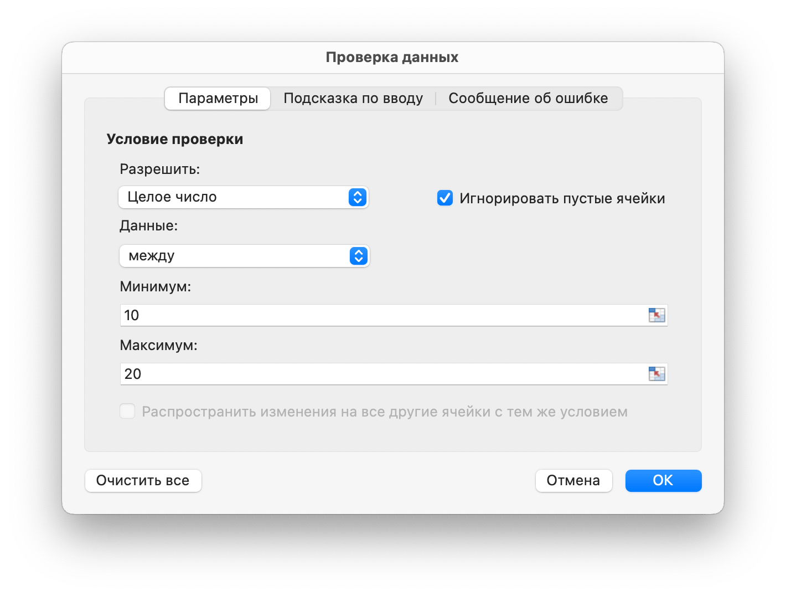
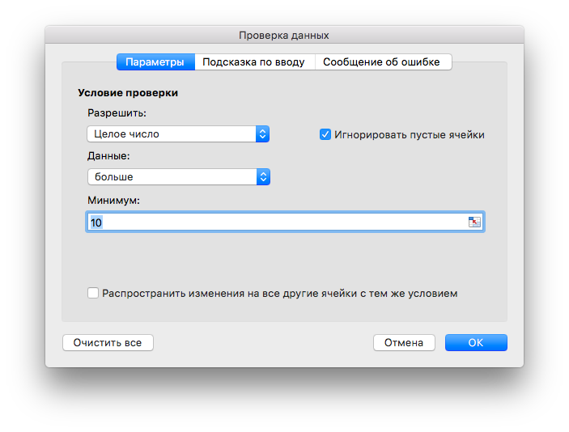
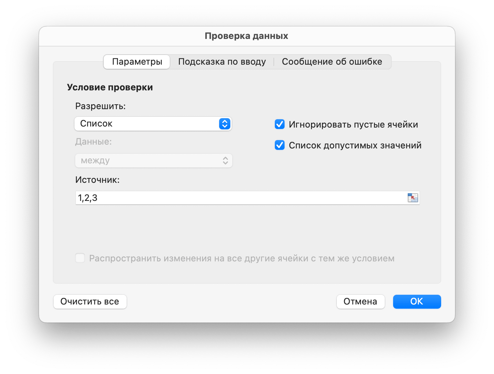
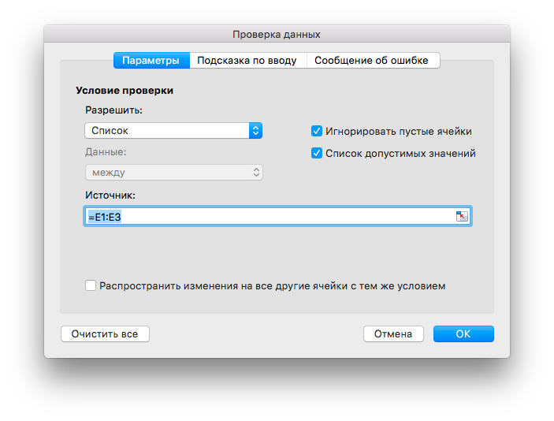

# Данные

## Добавить проверку данных {#AddDataValidation}

```go
func (f *File) AddDataValidation(sheet string, dv *DataValidation)
```

AddDataValidation предоставляет проверенную проверку данных в диапазоне рабочего листа с помощью заданного объекта проверки данных и имени листа. Объект проверки данных может быть создан с помощью функции `NewDataValidation`. Тип и операторы проверки данных можно найти в разделе [Константы](constants.md).

Пример 1, установите проверку данных на `Лист1!A1:B2` с настройками критериев проверки, покажите предупреждение об ошибке после ввода неверных данных с стилем "Stop" и пользовательским названием "error body":

<p align="center"></p>

```go
dv := excelize.NewDataValidation(true)
dv.SetSqref("A1:B2")
dv.SetRange(10, 20, excelize.DataValidationTypeWhole, excelize.DataValidationOperatorBetween)
dv.SetError(excelize.DataValidationErrorStyleStop, "error title", "error body")
f.AddDataValidation("Лист1", dv)
```

Пример 2, установите проверку данных на `Лист1!A3:B4` с настройками критериев проверки и покажите входное сообщение, когда выбрана ячейка:

<p align="center"></p>

```go
dv = excelize.NewDataValidation(true)
dv.SetSqref("A3:B4")
dv.SetRange(10, 20, excelize.DataValidationTypeWhole, excelize.DataValidationOperatorGreaterThan)
dv.SetInput("input title", "input body")
f.AddDataValidation("Лист1", dv)
```

Пример 3, установите проверку данных на `Лист1!A5:B6` с настройками критериев проверки, создайте раскрывающийся список в ячейке, используя источник списка:

<p align="center"></p>

```go
dv = excelize.NewDataValidation(true)
dv.SetSqref("A5:B6")
dv.SetDropList([]string{"1", "2", "3"})
f.AddDataValidation("Лист1", dv)
```

Если вы вводите элементы в диалоговое окно проверки данных (список с разделителями), ограничение составляет 255 символов, включая разделители. Если ваша исходная формула списка проверки данных превышает максимальный предел длины, установите допустимые значения в ячейках рабочего листа и используйте функцию `SetSqrefDropList`, чтобы установить ссылку для их ячеек.

Пример 4, установите проверку данных на `Лист1!A7:B8` с параметрами критериев проверки. Параметры `Лист1!E1:E3`, создайте раскрывающийся список в ячейке, разрешив источник списка:

<p align="center"></p>

```go
dv := excelize.NewDataValidation(true)
dv.SetSqref("A7:B8")
dv.SetSqrefDropList("E1:E3")
f.AddDataValidation("Лист1", dv)
```

Существуют ограничения на количество элементов, которые будут отображаться в раскрывающемся списке проверки данных: в списке может отображаться 32768 элементов из списка на листе. Если вам нужно больше элементов, вы можете создать зависимый раскрывающийся список, разбитый по категориям.

## Получение проверки данных {#GetDataValidations}

```go
func (f *File) GetDataValidations(sheet string) ([]*DataValidation, error)
```

Метод GetDataValidations возвращает список проверок данных по заданному имени листа.

## Удалить данные проверки {#DeleteDataValidation}

```go
func (f *File) DeleteDataValidation(sheet string, sqref ...string) error
```

DeleteDataValidation удалить проверку данных по заданному имени рабочего листа и последовательности ссылок. Все проверки данных на листе будут удалены, если не указать параметр эталонной последовательности.

## Добавить срез {#AddSlicer}

`SlicerOptions` представляет настройки слайсера.

```go
type SlicerOptions struct {
    Name          string
    Table         string
    Cell          string
    Caption       string
    Macro         string
    Width         uint
    Height        uint
    DisplayHeader *bool
    ItemDesc      bool
    Format        GraphicOptions
}
```

`Name` указывает имя среза, должно быть существующим именем поля данной таблицы или сводной таблицы, этот параметр является обязательным.

`Table` указывает имя таблицы или сводной таблицы, этот параметр является обязательным.

`Cell` указывает координаты левой верхней ячейки для вставки среза, этот параметр является обязательным.

`Caption` определяет заголовок среза, этот параметр не является обязательным.

`Macro` используется для установки макроса для среза, расширение книги должно быть XLSM или XLTM.

`Width` определяет ширину среза, этот параметр не является обязательным.

`Height` определяет высоту среза, этот параметр не является обязательным.

`DisplayHeader` указывает, будет ли отображаться заголовок среза. Этот параметр не является обязательным, значением по умолчанию является отображение.

`ItemDesc` определяет сортировку элементов по убыванию (Z-A). Этот параметр является необязательным, а значение по умолчанию — `false` (представляет собой возрастание).

`Format` определяет формат среза, этот параметр не является обязательным.

```go
func (f *File) AddSlicer(sheet string, opts *SlicerOptions) error
```

Функция AddSlicer вставляет срез, задавая имя листа и настройки среза. Например, вставьте срез на лист `Лист1!E1` с полем `Column1` для таблицы с именем `Table1`:

```go
err := f.AddSlicer("Лист1", &excelize.SlicerOptions{
    Name:       "Column1",
    Cell:       "E1",
    TableSheet: "Лист1",
    TableName:  "Table1",
    Caption:    "Column1",
    Width:      200,
    Height:     200,
})
```

## Получить слайсеры {#GetSlicers}

```go
func (f *File) GetSlicers(sheet string) ([]SlicerOptions, error)
```

GetSlicers предоставляет метод для получения всех срезов на листе по заданному имени листа. Обратите внимание, что эта функция в настоящее время не поддерживает получение высоты, ширины и графических параметров формы среза.

## Удалить слайсер {#DeleteSlicer}

```go
func (f *File) DeleteSlicer(name string) error
```

DeleteSlicer предоставляет метод для удаления слайсера по заданному имени.
