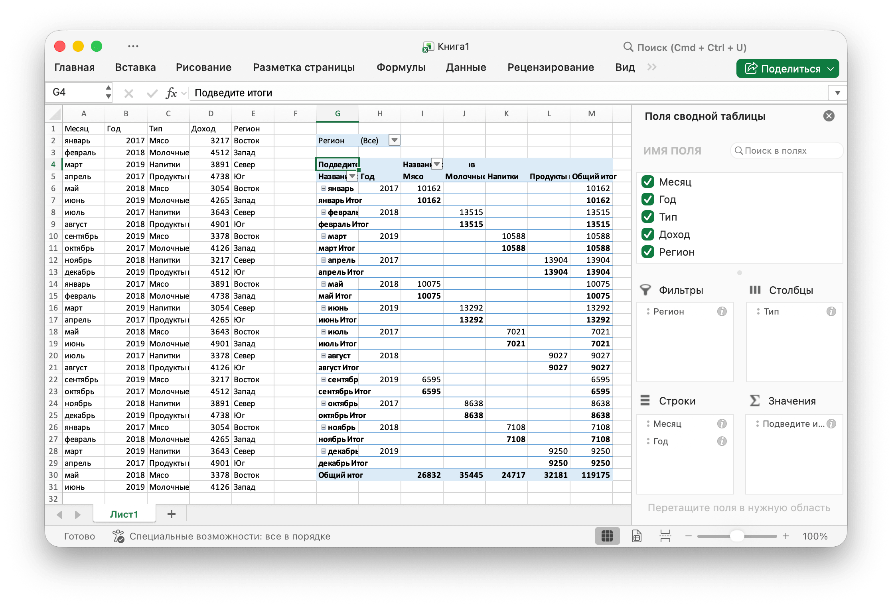

# Сводная таблица {#PivotTable}

Сводная таблица - это таблица статистики, которая суммирует данные более обширной таблицы (например, из базы данных, электронной таблицы или программы бизнес-аналитики). Эта сводка может включать суммы, средние значения или другие статистические данные, которые сводная таблица группирует значимым образом.

`PivotTableOptions` напрямую отображает настройки формата сводной таблицы.

```go
type PivotTableOptions struct {
    DataRange           string
    PivotTableRange     string
    Name                string
    Rows                []PivotTableField
    Columns             []PivotTableField
    Data                []PivotTableField
    Filter              []PivotTableField
    RowGrandTotals      bool
    ColGrandTotals      bool
    ShowDrill           bool
    UseAutoFormatting   bool
    PageOverThenDown    bool
    MergeItem           bool
    ClassicLayout       bool
    CompactData         bool
    ShowError           bool
    ShowRowHeaders      bool
    ShowColHeaders      bool
    ShowRowStripes      bool
    ShowColStripes      bool
    ShowLastColumn      bool
    FieldPrintTitles    bool
    ItemPrintTitles     bool
    PivotTableStyleName string
    // содержит отфильтрованные или неэкспортированные поля
}
```

`PivotTableStyleName`: Имена стилей встроенных сводных таблиц:

```text
PivotStyleLight1 - PivotStyleLight28
PivotStyleMedium1 - PivotStyleMedium28
PivotStyleDark1 - PivotStyleDark28
```

`PivotTableField` непосредственно привязки параметров поля сводной таблицы.

```go
type PivotTableField struct {
    Compact         bool
    Data            string
    Name            string
    Outline         bool
    ShowAll         bool
    InsertBlankRow  bool
    Subtotal        string
    DefaultSubtotal bool
    NumFmt          int
    SelectedItems   []string
}
```

`Subtotal` указывает функцию агрегирования, которая применяется к этому полю данных. Значением по умолчанию является `Sum`. Возможные значения для этого атрибута:

|Необязательное значение|
|---|
|Average|
|Count|
|CountNums|
|Max|
|Min|
|Product|
|StdDev|
|StdDevp|
|Sum|
|Var|
|Varp|

`Name` указывает имя поля данных. В имени поля данных допускается максимум `255` символов, лишние символы будут обрезаны.

Параметр `SelectedItems` задает элементы, выбранные по умолчанию в поле сводной таблицы. Выбранные элементы должны быть значениями в диапазоне ячеек, на который ссылается это поле.

## Создать сводную таблицу {#AddPivotTable}

```go
func (f *File) AddPivotTable(opts *PivotTableOptions) error
```

AddPivotTable предоставляет метод для добавления сводной таблицы с помощью заданных опций сводной таблицы.

Например, создайте сводную таблицу в области `Лист1!G4:M30` с регионом `Лист1!A1:E31` в качестве источника данных, суммируйте по сумме продаж:

<p align="center"></p>

```go
package main

import (
    "fmt"

    "github.com/xuri/excelize/v2"
)

func main() {
    f := excelize.NewFile()
    defer func() {
        if err := f.Close(); err != nil {
            fmt.Println(err)
        }
    }()
    if err := f.SetSheetName("Sheet1", "Лист1"); err != nil {
        fmt.Println(err)
        return
    }
    // Создать некоторые данные на листе
    month := []string{"январь", "февраль", "март", "апрель", "май", "июнь",
        "июль", "август", "сентябрь", "октябрь", "ноябрь", "декабрь"}
    year := []int{2017, 2018, 2019}
    types := []string{"Мясо", "Молочные продукты", "Напитки", "Продукты питания"}
    revenue := []int{3217, 4512, 3891, 4738, 3054, 4265, 3643, 4901, 3378, 4126}
    region := []string{"Восток", "Запад", "Север", "Юг"}
    if err := f.SetSheetRow(
        "Лист1", "A1", &[]string{"Месяц", "Год", "Тип", "Доход", "Регион"},
    ); err != nil {
        fmt.Println(err)
        return
    }
    for row := 2; row < 32; row++ {
        f.SetCellValue("Лист1", fmt.Sprintf("A%d", row), month[(row-2)%len(month)])
        f.SetCellValue("Лист1", fmt.Sprintf("B%d", row), year[(row-2)%len(year)])
        f.SetCellValue("Лист1", fmt.Sprintf("C%d", row), types[(row-2)%len(types)])
        f.SetCellValue("Лист1", fmt.Sprintf("D%d", row), revenue[(row-2)%len(revenue)])
        f.SetCellValue("Лист1", fmt.Sprintf("E%d", row), region[(row-2)%len(region)])
    }
    if err := f.AddPivotTable(&excelize.PivotTableOptions{
        DataRange:       "Лист1!A1:E31",
        PivotTableRange: "Лист1!G4:M30",
        Rows: []excelize.PivotTableField{
            {Data: "Месяц", DefaultSubtotal: true}, {Data: "Год"},
        },
        Filter: []excelize.PivotTableField{
            {Data: "Регион"},
        },
        Columns: []excelize.PivotTableField{
            {Data: "Тип", DefaultSubtotal: true},
        },
        Data: []excelize.PivotTableField{
            {Data: "Доход", Name: "Подведите итоги", Subtotal: "Sum"},
        },
        RowGrandTotals: true,
        ColGrandTotals: true,
        ShowDrill:      true,
        ShowRowHeaders: true,
        ShowColHeaders: true,
        ShowLastColumn: true,
    }); err != nil {
        fmt.Println(err)
        return
    }
    if err := f.SaveAs("Книга1.xlsx"); err != nil {
        fmt.Println(err)
    }
}
```

## Получить сводные таблицы {#GetPivotTables}

```go
func (f *File) GetPivotTables(sheet string) ([]PivotTableOptions, error)
```

GetPivotTables возвращает все определения сводных таблиц на листе по заданному имени листа.

## Удалить сводную таблицу {#DeletePivotTable}

```go
func (f *File) DeletePivotTable(sheet, name string) error
```

DeletePivotTable удалите сводную таблицу, указав имя рабочего листа и имя сводной таблицы. Обратите внимание, что эта функция не очищает значения ячеек в диапазоне сводной таблицы.
