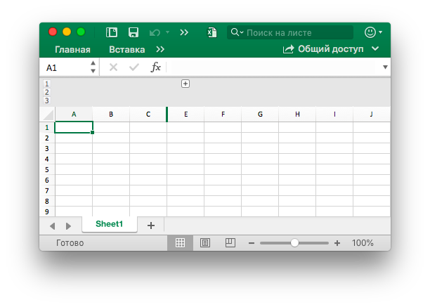

# Рабочий лист

## Установить видимость столбца {#SetColVisible}

```go
func (f *File) SetColVisible(sheet, col string, visible bool) error
```

SetColVisible предоставляет функцию для установки видимости одного столбца с помощью имени рабочего листа и имени столбца. Например, скройте столбец `D` в `Sheet1`:

```go
err := f.SetColVisible("Sheet1", "D", false)
```

Скрыть столбцы от `D` до `F` (включить):

```go
err := f.SetColVisible("Sheet1", "D:F", false)
```

## Установить ширину столбца {#SetColWidth}

```go
func (f *File) SetColWidth(sheet, startCol, endCol string, width float64) error
```

SetColWidth предоставляет функцию для установки ширины одного столбца или нескольких столбцов. Например:

```go
f := excelize.NewFile()
err := f.SetColWidth("Sheet1", "A", "H", 20)
```

## Установить высоту строки {#SetRowHeight}

```go
func (f *File) SetRowHeight(sheet string, row int, height float64) error
```

SetRowHeight предоставляет функцию для установки высоты одной строки. Например, установите высоту первой строки в `Sheet1`:

```go
err := f.SetRowHeight("Sheet1", 1, 50)
```

## Установить видимость линии {#SetRowVisible}

```go
func (f *File) SetRowVisible(sheet string, row int, visible bool) error
```

SetRowVisible предоставляет функцию для отображения видимости одной строки с помощью заданного имени листа и индекса строки. Например, скройте строку `2` в `Sheet1`:

```go
err := f.SetRowVisible("Sheet1", 2, false)
```

## Получить имя листа {#GetSheetName}

```go
func (f *File) GetSheetName(index int) string
```

GetSheetName предоставляет функцию для получения имени рабочего листа XLSX с помощью указанного индекса рабочего листа. Если заданный индекс листа недействителен, он вернет пустую строку.

## Получить видимость столбца {#GetColVisible}

```go
func (f *File) GetColVisible(sheet, column string) (bool, error)
```

GetColVisible предоставляет функцию, чтобы получить видимость одного столбца с помощью имени рабочего листа и имени столбца. Например, получите видимое состояние столбца `D` в `Sheet1`:

```go
visible, err := f.GetColVisible("Sheet1", "D")
```

## Получить ширину столбц {#GetColWidth}

```go
func (f *File) GetColWidth(sheet, col string) (float64, error)
```

GetColWidth предоставляет функцию для получения ширины столбца с помощью имени рабочего листа и индекса столбца.

## Получить высоту строки {#GetRowHeight}

```go
func (f *File) GetRowHeight(sheet string, row int) (float64, error)
```

GetRowHeight предоставляет функцию для получения высоты строки с помощью заданного имени листа и индекса строки. Например, получить высоту первой строки в `Sheet1`:

```go
height, err := f.GetRowHeight("Sheet1", 1)
```

## Получить видимость строки {#GetRowVisible}

```go
func (f *File) GetRowVisible(sheet string, row int) (bool, error)
```

GetRowVisible предоставляет функцию, чтобы получить видимость одной строки, указав имя листа и индекс строки. Например, получить видимое состояние строки `2` в `Sheet1`:

```go
err := f.GetRowVisible("Sheet1", 2)
```

## Получить индекс рабочего листа {#GetSheetIndex}

```go
func (f *File) GetSheetIndex(name string) int
```

GetSheetIndex предоставляет функцию для получения индекса листа рабочей книги по заданному имени листа. Если данное имя листа недопустимо, оно вернет целочисленное значение типа `-1`.

Полученный индекс может использоваться как параметр для вызова функции [`SetActiveSheet()`](workbook.md#SetActiveSheet) при настройке рабочего листа по умолчанию для рабочей книги.

## Получить список рабочих листов {#GetSheetMap}

```go
func (f *File) GetSheetMap() map[int]string
```

GetSheetMap предоставляет функцию для получения рабочих листов, листов диаграмм, идентификаторов диалоговых листов и карты имен рабочей книги. Например:

```go
f, err := excelize.OpenFile("Book1.xlsx")
if err != nil {
    return
}
for index, name := range f.GetSheetMap() {
    fmt.Println(index, name)
}
```

## Получить список листов {#GetSheetList}

```go
func (f *File) GetSheetList() []string
```

GetSheetList предоставляет функцию для получения рабочих листов, листов диаграмм и списка имен диалоговых листов рабочей книги.

## Задать имя листа {#SetSheetName}

```go
func (f *File) SetSheetName(oldName, newName string)
```

SetSheetName предоставляет функцию для установки имени листа по заданным именам старого и нового листа. В заголовке листа допускается не более 31 символа, и эта функция изменяет только имя листа и не обновляет имя листа в формуле или ссылке, связанной с ячейкой. Таким образом, может быть ошибка формулы проблемы или отсутствует ссылка.

## Установить свойства листа {#SetSheetPrOptions}

```go
func (f *File) SetSheetPrOptions(name string, opts ...SheetPrOption) error
```

SetSheetPrOptions предоставляет функцию для установки свойств листа.

Доступные Варианты:

|Необязательный атрибут|Тип|
|---|---|
|CodeName|string|
|EnableFormatConditionsCalculation|bool|
|Published|bool|
|FitToPage|bool|
|TabColor|string|
|AutoPageBreaks|bool|
|OutlineSummaryBelow|bool|

Например:

```go
f := excelize.NewFile()
const sheet = "Sheet1"

if err := f.SetSheetPrOptions(sheet,
    excelize.CodeName("code"),
    excelize.EnableFormatConditionsCalculation(false),
    excelize.Published(false),
    excelize.FitToPage(true),
    excelize.TabColor("#FFFF00"),
    excelize.AutoPageBreaks(true),
    excelize.OutlineSummaryBelow(false),
); err != nil {
    fmt.Println(err)
}
```

## Получить свойства листа {#GetSheetPrOptions}

```go
func (f *File) GetSheetPrOptions(name string, opts ...SheetPrOptionPtr) error
```

GetSheetPrOptions обеспечивает функцию для получения свойств листа.

|Необязательный атрибут|Тип|
|---|---|
|CodeName|string|
|EnableFormatConditionsCalculation|bool|
|Published|bool|
|FitToPage|bool|
|TabColor|string|
|AutoPageBreaks|bool|
|OutlineSummaryBelow|bool|

Например:

```go
f := excelize.NewFile()
const sheet = "Sheet1"

var (
    codeName                          excelize.CodeName
    enableFormatConditionsCalculation excelize.EnableFormatConditionsCalculation
    published                         excelize.Published
    fitToPage                         excelize.FitToPage
    tabColor                          excelize.TabColor
    autoPageBreaks                    excelize.AutoPageBreaks
    outlineSummaryBelow               excelize.OutlineSummaryBelow
)

if err := f.GetSheetPrOptions(sheet,
    &codeName,
    &enableFormatConditionsCalculation,
    &published,
    &fitToPage,
    &tabColor,
    &autoPageBreaks,
    &outlineSummaryBelow,
); err != nil {
    fmt.Println(err)
}
fmt.Println("Defaults:")
fmt.Printf("- codeName: %q\n", codeName)
fmt.Println("- enableFormatConditionsCalculation:", enableFormatConditionsCalculation)
fmt.Println("- published:", published)
fmt.Println("- fitToPage:", fitToPage)
fmt.Printf("- tabColor: %q\n", tabColor)
fmt.Println("- autoPageBreaks:", autoPageBreaks)
fmt.Println("- outlineSummaryBelow:", outlineSummaryBelow)
```

Вывод:

```text
Defaults:
- codeName: ""
- enableFormatConditionsCalculation: true
- published: true
- fitToPage: false
- tabColor: ""
- autoPageBreaks: false
- outlineSummaryBelow: true
```

## Вставить столбец {#InsertCol}

```go
func (f *File) InsertCol(sheet, column string) error
```

InsertCol предоставляет функцию для вставки нового столбца перед указателем столбца. Например, создайте новый столбец перед столбцом `C` в `Sheet1`:

```go
err := f.InsertCol("Sheet1", "C")
```

## Вставить строку {#InsertRow}

```go
func (f *File) InsertRow(sheet string, row int) error
```

InsertRow предоставляет функцию для вставки новой строки перед указателем строки. Например, создайте новую строку перед строкой `3` в `Sheet1`:

```go
err := f.InsertRow("Sheet1", 3)
```

## Добавить дубликат строки {#DuplicateRow}

```go
func (f *File) DuplicateRow(sheet string, row int) error
```

DuplicateRow вставляет копию указанной строки ниже указанной, например:

```go
err := f.DuplicateRow("Sheet1", 2)
```

Используйте этот метод с осторожностью, что повлияет на изменения в ссылках, таких как формулы, диаграммы и т. Д. Если на листе есть какое-либо ссылочное значение, это приведет к ошибке файла при его открытии. Excelize лишь частично обновляет эти ссылки в настоящее время.

## Дублирующая строка {#DuplicateRowTo}

```go
func (f *File) DuplicateRowTo(sheet string, row, row2 int) error
```

DuplicateRowTo вставляет копию указанной строки в указанную позицию строки, перемещаясь вниз на существующие строки после целевой позиции, например:

```go
err := f.DuplicateRowTo("Sheet1", 2, 7)
```

Используйте этот метод с осторожностью, что повлияет на изменения в ссылках, таких как формулы, диаграммы и т. Д. Если на листе есть какое-либо ссылочное значение, это приведет к ошибке файла при его открытии. Excelize лишь частично обновляет эти ссылки в настоящее время.

## Создать схему строки {#SetRowOutlineLevel}

```go
func (f *File) SetRowOutlineLevel(sheet string, row int, level uint8) error
```

SetRowOutlineLevel предоставляет функцию для установки уровня уровня строки в одной строке с помощью заданного имени листа и индекса строки. Например, контур 2 строки в `Sheet1` до уровня 1:

<p align="center"></p>

```go
err := f.SetRowOutlineLevel("Sheet1", 2, 1)
```

## Создать контур столбца {#SetColOutlineLevel}

```go
func (f *File) SetColOutlineLevel(sheet, col string, level uint8) error
```

SetColOutlineLevel предоставляет функцию для установки уровня контуров одного столбца с помощью имени рабочего листа и имени столбца. Например, установите уровень контуров столбца `D` в `Sheet1` равным 2:

<p align="center"></p>

```go
err := f.SetColOutlineLevel("Sheet1", "D", 2)
```

## Получить контур линии {#GetRowOutlineLevel}

```go
func (f *File) GetRowOutlineLevel(sheet string, row int) (uint8, error)
```

GetRowOutlineLevel предоставляет функцию, позволяющую получить общий уровень уровня одной строки с помощью заданного имени листа и индекса строки. Например, получите количество строк строки 2 в `Sheet1`:

```go
err := f.GetRowOutlineLevel("Sheet1", 2)
```

## Получить контур колонны {#GetColOutlineLevel}

```go
func (f *File) GetColOutlineLevel(sheet, col string) (uint8, error)
```

GetColOutlineLevel предоставляет функцию для получения уровня контуров одного столбца с указанием имени рабочего листа и имени столбца. Например, получите уровень контуров столбца `D` в `Sheet1`:

```go
level, err := f.GetColOutlineLevel("Sheet1", "D")
```

## Итератор столбца {#Cols}

```go
func (f *File) Cols(sheet string) (*Cols, error)
```

Cols возвращает итератор столбцов, используемый для потоковой передачи данных чтения для листа с большими данными. Например:

```go
cols, err := f.Cols("Sheet1")
if err != nil {
    fmt.Println(err)
    return
}
for cols.Next() {
    col, err := cols.Rows()
    if err != nil {
        fmt.Println(err)
    }
    for _, rowCell := range col {
        fmt.Print(rowCell, "\t")
    }
    fmt.Println()
}
```

### Итератор столбцов - столбцы

```go
func (cols *Cols) Rows(opts ...Options) ([]string, error)
```

Rows возвращает значения строк текущего столбца.

### Итератор столбца - обход

```go
func (cols *Cols) Next() bool
```

Next вернет `true`, если найден следующий столбец.

### Итератор столбца - обработка ошибок

```go
func (cols *Cols) Error() error
```

Error вернет `error` при возникновении ошибки.

## Ряд итератора {#Rows}

```go
func (f *File) Rows(sheet string) (*Rows, error)
```

Rows возвращает итератор строк, используемый для потоковой передачи данных чтения для листа с большими данными. Например:

```go
rows, err := f.Rows("Sheet1")
if err != nil {
    fmt.Println(err)
    return
}
for rows.Next() {
    row, err := rows.Columns()
    if err != nil {
        fmt.Println(err)
    }
    for _, colCell := range row {
        fmt.Print(colCell, "\t")
    }
    fmt.Println()
}
if err = rows.Close(); err != nil {
    fmt.Println(err)
}
```

### Итератор строк - Столбцы

```go
func (rows *Rows) Columns(opts ...Options) ([]string, error)
```

Columns возвращают значения столбцов текущей строки.

### Итератор строк - перемещение

```go
func (rows *Rows) Next() bool
```

Next вернется `true`, если найдет следующий элемент строки.

### Итератор строк - обработка ошибок

```go
func (rows *Rows) Error() error
```

Error вернет `error` при возникновении ошибки.

### Итератор строк - Закрывать

```go
func (rows *Rows) Close() error
```

Close закрывает открытый XML-файл рабочего листа во временном каталоге системы.

## Поиск на листе {#SearchSheet}

```go
func (f *File) SearchSheet(sheet, value string, reg ...bool) ([]string, error)
```

SearchSheet предоставляет функцию для получения координат с помощью заданного имени листа и значения ячейки. Эта функция поддерживает только точное соответствие строк и чисел, не поддерживает вычисляемый результат, отформатированные числа и условный поиск в настоящее время. Если это объединенная ячейка, она вернет координаты верхнего левого угла объединенной области.

Например, найдите координаты значения `100` на `Sheet1`:

```go
result, err := f.SearchSheet("Sheet1", "100")
```

Например, найдите координаты значения в диапазоне `0-9` на листе с именем `Sheet1`:

```go
result, err := f.SearchSheet("Sheet1", "[0-9]", true)
```

## Защитить лист {#ProtectSheet}

```go
func (f *File) ProtectSheet(sheet string, settings *FormatSheetProtection) error
```

ProtectSheet предоставляет функцию для предотвращения случайного или преднамеренного изменения, перемещения или удаления данных на листе другими пользователями. Необязательное поле `AlgorithmName` указывает хеш-алгоритм, поддерживает XOR, MD4, MD5, SHA1, SHA256, SHA384 и SHA512. В настоящее время, если хэш-алгоритм не указан, будет использоваться алгоритм XOR по умолчанию. Например, защитите `Sheet1` с помощью параметров защиты:

<p align="center"></p>

```go
err := f.ProtectSheet("Sheet1", &excelize.FormatSheetProtection{
    AlgorithmName: "SHA-512",
    Password:      "password",
    EditScenarios: false,
})
```

## Снять защиту листа {#UnprotectSheet}

```go
func (f *File) UnprotectSheet(sheet string) error
```

UnprotectSheet предоставляет функцию для снятия защиты листа, указанного вторым необязательным параметром пароля для снятия защиты листа с проверкой пароля.

## Удалить столбец {#RemoveCol}

```go
func (f *File) RemoveCol(sheet, col string) error
```

RemoveCol предоставляет функцию удаления одного столбца по заданному имени рабочего листа и индексу столбца Например, удалите столбец `C` в `Sheet1`:

```go
err := f.RemoveCol("Sheet1", "C")
```

Используйте этот метод с осторожностью, что повлияет на изменения в ссылках, таких как формулы, диаграммы и т. Если на листе есть какое-либо ссылочное значение, это приведет к ошибке файла при его открытии. The excelize только частично обновляет эти ссылки в настоящее время.

## Удалить строку {#RemoveRow}

```go
func (f *File) RemoveRow(sheet string, row int) error
```

RemoveRow предоставляет функцию для удаления одной строки по заданному имени рабочего листа и номеру строки Excel. Например, удалите строку `3` в `Sheet1`:

```go
err := f.RemoveRow("Sheet1", 3)
```

Используйте этот метод с осторожностью, что повлияет на изменения в ссылках, таких как формулы, диаграммы и т. Если на листе есть какое-либо ссылочное значение, это приведет к ошибке файла при его открытии. The excelize только частично обновляет эти ссылки в настоящее время.

## Установить значения строки {#SetSheetRow}

```go
func (f *File) SetSheetRow(sheet, axis string, slice interface{}) error
```

SetSheetRow записывает массив в строку по заданному имени рабочего листа, начальной координате и указателю на тип массива `slice`. Например, запись массива в строку `6` начинается с ячейки `B6` на `Sheet1`:

```go
err := f.SetSheetRow("Sheet1", "B6", &[]interface{}{"1", nil, 2})
```

## Вставить разрыв страницы {#InsertPageBreak}

```go
func (f *File) InsertPageBreak(sheet, cell string) error
```

InsertPageBreak создает разрыв страницы, чтобы определить, где заканчивается напечатанная страница и где начинается следующая страница с заданным именем и осью листа, поэтому содержимое до разрыва страницы будет напечатано на одной странице, а после разрыва страницы - на другой.

## Удалить разрыв страницы {#RemovePageBreak}

```go
func (f *File) RemovePageBreak(sheet, cell string) error
```

RemovePageBreak удаляет разрыв страницы по заданному имени листа и оси.
