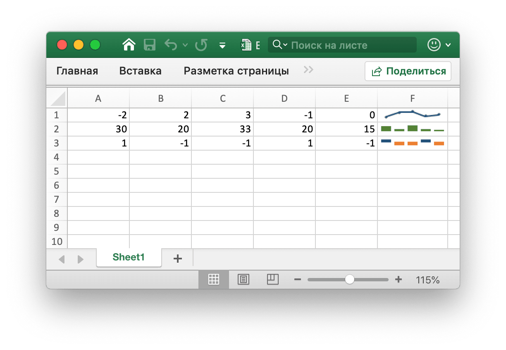
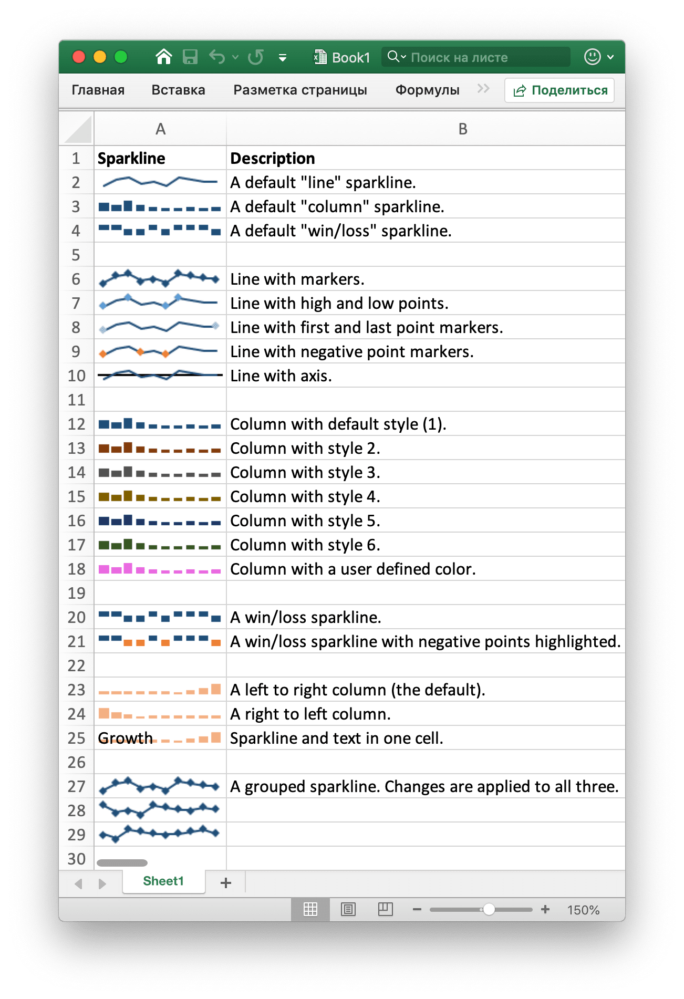

# Спарклайнов

Sparklines являются особенностью Excel 2010, которая позволяет добавлять небольшие диаграммы в ячейки листа. Они полезны для отображения визуальных тенденций в данных в компактном формате.

<p align="center"></p>

[Sparklines](https://en.wikipedia.org/wiki/Sparklines) were invented by [Edward Tufte](https://en.wikipedia.org/wiki/Edward_Tufte).

## Добавить Спарклайнов

```go
func (f *File) AddSparkline(sheet string, opt *SparklineOption) error
```

AddSparkline обеспечивает функцию добавления искры в лист, заножая параметры форматирования. Sparklines представляют собой небольшие диаграммы, которые вписываются в одну ячейку и используются для отображения тенденций в данных. Sparklines являются особенностью Excel 2010 и только позже. Вы можете написать их в файл XLSX, который может быть прочитан Excel 2007, но они не будут отображаться. Например, добавьте сгруппированную искру. Изменения применяются ко всем трем:

```go
err := f.AddSparkline("Sheet1", &excelize.SparklineOption{
    Location: []string{"A1", "A2", "A3"},
    Range:    []string{"Sheet2!A1:J1", "Sheet2!A2:J2", "Sheet2!A3:J3"},
    Markers:  true,
})
```

<p align="center"></p>

Ниже показаны варианты форматирования sparkline, поддерживаемые Excelize:

Параметр | Описание
---|---
Location  | Обязательно, должны иметь тот же номер с параметром `Range`
Range     | Обязательно, должны иметь тот же номер с параметром `Location`
Type      | Значение значения: `line`, `column`, `win_loss`
Style     | Диапазон значений: 0 - 35
Hight     | Переключение sparkline высокие точки
Low       | Переключать сверкающие низкие точки
First     | Переключать sparkline первые точки
Last      | Переключать sparkline последние точки
Negative  | Переключение искры отрицательных точек
Markers   | Маркеры искры переключения
ColorAxis | Цвет RGB указан как `RRGGBB`
Axis      | Показать искрливую ось
