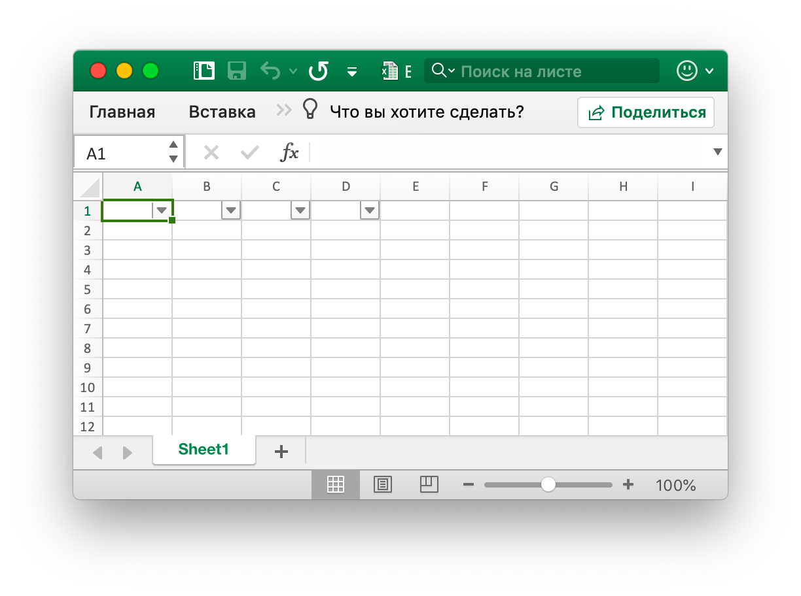
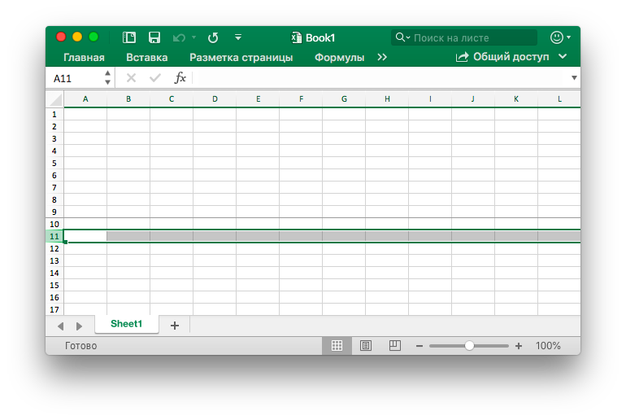

# Функция инструмента

## Таблица {#AddTable}

```go
func (f *File) AddTable(sheet, hcell, vcell, format string) error
```

AddTable предоставляет метод для добавления таблицы в рабочий лист с помощью заданного имени рабочего листа, области координат и формата.

- Пример 1, создайте таблицу `A1:D5` на `Sheet1`:

<p align="center"></p>

```go
err := f.AddTable("Sheet1", "A1", "D5", ``)
```

- Пример 2, создайте таблицу `F2:H6` на `Sheet2` с установленным форматом:

<p align="center"></p>

```go
err := f.AddTable("Sheet2", "F2", "H6", `{"table_name":"table","table_style":"TableStyleMedium2", "show_first_column":true,"show_last_column":true,"show_row_stripes":false,"show_column_stripes":true}`)
```

Обратите внимание, что таблица должна содержать не менее двух строк, включая заголовок. Ячейки заголовка должны содержать строки и должны быть уникальными, а также должны устанавливать данные строки заголовка таблицы перед вызовом функции AddTable. Несколько таблиц координируют области, которые не могут иметь пересечения.

`table_name`: Имя таблицы в том же листе таблицы таблицы должно быть уникальным.

`table_style`: Встроенные имена стиля таблицы:

```text
TableStyleLight1 - TableStyleLight21
TableStyleMedium1 - TableStyleMedium28
TableStyleDark1 - TableStyleDark11
```

Индекс|Стиль|Индекс|Стиль|Индекс|Стиль
---|---|---|---|---|---
||TableStyleLight1||TableStyleLight2|
TableStyleLight3||TableStyleLight4||TableStyleLight5|
TableStyleLight6||TableStyleLight7||TableStyleLight8|
TableStyleLight9||TableStyleLight10||TableStyleLight11|
TableStyleLight12||TableStyleLight13||TableStyleLight14|
TableStyleLight15||TableStyleLight16||TableStyleLight17|
TableStyleLight18||TableStyleLight19||TableStyleLight20|
TableStyleLight21||TableStyleMedium1||TableStyleMedium2|
TableStyleMedium3||TableStyleMedium4||TableStyleMedium5|
TableStyleMedium6||TableStyleMedium7||TableStyleMedium8|
TableStyleMedium9||TableStyleMedium10||TableStyleMedium11|
TableStyleMedium12||TableStyleMedium13||TableStyleMedium14|
TableStyleMedium15||TableStyleMedium16||TableStyleMedium17|
TableStyleMedium18||TableStyleMedium19||TableStyleMedium20|
TableStyleMedium21||TableStyleMedium22||TableStyleMedium23|
TableStyleMedium24||TableStyleMedium25||TableStyleMedium26|
TableStyleMedium27||TableStyleMedium28||TableStyleDark1|
TableStyleDark2||TableStyleDark3||TableStyleDark4|
TableStyleDark5||TableStyleDark6||TableStyleDark7|
TableStyleDark8||TableStyleDark9||TableStyleDark10|
TableStyleDark11|||||

## Авто фильтр {#AutoFilter}

```go
func (f *File) AutoFilter(sheet, hcell, vcell, format string) error
```

AutoFilter предоставляет метод добавления автоматического фильтра в рабочий лист с помощью имени рабочего листа, области координат и настроек. Автофильтр в Excel представляет собой способ фильтрации 2D спектра данных на основе простых критериев.

Пример 1, применяя автоматический фильтр к диапазону ячеек `A1:D4` в `Sheet1`:

<p align="center"></p>

```go
err := f.AutoFilter("Sheet1", "A1", "D4", "")
```

Пример 2, данные фильтра в автофильтре:

```go
err := f.AutoFilter("Sheet1", "A1", "D4", `{"column":"B","expression":"x != blanks"}`)
```

`column` определяет столбцы фильтра в диапазоне автоматического фильтра на основе простых критериев

Недостаточно просто указать условие фильтра. Вы также должны скрыть любые строки, которые не соответствуют условию фильтра. Строки скрыты с помощью метода [`SetRowVisible()`](sheet.md#SetRowVisible). Excelize не может автоматически фильтровать строки, поскольку это не является частью формата файла.

Установка критериев фильтра для столбца:

`expression` определяет условия, доступны следующие операторы для установки критериев фильтра:

```text
==
!=
>
<
>=
<=
and
or
```

Выражение может содержать один оператор или два оператора, разделенных операторами `and` и `or`. Например:

```text
x <  2000
x >  2000
x == 2000
x >  2000 and x <  5000
x == 2000 or  x == 5000
```

Фильтрация пустых или непустых данных может быть достигнута путем использования значения Бланков или NonBlanks в выражении:

```text
x == Blanks
x == NonBlanks
```

Office Excel также позволяет выполнять некоторые простые операции сопоставления строк:

```text
x == b*      // начинается с b
x != b*      // не начинается с b
x == *b      // заканчивается буквой b
x != *b      // не заканчивается на b
x == *b*     // содержит b
x != *b*     // не содержит b
```

Вы также можете использовать `*` для соответствия любому символу или номеру и `?` Для соответствия любому одиночному символу или номеру. Фильтры Excel не поддерживаются никаким другим квантором регулярных выражений. Символы регулярного выражения Excel могут быть экранированы с помощью `~`.

Замещающая переменная `x` в приведенных выше примерах может быть заменена любой простой строкой. Фактическое имя заполнителя игнорируется внутренне, поэтому следующие эквиваленты:

```text
x     < 2000
col   < 2000
Price < 2000
```

## Обновить связанное значение {#UpdateLinkedValue}

```go
func (f *File) UpdateLinkedValue() error
```

UpdateLinkedValue фиксирует связанные значения в электронной таблице, не обновляется в Office Excel 2007 и 2010. Эта функция будет удалять тег значения, когда встречная ячейка имеет связанное значение. Справка [https://social.technet.microsoft.com/Forums/office/en-US/e16bae1f-6a2c-4325-8013-e989a3479066/excel-2010-linked-cells-not-updating](https://social.technet.microsoft.com/Forums/office/en-US/e16bae1f-6a2c-4325-8013-e989a3479066/excel-2010-linked-cells-not-updating) Обратите внимание: после открытия XLSX-файла Excel будет обновлять связанное значение и генерировать новое значение и вызывать файл сохранения или нет.

Эффект очистки кеша ячейки в рабочей книге появляется как модификация тега `<v>`, например кеш ячейки перед очисткой:

```xml
<row r="19" spans="2:2">
    <c r="B19">
        <f>SUM(Sheet2!D2,Sheet2!D11)</f>
        <v>100</v>
     </c>
</row>
```

После очистки кеша ячейки:

```xml
<row r="19" spans="2:2">
    <c r="B19">
        <f>SUM(Sheet2!D2,Sheet2!D11)</f>
    </c>
</row>
```

## Разделить имя ячейки {#SplitCellName}

```go
func SplitCellName(cell string) (string, int, error)
```

SplitCellName разделяет имя ячейки на имя столбца и номер строки. Например:

```go
excelize.SplitCellName("AK74") // return "AK", 74, nil
```

## Присоединиться к имени ячейки {#JoinCellName}

```go
func JoinCellName(col string, row int) (string, error)
```

JoinCellName объединяет имя ячейки из имени столбца и номера строки.

## Имя столбца в номер {#ColumnNameToNumber}

```go
func ColumnNameToNumber(name string) (int, error)
```

ColumnNameToNumber предоставляет функцию для преобразования имени столбца листа Excel в `int`. Имя столбца нечувствительно к регистру. Функция возвращает ошибку, если имя столбца неверно. Например:

```go
excelize.ColumnNameToNumber("AK") // returns 37, nil
```

## Номер столбца к имени {#ColumnNumberToName}

```go
func ColumnNumberToName(num int) (string, error)
```

ColumnNumberToName предоставляет функцию для преобразования целого числа в заголовок столбца листа Excel. Например:

```go
excelize.ColumnNumberToName(37) // returns "AK", nil
```

## Имя ячейки для координат {#CellNameToCoordinates}

```go
func CellNameToCoordinates(cell string) (int, int, error)
```

CellNameToCoordinates преобразует буквенно-цифровое имя ячейки в координаты `[X, Y]` или возвращает ошибку. Например:

```go
CellCoordinates("A1") // returns 1, 1, nil
CellCoordinates("Z3") // returns 26, 3, nil
```

## Координаты на имя ячейки {#CoordinatesToCellName}

```go
func CoordinatesToCellName(col, row int) (string, error)
```

CoordinatesToCellName преобразует `[X, Y]` координаты в буквенно-цифровое имя ячейки или возвращает ошибку. Например:

```go
CoordinatesToCellName(1, 1) // returns "A1", nil
```

## Стиль стиля {#NewConditionalStyle}

```go
func (f *File) NewConditionalStyle(style string) (int, error)
```

NewConditionalStyle предоставляет функцию для создания стиля для условного формата по заданному стилю. Параметры такие же, как и функция [`NewStyle()`](style.md#NewStyle). Обратите внимание, что в цветовом поле используется цветовой код RGB и поддерживается только для установки шрифта, заливок, выравнивания и границ в настоящее время.

## Формат условия {#SetConditionalFormat}

```go
func (f *File) SetConditionalFormat(sheet, area, formatSet string) error
```

SetConditionalFormat предоставляет функцию для создания правила условного форматирования для значения ячейки. Условное форматирование - это функция Office Excel, которая позволяет применять формат к ячейке или диапазону ячеек на основе определенных критериев.

Опция `type` является обязательным параметром и не имеет значения по умолчанию. Допустимые значения типов и связанные с ними параметры:

<table>
    <thead>
        <tr>
            <th>Тип</th>
            <th>параметры</th>
        </tr>
    </thead>
    <tbody>
        <tr>
            <td rowspan=4>cell</td>
            <td>criteria</td>
        </tr>
        <tr>
            <td>value</td>
        </tr>
        <tr>
            <td>minimum</td>
        </tr>
        <tr>
            <td>maximum</td>
        </tr>
        <tr>
            <td rowspan=4>date</td>
            <td>criteria</td>
        </tr>
        <tr>
            <td>value</td>
        </tr>
        <tr>
            <td>minimum</td>
        </tr>
        <tr>
            <td>maximum</td>
        </tr>
        <tr>
            <td>time_period</td>
            <td>criteria</td>
        </tr>
        <tr>
            <td rowspan=2>text</td>
            <td>criteria</td>
        </tr>
        <tr>
            <td>value</td>
        </tr>
        <tr>
            <td>average</td>
            <td>criteria</td>
        </tr>
        <tr>
            <td>duplicate</td>
            <td>(none)</td>
        </tr>
        <tr>
            <td>unique</td>
            <td>(none)</td>
        </tr>
        <tr>
            <td rowspan=2>top</td>
            <td>criteria</td>
        </tr>
        <tr>
            <td>value</td>
        </tr>
        <tr>
            <td rowspan=2>bottom</td>
            <td>criteria</td>
        </tr>
        <tr>
            <td>value</td>
        </tr>
        <tr>
            <td>blanks</td>
            <td>(none)</td>
        </tr>
        <tr>
            <td>no_blanks</td>
            <td>(none)</td>
        </tr>
        <tr>
            <td>errors</td>
            <td>(none)</td>
        </tr>
        <tr>
            <td>no_errors</td>
            <td>(none)</td>
        </tr>
        <tr>
            <td rowspan=6>2_color_scale</td>
            <td>min_type</td>
        </tr>
        <tr>
            <td>max_type</td>
        </tr>
        <tr>
            <td>min_value</td>
        </tr>
        <tr>
            <td>max_value</td>
        </tr>
        <tr>
            <td>min_color</td>
        </tr>
        <tr>
            <td>max_color</td>
        </tr>
        <tr>
            <td rowspan=9>3_color_scale</td>
            <td>min_type</td>
        </tr>
        <tr>
            <td>mid_type</td>
        </tr>
        <tr>
            <td>max_type</td>
        </tr>
        <tr>
            <td>min_value</td>
        </tr>
        <tr>
            <td>mid_value</td>
        </tr>
        <tr>
            <td>max_value</td>
        </tr>
        <tr>
            <td>min_color</td>
        </tr>
        <tr>
            <td>mid_color</td>
        </tr>
        <tr>
            <td>max_color</td>
        </tr>
        <tr>
            <td rowspan=5>data_bar</td>
            <td>min_type</td>
        </tr>
        <tr>
            <td>max_type</td>
        </tr>
        <tr>
            <td>min_value</td>
        </tr>
        <tr>
            <td>max_value</td>
        </tr>
        <tr>
            <td>bar_color</td>
        </tr>
        <tr>
            <td>formula</td>
            <td>criteria</td>
        </tr>
    </tbody>
</table>

Параметр `criteria` используется для установки критериев, по которым будут оцениваться данные ячейки. Он не имеет значения по умолчанию. Наиболее распространенные критерии применительно к `{"type"："cell"}`:

Символ описания текста|Символическое представление
---|---
between|
not between|
equal to|==
not equal to|!=
greater than|>
less than|<
greater than or equal to|>=
less than or equal to|<=

Вы можете использовать строки текстового описания Excel в первом столбце выше или более распространенные символические альтернативы.

Дополнительные критерии, которые относятся к другим типам условного формата, приведены в соответствующих разделах ниже.

`value`: значение обычно используется вместе с параметром `criteria` для установки правила, по которому будут оцениваться данные ячейки:

```go
f.SetConditionalFormat("Sheet1", "D1:D10", fmt.Sprintf(`[{"type":"cell","criteria":">","format":%d,"value":"6"}]`, format))
```

Свойство `value` также может быть ссылкой на ячейку:

```go
f.SetConditionalFormat("Sheet1", "D1:D10", fmt.Sprintf(`[{"type":"cell","criteria":">","format":%d,"value":"$C$1"}]`, format))
```

Тип: `format` - The `format` параметр используется для указания формата, который будет применен к клетке, когда условное форматирование критерия. Формат создается с помощью метода [`NewConditionalStyle()`](utils.md#NewConditionalStyle) таким же образом, как и форматы ячеек:

```go
format, err = f.NewConditionalStyle(`{"font":{"color":"#9A0511"},"fill":{"type":"pattern","color":["#FEC7CE"],"pattern":1}}`)
if err != nil {
    fmt.Println(err)
}
f.SetConditionalFormat("Sheet1", "A1:A10", fmt.Sprintf(`[{"type":"cell","criteria":">","format":%d,"value":"6"}]`, format))
```

Примечание. В Excel условный формат накладывается поверх существующего формата ячейки, и не все свойства формата ячейки могут быть изменены. Свойства, которые не могут быть изменены в условном формате имя шрифта, размер шрифта, верхние и нижние индексы, диагональные границы, все свойства выравнивания и все защитные свойства.

Excel указывает некоторые стандартные форматы, которые будут использоваться с условным форматированием. Они могут быть реплицированы с использованием следующих форматов excelize:

```go
// Розовый формат для плохих условных.
format1, err = f.NewConditionalStyle(`{"font":{"color":"#9A0511"},"fill":{"type":"pattern","color":["#FEC7CE"],"pattern":1}}`)

// Светло-желтый формат для нейтральных условных.
format2, err = f.NewConditionalStyle(`{"font":{"color":"#9B5713"},"fill":{"type":"pattern","color":["#FEEAA0"],"pattern":1}}`)

// Светло-зеленый формат для хорошего условного.
format3, err = f.NewConditionalStyle(`{"font":{"color":"#09600B"},"fill":{"type":"pattern","color":["#C7EECF"],"pattern":1}}`)
```

Тип: `minimum` - Минимальный параметр используется для установки нижнего предельного значения, когда `criteria` либо `between`или `not between`.

```go
// Выделяйте правила ячеек: между...
f.SetConditionalFormat("Sheet1", "A1:A10", fmt.Sprintf(`[{"type":"cell","criteria":"between","format":%d,"minimum":"6","maximum":"8"}]`, format))
```

Тип: `maximum` - `maximum` параметр используется для задания верхнего предельного значения, когда критерии являются либо `between` или `not between`. См. Предыдущий пример.

Тип: `average` - `average` типа используются для указания «Average» стиль условного формата Office Excel в:

```go
// Правила сверху / снизу: выше среднего...
f.SetConditionalFormat("Sheet1", "A1:A10", fmt.Sprintf(`[{"type":"average","criteria":"=","format":%d, "above_average": true}]`, format1))

// Правила сверху / снизу: ниже среднего...
f.SetConditionalFormat("Sheet1", "B1:B10", fmt.Sprintf(`[{"type":"average","criteria":"=","format":%d, "above_average": false}]`, format2))
```

Тип: `duplicate` - Тип `duplicate` используется для выделения повторяющихся ячеек в диапазоне:

```go
// Выделять правила ячеек: повторяющиеся значения...
f.SetConditionalFormat("Sheet1", "A1:A10", fmt.Sprintf(`[{"type":"duplicate","criteria":"=","format":%d}]`, format))
```

Тип: `unique` - Уникальный тип используется для выделения уникальных ячеек в диапазоне:

```go
// Выделить правила ячеек: не равно...
f.SetConditionalFormat("Sheet1", "A1:A10", fmt.Sprintf(`[{"type":"unique","criteria":"=","format":%d}]`, format))
```

Тип: `top` - Тип `top` используется для указания верхних n значений по числу или проценту в диапазоне:

```go
// Верх / Низ правила: Топ 10.
f.SetConditionalFormat("Sheet1", "H1:H10", fmt.Sprintf(`[{"type":"top","criteria":"=","format":%d,"value":"6"}]`, format))
```

Критерии могут использоваться, чтобы указать, что требуется процентное условие:

```go
f.SetConditionalFormat("Sheet1", "A1:A10", fmt.Sprintf(`[{"type":"top","criteria":"=","format":%d,"value":"6","percent":true}]`, format))
```

Тип: `2_color_scale` - Тип `2_color_scale` используется для указания условного формата стиля Excel «2 Цветные весы»:

```go
// Цветные весы: 2 цвета.
f.SetConditionalFormat("Sheet1", "A1:A10", `[{"type":"2_color_scale","criteria":"=","min_type":"min","max_type":"max","min_color":"#F8696B","max_color":"#63BE7B"}]`)
```

Этот условный тип может быть изменен с помощью `min_type`, `max_type`, `min_value`, `max_value`, `min_color` и `max_color`, Смотри ниже.

Тип: `3_color_scale` - Тип `3_color_scale` используется для указания условного формата стиля Excel «3 Цветные весы»:

```go
// Цветные весы: 3 цвета.
f.SetConditionalFormat("Sheet1", "A1:A10", `[{"type":"3_color_scale","criteria":"=","min_type":"min","mid_type":"percentile","max_type":"max","min_color":"#F8696B","mid_color":"#FFEB84","max_color":"#63BE7B"}]`)
```

Этот условный тип может быть изменен с помощью `min_type`, `mid_type`, `max_type`, `min_value`, `mid_value`, `max_value`, `min_color`, `mid_color` и `max_color`, Смотри ниже.

Тип: `data_bar` - Тип `data_bar` используется для указания условного формата стиля Excel «Панель данных».

`min_type` - Тип `min_type` и `max_type` свойства доступны, когда тип условного форматирования `2_color_scale`, `3_color_scale` или `data_bar`. Тип `mid_type` доступен для `3_color_scale`. Свойства используются следующим образом:

```go
// Панель данных: Градиентная заливка.
f.SetConditionalFormat("Sheet1", "K1:K10", `[{"type":"data_bar", "criteria":"=", "min_type":"min","max_type":"max","bar_color":"#638EC6"}]`)
```

Доступные типы `min/mid/max`:

Параметр|Объяснение
---|---
min|Минимальное значение (только для `min_type`)
num|числовой
percent|процент
percentile|процентиль
formula|формула
max|Максимум (только для `max_type`)

`mid_type` - Используется для `3_color_scale`. То же, что и `min_type`, см. Выше.

`max_type` - То же, что и `min_type`, см. Выше.

`min_value` - В `min_value` и `max_value` свойства доступны при условный тип форматирования `2_color_scale`, `3_color_scale` или `data_bar`. `mid_value` доступен для `3_color_scale`.

`mid_value` - Используется для `3_color_scale`. То же, что и `min_value`, см. Выше.

`max_value` - То же, что и `min_value`, см. Выше.

`min_color` - The `min_color` and `max_color` properties are available when the conditional formatting type is `2_color_scale`, `3_color_scale` or `data_bar`. The `mid_color` is available for `3_color_scale`. The properties are used as follows:

```go
// Цветные весы: 3 цвета.
f.SetConditionalFormat("Sheet1", "B1:B10", `[{"type":"3_color_scale","criteria":"=","min_type":"min","mid_type":"percentile","max_type":"max","min_color":"#F8696B","mid_color":"#FFEB84","max_color":"#63BE7B"}]`)
```

`mid_color` - Используется для `3_color_scale`. То же, что и `min_color`, см. Выше.

`max_color` - То же, что и `min_color`, см. Выше.

`bar_color` - Используется для `data_bar`. То же, что и `min_color`, см. Выше.

## Удалить условный формат {#UnsetConditionalFormat}

```go
func (f *File) UnsetConditionalFormat(sheet, area string) error
```

UnsetConditionalFormat предоставляет функцию для сброса условного формата по заданному имени и диапазону листа.

## панель {#SetPanes}

```go
func (f *File) SetPanes(sheet, panes string)
```

SetPanes предоставляет функцию для создания и удаления стоп-кадр и разделения панелей с помощью заданного имени листа и формата панелей.

`activePane` определяет активную панель. Возможные значения для этого атрибута определены в следующей таблице:

Значение перечисления|Описание
---|---
bottomLeft (Bottom Left Pane) |Нижняя левая панель, когда применяются как вертикальные, так и горизонтальные расщепления.<br><br>Это значение также используется, когда применяется только горизонтальный раскол, разделяя панель на верхнюю и нижнюю области. В этом случае это значение указывает нижнюю панель.
bottomRight (Bottom Right Pane) |Нижняя правая панель, когда применяются как вертикальные, так и горизонтальные расщепления.
topLeft (Top Left Pane)|Верхняя левая панель, когда применяются как вертикальные, так и горизонтальные расщепления.<br><br>Это значение также используется, когда применяется только горизонтальное разделение, разделяя панель на верхнюю и нижнюю области. В этом случае это значение указывает верхнюю панель.<br><br>Это значение также используется, когда применяется только вертикальный раскол, разделяющий панель на правую и левую области. В этом случае это значение указывает левую панель.
topRight (Top Right Pane)|Верхняя правая панель, когда применяются как вертикальные, так и горизонтальные расщепления.<br><br>Это значение также используется, когда применяется только вертикальное разделение, разделяя панель на правую и левую области. В этом случае это значение указывает правильную панель.

Тип состояния панели ограничен значениями, которые в настоящее время перечислены в следующей таблице:

Значение перечисления|Описание
---|---
frozen (Frozen)|Панели замораживаются, но не разрываются. В этом состоянии, когда панели снова разморожены, появляется одно окно без разделения.<br><br>В этом состоянии разделительные панели не регулируются.
split (Split)|Панели разделены, но не заморожены. В этом состоянии разделительные полосы настраиваются пользователем.

`x_split` - Горизонтальное положение раскола в 1/20 точки; 0 (ноль), если нет. Если панель заморожена, это значение указывает количество столбцов, отображаемых в верхней панели.

`y_split` - Вертикальное положение раскола в 1/20 точки; 0 (ноль), если нет. Если панель заморожена, это значение указывает количество строк, видимых на левой панели. Возможные значения для этого атрибута определяются двойным типом данных W3C XML Schema.

`top_left_cell` - Расположение верхней левой части видимой ячейки в нижней правой панели (когда в режиме «Влево-Вправо»).

`sqref` - Диапазон выбора. Может быть несмежным набором диапазонов.

Пример 1: зафиксировать столбец `A` в `Sheet1` и установить активную ячейку на `Sheet1!K16`:


```go
f.SetPanes("Sheet1", `{"freeze":true,"split":false,"x_split":1,"y_split":0,"top_left_cell":"B1","active_pane":"topRight","panes":[{"sqref":"K16","active_cell":"K16","pane":"topRight"}]}`)
```

Пример 2: заморозить строки с 1 по 9 в Листе 1 и установить диапазоны активных ячеек на `Sheet1!A11:XFD11`:



```go
f.SetPanes("Sheet1", `{"freeze":true,"split":false,"x_split":0,"y_split":9,"top_left_cell":"A34","active_pane":"bottomLeft","panes":[{"sqref":"A11:XFD11","active_cell":"A11","pane":"bottomLeft"}]}`)
```

Пример 3: создать разделенные панели в `Sheet1` и установить активную ячейку на `Sheet1!J60`:


```go
f.SetPanes("Sheet1", `{"freeze":false,"split":true,"x_split":3270,"y_split":1800,"top_left_cell":"N57","active_pane":"bottomLeft","panes":[{"sqref":"I36","active_cell":"I36"},{"sqref":"G33","active_cell":"G33","pane":"topRight"},{"sqref":"J60","active_cell":"J60","pane":"bottomLeft"},{"sqref":"O60","active_cell":"O60","pane":"bottomRight"}]}`)
```

Пример 4, разморозить и удалить все панели на `Sheet1`:

```go
f.SetPanes("Sheet1", `{"freeze":false,"split":false}`)
```

## Цвет {#ThemeColor}

```go
func ThemeColor(baseColor string, tint float64) string
```

ThemeColor применил цвет с оттенком:

```go
package main

import (
    "fmt"
    "strings"

    "github.com/360EntSecGroup-Skylar/excelize"
)

func main() {
    f, err := excelize.OpenFile("Book1.xlsx")
    if err != nil {
        fmt.Println(err)
        return
    }
    fmt.Println(getCellBgColor(f, "Sheet1", "A1"))
}

func getCellBgColor(f *excelize.File, sheet, axix string) string {
    styleID, err := f.GetCellStyle(sheet, axix)
    if err != nil {
        return err.Error()
    }
    fillID := f.Styles.CellXfs.Xf[styleID].FillID
    fgColor := f.Styles.Fills.Fill[fillID].PatternFill.FgColor
    if fgColor.Theme != nil {
        children := f.Theme.ThemeElements.ClrScheme.Children
        if *fgColor.Theme < 4 {
            dklt := map[int]string{
                0: children[1].SysClr.LastClr,
                1: children[0].SysClr.LastClr,
                2: children[3].SrgbClr.Val,
                3: children[2].SrgbClr.Val,
            }
            return strings.TrimPrefix(excelize.ThemeColor(dklt[*fgColor.Theme], fgColor.Tint), "FF")
        }
        srgbClr := children[*fgColor.Theme].SrgbClr.Val
        return strings.TrimPrefix(excelize.ThemeColor(srgbClr, fgColor.Tint), "FF")
    }
    return strings.TrimPrefix(fgColor.RGB, "FF")
}
```

## Преобразование RGB в HSL {#RGBToHSL}

```go
func RGBToHSL(r, g, b uint8) (h, s, l float64)
```

RGBToHSL преобразует тройку RGB в тройку HSL.

## Конвертировать HSL в RGB {#HSLToRGB}

```go
func HSLToRGB(h, s, l float64) (r, g, b uint8)
```

HSLToRGB преобразует тройку HSL в тройку RGB.

## Файловый писатель {#FileWriter}

### Write {#Write}

```go
func (f *File) Write(w io.Writer) error
```

Write предоставляет функцию для записи в `io.Writer`.

### WriteTo {#WriteTo}

```go
func (f *File) WriteTo(w io.Writer) (int64, error)
```

WriteTo реализует `io.WriterTo` для записи файла.

### WriteToBuffer {#WriteToBuffer}

```go
func (f *File) WriteToBuffer() (*bytes.Buffer, error)
```

WriteToBuffer предоставляет функцию для получения `*bytes.Buffer` из сохраненного файла.

## Добавить проект VBA {#AddVBAProject}

```go
func (f *File) AddVBAProject(bin string) error
```

AddVBAProject предоставляет метод добавления файла `vbaProject.bin`, который содержит функции и/или макросы. Расширение файла должно быть `.xlsm`. Например:

```go
if err := f.SetSheetPrOptions("Sheet1", excelize.CodeName("Sheet1")); err != nil {
    fmt.Println(err)
}
if err := f.AddVBAProject("vbaProject.bin"); err != nil {
    fmt.Println(err)
}
if err := f.SaveAs("macros.xlsm"); err != nil {
    fmt.Println(err)
}
```

## Преобразование даты Excel в то время {#ExcelDateToTime}

```go
func ExcelDateToTime(excelDate float64, use1904Format bool) (time.Time, error)
```

ExcelDateToTime конвертирует представление даты в формате `float` в значение `time.Time`.

## Транскодер персонажа {#CharsetTranscoder}

```go
func (f *File) CharsetTranscoder(fn charsetTranscoderFn) *File
```

CharsetTranscoder Устанавливает пользовательскую функцию транскодера кодовой страницы для открытого XLSX из кодировки не UTF-8.
