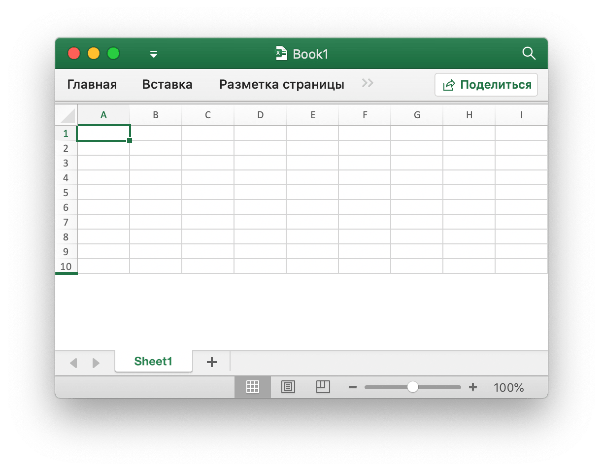
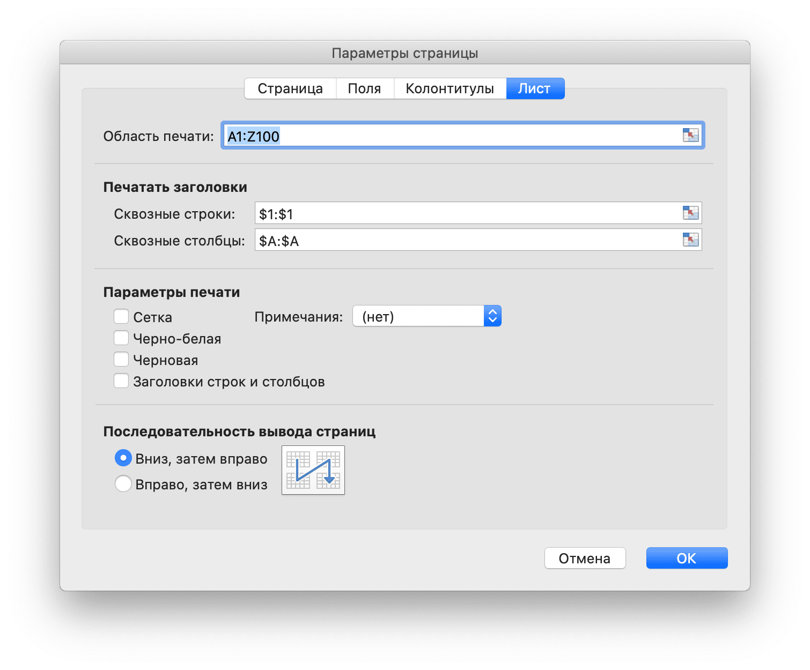

# Рабочая книга

`Options` определяет параметры для открытой электронной таблицы.

```go
type Options struct {
    Password          string
    RawCellValue      bool
    UnzipSizeLimit    int64
    UnzipXMLSizeLimit int64
}
```

`Password` указывает пароль электронной таблицы в виде обычного текста.

RawCellValue указывает, применять ли числовой формат для значения ячейки или получить необработанное значение.

`UnzipSizeLimit` указывает предел размера распакованного архива в байтах при открытии электронной таблицы, это значение должно быть больше или равно `UnzipXMLSizeLimit`, ограничение размера по умолчанию составляет 16ГБ.

`UnzipXMLSizeLimit` указывает предел памяти при распаковке рабочего листа в байтах, XML рабочего листа будет извлечен во временный каталог системы, когда размер файла превышает это значение, это значение должно быть меньше или равно `UnzipSizeLimit`, значение по умолчанию - 16МБ.

## Создать документ Excel {#NewFile}

```go
func NewFile() *File
```

NewFile предоставляет функцию для создания нового файла по умолчанию. Вновь созданная рабочая книга по умолчанию будет содержать таблицу с именем `Sheet1`. Например:

## Открыть {#OpenFile}

```go
func OpenFile(filename string, opt ...Options) (*File, error)
```

OpenFile берет имя файла электронной таблицы и возвращает для него заполненную структуру файла электронной таблицы. Например, откройте электронную таблицу с защитой паролем:

```go
f, err := excelize.OpenFile("Book1.xlsx", excelize.Options{Password: "password"})
if err != nil {
    return
}
```

Обратите внимание, что Excelize в настоящее время поддерживает только расшифровку и не поддерживает шифрование, электронная таблица, сохраненная с помощью [`Save()`](workbook.md#Save) и [`SaveAs()`](workbook.md#SaveAs), не будет защищена паролем. Закройте файл с помощью [`Close()`](workbook.md#Close) после открытия электронной таблицы.

## Открытый поток данных {#OpenReader}

```go
func OpenReader(r io.Reader, opt ...Options) (*File, error)
```

OpenReader считывает поток данных из `io.Reader` и возвращает заполненный файл электронной таблицы.

Например, создайте HTTP-сервер для обработки загружаемого шаблона, а затем загрузите ответный файл с новым рабочим листом:

```go
package main

import (
    "fmt"
    "net/http"

    "github.com/xuri/excelize/v2"
)

func process(w http.ResponseWriter, req *http.Request) {
    file, _, err := req.FormFile("file")
    if err != nil {
        fmt.Fprintf(w, err.Error())
        return
    }
    defer file.Close()
    f, err := excelize.OpenReader(file)
    if err != nil {
        fmt.Fprintf(w, err.Error())
        return
    }
    f.NewSheet("NewSheet")
    w.Header().Set("Content-Disposition", "attachment; filename=Book1.xlsx")
    w.Header().Set("Content-Type", req.Header.Get("Content-Type"))
    if _, err := f.WriteTo(w); err != nil {
        fmt.Fprintf(w, err.Error())
    }
    return
}

func main() {
    http.HandleFunc("/process", process)
    http.ListenAndServe(":8090", nil)
}
```

Тест с cURL:

```bash
curl --location --request GET 'http://127.0.0.1:8090/process' \
--form 'file=@/tmp/template.xlsx' -O -J
curl: Saved to filename 'Book1.xlsx'
```

## Сохранить {#Save}

```go
func (f *File) Save() error
```

Save предоставляет функцию для переопределения файла xlsx с исходным путем.

## Сохранить как {#SaveAs}

```go
func (f *File) SaveAs(name string) error
```

SaveAs предоставляет функцию для создания или обновления файла xlsx по предоставленному пути.

## Закрыть книгу {#Close}

```go
func (f *File) Close() error
```

Close закрывает и очищает открытый временный файл для электронной таблицы.

## Создать рабочий лист {#NewSheet}

```go
func (f *File) NewSheet(name string) int
```

NewSheet предоставляет функцию для создания нового листа по заданному имени рабочего листа и возвращает индекс листов в книге (электронной таблице) после его добавления. Обратите внимание, что при создании нового файла электронной таблицы будет создан рабочий лист по умолчанию с именем `Sheet1`.

## Удалить рабочий лист {#DeleteSheet}

```go
func (f *File) DeleteSheet(name string)
```

DeleteSheet предоставляет функцию для удаления рабочего листа в рабочей книге с помощью заданного имени листа. Используйте этот метод с осторожностью, что повлияет на изменения в ссылках, таких как формулы, диаграммы и т. Д. Если есть какое-либо ссылочное значение удаленного листа, это приведет к ошибке файла при его открытии. Эта функция будет недействительной, если останется только один лист.

## Лист копирования {#CopySheet}

```go
func (f *File) CopySheet(from, to int) error
```

CopySheet предоставляет функцию для дублирования рабочего листа путем указания индекса источника и целевого листа. Обратите внимание, что в настоящее время не поддерживается дублирование книг, содержащих таблицы, диаграммы или изображения. Например:

```go
// Sheet1 уже существует...
index := f.NewSheet("Sheet2")
err := f.CopySheet(1, index)
return err
```

## Рабочие листы группы {#GroupSheets}

```go
func (f *File) GroupSheets(sheets []string) error
```

GroupSheets предоставляет функцию для группировки листов по заданным именам листов. Рабочие листы групп должны содержать активный рабочий лист.

## Разгруппировать листы {#UngroupSheets}

```go
func (f *File) UngroupSheets() error
```

UngroupSheets предоставляет функцию для разгруппировки листов.

## Фон рабочего листа {#SetSheetBackground}

```go
func (f *File) SetSheetBackground(sheet, picture string) error
```

SetSheetBackground предоставляет функцию для установки фонового изображения с помощью имени рабочего листа.

## Установить рабочий лист по умолчанию {#SetActiveSheet}

```go
func (f *File) SetActiveSheet(index int)
```

SetActiveSheet предоставляет функцию для установки активного листа книги по умолчанию по заданному индексу. Обратите внимание, что активный индекс отличается от идентификатора, возвращаемого функцией [`GetSheetMap`](sheet.md#GetSheetMap). Оно должно быть больше или равно `0` и меньше общего числа листов.

## Получить активный индекс листа {#GetActiveSheetIndex}

```go
func (f *File) GetActiveSheetIndex() int
```

GetActiveSheetIndex предоставляет функцию для получения активного листа XLSX. Если не найден, активный лист вернет целое число `0`.

## Сделать лист видимым {#SetSheetVisible}

```go
func (f *File) SetSheetVisible(name string, visible bool) error
```

SetSheetVisible предоставляет функцию для установки рабочего листа, видимого по заданному имени рабочего листа. Рабочая книга должна содержать хотя бы одну видимую рабочую таблицу. Если данный лист был активирован, этот параметр будет недействительным. Значения состояния листа, как определено [SheetStateValues Enum](https://docs.microsoft.com/ru-ru/dotnet/api/documentformat.openxml.spreadsheet.sheetstatevalues?view=openxml-2.8.1):

|Лист Государственные ценности|
|---|
|visible|
|hidden|
|veryHidden|

Например, скрыть `Sheet1`:

```go
err := f.SetSheetVisible("Sheet1", false)
```

## Получить рабочий лист видимым {#GetSheetVisible}

```go
func (f *File) GetSheetVisible(name string) bool
```

GetSheetVisible предоставляет функцию для отображения рабочего листа по заданному имени. Например, получить видимое состояние `Sheet1`:

```go
f.GetSheetVisible("Sheet1")
```

## Установить свойства формата листа {#SetSheetFormatPr}

```go
func (f *File) SetSheetFormatPr(sheet string, opts ...SheetFormatPrOptions) error
```

SetSheetFormatPr предоставляет функцию для установки свойств форматирования листа.

Доступные Варианты:

Необязательный параметр формата | Тип
---|---
BaseColWidth | uint8
DefaultColWidth | float64
DefaultRowHeight | float64
CustomHeight | bool
ZeroHeight | bool
ThickTop | bool
ThickBottom | bool

Например, сделать строки на листе по умолчанию скрытыми:

<p align="center"></p>

```go
f := excelize.NewFile()
const sheet = "Sheet1"
if err := f.SetSheetFormatPr("Sheet1", excelize.ZeroHeight(true)); err != nil {
    fmt.Println(err)
}
if err := f.SetRowVisible("Sheet1", 10, true); err != nil {
    fmt.Println(err)
}
f.SaveAs("Book1.xlsx")
```

## Получить свойства формата листа {#GetSheetFormatPr}

```go
func (f *File) GetSheetFormatPr(sheet string, opts ...SheetFormatPrOptionsPtr) error
```

GetSheetFormatPr предоставляет функцию для получения свойств форматирования листа.

Доступные Варианты:

Необязательный параметр формата | Тип
---|---
BaseColWidth | uint8
DefaultColWidth | float64
DefaultRowHeight | float64
CustomHeight | bool
ZeroHeight | bool
ThickTop | bool
ThickBottom | bool

Например:

```go
f := excelize.NewFile()
const sheet = "Sheet1"

var (
    baseColWidth     excelize.BaseColWidth
    defaultColWidth  excelize.DefaultColWidth
    defaultRowHeight excelize.DefaultRowHeight
    customHeight     excelize.CustomHeight
    zeroHeight       excelize.ZeroHeight
    thickTop         excelize.ThickTop
    thickBottom      excelize.ThickBottom
)

if err := f.GetSheetFormatPr(sheet,
    &baseColWidth,
    &defaultColWidth,
    &defaultRowHeight,
    &customHeight,
    &zeroHeight,
    &thickTop,
    &thickBottom,
); err != nil {
    fmt.Println(err)
}
fmt.Println("Defaults:")
fmt.Println("- baseColWidth:", baseColWidth)
fmt.Println("- defaultColWidth:", defaultColWidth)
fmt.Println("- defaultRowHeight:", defaultRowHeight)
fmt.Println("- customHeight:", customHeight)
fmt.Println("- zeroHeight:", zeroHeight)
fmt.Println("- thickTop:", thickTop)
fmt.Println("- thickBottom:", thickBottom)
```

вывод:

```text
Defaults:
- baseColWidth: 0
- defaultColWidth: 0
- defaultRowHeight: 15
- customHeight: false
- zeroHeight: false
- thickTop: false
- thickBottom: false
```

## Задать свойства представления листа {#SetSheetViewOptions}

```go
func (f *File) SetSheetViewOptions(name string, viewIndex int, opts ...SheetViewOption) error
```

SetSheetViewOptions устанавливает параметры просмотра листа. `viewIndex` может быть отрицательным и, если это так, считается обратным (`-1` - последний вид). Доступные Варианты:

Необязательный параметр просмотра|Тип
---|---
DefaultGridColor | bool
ShowFormulas | bool
ShowGridLines | bool
ShowRowColHeaders | bool
ShowZeros | bool
RightToLeft | bool
ShowRuler | bool
View | string
TopLeftCell | string
ZoomScale | float64

- Пример 1:

```go
err = f.SetSheetViewOptions("Sheet1", -1, ShowGridLines(false))
```

- Пример 2:

```go
f := excelize.NewFile()
const sheet = "Sheet1"

if err := f.SetSheetViewOptions(sheet, 0,
    excelize.DefaultGridColor(false),
    excelize.ShowFormulas(true),
    excelize.ShowGridLines(true),
    excelize.ShowRowColHeaders(true),
    excelize.RightToLeft(false),
    excelize.ShowRuler(false),
    excelize.View("pageLayout"),
    excelize.TopLeftCell("C3"),
    excelize.ZoomScale(80),
); err != nil {
    fmt.Println(err)
}

var zoomScale ZoomScale
fmt.Println("Default:")
fmt.Println("- zoomScale: 80")

if err := f.SetSheetViewOptions(sheet, 0, excelize.ZoomScale(500)); err != nil {
    fmt.Println(err)
}

if err := f.GetSheetViewOptions(sheet, 0, &zoomScale); err != nil {
    fmt.Println(err)
}

fmt.Println("Used out of range value:")
fmt.Println("- zoomScale:", zoomScale)

if err := f.SetSheetViewOptions(sheet, 0, excelize.ZoomScale(123)); err != nil {
    fmt.Println(err)
}

if err := f.GetSheetViewOptions(sheet, 0, &zoomScale); err != nil {
    fmt.Println(err)
}

fmt.Println("Used correct value:")
fmt.Println("- zoomScale:", zoomScale)
```

вывод:

```text
Default:
- zoomScale: 80
Used out of range value:
- zoomScale: 80
Used correct value:
- zoomScale: 123
```

## Получить свойства вида листа {#GetSheetViewOptions}

```go
func (f *File) GetSheetViewOptions(name string, viewIndex int, opts ...SheetViewOptionPtr) error
```

GetSheetViewOptions получает значение параметров просмотра листа. `viewIndex` может быть отрицательным, и если это так отсчитывается в обратном направлении (`-1` это последний вид). Доступные Варианты:

Необязательный параметр просмотра|Тип
---|---
DefaultGridColor | bool
ShowFormulas | bool
ShowGridLines | bool
ShowRowColHeaders | bool
ShowZeros | bool
RightToLeft | bool
ShowRuler | bool
View | string
TopLeftCell | string
ZoomScale | float64

- Пример 1, чтобы получить параметры свойства сетки для последнего представления на листе с именем `Sheet1`:

```go
var showGridLines excelize.ShowGridLines
err = f.GetSheetViewOptions("Sheet1", -1, &showGridLines)
```

- Пример 2:

```go
f := NewFile()
const sheet = "Sheet1"

var (
    defaultGridColor  excelize.DefaultGridColor
    showFormulas      excelize.ShowFormulas
    showGridLines     excelize.ShowGridLines
    showRowColHeaders excelize.ShowRowColHeaders
    showZeros         excelize.ShowZeros
    rightToLeft       excelize.RightToLeft
    showRuler         excelize.ShowRuler
    view              excelize.View
    topLeftCell       excelize.TopLeftCell
    zoomScale         excelize.ZoomScale
)

if err := f.GetSheetViewOptions(sheet, 0,
    &defaultGridColor,
    &showFormulas,
    &showGridLines,
    &showRowColHeaders,
    &showZeros,
    &rightToLeft,
    &showRuler,
    &view,
    &topLeftCell,
    &zoomScale,
); err != nil {
    fmt.Println(err)
}

fmt.Println("Default:")
fmt.Println("- defaultGridColor:", defaultGridColor)
fmt.Println("- showFormulas:", showFormulas)
fmt.Println("- showGridLines:", showGridLines)
fmt.Println("- showRowColHeaders:", showRowColHeaders)
fmt.Println("- showZeros:", showZeros)
fmt.Println("- rightToLeft:", rightToLeft)
fmt.Println("- showRuler:", showRuler)
fmt.Println("- view:", view)
fmt.Println("- topLeftCell:", `"`+topLeftCell+`"`)
fmt.Println("- zoomScale:", zoomScale)

if err := f.SetSheetViewOptions(sheet, 0, excelize.ShowGridLines(false)); err != nil {
    fmt.Println(err)
}

if err := f.GetSheetViewOptions(sheet, 0, &showGridLines); err != nil {
    fmt.Println(err)
}

if err := f.SetSheetViewOptions(sheet, 0, excelize.ShowZeros(false)); err != nil {
    fmt.Println(err)
}

if err := f.GetSheetViewOptions(sheet, 0, &showZeros); err != nil {
    fmt.Println(err)
}

if err := f.SetSheetViewOptions(sheet, 0, excelize.View("pageLayout")); err != nil {
    fmt.Println(err)
}

if err := f.GetSheetViewOptions(sheet, 0, &view); err != nil {
    fmt.Println(err)
}

if err := f.SetSheetViewOptions(sheet, 0, excelize.TopLeftCell("B2")); err != nil {
    fmt.Println(err)
}

if err := f.GetSheetViewOptions(sheet, 0, &topLeftCell); err != nil {
    fmt.Println(err)
}

fmt.Println("After change:")
fmt.Println("- showGridLines:", showGridLines)
fmt.Println("- showZeros:", showZeros)
fmt.Println("- view:", view)
fmt.Println("- topLeftCell:", topLeftCell)
```

вывод:

```text
Default:
- defaultGridColor: true
- showFormulas: false
- showGridLines: true
- showRowColHeaders: true
- showZeros: true
- rightToLeft: false
- showRuler: true
- view: normal
- topLeftCell: ""
- zoomScale: 0
After change:
- showGridLines: false
- showZeros: false
- view: pageLayout
- topLeftCell: B2
```

## Установить макет страницы листа {#SetPageLayout}

```go
func (f *File) SetPageLayout(sheet string, opts ...PageLayoutOption) error
```

SetPageLayout предоставляет функцию для установки макета страницы листа Доступные Варианты:

- `BlackAndWhite` указывает печать черно-белую.

- `FirstPageNumber` указывает номер первой напечатанной страницы. Если значение не указано, предполагается "автоматический".

- `PageLayoutOrientation` предоставляет метод для установки ориентации листа, по умолчанию это "portrait". Ниже показаны параметры ориентации, поддерживаемые индексным номером Excelize:

Параметр | Ориентация
---|---
OrientationPortrait|portrait
OrientationLandscape|landscape

- `PageLayoutPaperSize` предоставляет метод для установки размера бумаги на листе, по умолчанию размер листа составляет "Letter 8S × 11 дюймов". Ниже показан формат бумаги, отсортированный по номеру индекса Excelize:

Индекс | Размер бумаги
---|---
1   | Letter paper (8.5 in. × 11 in.)
2   | Letter small paper (8.5 in. × 11 in.)
3   | Tabloid paper (11 in. × 17 in.)
4   | Ledger paper (17 in. × 11 in.)
5   | Legal paper (8.5 in. × 14 in.)
6   | Statement paper (5.5 in. × 8.5 in.)
7   | Executive paper (7.25 in. × 10.5 in.)
8   | A3 paper (297 mm × 420 mm)
9   | A4 paper (210 mm × 297 mm)
10  | A4 small paper (210 mm × 297 mm)
11  | A5 paper (148 mm × 210 mm)
12  | B4 paper (250 mm × 353 mm)
13  | B5 paper (176 mm × 250 mm)
14  | Folio paper (8.5 in. × 13 in.)
15  | Quarto paper (215 mm × 275 mm)
16  | Standard paper (10 in. × 14 in.)
17  | Standard paper (11 in. × 17 in.)
18  | Note paper (8.5 in. × 11 in.)
19  | #9 envelope (3.875 in. × 8.875 in.)
20  | #10 envelope (4.125 in. × 9.5 in.)
21  | #11 envelope (4.5 in. × 10.375 in.)
22  | #12 envelope (4.75 in. × 11 in.)
23  | #14 envelope (5 in. × 11.5 in.)
24  | C paper (17 in. × 22 in.)
25  | D paper (22 in. × 34 in.)
26  | E paper (34 in. × 44 in.)
27  | DL envelope (110 mm × 220 mm)
28  | C5 envelope (162 mm × 229 mm)
29  | C3 envelope (324 mm × 458 mm)
30  | C4 envelope (229 mm × 324 mm)
31  | C6 envelope (114 mm × 162 mm)
32  | C65 envelope (114 mm × 229 mm)
33  | B4 envelope (250 mm × 353 mm)
34  | B5 envelope (176 mm × 250 mm)
35  | B6 envelope (176 mm × 125 mm)
36  | Italy envelope (110 mm × 230 mm)
37  | Monarch envelope (3.875 in. × 7.5 in.).
38  | 6¾ envelope (3.625 in. × 6.5 in.)
39  | US standard fanfold (14.875 in. × 11 in.)
40  | German standard fanfold (8.5 in. × 12 in.)
41  | German legal fanfold (8.5 in. × 13 in.)
42  | ISO B4 (250 mm × 353 mm)
43  | Japanese postcard (100 mm × 148 mm)
44  | Standard paper (9 in. × 11 in.)
45  | Standard paper (10 in. × 11 in.)
46  | Standard paper (15 in. × 11 in.)
47  | Invite envelope (220 mm × 220 mm)
50  | Letter extra paper (9.275 in. × 12 in.)
51  | Legal extra paper (9.275 in. × 15 in.)
52  | Tabloid extra paper (11.69 in. × 18 in.)
53  | A4 extra paper (236 mm × 322 mm)
54  | Letter transverse paper (8.275 in. × 11 in.)
55  | A4 transverse paper (210 mm × 297 mm)
56  | Letter extra transverse paper (9.275 in. × 12 in.)
57  | SuperA/SuperA/A4 paper (227 mm × 356 mm)
58  | SuperB/SuperB/A3 paper (305 mm × 487 mm)
59  | Letter plus paper (8.5 in. × 12.69 in.)
60  | A4 plus paper (210 mm × 330 mm)
61  | A5 transverse paper (148 mm × 210 mm)
62  | JIS B5 transverse paper (182 mm × 257 mm)
63  | A3 extra paper (322 mm × 445 mm)
64  | A5 extra paper (174 mm × 235 mm)
65  | ISO B5 extra paper (201 mm × 276 mm)
66  | A2 paper (420 mm × 594 mm)
67  | A3 transverse paper (297 mm × 420 mm)
68  | A3 extra transverse paper (322 mm × 445 mm)
69  | Japanese Double Postcard (200 mm × 148 mm)
70  | A6 (105 mm × 148 mm)
71  | Japanese Envelope Kaku #2
72  | Japanese Envelope Kaku #3
73  | Japanese Envelope Chou #3
74  | Japanese Envelope Chou #4
75  | Letter Rotated (11 × 8½ in.)
76  | A3 Rotated (420 mm × 297 mm)
77  | A4 Rotated (297 mm × 210 mm)
78  | A5 Rotated (210 mm × 148 mm)
79  | B4 (JIS) Rotated (364 mm × 257 mm)
80  | B5 (JIS) Rotated (257 mm × 182 mm)
81  | Japanese Postcard Rotated (148 mm × 100 mm)
82  | Double Japanese Postcard Rotated (148 mm × 200 mm)
83  | A6 Rotated (148 mm × 105 mm)
84  | Japanese Envelope Kaku #2 Rotated
85  | Japanese Envelope Kaku #3 Rotated
86  | Japanese Envelope Chou #3 Rotated
87  | Japanese Envelope Chou #4 Rotated
88  | B6 (JIS) (128 mm × 182 mm)
89  | B6 (JIS) Rotated (182 mm × 128 mm)
90  | (12 in × 11 in)
91  | Japanese Envelope You #4
92  | Japanese Envelope You #4 Rotated
93  | PRC 16K (146 mm × 215 mm)
94  | PRC 32K (97 mm × 151 mm)
95  | PRC 32K(Big) (97 mm × 151 mm)
96  | PRC Envelope #1 (102 mm × 165 mm)
97  | PRC Envelope #2 (102 mm × 176 mm)
98  | PRC Envelope #3 (125 mm × 176 mm)
99  | PRC Envelope #4 (110 mm × 208 mm)
100 | PRC Envelope #5 (110 mm × 220 mm)
101 | PRC Envelope #6 (120 mm × 230 mm)
102 | PRC Envelope #7 (160 mm × 230 mm)
103 | PRC Envelope #8 (120 mm × 309 mm)
104 | PRC Envelope #9 (229 mm × 324 mm)
105 | PRC Envelope #10 (324 mm × 458 mm)
106 | PRC 16K Rotated
107 | PRC 32K Rotated
108 | PRC 32K(Big) Rotated
109 | PRC Envelope #1 Rotated (165 mm × 102 mm)
110 | PRC Envelope #2 Rotated (176 mm × 102 mm)
111 | PRC Envelope #3 Rotated (176 mm × 125 mm)
112 | PRC Envelope #4 Rotated (208 mm × 110 mm)
113 | PRC Envelope #5 Rotated (220 mm × 110 mm)
114 | PRC Envelope #6 Rotated (230 mm × 120 mm)
115 | PRC Envelope #7 Rotated (230 mm × 160 mm)
116 | PRC Envelope #8 Rotated (309 mm × 120 mm)
117 | PRC Envelope #9 Rotated (324 mm × 229 mm)
118 | PRC Envelope #10 Rotated (458 mm × 324 mm)

- `FitToHeight` указывает количество вертикальных страниц, на которых можно разместить.

- `FitToWidth` указывает количество горизонтальных страниц для размещения.

- `PageLayoutScale` определяет масштаб печати. Этот атрибут ограничен значениями от 10 (10%) до 400 (400%). Этот параметр отменяется при использовании FitToWidth и / или FitToHeight.

- Например, установите макет страницы для `Sheet1` с черно-белой печатью, номер первой напечатанной страницы от `2`, альбомная ориентация на маленькую бумагу A4 (210 мм на 297 мм), 2 вертикальные страницы для размещения на них, 2 горизонтальные страницы для размещения включено и масштабирование печати 50%:

```go
f := excelize.NewFile()
if err := f.SetPageLayout(
    "Sheet1",
    excelize.BlackAndWhite(true),
    excelize.FirstPageNumber(2),
    excelize.PageLayoutOrientation(excelize.OrientationLandscape),
    excelize.PageLayoutPaperSize(10),
    excelize.FitToHeight(2),
    excelize.FitToWidth(2),
    excelize.PageLayoutScale(50),
); err != nil {
    fmt.Println(err)
}
```

## Получить макет страницы листа {#GetPageLayout}

```go
func (f *File) GetPageLayout(sheet string, opts ...PageLayoutOptionPtr) error
```

GetPageLayout предоставляет функцию для получения макета страницы рабочего листа. Доступные Варианты:

- `PageLayoutOrientation` предоставляет метод для получения ориентации листа
- `PageLayoutPaperSize` предоставляет метод для получения размера листа

- Например, получить макет страницы `Sheet1`:

```go
f := excelize.NewFile()
const sheet = "Sheet1"
var (
    orientation excelize.PageLayoutOrientation
    paperSize   excelize.PageLayoutPaperSize
)
if err := f.GetPageLayout("Sheet1", &orientation); err != nil {
    fmt.Println(err)
}
if err := f.GetPageLayout("Sheet1", &paperSize); err != nil {
    fmt.Println(err)
}
fmt.Println("Defaults:")
fmt.Printf("- orientation: %q\n", orientation)
fmt.Printf("- paper size: %d\n", paperSize)
```

Вывод:

```text
Defaults:
- orientation: "portrait"
- paper size: 1
```

## Задать поля страницы листа {#SetPageMargins}

```go
func (f *File) SetPageMargins(sheet string, opts ...PageMarginsOptions) error
```

SetPageMargins предоставляет функцию для установки полей страницы рабочего листа. Доступные Варианты:

Параметры|Тип
---|---
PageMarginBotom|float64
PageMarginFooter|float64
PageMarginHeader|float64
PageMarginLeft|float64
PageMarginRight|float64
PageMarginTop|float64

- Например, установите поля страницы `Sheet1`:

```go
f := excelize.NewFile()
const sheet = "Sheet1"

if err := f.SetPageMargins(sheet,
    excelize.PageMarginBottom(1.0),
    excelize.PageMarginFooter(1.0),
    excelize.PageMarginHeader(1.0),
    excelize.PageMarginLeft(1.0),
    excelize.PageMarginRight(1.0),
    excelize.PageMarginTop(1.0),
); err != nil {
    fmt.Println(err)
}
```

## Получить поля страницы листа {#GetPageMargins}

```go
func (f *File) GetPageMargins(sheet string, opts ...PageMarginsOptionsPtr) error
```

GetPageMargins предоставляет функцию для получения полей страницы рабочего листа. Доступные Варианты:

Параметры|Тип
---|---
PageMarginBotom|float64
PageMarginFooter|float64
PageMarginHeader|float64
PageMarginLeft|float64
PageMarginRight|float64
PageMarginTop|float64

- Например, получить поля страницы `Sheet1`:

```go
f := excelize.NewFile()
const sheet = "Sheet1"

var (
    marginBottom excelize.PageMarginBottom
    marginFooter excelize.PageMarginFooter
    marginHeader excelize.PageMarginHeader
    marginLeft   excelize.PageMarginLeft
    marginRight  excelize.PageMarginRight
    marginTop    excelize.PageMarginTop
)

if err := f.GetPageMargins(sheet,
    &marginBottom,
    &marginFooter,
    &marginHeader,
    &marginLeft,
    &marginRight,
    &marginTop,
); err != nil {
    fmt.Println(err)
}
fmt.Println("Defaults:")
fmt.Println("- marginBottom:", marginBottom)
fmt.Println("- marginFooter:", marginFooter)
fmt.Println("- marginHeader:", marginHeader)
fmt.Println("- marginLeft:", marginLeft)
fmt.Println("- marginRight:", marginRight)
fmt.Println("- marginTop:", marginTop)
```

Вывод:

```text
Defaults:
- marginBottom: 0.75
- marginFooter: 0.3
- marginHeader: 0.3
- marginLeft: 0.7
- marginRight: 0.7
- marginTop: 0.75
```

## Установить свойства книги {#SetWorkbookPrOptions}

```go
func (f *File) SetWorkbookPrOptions(opts ...WorkbookPrOption) error
```

SetWorkbookProOptions предоставляет функцию для установки свойств книги. Доступные Варианты:

Параметры|Тип
---|---
CodeName|string

Например, задайте свойства для книги:

```go
f := excelize.NewFile()
if err := f.SetWorkbookPrOptions(
    excelize.CodeName("code"),
); err != nil {
    fmt.Println(err)
}
```

## Получить свойства книги {#GetWorkbookPrOptions}

```go
func (f *File) GetWorkbookPrOptions(opts ...WorkbookPrOptionPtr) error
```

GetWorkbookProOptions предоставляет функцию для получения свойств книги. Доступные Варианты:

Параметры|Тип
---|---
CodeName|string

Например, получить свойства книги:

```go
f := excelize.NewFile()
var codeName excelize.CodeName
if err := f.GetWorkbookPrOptions(&codeName); err != nil {
    fmt.Println(err)
}
fmt.Println("Defaults:")
fmt.Printf("- codeName: %q\n", codeName)
```

Вывод:

```text
Defaults:
- codeName: ""
```

## Установить верхний и нижний колонтитулы {#SetHeaderFooter}

```go
func (f *File) SetHeaderFooter(sheet string, settings *FormatHeaderFooter) error
```

SetHeaderFooter предоставляет функцию установки верхних и нижних колонтитулов по заданному имени рабочего листа и управляющим символам.

Верхние и нижние колонтитулы указываются с помощью следующих полей настроек:

Поля | Описание
---|---
AlignWithMargins | Align header footer margins with page margins
DifferentFirst   | Different first-page header and footer indicator
DifferentOddEven | Different odd and even page headers and footers indicator
ScaleWithDoc     | Scale header and footer with document scaling
OddFooter        | Odd Page Footer
OddHeader        | Odd Header
EvenFooter       | Even Page Footer
EvenHeader       | Even Page Header
FirstFooter      | First Page Footer
FirstHeader      | First Page Header

Следующие коды форматирования могут использоваться в 6 полях строкового типа: `OddHeader`, `OddFooter`, `EvenHeader`, `EvenFooter`, `FirstFooter`, `FirstHeader`

<table>
    <thead>
        <tr>
            <th>Код форматирования</th>
            <th>Описание</th>
        </tr>
    </thead>
    <tbody>
        <tr>
            <td><code>&amp;&amp;</code></td>
            <td>The character &quot;&amp;&quot;</td>
        </tr>
        <tr>
            <td><code>&amp;font-size</code></td>
            <td>Size of the text font, where font-size is a decimal font size in points</td>
        </tr>
        <tr>
            <td><code>&amp;&quot;font name,font type&quot;</code></td>
            <td>A text font-name string, font name, and a text font-type string, font type</td>
        </tr>
        <tr>
            <td><code>&amp;&quot;-,Regular&quot;</code></td>
            <td>Regular text format. Toggles bold and italic modes to off</td>
        </tr>
        <tr>
            <td><code>&amp;A</code></td>
            <td>Current worksheet&#39;s tab name</td>
        </tr>
        <tr>
            <td><code>&amp;B</code> or <code>&amp;&quot;-,Bold&quot;</code></td>
            <td>Bold text format, from off to on, or vice versa. The default mode is off</td>
        </tr>
        <tr>
            <td><code>&amp;D</code></td>
            <td>Current date</td>
        </tr>
        <tr>
            <td><code>&amp;C</code></td>
            <td>Center section</td>
        </tr>
        <tr>
            <td><code>&amp;E</code></td>
            <td>Double-underline text format</td>
        </tr>
        <tr>
            <td><code>&amp;F</code></td>
            <td>Current workbook&#39;s file name</td>
        </tr>
        <tr>
            <td><code>&amp;G</code></td>
            <td>Drawing object as background</td>
        </tr>
        <tr>
            <td><code>&amp;H</code></td>
            <td>Shadow text format</td>
        </tr>
        <tr>
            <td><code>&amp;I</code> or <code>&amp;&quot;-,Italic&quot;</code></td>
            <td>Italic text format</td>
        </tr>
        <tr>
            <td><code>&amp;K</code></td>
            <td>Text font color<br>An RGB Color is specified as RRGGBB<br>A Theme Color is specified as TTSNNN where TT is the theme color Id, S is either &quot;+&quot; or &quot;-&quot; of the tint/shade value, and NNN is the tint/shade value</td>
        </tr>
        <tr>
            <td><code>&amp;L</code></td>
            <td>Left section</td>
        </tr>
        <tr>
            <td><code>&amp;N</code></td>
            <td>Total number of pages</td>
        </tr>
        <tr>
            <td><code>&amp;O</code></td>
            <td>Outline text format</td>
        </tr>
        <tr>
            <td><code>&amp;P[[+\|-]n]</code></td>
            <td>Without the optional suffix, the current page number in decimal</td>
        </tr>
        <tr>
            <td><code>&amp;R</code></td>
            <td>Right section</td>
        </tr>
        <tr>
            <td><code>&amp;S</code></td>
            <td>Strikethrough text format</td>
        </tr>
        <tr>
            <td><code>&amp;T</code></td>
            <td>Current time</td>
        </tr>
        <tr>
            <td><code>&amp;U</code></td>
            <td>Single-underline text format. If double-underline mode is on, the next occurrence in a section specifier toggles double-underline mode to off; otherwise, it toggles single-underline mode, from off to on, or vice versa. The default mode is off</td>
        </tr>
        <tr>
            <td><code>&amp;X</code></td>
            <td>Superscript text format</td>
        </tr>
        <tr>
            <td><code>&amp;Y</code></td>
            <td>Subscript text format</td>
        </tr>
        <tr>
            <td><code>&amp;Z</code></td>
            <td>Current workbook&#39;s file path</td>
        </tr>
    </tbody>
</table>

Например:

```go
err := f.SetHeaderFooter("Sheet1", &excelize.FormatHeaderFooter{
    DifferentFirst:   true,
    DifferentOddEven: true,
    OddHeader:        "&R&P",
    OddFooter:        "&C&F",
    EvenHeader:       "&L&P",
    EvenFooter:       "&L&D&R&T",
    FirstHeader:      `&CCenter &"-,Bold"Bold&"-,Regular"HeaderU+000A&D`,
})
```

Этот пример показывает:

- Первая страница имеет свой собственный верхний и нижний колонтитулы
- Нечетные и четные страницы имеют разные верхние и нижние колонтитулы
- Номер текущей страницы в правой части заголовков нечетных страниц
- Имя файла текущей книги в центральной части нижнего колонтитула
- Номер текущей страницы в левой части заголовков четных страниц
- текущая дата в левом разделе и текущее время в правом разделе нижнего колонтитула четных страниц
- текст `Center Bold Header` в первой строке центральной части первой страницы и дата во второй строке центральной части той же страницы
- Нет нижнего колонтитула на первой странице

## Установить определенное имя {#SetDefinedName}

```go
func (f *File) SetDefinedName(definedName *DefinedName) error
```

SetDefinedName предоставляет функцию для установки определенных имен рабочей книги или рабочего листа. Если не указано scopr, областью по умолчанию является книга. Например:

```go
f.SetDefinedName(&excelize.DefinedName{
    Name:     "Amount",
    RefersTo: "Sheet1!$A$2:$D$5",
    Comment:  "defined name comment",
    Scope:    "Sheet2",
})
```

Параметры области печати и заголовков печати для рабочего листа:

<p align="center"></p>

```go
f.SetDefinedName(&excelize.DefinedName{
    Name:     "_xlnm.Print_Area",
    RefersTo: "Sheet1!$A$1:$Z$100",
    Scope:    "Sheet1",
})
f.SetDefinedName(&excelize.DefinedName{
    Name:     "_xlnm.Print_Titles",
    RefersTo: "Sheet1!$A:$A,Sheet1!$1:$1",
    Scope:    "Sheet1",
})
```

## Получить определенное имя {#GetDefinedName}

```go
func (f *File) GetDefinedName() []DefinedName
```

GetDefinedName предоставляет функцию для получения определенных имен рабочей книги или рабочего листа.

## Удалить определенное имя {#DeleteDefinedName}

```go
func (f *File) DeleteDefinedName(definedName *DefinedName) error
```

DeleteDefinedName предоставляет функцию для удаления определенных имен рабочей книги или рабочего листа. Если не указана область, областью по умолчанию является рабочая книга. Например:

```go
f.DeleteDefinedName(&excelize.DefinedName{
    Name:     "Amount",
    Scope:    "Sheet2",
})
```

## Установить свойства приложения {#SetAppProps}

```go
func (f *File) SetAppProps(appProperties *AppProperties) error
```

SetAppProps предоставляет функцию для установки свойств приложения документа. Можно установить следующие свойства:

Недвижимость   | Описание
---|---
Application       | Имя приложения, создавшего этот документ.
ScaleCrop         | Указывает режим отображения эскиза документа. Установите для этого элемента значение `true`, чтобы разрешить масштабирование миниатюры документа для отображения. Установите для этого элемента значение `false`, чтобы разрешить обрезку эскиза документа, чтобы отображались только те разделы, которые подходят для отображения.
DocSecurity       | Уровень безопасности документа как числовое значение. Безопасность документа определяется как:<br>1 - Документ защищен паролем<br>2 - Документ рекомендуется открывать только для чтения<br>3 - Документ принудительно открывается только для чтения<br>4 - документ заблокирован для аннотации
Company           | The name of a company associated with the document.
LinksUpToDate     | Указывает, актуальны ли гиперссылки в документе. Установите для этого элемента значение `true`, чтобы указать, что гиперссылки обновлены. Установите для этого элемента значение `false`, чтобы указать, что гиперссылки устарели.
HyperlinksChanged | Указывает, что одна или несколько гиперссылок в этой части были обновлены исключительно в этой части производителем. Следующий производитель, который откроет этот документ, должен обновить отношения гиперссылок новыми гиперссылками, указанными в этой части.
AppVersion        | Задает версию приложения, создавшего этот документ. Содержание этого элемента должно иметь форму XX.YYYY, где X и Y представляют собой числовые значения, в противном случае документ будет считаться несоответствующим.

Например:

```go
err := f.SetAppProps(&excelize.AppProperties{
    Application:       "Microsoft Excel",
    ScaleCrop:         true,
    DocSecurity:       3,
    Company:           "Company Name",
    LinksUpToDate:     true,
    HyperlinksChanged: true,
    AppVersion:        "16.0000",
})
```

## Получить свойства приложения {#GetAppProps}

```go
func (f *File) GetAppProps() (ret *AppProperties, err error)
```

GetAppProps предоставляет функцию для получения свойств приложения документа.

## Установить свойства документа {#SetDocProps}

```go
func (f *File) SetDocProps(docProperties *DocProperties) error
```

SetDocProps предоставляет функцию для установки основных свойств документа. Свойства, которые можно установить:

Недвижимость   | Описание
---|---
Title          | Название, данное ресурсу.
Subject        | Тема о содержании ресурса.
Creator        | Сущность, в первую очередь ответственная за создание контента ресурса.
Keywords       | Набор ключевых слов с разделителями для поддержки поиска и индексации. Обычно это список терминов, которые недоступны в других местах свойств.
Description    | Разъяснение содержания ресурса.
LastModifiedBy | Пользователь, который выполнил последнюю модификацию. Идентификация зависит от окружающей среды.
Language       | Язык интеллектуального содержания ресурса.
Identifier     | Однозначная ссылка на ресурс в данном контексте.
Revision       | Тема о содержании ресурса.
ContentStatus  | Статус контента. Например: значения могут включать `Draft`, `Reviewed` и `Final`
Category       | Категоризация содержимого этого пакета.
Version        | Номер версии. Это значение задается пользователем или приложением.

Например:

```go
err := f.SetDocProps(&excelize.DocProperties{
    Category:       "category",
    ContentStatus:  "Draft",
    Created:        "2019-06-04T22:00:10Z",
    Creator:        "Go Excelize",
    Description:    "This file created by Go Excelize",
    Identifier:     "xlsx",
    Keywords:       "Spreadsheet",
    LastModifiedBy: "Go Author",
    Modified:       "2019-06-04T22:00:10Z",
    Revision:       "0",
    Subject:        "Test Subject",
    Title:          "Test Title",
    Language:       "en-US",
    Version:        "1.0.0",
})
```

## Получить свойства документа {#GetDocProps}

```go
func (f *File) GetDocProps() (*DocProperties, error)
```

GetDocProps предоставляет функцию для получения основных свойств документа.
