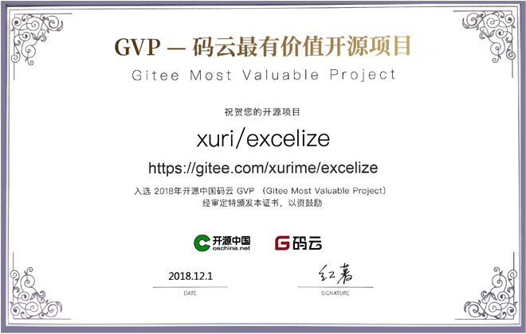

# 简介

Excelize 是 Go 语言编写的用于操作 Office Excel 文档基础库，基于 ECMA-376，ISO/IEC 29500 国际标准。可以使用它来读取、写入由 Microsoft Excel&trade; 2007 及以上版本创建的电子表格文档。支持 XLAM / XLSM / XLSX / XLTM / XLTX 等多种文档格式，高度兼容带有样式、图片(表)、透视表、切片器等复杂组件的文档，并提供流式读写 API，用于处理包含大规模数据的工作簿。可应用于各类报表平台、云计算、边缘计算等系统。使用本类库要求使用的 Go 语言为 1.23.0 或更高版本。

- Source Code: [github.com/xuri/excelize](https://github.com/xuri/excelize)
- Issue: [github.com/xuri/excelize/issues](https://github.com/xuri/excelize/issues)
- go.dev: [pkg.go.dev/github.com/xuri/excelize/v2](https://pkg.go.dev/github.com/xuri/excelize/v2)
- 许可协议: [BSD 3-Clause](https://opensource.org/licenses/BSD-3-Clause)
- 当前版本: [v2.10.0](https://github.com/xuri/excelize/releases/latest)
- 文档更新: 2025年10月30日

## 项目使命

Excelize 的目标是创建并维护一个 Go 语言版本的 Excel 文档 API，以处理符合基于 Office Open XML（OOXML）标准的电子表格文档，借助 Excelize 您可以使用 Go 读取和写入 MS Excel 文件。

## 为什么要使用 Excelize

在一些情况下我们需要通过程序操作 Excel 文档，例如：打开读取已有 Excel 文档内容、创建新的 Excel 文档、基于已有文档（模版）生成新的 Excel 文档、向 Excel 文档中插入图片、图表和表格等元素，有时还需要跨平台实现这些操作。使用 Excelize 可以方便的满足上述需求。

## 《Excelize 权威指南》

本书基于 Excelize 基础库，从 Office 办公文档格式国际标准出发，以源代码为基础，结合大量直观的配图，循序渐进地讲解 Excelize 中的模块实现，详细解读技术标准内容和基础库的设计。主要内容包括 Excelize 开发环境准备、文档格式国际标准解读、文档数据结构建模、工作簿、工作表、单元格和行列的相关操作、复杂样式解析、图表、图片与形状的相关操作、数据验证与筛选、数据透视表、流式读写技术以及一个综合实践应用。阅读本书，具有一定 Go 语言基础，想入门 Excelize 的开发人员能够进一步系统理解 Excelize 基础库的实现细节，不具备 Go 语言开发经验的开发人员也能够快速掌握 Excelize 的设计原理。

网上购买方式：<a href="https://www.ptpress.com.cn/shopping/buy?bookId=18a2d850-6271-4727-abfe-440b4cc7b645" title="在人民邮电出版社官方网站购买《Excelize 权威指南》图书" target="_blank">人民邮电出版社</a> | <a href="https://www.epubit.com/bookDetails?id=UB88d55b2b00d26" title="在异步社区购买《Excelize 权威指南》图书" target="_blank">异步社区</a> | <a href="https://detail.tmall.com/item.htm?id=818853544894" title="在天猫商城购买《Excelize 权威指南》图书" target="_blank">天猫</a> | <a href="https://item.jd.com/14710146.html" title="在京东购买《Excelize 权威指南》图书" target="_blank">京东</a> | <a href="https://product.dangdang.com/29760497.html" title="在当当网购买《Excelize 权威指南》图书" target="_blank">当当</a> | <a href="https://www.amazon.com/Excelize权威指南-续日/dp/7115636478" title="在亚马逊购买《Excelize 权威指南》图书" target="_blank">亚马逊</a> | <a href="https://j.youzan.com/AYJQXF" title="在微店购买《Excelize 权威指南》图书" target="_blank">微店</a> | <a href="https://v.douyin.com/iMmtmks2" title="在抖音商城购买《Excelize 权威指南》图书" target="_blank">抖音</a>

## 项目荣誉

荣获 2025 上海开源创新菁英奖——[优秀开源项目奖](https://mp.weixin.qq.com/s/hmg_08mqyM5TcPIUehGj1g)

入选 2023 开源创新榜[优秀开源项目](https://cccst.org.cn/zxyw/tzgg/art/2023/art_748b3428e4184ccc825ea6de1a2d273f.html)

荣获 2022 年中国开源创新大赛[一等奖](http://www.ce.cn/cysc/tech/gd2012/202306/05/t20230605_38576356.shtml)

入选 2020 Gopher China - Go 领域明星开源项目 ([GSP](https://mp.weixin.qq.com/s/XyLAaqpN-3urYcNmM_vPeg))

入选 2018 年开源中国码云最有价值开源项目 ([Gitee Most Valuable Project](https://gitee.com/xurime/excelize))

## 知名企业用户

                                    

如果您的公司或产品也在使用 Excelize，欢迎 <a href="mailto: xuri.me@gmail.com?Subject=%E5%9C%A8%20Excelize%20%E6%96%87%E6%A1%A3%E9%A1%B5%E9%9D%A2%E6%B7%BB%E5%8A%A0%E6%88%91%E4%BB%AC%E7%9A%84%E5%85%AC%E5%8F%B8&amp;Body=%E4%BD%A0%E5%A5%BD%EF%BC%8C%E6%88%91%E6%98%AF%E3%80%90%E5%85%AC%E5%8F%B8%E5%90%8D%E7%A7%B0%E3%80%91%E7%9A%84%E3%80%90%E6%82%A8%E7%9A%84%E5%90%8D%E5%AD%97%E3%80%91%E3%80%82%0A%E6%88%91%E4%BB%AC%E5%85%AC%E5%8F%B8%E4%BD%BF%E7%94%A8%E4%BA%86%20Excelize%20%E5%B9%B6%E4%B8%94%E5%BE%88%E4%B9%90%E6%84%8F%E5%9C%A8%20Excelize%20%E7%9A%84%E2%80%9C%E4%BB%8B%E7%BB%8D%E2%80%9D%E9%A1%B5%E9%9D%A2%E5%8A%A0%E4%B8%8A%E6%88%91%E4%BB%AC%E5%85%AC%E5%8F%B8%E7%9A%84%20logo%E3%80%82%0A%E8%AF%B7%E5%9C%A8%E9%99%84%E4%BB%B6%E4%B8%AD%E6%9F%A5%E9%98%85%20logo%E3%80%82%E3%80%90%E8%AF%B7%E9%99%84%E4%B8%8A%20logo%20%E5%B9%B6%E5%8F%91%E9%80%81%E7%BB%99%20Excelize%E3%80%91%0A" title="通过 E-mail 发送 Logo">发送 Logo</a> 给我们。

## 技术交流群

- [Facebook Group](https://www.facebook.com/groups/excelize)
- [Google Group](https://groups.google.com/g/excelize)
- [Stack Overflow](https://stackoverflow.com/questions/tagged/excelize)
- [Slack Channel](https://join.slack.com/t/xuri/shared_invite/zt-eriqdkeo-wV04zcCdBiiZveFgY86Wzw)
- [Gitter](https://gitter.im/excelize/community)
- [Community on Telegram](https://t.me/excelize)
- [Community on Discord](https://discord.gg/MWV8MBQGtv)
- [Excelize Community on Microsoft Teams](https://teams.live.com/l/invite/FBA8aHkflqEj5SNzQM)
- [Line Community](http://line.me/ti/g/NFIjhfbP_g): <a href="../images/line_group@2x.png" title="Excelize Line Community" target="_blank">二维码</a>
- [钉钉技术交流群](https://qr.dingtalk.com/action/joingroup?code=v1,k1,6tmzbBbJuQkGezVdHJjsHz29CZI9F49xeW+cvOaECtk=&_dt_no_comment=1&origin=11): `30047129` | <a href="../images/dingtalk_group@2x.png" title="Excelize 钉钉技术交流群" target="_blank">二维码</a>
- QQ 技术交流群: `1302058237` (请备注: Excelize) | <a href="../images/qq_group@2x.png" title="Excelize QQ 技术交流群" target="_blank">二维码</a>
- 微信技术交流群: `hixuri` (请备注: Excelize) | <a href="../images/wechat_group@2x.png" title="Excelize 微信技术交流群" target="_blank">二维码</a>
- 企业微信技术交流群 (请备注: Excelize): <a href="../images/wecom_group@2x.png" title="Excelize 企业微信技术交流群" target="_blank">二维码</a>
- 如流技术交流群: `4375928` | <a href="../images/inflow_group@2x.png" title="如流技术交流群" target="_blank">二维码</a>
- 飞书技术交流群 (请备注: Excelize): <a href="../images/feishu_group@2x.png" title="飞书技术交流群" target="_blank">二维码</a>

## 商业支持

帮助您的应用发挥最大潜力，让使用电子表格文档变得有趣。除了提供完全免费和开源的基础库软件包之外，Excelize 还可以在商业上提供技术咨询支持服务：

- 优先考虑您的问题

有急需解决的问题或新功能需求吗？Excelize 很乐意根据商业支持为您提供优先服务，请与 Excelize 联系以获取更多详细信息。

- 专业技术咨询服务

在您的应用程序使用 Excelize 开发过程中提供技术支持，提供解决方案咨询服务，并可以按小时为基础加入您的团队。

请通过 <a href="mailto: xuri.me@gmail.com">E-mail</a> 与我们取得联系。

## 系列课程

《Go 语言 Excel 文档基础库 Excelize 基础教程》

**第一章：Excelize 介绍与基础环境配置**

[1.1 Excelize 介绍](https://www.bilibili.com/video/BV12P4y1t7WA) [1.2 macOS 与 Windows 系统搭建 Go 语言开发环境 与 Excelize 安装](https://www.bilibili.com/video/BV1JT4y1o7aR) [1.3 基本概念](https://www.bilibili.com/video/BV1vu411Z7u9)

**第二章：Excelize 基本操作**

[2.1 基本操作 - 单元格赋值、样式设置与图片图表的综合应用](https://www.bilibili.com/video/BV1hU4y1F7wQ) [2.2 基本操作 - 条件格式、批注和数据验证设置](https://www.bilibili.com/video/BV1HQ4y1Q749) [2.3 基本操作 - CSV 转 XLSX、行高列宽和富文本设置](https://www.bilibili.com/video/BV1US4y1R7t3) [2.4 基本操作 - 数据透视表、形状、公式和文档属性设置](https://www.bilibili.com/video/BV18S4y1d7v5) [2.5 基本操作 - 迷你图、页眉页脚、隐藏与保护工作表](https://www.bilibili.com/video/BV1Sr4y1k7Gf) [2.6 基本操作 - 读取工作簿、工作表、图片与公式计算](https://www.bilibili.com/video/BV1Fq4y1z7ip)

**第三章：高性能读写**

[3.1 高性能读写 - 流式生成包含大规模数据的电子表格文档](https://www.bilibili.com/video/BV1XL4y1p7gV)
