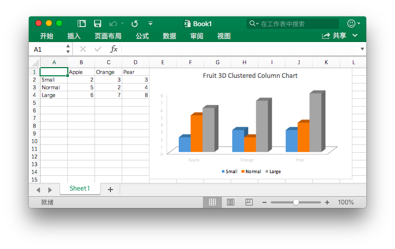

# 快速开始

## 安装 {#install}

使用最新版本 Excelize 要求您使用的 Go 语言为 1.10 或更高版本。

- 安装命令

```bash
go get github.com/360EntSecGroup-Skylar/excelize
```

- 如果您使用 [Go Modules](https://blog.golang.org/using-go-modules) 管理软件包，请使用下面的命令来安装最新版本。

```bash
go get github.com/360EntSecGroup-Skylar/excelize/v2
```

## 更新 {#update}

- 更新命令

```bash
go get -u github.com/360EntSecGroup-Skylar/excelize
```

## 创建 Excel 文档 {#NewFile}

下面是一个创建 Excel 文档的简单例子：

```go
package main

import "github.com/360EntSecGroup-Skylar/excelize"

func main() {
    f := excelize.NewFile()
    // 创建一个工作表
    index := f.NewSheet("Sheet2")
    // 设置单元格的值
    f.SetCellValue("Sheet2", "A2", "Hello world.")
    f.SetCellValue("Sheet1", "B2", 100)
    // 设置工作簿的默认工作表
    f.SetActiveSheet(index)
    // 根据指定路径保存文件
    if err := f.SaveAs("Book1.xlsx"); err != nil {
        println(err.Error())
    }
}
```

## 读取 Excel 文档 {#read}

下面是读取 Excel 文档的例子：

```go
package main

import "github.com/360EntSecGroup-Skylar/excelize"

func main() {
    f, err := excelize.OpenFile("Book1.xlsx")
    if err != nil {
        println(err.Error())
        return
    }
    // 获取工作表中指定单元格的值
    cell, err := f.GetCellValue("Sheet1", "B2")
    if err != nil {
        println(err.Error())
        return
    }
    println(cell)
    // 获取 Sheet1 上所有单元格
    rows, err := f.GetRows("Sheet1")
    for _, row := range rows {
        for _, colCell := range row {
            print(colCell, "\t")
        }
        println()
    }
}
```

## 在 Excel 文档中创建图表 {#chart}

使用 Excelize 生成图表十分简单，仅需几行代码。您可以根据工作表中的已有数据构建图表，或向工作表中添加数据并创建图表。

<p align="center"></p>

```go
package main

import "github.com/360EntSecGroup-Skylar/excelize"

func main() {
    categories := map[string]string{"A2": "Small", "A3": "Normal", "A4": "Large", "B1": "Apple", "C1": "Orange", "D1": "Pear"}
    values := map[string]int{"B2": 2, "C2": 3, "D2": 3, "B3": 5, "C3": 2, "D3": 4, "B4": 6, "C4": 7, "D4": 8}
    f := excelize.NewFile()
    for k, v := range categories {
        f.SetCellValue("Sheet1", k, v)
    }
    for k, v := range values {
        f.SetCellValue("Sheet1", k, v)
    }
    if err := f.AddChart("Sheet1", "E1", `{"type":"col3DClustered","series":[{"name":"Sheet1!$A$2","categories":"Sheet1!$B$1:$D$1","values":"Sheet1!$B$2:$D$2"},{"name":"Sheet1!$A$3","categories":"Sheet1!$B$1:$D$1","values":"Sheet1!$B$3:$D$3"},{"name":"Sheet1!$A$4","categories":"Sheet1!$B$1:$D$1","values":"Sheet1!$B$4:$D$4"}],"title":{"name":"Fruit 3D Clustered Column Chart"}}`); err != nil {
        println(err.Error())
        return
    }
    // 根据指定路径保存文件
    if err := f.SaveAs("Book1.xlsx"); err != nil {
        println(err.Error())
    }
}
```

## 向 Excel 文档中插入图片 {#image}

```go
package main

import (
    _ "image/gif"
    _ "image/jpeg"
    _ "image/png"

    "github.com/360EntSecGroup-Skylar/excelize"
)

func main() {
    f, err := excelize.OpenFile("Book1.xlsx")
    if err != nil {
        println(err.Error())
        return
    }
    // 插入图片
    if err := f.AddPicture("Sheet1", "A2", "image.png", ""); err != nil {
        println(err.Error())
    }
    // 在工作表中插入图片，并设置图片的缩放比例
    if err := f.AddPicture("Sheet1", "D2", "image.jpg", `{"x_scale": 0.5, "y_scale": 0.5}`); err != nil {
        println(err.Error())
    }
    // 在工作表中插入图片，并设置图片的打印属性
    if err := f.AddPicture("Sheet1", "H2", "image.gif", `{"x_offset": 15, "y_offset": 10, "print_obj": true, "lock_aspect_ratio": false, "locked": false}`); err != nil {
        println(err.Error())
    }
    // 保存文件
    if err = f.Save(); err != nil {
        println(err.Error())
    }
}
```