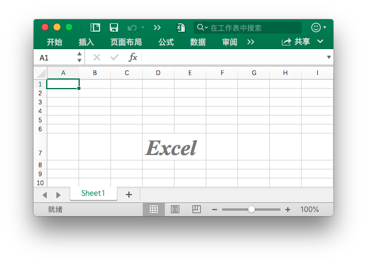

# 单元格

{{ book.info }}

`RichTextRun` 定义了富文本的属性。

```go
type RichTextRun struct {
    Font *Font
    Text string
}
```

`HyperlinkOpts` 用来指定可选的超链接属性，例如要显示的文字与屏幕提示文字。

```go
type HyperlinkOpts struct {
    Display *string
    Tooltip *string
}
```

`FormulaOpts` 用于在 [`SetCellFormula`](cell.md#SetCellFormula) 函数中指定设置特殊公式类型。

```go
type FormulaOpts struct {
    Type *string // 公式类型
    Ref  *string // 共享公式引用
}
```

## 设置单元格的值 {#SetCellValue}

```go
func (f *File) SetCellValue(sheet, cell string, value interface{}) error
```

根据给定的工作表名和单元格坐标设置单元格的值。此功能是并发安全的。指定的坐标不应在表格的第一行范围，使用字符文本设置复数。

|支持的数据类型|
|---|
|int|
|int8|
|int16|
|int32|
|int64|
|uint|
|uint8|
|uint16|
|uint32|
|uint64|
|float32|
|float64|
|string|
|[]byte|
|time.Duration|
|time.Time|
|bool|
|nil|

请注意，此函数默认为 `time.Time` 类型的单元格的值设置 `m/d/yy h:mm` 数字格式，您可通过 [`SetCellStyle`](cell.md#SetCellStyle) 更改该设置。若您需设置无法通过 Go 语言 `time.Time` 类型表示的 Excel 特殊日期，例如 1900 年 1 月 0 日或 1900 年 2 月 29 日，请先设置单元格的值为 0 或 60，再为其设置具有日期数字格式的样式。

## 设置布尔型值 {#SetCellBool}

```go
func (f *File) SetCellBool(sheet, cell string, value bool) error
```

根据给定的工作表名和单元格坐标设置布尔型单元格的值。

## 设置默认字符型值 {#SetCellDefault}

```go
func (f *File) SetCellDefault(sheet, cell, value string) error
```

根据给定的工作表名和单元格坐标设置字符型单元格的值，字符将不会进行特殊字符过滤。

## 设置整数 {#SetCellInt}

```go
func (f *File) SetCellInt(sheet, cell string, value int64) error
```

根据给定的工作表名和单元格坐标设置整数型单元格的值。

## 设置无符号整型值 {#SetCellUint}

```go
func (f *File) SetCellUint(sheet, cell string, value uint64) error
```

根据给定的工作表名和单元格坐标设置无符号整型单元格的值。

## 设置浮点数 {#SetCellFloat}

```go
func (f *File) SetCellFloat(sheet, cell string, value float64, precision, bitSize int) error
```

根据给定的工作表名、单元格坐标、浮点数、浮点数尾数部分精度和浮点数类型设置浮点型单元格的值。

## 设置字符型值 {#SetCellStr}

```go
func (f *File) SetCellStr(sheet, cell, value string) error
```

根据给定的工作表名和单元格坐标设置字符型单元格的值，字符将会进行特殊字符过滤，并且字符串的累计长度应不超过 `32767`，多余的字符将会被忽略。

## 设置单元格样式 {#SetCellStyle}

```go
func (f *File) SetCellStyle(sheet, topLeftCell, bottomRightCell string, styleID int) error
```

根据给定的工作表名、单元格坐标区域和样式索引设置单元格的值。此功能是并发安全的。样式索引可以通过 [`NewStyle`](style.md#NewStyle) 函数获取。注意，在同一个坐标区域内的 `diagonalDown` 和 `diagonalUp` 需要保持颜色一致。SetCellStyle 将覆盖单元格的已有样式，而不会将样式与已有样式叠加或合并。

- 例1，为名为 `Sheet1` 的工作表 `D7` 单元格设置边框样式：

```go
style, err := f.NewStyle(&excelize.Style{
    Border: []excelize.Border{
        {Type: "left", Color: "0000FF", Style: 3},
        {Type: "top", Color: "00FF00", Style: 4},
        {Type: "bottom", Color: "FFFF00", Style: 5},
        {Type: "right", Color: "FF0000", Style: 6},
        {Type: "diagonalDown", Color: "A020F0", Style: 8},
        {Type: "diagonalUp", Color: "A020F0", Style: 8},
    },
})
if err != nil {
    fmt.Println(err)
}
err = f.SetCellStyle("Sheet1", "D7", "D7", style)
```

<p align="center"></p>

单元格 `D7` 的四个边框被设置了不同的样式和颜色，这与调用 [`NewStyle`](style.md#NewStyle) 函数时的参数有关，需要设置不同的样式可参考该章节的文档。

- 例2，为名为 `Sheet1` 的工作表 `D7` 单元格设置渐变样式：

```go
style, err := f.NewStyle(&excelize.Style{
    Fill: excelize.Fill{Type: "gradient", Color: []string{"FFFFFF", "E0EBF5"}, Shading: 1},
})
if err != nil {
    fmt.Println(err)
}
err = f.SetCellStyle("Sheet1", "D7", "D7", style)
```

<p align="center"></p>

单元格 `D7` 被设置了渐变效果的颜色填充，渐变填充效果与调用 [`NewStyle`](style.md#NewStyle) 函数时的参数有关，需要设置不同的样式可参考该章节的文档。

- 例3，为名为 `Sheet1` 的工作表 `D7` 单元格设置纯色填充：

```go
style, err := f.NewStyle(&excelize.Style{
    Fill: excelize.Fill{Type: "pattern", Color: []string{"E0EBF5"}, Pattern: 1},
})
if err != nil {
    fmt.Println(err)
}
err = f.SetCellStyle("Sheet1", "D7", "D7", style)
```

<p align="center"></p>

单元格 `D7` 被设置了纯色填充。

- 例4，为名为 `Sheet1` 的工作表 `D7` 单元格设置字符间距与旋转角度：

```go
f.SetCellValue("Sheet1", "D7", "样式")
style, err := f.NewStyle(&excelize.Style{
    Alignment: &excelize.Alignment{
        Horizontal:      "center",
        Indent:          1,
        JustifyLastLine: true,
        ReadingOrder:    0,
        RelativeIndent:  1,
        ShrinkToFit:     true,
        TextRotation:    45,
        Vertical:        "",
        WrapText:        true,
    },
})
if err != nil {
    fmt.Println(err)
}
err = f.SetCellStyle("Sheet1", "D7", "D7", style)
```

<p align="center"></p>

- 例5，Excel 中的日期和时间用实数表示，例如 `2017/7/4  12:00:00 PM` 可以用数字 `42920.5` 来表示。为名为 `Sheet1` 的工作表 `D7` 单元格设置时间格式：

```go
f.SetCellValue("Sheet1", "D7", 42920.5)
f.SetColWidth("Sheet1", "D", "D", 13)
style, err := f.NewStyle(&excelize.Style{NumFmt: 22})
if err != nil {
    fmt.Println(err)
}
err = f.SetCellStyle("Sheet1", "D7", "D7", style)
```

<p align="center"></p>

单元格 `D7` 被设置了时间格式。注意，当应用了时间格式的单元格宽度过窄无法完整展示时会显示为 `####`，可以拖拽调整列宽或者通过调用 `SetColWidth` 函数设置列宽到合适的大小使其正常显示。

- 例6，为名为 `Sheet1` 的工作表 `D7` 单元格设置字体、字号、颜色和倾斜样式：

```go
f.SetCellValue("Sheet1", "D7", "Excel")
style, err := f.NewStyle(&excelize.Style{
    Font: &excelize.Font{
        Bold:   true,
        Italic: true,
        Family: "Times New Roman",
        Size:   36,
        Color:  "777777",
    },
})
if err != nil {
    fmt.Println(err)
}
err = f.SetCellStyle("Sheet1", "D7", "D7", style)
```

<p align="center"></p>

- 例7，锁定并隐藏名为 `Sheet1` 的工作表 `D7` 单元格：

```go
style, err := f.NewStyle(&excelize.Style{
    Protection: &excelize.Protection{
        Hidden: true,
        Locked: true,
    },
})
if err != nil {
    fmt.Println(err)
}
err = f.SetCellStyle("Sheet1", "D7", "D7", style)
```

要锁定单元格或隐藏公式，请保护工作表。在“审阅”选项卡上，单击“保护工作表”。

## 设置超链接 {#SetCellHyperLink}

```go
func (f *File) SetCellHyperLink(sheet, cell, link, linkType string, opts ...HyperlinkOpts) error
```

根据给定的工作表、单元格坐标、链接资源和资源类型设置单元格的超链接。资源类型分为外部链接地址 `External` 和工作簿内部位置链接 `Location` 两种。每个工作表中的包含最大超链接限制为 `65530` 个。该方法仅设置单元格的超链接而不影响单元格的值，若需设置单元格的值，请通过 [`SetCellStyle`](cell.md#SetCellStyle) 或 [`SetSheetRow`](sheet.md#SetSheetRow) 等函数另行设置。

- 例1，为名为 `Sheet1` 的工作表 `A3` 单元格添加外部链接：

```go
display, tooltip := "https://github.com/xuri/excelize", "Excelize on GitHub"
if err := f.SetCellHyperLink("Sheet1", "A3",
    "https://github.com/xuri/excelize", "External", excelize.HyperlinkOpts{
        Display: &display,
        Tooltip: &tooltip,
    }); err != nil {
    fmt.Println(err)
}
// 为单元格设置字体和下划线样式
style, err := f.NewStyle(&excelize.Style{
    Font: &excelize.Font{Color: "1265BE", Underline: "single"},
})
if err != nil {
    fmt.Println(err)
}
err = f.SetCellStyle("Sheet1", "A3", "A3", style)
```

- 例2，为名为 `Sheet1` 的工作表 `A3` 单元格添加内部位置链接：

```go
err := f.SetCellHyperLink("Sheet1", "A3", "Sheet1!A40", "Location")
```

## 设置富文本格式 {#SetCellRichText}

```go
func (f *File) SetCellRichText(sheet, cell string, runs []RichTextRun) error
```

根据给定的工作表、单元格坐标和富文本格式为指定单元格设置富文本。

例如，在名为 `Sheet1` 的工作表 `A1` 单元格设置富文本格式：

<p align="center"></p>

```go
package main

import (
    "fmt"

    "github.com/xuri/excelize/v2"
)

func main() {
    f := excelize.NewFile()
    defer func() {
        if err := f.Close(); err != nil {
            fmt.Println(err)
        }
    }()
    if err := f.SetRowHeight("Sheet1", 1, 35); err != nil {
        fmt.Println(err)
        return
    }
    if err := f.SetColWidth("Sheet1", "A", "A", 44); err != nil {
        fmt.Println(err)
        return
    }
    if err := f.SetCellRichText("Sheet1", "A1", []excelize.RichTextRun{
        {
            Text: "bold",
            Font: &excelize.Font{
                Bold:   true,
                Color:  "2354E8",
                Family: "Times New Roman",
            },
        },
        {
            Text: " and ",
            Font: &excelize.Font{
                Family: "Times New Roman",
            },
        },
        {
            Text: "italic ",
            Font: &excelize.Font{
                Bold:   true,
                Color:  "E83723",
                Italic: true,
                Family: "Times New Roman",
            },
        },
        {
            Text: "text with color and font-family,",
            Font: &excelize.Font{
                Bold:   true,
                Color:  "2354E8",
                Family: "Times New Roman",
            },
        },
        {
            Text: "\r\nlarge text with ",
            Font: &excelize.Font{
                Size:  14,
                Color: "AD23E8",
            },
        },
        {
            Text: "strike",
            Font: &excelize.Font{
                Color:  "E89923",
                Strike: true,
            },
        },
        {
            Text: " superscript",
            Font: &excelize.Font{
                Color:     "DBC21F",
                VertAlign: "superscript",
            },
        },
        {
            Text: " and ",
            Font: &excelize.Font{
                Size:      14,
                Color:     "AD23E8",
                VertAlign: "baseline",
            },
        },
        {
            Text: "underline",
            Font: &excelize.Font{
                Color:     "23E833",
                Underline: "single",
            },
        },
        {
            Text: " subscript.",
            Font: &excelize.Font{
                Color:     "017505",
                VertAlign: "subscript",
            },
        },
    }); err != nil {
        fmt.Println(err)
        return
    }
    style, err := f.NewStyle(&excelize.Style{
        Alignment: &excelize.Alignment{
            WrapText: true,
        },
    })
    if err != nil {
        fmt.Println(err)
        return
    }
    if err := f.SetCellStyle("Sheet1", "A1", "A1", style); err != nil {
        fmt.Println(err)
        return
    }
    if err := f.SaveAs("Book1.xlsx"); err != nil {
        fmt.Println(err)
    }
}
```

## 获取富文本格式 {#GetCellRichText}

```go
func (f *File) GetCellRichText(sheet, cell string) ([]RichTextRun, error)
```

根据给定的工作表、单元格坐标获取指定单元格的富文本格式。

## 获取单元格的值 {#GetCellValue}

```go
func (f *File) GetCellValue(sheet, cell string, opts ...Options) (string, error)
```

根据给定的工作表和单元格坐标获取单元格的值，返回值将转换为 `string` 类型。如果可以将单元格格式应用于单元格的值，将返回应用后的值，否则将返回原始值。合并区域内所有单元格的值都相同。此功能是并发安全的。

## 获取单元格数据类型 {#GetCellType}

```go
func (f *File) GetCellType(sheet, cell string) (CellType, error)
```

根据给定的工作表、单元格坐标获取指定单元格的数据类型。

## 按列获取全部单元格的值 {#GetCols}

```go
func (f *File) GetCols(sheet string, opts ...Options) ([][]string, error)
```

根据给定的工作表名按列获取该工作表上全部单元格的值，以二维数组形式返回，其中单元格的值将转换为 `string` 类型。如果可以将单元格格式应用于单元格的值，将使用应用后的值，否则将使用原始值。

例如，按列获取并遍历输出名为 `Sheet1` 的工作表上的所有单元格的值：

```go
cols, err := f.GetCols("Sheet1")
if err != nil {
    fmt.Println(err)
    return
}
for _, col := range cols {
    for _, rowCell := range col {
        fmt.Print(rowCell, "\t")
    }
    fmt.Println()
}
```

## 按行获取全部单元格的值 {#GetRows}

```go
func (f *File) GetRows(sheet string, opts ...Options) ([][]string, error)
```

根据给定的工作表名按行获取该工作表上全部单元格的值，以二维数组形式返回，其中单元格的值将转换为 `string` 类型。如果可以将单元格格式应用于单元格的值，将使用应用后的值，否则将使用原始值。GetRows 获取带有值或公式单元格的行，行尾连续为空的单元格将被跳过，每行中的单元格数目可能不同。

例如，按行获取并遍历输出名为 `Sheet1` 的工作表上的所有单元格的值：

```go
rows, err := f.GetRows("Sheet1")
if err != nil {
    fmt.Println(err)
    return
}
for _, row := range rows {
    for _, colCell := range row {
        fmt.Print(colCell, "\t")
    }
    fmt.Println()
}
```

## 获取超链接 {#GetCellHyperLink}

```go
func (f *File) GetCellHyperLink(sheet, cell string) (bool, string, error)
```

根据给定的工作表名和单元格坐标获取单元格超链接，如果该单元格存在超链接，将返回 `true` 和链接地址，否则将返回 `false` 和空的链接地址。

例如，获取名为 `Sheet1` 的工作表上坐标为 `H6` 单元格的超链接：

```go
link, target, err := f.GetCellHyperLink("Sheet1", "H6")
```

## 获取样式索引 {#GetCellStyle}

```go
func (f *File) GetCellStyle(sheet, cell string) (int, error)
```

根据给定的工作表名和单元格坐标获取单元格样式索引，获取到的索引可以在设置单元格样式时，作为调用 `SetCellStyle` 函数的参数使用。

## 合并单元格 {#MergeCell}

```go
func (f *File) MergeCell(sheet, topLeftCell, bottomRightCell string) error
```

根据给定的工作表名和单元格坐标区域合并单元格。合并区域内仅保留左上角单元格的值，其他单元格的值将被忽略。例如，合并名为 `Sheet1` 的工作表上 `D3:E9` 区域内的单元格：

```go
err := f.MergeCell("Sheet1", "D3", "E9")
```

如果给定的单元格坐标区域与已有的其他合并单元格相重叠，已有的合并单元格将会被删除。

## 取消合并单元格 {#UnmergeCell}

```go
func (f *File) UnmergeCell(sheet, topLeftCell, bottomRightCell string) error
```

根据给定的工作表名和单元格坐标区域取消合并单元格。例如，取消合并名为 `Sheet1` 的工作表上 `D3:E9` 区域内的单元格：

```go
err := f.UnmergeCell("Sheet1", "D3", "E9")
```

如果给定的单元格坐标区域包含多个合并单元格，则全部合并单元格都将被取消合并。

## 获取合并单元格 {#GetMergeCells}

根据给定的工作表名获取全部合并单元格的坐标区域和值。

```go
func (f *File) GetMergeCells(sheet string) ([]MergeCell, error)
```

### 获取合并单元格的值

```go
func (m *MergeCell) GetCellValue() string
```

GetCellValue 返回合并单元格的值。

### 获取合并单元格区域左上角单元格坐标

```go
func (m *MergeCell) GetStartAxis() string
```

GetStartAxis 返回合并单元格区域左上角单元格的坐标，例如：`C2`。

### 获取合并单元格区域右下角单元格坐标

```go
func (m *MergeCell) GetEndAxis() string
```

GetEndAxis 返回合并单元格区域右下角单元格的坐标，例如：`D4`。

## 获取图片单元格 {#GetPictureCells}

```go
func (f *File) GetPictureCells(sheet string) ([]string, error)
```

根据给定的工作表名称获取该工作表中，包含图片的全部单元格坐标。

## 添加批注 {#AddComment}

```go
func (f *File) AddComment(sheet string, comment Comment) error
```

根据给定的工作表名称、单元格坐标和样式参数（作者与文本信息）添加批注。作者信息最大长度为 255 个字符，最大文本内容长度为 32512 个字符，超出该范围的字符将会被忽略。例如，为 `Sheet1!A3` 单元格添加批注：

<p align="center"></p>

```go
err := f.AddComment("Sheet1", excelize.Comment{
    Cell:   "A3",
    Author: "Excelize",
    Paragraph: []excelize.RichTextRun{
        {Text: "Excelize: ", Font: &excelize.Font{Bold: true}},
        {Text: "This is a comment."},
    },
})
```

## 获取批注 {#GetComments}

```go
func (f *File) GetComments(sheet string) ([]Comment, error)
```

根据给定的工作表名称获取工作表中的所有单元格批注。

## 删除批注 {#DeleteComment}

```go
func (f *File) DeleteComment(sheet, cell string) error
```

根据给定的工作表名称、单元格坐标删除批注。例如，删除 `Sheet1!A30` 单元格批注：

```go
err := f.DeleteComment("Sheet1", "A30")
```

## 添加忽略错误 {#AddIgnoredErrors}

```go
func (f *File) AddIgnoredErrors(sheet, rangeRef string, ignoredErrorsType IgnoredErrorsType) error
```

根据给定的工作表名称、单元格坐标范围和错误类型忽略指定范围内单元格中的错误。例如，忽略 `Sheet1` 工作表中 `D15 C18:D19` 范围内单元格中“以文本形式存储的数字”错误：

```go
err := f.AddIgnoredErrors("Sheet1", "D15 C18:D19", excelize.IgnoredErrorsNumberStoredAsText)
```

## 设置公式 {#SetCellFormula}

```go
func (f *File) SetCellFormula(sheet, cell, formula string, opts ...FormulaOpts) error
```

根据给定的工作表名和单元格坐标设置该单元格上的公式。公式的结果可在工作表被 Office Excel 应用程序打开时计算，或通过 [CalcCellValue](cell.md#CalcCellValue) 函数计算单元格的值。若 Excel 应用程序打开工作簿后未对设置的单元格公式进行计算，请在设置公式后调用 [UpdateLinkedValue](utils.md#UpdateLinkedValue) 清除单元格缓存。

- 例1，为名为 `Sheet1` 的工作表 `A3` 单元格设置普通公式 `=SUM(A1,B1)`：

```go
err := f.SetCellFormula("Sheet1", "A3", "SUM(A1,B1)")
```

- 例2，为名为 `Sheet1` 的工作表 `A3` 单元格设置一维纵向常量数组（列数组）公式 `1;2;3`:

```go
err := f.SetCellFormula("Sheet1", "A3", "{1;2;3}")
```

- 例3，为名为 `Sheet1` 的工作表 `A3` 单元格设置一维横向常量数组（行数组）公式 `"a","b","c"`:

```go
err := f.SetCellFormula("Sheet1", "A3", "{\"a\",\"b\",\"c\"}")
```

- 例4，为名为 `Sheet1` 的工作表 `A3` 单元格设置二维常量数组公式 `{1,2;"a","b"}`:

```go
formulaType, ref := excelize.STCellFormulaTypeArray, "A3:A3"
err := f.SetCellFormula("Sheet1", "A3", "{1,2;\"a\",\"b\"}",
    excelize.FormulaOpts{Ref: &ref, Type: &formulaType})
```

- 例5，为名为 `Sheet1` 的工作表 `A3` 单元格设置区域数组公式 `A1:A2`:

```go
formulaType, ref := excelize.STCellFormulaTypeArray, "A3:A3"
err := f.SetCellFormula("Sheet1", "A3", "A1:A2",
    excelize.FormulaOpts{Ref: &ref, Type: &formulaType})
```

- 例6，为名为 `Sheet1` 的工作表 `C1:C5` 区域的单元格设置共享公式 `=A1+B1`，其中 `C1` 为主单元格:

```go
formulaType, ref := excelize.STCellFormulaTypeShared, "C1:C5"
err := f.SetCellFormula("Sheet1", "C1", "A1+B1",
    excelize.FormulaOpts{Ref: &ref, Type: &formulaType})
```

- 例7，为名为 `Sheet1` 的工作表 `C2` 单元格设置表格公式 `=SUM(Table1[[A]:[B]])`:

```go
package main

import (
    "fmt"

    "github.com/xuri/excelize/v2"
)

func main() {
    f := excelize.NewFile()
    defer func() {
        if err := f.Close(); err != nil {
            fmt.Println(err)
        }
    }()
    for idx, row := range [][]interface{}{{"A", "B", "C"}, {1, 2}} {
        if err := f.SetSheetRow("Sheet1", fmt.Sprintf("A%d", idx+1), &row); err != nil {
            fmt.Println(err)
            return
        }
    }
    if err := f.AddTable("Sheet1",
        &excelize.Table{
            Range:     "A1:C2",
            Name:      "Table1",
            StyleName: "TableStyleMedium2",
        }); err != nil {
        fmt.Println(err)
        return
    }
    formulaType := excelize.STCellFormulaTypeDataTable
    if err := f.SetCellFormula("Sheet1", "C2", "SUM(Table1[[A]:[B]])",
        excelize.FormulaOpts{Type: &formulaType}); err != nil {
        fmt.Println(err)
        return
    }
    if err := f.SaveAs("Book1.xlsx"); err != nil {
        fmt.Println(err)
    }
}
```

## 获取公式 {#GetCellFormula}

```go
func (f *File) GetCellFormula(sheet, cell string) (string, error)
```

根据给定的工作表名和单元格坐标获取该单元格上的公式。

## 计算单元格的值 {#CalcCellValue}

```go
func (f *File) CalcCellValue(sheet, cell string, opts ...Options) (string, error)
```

根据给定的工作表名和单元格坐标计算包含公式单元格的值。该方法目前正在开发中，尚未支持迭代计算、隐式交集、显式交集、数组函数、表格函数和其他部分函数。

支持的公式函数列表如下：

函数 | 描述
---|---
ABS               | 返回数字的绝对值
ACCRINT           | 返回定期支付利息的债券的应计利息
ACCRINTM          | 返回在到期日支付利息的债券的应计利息
ACOS              | 返回数字的反余弦值
ACOSH             | 返回数字的反双曲余弦值
ACOT              | 返回数字的反余切值
ACOTH             | 返回数字的双曲反余切值
AGGREGATE         | 返回列表或数据库中的聚合
ADDRESS           | 以文本形式将引用值返回到工作表的单个单元格
AMORDEGRC         | 使用折旧系数返回每个记帐期的折旧值
AMORLINC          | 返回每个记帐期的折旧值
AND               | 如果其所有参数均为 TRUE，则返回 TRUE
ARABIC            | 将罗马数字转换为阿拉伯数字
ARRAYTOTEXT       | 返回任意指定区域内的文本值的数组
ASIN              | 返回数字的反正弦值
ASINH             | 返回数字的反双曲正弦值
ATAN              | 返回数字的反正切值
ATAN2             | 返回 X 和 Y 坐标的反正切值
ATANH             | 返回数字的反双曲正切值
AVEDEV            | 返回数据点与它们的平均值的绝对偏差平均值
AVERAGE           | 返回其参数的平均值
AVERAGEA          | 返回其参数的平均值，包括数字、文本和逻辑值
AVERAGEIF         | 返回区域中满足给定条件的所有单元格的平均值（算术平均值）
AVERAGEIFS        | 返回满足多个条件的所有单元格的平均值（算术平均值）
BASE              | 将数字转换为具备给定基数 (base) 的文本表示
BESSELI           | 返回修正的贝赛耳函数 In(x)
BESSELJ           | 返回贝赛耳函数 Jn(x)
BESSELK           | 返回修正的贝赛耳函数 Kn(x)
BESSELY           | 返回贝赛耳函数 Yn(x)
BETADIST          | 返回 beta 累积分布函数
BETA.DIST         | 返回 beta 累积分布函数
BETAINV           | 返回指定 beta 分布的累积分布函数的反函数
BETA.INV          | 返回指定 beta 分布的累积分布函数的反函数
BIN2DEC           | 将二进制数转换为十进制数
BIN2HEX           | 将二进制数转换为十六进制数
BIN2OCT           | 将二进制数转换为八进制数
BINOMDIST         | 返回一元二项式分布的概率
BINOM.DIST        | 返回一元二项式分布的概率
BINOM.DIST.RANGE  | 使用二项式分布返回试验结果的概率
BINOM.INV         | 返回使累积二项式分布小于或等于临界值的最小值
BITAND            | 返回两个数的“按位与”
BITLSHIFT         | 返回左移 shift_amount 位的计算值接收数
BITOR             | 返回两个数的“按位或”
BITRSHIFT         | 返回右移 shift_amount 位的计算值接收数
BITXOR            | 返回两个数的按位“异或”
CEILING           | 将数字舍入为最接近的整数或最接近的指定基数的倍数
CEILING.MATH      | 将数字向上舍入为最接近的整数或最接近的指定基数的倍数
CEILING.PRECISE   | 将数字舍入为最接近的整数或最接近的指定基数的倍数。 无论该数字的符号如何，该数字都向上舍入
CHAR              | 返回由代码数字指定的字符
CHIDIST           | 返回 χ2 分布的单尾概率
CHIINV            | 返回 χ2 分布的单尾概率的反函数
CHITEST           | 返回独立性检验值
CHISQ.DIST        | 返回累积 beta 概率密度函数
CHISQ.DIST.RT     | 返回 χ2 分布的单尾概率
CHISQ.INV         | 返回累积 beta 概率密度函数
CHISQ.INV.RT      | 返回 χ2 分布的单尾概率的反函数
CHISQ.TEST        | 返回独立性检验值
CHOOSE            | 从值的列表中选择值
CLEAN             | 删除文本中所有非打印字符
CODE              | 返回文本字符串中第一个字符的数字代码
COLUMN            | 返回引用的列号
COLUMNS           | 返回引用中包含的列数
COMBIN            | 返回给定数目对象的组合数
COMBINA           | 返回给定数目的项目具有重复项的组合数
COMPLEX           | 将实系数和虚系数转换为复数
CONCAT            | 将多个区域和/或字符串的文本组合起来，但不提供分隔符或 IgnoreEmpty 参数
CONCATENATE       | 将几个文本项合并为一个文本项
CONFIDENCE        | 返回总体平均值的置信区间
CONFIDENCE.NORM   | 返回总体平均值的置信区间
CONFIDENCE.T      | 返回总体平均值的置信区间（使用学生 t-分布）
CONVERT           | 将数字从一种度量系统转换为另一种度量系统
CORREL            | 返回两个数据集之间的相关系数
COS               | 返回数字的余弦值
COSH              | 返回数字的双曲余弦值
COT               | 返回数字的双曲余弦值
COTH              | 返回角度的余弦值
COUNT             | 计算参数列表中数字的个数
COUNTA            | 计算参数列表中值的个数
COUNTBLANK        | 计算区域内空白单元格的数量
COUNTIF           | 计算区域内符合给定条件的单元格的数量
COUNTIFS          | 计算区域内符合多个条件的单元格的数量
COUPDAYBS         | 返回从票息期开始到结算日之间的天数
COUPDAYS          | 返回包含结算日的票息期天数
COUPDAYSNC        | 返回从结算日到下一票息支付日之间的天数
COUPNCD           | 返回结算日之后的下一个票息支付日
COUPNUM           | 返回结算日与到期日之间可支付的票息数
COUPPCD           | 返回结算日之前的上一票息支付日
COVAR             | 返回协方差（成对偏差乘积的平均值）
COVARIANCE.P      | 返回协方差（成对偏差乘积的平均值）
COVARIANCE.S      | 返回样本协方差，即两个数据集中每对数据点的偏差乘积的平均值
CRITBINOM         | 返回使累积二项式分布小于或等于临界值的最小值
CSC               | 返回角度的余割值
CSCH              | 返回角度的双曲余割值
CUMIPMT           | 返回两个付款期之间累积支付的利息
CUMPRINC          | 返回两个付款期之间为贷款累积支付的本金
DATE              | 返回特定日期的序列号
DATEDIF           | 计算两个日期之间的天数、月数或年数。 此函数在需要计算年龄的公式中很有用
DATEVALUE         | 将文本格式的日期转换为序列号
DAVERAGE          | 返回所选数据库条目的平均值
DAY               | 将序列号转换为月份日期
DAYS              | 返回两个日期之间的天数
DAYS360           | 以一年 360 天为基准计算两个日期间的天数
DB                | 使用固定余额递减法，返回一笔资产在给定期间内的折旧值
DCOUNT            | 计算数据库中包含数字的单元格的数量
DCOUNTA           | 计算数据库中非空单元格的数量
DDB               | 使用双倍余额递减法或其他指定方法，返回一笔资产在给定期间内的折旧值
DEC2BIN           | 将十进制数转换为二进制数
DEC2HEX           | 将十进制数转换为十六进制数
DEC2OCT           | 将十进制数转换为八进制数
DECIMAL           | 将给定基数内的数的文本表示转换为十进制数
DEGREES           | 将弧度转换为度
DELTA             | 检验两个值是否相等
DEVSQ             | 返回偏差的平方和
DGET              | 从数据库提取符合指定条件的单个记录
DISC              | 返回债券的贴现率
DMAX              | 返回所选数据库条目的最大值
DMIN              | 返回所选数据库条目的最小值
DOLLAR            | 使用货币格式将数字转换为文本，并将小数舍入为指定的位数
DOLLARDE          | 将以分数表示的价格转换为以小数表示的价格
DOLLARFR          | 将以小数表示的价格转换为以分数表示的价格
DPRODUCT          | 将数据库中符合条件的记录的特定字段中的值相乘
DSTDEV            | 基于所选数据库条目的样本估算标准偏差
DSTDEVP           | 基于所选数据库条目的样本总体计算标准偏差
DSUM              | 对数据库中符合条件的记录的字段列中的数字求和
DURATION          | 返回定期支付利息的债券的每年期限
DVAR              | 基于所选数据库条目的样本估算方差
DVARP             | 基于所选数据库条目的样本总体计算方差
EDATE             | 返回用于表示开始日期之前或之后月数的日期的序列号
EFFECT            | 返回年有效利率
ENCODEURL         | 返回 URL 编码的字符串
EOMONTH           | 返回指定月数之前或之后的月份的最后一天的序列号
ERF               | 返回误差函数
ERF.PRECISE       | 返回误差函数
ERFC              | 返回互补误差函数
ERFC.PRECISE      | 返回从 x 到无穷大积分的互补 ERF 函数
ERROR.TYPE        | 返回对应于错误类型的数字
EUROCONVERT       | 将数字转换为欧元形式，将数字由欧元形式转换为欧盟成员国货币形式，或利用欧元作为中间货币将数字由某一欧盟成员国货币转化为另一欧盟成员国货币的形式（三角转换关系）
EVEN              | 将数字向上舍入到最接近的偶数
EXACT             | 检查两个文本值是否相同
EXP               | 返回 e 的 n 次方
EXPON.DIST        | 返回指数分布
EXPONDIST         | 返回指数分布
FACT              | 返回数字的阶乘
FACTDOUBLE        | 返回数字的双倍阶乘
FALSE             | 返回逻辑值 FALSE
F.DIST            | 返回 F 概率分布
FDIST             | 返回 F 概率分布
F.DIST.RT         | 返回 F 概率分布
FIND              | 在一个文本值中查找另一个文本值（区分大小写）
FINDB             | 在一个文本值中查找另一个文本值（区分大小写）
F.INV             | 返回 F 概率分布的反函数
F.INV.RT          | 返回 F 概率分布的反函数
FINV              | 返回 F 概率分布的反函数
FISHER            | 返回 Fisher 变换值
FISHERINV         | 返回 Fisher 变换的反函数
FIXED             | 将数字格式设置为具有固定小数位数的文本
FLOOR             | 向绝对值减小的方向舍入数字
FLOOR.MATH        | 将数字向下舍入为最接近的整数或最接近的指定基数的倍数
FLOOR.PRECISE     | 将数字舍入为最接近的整数或最接近的指定基数的倍数。 无论该数字的符号如何，该数字都向上舍入
FORECAST          | 返回一个值和线性趋势
FORECAST.LINEAR   | 返回一个值和线性趋势
FORMULATEXT       | 将给定引用的公式返回为文本
FREQUENCY         | 以垂直数组的形式返回频率分布
F.TEST            | 返回 F 检验的结果
FTEST             | 返回 F 检验的结果
FV                | 返回一笔投资的未来值
FVSCHEDULE        | 返回应用一系列复利率计算的初始本金的未来值
GAMMA             | 返回 γ 函数值
GAMMA.DIST        | 返回 γ 分布
GAMMADIST         | 返回 γ 分布
GAMMA.INV         | 返回 γ 累积分布函数的反函数
GAMMAINV          | 返回 γ 累积分布函数的反函数
GAMMALN           | 返回 γ 函数的自然对数，Γ(x)
GAMMALN.PRECISE   | 返回 γ 函数的自然对数，Γ(x)
GAUSS             | 返回小于标准正态累积分布 0.5 的值
GCD               | 返回最大公约数
GEOMEAN           | 返回几何平均值
GESTEP            | 检验数字是否大于阈值
GROWTH            | 返回指数趋势值
HARMEAN           | 返回调和平均值
HEX2BIN           | 将十六进制数转换为二进制数
HEX2DEC           | 将十六进制数转换为十进制数
HEX2OCT           | 将十六进制数转换为八进制数
HLOOKUP           | 查找数组的首行，并返回指定单元格的值
HOUR              | 将序列号转换为小时
HYPERLINK         | 创建快捷方式或跳转，以打开存储在网络服务器、Intranet 或 Internet 上的文档
HYPGEOM.DIST      | 返回超几何分布
HYPGEOMDIST       | 返回超几何分布
IF                | 指定要执行的逻辑检测
IFERROR           | 如果公式的计算结果错误，则返回您指定的值；否则返回公式的结果
IFNA              | 如果该表达式解析为 #N/A，则返回指定值；否则返回该表达式的结果
IFS               | 检查是否满足一个或多个条件，且是否返回与第一个 TRUE 条件对应的值
IMABS             | 返回复数的绝对值（模数）
IMAGINARY         | 返回复数的虚系数
IMARGUMENT        | 返回参数 theta，即以弧度表示的角
IMCONJUGATE       | 返回复数的共轭复数
IMCOS             | 返回复数的余弦
IMCOSH            | 返回复数的双曲余弦值
IMCOT             | 返回复数的余弦值
IMCSC             | 返回复数的余割值
IMCSCH            | 返回复数的双曲余割值
IMDIV             | 返回两个复数的商
IMEXP             | 返回复数的指数
IMLN              | 返回复数的自然对数
IMLOG10           | 返回复数的以 10 为底的对数
IMLOG2            | 返回复数的以 2 为底的对数
IMPOWER           | 返回复数的整数幂
IMPRODUCT         | 返回复数的 product
IMREAL            | 返回复数的实系数
IMSEC             | 返回复数的正割值
IMSECH            | 返回复数的双曲正割值
IMSIN             | 返回复数的正弦
IMSINH            | 返回复数的双曲正弦值
IMSQRT            | 返回复数的平方根
IMSUB             | 返回两个复数的差
IMSUM             | 返回多个复数的和
IMTAN             | 返回复数的正切值
INDEX             | 使用索引从引用或数组中选择值
INDIRECT          | 返回由文本值指定的引用
INT               | 将数字向下舍入到最接近的整数
INTERCEPT         | 返回线性回归线的截距
INTRATE           | 返回完全投资型债券的利率
IPMT              | 返回一笔投资在给定期间内支付的利息
IRR               | 返回一系列现金流的内部收益率
ISBLANK           | 如果值为空，则返回 TRUE
ISERR             | 如果值为除 #N/A 以外的任何错误值，则返回 TRUE
ISERROR           | 如果值为任何错误值，则返回 TRUE
ISEVEN            | 如果数字为偶数，则返回 TRUE
ISFORMULA         | 如果有对包含公式的单元格的引用，则返回 TRUE
ISLOGICAL         | 如果值为逻辑值，则返回 TRUE
ISNA              | 如果值为错误值 #N/A，则返回 TRUE
ISNONTEXT         | 如果值不是文本，则返回 TRUE
ISNUMBER          | 如果值为数字，则返回 TRUE
ISODD             | 如果数字为奇数，则返回 TRUE
ISREF             | 如果值为引用值，则返回 TRUE
ISTEXT            | 如果值为文本，则返回 TRUE
ISO.CEILING       | 返回一个数字，该数字向上舍入为最接近的整数或最接近的有效位的倍数
ISOWEEKNUM        | 返回给定日期在全年中的 ISO 周数
ISPMT             | 计算特定投资期内要支付的利息
KURT              | 返回数据集的峰值
LARGE             | 返回数据集中第 k 个最大值
LCM               | 返回最小公倍数
LEFT              | 返回文本值中最左边的字符
LEFTB             | 返回文本值中最左边的字符
LEN               | 返回文本字符串中的字符个数
LENB              | 返回文本字符串中的字符个数
LN                | 返回数字的自然对数
LOG               | 返回数字的以指定底为底的对数
LOG10             | 返回数字的以 10 为底的对数
LOGINV            | 返回对数累积分布的反函数
LOGNORM.DIST      | 返回对数累积分布函数
LOGNORMDIST       | 返回对数累积分布函数
LOGNORM.INV       | 返回对数累积分布的反函数
LOOKUP            | 在向量或数组中查找值
LOWER             | 将文本转换为小写
MATCH             | 在引用或数组中查找值
MAX               | 返回参数列表中的最大值
MAXA              | 返回参数列表中的最大值，包括数字、文本和逻辑值
MAXIFS            | 返回一组给定条件或标准指定的单元格之间的最大值
MDETERM           | 返回数组的矩阵行列式的值
MDURATION         | 返回假设面值为 ￥100 的有价证券的 Macauley 修正期限
MEDIAN            | 返回给定数值集合的中值
MID               | 从文本字符串中的指定位置起返回特定个数的字符
MIDB              | 从文本字符串中的指定位置起返回特定个数的字符
MIN               | 返回参数列表中的最小值
MINIFS            | 返回一组给定条件或标准指定的单元格之间的最小值
MINA              | 返回参数列表中的最小值，包括数字、文本和逻辑值
MINUTE            | 将序列号转换为分钟
MINVERSE          | 返回数组的逆矩阵
MIRR              | 返回正和负现金流以不同利率进行计算的内部收益率
MMULT             | 返回两个数组的矩阵乘积
MOD               | 返回除法的余数
MODE              | 返回在数据集内出现次数最多的值
MODE.MULT         | 返回一组数据或数据区域中出现频率最高或重复出现的数值的垂直数组
MODE.SNGL         | 返回在数据集内出现次数最多的值
MONTH             | 将序列号转换为月
MROUND            | 返回一个舍入到所需倍数的数字
MULTINOMIAL       | 返回一组数字的多项式
MUNIT             | 返回单位矩阵或指定维度
N                 | 返回转换为数字的值
NA                | 返回错误值 #N/A
NEGBINOM.DIST     | 返回负二项式分布
NEGBINOMDIST      | 返回负二项式分布
NETWORKDAYS       | 返回两个日期间的完整工作日的天数
NETWORKDAYS.INTL  | 返回两个日期之间的完整工作日的天数（使用参数指明周末有几天并指明是哪几天）
NOMINAL           | 返回年度的名义利率
NORM.DIST         | 返回正态累积分布
NORMDIST          | 返回正态累积分布
NORMINV           | 返回正态累积分布的反函数
NORM.INV          | 返回正态累积分布的反函数
NORM.S.DIST       | 返回标准正态累积分布
NORMSDIST         | 返回标准正态累积分布
NORM.S.INV        | 返回标准正态累积分布函数的反函数
NORMSINV          | 返回标准正态累积分布函数的反函数
NOT               | 对其参数的逻辑求反
NOW               | 返回当前日期和时间的序列号
NPER              | 返回投资的期数
NPV               | 返回基于一系列定期的现金流和贴现率计算的投资的净现值
OCT2BIN           | 将八进制数转换为二进制数
OCT2DEC           | 将八进制数转换为十进制数
OCT2HEX           | 将八进制数转换为十六进制数
ODD               | 将数字向上舍入为最接近的奇数
ODDFPRICE         | 返回每张票面为 ￥100 且第一期为奇数的债券的现价
ODDFYIELD         | 返回第一期为奇数的债券的收益
ODDLPRICE         | 返回每张票面为 100 元且最后一期为奇数的债券的现价
ODDLYIELD         | 返回最后一期为奇数的债券的收益
OR                | 如果任一参数为 TRUE，则返回 TRUE
PDURATION         | 返回投资到达指定值所需的期数
PEARSON           | 返回 Pearson 乘积矩相关系数
PERCENTILE.EXC    | 返回某个区域中的数值的第 k 个百分点值，此处的 k 的范围为 0 到 1（不含 0 和 1）
PERCENTILE.INC    | 返回区域中数值的第 k 个百分点的值
PERCENTILE        | 返回区域中数值的第 k 个百分点的值
PERCENTRANK.EXC   | 将某个数值在数据集中的排位作为数据集的百分点值返回，此处的百分点值的范围为 0 到 1（不含 0 和 1）
PERCENTRANK.INC   | 返回数据集中值的百分比排位
PERCENTRANK       | 返回数据集中值的百分比排位
PERMUT            | 返回给定数目对象的排列数
PERMUTATIONA      | 返回可从总计对象中选择的给定数目对象（含重复）的排列数
PHI               | 返回标准正态分布的密度函数值
PI                | 返回 pi 的值
PMT               | 返回年金的定期支付金额
POISSON.DIST      | 返回泊松分布
POISSON           | 返回泊松分布
POWER             | 返回数的乘幂
PPMT              | 返回一笔投资在给定期间内偿还的本金
PRICE             | 返回每张票面为 ￥100 且定期支付利息的债券的现价
PRICEDISC         | 返回每张票面为 ￥100 的已贴现债券的现价
PRICEMAT          | 返回每张票面为 ￥100 且在到期日支付利息的债券的现价
PROB              | 返回这些值存在于两个限定值之间的范围中的概率
PRODUCT           | 将其参数相乘
PROPER            | 将文本值的每个字的首字母大写
PV                | 返回投资的现值
QUARTILE          | 返回一组数据的四分位点
QUARTILE.EXC      | 基于百分点值返回数据集的四分位，此处的百分点值的范围为 0 到 1（不含 0 和 1）
QUARTILE.INC      | 返回一组数据的四分位点
QUOTIENT          | 返回除法的整数部分
RADIANS           | 将度转换为弧度
RAND              | 返回 0 和 1 之间的一个随机数
RANDBETWEEN       | 返回位于两个指定数之间的一个随机数
RANK.EQ           | 返回一列数字的数字排位
RANK              | 返回一列数字的数字排位
RATE              | 返回年金的各期利率
RECEIVED          | 返回完全投资型债券在到期日收回的金额
REPLACE           | 替换文本中的字符
REPLACEB          | 替换文本中的字符
REPT              | 按给定次数重复文本
RIGHT             | 返回文本值中最右边的字符
RIGHTB            | 返回文本值中最右边的字符
ROMAN             | 将阿拉伯数字转换为文字形式的罗马数字
ROUND             | 将数字按指定位数舍入
ROUNDDOWN         | 向绝对值减小的方向舍入数字
ROUNDUP           | 向绝对值增大的方向舍入数字
ROW               | 返回引用的行号
ROWS              | 返回引用中的行数
RRI               | 返回某项投资增长的等效利率
RSQ               | 返回 Pearson 乘积矩相关系数的平方
SEC               | 返回角度的正割值
SECH              | 返回角度的双曲正切值
SECOND            | 将序列号转换为秒
SERIESSUM         | 返回基于公式的幂级数的和
SHEET             | 返回引用工作表的工作表编号
SHEETS            | 返回引用中的工作表数
SIGN              | 返回数字的符号
SIN               | 返回给定角度的正弦值
SINH              | 返回数字的双曲正弦值
SKEW              | 返回分布的不对称度
SKEW.P            | 返回一个分布的不对称度：用来体现某一分布相对其平均值的不对称程度
SLN               | 返回固定资产的每期线性折旧费
SLOPE             | 返回线性回归线的斜率
SMALL             | 返回数据集中的第 k 个最小值
SQRT              | 返回正平方根
SQRTPI            | 返回某数与 pi 的乘积的平方根
STANDARDIZE       | 返回正态化数值
STDEV             | 基于样本估算标准偏差
STDEV.P           | 基于整个样本总体计算标准偏差
STDEV.S           | 基于样本估算标准偏差
STDEVA            | 基于样本（包括数字、文本和逻辑值）估算标准偏差
STDEVP            | 基于整个样本总体计算标准偏差
STDEVPA           | 基于样本总体（包括数字、文本和逻辑值）计算标准偏差
STEYX             | 返回通过线性回归法预测每个 x 的 y 值时所产生的标准误差
SUBSTITUTE        | 在文本字符串中用新文本替换旧文本
SUBTOTAL          | 返回列表或数据库中的分类汇总
SUM               | 求参数的和
SUMIF             | 按给定条件对指定单元格求和
SUMIFS            | 在区域中添加满足多个条件的单元格
SUMPRODUCT        | 返回对应的数组元素的乘积和
SUMSQ             | 返回参数的平方和
SUMX2MY2          | 返回两数组中对应值平方差之和
SUMX2PY2          | 返回两数组中对应值的平方和之和
SUMXMY2           | 返回两个数组中对应值差的平方和
SWITCH            | 根据值列表计算表达式，并返回与第一个匹配值对应的结果。 如果不匹配，则可能返回可选默认值
SYD               | 返回某项固定资产按年限总和折旧法计算的每期折旧金额
T                 | 将参数转换为文本
TAN               | 返回数字的正切值
TANH              | 返回数字的双曲正切值
TBILLEQ           | 返回国库券的等价债券收益
TBILLPRICE        | 返回面值 ￥100 的国库券的价格
TBILLYIELD        | 返回国库券的收益率
T.DIST            | 返回学生 t-分布的百分点（概率）
T.DIST.2T         | 返回学生 t-分布的百分点（概率）
T.DIST.RT         | 返回学生 t-分布
TDIST             | 返回学生 t-分布
TEXT              | 设置数字格式并将其转换为文本
TEXTAFTER         | 返回在给定字符或字符串之后发生的文本
TEXTBEFORE        | 返回在给定字符或字符串之前发生的文本
TEXTJOIN          | 将多个区域和/或字符串的文本组合起来，并包括你在要组合的各文本值之间指定的分隔符。 如果分隔符是空的文本字符串，则此函数将有效连接这些区域
TIME              | 返回特定时间的序列号
TIMEVALUE         | 将文本格式的时间转换为序列号
T.INV             | 返回作为概率和自由度函数的学生 t 分布的 t 值
T.INV.2T          | 返回学生 t-分布的反函数
TINV              | 返回学生 t-分布的反函数
TODAY             | 返回今天日期的序列号
TRANSPOSE         | 返回数组的转置
TREND             | 返回线性趋势值
TRIM              | 删除文本中的空格
TRIMMEAN          | 返回数据集的内部平均值
TRUE              | 返回逻辑值 TRUE
TRUNC             | 将数字截尾取整
T.TEST            | 返回与学生 t-检验相关的概率
TTEST             | 返回与学生 t-检验相关的概率
TYPE              | 返回表示值的数据类型的数字
UNICHAR           | 返回给定数值引用的 Unicode 字符
UNICODE           | 返回对应于文本的第一个字符的数字（代码点）
UPPER             | 将文本转换为大写形式
VALUE             | 将文本参数转换为数字
VALUETOTEXT       | 从任意指定值中返回文本
VAR               | 基于样本估算方差
VAR.P             | 计算基于样本总体的方差
VAR.S             | 基于样本估算方差
VARA              | 基于样本（包括数字、文本和逻辑值）估算方差
VARP              | 计算基于样本总体的方差
VARPA             | 基于样本总体（包括数字、文本和逻辑值）计算标准偏差
VDB               | 使用余额递减法，返回一笔资产在给定期间或部分期间内的折旧值
VLOOKUP           | 在数组第一列中查找，然后在行之间移动以返回单元格的值
WEEKDAY           | 将序列号转换为星期日期
WEEKNUM           | 将序列号转换为代表该星期为一年中第几周的数字
WEIBULL           | 基于样本总体（包括数字、文本和逻辑值）计算标准偏差
WEIBULL.DIST      | 返回 Weibull 分布
WORKDAY           | 返回指定的若干个工作日之前或之后的日期的序列号
WORKDAY.INTL      | 返回日期在指定的工作日天数之前或之后的序列号（使用参数指明周末有几天并指明是哪几天）
XIRR              | 返回一组现金流的内部收益率，这些现金流不一定定期发生
XLOOKUP           | 搜索区域或数组，并返回对应于找到的第一个匹配项的项。 如果不存在匹配项，则 XLOOKUP 可返回最接近（近似值）的匹配项
XNPV              | 返回一组现金流的净现值，这些现金流不一定定期发生
XOR               | 返回所有参数的逻辑“异或”值
YEAR              | 将序列号转换为年
YEARFRAC          | 返回代表 start_date 和 end_date 之间整天天数的年分数
YIELD             | 返回定期支付利息的债券的收益
YIELDDISC         | 返回已贴现债券的年收益；例如，短期国库券
YIELDMAT          | 返回在到期日支付利息的债券的年收益
Z.TEST            | 返回 z 检验的单尾概率值
ZTEST             | 返回 z 检验的单尾概率值
