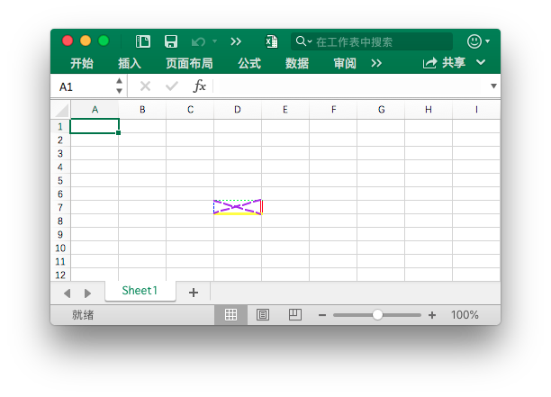
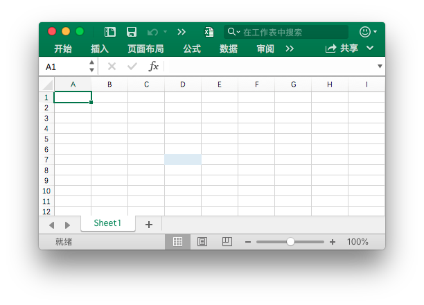

# 单元格

RichTextRun 定义了富文本的属性。

```go
type RichTextRun struct {
    Font *Font
    Text string
}
```

HyperlinkOpts 用来指定可选的超链接属性，例如要显示的文字与屏幕提示文字。

```go
type HyperlinkOpts struct {
    Display *string
    Tooltip *string
}
```

FormulaOpts 用于在 [`SetCellFormula`](cell.md#SetCellFormula) 函数中指定设置特殊公式类型。

```go
type FormulaOpts struct {
    Type *string // 公式类型
    Ref  *string // 共享公式引用
}
```

## 设置单元格的值 {#SetCellValue}

```go
func (f *File) SetCellValue(sheet, axis string, value interface{}) error
```

根据给定的工作表名和单元格坐标设置单元格的值。指定的坐标不应在表格的第一行范围，使用字符文本设置复数。

|支持的数据类型|
|---|
|int|
|int8|
|int16|
|int32|
|int64|
|uint|
|uint8|
|uint16|
|uint32|
|uint64|
|float32|
|float64|
|string|
|[]byte|
|time.Duration|
|time.Time|
|bool|
|nil|

## 设置布尔型值 {#SetCellBool}

```go
func (f *File) SetCellBool(sheet, axis string, value bool) error
```

根据给定的工作表名和单元格坐标设置布尔型单元格的值。

## 设置默认字符型值 {#SetCellDefault}

```go
func (f *File) SetCellDefault(sheet, axis, value string) error
```

根据给定的工作表名和单元格坐标设置字符型单元格的值，字符将不会进行特殊字符过滤。

## 设置实数 {#SetCellInt}

```go
func (f *File) SetCellInt(sheet, axis string, value int) error
```

根据给定的工作表名和单元格坐标设置实数单元格的值。

## 设置字符型值 {#SetCellStr}

```go
func (f *File) SetCellStr(sheet, axis, value string) error
```

根据给定的工作表名和单元格坐标设置字符型单元格的值，字符将会进行特殊字符过滤，并且字符串的累计长度应不超过 `32767`，多余的字符将会被忽略。

## 设置单元格样式 {#SetCellStyle}

```go
func (f *File) SetCellStyle(sheet, hcell, vcell string, styleID int) error
```

根据给定的工作表名、单元格坐标区域和样式索引设置单元格的值。样式索引可以通过 [`NewStyle`](style.md#NewStyle) 函数获取。注意，在同一个坐标区域内的 `diagonalDown` 和 `diagonalUp` 需要保持颜色一致。SetCellStyle 将覆盖单元格的已有样式，而不会将样式与已有样式叠加或合并。

- 例1，为名为 `Sheet1` 的工作表 `D7` 单元格设置边框样式：

```go
style, err := f.NewStyle(`{
    "border": [
    {
        "type": "left",
        "color": "0000FF",
        "style": 3
    },
    {
        "type": "top",
        "color": "00FF00",
        "style": 4
    },
    {
        "type": "bottom",
        "color": "FFFF00",
        "style": 5
    },
    {
        "type": "right",
        "color": "FF0000",
        "style": 6
    },
    {
        "type": "diagonalDown",
        "color": "A020F0",
        "style": 7
    },
    {
        "type": "diagonalUp",
        "color": "A020F0",
        "style": 8
    }]
}`)
if err != nil {
    fmt.Println(err)
}
err = f.SetCellStyle("Sheet1", "D7", "D7", style)
```

<p align="center"></p>

单元格 `D7` 的四个边框被设置了不同的样式和颜色，这与调用 [`NewStyle`](style.md#NewStyle) 函数时的参数有关，需要设置不同的样式可参考该章节的文档。

- 例2，为名为 `Sheet1` 的工作表 `D7` 单元格设置渐变样式：

```go
style, err := f.NewStyle(`{"fill":{"type":"gradient","color":["#FFFFFF","#E0EBF5"],"shading":1}}`)
if err != nil {
    fmt.Println(err)
}
err = f.SetCellStyle("Sheet1", "D7", "D7", style)
```

<p align="center"></p>

单元格 `D7` 被设置了渐变效果的颜色填充，渐变填充效果与调用 [`NewStyle`](style.md#NewStyle) 函数时的参数有关，需要设置不同的样式可参考该章节的文档。

- 例3，为名为 `Sheet1` 的工作表 `D7` 单元格设置纯色填充：

```go
style, err := f.NewStyle(`{"fill":{"type":"pattern","color":["#E0EBF5"],"pattern":1}}`)
if err != nil {
    fmt.Println(err)
}
err = f.SetCellStyle("Sheet1", "D7", "D7", style)
```

<p align="center"></p>

单元格 `D7` 被设置了纯色填充。

- 例4，为名为 `Sheet1` 的工作表 `D7` 单元格设置字符间距与旋转角度：

```go
f.SetCellValue("Sheet1", "D7", "样式")
style, err := f.NewStyle(`{
    "alignment":
    {
        "horizontal": "center",
        "ident": 1,
        "justify_last_line": true,
        "reading_order": 0,
        "relative_indent": 1,
        "shrink_to_fit": true,
        "text_rotation": 45,
        "vertical": "",
        "wrap_text": true
    }
}`)
if err != nil {
    fmt.Println(err)
}
err = f.SetCellStyle("Sheet1", "D7", "D7", style)
```

<p align="center"></p>

- 例5，Excel 中的日期和时间用实数表示，例如 `2017/7/4  12:00:00 PM` 可以用数字 `42920.5` 来表示。为名为 `Sheet1` 的工作表 `D7` 单元格设置时间格式：

```go
f.SetCellValue("Sheet1", "D7", 42920.5)
f.SetColWidth("Sheet1", "D", "D", 13)
style, err := f.NewStyle(`{"number_format": 22}`)
if err != nil {
    fmt.Println(err)
}
err = f.SetCellStyle("Sheet1", "D7", "D7", style)
```

<p align="center"></p>

单元格 `D7` 被设置了时间格式。注意，当应用了时间格式的单元格宽度过窄无法完整展示时会显示为 `####`，可以拖拽调整列宽或者通过调用 `SetColWidth` 函数设置列宽到合适的大小使其正常显示。

- 例6，为名为 `Sheet1` 的工作表 `D7` 单元格设置字体、字号、颜色和倾斜样式：

```go
f.SetCellValue("Sheet1", "D7", "Excel")
style, err := f.NewStyle(`{
    "font":
    {
        "bold": true,
        "italic": true,
        "family": "Times New Roman",
        "size": 36,
        "color": "#777777"
    }
}`)
if err != nil {
    fmt.Println(err)
}
err = f.SetCellStyle("Sheet1", "D7", "D7", style)
```

<p align="center"></p>

- 例7，锁定并隐藏名为 `Sheet1` 的工作表 `D7` 单元格：

```go
style, err := f.NewStyle(`{"protection":{"hidden":true, "locked":true}}`)
if err != nil {
    fmt.Println(err)
}
err = f.SetCellStyle("Sheet1", "D7", "D7", style)
```

要锁定单元格或隐藏公式，请保护工作表。在“审阅”选项卡上，单击“保护工作表”。

## 设置超链接 {#SetCellHyperLink}

```go
func (f *File) SetCellHyperLink(sheet, axis, link, linkType string) error
```

根据给定的工作表、单元格坐标、链接资源和资源类型设置单元格的超链接。资源类型分为外部链接地址 `External` 和工作簿内部位置链接 `Location` 两种。每个工作表中的包含最大超链接限制为 `65530` 个。

- 例1，为名为 `Sheet1` 的工作表 `A3` 单元格添加外部链接：

```go
err := f.SetCellHyperLink("Sheet1", "A3",
    "https://github.com/xuri/excelize", "External")
// 为单元格设置字体和下划线样式
style, err := f.NewStyle(`{"font":{"color":"#1265BE","underline":"single"}}`)
err = f.SetCellStyle("Sheet1", "A3", "A3", style)
```

- 例2，为名为 `Sheet1` 的工作表 `A3` 单元格添加内部位置链接：

```go
err := f.SetCellHyperLink("Sheet1", "A3", "Sheet1!A40", "Location")
```

## 设置富文本格式 {#SetCellRichText}

```go
func (f *File) SetCellRichText(sheet, cell string, runs []RichTextRun) error
```

根据给定的工作表、单元格坐标和富文本格式为指定单元格设置富文本。

例如，在名为 `Sheet1` 的工作表 `A1` 单元格设置富文本格式：

<p align="center"></p>

```go
package main

import (
    "fmt"

    "github.com/xuri/excelize/v2"
)

func main() {
    f := excelize.NewFile()
    if err := f.SetRowHeight("Sheet1", 1, 35); err != nil {
        fmt.Println(err)
        return
    }
    if err := f.SetColWidth("Sheet1", "A", "A", 44); err != nil {
        fmt.Println(err)
        return
    }
    if err := f.SetCellRichText("Sheet1", "A1", []excelize.RichTextRun{
        {
            Text: "bold",
            Font: &excelize.Font{
                Bold:   true,
                Color:  "2354e8",
                Family: "Times New Roman",
            },
        },
        {
            Text: " and ",
            Font: &excelize.Font{
                Family: "Times New Roman",
            },
        },
        {
            Text: "italic",
            Font: &excelize.Font{
                Bold:   true,
                Color:  "e83723",
                Italic: true,
                Family: "Times New Roman",
            },
        },
        {
            Text: "text with color and font-family,",
            Font: &excelize.Font{
                Bold:   true,
                Color:  "2354e8",
                Family: "Times New Roman",
            },
        },
        {
            Text: "\r\nlarge text with ",
            Font: &excelize.Font{
                Size:  14,
                Color: "ad23e8",
            },
        },
        {
            Text: "strike",
            Font: &excelize.Font{
                Color:  "e89923",
                Strike: true,
            },
        },
        {
            Text: " and ",
            Font: &excelize.Font{
                Size:  14,
                Color: "ad23e8",
            },
        },
        {
            Text: "underline.",
            Font: &excelize.Font{
                Color:     "23e833",
                Underline: "single",
            },
        },
    }); err != nil {
        fmt.Println(err)
        return
    }
    style, err := f.NewStyle(&excelize.Style{
        Alignment: &excelize.Alignment{
            WrapText: true,
        },
    })
    if err != nil {
        fmt.Println(err)
        return
    }
    if err := f.SetCellStyle("Sheet1", "A1", "A1", style); err != nil {
        fmt.Println(err)
        return
    }
    if err := f.SaveAs("Book1.xlsx"); err != nil {
        fmt.Println(err)
    }
}
```

## 获取富文本格式 {#GetCellRichText}

```go
func (f *File) GetCellRichText(sheet, cell string) (runs []RichTextRun, err error)
```

根据给定的工作表、单元格坐标获取指定单元格的富文本格式。

## 获取单元格的值 {#GetCellValue}

```go
func (f *File) GetCellValue(sheet, axis string) (string, error)
```

根据给定的工作表和单元格坐标获取单元格的值，返回值将转换为 `string` 类型。如果可以将单元格格式应用于单元格的值，将返回应用后的值，否则将返回原始值。合并区域内所有单元格的值都相同。

## 按列获取全部单元格的值 {#GetCols}

```go
func (f *File) GetCols(sheet string) ([][]string, error)
```

根据给定的工作表名（大小写敏感）按列获取该工作表上全部单元格的值，以二维数组形式返回，其中单元格的值将转换为 `string` 类型。如果可以将单元格格式应用于单元格的值，将使用应用后的值，否则将使用原始值。

例如，按列获取并遍历输出名为 `Sheet1` 的工作表上的所有单元格的值：

```go
cols, err := f.GetCols("Sheet1")
if err != nil {
    fmt.Println(err)
    return
}
for _, col := range cols {
    for _, rowCell := range col {
        fmt.Print(rowCell, "\t")
    }
    fmt.Println()
}
```

## 按行获取全部单元格的值 {#GetRows}

```go
func (f *File) GetRows(sheet string) ([][]string, error)
```

根据给定的工作表名（大小写敏感）按行获取该工作表上全部单元格的值，以二维数组形式返回，其中单元格的值将转换为 `string` 类型。如果可以将单元格格式应用于单元格的值，将使用应用后的值，否则将使用原始值。GetRows 获取带有值或公式单元格的行，行尾连续为空的单元格将被跳过。

例如，按行获取并遍历输出名为 `Sheet1` 的工作表上的所有单元格的值：

```go
rows, err := f.GetRows("Sheet1")
if err != nil {
    fmt.Println(err)
    return
}
for _, row := range rows {
    for _, colCell := range row {
        fmt.Print(colCell, "\t")
    }
    fmt.Println()
}
```

## 获取超链接 {#GetCellHyperLink}

```go
func (f *File) GetCellHyperLink(sheet, axis string) (bool, string, error)
```

根据给定的工作表名（大小写敏感）和单元格坐标获取单元格超链接，如果该单元格存在超链接，将返回 `true` 和链接地址，否则将返回 `false` 和空的链接地址。

例如，获取名为 `Sheet1` 的工作表上坐标为 `H6` 单元格的超链接：

```go
link, target, err := f.GetCellHyperLink("Sheet1", "H6")
```

## 获取样式索引 {#GetCellStyle}

```go
func (f *File) GetCellStyle(sheet, axis string) (int, error)
```

根据给定的工作表名（大小写敏感）和单元格坐标获取单元格样式索引，获取到的索引可以在复制单元格样式时，作为调用 `SetCellValue` 函数的参数使用。

## 合并单元格 {#MergeCell}

```go
func (f *File) MergeCell(sheet, hcell, vcell string) error
```

根据给定的工作表名（大小写敏感）和单元格坐标区域合并单元格。合并区域内仅保留左上角单元格的值，其他单元格的值将被忽略。例如，合并名为 `Sheet1` 的工作表上 `D3:E9` 区域内的单元格：

```go
err := f.MergeCell("Sheet1", "D3", "E9")
```

如果给定的单元格坐标区域与已有的其他合并单元格相重叠，已有的合并单元格将会被删除。

## 取消合并单元格 {#UnmergeCell}

```go
func (f *File) UnmergeCell(sheet string, hcell, vcell string) error
```

根据给定的工作表名（大小写敏感）和单元格坐标区域取消合并单元格。例如，取消合并名为 `Sheet1` 的工作表上 `D3:E9` 区域内的单元格：

```go
err := f.UnmergeCell("Sheet1", "D3", "E9")
```

如果给定的单元格坐标区域包含多个合并单元格，则全部合并单元格都将被取消合并。

## 获取合并单元格 {#GetMergeCells}

根据给定的工作表名（大小写敏感）获取全部合并单元格的坐标区域和值。

```go
func (f *File) GetMergeCells(sheet string) ([]MergeCell, error)
```

## 添加批注 {#AddComment}

```go
func (f *File) AddComment(sheet, cell, format string) error
```

根据给定的工作表名称、单元格坐标和样式参数（作者与文本信息）添加批注。作者信息最大长度为 255 个字符，最大文本内容长度为 32512 个字符，超出该范围的字符将会被忽略。例如，为 `Sheet1!$A$3` 单元格添加批注：

<p align="center"></p>

```go
err := f.AddComment("Sheet1", "A3", `{"author":"Excelize: ","text":"This is a comment."}`)
```

## 获取批注 {#GetComments}

```go
func (f *File) GetComments() (comments map[string][]Comment)
```

通过该方法可以获取全部工作表中的批注。

## 设置公式 {#SetCellFormula}

```go
func (f *File) SetCellFormula(sheet, axis, formula string, opts ...FormulaOpts) error
```

根据给定的工作表名（大小写敏感）和单元格坐标设置取该单元格上的公式。公式的结果可在工作表被 Office Excel 应用程序打开时计算，或通过 [CalcCellValue](cell.md#CalcCellValue) 函数计算单元格的值。

## 获取公式 {#GetCellFormula}

```go
func (f *File) GetCellFormula(sheet, axis string) (string, error)
```

根据给定的工作表名（大小写敏感）和单元格坐标获取该单元格上的公式。

## 计算单元格的值 {#CalcCellValue}

```go
func (f *File) CalcCellValue(sheet, cell string) (result string, err error)
```

根据给定的工作表名（大小写敏感）和单元格坐标计算包含公式单元格的值。该方法目前正在开发中，尚未支持数组函数、表格函数和其他部分函数。

支持的函数列表如下：

```text
ABS
ACOS
ACOSH
ACOT
ACOTH
AND
ARABIC
ASIN
ASINH
ATAN
ATAN2
ATANH
AVERAGE
AVERAGEA
BASE
BESSELI
BESSELJ
BESSELK
BESSELY
BIN2DEC
BIN2HEX
BIN2OCT
BITAND
BITLSHIFT
BITOR
BITRSHIFT
BITXOR
CEILING
CEILING.MATH
CEILING.PRECISE
CHAR
CHOOSE
CLEAN
CODE
COLUMN
COLUMNS
COMBIN
COMBINA
COMPLEX
CONCAT
CONCATENATE
COS
COSH
COT
COTH
COUNT
COUNTA
COUNTBLANK
CSC
CSCH
CUMIPMT
CUMPRINC
DATE
DATEDIF
DAY
DB
DDB
DEC2BIN
DEC2HEX
DEC2OCT
DECIMAL
DEGREES
DOLLARDE
DOLLARFR
EFFECT
ENCODEURL
EVEN
EXACT
EXP
FACT
FACTDOUBLE
FALSE
FIND
FINDB
FISHER
FISHERINV
FIXED
FLOOR
FLOOR.MATH
FLOOR.PRECISE
FV
FVSCHEDULE
GAMMA
GAMMALN
GCD
HARMEAN
HEX2BIN
HEX2DEC
HEX2OCT
HLOOKUP
IF
IFERROR
IMABS
IMAGINARY
IMARGUMENT
IMCONJUGATE
IMCOS
IMCOSH
IMCOT
IMCSC
IMCSCH
IMDIV
IMEXP
IMLN
IMLOG10
IMLOG2
IMPOWER
IMPRODUCT
IMREAL
IMSEC
IMSECH
IMSIN
IMSINH
IMSQRT
IMSUB
IMSUM
IMTAN
INT
IPMT
IRR
ISBLANK
ISERR
ISERROR
ISEVEN
ISNA
ISNONTEXT
ISNUMBER
ISODD
ISTEXT
ISO.CEILING
ISPMT
KURT
LARGE
LCM
LEFT
LEFTB
LEN
LENB
LN
LOG
LOG10
LOOKUP
LOWER
MAX
MDETERM
MEDIAN
MID
MIDB
MIN
MINA
MIRR
MOD
MONTH
MROUND
MULTINOMIAL
MUNIT
N
NA
NOMINAL
NORM.DIST
NORMDIST
NORM.INV
NORMINV
NORM.S.DIST
NORMSDIST
NORM.S.INV
NORMSINV
NOT
NOW
NPER
NPV
OCT2BIN
OCT2DEC
OCT2HEX
ODD
OR
PDURATION
PERCENTILE.INC
PERCENTILE
PERMUT
PERMUTATIONA
PI
PMT
POISSON.DIST
POISSON
POWER
PPMT
PRODUCT
PROPER
QUARTILE
QUARTILE.INC
QUOTIENT
RADIANS
RAND
RANDBETWEEN
REPLACE
REPLACEB
REPT
RIGHT
RIGHTB
ROMAN
ROUND
ROUNDDOWN
ROUNDUP
ROW
ROWS
SEC
SECH
SHEET
SIGN
SIN
SINH
SKEW
SMALL
SQRT
SQRTPI
STDEV
STDEV.S
STDEVA
SUBSTITUTE
SUM
SUMIF
SUMSQ
T
TAN
TANH
TODAY
TRIM
TRUE
TRUNC
UNICHAR
UNICODE
UPPER
VAR.P
VARP
VLOOKUP
YEAR
```
