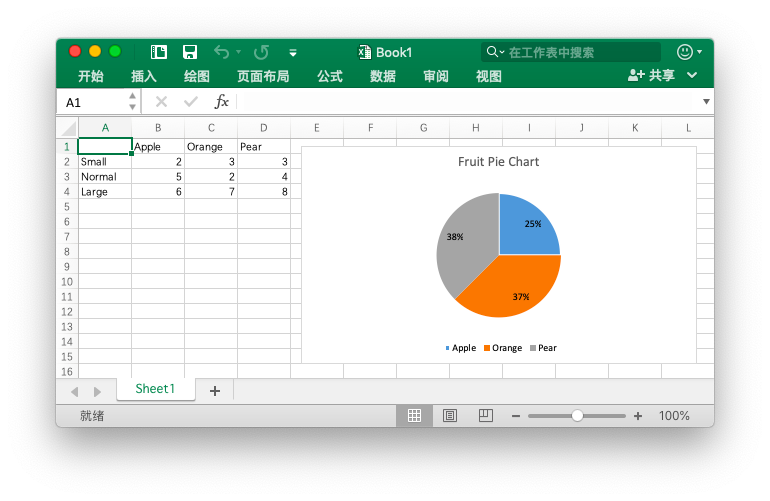

# 图表

## 添加图表

```go
func (f *File) AddChart(sheet, cell, format string) error
```

根据给定的工作表名称、单元格坐标和图表样式属性插入图表。

下面是 Excelize 支持创建的图表类型 `type`：

名称|图表类型
---|---
bar                 | 二维簇状条形图
barStacked          | 二维堆积条形图
barPercentStacked   | 二维百分比堆积条形图
bar3DClustered      | 三维簇状条形图
bar3DStacked        | 三维堆积条形图
bar3DPercentStacked | 三维百分比堆积条形图
col                 | 二维簇状柱形图
colStacked          | 二维堆积柱形图
colPercentStacked   | 二维百分比堆积柱形图
col3DClustered      | 三维簇状柱形图
col3D               | 三维柱形图
col3DStacked        | 三维堆积柱形图
col3DPercentStacked | 三维百分比堆积柱形图
doughnut            | 圆环图
line                | 折线图
pie                 | 饼图
pie3D               | 三维饼图
radar               | 雷达图
scatter             | 散点图

在 Office Excel 中图表数据区域 `series` 指定了绘制哪些数据的信息集合、图例项（系列）和水平（分类）轴标签。

下面是 Excelize 中 `series` 的可选参数：

参数|含义
---|---
name|图例项（系列），在图表图例和公式栏中显示。`name` 参数是可选的，如果不指定该值默认将会使用 `Series 1 .. n` 表示。`name` 支持使用公式表示，例如：`Sheet1!$A$1`。
categories|水平（分类）轴标签。在大多数图表类型中，`categories` 属性是可选的，默认为形如 `1..n` 的连续序列。
values|图表数据区域，是 `series` 中最重要的参数，也是创建图表时唯一的必选参数。该选项将图表与其显示的工作表数据链接起来。

参数 `legend` 提供对图例项的属性设置方法，下面是 Excelize 中 `legend` 的可选参数：

参数|类型|含义
---|---|---
position|string|图例位置
show_legend_key|bool|显示图例，但不与图表重叠

其中参数 `position` 默认值为 `right`，下面是可选值：

可选值|含义
---|---
top|靠上
bottom|靠下
left|靠左
right|靠右
top_right|右上

其中参数 `show_legend_key` 默认值为 `false`。

通过可选 `title` 对象的 `name` 参数设置图表标题，标题将会在图表上方显示。参数 `name` 支持使用公式表示，例如 `Sheet1!$A$1`，如果不指定图标标题默认值为空。

参数 `show_blanks_as` 提供“隐藏和清空单元格”设置，默认值为： `gap` 即“空单元格显示为”：“空距”。下面是该参数的可选值：

值|含义
---|---
gap|空距
span|用直线连接数据点
zero|零值

参数 `format` 提供对图表偏移、缩放、高宽比设置和打印属性等参数的设置，其参数与在 [`AddPicture()`](image.md#AddPicture) 函数中所使用的相同。

通过可选 `plotarea` 对象设置数据标签格式，可选参数如下：

参数|类型|默认值|含义
---|---|---|---
show_bubble_size|bool|`false`|气泡大小
show_cat_name|bool|`true`|类别名称
show_leader_lines|bool|`false`|显示引导线
show_percent|bool|`false`|百分比
show_series_name|bool|`false`|系列名称
show_val|bool|`false`|值

通过参数 `x_axis` 和 `y_axis` 参数设置坐标轴选项。下面是该参数的可选值：

参数|类型|默认值|含义
---|---|---|---
reverse_order|bool|`false`|逆序刻度值
maximum|int|`0`|最大值，`0` 代表自动
minimum|int|`0`|最小值，`0` 代表自动

通过可选 `dimension` 对象设置图表的大小，可选参数如下：

参数|类型|默认值|含义
---|---|---|---
height|int|290|高度
width|int|480|宽度

### 三维簇状柱形图 {#col3DClustered}

例如，创建如下效果的三维簇状柱形图：


```go
package main

import (
    "fmt"

    "github.com/360EntSecGroup-Skylar/excelize"
)

func main() {
    categories := map[string]string{"A2": "Small", "A3": "Normal", "A4": "Large", "B1": "Apple", "C1": "Orange", "D1": "Pear"}
    values := map[string]int{"B2": 2, "C2": 3, "D2": 3, "B3": 5, "C3": 2, "D3": 4, "B4": 6, "C4": 7, "D4": 8}
    xlsx := excelize.NewFile()
    for k, v := range categories {
        xlsx.SetCellValue("Sheet1", k, v)
    }
    for k, v := range values {
        xlsx.SetCellValue("Sheet1", k, v)
    }
    err := xlsx.AddChart("Sheet1", "E1", `{"type":"col3DClustered","series":[{"name":"Sheet1!$A$2","categories":"Sheet1!$B$1:$D$1","values":"Sheet1!$B$2:$D$2"},{"name":"Sheet1!$A$3","categories":"Sheet1!$B$1:$D$1","values":"Sheet1!$B$3:$D$3"},{"name":"Sheet1!$A$4","categories":"Sheet1!$B$1:$D$1","values":"Sheet1!$B$4:$D$4"}],"format":{"x_scale":1.0,"y_scale":1.0,"x_offset":15,"y_offset":10,"print_obj":true,"lock_aspect_ratio":false,"locked":false},"legend":{"position":"bottom","show_legend_key":false},"title":{"name":"Fruit 3D Clustered Column Chart"},"plotarea":{"show_bubble_size":true,"show_cat_name":false,"show_leader_lines":false,"show_percent":true,"show_series_name":true,"show_val":true},"show_blanks_as":"zero","x_axis":{"reverse_order":true},"y_axis":{"maximum":7.5,"minimum":0.5}}`)
    if err != nil {
        fmt.Println(err)
    }
    // 保存工作簿
    err = xlsx.SaveAs("./Book1.xlsx")
    if err != nil {
        fmt.Println(err)
    }
}
```

### 饼图 {#pie}

例如，创建如下效果的饼图：



```go
package main

import (
    "fmt"

    "github.com/360EntSecGroup-Skylar/excelize"
)

func main() {
    categories := map[string]string{"A2": "Small", "A3": "Normal", "A4": "Large", "B1": "Apple", "C1": "Orange", "D1": "Pear"}
    values := map[string]int{"B2": 2, "C2": 3, "D2": 3, "B3": 5, "C3": 2, "D3": 4, "B4": 6, "C4": 7, "D4": 8}
    xlsx := excelize.NewFile()
    for k, v := range categories {
        xlsx.SetCellValue("Sheet1", k, v)
    }
    for k, v := range values {
        xlsx.SetCellValue("Sheet1", k, v)
    }

    xlsx.AddChart("Sheet1", "E1", `{"type":"pie","series":[{"name":"Sheet1!$A$2","categories":"Sheet1!$B$1:$D$1","values":"Sheet1!$B$2:$D$2"}],"format":{"x_scale":1.0,"y_scale":1.0,"x_offset":15,"y_offset":10,"print_obj":true,"lock_aspect_ratio":false,"locked":false},"legend":{"position":"bottom","show_legend_key":false},"title":{"name":"Fruit Pie Chart"},"plotarea":{"show_bubble_size":true,"show_cat_name":false,"show_leader_lines":false,"show_percent":true,"show_series_name":false,"show_val":false},"show_blanks_as":"gap"}`)
    // 保存工作簿
    err := xlsx.SaveAs("./Book1.xlsx")
    if err != nil {
        fmt.Println(err)
    }
}
```
