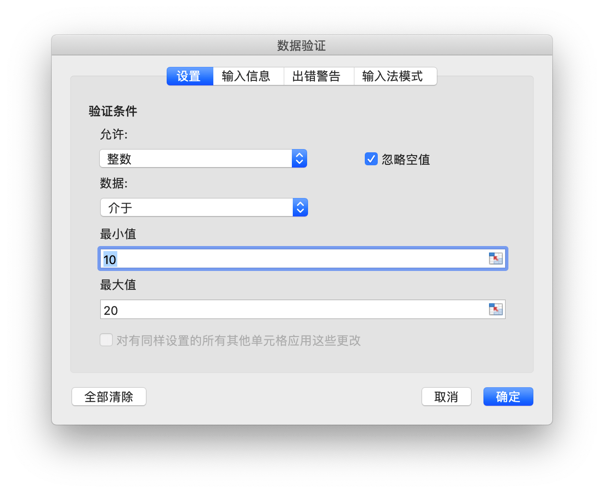
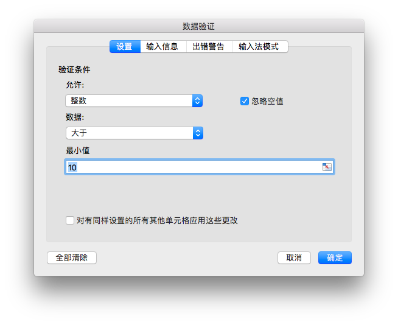
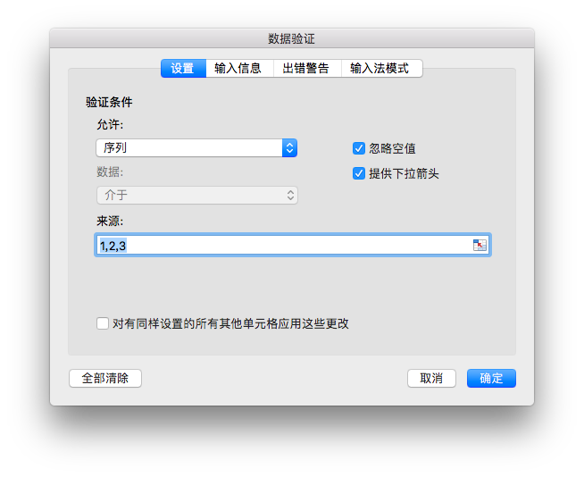
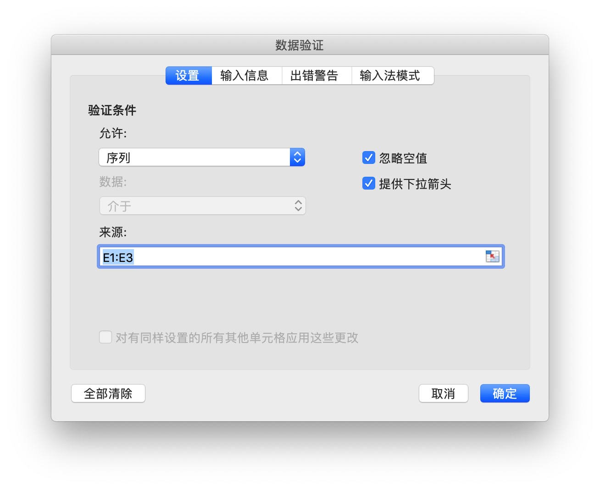

# 数据

## 数据验证 {#AddDataValidation}

```go
func (f *File) AddDataValidation(sheet string, dv *DataValidation)
```

根据给定的工作表名和数据验证对象设置数据验证规则，数据验证对象可通过 `NewDataValidation` 函数创建，数据验证类型和条件参考[常量](constants.md)中的定义。

例1，为 `Sheet1!A1:B2` 设置包含验证条件为允许介于整数 10 到 20 的数据验证规则，输入无效数据时显示出错警告，标题为: "error title"，错误信息 "error body":

<p align="center"></p>

```go
dvRange := excelize.NewDataValidation(true)
dvRange.Sqref = "A1:B2"
dvRange.SetRange(10, 20, excelize.DataValidationTypeWhole, excelize.DataValidationOperatorBetween)
dvRange.SetError(excelize.DataValidationErrorStyleStop, "error title", "error body")
xlsx.AddDataValidation("Sheet1", dvRange)
```

例2，为 `Sheet1!A3:B4` 设置包含验证条件为允许大于整数 10 的数据验证规则，选定单元格时显示输入信息，输入信息为: "input body":

<p align="center"></p>

```go
dvRange = excelize.NewDataValidation(true)
dvRange.Sqref = "A3:B4"
dvRange.SetRange(10, 20, excelize.DataValidationTypeWhole, excelize.DataValidationOperatorGreaterThan)
dvRange.SetInput("input title", "input body")
xlsx.AddDataValidation("Sheet1", dvRange)
```

例3，为 `Sheet1!A5:B6` 设置验证条件为序列的数据验证规则，忽略空值并提供下拉箭头:

<p align="center"></p>

```go
dvRange = excelize.NewDataValidation(true)
dvRange.Sqref = "A5:B6"
dvRange.SetDropList([]string{"1", "2", "3"})
xlsx.AddDataValidation("Sheet1", dvRange)
```

例4，为 `Sheet1!A7:B8` 设置以 `Sheet1!E1:E3` 为来源的验证条件，忽略空值并提供下拉箭头:

<p align="center"></p>

```go
dvRange := excelize.NewDataValidation(true)
dvRange.Sqref = "A7:B8"
dvRange.SetSqrefDropList("E1:E3", true)
xlsx.AddDataValidation("Sheet1", dvRange)
```
