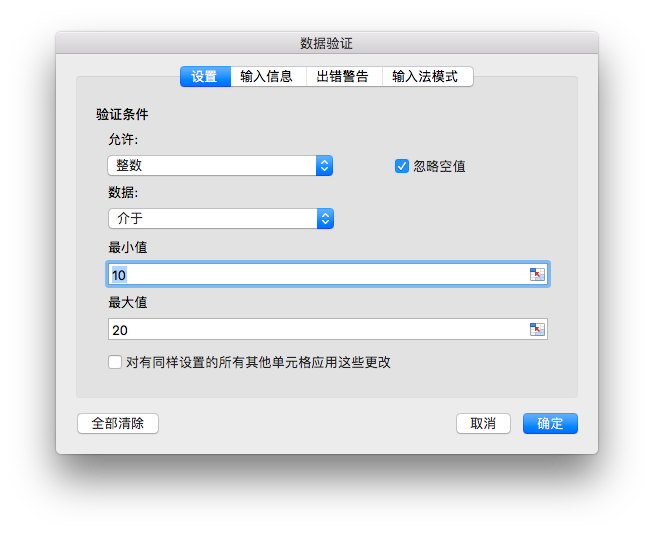

# 数据

{{ book.info }}

## 添加数据验证 {#AddDataValidation}

```go
func (f *File) AddDataValidation(sheet string, dv *DataValidation)
```

根据给定的工作表名和数据验证对象设置数据验证规则，数据验证对象可通过 `NewDataValidation` 函数创建，数据验证类型和条件参考[常量](constants.md)中的定义。

例1，为 `Sheet1!A1:B2` 设置包含验证条件为允许介于整数 10 到 20 的数据验证规则，输入无效数据时显示出错警告，标题为: "error title"，错误信息 "error body":

<p align="center"></p>

```go
dv := excelize.NewDataValidation(true)
dv.SetSqref("A1:B2")
dv.SetRange(10, 20, excelize.DataValidationTypeWhole, excelize.DataValidationOperatorBetween)
dv.SetError(excelize.DataValidationErrorStyleStop, "error title", "error body")
f.AddDataValidation("Sheet1", dv)
```

例2，为 `Sheet1!A3:B4` 设置包含验证条件为允许大于整数 10 的数据验证规则，选定单元格时显示输入信息，输入信息为: "input body":

<p align="center"></p>

```go
dv = excelize.NewDataValidation(true)
dv.SetSqref("A3:B4")
dv.SetRange(10, 20, excelize.DataValidationTypeWhole, excelize.DataValidationOperatorGreaterThan)
dv.SetInput("input title", "input body")
f.AddDataValidation("Sheet1", dv)
```

例3，为 `Sheet1!A5:B6` 设置验证条件为序列的数据验证规则，忽略空值并提供下拉箭头:

<p align="center"></p>

```go
dv = excelize.NewDataValidation(true)
dv.SetSqref("A5:B6")
dv.SetDropList([]string{"1", "2", "3"})
f.AddDataValidation("Sheet1", dv)
```

如果您在序列中设置的项目超过限制累计 255 个字符的限制，请使用另一种方式设置：在工作表单元格中设置允许的值，并使用 `SetSqrefDropList` 函数设置序列中引用单元格的范围。

例4，为 `Sheet1!A7:B8` 设置以 `Sheet1!E1:E3` 为来源的验证条件，忽略空值并提供下拉箭头:

<p align="center"></p>

```go
dv := excelize.NewDataValidation(true)
dv.SetSqref("A7:B8")
dv.SetSqrefDropList("E1:E3")
f.AddDataValidation("Sheet1", dv)
```

数据验证下拉列表中显示的项目数量有限制：该列表最多可以显示 32768 个项目。如果您需要更多项目，可以通过级联列表将项目分类。

## 获取数据验证 {#GetDataValidations}

```go
func (f *File) GetDataValidations(sheet string) ([]*DataValidation, error)
```

根据给定的工作表名获取改工作表中全部数据验证区域和数据验证规则。

## 删除数据验证 {#DeleteDataValidation}

```go
func (f *File) DeleteDataValidation(sheet string, sqref ...string) error
```

根据给定的工作表名和数据验证区域删除数据验证规则。若未指定数据验证区域，将删除给定工作表中全部数据验证规则。

## 添加切片器 {#AddSlicer}

`SlicerOptions` 定义了切片器的属性。

```go
type SlicerOptions struct {
    Name          string
    Table         string
    Cell          string
    Caption       string
    Macro         string
    Width         uint
    Height        uint
    DisplayHeader *bool
    ItemDesc      bool
    Format        GraphicOptions
}
```

`Name` 为必选参数，用于设置切片器的名称，必须是工作表中已有表格或数据透视表中字段名称。

`Table` 为必选参数，用于设置切片器关联的表格或数据透视表名称。

`Cell` 为必选参数，用于设置切片器左上角单元格坐标位置。

`Caption` 为可选参数，用于设置切片器的标题。

`Macro` 为可选参数，用于为切片器设置宏。当使用该参数设置时，保存工作簿时的文件扩展名应为 `.xlsm` 或者 `.xltm`。

`Width` 为可选参数，用于为设置切片器的宽度。

`Height` 为可选参数，用于为设置切片器的高度。

`DisplayHeader` 为可选参数，用于设置是否显示切片器的标题，默认显示切片器的标题。

`ItemDesc` 为可选参数，用于设置使用降序 (Z-A) 为切片器项目排序，默认设置为 `false`（表示使用升序）。

`Format` 为可选参数，用于设置切片器的格式（大小和属性）。

```go
func (f *File) AddSlicer(sheet string, opts *SlicerOptions) error
```

通过给定的工作表名称和切片器设置，在工作表中添加切片器。例如，在 `Sheet1!E1` 单元格中，为表格 `Table1` 名为 `Column1` 的列添加切片器:

```go
err := f.AddSlicer("Sheet1", &excelize.SlicerOptions{
    Name:       "Column1",
    Cell:       "E1",
    TableSheet: "Sheet1",
    TableName:  "Table1",
    Caption:    "Column1",
    Width:      200,
    Height:     200,
})
```

## 获取切片器 {#GetSlicers}

```go
func (f *File) GetSlicers(sheet string) ([]SlicerOptions, error)
```

通过给定的工作表名称获取指定工作表中的全部切片器。注意，该函数目前尚未支持获取切片器的高度、宽度和图形属性。

## 删除切片器 {#DeleteSlicer}

```go
func (f *File) DeleteSlicer(name string) error
```

根据给定的切片器名称删除指定切片器。
