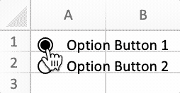

# 表单控件

{{ book.info }}

FormControl 定义了表单控件的属性。

```go
type FormControl struct {
    Cell         string
    Macro        string
    Width        uint
    Height       uint
    Checked      bool
    CurrentVal   uint
    MinVal       uint
    MaxVal       uint
    IncChange    uint
    PageChange   uint
    Horizontally bool
    CellLink     string
    Text         string
    Paragraph    []RichTextRun
    Type         FormControlType
    Format       GraphicOptions
}
```

## 添加表单控件 {#AddFormControl}

```go
func (f *File) AddFormControl(sheet string, opts FormControl) error
```

AddFormControl 通过给定的工作表名称和表单控件选项在工作表中添加表单控件。支持的表单控件类型为：按钮、复选框、分组框、标签、选项按钮、滚动条和微调框（调节按钮）。若需要为表单控件指定宏，保存的工作簿扩展名应为 `.xlsm` 或者 `.xltm`。滚动值应介于 0 到 30000 之间。请注意，如果为复选框表单控件设置了单元格链接，则在选中复选框时，Excelize 不会为链接的单元格分配值。要反映复选框状态，请使用 [`SetCellValue`](cell.md#SetCellValue) 函数将链接单元格的值设置为 `true`。

例1，在 `Sheet1!A2` 单元格添加带有指定宏、富文本、自定义尺寸和属性的按钮表单控件：

<p align="center"></p>

```go
enable := true
err := f.AddFormControl("Sheet1", excelize.FormControl{
    Cell:   "A2",
    Type:   excelize.FormControlButton,
    Macro:  "Button1_Click",
    Width:  140,
    Height: 60,
    Text:   "Button 1\r\n",
    Paragraph: []excelize.RichTextRun{
        {
            Font: &excelize.Font{
                Bold:      true,
                Italic:    true,
                Underline: "single",
                Family:    "Times New Roman",
                Size:      14,
                Color:     "777777",
            },
            Text: "C1=A1+B1",
        },
    },
    Format: excelize.GraphicOptions{
        PrintObject: &enable,
        Positioning: "absolute",
    },
})
```

例2，在 `Sheet1!A1` 和 `Sheet1!A2` 单元格添加带有选中状态的选项按钮表单控件：

<p align="center"></p>

```go
if err := f.AddFormControl("Sheet1", excelize.FormControl{
    Cell:    "A1",
    Type:    excelize.FormControlOptionButton,
    Text:    "Option Button 1",
    Checked: true,
    Height:  20,
}); err != nil {
    fmt.Println(err)
}
if err := f.AddFormControl("Sheet1", excelize.FormControl{
    Cell:    "A2",
    Type:    excelize.FormControlOptionButton,
    Text:    "Option Button 2",
    Height:  20,
}); err != nil {
    fmt.Println(err)
}
```

例3，在 `Sheet1!B1` 单元格添加带有控制选项的微调框（调节按钮）来增大或减小 `Sheet1!A1` 单元格的值：

<p align="center"></p>

```go
err := f.AddFormControl("Sheet1", excelize.FormControl{
    Cell:       "B1",
    Type:       excelize.FormControlSpinButton,
    Width:      15,
    Height:     40,
    CurrentVal: 7,
    MinVal:     5,
    MaxVal:     10,
    IncChange:  1,
    CellLink:   "A1",
})
```

例4，在 `Sheet1!A2` 单元格添加水平滚动条，通过拖动滚动框输入或修改 `Sheet1!A1` 单元格的值：

<p align="center"></p>

```go
err := f.AddFormControl("Sheet1", excelize.FormControl{
    Cell:         "A2",
    Type:         excelize.FormControlScrollBar,
    Width:        140,
    Height:       20,
    CurrentVal:   50,
    MinVal:       10,
    MaxVal:       100,
    IncChange:    1,
    PageChange:   1,
    CellLink:     "A1",
    Horizontally: true,
})
```

## 获取表单控件 {#GetFormControls}

```go
func (f *File) GetFormControls(sheet string) ([]FormControl, error)
```

根据给定的工作表名称获取工作表中的全部表单控件。注意，该函数目前尚未支持获取表单控件的宽高。

## 删除表单控件 {#DeleteFormControl}

```go
func (f *File) DeleteFormControl(sheet, cell string) error
```

DeleteFormControl 通过给定的工作表名称和单元格坐标删除指定的表单控件。例如，删除位于 `Sheet1!$A$1` 单元格的表单控件:

```go
err := f.DeleteFormControl("Sheet1", "A1")
```
