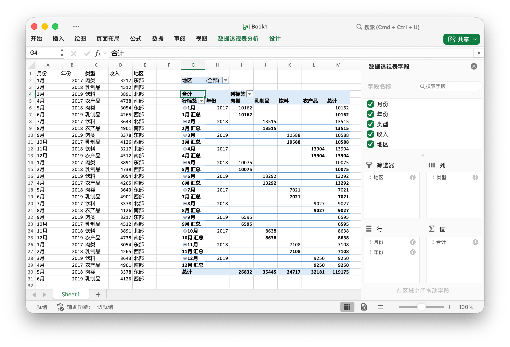

# 数据透视表 {#PivotTable}

数据透视表是一种交互式的表，是计算、汇总和分析数据的强大工具，可助你了解数据中的对比情况、模式和趋势。

PivotTableOption 定义了数据透视表的属性。

```go
type PivotTableOption struct {
    DataRange       string
    PivotTableRange string
    Rows            []PivotTableField
    Columns         []PivotTableField
    Data            []PivotTableField
    Filter          []PivotTableField
}
```

PivotTableField 定义了数据透视表的字段属性。

```go
type PivotTableField struct {
    Data     string
    Name     string
    Subtotal string
}
```

Subtotal 指定适用于数值字段的聚合函数。默认值为 `Sum`。该属性的可选值如下：

|可选值|
|---|
|Average|
|Count|
|CountNums|
|Max|
|Min|
|Product|
|StdDev|
|StdDevp|
|Sum|
|Var|
|Varp|

Name 用以指定数值字段的名称，最大长度为 `255` 个字符，超出部分的字符将不会被保留。

## 创建数据透视表 {#AddPivotTable}

```go
func (f *File) AddPivotTable(opt *PivotTableOption) error
```

根据给定的属性创建数据透视表。

例如，以 `Sheet1!$G$2:$M$34` 作为数据源，在 `Sheet1!$A$1:$E$31` 选区创建数据透视表，并按照销售数据汇总求和:

<p align="center"></p>

```go
package main

import (
    "fmt"
    "math/rand"

    "github.com/360EntSecGroup-Skylar/excelize"
)

func main() {
    f := excelize.NewFile()
    // 在工作表中添加数据
    month := []string{"Jan", "Feb", "Mar", "Apr", "May",
        "Jun", "Jul", "Aug", "Sep", "Oct", "Nov", "Dec"}
    year := []int{2017, 2018, 2019}
    types := []string{"Meat", "Dairy", "Beverages", "Produce"}
    region := []string{"East", "West", "North", "South"}
    f.SetSheetRow("Sheet1", "A1", &[]string{"Month", "Year", "Type", "Sales", "Region"})
    for i := 0; i < 30; i++ {
        f.SetCellValue("Sheet1", fmt.Sprintf("A%d", i+2), month[rand.Intn(12)])
        f.SetCellValue("Sheet1", fmt.Sprintf("B%d", i+2), year[rand.Intn(3)])
        f.SetCellValue("Sheet1", fmt.Sprintf("C%d", i+2), types[rand.Intn(4)])
        f.SetCellValue("Sheet1", fmt.Sprintf("D%d", i+2), rand.Intn(5000))
        f.SetCellValue("Sheet1", fmt.Sprintf("E%d", i+2), region[rand.Intn(4)])
    }
    if err := f.AddPivotTable(&excelize.PivotTableOption{
        DataRange:       "Sheet1!$A$1:$E$31",
        PivotTableRange: "Sheet1!$G$2:$M$34",
        Rows: []excelize.PivotTableField{
            {Data: "Month"}, {Data: "Year"}},
        Filter: []excelize.PivotTableField{
            {Data: "Region"}},
        Columns: []excelize.PivotTableField{
            {Data: "Type"}},
        Data: []excelize.PivotTableField{
            {Data: "Sales", Name: "Summarize", Subtotal: "Sum"}},
    }); err != nil {
        fmt.Println(err)
    }
    if err := f.SaveAs("Book1.xlsx"); err != nil {
        fmt.Println(err)
    }
}
```
