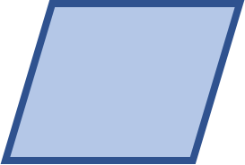
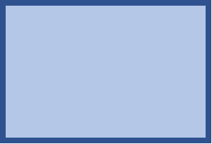

# 形状

## 添加形状

```go
func (f *File) AddShape(sheet, cell string, opts *Shape) error
```

根据给定的工作表名、单元格坐标和样式（包括偏移、缩放、拉伸、宽高比和打印属性等）在指定单元格添加形状。例如，在名为 `Sheet1` 的工作表上添加文本框（矩形）：

```go
lineWidth := 1.2
err := f.AddShape("Sheet1", "G6",
    &excelize.Shape{
        Type: "rect",
        Line: excelize.ShapeLine{Color: "4286F4", Width: &lineWidth},
        Fill: excelize.Fill{Color: []string{"8EB9FF"}},
        Paragraph: []excelize.RichTextRun{
            {
                Text: "Rectangle Shape",
                Font: &excelize.Font{
                    Bold:      true,
                    Italic:    true,
                    Family:    "Times New Roman",
                    Size:      18,
                    Color:     "777777",
                    Underline: "sng",
                },
            },
        },
        Width:  180,
        Height: 40,
    },
)
```

下面是 Excelize 所支持的所有形状：

名称|形状|预览
---|---|---
accentBorderCallout1 | 标注：线形（带边框和强调线）| <p style="text-align: center;"></p>
accentBorderCallout2 | 标注：弯曲线形（带边框和强调线） | <p style="text-align: center;"></p>
accentBorderCallout3 | 标注：双弯曲线形（带边框和强调线） | <p style="text-align: center;"></p>
accentCallout1 | 标注：线形（带强调线） | <p style="text-align: center;"></p>
accentCallout2 | 标注：弯曲线形（带强调线） | <p style="text-align: center;"></p>
accentCallout3 | 标注：双弯曲线形（带强调线） | <p style="text-align: center;"></p>
actionButtonBackPrevious | 动作按钮：后退或前一项 | <p style="text-align: center;"></p>
actionButtonBeginning | 动作按钮：转到开头 | <p style="text-align: center;"></p>
actionButtonBlank | 动作按钮：空白 | <p style="text-align: center;"></p>
actionButtonDocument | 动作按钮：文档 | <p style="text-align: center;"></p>
actionButtonEnd | 动作按钮：转到结尾 | <p style="text-align: center;"></p>
actionButtonForwardNext | 动作按钮：前进或下一项 | <p style="text-align: center;"></p>
actionButtonHelp | 动作按钮：帮助 | <p style="text-align: center;"></p>
actionButtonHome | 动作按钮：转到主页 | <p style="text-align: center;"></p>
actionButtonInformation | 动作按钮：获取信息 | <p style="text-align: center;"></p>
actionButtonMovie | 动作按钮：视频 | <p style="text-align: center;"></p>
actionButtonReturn | 动作按钮：上一张 | <p style="text-align: center;"></p>
actionButtonSound | 动作按钮：声音 | <p style="text-align: center;"></p>
arc | 曲线的弧形状 | <p style="text-align: center;"></p>
bentArrow | 箭头：圆角右 | <p style="text-align: center;"></p>
bentConnector2 | 弯曲的连接器 2 形状 | <p style="text-align: center;"></p>
bentConnector3 | 弯曲的连接器 3 形状 | <p style="text-align: center;"></p>
bentConnector4 | 弯曲的连接器 4 形状 | <p style="text-align: center;"></p>
bentConnector5 | 连接符：肘形 | <p style="text-align: center;"></p>
bentUpArrow | 箭头：直角上 | <p style="text-align: center;"></p>
bevel | 矩形：棱台 | <p style="text-align: center;"></p>
blockArc | 空心弧 | <p style="text-align: center;"></p>
borderCallout1 | 标注：线形 | <p style="text-align: center;"></p>
borderCallout2 | 标注：弯曲线形 | <p style="text-align: center;"></p>
borderCallout3 | 标注：双弯曲线形 | <p style="text-align: center;"></p>
bracePair | 双大括号 | <p style="text-align: center;"></p>
bracketPair | 双括号 | <p style="text-align: center;"></p>
callout1 | 标注：线形（无边框） | <p style="text-align: center;"></p>
callout2 | 标注：弯曲线形（无边框） | <p style="text-align: center;"></p>
callout3 | 标注：双弯曲线形（无边框） | <p style="text-align: center;"></p>
can | 圆柱体 | <p style="text-align: center;"></p>
chartPlus | 图表加上形状 | <p style="text-align: center;"></p>
chartStar | 图表的星形 | <p style="text-align: center;"></p>
chartX | 图表 X 形状 | <p style="text-align: center;"></p>
chevron | 箭头：V 形 | <p style="text-align: center;"></p>
chord | 弦形 | <p style="text-align: center;"></p>
circularArrow | 箭头：环形 | <p style="text-align: center;"></p>
cloud | 云形 | <p style="text-align: center;"></p>
cloudCallout | 云形标注 | <p style="text-align: center;"></p>
corner | L 形 | <p style="text-align: center;"></p>
cornerTabs | 角选项卡形状 | <p style="text-align: center;"></p>
cube | 立方体 | <p style="text-align: center;"></p>
curvedConnector2 | 弧形 | <p style="text-align: center;"></p>
curvedConnector3 | 链接符：曲线 | <p style="text-align: center;"></p>
curvedConnector4 | 曲线的连接符 4 形状 | <p style="text-align: center;"></p>
curvedConnector5 | 曲线的连接符 5 形状 | <p style="text-align: center;"></p>
curvedDownArrow | 箭头：上弧形 | <p style="text-align: center;"></p>
curvedLeftArrow | 箭头：右弧形 | <p style="text-align: center;"></p>
curvedRightArrow | 箭头：左弧形 | <p style="text-align: center;"></p>
curvedUpArrow | 箭头：下弧形 | <p style="text-align: center;"></p>
decagon | 十边形 | <p style="text-align: center;"></p>
diagStripe | 斜纹 | <p style="text-align: center;"></p>
diamond | 菱形 | <p style="text-align: center;"></p>
dodecagon | 十二边形 | <p style="text-align: center;"></p>
donut | 圆：空心 | <p style="text-align: center;"></p>
doubleWave | 双波形 | <p style="text-align: center;"></p>
downArrow | 箭头：下 | <p style="text-align: center;"></p>
downArrowCallout | 标注：下箭头 | <p style="text-align: center;"></p>
ellipse | Ellipse Shape | <p style="text-align: center;"></p>
ellipseRibbon | 带形：前凸弯 | <p style="text-align: center;"></p>
ellipseRibbon2 | 带形：上凸弯 | <p style="text-align: center;"></p>
flowChartAlternateProcess | 流程图：可选过程 | <p style="text-align: center;"></p>
flowChartCollate | 流程图：对照 | <p style="text-align: center;"></p>
flowChartConnector | 流程图：接点 | <p style="text-align: center;"></p>
flowChartDecision | 流程图：决策 | <p style="text-align: center;"></p>
flowChartDelay | 流程图：延期 | <p style="text-align: center;"></p>
flowChartDisplay | 流程图：显示 | <p style="text-align: center;"></p>
flowChartDocument | 流程图：文档 | <p style="text-align: center;"></p>
flowChartExtract | 流程图：摘录 | <p style="text-align: center;"></p>
flowChartInputOutput | 流程图：数据 | <p style="text-align: center;"></p>
flowChartInternalStorage | 流程图：内部贮存 | <p style="text-align: center;"></p>
flowChartMagneticDisk | 流程图：磁盘 | <p style="text-align: center;"></p>
flowChartMagneticDrum | 流程图：直接访问存储器 | <p style="text-align: center;"></p>
flowChartMagneticTape | 流程图：顺序访问存储器 | <p style="text-align: center;"></p>
flowChartManualInput | 流程图：手动输入 | <p style="text-align: center;"></p>
flowChartManualOperation | 流程图：手动操作 | <p style="text-align: center;"></p>
flowChartMerge | 流程图：合并 | <p style="text-align: center;"></p>
flowChartMultidocument | 流程图：多文档 | <p style="text-align: center;"></p>
flowChartOfflineStorage | 流程图：离页存储 | <p style="text-align: center;"></p>
flowChartOffpageConnector | 流程图：离页连接符 | <p style="text-align: center;"></p>
flowChartOnlineStorage | 流程图：存储数据 | <p style="text-align: center;"></p>
flowChartOr | 流程图：或者 | <p style="text-align: center;"></p>
flowChartPredefinedProcess | 流程图：预定义过程 | <p style="text-align: center;"></p>
flowChartPreparation | 流程图：准备 | <p style="text-align: center;"></p>
flowChartProcess | 流程图：过程 | <p style="text-align: center;"></p>
flowChartPunchedCard | 流程图：卡片 | <p style="text-align: center;"></p>
flowChartPunchedTape | 流程图：资料带 | <p style="text-align: center;"></p>
flowChartSort | 流程图：排序 | <p style="text-align: center;"></p>
flowChartSummingJunction | 流程图：汇总连接 | <p style="text-align: center;"></p>
flowChartTerminator | 流程图：终止 | <p style="text-align: center;"></p>
foldedCorner | 矩形：折角 | <p style="text-align: center;"></p>
frame | 图文框 | <p style="text-align: center;"></p>
funnel | 漏斗形 | <p style="text-align: center;"></p>
gear6 | 齿轮 6 形状 | <p style="text-align: center;"></p>
gear9 | 齿轮 9 形状 | <p style="text-align: center;"></p>
halfFrame | 半闭框 | <p style="text-align: center;"></p>
heart | 心形 | <p style="text-align: center;"></p>
heptagon | 七边形 | <p style="text-align: center;"></p>
hexagon | 六边形 | <p style="text-align: center;"></p>
homePlate | 箭头：五边形 | <p style="text-align: center;"></p>
horizontalScroll | 卷形：水平 | <p style="text-align: center;"></p>
irregularSeal1 | 爆炸形 1 | <p style="text-align: center;"></p>
irregularSeal2 | 爆炸形 2 | <p style="text-align: center;"></p>
leftArrow | 箭头：左 | <p style="text-align: center;"></p>
leftArrowCallout | 标注：左箭头 | <p style="text-align: center;"></p>
leftBrace | 左大括号 | <p style="text-align: center;"></p>
leftBracket | 左中括号 | <p style="text-align: center;"></p>
leftCircularArrow | 左侧的环形箭头形状 | <p style="text-align: center;"></p>
leftRightArrow | 箭头：左右 | <p style="text-align: center;"></p>
leftRightArrowCallout | 标注：左右箭头 | <p style="text-align: center;"></p>
leftRightCircularArrow | 左右环形箭头形状 | <p style="text-align: center;"></p>
leftRightRibbon | 左右功能区形状 | <p style="text-align: center;"></p>
leftRightUpArrow | 箭头：丁字 | <p style="text-align: center;"></p>
leftUpArrow | 箭头：直角双向 | <p style="text-align: center;"></p>
lightningBolt | 闪电形 | <p style="text-align: center;"></p>
line | 直线 | <p style="text-align: center;"></p>
lineInv | Line Inverse Shape | <p style="text-align: center;"></p>
mathDivide | 除号 | <p style="text-align: center;"></p>
mathEqual | 等号 | <p style="text-align: center;"></p>
mathMinus | 减号 | <p style="text-align: center;"></p>
mathMultiply | 乘号 | <p style="text-align: center;"></p>
mathNotEqual | 不等号 | <p style="text-align: center;"></p>
mathPlus | 加号 | <p style="text-align: center;"></p>
moon | 新月形 | <p style="text-align: center;"></p>
nonIsoscelesTrapezoid | 梯形 | <p style="text-align: center;"></p>
noSmoking | 禁止符 | <p style="text-align: center;"></p>
notchedRightArrow | 箭头：燕尾形 | <p style="text-align: center;"></p>
octagon | 八边形 | <p style="text-align: center;"></p>
parallelogram | 平行四边形 | <p style="text-align: center;"></p>
pentagon | 五边形 | <p style="text-align: center;"></p>
pie | 不完整圆 | <p style="text-align: center;"></p>
pieWedge | 饼图楔入形状 | <p style="text-align: center;"></p>
plaque | 缺角矩形 | <p style="text-align: center;"></p>
plaqueTabs | 板选项卡形状 | <p style="text-align: center;"></p>
plus | 十字形 | <p style="text-align: center;"></p>
quadArrow | 箭头：十字 | <p style="text-align: center;"></p>
quadArrowCallout | 标注：十字箭头 | <p style="text-align: center;"></p>
rect | 矩形 | <p style="text-align: center;"></p>
ribbon | 带形：前凸 | <p style="text-align: center;"></p>
ribbon2 | 带形：上凸 | <p style="text-align: center;"></p>
rightArrow | 箭头：右 | <p style="text-align: center;"></p>
rightArrowCallout | 批注：右箭头 | <p style="text-align: center;"></p>
rightBrace | 右中括号 | <p style="text-align: center;"></p>
rightBracket | 右大括号 | <p style="text-align: center;"></p>
round1Rect | 矩形：单圆角 | <p style="text-align: center;"></p>
round2DiagRect | 矩形：对角圆角 | <p style="text-align: center;"></p>
round2SameRect | 矩形：圆顶角 | <p style="text-align: center;"></p>
roundRect | 矩形：圆角 | <p style="text-align: center;"></p>
rtTriangle | 直角三角形 | <p style="text-align: center;"></p>
smileyFace | 笑脸 | <p style="text-align: center;"></p>
snip1Rect | 矩形：减去单角 | <p style="text-align: center;"></p>
snip2DiagRect | 矩形：减去对角 | <p style="text-align: center;"></p>
snip2SameRect | 矩形：减去左右顶角 | <p style="text-align: center;"></p>
snipRoundRect | 矩形：一个圆顶角，减去另一个顶角 | <p style="text-align: center;"></p>
squareTabs | 方形选项卡形状 | <p style="text-align: center;"></p>
star10 | 星形：十角 | <p style="text-align: center;"></p>
star12 | 星形：十二角 | <p style="text-align: center;"></p>
star16 | 星形：十六角 | <p style="text-align: center;"></p>
star24 | 星形：二十四角 | <p style="text-align: center;"></p>
star32 | 星形：三十二角 | <p style="text-align: center;"></p>
star4 | 星形：四角 | <p style="text-align: center;"></p>
star5 | 星形：五角 | <p style="text-align: center;"></p>
star6 | 星形：六角 | <p style="text-align: center;"></p>
star7 | 星形：七角 | <p style="text-align: center;"></p>
star8 | 星形：八角 | <p style="text-align: center;"></p>
straightConnector1 | 直线连接符 1 形状 | <p style="text-align: center;"></p>
stripedRightArrow | 箭头：虚尾 | <p style="text-align: center;"></p>
sun | 太阳形 | <p style="text-align: center;"></p>
swooshArrow | Swoosh 箭头形状 | <p style="text-align: center;"></p>
teardrop | 泪滴形 | <p style="text-align: center;"></p>
trapezoid | 梯形 | <p style="text-align: center;"></p>
triangle | 等腰三角形 | <p style="text-align: center;"></p>
upArrow | 箭头：上 | <p style="text-align: center;"></p>
upArrowCallout | 批注：上箭头 | <p style="text-align: center;"></p>
upDownArrow | 箭头：上下 | <p style="text-align: center;"></p>
upDownArrowCallout | 批注：上下箭头 | <p style="text-align: center;"></p>
uturnArrow | 箭头：手杖形 | <p style="text-align: center;"></p>
verticalScroll | 卷形：垂直 | <p style="text-align: center;"></p>
wave | 波形 | <p style="text-align: center;"></p>
wedgeEllipseCallout | 对话气泡：椭圆形 | <p style="text-align: center;"></p>
wedgeRectCallout | 对话气泡：矩形 | <p style="text-align: center;"></p>
wedgeRoundRectCallout | 对话气泡：圆角矩形 | <p style="text-align: center;"></p>
