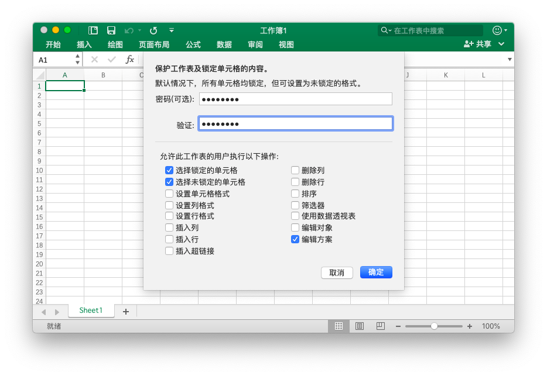

# 工作表

## 设置列可见性 {#SetColVisible}

```go
func (f *File) SetColVisible(sheet, col string, visible bool) error
```

根据给定的工作表名称和列名称设置列可见性。此功能是并发安全的。例如隐藏名为 `Sheet1` 工作表上的 `D` 列：

```go
err := f.SetColVisible("Sheet1", "D", false)
```

隐藏名称为 `Sheet1` 的工作表中的 `D` 至 `F` 列：

```go
err := f.SetColVisible("Sheet1", "D:F", false)
```

## 设置列宽度 {#SetColWidth}

```go
func (f *File) SetColWidth(sheet, startCol, endCol string, width float64) error
```

根据给定的工作表名称、列范围和宽度值设置单个或多个列的宽度。此功能是并发安全的。例如设置名为 `Sheet1` 工作表上 `A` 到 `H` 列的宽度为 `20`：

```go
f := excelize.NewFile()
err := f.SetColWidth("Sheet1", "A", "H", 20)
```

## 设置行高度 {#SetRowHeight}

```go
func (f *File) SetRowHeight(sheet string, row int, height float64) error
```

根据给定的工作表名称、行号和高度值设置单行高度。例如设置名为 `Sheet1` 工作表首行的高度为 `50`：

```go
err := f.SetRowHeight("Sheet1", 1, 50)
```

## 设置行可见性 {#SetRowVisible}

```go
func (f *File) SetRowVisible(sheet string, row int, visible bool) error
```

根据给定的工作表名称和行号设置行可见性。例如隐藏名为 `Sheet1` 工作表上第二行：

```go
err := f.SetRowVisible("Sheet1", 2, false)
```

## 获取工作表名 {#GetSheetName}

```go
func (f *File) GetSheetName(index int) string
```

根据给定的工作表索引获取工作表名称，如果工作表不存在将返回空字符。

## 获取列可见性 {#GetColVisible}

```go
func (f *File) GetColVisible(sheet, column string) (bool, error)
```

根据给定的工作表名称和列名获取工作表中指定列的可见性，可见返回值为 `true`，否则为 `false`。此功能是并发安全的。例如，获取名为 `Sheet1` 的工作表上 `D` 列的可见性：

```go
visible, err := f.GetColVisible("Sheet1", "D")
```

## 获取列宽度 {#GetColWidth}

```go
func (f *File) GetColWidth(sheet, col string) (float64, error)
```

根据给定的工作表和列名获取工作表中指定列的宽度。此功能是并发安全的。

## 获取行高度 {#GetRowHeight}

```go
func (f *File) GetRowHeight(sheet string, row int) (float64, error)
```

根据给定的工作表名称和行号获取工作表中指定行的高度。例如，获取名为 `Sheet1` 的工作表首行的高度：

```go
height, err := f.GetRowHeight("Sheet1", 1)
```

## 获取行可见性 {#GetRowVisible}

```go
func (f *File) GetRowVisible(sheet string, row int) (bool, error)
```

根据给定的工作表名称和行号获取工作表中指定行的可见性。例如，获取名为 `Sheet1` 的工作表第 2 行的可见性：

```go
err := f.GetRowVisible("Sheet1", 2)
```

## 获取工作表索引 {#GetSheetIndex}

```go
func (f *File) GetSheetIndex(sheet string) int
```

根据给定的工作表名称获取该工作表的索引，如果工作表不存在将返回 `-1`。

获取到的索引可以在设置工作簿默认工作表时，作为调用 [`SetActiveSheet()`](workbook.md#SetActiveSheet) 函数的参数使用。

## 获取工作表映射表 {#GetSheetMap}

```go
func (f *File) GetSheetMap() map[int]string
```

获取工作簿中以 ID 和名称构成的全部工作表、图表工作表和对话工作表映射表。

```go
f, err := excelize.OpenFile("Book1.xlsx")
if err != nil {
    return
}
for index, name := range f.GetSheetMap() {
    fmt.Println(index, name)
}
```

## 获取工作表列表 {#GetSheetList}

```go
func (f *File) GetSheetList() []string
```

获取与工作簿内顺序相一致的，包含工作表、图表工作表、对话工作表在内的工作表列表。

## 设置工作表名称 {#SetSheetName}

```go
func (f *File) SetSheetName(source, target string)
```

根据给定的新旧工作表名称重命名工作表。工作表名称最多允许使用 31 个字符，此功能仅更改工作表的名称，而不会更新与单元格关联的公式或引用中的工作表名称。因此使用此功能重命名工作表后可能导致公式错误或参考引用问题。

## 设置工作表属性 {#SetSheetPrOptions}

```go
func (f *File) SetSheetPrOptions(sheet string, opts ...SheetPrOption) error
```

根据给定的工作表名称和筛选项设置工作表属性。

可选属性列表：

|可选属性|类型|
|---|---|
|CodeName|string|
|EnableFormatConditionsCalculation|bool|
|Published|bool|
|FitToPage|bool|
|TabColorIndexed|int|
|TabColorRGB|string|
|TabColorTheme|int|
|TabColorTint|float64|
|AutoPageBreaks|bool|
|OutlineSummaryBelow|bool|

例如：

```go
f := excelize.NewFile()
const sheet = "Sheet1"

if err := f.SetSheetPrOptions(sheet,
    excelize.CodeName("code"),
    excelize.EnableFormatConditionsCalculation(false),
    excelize.Published(false),
    excelize.FitToPage(true),
    excelize.TabColorIndexed(42),
    excelize.TabColorRGB("#FFFF00"),
    excelize.TabColorTheme(ColorMappingTypeLight2),
    excelize.TabColorTint(0.5),
    excelize.AutoPageBreaks(true),
    excelize.OutlineSummaryBelow(false),
); err != nil {
    fmt.Println(err)
}
```

## 获取工作表属性 {#GetSheetPrOptions}

```go
func (f *File) GetSheetPrOptions(sheet string, opts ...SheetPrOptionPtr) error
```

根据给定的工作表名称和筛选项获取工作表属性。

|可选属性|类型|
|---|---|
|CodeName|string|
|EnableFormatConditionsCalculation|bool|
|Published|bool|
|FitToPage|bool|
|TabColorIndexed|int|
|TabColorRGB|string|
|TabColorTheme|int|
|TabColorTint|float64|
|AutoPageBreaks|bool|
|OutlineSummaryBelow|bool|

例如：

```go
f := excelize.NewFile()
const sheet = "Sheet1"

var (
    codeName                          excelize.CodeName
    enableFormatConditionsCalculation excelize.EnableFormatConditionsCalculation
    published                         excelize.Published
    fitToPage                         excelize.FitToPage
    tabColorIndexed                   excelize.TabColorIndexed
    tabColorRGB                       excelize.TabColorRGB
    tabColorTheme                     excelize.TabColorTheme
    tabColorTint                      excelize.TabColorTint
    autoPageBreaks                    excelize.AutoPageBreaks
    outlineSummaryBelow               excelize.OutlineSummaryBelow
)

if err := f.GetSheetPrOptions(sheet,
    &codeName,
    &enableFormatConditionsCalculation,
    &published,
    &fitToPage,
    &tabColorIndexed,
    &tabColorRGB,
    &tabColorTheme,
    &tabColorTint,
    &autoPageBreaks,
    &outlineSummaryBelow,
); err != nil {
    fmt.Println(err)
}
fmt.Println("Defaults:")
fmt.Printf("- codeName: %q\n", codeName)
fmt.Println("- enableFormatConditionsCalculation:", enableFormatConditionsCalculation)
fmt.Println("- published:", published)
fmt.Println("- fitToPage:", fitToPage)
fmt.Printf("- tabColorIndexed: %d\n", tabColorIndexed)
fmt.Printf("- tabColorRGB: %q\n", tabColorRGB)
fmt.Printf("- tabColorTheme: %d\n", tabColorTheme)
fmt.Printf("- tabColorTint: %f\n", tabColorTint)
fmt.Println("- autoPageBreaks:", autoPageBreaks)
fmt.Println("- outlineSummaryBelow:", outlineSummaryBelow)
```

输出：

```text
Defaults:
- codeName: ""
- enableFormatConditionsCalculation: true
- published: true
- fitToPage: false
- tabColorIndexed: -1
- tabColorRGB: ""
- tabColorTheme: -1
- tabColorTint: 0.000000
- autoPageBreaks: false
- outlineSummaryBelow: true
```

## 插入列 {#InsertCols}

```go
func (f *File) InsertCols(sheet, col string, n int) error
```

根据给定的工作表名称、列名称和要插入的列数，在指定列前插入空白列。例如，在名为 `Sheet1` 的工作表的 `C` 列前插入 2 列空白列：

```go
err := f.InsertCols("Sheet1", "C", 2)
```

## 插入行 {#InsertRows}

```go
func (f *File) InsertRows(sheet string, row, n int) error
```

根据给定的工作表名称、行号和要插入的行数，在指定行前插入空白行。例如，在名为 `Sheet1` 的工作表的第 3 行前插入 2 行空白行：

```go
err := f.InsertRows("Sheet1", 3, 2)
```

## 追加复制行 {#DuplicateRow}

```go
func (f *File) DuplicateRow(sheet string, row int) error
```

根据给定的工作表名称和行号，在该行后追加复制。例如，将名为 `Sheet1` 的工作表的第 2 行复制到第 3 行：

```go
err := f.DuplicateRow("Sheet1", 2)
```

请谨慎使用此方法，这将影响所有对该工作表中原有公式、图表等资源引用的更改。如果该工作表包含任何引用值，在使用此方法后使用 Excel 应用程序打开它时将可能导致文件错误。excelize 目前仅支持对工作表上部分引用的更新。

## 复制行 {#DuplicateRowTo}

```go
func (f *File) DuplicateRowTo(sheet string, row, row2 int) error
```

根据给定的工作表名称和行号，在指定行后复制该行。例如，将名为 `Sheet1` 的工作表的第 2 行后复制到第 7 行：

```go
err := f.DuplicateRowTo("Sheet1", 2, 7)
```

请谨慎使用此方法，这将影响所有对该工作表中原有公式、图表等资源引用的更改。如果该工作表包含任何引用值，在使用此方法后使用 Excel 应用程序打开它时将可能导致文件错误。excelize 目前仅支持对工作表上部分引用的更新。

## 创建行的分级显示 {#SetRowOutlineLevel}

```go
func (f *File) SetRowOutlineLevel(sheet string, row int, level uint8) error
```

根据给定的工作表名称、行号和分级参数创建组。例如，在名为 `Sheet1` 的工作表的第 2 行创建 1 级分组。

<p align="center"></p>

```go
err := f.SetRowOutlineLevel("Sheet1", 2, 1)
```

## 创建列的分级显示 {#SetColOutlineLevel}

```go
func (f *File) SetColOutlineLevel(sheet, col string, level uint8) error
```

根据给定的工作表名称、列名称和分级参数创建组。例如，在名为 `Sheet1` 的工作表的 `D` 列创建 2 级分组。

<p align="center"></p>

```go
err := f.SetColOutlineLevel("Sheet1", "D", 2)
```

## 获取行的分级显示 {#GetRowOutlineLevel}

```go
func (f *File) GetRowOutlineLevel(sheet string, row int) (uint8, error)
```

根据给定的工作表名称和行号获取分组级别。例如，获取名为 `Sheet1` 的工作表第 2 行的分组级别。

```go
err := f.GetRowOutlineLevel("Sheet1", 2)
```

## 获取列的分级显示 {#GetColOutlineLevel}

```go
func (f *File) GetColOutlineLevel(sheet, col string) (uint8, error)
```

根据给定的工作表名称和列名称获取分组分级。例如，获取名为 `Sheet1` 的工作表的 `D` 列的分组级别。

```go
level, err := f.GetColOutlineLevel("Sheet1", "D")
```

## 列迭代器 {#Cols}

```go
func (f *File) Cols(sheet string) (*Cols, error)
```

根据给定的工作表名称获取该工作表的列迭代器。此功能是并发安全的。使用列迭代器进行流式读取遍历单元格：

```go
cols, err := f.Cols("Sheet1")
if err != nil {
    fmt.Println(err)
    return
}
for cols.Next() {
    col, err := cols.Rows()
    if err != nil {
        fmt.Println(err)
    }
    for _, rowCell := range col {
        fmt.Print(rowCell, "\t")
    }
    fmt.Println()
}
```

### 列迭代器 - 单列操作

```go
func (cols *Cols) Rows(opts ...Options) ([]string, error)
```

返回当前列所有行的值。

### 列迭代器 - 遍历操作

```go
func (cols *Cols) Next() bool
```

如果下一列有值存在将返回 `true`。

### 列迭代器 - 错误处理

```go
func (cols *Cols) Error() error
```

当查找下一列出现错误时将返回 `error`。

## 行迭代器 {#Rows}

```go
func (f *File) Rows(sheet string) (*Rows, error)
```

根据给定的工作表名称获取该工作表的行迭代器。此功能是并发安全的。使用行迭代器进行流式读取遍历单元格：

```go
rows, err := f.Rows("Sheet1")
if err != nil {
    fmt.Println(err)
    return
}
for rows.Next() {
    row, err := rows.Columns()
    if err != nil {
        fmt.Println(err)
    }
    for _, colCell := range row {
        fmt.Print(colCell, "\t")
    }
    fmt.Println()
}
if err = rows.Close(); err != nil {
    fmt.Println(err)
}
```

### 行迭代器 - 单行操作

```go
func (rows *Rows) Columns(opts ...Options) ([]string, error)
```

此函数流式逐行读取工作表，返回当前行中各列单元格的值，不会跳过工作表尾部的有效空白行。

### 行迭代器 - 遍历操作

```go
func (rows *Rows) Next() bool
```

如果下一行有值存在将返回 `true`。

### 行迭代器 - 错误处理

```go
func (rows *Rows) Error() error
```

当查找下一行出现错误时将返回 `error`。

### 行迭代器 - 读取行属性

```go
func (rows *Rows) GetRowOpts() RowOpts
```

返回当前行的行高、可见性和样式 ID 属性。

### 行迭代器 - 关闭数据流

```go
func (rows *Rows) Close() error
```

关闭数据流并清理打开工作表时可能产生的系统磁盘缓存。

## 在工作表中搜索 {#SearchSheet}

```go
func (f *File) SearchSheet(sheet, value string, reg ...bool) ([]string, error)
```

根据给定的工作表名称，单元格值或正则表达式来获取坐标。此函数仅支持字符串和数字的完全匹配，不支持公式计算后的结果、格式化数字和条件搜索。如果搜索结果是合并的单元格，将返回合并区域左上角的坐标。

例如，在名为 `Sheet1` 的工作表中搜索值 `100` 的坐标:

```go
result, err := f.SearchSheet("Sheet1", "100")
```

例如，在名为 `Sheet1` 的工作表中搜索 `0-9` 范围内数值的坐标:

```go
result, err := f.SearchSheet("Sheet1", "[0-9]", true)
```

## 保护工作表 {#ProtectSheet}

```go
func (f *File) ProtectSheet(sheet string, settings *FormatSheetProtection) error
```

防止其他用户意外或有意更改、移动或删除工作表中的数据。可选字段 `AlgorithmName` 支持指定哈希算法 XOR、MD4、MD5、SHA-1、SHA-256、SHA-384 或 SHA-512，如果未指定哈希算法，默认使用 XOR 算法。例如，将名为 `Sheet1` 的工作表设置密码保护，但是允许选择锁定的单元格、选择未锁定的单元格、编辑方案：

<p align="center"></p>

```go
err := f.ProtectSheet("Sheet1", &excelize.FormatSheetProtection{
    AlgorithmName: "SHA-512",
    Password:      "password",
    EditScenarios: false,
})
```

FormatSheetProtection 定义了保护工作表的设置选项。

```go
type FormatSheetProtection struct {
    AlgorithmName       string
    AutoFilter          bool
    DeleteColumns       bool
    DeleteRows          bool
    EditObjects         bool
    EditScenarios       bool
    FormatCells         bool
    FormatColumns       bool
    FormatRows          bool
    InsertColumns       bool
    InsertHyperlinks    bool
    InsertRows          bool
    Password            string
    PivotTables         bool
    SelectLockedCells   bool
    SelectUnlockedCells bool
    Sort                bool
}
```

## 取消保护工作表 {#UnprotectSheet}

```go
func (f *File) UnprotectSheet(sheet string, password ...string) error
```

根据给定的工作表名称取消保护该工作表，指定第二个可选密码参数以通过密码验证来取消工作表保护。

## 删除列 {#RemoveCol}

```go
func (f *File) RemoveCol(sheet, col string) error
```

根据给定的工作表名称和列名称删除指定列。例如，删除名为 `Sheet1` 的 `C` 列：

```go
err := f.RemoveCol("Sheet1", "C")
```

请谨慎使用此方法，这将影响所有对该工作表中原有公式、图表等资源引用的更改。如果该工作表包含任何引用值，在使用此方法后使用 Excel 应用程序打开它时将可能导致文件错误。excelize 目前仅支持对工作表上部分引用的更新。

## 删除行 {#RemoveRow}

```go
func (f *File) RemoveRow(sheet string, row int) error
```

根据给定的工作表名称和行号删除指定行。例如，删除名为 `Sheet1` 的第 `3` 行：

```go
err := f.RemoveRow("Sheet1", 3)
```

请谨慎使用此方法，这将影响所有对该工作表中原有公式、图表等资源引用的更改。如果该工作表包含任何引用值，在使用此方法后使用 Excel 应用程序打开它时将可能导致文件错误。Excelize 目前仅支持对工作表上部分引用的更新。

## 按列赋值 {#SetSheetCol}

```go
func (f *File) SetSheetCol(sheet, cell string, slice interface{}) error
```

根据给定的工作表名称、起始坐标和 `slice` 类型引用按列赋值。例如，在名为 `Sheet1` 的工作表 `B` 列上，以 `B6` 单元格作为起始坐标按列赋值：

```go
err := f.SetSheetCol("Sheet1", "B6", &[]interface{}{"1", nil, 2})
```

## 按行赋值 {#SetSheetRow}

```go
func (f *File) SetSheetRow(sheet, cell string, slice interface{}) error
```

根据给定的工作表名称、起始坐标和 `slice` 类型引用按行赋值。此功能是并发安全的。例如，在名为 `Sheet1` 的工作表第 `6` 行上，以 `B6` 单元格作为起始坐标按行赋值：

```go
err := f.SetSheetRow("Sheet1", "B6", &[]interface{}{"1", nil, 2})
```

## 插入分页符 {#InsertPageBreak}

```go
func (f *File) InsertPageBreak(sheet, cell string) error
```

根据给定的工作表名称和单元格坐标插入分页符。分页符是将工作表分成单独的页面以便打印的分隔线。

## 删除分页符 {#RemovePageBreak}

```go
func (f *File) RemovePageBreak(sheet, cell string) error
```

根据给定的工作表名称和单元格坐标删除分页符。
