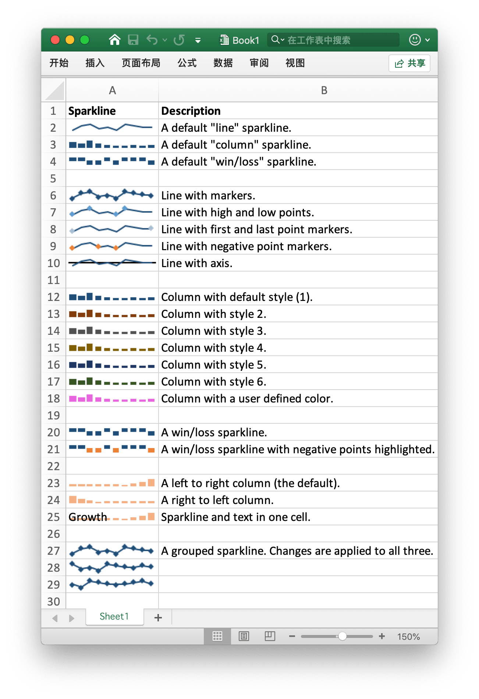

# 迷你图

迷你图是 Excel 2010 及以上版本中的功能，是放入单元格中的小型图，每个迷你图代表所选内容中的一行数据。将迷你图放在其数据附近可提供非常好的视觉冲击。

<p align="center"></p>

[迷你图](https://en.wikipedia.org/wiki/Sparklines) 是由 [Edward Tufte](https://en.wikipedia.org/wiki/Edward_Tufte) 发明的。

## Add Sparkline

```go
func (f *File) AddSparkline(sheet string, opt *SparklineOption) error
```

根据给定的工作表名和迷你图属性添加迷你图。迷你图是工作表单元格中直观表示数据的微型图表。 使用迷你图以一系列值显示趋势（如季节性增加或减少、经济周期），或突出显示最大值和最小值。迷你图在 Excel 2007 中将不会显示。例如添加组迷你图：

```go
err := f.AddSparkline("Sheet1", &excelize.SparklineOption{
    Location: []string{"A1", "A2", "A3"},
    Range:    []string{"Sheet2!A1:J1", "Sheet2!A2:J2", "Sheet2!A3:J3"},
    Markers:  true,
})
```

<p align="center"></p>

下表为 Excelize 支持的迷你图格式选项：

参数 | 描述
---|---
Location  | 必须参数, 数目需要与 `Range` 保持一致
Range     | 必须参数, 数目需要与 `Location` 保持一致
Type      | 枚举值: `line`, `column`, `win_loss`
Style     | 数值范围: 0 - 35
Hight     | 切换迷你图高点：突出显示所选迷你图组中数据的最高点
Low       | 切换迷你图低点：突出显示所选迷你图组中数据的最低点
First     | 切换迷你图首点：突出显示所选迷你图组中数据的第一点
Last      | 切换迷你图尾点：突出显示所选迷你图组中数据的最后一点
Negative  | 切换迷你图负点：突出显示所选迷你图组中数据的负值
Markers   | 切换迷你图标记：突出显示所选迷你图组中数据的每个点
ColorAxis | 迷你图颜色，形如 `RRGGBB` 格式的 RGB 色值
Axis      | 显示迷你图坐标轴
