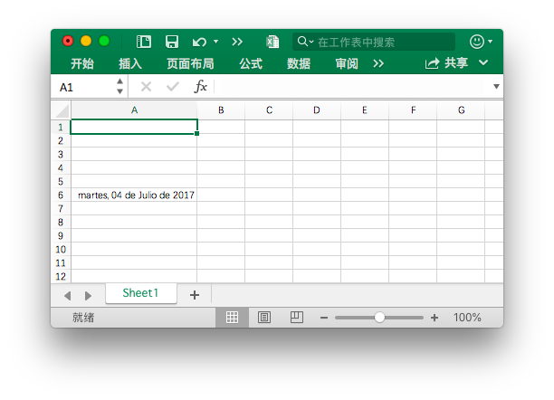

# 样式

Alignment 映射单元格对齐样式设置。

```go
type Alignment struct {
    Horizontal      string
    Indent          int
    JustifyLastLine bool
    ReadingOrder    uint64
    RelativeIndent  int
    ShrinkToFit     bool
    TextRotation    int
    Vertical        string
    WrapText        bool
}
```

Border 映射单元格边框样式设置。

```go
type Border struct {
    Type  string
    Color string
    Style int
}
```

Font 映射字体样式设置。

```go
type Font struct {
    Bold         bool
    Italic       bool
    Underline    string
    Family       string
    Size         float64
    Strike       bool
    Color        string
    ColorIndexed int
    ColorTheme   *int
    ColorTint    float64
    VertAlign    string
}
```

Fill 映射单元格样式填充设置。

```go
type Fill struct {
    Type    string
    Pattern int
    Color   []string
    Shading int
}
```

Protection 映射保护单元格属性设置。

```go
type Protection struct {
    Hidden bool
    Locked bool
}
```

Style 映射单元格样式设置。

```go
type Style struct {
    Border        []Border
    Fill          Fill
    Font          *Font
    Alignment     *Alignment
    Protection    *Protection
    NumFmt        int
    DecimalPlaces int
    CustomNumFmt  *string
    Lang          string
    NegRed        bool
}
```

## 创建样式 {#NewStyle}

```go
func (f *File) NewStyle(style *Style) (int, error)
```

通过给定的样式格式结构体创建样式并返回样式索引。此功能是并发安全的。请注意，`Font.Color` 需要使用 `RRGGBB` 格式的 RGB 十六进制色值代码。

### 边框 {#border}

下面的表格是 Excelize 中 `Border.Type` 支持的边框类型：

类型|说明|类型|说明
---|---|---|---
left|左侧边框|top|顶部边框
right|右侧边框|bottom|底部边框
diagonalDown|对角线向下|diagonalUp|对角线向上

下面的表格是 Excelize 中 `Border.Style` 支持的边框线型索引与对应的线型名称、粗细及预览效果：

索引|线型名称|粗细|预览效果
---|---|---|---
0|无|0|
1|连续线|1|
2|连续线|2|
3|短线|1|
4|点线|1|
5|连续线|3|
6|双线|3|
7|连续线|0|
8|短线|2|
9|短线与点间隔线|1|
10|短线与点间隔线|2|
11|短线与两个点一组重复线|1|
12|短线与两个点一组重复线|2|
13|斜线与点线|2|

Excelize 中的 `Border.Style` 边框线型索引与 Office Excel 应用程序“设置单元格格式” - “边框”对话框中的关系对照：

索引|预览效果|索引|预览效果
---|---|---|---
0||12|
7||13|
4||10|
11||8|
9||2|
3||5|
1||6|

### 颜色填充 {#shading}

下面的表格是 Excelize 中单元格颜色填充样式和索引 `Fill.Shading` 参数的关系对照：

索引|样式|索引|样式
---|---|---|---
0|横向|3|对角线向下
1|纵向|4|从对角线向内
2|对角线向上|5|从中心向外

### 图案填充 {#pattern}

下面的表格是 Excelize 中单元格图案填充样式和索引 `Fill.Pattern` 参数的关系对照：

索引|样式|索引|样式
---|---|---|---
0|无|10|
1||11|
2||12|
3||13|
4||14|
5||15|
6||16|
7||17|
8||18|
9|||

### 对齐方式 {#align}

#### 水平对齐方式

下面的表格是 Excelize 中单元格水平对齐方式 `Alignment.Horizontal` 参数与样式关系对照表：

参数|样式
---|---
left|向左（缩进）
center|居中
right|靠右（缩进）
fill|填充
justify|两端对齐
centerContinuous|跨列居中
distributed|分散对齐（缩进）

#### 垂直对齐方式

下面的表格是 Excelize 中单元格垂直对齐方式 `Alignment.Vertical` 参数与样式关系对照表：

参数|样式
---|---
top|顶端对齐
center|居中
justify|两端对齐
distributed|分散对齐

### 字体下划线 {#underline}

下面的表格是 Excelize 中单元格字体下划线 `Font.Underline` 参数与样式关系对照表：

参数|样式
---|---
single|单线
double|双线

### 数字自定义格式 {#number_format}

下面的表格是 Excelize 中支持的索引 `Style.NumFmt` 参数与数字自定义格式类型对照表：

索引|类型
---|---
0|`General`
1|`0`
2|`0.00`
3|`#,##0`
4|`#,##0.00`
5|`($#,##0_);($#,##0)`
6|`($#,##0_);[Red]($#,##0)`
7|`($#,##0.00_);($#,##0.00)`
8|`($#,##0.00_);[Red]($#,##0.00)`
9|`0%`
10|`0.00%`
11|`0.00E+00`
12|`# ?/?`
13|`# ??/??`
14|`m/d/yy`
15|`d-mmm-yy`
16|`d-mmm`
17|`mmm-yy`
18|`h:mm AM/PM`
19|`h:mm:ss AM/PM`
20|`h:mm`
21|`h:mm:ss`
22|`m/d/yy h:mm`
...|`...`
37|`(#,##0_);(#,##0)`
38|`(#,##0_);[Red](#,##0)`
39|`(#,##0.00_);(#,##0.00)`
40|`(#,##0.00_);[Red](#,##0.00)`
41|`_(* #,##0_);_(* (#,##0);_(* "-"_);_(@_)`
42|`_($* #,##0_);_($* (#,##0);_($* "-"_);_(@_)`
43|`_(* #,##0.00_);_(* (#,##0.00);_(* "-"??_);_(@_)`
44|`_($* #,##0.00_);_($* (#,##0.00);_($* "-"??_);_(@_)`
45|`mm:ss`
46|`[h]:mm:ss`
47|`mm:ss.0`
48|`##0.0E+0`
49|`@`

#### 繁体中文数字自定义格式

下面的表格是 Excelize 中支持的索引 `Style.NumFmt` 参数与繁体中文 `zh-tw` 版本数字自定义格式类型对照表：

索引|类型
---|---
27|`[$-404]e/m/d`
28|`[$-404]e"年"m"月"d"日"`
29|`[$-404]e"年"m"月"d"日"`
30|`m/d/yy`
31|`yyyy"年"m"月"d"日"`
32|`hh"時"mm"分"`
33|`hh"時"mm"分"ss"秒"`
34|`上午/下午 hh"時"mm"分"`
35|`上午/下午 hh"時"mm"分"ss"秒"`
36|`[$-404]e/m/d`
50|`[$-404]e/m/d`
51|`[$-404]e"年"m"月"d"日"`
52|`上午/下午 hh"時"mm"分"`
53|`上午/下午 hh"時"mm"分"ss"秒"`
54|`[$-404]e"年"m"月"d"日"`
55|`上午/下午 hh"時"mm"分"`
56|`上午/下午 hh"時"mm"分"ss"秒"`
57|`[$-404]e/m/d`
58|`[$-404]e"年"m"月"d"日"`

#### 简体中文数字自定义格式

下面的表格是 Excelize 中支持的索引 `Style.NumFmt` 参数与简体中文 `zh-cn` 版本数字自定义格式类型对照表：

索引|类型
---|---
27|`yyyy"年"m"月"`
28|`m"月"d"日"`
29|`m"月"d"日"`
30|`m-d-yy`
31|`yyyy"年"m"月"d"日"`
32|`h"时"mm"分"`
33|`h"时"mm"分"ss"秒"`
34|`上午/下午 h"时"mm"分"`
35|`上午/下午 h"时"mm"分"ss"秒`
36|`yyyy"年"m"月`
50|`yyyy"年"m"月`
51|`m"月"d"日`
52|`yyyy"年"m"月`
53|`m"月"d"日`
54|`m"月"d"日`
55|`上午/下午 h"时"mm"分`
56|`上午/下午 h"时"mm"分"ss"秒`
57|`yyyy"年"m"月`
58|`m"月"d"日"`

#### Unicode 繁体中文字型数字自定义格式

下面的表格是 Excelize 中支持的索引 `Style.NumFmt` 参数与 Unicode 繁体中文字型 `zh-tw` 版本数字自定义格式类型对照表：

索引|类型
---|---
27|`[$-404]e/m/`
28|`[$-404]e"5E74"m"6708"d"65E5`
29|`[$-404]e"5E74"m"6708"d"65E5`
30|`m/d/y`
31|`yyyy"5E74"m"6708"d"65E5`
32|`hh"6642"mm"5206`
33|`hh"6642"mm"5206"ss"79D2`
34|`4E0A5348/4E0B5348hh"6642"mm"5206`
35|`4E0A5348/4E0B5348hh"6642"mm"5206"ss"79D2`
36|`[$-404]e/m/`
50|`[$-404]e/m/`
51|`[$-404]e"5E74"m"6708"d"65E5`
52|`4E0A5348/4E0B5348hh"6642"mm"5206`
53|`4E0A5348/4E0B5348hh"6642"mm"5206"ss"79D2`
54|`[$-404]e"5E74"m"6708"d"65E5`
55|`4E0A5348/4E0B5348hh"6642"mm"5206`
56|`4E0A5348/4E0B5348hh"6642"mm"5206"ss"79D2`
57|`[$-404]e/m/`
58|`[$-404]e"5E74"m"6708"d"65E5"`

#### Unicode 简体中文字型数字自定义格式

下面的表格是 Excelize 中支持的索引 `Style.NumFmt` 参数与 Unicode 简体中文字型 `zh-cn` 版本数字自定义格式类型对照表：

索引|类型
---|---
27|`yyyy"5E74"m"6708`
28|`m"6708"d"65E5`
29|`m"6708"d"65E5`
30|`m-d-y`
31|`yyyy"5E74"m"6708"d"65E5`
32|`h"65F6"mm"5206`
33|`h"65F6"mm"5206"ss"79D2`
34|`4E0A5348/4E0B5348h"65F6"mm"5206`
35|`4E0A5348/4E0B5348h"65F6"mm"5206"ss"79D2`
36|`yyyy"5E74"m"6708`
50|`yyyy"5E74"m"6708`
51|`m"6708"d"65E5`
52|`yyyy"5E74"m"6708`
53|`m"6708"d"65E5`
54|`m"6708"d"65E5`
55|`4E0A5348/4E0B5348h"65F6"mm"5206`
56|`4E0A5348/4E0B5348h"65F6"mm"5206"ss"79D2`
57|`yyyy"5E74"m"6708`
58|`m"6708"d"65E5"`

#### 日本语数字自定义格式

下面的表格是 Excelize 中支持的索引 `Style.NumFmt` 参数与日本语 `ja-jp` 版本数字自定义格式类型对照表：

索引|类型
---|---
27|`[$-411]ge.m.d`
28|`[$-411]ggge"年"m"月"d"日`
29|`[$-411]ggge"年"m"月"d"日`
30|`m/d/y`
31|`yyyy"年"m"月"d"日`
32|`h"時"mm"分`
33|`h"時"mm"分"ss"秒`
34|`yyyy"年"m"月`
35|`m"月"d"日`
36|`[$-411]ge.m.d`
50|`[$-411]ge.m.d`
51|`[$-411]ggge"年"m"月"d"日`
52|`yyyy"年"m"月`
53|`m"月"d"日`
54|`[$-411]ggge"年"m"月"d"日`
55|`yyyy"年"m"月`
56|`m"月"d"日`
57|`[$-411]ge.m.d`
58|`[$-411]ggge"年"m"月"d"日"`

#### 韩语数字自定义格式

下面的表格是 Excelize 中支持的索引 `Style.NumFmt` 参数与韩语 `ko-kr` 版本数字自定义格式类型对照表：

索引|类型
---|---
27|`yyyy"年" mm"月" dd"日`
28|`mm-d`
29|`mm-d`
30|`mm-dd-y`
31|`yyyy"년" mm"월" dd"일`
32|`h"시" mm"분`
33|`h"시" mm"분" ss"초`
34|`yyyy-mm-d`
35|`yyyy-mm-d`
36|`yyyy"年" mm"月" dd"日`
50|`yyyy"年" mm"月" dd"日`
51|`mm-d`
52|`yyyy-mm-d`
53|`yyyy-mm-d`
54|`mm-d`
55|`yyyy-mm-d`
56|`yyyy-mm-d`
57|`yyyy"年" mm"月" dd"日`
58|`mm-dd`

#### Unicode 日本语字型数字自定义格式

下面的表格是 Excelize 中支持的索引 `Style.NumFmt` 参数与 Unicode 日本语字型 `ja-jp` 版本数字自定义格式类型对照表：

索引|类型
---|---
27|`[$-411]ge.m.d`
28|`[$-411]ggge"5E74"m"6708"d"65E5`
29|`[$-411]ggge"5E74"m"6708"d"65E5`
30|`m/d/y`
31|`yyyy"5E74"m"6708"d"65E5`
32|`h"6642"mm"5206`
33|`h"6642"mm"5206"ss"79D2`
34|`yyyy"5E74"m"6708`
35|`m"6708"d"65E5`
36|`[$-411]ge.m.d`
50|`[$-411]ge.m.d`
51|`[$-411]ggge"5E74"m"6708"d"65E5`
52|`yyyy"5E74"m"6708`
53|`m"6708"d"65E5`
54|`[$-411]ggge"5E74"m"6708"d"65E5`
55|`yyyy"5E74"m"6708`
56|`m"6708"d"65E5`
57|`[$-411]ge.m.d`
58|`[$-411]ggge"5E74"m"6708"d"65E5"`

#### Unicode 韩语字型数字自定义格式

下面的表格是 Excelize 中支持的索引 `Style.NumFmt` 参数与 Unicode 韩语字型 `ko-kr` 版本数字自定义格式类型对照表：

索引|类型
---|---
27|`yyyy"5E74" mm"6708" dd"65E5`
28|`mm-d`
29|`mm-d`
30|`mm-dd-y`
31|`yyyy"B144" mm"C6D4" dd"C77C`
32|`h"C2DC" mm"BD84`
33|`h"C2DC" mm"BD84" ss"CD08`
34|`yyyy-mm-d`
35|`yyyy-mm-d`
36|`yyyy"5E74" mm"6708" dd"65E5`
50|`yyyy"5E74" mm"6708" dd"65E5`
51|`mm-d`
52|`yyyy-mm-d`
53|`yyyy-mm-d`
54|`mm-d`
55|`yyyy-mm-d`
56|`yyyy-mm-d`
57|`yyyy"5E74" mm"6708" dd"65E5`
58|`mm-dd`

#### 泰国语数字自定义格式

下面的表格是 Excelize 中支持的索引 `Style.NumFmt` 参数与泰国语 `th-th` 版本数字自定义格式类型对照表：

索引|类型
---|---
59|`t`
60|`t0.0`
61|`t#,##`
62|`t#,##0.0`
67|`t0`
68|`t0.00`
69|`t# ?/`
70|`t# ??/?`
71|`ว/ด/ปปป`
72|`ว-ดดด-ป`
73|`ว-ดด`
74|`ดดด-ป`
75|`ช:น`
76|`ช:นน:ท`
77|`ว/ด/ปปปป ช:น`
78|`นน:ท`
79|`[ช]:นน:ท`
80|`นน:ทท.`
81|`d/m/bb`

#### Unicode 泰国语型数字自定义格式

下面的表格是 Excelize 中支持的索引 `Style.NumFmt` 参数与 Unicode 泰国语字型 `th-th` 版本数字自定义格式类型对照表：

索引|类型
---|---
59|`t`
60|`t0.0`
61|`t#,##`
62|`t#,##0.0`
67|`t0`
68|`t0.00`
69|`t# ?/`
70|`t# ??/?`
71|`0E27/0E14/0E1B0E1B0E1B0E1`
72|`0E27-0E140E140E14-0E1B0E1`
73|`0E27-0E140E140E1`
74|`0E140E140E14-0E1B0E1`
75|`0E0A:0E190E1`
76|`0E0A:0E190E19:0E170E1`
77|`0E27/0E14/0E1B0E1B0E1B0E1B 0E0A:0E190E1`
78|`0E190E19:0E170E1`
79|`[0E0A]:0E190E19:0E170E1`
80|`0E190E19:0E170E17.`
81|`d/m/bb`

### 货币格式

Excelize 目前支持的货币格式索引如下表所示，索引号仅用于标记，不在 Office Excel 文件中使用，目前无法通过函数 [`GetCellValue`](cell.md#GetCellValue) 获取格式化值后的值。

索引|货币格式
---|---
164|¥
165|$ 英语（美国）
166|$ 切罗基语（切罗基，美国）
167|$ 中文（简体，新加坡）
168|$ 中文（繁体，中国台湾）
169|$ 英语（澳大利亚）
170|$ 英语（伯利兹）
171|$ 英语（加拿大）
172|$ 英语（牙买加）
173|$ 英语（新西兰）
174|$ 英语（新加坡）
175|$ 英语（特立尼达岛和多巴哥）
176|$ 英语（加勒比海）
177|$ 中文（新加坡）
178|$ 法语（加拿大）
179|$ 夏威夷语
180|$ 马来语（文莱达鲁萨兰国）
181|$ 克丘亚语（厄瓜多尔）
182|$ 西班牙语（智利）
183|$ 西班牙语（哥伦比亚）
184|$ 西班牙语（厄瓜多尔）
185|$ 西班牙语（萨尔瓦多）
186|$ 西班牙语（墨西哥）
187|$ 西班牙语（波多黎各）
188|$ 西班牙语（美国）
189|$ 西班牙语（乌拉圭）
190|£ 英语（英国）
191|£ 苏格兰盖尔语（英国）
192|£ 威尔士语
193|¥ 中文（简体，中国大陆）
194|¥ 日语
195|¥ 彝语（中国）
196|¥ 藏语（中国）
197|¥ 维吾尔语（中国）
198|֏ 亚美尼亚语
199|؋ 普什图语
200|؋ 达里语
201|৳ 孟加拉语（孟加拉）
202|៛ 高棉语
203|₡ 西班牙语（哥斯达黎加）
204|₦ 豪撒语
205|₦ 伊博语
206|₩ 朝鲜语
207|₪ 希伯来语
208|₫ 越南语
209|€ 巴斯克语
210|€ 布列塔尼语
211|€ 加泰罗尼亚语
212|€ 科西嘉语
213|€ 荷兰语（比利时）
214|€ 荷兰语（荷兰）
215|€ 英语（爱尔兰）
216|€ 爱沙尼亚语
217|€ 欧元(€123)
218|€ 欧元(123€)
219|€ 芬兰语
220|€ 法语（比利时）
221|€ 法语（法国）
222|€ 法语（卢森堡）
223|€ 法语（摩纳哥）
224|€ 法语（留尼旺岛）
225|€ 加利西亚语
226|€ 德语（奥地利）
227|€ 德语（德国）
228|€ 德语（卢森堡）
229|€ 希腊语
230|€ 伊那里萨米语（芬兰）
231|€ 爱尔兰语
232|€ 意大利语（意大利）
233|€ 英语（爱尔兰）
234|€ 塞尔维亚语（拉丁语，黑山）
235|€ 拉脱维亚语
236|€ 立陶宛语
237|€ 下索布语
238|€ 卢森堡语
239|€ 马耳他语
240|€ 北萨米语（芬兰）
241|€ 奥克西唐语
242|€ 葡萄牙语（葡萄牙）
243|€ 塞尔维亚语（西里尔文，黑山）
244|€ 斯科特萨米语（芬兰）
245|€ 斯洛伐克语
246|€ 斯洛文尼亚语
247|€ 西班牙语（西班牙）
248|€ 瑞典语（芬兰）
249|€ 阿尔萨斯语（法国）
250|€ 上索布语
251|€ 西弗里西亚语
252|₭ 老挝语
253|₮ 蒙古语（蒙古）
254|₮ 蒙古语（蒙古）
255|₱ 英语（菲律宾）
256|₱ 菲律宾语
257|₴ 乌克兰语
258|₸ 哈萨克语
259|₹ 克什米尔语（阿拉伯文）
260|₹ 英语（印度）
261|₹ 古吉拉特语
262|₹ 印地语
263|₹ 埃纳德语
264|₹ 克什米尔语
265|₹ 孔卡尼语
266|₹ 曼尼普尔语
267|₹ 马拉地语
268|₹ 尼泊尔语（印度）
269|₹ 奥里亚语
270|₹ 旁遮普语（印度）
271|₹ 梵语
272|₹ 信德语（梵文）
273|₹ 泰米尔语（印度）
274|₹ 乌尔都语（印度）
275|₺ 土耳其语（土耳其）
276|₼ 阿塞拜疆语（拉丁语）
277|₼ 阿塞拜疆语（西里尔文）
278|₽ 俄语
279|₽ 萨哈语
280|₾ 格鲁吉亚语
281|B/. 西班牙语（巴拿马）
282|Br 奥罗莫语
283|Br 白俄罗斯语
284|Br 白俄罗斯语
285|Bs 克丘亚语（玻利维亚）
286|Bs 西班牙语（玻利维亚）
287|BS. 克丘亚语（玻利维亚）
288|BWP 茨瓦纳语（博茨瓦纳）
289|C$ 西班牙语（尼加拉瓜）
290|CA$ 因纽特语（拉丁语，加拿大）
291|CA$ 莫霍克语（加拿大）
292|CA$ 因纽特语（加拿大）
293|CFA 法语（马里）
294|CFA 法语（塞内加尔）
295|CFA 富拉语（塞内加尔）
296|CFA 沃洛夫语（塞内加尔）
297|CHF 法语（瑞士）
298|CHF 德语（列支敦士登）
299|CHF 标准德语（瑞士）
300|CHF 意大利语（瑞士）
301|CHF 罗曼什语
302|CLP 马普切语（智利）
303|CN¥ 蒙古语（中国）
304|DZD 中阿特斯柏柏尔语（拉丁文，阿尔及利亚）
305|FCFA 法语（喀麦隆）
306|Ft 匈牙利语
307|G 法语（海地）
308|Gs. 西班牙语（巴拉圭）
309|GTQ 基切语
310|HK$ 中文（繁体，香港特别行政区）
311|HK$ 英语（香港特别行政区）
312|HRK 克罗地亚语（克罗地亚）
313|IDR 英语（印度尼西亚）
314|IQD 阿拉伯语、中库尔德语（伊拉克）
315|ISK 冰岛语
316|K 缅甸语
317|Kč 捷克语
318|KM 波斯尼亚语（拉丁语）
319|KM 克罗地亚语（波斯尼亚和黑塞哥维那）
320|KM 塞尔维亚语（拉丁语，波斯尼亚和黑塞哥维那）
321|Kr 法罗语
322|Kr 北萨米语（挪威）
323|kr 北萨米语（瑞典）
324|Kr 挪威语（博克马尔语）
325|Kr 挪威语（尼诺斯克语）
326|kr瑞典语（瑞典）
327|kr.丹麦语
328|kr.格陵兰语
329|Ksh 斯瓦希里语
330|L 罗马尼亚语（摩尔多瓦）
331|L 俄语（摩尔多瓦）
332|L 西班牙语（洪都拉斯）
333|Lekë 阿尔巴尼亚语
334|MAD 中阿特拉斯柏柏尔语（提夫纳语，摩洛哥）
335|MAD 法语（摩洛哥）
336|MAD 中阿特拉斯柏柏尔语（提夫纳语，摩洛哥）
337|MOP$ 中文（繁体，澳门特别行政区）
338|MVR 迪维希语（马尔代夫）
339|Nfk 提格里尼亚语（厄立特里亚省）
340|NGN 克瓦语（埃多人说的克瓦语）
341|NGN 富拉（尼日利亚）
342|NGN 伊比比奥语（尼日利亚）
343|NGN 卡努里语
344|NOK 律勒欧萨米语（挪威）
345|NOK 南萨米语（挪威）
346|NZ$ 毛利语（新西兰）
347|PKR 信德语（巴基斯坦）
348|PYG 瓜拉尼语（巴拉圭）
349|Q 西班牙语（危地马拉）
350|R 南非荷兰语
351|R 英语（南非）
352|R 祖鲁语
353|R$ 葡萄牙语（巴西）
354|RD$ 西班牙语（多米尼加共和国）
355|RF 卢旺达语
356|RM 英语（马来西亚）
357|RM 马来语（马来西亚）
358|RON 罗马尼亚语
359|Rp 印度尼西亚语
360|Rs 乌尔都语（巴基斯坦）
361|Rs. 泰米尔语（斯里兰卡）
362|RSD 塞尔维亚语（拉丁语，塞尔维亚和黑山（前））
363|RSD 塞尔维亚语（西里尔文，塞尔维亚和黑山（前））
364|RUB 巴什基尔语（俄罗斯）
365|RUB 鞑靼语（俄罗斯）
366|S/. 盖丘亚语（秘鲁）
367|S/. 西班牙语（秘鲁）
368|SEK 律勒欧萨米语（瑞典）
369|SEK 南萨米语（瑞典）
370|soʻm 乌兹别克语（拉丁语）
371|soʻm 乌兹别克语（拉丁语）
372|SYP 叙利亚语（叙利亚）
373|THB 泰语（泰国）
374|TMT 土库曼语
375|US$ 英语（津巴布韦）
376|ZAR 北索托语（南非）
377|ZAR 南索托语（南非）
378|ZAR 特松加语（南非）
379|ZAR 茨瓦纳语（南非）
380|ZAR 文达语（南非）
381|ZAR 科萨语（南非）
382|zł 波兰语
383|ден 马其顿语（马其顿）
384|KM 波斯尼亚语（西里尔文）
385|KM 塞尔维亚语（西里尔文、波斯尼亚和黑塞哥维那）
386|лв. 保加利亚语
387|p. 白俄罗斯语（白俄罗斯）
388|сом 吉尔吉斯语
389|сом 吉尔吉斯语
390|ج.م. 阿拉伯语（埃及）
391|د.أ. 阿拉伯语（约旦）
392|د.أ. 阿拉伯语（阿拉伯联合酋长国）
393|د.ب. 阿拉伯语（巴林）
394|د.ت. 阿拉伯语（突尼斯）
395|د.ج. 阿拉伯语（阿尔及利亚）
396|د.ع. 阿拉伯语（伊拉克）
397|د.ك. 阿拉伯语（科威特）
398|د.ل. 阿拉伯语（利比亚）
399|د.م. 阿拉伯语（摩洛哥）
400|ر 旁遮普语（巴基斯坦）
401|ر.س. 阿拉伯语（沙特阿拉伯）
402|ر.ع. 阿拉伯语（阿曼）
403|ر.ق. 阿拉伯语（卡塔尔）
404|ر.ي. 阿拉伯语（也门）
405|ریال 波斯语（伊朗）
406|ل.س. 阿拉伯语（叙利亚）
407|ل.ل. 阿拉伯语（黎巴嫩）
408|ብር 阿姆哈拉语
409|रू 尼泊尔语
410|රු. 僧伽罗语
411|ADP
412|AED
413|AFA
414|AFN
415|ALL
416|AMD
417|ANG
418|AOA
419|ARS
420|ATS
421|AUD
422|AWG
423|AZM
424|AZN
425|BAM
426|BBD
427|BDT
428|BEF
429|BGL
430|BGN
431|BHD
432|BIF
433|BMD
434|BND
435|BOB
436|BOV
437|BRL
438|BSD
439|BTN
440|BWP
441|BYR
442|BZD
443|CAD
444|CDF
445|CHE
446|CHF
447|CHW
448|CLF
449|CLP
450|CNY
451|COP
452|COU
453|CRC
454|CSD
455|CUC
456|CVE
457|CYP
458|CZK
459|DEM
460|DJF
461|DKK
462|DOP
463|DZD
464|ECS
465|ECV
466|EEK
467|EGP
468|ERN
469|ESP
470|ETB
471|EUR
472|FIM
473|FJD
474|FKP
475|FRF
476|GBP
477|GEL
478|GHC
479|GHS
480|GIP
481|GMD
482|GNF
483|GRD
484|GTQ
485|GYD
486|HKD
487|HNL
488|HRK
489|HTG
490|HUF
491|IDR
492|IEP
493|ILS
494|INR
495|IQD
496|IRR
497|ISK
498|ITL
499|JMD
500|JOD
501|JPY
502|KAF
503|KES
504|KGS
505|KHR
506|KMF
507|KPW
508|KRW
509|KWD
510|KYD
511|KZT
512|LAK
513|LBP
514|LKR
515|LRD
516|LSL
517|LTL
518|LUF
519|LVL
520|LYD
521|MAD
522|MDL
523|MGA
524|MGF
525|MKD
526|MMK
527|MNT
528|MOP
529|MRO
530|MTL
531|MUR
532|MVR
533|MWK
534|MXN
535|MXV
536|MYR
537|MZM
538|MZN
539|NAD
540|NGN
541|NIO
542|NLG
543|NOK
544|NPR
545|NTD
546|NZD
547|OMR
548|PAB
549|PEN
550|PGK
551|PHP
552|PKR
553|PLN
554|PTE
555|PYG
556|QAR
557|ROL
558|RON
559|RSD
560|RUB
561|RUR
562|RWF
563|SAR
564|SBD
565|SCR
566|SDD
567|SDG
568|SDP
569|SEK
570|SGD
571|SHP
572|SIT
573|SKK
574|SLL
575|SOS
576|SPL
577|SRD
578|SRG
579|STD
580|SVC
581|SYP
582|SZL
583|THB
584|TJR
585|TJS
586|TMM
587|TMT
588|TND
589|TOP
590|TRL
591|TRY
592|TTD
593|TWD
594|TZS
595|UAH
596|UGX
597|USD
598|USN
599|USS
600|UYI
601|UYU
602|UZS
603|VEB
604|VEF
605|VND
606|VUV
607|WST
608|XAF
609|XAG
610|XAU
611|XB5
612|XBA
613|XBB
614|XBC
615|XBD
616|XCD
617|XDR
618|XFO
619|XFU
620|XOF
621|XPD
622|XPF
623|XPT
624|XTS
625|XXX
626|YER
627|YUM
628|ZAR
629|ZMK
630|ZMW
631|ZWD
632|ZWL
633|ZWN
634|ZWR

Excelize 支持为单元格设置自定义数字格式。例如，将 `Sheet1` 工作表的 `A6` 单元格 设置为乌拉圭（西班牙）格式的日期类型：

<p align="center"></p>

```go
f := excelize.NewFile()
defer func() {
    if err := f.Close(); err != nil {
        fmt.Println(err)
    }
}()
if err := f.SetCellValue("Sheet1", "A6", 42920.5); err != nil {
    fmt.Println(err)
    return
}
exp := "[$-380A]dddd\\,\\ dd\" de \"mmmm\" de \"yyyy;@"
style, err := f.NewStyle(&excelize.Style{CustomNumFmt: &exp})
if err != nil {
    fmt.Println(err)
    return
}
err = f.SetCellStyle("Sheet1", "A6", "A6", style)
```

单元格 `Sheet1!A6` 在 Office Excel 应用程序中将会被格式化为：`martes, 04 de Julio de 2017`

## 设置列样式 {#SetColStyle}

```go
func (f *File) SetColStyle(sheet, columns string, styleID int) error
```

根据给定的工作表名称、列区域和样式索引设置列样式。此功能是并发安全的。请注意，这将覆盖列的已有样式，而不会将样式与已有样式叠加或合并。

例1，为名称为 `Sheet1` 的工作表中的 `H` 列设置样式：

```go
err = f.SetColStyle("Sheet1", "H", style)
```

例2，为名称为 `Sheet1` 的工作表中的 `C:F` 列设置样式：

```go
err = f.SetColStyle("Sheet1", "C:F", style)
```

## 获取列样式 {#GetColStyle}

```go
func (f *File) GetColStyle(sheet, col string) (int, error)
```

根据给定的工作表名称和列名称获取列的样式索引。此功能是并发安全的。

## 设置行样式 {#SetRowStyle}

根据给定的工作表名称、行区域和样式索引设置行样式。请注意，这将覆盖行的已有样式，而不会将样式与已有样式叠加或合并。

例1，为名称为 `Sheet1` 的工作表的第 1 行设置样式:

```go
err := f.SetRowStyle("Sheet1", 1, 1, styleID)
```

例2，为名称为 `Sheet1` 的工作表的第 1 至 10 行设置样式:

```go
err := f.SetRowStyle("Sheet1", 1, 10, styleID)
```

## 设置默认字体 {#SetDefaultFont}

```go
func (f *File) SetDefaultFont(fontName string)
```

根据给定的字体名称为工作簿设置默认字体。

## 获取默认字体 {#GetDefaultFont}

```go
func (f *File) GetDefaultFont() string
```

获取当前工作簿的默认字体名称。通过 Excelize 创建的工作簿默认字体为 Calibri。
