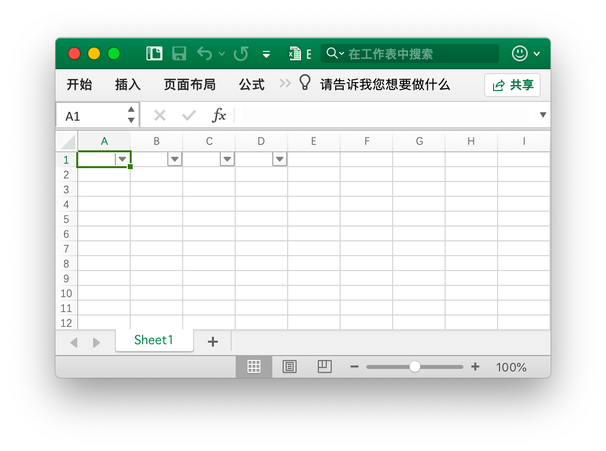

# 工具函数

## 创建表格 {#AddTable}

```go
func (f *File) AddTable(sheet, rangeRef string, opts *TableOptions) error
```

根据给定的工作表名、单元格坐标区域和条件格式创建表格。

- 例1，在名为 `Sheet1` 的工作表 `A1:D5` 区域创建表格：

<p align="center"></p>

```go
err := f.AddTable("Sheet1", "A1:D5", nil)
```

- 例2，在名为 `Sheet2` 的工作表 `F2:H6` 区域创建带有条件格式的表格：

<p align="center"></p>

```go
disable := false
err := f.AddTable("Sheet2", "F2:H6", &excelize.TableOptions{
    Name:              "table",
    StyleName:         "TableStyleMedium2",
    ShowFirstColumn:   true,
    ShowLastColumn:    true,
    ShowRowStripes:    &disable,
    ShowColumnStripes: true,
})
```

注意，表格坐标区域至少需要包含两行：字符型的标题行和内容行。每列标题行的字符需保证是唯一的，并且必须在调用 AddTable 函数前设置表格的标题行数据。多个表格的坐标区域不能有交集。

可选参数 `Name` 用以设置自定义表格名称，同一个工作表内的表格名称应该是唯一的。

Excelize 支持的表格样式 `StyleName` 参数：

```text
TableStyleLight1 - TableStyleLight21
TableStyleMedium1 - TableStyleMedium28
TableStyleDark1 - TableStyleDark11
```

索引|预览|索引|预览|索引|预览
---|---|---|---|---|---
||TableStyleLight1||TableStyleLight2|
TableStyleLight3||TableStyleLight4||TableStyleLight5|
TableStyleLight6||TableStyleLight7||TableStyleLight8|
TableStyleLight9||TableStyleLight10||TableStyleLight11|
TableStyleLight12||TableStyleLight13||TableStyleLight14|
TableStyleLight15||TableStyleLight16||TableStyleLight17|
TableStyleLight18||TableStyleLight19||TableStyleLight20|
TableStyleLight21||TableStyleMedium1||TableStyleMedium2|
TableStyleMedium3||TableStyleMedium4||TableStyleMedium5|
TableStyleMedium6||TableStyleMedium7||TableStyleMedium8|
TableStyleMedium9||TableStyleMedium10||TableStyleMedium11|
TableStyleMedium12||TableStyleMedium13||TableStyleMedium14|
TableStyleMedium15||TableStyleMedium16||TableStyleMedium17|
TableStyleMedium18||TableStyleMedium19||TableStyleMedium20|
TableStyleMedium21||TableStyleMedium22||TableStyleMedium23|
TableStyleMedium24||TableStyleMedium25||TableStyleMedium26|
TableStyleMedium27||TableStyleMedium28||TableStyleDark1|
TableStyleDark2||TableStyleDark3||TableStyleDark4|
TableStyleDark5||TableStyleDark6||TableStyleDark7|
TableStyleDark8||TableStyleDark9||TableStyleDark10|
TableStyleDark11|||||

## 自动过滤器 {#AutoFilter}

```go
func (f *File) AutoFilter(sheet, rangeRef string, opts *AutoFilterOptions) error
```

根据给定的工作表名、单元格坐标区域和条件格式创建自动过滤器。Excel 中的自动过滤器可以对一些简单的二维数据数据进行数据筛选。

例1，在名称为 `Sheet1` 的工作表 `A1:D4` 区域创建自动过滤器：

<p align="center"></p>

```go
err := f.AutoFilter("Sheet1", "A1:D4", nil)
```

例2，在名称为 `Sheet1` 的工作表 `A1:D4` 区域创建带有格式条件的自动过滤器：

```go
err := f.AutoFilter("Sheet1", "A1:D4", &excelize.AutoFilterOptions{
    Column: "B", Expression: "x != blanks",
})
```

参数 `Column` 指定了自动过滤器在过滤范围内的基准列。Excelize 暂不支持自动过滤器的计算，在设置过滤条件后，如果需要隐藏任何不符合过滤条件的行，可以使用 [`SetRowVisible()`](sheet.md#SetRowVisible) 设置行的可见性。

为列设置过滤条件，参数 `Expression` 用于指定过滤条件运算，支持下列运算符：

```text
==
!=
>
<
>=
<=
and
or
```

一个表达式可以包含一个或两个由 `and` 和 `or` 运算符分隔的语句。例如：

```text
x <  2000
x >  2000
x == 2000
x >  2000 and x <  5000
x == 2000 or  x == 5000
```

可以通过在表达式中使用空白或非空白值来实现空白或非空白数据的过滤：

```text
x == Blanks
x == NonBlanks
```

Office Excel 还允许一些简单的字符串匹配操作：

```text
x == b*      // 以 b 开始
x != b*      // 不以 b 开始
x == *b      // 以 b 结尾
x != *b      // 不以 b 结尾
x == *b*     // 包含 b
x != *b*     // 不包含 b
```

我们还可以使用 `*` 来匹配任何字符或数字，用
`?` 匹配任何单个字符或数字。除此之外，Office Excel 的自动过滤器不支持其他正则表达式的关键字。Excel 的正则表达式字符可以使用 `~` 进行转义。

上述示例中的占位符变量 `x` 可以被任何简单的字符串替换。实际的占位符名称在内部被忽略，所以以下所有表达式的效果都是等同的：

```text
x     < 2000
col   < 2000
Price < 2000
```

## 清除单元格缓存 {#UpdateLinkedValue}

```go
func (f *File) UpdateLinkedValue() error
```

Excel 会在保存时将保存带有公式的单元格的计算结果，这会导致在 Office Excel 2007 和 2010 中文档在打开时，即便计算因子已经发生变化，公式的计算结果不会自动更新。参考链接：[https://social.technet.microsoft.com/Forums/office/en-US/e16bae1f-6a2c-4325-8013-e989a3479066/excel-2010-linked-cells-not-updating](https://social.technet.microsoft.com/Forums/office/en-US/e16bae1f-6a2c-4325-8013-e989a3479066/excel-2010-linked-cells-not-updating) 此函数会将工作簿中所有缓存结果清除，这样文档在 Office Excel 中被重新打开时会自动计算新的公式结果，但是由于计算后文档发生了变化，在关闭文档时 Office Excel 会提示是否保存工作簿。

清除单元格缓存对工作簿的影响表现为对 `<v>` 标签的修改，例如，清除前的单元格缓存：

```xml
<row r="19" spans="2:2">
    <c r="B19">
        <f>SUM(Sheet2!D2,Sheet2!D11)</f>
        <v>100</v>
     </c>
</row>
```

清除单元格缓存后：

```xml
<row r="19" spans="2:2">
    <c r="B19">
        <f>SUM(Sheet2!D2,Sheet2!D11)</f>
    </c>
</row>
```

## 单元格坐标切分 {#SplitCellName}

```go
func SplitCellName(cell string) (string, int, error)
```

将工作表的单元格坐标切分为列名和行号。例如，将单元格坐标 `AK74` 切分为 `AK` 和 `74`：

```go
excelize.SplitCellName("AK74") // return "AK", 74, nil
```

## 单元格坐标组合 {#JoinCellName}

```go
func JoinCellName(col string, row int) (string, error)
```

将列名和行号组合成工作表的单元格坐标。

## 列名转索引 {#ColumnNameToNumber}

```go
func ColumnNameToNumber(name string) (int, error)
```

将工作表的列名（不区分大小写）转换为索引，对于错误的列名格式将返回错误。例如：

```go
excelize.ColumnNameToNumber("AK") // returns 37, nil
```

## 索引转列名 {#ColumnNumberToName}

```go
func ColumnNumberToName(num int) (string, error)
```

将数据类型为整型的索引转换为列名。例如：

```go
excelize.ColumnNumberToName(37) // returns "AK", nil
```

## 单元格坐标转索引 {#CellNameToCoordinates}

```go
func CellNameToCoordinates(cell string) (int, int, error)
```

将由字母和数字组合而成的单元格坐标转换为 `[X, Y]` 形式的行、列索引，或返回错误。例如：

```go
excelize.CellNameToCoordinates("A1") // returns 1, 1, nil
excelize.CellNameToCoordinates("Z3") // returns 26, 3, nil
```

## 索引转单元格坐标 {#CoordinatesToCellName}

```go
func CoordinatesToCellName(col, row int, abs ...bool) (string, error)
```

将 `[X, Y]` 形式的行、列索引转换为由字母和数字组合而成的单元格坐标，或返回错误。例如：

```go
excelize.CoordinatesToCellName(1, 1) // returns "A1", nil
excelize.CoordinatesToCellName(1, 1, true) // returns "$A$1", nil
```

## 创建条件格式样式 {#NewConditionalStyle}

```go
func (f *File) NewConditionalStyle(style *Style) (int, error)
```

通过给定样式为条件格式创建样式，样式参数与 [`NewStyle`](style.md#NewStyle) 函数的相同。请注意，使用 RGB 色域颜色代码时，目前仅支持设置字体、填充、对齐和边框的颜色。

## 设置条件格式 {#SetConditionalFormat}

```go
func (f *File) SetConditionalFormat(sheet, rangeRef string, opts []ConditionalFormatOptions) error
```

根据给定的工作表名称、单元格坐标区域和格式参数，为单元格值创建条件格式设置规则。条件格式是 Office Excel 的一项功能，它允许您根据特定条件将格式应用于单元格或一系列单元格。

格式参数 `Type` 选项是必需的参数，它没有默认值。允许的类型值及其相关参数是：

<table>
    <thead>
        <tr>
            <th>类型</th>
            <th>参数</th>
        </tr>
    </thead>
    <tbody>
        <tr>
            <td rowspan=4>cell</td>
            <td>Criteria</td>
        </tr>
        <tr>
            <td>Value</td>
        </tr>
        <tr>
            <td>Minimum</td>
        </tr>
        <tr>
            <td>Maximum</td>
        </tr>
        <tr>
            <td rowspan=4>date</td>
            <td>Criteria</td>
        </tr>
        <tr>
            <td>Value</td>
        </tr>
        <tr>
            <td>Minimum</td>
        </tr>
        <tr>
            <td>Maximum</td>
        </tr>
        <tr>
            <td>time_period</td>
            <td>Criteria</td>
        </tr>
        <tr>
            <td rowspan=2>text</td>
            <td>Criteria</td>
        </tr>
        <tr>
            <td>Value</td>
        </tr>
        <tr>
            <td>average</td>
            <td>Criteria</td>
        </tr>
        <tr>
            <td>duplicate</td>
            <td>(none)</td>
        </tr>
        <tr>
            <td>unique</td>
            <td>(none)</td>
        </tr>
        <tr>
            <td rowspan=2>top</td>
            <td>Criteria</td>
        </tr>
        <tr>
            <td>Value</td>
        </tr>
        <tr>
            <td rowspan=2>bottom</td>
            <td>Criteria</td>
        </tr>
        <tr>
            <td>Value</td>
        </tr>
        <tr>
            <td>blanks</td>
            <td>(none)</td>
        </tr>
        <tr>
            <td>no_blanks</td>
            <td>(none)</td>
        </tr>
        <tr>
            <td>errors</td>
            <td>(none)</td>
        </tr>
        <tr>
            <td>no_errors</td>
            <td>(none)</td>
        </tr>
        <tr>
            <td rowspan=6>2_color_scale</td>
            <td>MinType</td>
        </tr>
        <tr>
            <td>MaxType</td>
        </tr>
        <tr>
            <td>MinValue</td>
        </tr>
        <tr>
            <td>MaxValue</td>
        </tr>
        <tr>
            <td>MinColor</td>
        </tr>
        <tr>
            <td>MaxColor</td>
        </tr>
        <tr>
            <td rowspan=9>3_color_scale</td>
            <td>MinType</td>
        </tr>
        <tr>
            <td>MidType</td>
        </tr>
        <tr>
            <td>MaxType</td>
        </tr>
        <tr>
            <td>MinValue</td>
        </tr>
        <tr>
            <td>MidValue</td>
        </tr>
        <tr>
            <td>MaxValue</td>
        </tr>
        <tr>
            <td>MinColor</td>
        </tr>
        <tr>
            <td>MidColor</td>
        </tr>
        <tr>
            <td>MaxColor</td>
        </tr>
        <tr>
            <td rowspan=9>data_bar</td>
            <td>MinType</td>
        </tr>
        <tr>
            <td>MaxType</td>
        </tr>
        <tr>
            <td>MinValue</td>
        </tr>
        <tr>
            <td>MaxValue</td>
        </tr>
        <tr>
            <td>BarBorderColor</td>
        </tr>
        <tr>
            <td>BarColor</td>
        </tr>
        <tr>
            <td>BarDirection</td>
        </tr>
        <tr>
            <td>BarOnly</td>
        </tr>
        <tr>
            <td>BarSolid</td>
        </tr>
        <tr>
            <td rowspan=3>iconSet</td>
            <td>IconStyle</td>
        </tr>
        <tr>
            <td>ReverseIcons</td>
        </tr>
        <tr>
            <td>IconsOnly</td>
        </tr>
        <tr>
            <td>formula</td>
            <td>Criteria</td>
        </tr>
    </tbody>
</table>

`Criteria` 参数用于设置单元格数据的条件格式运算符。它没有默认值，同常与 `excelize.ConditionalFormatOptions{Type: "cell"}` 一起使用，支持的参数为：

文本描述字符|符号表示
---|---
between|
not between|
equal to|==
not equal to|!=
greater than|>
less than|<
greater than or equal to|>=
less than or equal to|<=

可以使用上面表格第一列中的 Office Excel 文本描述字符，或者符号表示方法（`between` 与 `not between` 没有符号表示法）作为条件格式运算符。下面的相关部分显示了其他条件格式类型的特定标准。

`Value`：该值通常与 `Criteria` 参数一起使用，可以用确定的值作为设置单元格条件格式的条件参数：

```go
err := f.SetConditionalFormat("Sheet1", "D1:D10",
    []excelize.ConditionalFormatOptions{
        {
            Type:     "cell",
            Criteria: ">",
            Format:   format,
            Value:    "6",
        },
    },
)
```

`Value` 属性也可以是单元格引用：

```go
err := f.SetConditionalFormat("Sheet1", "D1:D10",
    []excelize.ConditionalFormatOptions{
        {
            Type:     "cell",
            Criteria: ">",
            Format:   format,
            Value:    "$C$1",
        },
    },
)
```

类型：`Format` - `Format` 参数用于指定满足条件格式标准时将应用于单元格的格式。该参数可以通过 [`NewConditionalStyle()`](utils.md#NewConditionalStyle) 方法来创建：

```go
format, err := f.NewConditionalStyle(
    &excelize.Style{
        Font: &excelize.Font{Color: "#9A0511"},
        Fill: excelize.Fill{
            Type: "pattern", Color: []string{"#FEC7CE"}, Pattern: 1,
        },
    },
)
if err != nil {
    fmt.Println(err)
}
err = f.SetConditionalFormat("Sheet1", "D1:D10",
    []excelize.ConditionalFormatOptions{
        {Type: "cell", Criteria: ">", Format: format, Value: "6"},
    },
)
```

注意：在 Office Excel 中，条件格式叠加在现有单元格格式上，并非所有单元格格式属性都可以修改。无法在条件格式中修改的属性包括：字体名称、字体大小、上标和下标、对角边框、所有对齐属性和所有保护属性。

Office Excel 中内置了一些与条件格式一起使用的默认样式。可以使用以下 excelize 设置实现这些样式效果：

```go
// 浅红填充色深色文本代表较差
format1, err := f.NewConditionalStyle(
    &excelize.Style{
        Font: &excelize.Font{Color: "#9A0511"},
        Fill: excelize.Fill{
            Type: "pattern", Color: []string{"#FEC7CE"}, Pattern: 1,
        },
    },
)

// 黄填充色深黄色文本代表一般
format2, err := f.NewConditionalStyle(
    &excelize.Style{
        Font: &excelize.Font{Color: "#9B5713"},
        Fill: excelize.Fill{
            Type: "pattern", Color: []string{"#FEEAA0"}, Pattern: 1,
        },
    },
)

// 绿填充色深绿色文本代表较好
format3, err := f.NewConditionalStyle(
    &excelize.Style{
        Font: &excelize.Font{Color: "#09600B"},
        Fill: excelize.Fill{
            Type: "pattern", Color: []string{"#C7EECF"}, Pattern: 1,
        },
    },
)
```

类型：`minimum` - 当条件格式 `Criteria` 为 `between` 或 `not between` 时，`minimum` 参数用于设置下限值。

```go
// 高亮单元格条件格式规则： between...
err := f.SetConditionalFormat("Sheet1", "A1:A10",
    []excelize.ConditionalFormatOptions{
        {
            Type:     "cell",
            Criteria: "between",
            Format:   format,
            Minimum:  "6",
            Maximum:  "8",
        },
    },
)
```

类型：`Maximum` - 当条件格式 `Criteria` 为 `between` 或 `not between` 时，`Maximum` 参数用于设置上限值，参考上面的例子。

类型：`average` - 平均类型用于指定 Office Excel “最前最后规则”中“经典”样式的“仅高于或低于平均值的数值设置格式”条件格式：

```go
// 最前最后规则：高于平均值...
err := f.SetConditionalFormat("Sheet1", "A1:A10",
    []excelize.ConditionalFormatOptions{
        {
            Type:         "average",
            Criteria:     "=",
            Format:       format1,
            AboveAverage: true,
        },
    },
)

// 最前最后规则：低于平均值...
err := f.SetConditionalFormat("Sheet1", "B1:B10",
    []excelize.ConditionalFormatOptions{
        {
            Type:         "average",
            Criteria:     "=",
            Format:       format2,
            AboveAverage: false,
        },
    },
)
```

类型：`duplicate` - 用于设置“突出显示单元格规则”中的“重复值 ...”：

```go
// 突出显示单元格规则: 重复值...
err := f.SetConditionalFormat("Sheet1", "A1:A10",
    []excelize.ConditionalFormatOptions{
        {Type: "duplicate", Criteria: "=", Format: format},
    },
)
```

类型：`unique` - 用于设置“突出显示单元格规则”中“只为以下内容的单元格设置格式”的“特定文本”：

```go
// 突出显示单元格规则，只为以下内容的单元格设置格式: 特定文本 不等于...
err := f.SetConditionalFormat("Sheet1", "A1:A10",
    []excelize.ConditionalFormatOptions{
        {Type: "unique", Criteria: "=", Format: format},
    },
)
```

类型：`top` -  用于设置“最前最后规则”中的“前 10 项...”或“前 10% ...”：

```go
// 最前最后规则： 前 10 项...
err := f.SetConditionalFormat("Sheet1", "H1:H10",
    []excelize.ConditionalFormatOptions{
        {
            Type:     "top",
            Criteria: "=",
            Format:   format,
            Value:    "6",
        },
    },
)
```

设置带有百分比条件的条件格式：

```go
err := f.SetConditionalFormat("Sheet1", "A1:A10",
    []excelize.ConditionalFormatOptions{
        {
            Type:     "top",
            Criteria: "=",
            Format:   format,
            Value:    "6",
            Percent:  true,
        },
    },
)
```

类型：`2_color_scale` - 用于设置带有“双色刻度”的“色阶样式”条件格式：

```go
// 色阶：双色刻度
err := f.SetConditionalFormat("Sheet1", "A1:A10",
    []excelize.ConditionalFormatOptions{
        {
            Type:     "2_color_scale",
            Criteria: "=",
            MinType:  "min",
            MaxType:  "max",
            MinColor: "#F8696B",
            MaxColor: "#63BE7B",
        },
    },
)
```

双色刻度色阶条件格式可选参数：`MinType`、`MaxType`、`MinValue`、`MaxValue`、`MinColor` 和 `MaxColor`。

类型：`3_color_scale` - 用于设置带有“三色刻度”的“色阶样式”条件格式：

```go
// 色阶：三色刻度
err := f.SetConditionalFormat("Sheet1", "A1:A10",
    []excelize.ConditionalFormatOptions{
        {
            Type:     "3_color_scale",
            Criteria: "=",
            MinType:  "min",
            MidType:  "percentile",
            MaxType:  "max",
            MinColor: "#F8696B",
            MidColor: "#FFEB84",
            MaxColor: "#63BE7B",
        },
    },
)
```

三色刻度色阶条件格式可选参数： `MinType`、`MidType`、`MaxType`、`MinValue`、`MidValue`、`MaxValue`、`MinColor`、`MidColor` 和 `MaxColor`。

类型：`data_bar` - 用于设置“数据条”类型的条件格式。

`MinType` - 参数 `MinType` 在条件格式类型为 `2_color_scale`、`3_color_scale` 或 `data_bar` 时可用。参数 `MidType` 在条件格式类型为 `3_color_scale` 时可用。例如：

```go
// 数据条：渐变填充
err := f.SetConditionalFormat("Sheet1", "K1:K10",
    []excelize.ConditionalFormatOptions{
        {
            Type:     "data_bar",
            Criteria: "=",
            MinType:  "min",
            MaxType:  "max",
            BarColor: "#638EC6",
        },
    },
)
```

参数 `min/mid/max_types` 可选值列表:

参数|类型
---|---
min|最低值（仅用于 `MinType`）
num|数字
percent|百分比
percentile|百分点值
formula|公式
max|最高值（仅用于 `MaxType`）

`MidType` - 当条件格式类型为 `3_color_scale` 时使用，与 `MinType` 用法相同，参考上面的表格。

`MaxType` - 与 `MinType` 用法相同，参考上面的表格。

`MinValue` - 参数 `MinValue` 和 `MaxValue` 在条件格式类型为 `2_color_scale`、`3_color_scale` 或 `data_bar` 时可用。参数 `MidValue` 在条件格式类型为 `3_color_scale` 时可用。

`MidValue` - 在条件格式类型为 `3_color_scale` 时可用，与 `MinValue` 的用法相同，参考上述文档。

`MaxValue` - 与 `MinValue` 的用法相同，参考上述文档。

`MinColor` -  参数 `MinColor` 和 `MaxColor` 在条件格式类型为 `2_color_scale`、`3_color_scale` 或 `data_bar` 时可用。参数 `MidColor` 在条件格式类型为 `3_color_scale` 时可用。例如：

```go
// 色阶：三色刻度
err := f.SetConditionalFormat("Sheet1", "B1:B10",
    []excelize.ConditionalFormatOptions{
        {
            Type:     "3_color_scale",
            Criteria: "=",
            MinType:  "min",
            MidType:  "percentile",
            MaxType:  "max",
            MinColor: "#F8696B",
            MidColor: "#FFEB84",
            MaxColor: "#63BE7B",
        },
    },
)
```

`MidColor` - 当条件格式类型为 `3_color_scale` 时使用。与 `MinColor` 用法相同，参考上述文档。

`MaxColor` - 与 `MinColor` 用法相同，参考上述文档。

`BarColor` - 当条件格式类型为 `data_bar` 时使用。与 `MinColor` 用法相同，参考上述文档。

`BarBorderColor` - 用于设置数据条的边框线颜色，该设置仅在 Excel 2010 或更高版本中有效。

`BarDirection` - 用于设置数据条方向，可选值见下表:

可选值|说明
---|---
context     | 数据条方向根据电子表格中数据上下文显示
leftToRight | 从右向左
rightToLeft | 从左向右

`BarOnly` - 用于设置是否隐藏单元格中的值，仅显示数据条。

`BarSolid` - 用于设置数据条是否使用纯色（非渐变）填充样式，该设置仅在 Excel 2010 或更高版本中有效。

`IconStyle` - 用于设置图标样式，可选值见下表:

|可选值|
|---|
|3Arrows        |
|3ArrowsGray    |
|3Flags         |
|3Signs         |
|3Symbols       |
|3Symbols2      |
|3TrafficLights1|
|3TrafficLights2|
|4Arrows        |
|4ArrowsGray    |
|4Rating        |
|4RedToBlack    |
|4TrafficLights |
|5Arrows        |
|5ArrowsGray    |
|5Quarters      |
|5Rating        |

`ReverseIcons` - 用于设置是否反转图标次序。

`IconsOnly` - 用于设置是否隐藏单元格中的值，仅显示图标。

`StopIfTrue` - 用于设置是否“如果为真则停止”，当一个条件格式规则应用与一个或多个单元格时，如果开启此设置，一旦找到匹配规则的一个单元格，将不会继续查找后续单元格是否匹配。

例如，为名为 `Sheet1` 的工作表中，通过设置条件格式高亮 `A1:D4` 区域单元格中的最大值与最小值:

<p align="center"></p>

```go
func main() {
    f := excelize.NewFile()
    defer func() {
        if err := f.Close(); err != nil {
            fmt.Println(err)
        }
    }()
    for r := 1; r <= 4; r++ {
        row := []int{
            rand.Intn(100), rand.Intn(100), rand.Intn(100), rand.Intn(100),
        }
        if err := f.SetSheetRow("Sheet1", fmt.Sprintf("A%d", r), &row); err != nil {
            fmt.Println(err)
            return
        }
    }
    red, err := f.NewConditionalStyle(
        &excelize.Style{
            Font: &excelize.Font{
                Color: "#9A0511",
            },
            Fill: excelize.Fill{
                Type:    "pattern",
                Color:   []string{"#FEC7CE"},
                Pattern: 1,
            },
        },
    )
    if err != nil {
        fmt.Println(err)
        return
    }
    if err := f.SetConditionalFormat("Sheet1", "A1:D4",
        []excelize.ConditionalFormatOptions{
            {
                Type:     "bottom",
                Criteria: "=",
                Value:    "1",
                Format:   red,
            },
        },
    ); err != nil {
        fmt.Println(err)
        return
    }
    green, err := f.NewConditionalStyle(
        &excelize.Style{
            Font: &excelize.Font{
                Color: "#09600B",
            },
            Fill: excelize.Fill{
                Type:    "pattern",
                Color:   []string{"#C7EECF"},
                Pattern: 1,
            },
        },
    )
    if err != nil {
        fmt.Println(err)
        return
    }
    if err := f.SetConditionalFormat("Sheet1", "A1:D4",
        []excelize.ConditionalFormatOptions{
            {
                Type:     "top",
                Criteria: "=",
                Value:    "1",
                Format:   green,
            },
        },
    ); err != nil {
        fmt.Println(err)
        return
    }
    if err := f.SaveAs("Book1.xlsx"); err != nil {
        fmt.Println(err)
        return
    }
}
```

## 获取条件格式 {#GetConditionalFormats}

```go
func (f *File) GetConditionalFormats(sheet string) (map[string][]ConditionalFormatOptions, error)
```

根据给定的工作表名称获取该工作表中全部单元格坐标区域和条件格式参数。

## 删除条件格式 {#UnsetConditionalFormat}

```go
func (f *File) UnsetConditionalFormat(sheet, rangeRef string) error
```

根据给定的工作表名称和单元格坐标区域删除条件格式。

## 设置窗格 {#SetPanes}

```go
func (f *File) SetPanes(sheet string, panes *Panes) error
```

通过给定的工作表名称和窗格样式参数设置冻结窗格或拆分窗格。

`ActivePane` 定义了活动窗格，下表为该属性的可选值：

枚举值|描述
---|---
bottomLeft (Bottom Left Pane) |当应用垂直和水平分割时，位于左下方的窗格。<br><br>此值也适用于仅应用了水平分割的情况，将窗格分为上下两个区域。在这种情况下，该值指定底部窗格。
bottomRight (Bottom Right Pane) | 当垂直和水平时，位于底部右侧的窗格。
topLeft (Top Left Pane)|当应用垂直和水平分割时，位于左上方的窗格。<br><br>此值也适用于仅应用了水平分割的情况，将窗格分为上下两个区域。在这种情况下，该值指定顶部窗格。<br><br>此值也适用于仅应用垂直分割的情况，将窗格分割为右侧和左侧区域。在这种情况下，该值指定左侧窗格。
topRight (Top Right Pane)|当应用垂直和水平分割时，位于右上方窗格。<br><br> 此值也适用于仅应用垂直分割的情况，将窗格分割为右侧和左侧区域。在这种情况下，该值指定右侧窗格。

窗格状态类型仅限于下表中当前列出的受支持的值：

枚举值|描述
---|---
frozen (Frozen)|窗格被冻结，但并不分裂。在此状态下，当窗格被解除冻结然后再次解冻时，会生成单个窗格，而不会被分割。<br><br>在这种状态下，分割条不可调节。
split (Split)|窗格被分裂，但并不冻结。在此状态下，用户可以调整分割条。

`XSplit` - 水平分割点的位置。如果窗格冻结，则此值用于设置顶部窗格中可见的列数。

`YSplit` - 垂直分割点的位置。如果窗格冻结，则此值用于设置左侧窗格中可见的行数。该属性的可能值由 W3C XML Schema double 数据类型定义。

`TopLeftCell` - 处于“从左到右”模式时,右下方窗格中左上角可见单元格的位置。

`SQRef` - 参考单元格坐标区域。可以是非连续的一组单元格坐标区域。

例1，在名为 `Sheet1` 的工作表上冻结列 `A` 并设置活动单元格 `Sheet1!K16`：

<p align="center"></p>

```go
err := f.SetPanes("Sheet1", &excelize.Panes{
    Freeze:      true,
    Split:       false,
    XSplit:      1,
    YSplit:      0,
    TopLeftCell: "B1",
    ActivePane:  "topRight",
    Panes: []excelize.PaneOptions{
        {SQRef: "K16", ActiveCell: "K16", Pane: "topRight"},
    },
})
```

例2，在名为 `Sheet1` 的工作表上冻结第 1 到第 9 行，并设置活动单元格区域 `Sheet1!A11:XFD11`：

<p align="center"></p>

```go
err := f.SetPanes("Sheet1", &excelize.Panes{
    Freeze:      true,
    Split:       false,
    XSplit:      0,
    YSplit:      9,
    TopLeftCell: "A34",
    ActivePane:  "bottomLeft",
    Panes: []excelize.PaneOptions{
        {SQRef: "A11:XFD11", ActiveCell: "A11", Pane: "bottomLeft"},
    },
})
```

例3，在名为 `Sheet1` 的工作表上创建拆分窗格，并设置活动单元格 `Sheet1!J60`：

<p align="center"></p>

```go
err := f.SetPanes("Sheet1", &excelize.Panes{
    Freeze:      false,
    Split:       true,
    XSplit:      3270,
    YSplit:      1800,
    TopLeftCell: "N57",
    ActivePane:  "bottomLeft",
    Panes: []excelize.PaneOptions{
        {SQRef: "I36", ActiveCell: "I36"},
        {SQRef: "G33", ActiveCell: "G33", Pane: "topRight"},
        {SQRef: "J60", ActiveCell: "J60", Pane: "bottomLeft"},
        {SQRef: "O60", ActiveCell: "O60", Pane: "bottomRight"},
    },
})
```

例4，解冻并删除名为 `Sheet1` 上的所有窗格：

```go
err := f.SetPanes("Sheet1", &excelize.Panes{Freeze: false, Split: false})
```

## 色值计算 {#ThemeColor}

```go
func ThemeColor(baseColor string, tint float64) string
```

通过给定的 RGB 格式色值与色调参数，计算出最终颜色。例如，获取名为 `Sheet1` 的工作表 `A1` 单元格的背景颜色：

```go
package main

import (
    "fmt"
    "strings"

    "github.com/xuri/excelize/v2"
)

func main() {
    f, err := excelize.OpenFile("Book1.xlsx")
    if err != nil {
        fmt.Println(err)
        return
    }
    fmt.Println(getCellBgColor(f, "Sheet1", "A1"))
    if err = f.Close(); err != nil {
        fmt.Println(err)
    }
}

func getCellBgColor(f *excelize.File, sheet, cell string) string {
    styleID, err := f.GetCellStyle(sheet, cell)
    if err != nil {
        return err.Error()
    }
    fillID := *f.Styles.CellXfs.Xf[styleID].FillID
    fgColor := f.Styles.Fills.Fill[fillID].PatternFill.FgColor
    if fgColor != nil && f.Theme != nil {
        if clrScheme := f.Theme.ThemeElements.ClrScheme; fgColor.Theme != nil {
            if val, ok := map[int]*string{
                0: &clrScheme.Lt1.SysClr.LastClr,
                1: &clrScheme.Dk1.SysClr.LastClr,
                2: clrScheme.Lt2.SrgbClr.Val,
                3: clrScheme.Dk2.SrgbClr.Val,
                4: clrScheme.Accent1.SrgbClr.Val,
                5: clrScheme.Accent2.SrgbClr.Val,
                6: clrScheme.Accent3.SrgbClr.Val,
                7: clrScheme.Accent4.SrgbClr.Val,
                8: clrScheme.Accent5.SrgbClr.Val,
                9: clrScheme.Accent6.SrgbClr.Val,
            }[*fgColor.Theme]; ok && val != nil {
                return strings.TrimPrefix(excelize.ThemeColor(*val, fgColor.Tint), "FF")
            }
        }
        return strings.TrimPrefix(fgColor.RGB, "FF")
    }
    return "FFFFFF"
}
```

## RGB与HSL色彩空间色值转换 {#RGBToHSL}

```go
func RGBToHSL(r, g, b uint8) (h, s, l float64)
```

该函数提供方法将 RGB 色彩空间三元组转换为 HSL 色彩空间三元组。

## HSL与RGB色彩空间色值转换 {#HSLToRGB}

```go
func HSLToRGB(h, s, l float64) (r, g, b uint8)
```

该函数提供方法将 HSL 色彩空间三元组转换为 RGB 色彩空间三元组。

## 文件 Writer {#FileWriter}

### Write {#Write}

```go
func (f *File) Write(w io.Writer, opts ...Options) error
```

该函数提供方法将当前文件内容写入给定的 `io.Writer`。

### WriteTo {#WriteTo}

```go
func (f *File) WriteTo(w io.Writer, opts ...Options) (int64, error)
```

该函数通过实现 `io.WriterTo` 以保存文件。

### WriteToBuffer {#WriteToBuffer}

```go
func (f *File) WriteToBuffer() (*bytes.Buffer, error)
```

该函数提供获取当前文件内容 `*bytes.Buffer` 的方法。

## 嵌入 VBA 项目 {#AddVBAProject}

```go
func (f *File) AddVBAProject(bin string) error
```

该函数提供方法将包含函数和/或宏的 `vbaProject.bin` 文件嵌入到 Excel 文档中，文件扩展名应为 `.xlsm`。例如:

```go
codeName := "Sheet1"
if err := f.SetSheetProps("Sheet1", &excelize.SheetPropsOptions{
    CodeName: &codeName,
}); err != nil {
    fmt.Println(err)
}
if err := f.AddVBAProject("vbaProject.bin"); err != nil {
    fmt.Println(err)
}
if err := f.SaveAs("macros.xlsm"); err != nil {
    fmt.Println(err)
}
```

## Excel 日期时间转换 {#ExcelDateToTime}

```go
func ExcelDateToTime(excelDate float64, use1904Format bool) (time.Time, error)
```

ExcelDateToTime 将 Excel 中以 `float` 类型表示的日期转换为 `time.Time` 类型。

## 字符集转码器 {#CharsetTranscoder}

```go
func (f *File) CharsetTranscoder(fn charsetTranscoderFn) *File
```

CharsetTranscoder 为非 UTF-8 编码的电子表格文档设置用户提供指定自定义编码转换器支持。
