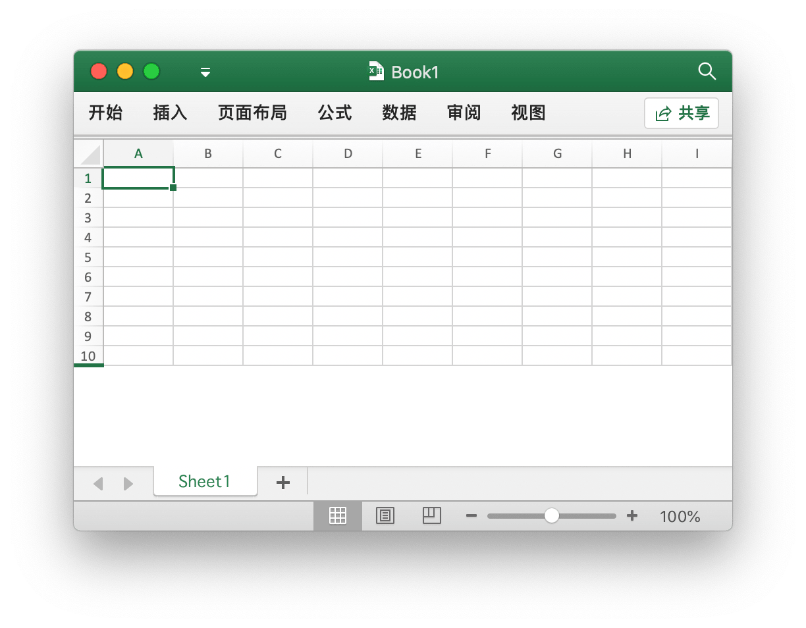
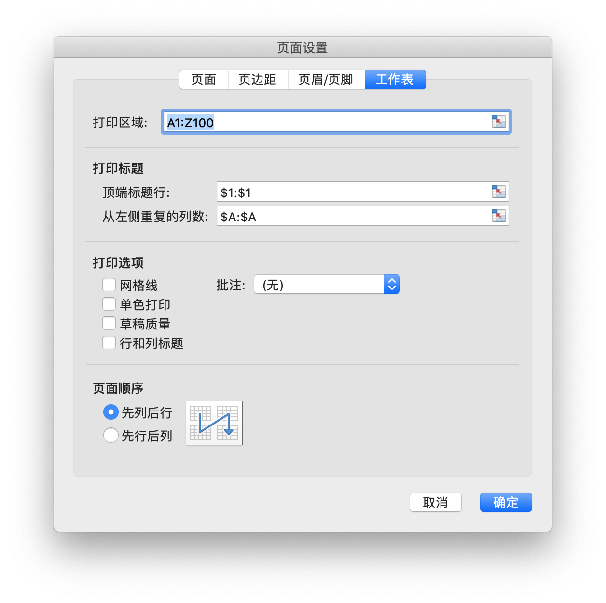

# 工作簿

{{ book.info }}

`Options` 定义了读写电子表格时的选项。

```go
type Options struct {
    MaxCalcIterations uint
    Password          string
    RawCellValue      bool
    UnzipSizeLimit    int64
    UnzipXMLSizeLimit int64
    ShortDatePattern  string
    LongDatePattern   string
    LongTimePattern   string
    CultureInfo       CultureName
}
```

`MaxCalcIterations` 用以指定计算公式时最多迭代次数，默认值为 0。

`Password` 以明文形式指定打开和保存工作簿时所使用的密码，默认值为空。

`RawCellValue` 用以指定读取单元格值时是否获取原始值，默认值为 `false`（应用数字格式）。

`UnzipSizeLimit` 用以指定打开电子表格文档时的解压缩大小限制（以字节为单位），该值应大于或等于 `UnzipXMLSizeLimit`，默认大小限制为 16GB。

`UnzipXMLSizeLimit` 用以指定解压每个工作表以及共享字符表时的内存限制（以字节为单位），当大小超过此值时工作表 XML 文件将被解压至系统临时目录，该值应小于或等于 `UnzipSizeLimit`，默认大小限制为 16MB。

`ShortDatePattern` 用以指定短日期数字格式代码。在电子表格应用程序中，可以通过为单元格设置带有日期格式的数字格式，将日期和时间序列号显示为日期值。其中以星号 (\*) 开头的日期格式响应为操作系统指定的区域日期和时间设置的更改。没有星号的格式不受操作系统设置的影响。`ShortDatePattern` 用于指定读取以星号开头的日期格式时所应用的短日期数字格式代码。

`LongDatePattern` 用以指定长日期数字格式代码。

`LongTimePattern` 用以指定长时间数字格式代码。

`CultureInfo` 用以指定区域格式，该设置将在读取受到操作系统特定的区域日期和时间设置影响的数字格式时使用。

`HeaderFooterImagePositionType` 定义了页眉页脚图片位置类型。

```go
type HeaderFooterImagePositionType byte
```

下面是工作表页眉页脚位置枚举值。

```go
const (
    HeaderFooterImagePositionLeft HeaderFooterImagePositionType = iota
    HeaderFooterImagePositionCenter
    HeaderFooterImagePositionRight
)
```

## 创建 {#NewFile}

```go
func NewFile(opts ...Options) *File
```

使用 `NewFile` 新建 Excel 工作薄，新创建的工作簿中会默认包含一个名为 `Sheet1` 的工作表。

## 打开 {#OpenFile}

```go
func OpenFile(filename string, opts ...Options) (*File, error)
```

使用 `OpenFile` 打开已有 Excel 文档。例如，打开带有密码保护的电子表格文档:

```go
f, err := excelize.OpenFile("Book1.xlsx", excelize.Options{Password: "password"})
if err != nil {
    return
}
```

使用 [`Close()`](workbook.md#Close) 关闭已打开的工作簿。

## 打开数据流 {#OpenReader}

```go
func OpenReader(r io.Reader, opts ...Options) (*File, error)
```

OpenReader 从 `io.Reader` 读取数据流。

下面的例子中，我们创建一个简单的 HTTP 服务器接收上传的电子表格文档，向接收到的电子表格文档添加新工作表，并返回下载响应:

```go
package main

import (
    "fmt"
    "net/http"

    "github.com/xuri/excelize/v2"
)

func process(w http.ResponseWriter, req *http.Request) {
    file, _, err := req.FormFile("file")
    if err != nil {
        fmt.Fprint(w, err.Error())
        return
    }
    defer file.Close()
    f, err := excelize.OpenReader(file)
    if err != nil {
        fmt.Fprint(w, err.Error())
        return
    }
    f.Path = "Book1.xlsx"
    f.NewSheet("NewSheet")
    w.Header().Set("Content-Disposition", fmt.Sprintf("attachment; filename=%s", f.Path))
    w.Header().Set("Content-Type", req.Header.Get("Content-Type"))
    if err := f.Write(w); err != nil {
        fmt.Fprint(w, err.Error())
    }
}

func main() {
    http.HandleFunc("/process", process)
    http.ListenAndServe(":8090", nil)
}
```

使用 cURL 进行测试:

```bash
curl --location --request GET 'http://127.0.0.1:8090/process' \
--form 'file=@/tmp/template.xltx' -O -J
```

## 保存 {#Save}

```go
func (f *File) Save(opts ...Options) error
```

使用 `Save` 保存对 Excel 文档的编辑。

## 另存为 {#SaveAs}

```go
func (f *File) SaveAs(name string, opts ...Options) error
```

使用 `SaveAs` 保存 Excel 文档为指定文件。

## 关闭工作簿 {#Close}

```go
func (f *File) Close() error
```

关闭工作簿并清理打开文档时可能产生的系统磁盘缓存。

## 新建工作表 {#NewSheet}

```go
func (f *File) NewSheet(sheet string) (int, error)
```

根据给定的工作表名称来创建新工作表，并返回工作表在工作簿中的索引。请注意，在创建新的工作簿时，将包含名为 `Sheet1` 的默认工作表。

## 删除工作表 {#DeleteSheet}

```go
func (f *File) DeleteSheet(sheet string) error
```

根据给定的工作表名称删除指定工作表，谨慎使用此方法，这将会影响到与被删除工作表相关联的公式、引用、图表等元素。如果有其他组件引用了被删除工作表上的值，将会引发错误提示，甚至将会导致打开工作簿失败。当工作簿中仅包含一个工作表时，调用此方法无效。

## 移动工作表 {#MoveSheet}

```go
func (f *File) MoveSheet(source, target string) error
```

将工作表移动到工作簿中的指定位置。根据给定的被移动工作表名称和目标工作表名称，将工作表移动至目标工作表之前。移动后，其他工作表的位置将向左或向右移动，如果工作表已经在目标位置，则该函数不会执行任何操作。请注意，该函数在移动工作表后将取消所有工作表分组。例如，将名为 `Sheet2` 的工作表移动至工作表 `Sheet1` 之前：

```go
err := f.MoveSheet("Sheet2", "Sheet1")
```

## 复制工作表 {#CopySheet}

```go
func (f *File) CopySheet(from, to int) error
```

根据给定的被复制工作表与目标工作表索引复制工作表，目标工作表索引需要开发者自行确认是否已经存在。目前支持仅包含单元格值和公式的工作表间的复制，不支持包含表格、图片、图表和透视表等元素的工作表之间的复制。

```go
// 名称为 Sheet1 的工作表已经存在 ...
index, err := f.NewSheet("Sheet2")
if err != nil {
    fmt.Println(err)
    return
}
err := f.CopySheet(1, index)
```

## 工作表分组 {#GroupSheets}

```go
func (f *File) GroupSheets(sheets []string) error
```

根据给定的工作表名称对工作表进行分组，给定的工作表中需包含默认工作表。

## 取消工作表分组 {#UngroupSheets}

```go
func (f *File) UngroupSheets() error
```

取消工作表分组。

## 设置工作表背景图片 {#SetSheetBackground}

```go
func (f *File) SetSheetBackground(sheet, picture string) error
```

根据给定的工作表名称和图片文件路径为指定的工作表设置平铺效果的背景图片。支持的图片文件格式为：BMP、EMF、EMZ、GIF、JPEG、JPG、PNG、SVG、TIF、TIFF、WMF 和 WMZ。

```go
func (f *File) SetSheetBackgroundFromBytes(sheet, extension string, picture []byte) error
```

根据给定的工作表名称、图片格式扩展名和图片格式数据为指定的工作表设置平铺效果的背景图片。支持的图片文件格式为：BMP、EMF、EMZ、GIF、JPEG、JPG、PNG、SVG、TIF、TIFF、WMF 和 WMZ。

## 设置默认工作表 {#SetActiveSheet}

```go
func (f *File) SetActiveSheet(index int)
```

根据给定的索引值设置默认工作表，索引的值应该大于等于 `0` 且小于工作簿所包含的累积工作表总数。

## 获取默认工作表索引 {#GetActiveSheetIndex}

```go
func (f *File) GetActiveSheetIndex() int
```

获取默认工作表的索引，如果没有找到默认工作表将返回 `0`。

## 设置工作表可见性 {#SetSheetVisible}

```go
func (f *File) SetSheetVisible(sheet string, visible bool, veryHidden ...bool) error
```

根据给定的工作表名称和可见性参数设置工作表的可见性。一个工作簿中至少包含一个可见工作表。如果给定的工作表为默认工作表，则对其可见性设置无效。第三个可选参数 `veryHidden` 仅在 `visible` 参数值为 `false` 时有效。

例如，隐藏名为 `Sheet1` 的工作表：

```go
err := f.SetSheetVisible("Sheet1", false)
```

## 获取工作表可见性 {#GetSheetVisible}

```go
func (f *File) GetSheetVisible(sheet string) (bool, error)
```

根据给定的工作表名称获取工作表可见性设置。例如，获取名为 `Sheet1` 的工作表可见性设置:

```go
visible, err := f.GetSheetVisible("Sheet1")
```

## 设置工作表属性 {#SetSheetProps}

```go
func (f *File) SetSheetProps(sheet string, opts *SheetPropsOptions) error
```

根据给定的工作表名称和属性参数设置工作表属性。支持设置的工作表属性选项：

属性 | 类型 | 描述
---|---|---
CodeName                          | `*string`  | 代码名
EnableFormatConditionsCalculation | `*bool`    | 指定条件格式是否自动计算，默认值为 `true`
Published                         | `*bool`    | 指定工作表是否发布，默认值为 `true`
AutoPageBreaks                    | `*bool`    | 指定工作表是否自动分页，默认值为 `true`
FitToPage                         | `*bool`    | 指定是否开启自适应页面打印，默认值为 `false`
TabColorIndexed                   | `*int`     | 仅用于向后兼容的索引色值
TabColorRGB                       | `*string`  | 标准 ARGB 色值
TabColorTheme                     | `*int`     | 从 `0` 开始的主题颜色索引
TabColorTint                      | `*float64` | 应用于颜色的色调值，默认值为 `0.0`
OutlineSummaryBelow               | `*bool`    | 指定分级显示方向，是否在明细数据的下方，默认值为 `true`
OutlineSummaryRight               | `*bool`    | 指定分级显示方向，是否在明细数据的右侧，默认值为 `true`
BaseColWidth                      | `*uint8`   | 以字符数为单位表示的基本列宽度，默认值为 `8`
DefaultColWidth                   | `*float64` | 包含边距和网格线的默认列宽度
DefaultRowHeight                  | `*float64` | 以磅为单位表示的行高度
CustomHeight                      | `*bool`    | 指定是否应用自定义行高度，默认值为 `false`
ZeroHeight                        | `*bool`    | 指定是否默认隐藏行，默认值为 `false`
ThickTop                          | `*bool`    | 指定默认情况下行是否具有粗上边框，默认值为 `false`
ThickBottom                       | `*bool`    | 指定默认情况下行是否具有粗下边框，默认值为 `false`

例如，设置名为 `Sheet1` 的工作表中行默认为隐藏：

<p align="center"></p>

```go
f, enable := excelize.NewFile(), true
if err := f.SetSheetProps("Sheet1", &excelize.SheetPropsOptions{
    ZeroHeight: &enable,
}); err != nil {
    fmt.Println(err)
}
if err := f.SetRowVisible("Sheet1", 10, true); err != nil {
    fmt.Println(err)
}
f.SaveAs("Book1.xlsx")
```

## 获取工作表属性 {#GetSheetProps}

```go
func (f *File) GetSheetProps(sheet string) (SheetPropsOptions, error)
```

根据给定的工作表名称获取工作表属性。

## 设置工作表视图属性 {#SetSheetView}

```go
func (f *File) SetSheetView(sheet string, viewIndex int, opts *ViewOptions) error
```

根据给定的工作表名称、视图索引和视图参数设置工作表视图属性，`viewIndex` 可以是负数，如果是这样，则向后计数（`-1` 代表最后一个视图）。支持设置的工作表视图属性选项：

属性 | 类型 | 描述
---|---|---
DefaultGridColor  | `*bool`    | 指定是否使用默认网格线颜色，默认值为 `true`
RightToLeft       | `*bool`    | 指定是否使用从右到左显示模式，默认值为 `false`
ShowFormulas      | `*bool`    | 指定工作表是否显示公式，默认值为 `false`
ShowGridLines     | `*bool`    | 指定工作表是否显示网格线，默认值为 `true`
ShowRowColHeaders | `*bool`    | 指定工作表是否显示标题行和标题列，默认值为 `true`
ShowRuler         | `*bool`    | 指定是否在页面布局视图中显示标尺，默认值为 `true`
ShowZeros         | `*bool`    | 指定是否显示单元格的零值，默认值为 `true`，否则将显示空白
TopLeftCell       | `*string`  | 指定左上角可见单元格的坐标
View              | `*string`  | 指示工作表视图类型，枚举值为 `normal`，`pageBreakPreview` 和 `pageLayout`
ZoomScale         | `*float64` | 以百分比表示的当前视图显示窗口缩放比例，区间范围限于 10 ~ 400，默认值为 `100`

## 获取工作表视图属性 {#GetSheetView}

```go
func (f *File) GetSheetView(sheet string, viewIndex int) (ViewOptions, error)
```

根据给定的工作表名称和视图索引获取工作表视图属性，`viewIndex` 可以是负数，如果是这样，则向后计数（`-1` 代表最后一个视图）。

## 设置工作表页面布局 {#SetPageLayout}

```go
func (f *File) SetPageLayout(sheet string, opts *PageLayoutOptions) error
```

根据给定的工作表名称和页面布局参数设置工作表的页面布局属性。目前支持设置的页面布局属性：

`Size` 属性用以指定页面纸张大小，默认页面布局大小为“信纸 (8½ 英寸 × 11 英寸)”。下面的表格是 Excelize 中页面布局大小和索引 `Size` 参数的关系对照：

索引 | 纸张大小
---|---
1   | 信纸 (8½ 英寸 × 11 英寸)
2   | 简式信纸 (8½ 英寸 × 11 英寸)
3   | 卡片 (11 英寸 × 17 英寸)
4   | 账单 (17 英寸 × 11 英寸)
5   | 律师公文纸 (8½ 英寸 × 14 英寸)
6   | 报告单 (5½ 英寸 × 8½ 英寸)
7   | 行政公文纸 (7½ 英寸 × 10 英寸)
8   | A3 (297 毫米 × 420 毫米)
9   | A4 (210 毫米 × 297 毫米)
10  | A4(小) (210 毫米 × 297 毫米)
11  | A5 (148 毫米 × 210 毫米)
12  | B4 (250 毫米 × 353 毫米)
13  | B5 (176 毫米 × 250 毫米)
14  | 对开本 (8½ 英寸 × 13 英寸)
15  | 四开 (215 毫米 × 275 毫米)
16  | 美式标准纸张 (10 英寸 × 14 英寸)
17  | 美式标准纸张 (11 英寸 × 17 英寸)
18  | 便签 (8.5 英寸 × 11 英寸)
19  | 信封 #9 (3.875 英寸 × 8.875 英寸)
20  | 信封 #10 (4⅛ 英寸 × 9½ 英寸)
21  | 信封 #11 (4.5 英寸 × 10.375 英寸)
22  | 信封 #12 (4.75 英寸 × 11 英寸)
23  | 信封 #14 (5 英寸 × 11.5 英寸)
24  | C paper (17 英寸 × 22 英寸)
25  | D paper (22 英寸 × 34 英寸)
26  | E paper (34 英寸 × 44 英寸)
27  | 信封 DL (110 毫米 × 220 毫米)
28  | 信封 C5 (162 毫米 × 229 毫米)
29  | 信封 C3 (324 毫米 × 458 毫米)
30  | 信封 C4 (229 毫米 × 324 毫米)
31  | 信封 C6 (114 毫米 × 162 毫米)
32  | 信封 C65 (114 毫米 × 229 毫米)
33  | 信封 B4 (250 毫米 × 353 毫米)
34  | 信封 B5 (176 毫米 × 250 毫米)
35  | 信封 B6 (176 毫米 × 125 毫米)
36  | 意大利信封 (110 毫米 × 230 毫米)
37  | 君主式信封 (3.88 英寸 × 7.5 英寸)
38  | 6¾ 信封 (3.625 英寸 × 6.5 英寸)
39  | 美国标准 fanfold (14.875 英寸 × 11 英寸)
40  | 德国标准 fanfold (8.5 英寸 × 12 英寸)
41  | 德国法律专用纸 fanfold (8.5 英寸 × 13 英寸)
42  | ISO B4 (250 毫米 × 353 毫米)
43  | 日式明信片 (100 毫米 × 148 毫米)
44  | Standard paper (9 英寸 × 11 英寸)
45  | Standard paper (10 英寸 × 11 英寸)
46  | Standard paper (15 英寸 × 11 英寸)
47  | 邀请信 (220 毫米 × 220 毫米)
50  | 信纸加大 (9.275 英寸 × 12 英寸)
51  | 特大法律专用纸 (9.275 英寸 × 15 英寸)
52  | Tabloid extra paper (11.69 英寸 × 18 英寸)
53  | A4 特大 (236 毫米 × 322 毫米)
54  | 信纸横向旋转 (8.275 英寸 × 11 英寸)
55  | A4 横向旋转 (210 毫米 × 297 毫米)
56  | 信纸特大横向旋转 (9.275 英寸 × 12 英寸)
57  | SuperA/SuperA/A4 paper (227 毫米 × 356 毫米)
58  | SuperB/SuperB/A3 paper (305 毫米 × 487 毫米)
59  | 信纸加大 (8.5 英寸 × 12.69 英寸)
60  | A4 加大 (210 毫米 × 330 毫米)
61  | A5 横向旋转 (148 毫米 × 210 毫米)
62  | JIS B5 横向旋转 (182 毫米 × 257 毫米)
63  | A3 特大 (322 毫米 × 445 毫米)
64  | A5 特大 (174 毫米 × 235 毫米)
65  | ISO B5 特大 (201 毫米 × 276 毫米)
66  | A2 (420 毫米 × 594 毫米)
67  | A3 横向旋转 (297 毫米 × 420 毫米)
68  | A3 特大横向旋转 (322 毫米 × 445 毫米)
69  | 双层日式明信片 (200 毫米 × 148 毫米)
70  | A6 (105 毫米 × 148 毫米)
71  | 日式信封 Kaku #2
72  | 日式信封 Kaku #3
73  | 日式信封 Chou #3
74  | 日式信封 Chou #4
75  | 信纸横向旋转 (11 英寸 × 8½ 英寸)
76  | A3 横向旋转 (420 毫米 × 297 毫米)
77  | A4 横向旋转 (297 毫米 × 210 毫米)
78  | A5 横向旋转 (210 毫米 × 148 毫米)
79  | B4 (JIS) 横向旋转 (364 毫米 × 257 毫米)
80  | B5 (JIS) 横向旋转 (257 毫米 × 182 毫米)
81  | 日式明信片 横向旋转 (148 毫米 × 100 毫米)
82  | 双层日式明信片 横向旋转 (148 毫米 × 200 毫米)
83  | A6 横向旋转 (148 毫米 × 105 毫米)
84  | 日式信封 Kaku #2 横向旋转
85  | 日式信封 Kaku #3 横向旋转
86  | 日式信封 Chou #3 横向旋转
87  | 日式信封 Chou #4 横向旋转
88  | B6 (JIS) (128 毫米 × 182 毫米)
89  | B6 (JIS) 横向旋转 (182 毫米 × 128 毫米)
90  | 12 英寸 × 11 英寸
91  | 日式信封 You #4
92  | 日式信封 You #4 横向旋转
93  | 中式 16 开 (146 毫米 × 215 毫米)
94  | 中式 32 开 (97 毫米 × 151 毫米)
95  | 中式大 32 开 (97 毫米 × 151 毫米)
96  | 中式信封 #1 (102 毫米 × 165 毫米)
97  | 中式信封 #2 (102 毫米 × 176 毫米)
98  | 中式信封 #3 (125 毫米 × 176 毫米)
99  | 中式信封 #4 (110 毫米 × 208 毫米)
100 | 中式信封 #5 (110 毫米 × 220 毫米)
101 | 中式信封 #6 (120 毫米 × 230 毫米)
102 | 中式信封 #7 (160 毫米 × 230 毫米)
103 | 中式信封 #8 (120 毫米 × 309 毫米)
104 | 中式信封 #9 (229 毫米 × 324 毫米)
105 | 中式信封 #10 (324 毫米 × 458 毫米)
106 | 中式 16 开 横向旋转
107 | 中式 32 开 横向旋转
108 | 中式大 32 开 横向旋转
109 | 中式信封 #1 横向旋转 (165 毫米 × 102 毫米)
110 | 中式信封 #2 横向旋转 (176 毫米 × 102 毫米)
111 | 中式信封 #3 横向旋转 (176 毫米 × 125 毫米)
112 | 中式信封 #4 横向旋转 (208 毫米 × 110 毫米)
113 | 中式信封 #5 横向旋转 (220 毫米 × 110 毫米)
114 | 中式信封 #6 横向旋转 (230 毫米 × 120 毫米)
115 | 中式信封 #7 横向旋转 (230 毫米 × 160 毫米)
116 | 中式信封 #8 横向旋转 (309 毫米 × 120 毫米)
117 | 中式信封 #9 横向旋转 (324 毫米 × 229 毫米)
118 | 中式信封 #10 横向旋转 (458 毫米 × 324 毫米)

`Orientation` 属性用以指定页面布局方向，默认页面布局方向为“纵向”，可选值为 `portrait` 和 `landscape`。

`FirstPageNumber` 属性用以指定页面起始页码，默认为自动。

`AdjustTo` 属性用以指定页面缩放比例，取值范围 10 至 400，即缩放 10% 至 400%，默认值为 `100` 正常尺寸。`FitToHeight` 或 `FitToWidth` 的设置会覆盖此属性。

`FitToHeight` 属性用以指定页面缩放调整页宽，默认值为 `1`。

`FitToWidth` 属性用以指定页面缩放调整页高，默认值为 `1`。

`BlackAndWhite` 属性用以指定单色打印，默认为关闭。

`PageOrder` 属性用以指定页面顺序，可选值为：`overThenDown`（先行后列）和 `downThenOver`（先列后行），默认值为 `downThenOver`。

例如，将名为 `Sheet1` 的工作表页面布局设置为单色打印、起始页码为 `2`、横向、使用 A4(小) 210 × 297 毫米纸张并调整为 2 页宽、2 页高：

```go
f := excelize.NewFile()
var (
    size                 = 10
    orientation          = "landscape"
    firstPageNumber uint = 2
    adjustTo        uint = 100
    fitToHeight          = 2
    fitToWidth           = 2
    blackAndWhite        = true
)
if err := f.SetPageLayout("Sheet1", &excelize.PageLayoutOptions{
    Size:            &size,
    Orientation:     &orientation,
    FirstPageNumber: &firstPageNumber,
    AdjustTo:        &adjustTo,
    FitToHeight:     &fitToHeight,
    FitToWidth:      &fitToWidth,
    BlackAndWhite:   &blackAndWhite,
}); err != nil {
    fmt.Println(err)
}
```

## 获取工作表页面布局 {#GetPageLayout}

```go
func (f *File) GetPageLayout(sheet string) (PageLayoutOptions, error)
```

根据给定的工作表名称和页面布局参数获取工作表的页面布局属性。

## 设置工作表页边距 {#SetPageMargins}

```go
func (f *File) SetPageMargins(sheet string, opts *PageLayoutMarginsOptions) error
```

根据给定的工作表名称和页边距参数设置工作表的页边距。支持设置的页边距选项：

选项 | 类型 | 描述
---|---|---
Bottom       | `*float64` | 下
Footer       | `*float64` | 页脚
Header       | `*float64` | 页眉
Left         | `*float64` | 左
Right        | `*float64` | 右
Top          | `*float64` | 上
Horizontally | `*bool`    | 页面居中方式：水平
Vertically   | `*bool`    | 页面居中方式：垂直

## 获取工作表页边距 {#GetPageMargins}

```go
func (f *File) GetPageMargins(sheet string) (PageLayoutMarginsOptions, error)
```

根据给定的工作表名称和页边距参数获取工作表的页边距。

## 设置工作簿属性 {#SetWorkbookProps}

```go
func (f *File) SetWorkbookProps(opts *WorkbookPropsOptions) error
```

SetWorkbookProps 用于设置工作簿属性。支持设置的工作簿属性：

属性 | 类型 | 描述
---|---|---
Date1904      | `*bool`   | 指示工作簿是否使用 1904 日期系统
FilterPrivacy | `*bool`   | 筛选器隐私，指示应用程序是否检查工作簿中的个人识别信息
CodeName      | `*string` | 代码名

## 获取工作簿属性 {#GetWorkbookProps}

```go
func (f *File) GetWorkbookProps() (WorkbookPropsOptions, error)
```

GetWorkbookProps 用于获取工作簿属性。

## 设置页眉和页脚 {#SetHeaderFooter}

```go
func (f *File) SetHeaderFooter(sheet string, opts *HeaderFooterOptions) error
```

根据给定的工作表名称和控制字符设置工作表的页眉和页脚。

页眉和页脚包含如下字段：

字段 | 描述
---|---
AlignWithMargins | 设定页眉页脚边距与页边距对齐
DifferentFirst   | 设定第一页页眉和页脚
DifferentOddEven | 设定奇数和偶数页页眉和页脚
ScaleWithDoc     | 设定页眉和页脚跟随文档缩放
OddFooter        | 奇数页页脚控制字符，当 `DifferentOddEven` 的值为 `false` 时，用于设定第一页页脚
OddHeader        | 奇数页页眉控制字符，当 `DifferentOddEven` 的值为 `false` 时，用于设定第一页页眉
EvenFooter       | 偶数页页脚控制字符
EvenHeader       | 偶数页页眉控制字符
FirstFooter      | 首页页脚控制字符
FirstHeader      | 首页页眉控制字符

下表中的格式代码可用于 6 个字符串类型字段: `OddHeader`, `OddFooter`, `EvenHeader`, `EvenFooter`, `FirstFooter`, `FirstHeader`

<table>
    <thead>
        <tr>
            <th>格式代码</th>
            <th>描述</th>
        </tr>
    </thead>
    <tbody>
        <tr>
            <td><code>&amp;&amp;</code></td>
            <td>字符 &quot;&amp;&quot;</td>
        </tr>
        <tr>
            <td><code>&amp;font-size</code></td>
            <td>文本字体的大小, 其中字体大小为以磅为单位的十进制字体大小</td>
        </tr>
        <tr>
            <td><code>&amp;&quot;font name,font type&quot;</code></td>
            <td>文本字体名字符串、字体名称和文本字体类型字符串、字体类型</td>
        </tr>
        <tr>
            <td><code>&amp;&quot;-,Regular&quot;</code></td>
            <td>常规文本格式。关闭粗体和斜体模式</td>
        </tr>
        <tr>
            <td><code>&amp;A</code></td>
            <td>当前工作表名称</td>
        </tr>
        <tr>
            <td><code>&amp;B</code> or <code>&amp;&quot;-,Bold&quot;</code></td>
            <td>粗体文本格式, 关闭或打开，默认关闭。</td>
        </tr>
        <tr>
            <td><code>&amp;D</code></td>
            <td>当前日期</td>
        </tr>
        <tr>
            <td><code>&amp;C</code></td>
            <td>中间部分</td>
        </tr>
        <tr>
            <td><code>&amp;E</code></td>
            <td>对文本使用双下划线</td>
        </tr>
        <tr>
            <td><code>&amp;F</code></td>
            <td>当前工作簿文件名称</td>
        </tr>
        <tr>
            <td><code>&amp;G</code></td>
            <td>将指定对象做为背景（使用 AddHeaderFooterImage 函数添加页眉页脚图片）</td>
        </tr>
        <tr>
            <td><code>&amp;H</code></td>
            <td>文字阴影</td>
        </tr>
        <tr>
            <td><code>&amp;I</code> or <code>&amp;&quot;-,Italic&quot;</code></td>
            <td>文字倾斜</td>
        </tr>
        <tr>
            <td><code>&amp;K</code></td>
            <td>字体颜色<br>格式为 RRGGBB 的 RGB 颜色<br>主题颜色被指定为 TTSNNN, 其中 TT 是主题颜色 id, S 是色调或阴影的 &quot;+&quot; 或者 &quot;-&quot;, 是色调或阴影的值</td>
        </tr>
        <tr>
            <td><code>&amp;L</code></td>
            <td>左侧部分</td>
        </tr>
        <tr>
            <td><code>&amp;N</code></td>
            <td>总页数</td>
        </tr>
        <tr>
            <td><code>&amp;O</code></td>
            <td>大纲文本格式</td>
        </tr>
        <tr>
            <td><code>&amp;P[[+\|-]n]</code></td>
            <td>如果没有可选的后缀, 当前页码 (十进制)</td>
        </tr>
        <tr>
            <td><code>&amp;R</code></td>
            <td>右侧部分</td>
        </tr>
        <tr>
            <td><code>&amp;S</code></td>
            <td>文本删除线</td>
        </tr>
        <tr>
            <td><code>&amp;T</code></td>
            <td>当前时间</td>
        </tr>
        <tr>
            <td><code>&amp;U</code></td>
            <td>为文本添加单下划线。默认模式处于关闭状态</td>
        </tr>
        <tr>
            <td><code>&amp;X</code></td>
            <td>上标格式</td>
        </tr>
        <tr>
            <td><code>&amp;Y</code></td>
            <td>下标格式</td>
        </tr>
        <tr>
            <td><code>&amp;Z</code></td>
            <td>当前工作簿文件路径</td>
        </tr>
    </tbody>
</table>

例如：

```go
err := f.SetHeaderFooter("Sheet1", &excelize.HeaderFooterOptions{
    DifferentFirst:   true,
    DifferentOddEven: true,
    OddHeader:        "&R&P",
    OddFooter:        "&C&F",
    EvenHeader:       "&L&P",
    EvenFooter:       "&L&D&R&T",
    FirstHeader:      `&CCenter &"-,Bold"Bold&"-,Regular"HeaderU+000A&D`,
})
```

上面的例子蕴含如下格式：

- 第一页有自己的页眉和页脚
- 奇数和偶数页具有不同的页眉和页脚
- 奇数页标题右侧部分为当前页码
- 奇数页页脚中心部分为当前工作簿的文件名
- 偶数页标题左侧部分为当前页码
- 左侧部分为当前日期，偶数页页脚右侧部分为当前时间
- 第一页中心部分的第一行上的文本为“Center Bold Header”, 第二行为日期
- 第一页上没有页脚

## 添加页眉页脚图片 {#AddHeaderFooterImage}

```go
func (f *File) AddHeaderFooterImage(sheet string, opts *HeaderFooterImageOptions) error
```

添加可通过 `&G` 控制字符在页眉和页脚定义中引用的图片，支持的图片文件格式为：EMF、EMZ、GIF、JPEG、JPG、PNG、SVG、TIF、TIFF、WMF 和 WMZ。

## 设置名称 {#SetDefinedName}

```go
func (f *File) SetDefinedName(definedName *DefinedName) error
```

根据给定的名称和引用区域设置名称，默认范围是工作簿。例如：

```go
err := f.SetDefinedName(&excelize.DefinedName{
    Name:     "Amount",
    RefersTo: "Sheet1!$A$2:$D$5",
    Comment:  "defined name comment",
    Scope:    "Sheet2",
})
```

工作表的打印区域和打印标题设置:

<p align="center"></p>

```go
if err := f.SetDefinedName(&excelize.DefinedName{
    Name:     "_xlnm.Print_Area",
    RefersTo: "Sheet1!$A$1:$Z$100",
    Scope:    "Sheet1",
}); err != nil {
    fmt.Println(err)
}
if err := f.SetDefinedName(&excelize.DefinedName{
    Name:     "_xlnm.Print_Titles",
    RefersTo: "Sheet1!$A:$A,Sheet1!$1:$1",
    Scope:    "Sheet1",
}); err != nil {
    fmt.Println(err)
}
```

在设置打印标题时，若将 `RefersTo` 选项的值设置为不包含逗号分隔符的列范围引用，将仅对“从左侧重复的列数”生效。例如：

```go
if err := f.SetDefinedName(&excelize.DefinedName{
    Name:     "_xlnm.Print_Titles",
    RefersTo: "Sheet1!$A:$A",
    Scope:    "Sheet1",
}); err != nil {
    fmt.Println(err)
}
```

在设置打印标题时，若将 `RefersTo` 选项的值设置为不包含逗号分隔符的行范围引用，将仅对“顶端标题行”生效。例如：

```go
if err := f.SetDefinedName(&excelize.DefinedName{
    Name:     "_xlnm.Print_Titles",
    RefersTo: "Sheet1!$1:$1",
    Scope:    "Sheet1",
}); err != nil {
    fmt.Println(err)
}
```

## 获取名称 {#GetDefinedName}

```go
func (f *File) GetDefinedName() []DefinedName
```

获取作用范围内的工作簿和工作表的名称列表。

## 删除名称 {#DeleteDefinedName}

```go
func (f *File) DeleteDefinedName(definedName *DefinedName) error
```

根据给定的名称和名称作用范围删除已定义的名称，默认名称的作用范围为工作簿。例如：

```go
err := f.DeleteDefinedName(&excelize.DefinedName{
    Name:     "Amount",
    Scope:    "Sheet2",
})
```

## 设置工作簿应用程序属性 {#SetAppProps}

```go
func (f *File) SetAppProps(appProperties *AppProperties) error
```

设置工作簿的应用程序属性。可以设置的属性包括:

属性           | 描述
---|---
Application       | 创建此文档的应用程序的名称
ScaleCrop         | 指定文档缩略图的显示方式。设置为 `true` 指定将文档缩略图缩放显示，设置为 `false` 指定将文档缩略图剪裁显示
DocSecurity       | 以数值表示的文档安全级别。文档安全定义为: <br>1 - 文档受密码保护<br>2 - 建议以只读方式打开文档<br>3 - 强制以只读方式打开文档<br>4 - 文档批注被锁定
Company           | 与文档关联的公司的名称
LinksUpToDate     | 设置文档中的超链接是否是最新的。设置为 `true` 表示超链接已更新，设置为 `false` 表示超链接已过时
HyperlinksChanged | 指定下一次打开此文档时是否应使用本部分中指定的新超链接更新超链接关系
AppVersion        | 指定生成此文档的应用程序的版本。值应为 XX.YYYY 格式，其中 X 和 Y 代表数值，否则文件将不符合标准

例如：

```go
err := f.SetAppProps(&excelize.AppProperties{
    Application:       "Microsoft Excel",
    ScaleCrop:         true,
    DocSecurity:       3,
    Company:           "Company Name",
    LinksUpToDate:     true,
    HyperlinksChanged: true,
    AppVersion:        "16.0000",
})
```

## 获取工作簿应用程序属性 {#GetAppProps}

```go
func (f *File) GetAppProps() (*AppProperties, error)
```

获取工作簿的应用程序属性。

## 设置文档属性 {#SetDocProps}

```go
func (f *File) SetDocProps(docProperties *DocProperties) error
```

设置工作簿的核心属性。可以设置的属性包括:

属性           | 描述
---|---
Category       | 文档内容的分类
ContentStatus  | 文档内容的状态。例如: 值可能包括 "Draft"、"Reviewed" 和 "Final"
Created        | 使用 ISO 8601 UTC 时间格式表示的文档创建时间，例如 `2019-06-04T22:00:10Z`
Creator        | 创作者
Description    | 资源内容的说明
Identifier     | 对给定上下文中的资源的明确引用
Keywords       | 文档关键词
Language       | 文档内容的主要语言
LastModifiedBy | 执行上次修改的用户
Modified       | 使用 ISO 8601 UTC 时间格式表示的文档修改时间，例如 `2019-06-04T22:00:10Z`
Revision       | 文档修订版本
Subject        | 文档主题
Title          | 文档标题
Version        | 版本号，该值由用户或应用程序设置

例如：

```go
err := f.SetDocProps(&excelize.DocProperties{
    Category:       "category",
    ContentStatus:  "Draft",
    Created:        "2019-06-04T22:00:10Z",
    Creator:        "Go Excelize",
    Description:    "This file created by Go Excelize",
    Identifier:     "xlsx",
    Keywords:       "Spreadsheet",
    LastModifiedBy: "Go Author",
    Modified:       "2019-06-04T22:00:10Z",
    Revision:       "0",
    Subject:        "Test Subject",
    Title:          "Test Title",
    Language:       "en-US",
    Version:        "1.0.0",
})
```

## 获取文档属性 {#GetDocProps}

```go
func (f *File) GetDocProps() (*DocProperties, error)
```

获取工作簿的核心属性。

## 保护工作簿 {#ProtectWorkbook}

```go
func (f *File) ProtectWorkbook(opts *WorkbookProtectionOptions) error
```

使用密码保护工作簿的结构，以防止其他用户查看隐藏的工作表，添加、移动或隐藏工作表以及重命名工作表，选字段 `AlgorithmName` 支持指定哈希算法 XOR、MD4、MD5、SHA-1、SHA-256、SHA-384 或 SHA-512，如果未指定哈希算法，默认使用 XOR 算法。例如，使用密码保护工作簿结构：

```go
err := f.ProtectWorkbook(&excelize.WorkbookProtectionOptions{
    Password:      "password",
    LockStructure: true,
})
```

WorkbookProtectionOptions 定义了保护工作簿的设置选项。

```go
type WorkbookProtectionOptions struct {
    AlgorithmName string
    Password      string
    LockStructure bool
    LockWindows   bool
}
```

## 取消保护保护工作簿 {#UnprotectWorkbook}

```go
func (f *File) UnprotectWorkbook(password ...string) error
```

取保护工作簿，指定可选密码参数以通过密码验证来取消工作簿保护。
