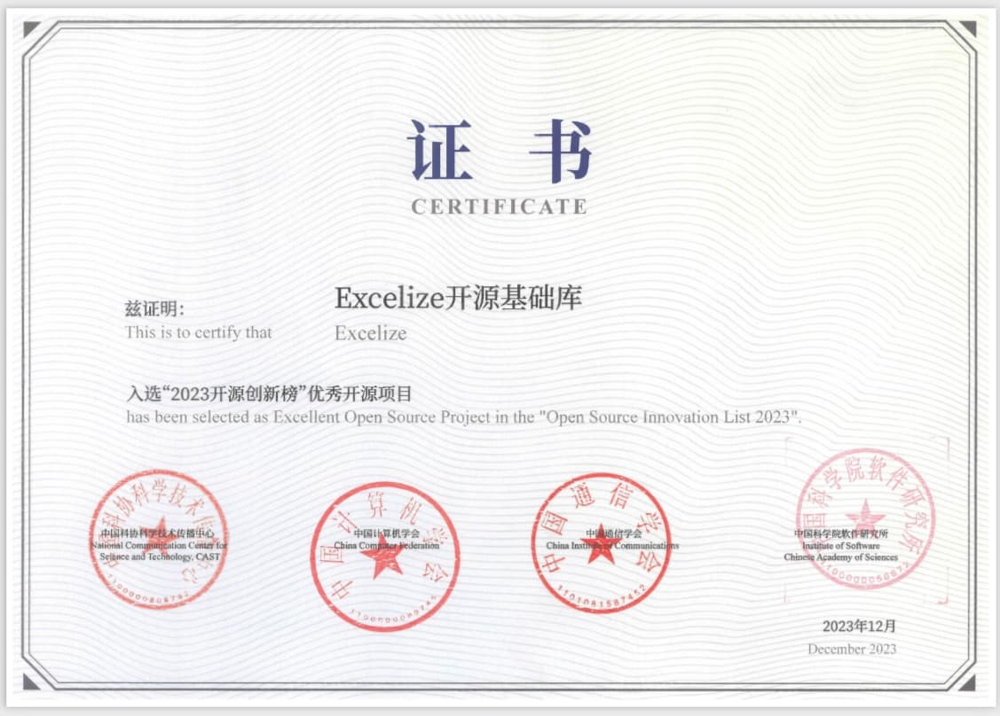
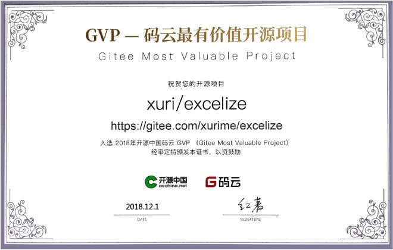

# 簡介

Excelize 是 Go 語言編寫的用於操作 Office Excel 檔案基礎庫，基於 ECMA-376，ISO/IEC 29500 國際標準。可以使用它來讀取、寫入由 Microsoft Excel&trade; 2007 及以上版本創建的電子錶格檔案。支援 XLAM / XLSM / XLSX / XLTM / XLTX 等多種檔案格式，高度兼容帶有樣式、圖片(表)、樞紐分析表、切片器等複雜組件的檔案，並提供流式讀寫 API，用於處理包含大規模數據的活頁簿。可應用於各類報表平台、雲計算、邊緣計算等系統。使用本類庫要求使用的 Go 語言為 1.16 或更高版本。

- Source Code: [github.com/xuri/excelize](https://github.com/xuri/excelize)
- Issue: [github.com/xuri/excelize/issues](https://github.com/xuri/excelize/issues)
- go.dev: [pkg.go.dev/github.com/xuri/excelize/v2](https://pkg.go.dev/github.com/xuri/excelize/v2)
- 許可協議: [BSD 3-Clause](https://opensource.org/licenses/BSD-3-Clause)
- 當前版本: [v2.8.0](https://github.com/xuri/excelize/releases/latest)
- 檔案更新: 2024年1月7日

## 專案使命

Excelize 的目標是創建並維護一個 Go 語言版本的 Excel 檔案 API，以處理符合基於 Office Open XML（OOXML）標準的電子錶格檔案，借助 Excelize 您可以使用 Go 讀取和寫入 MS Excel 檔案。

## 為什麼要使用 Excelize

在一些情況下我們需要透過程式操作 Excel 檔案，例如：開啓讀取已有 Excel 檔案內容、創建新的 Excel 檔案、基於已有檔案（範本）生成新的 Excel 檔案、向 Excel 檔案中插入圖片、圖表和表格等元素，有時還需要跨平台實現這些操作。使用 Excelize 可以方便的滿足上述需求。

## 專案榮譽

入選 2023 開源創新榜[優秀開源專案](https://cccst.org.cn/zxyw/tzgg/art/2023/art_748b3428e4184ccc825ea6de1a2d273f.html)

榮獲 2022 年中國開源創新大賽[一等獎](http://www.ce.cn/cysc/tech/gd2012/202306/05/t20230605_38576356.shtml)

入選 2020 Gopher China - Go 領域明星開源專案 ([GSP](https://mp.weixin.qq.com/s/XyLAaqpN-3urYcNmM_vPeg))

入選 2018 年開源中國碼雲最有價值開源專案 ([Gitee Most Valuable Project](https://gitee.com/xurime/excelize))

## 知名企業用戶

                             

如果您的公司或產品也在使用 Excelize，歡迎 <a href="mailto: xuri.me@gmail.com?Subject=Please add our company in Excelize Introduction page&amp;Body=Hello%2C%20this%20is%20%3Cyour%20name%3E%20from%20%3Cyour%20company%20name%3E.%0AWe%20are%20using%20Excelize%20and%20will%20be%20proud%20to%20add%20our%20company%20name%20to%20Excelize%20Introduction%20page.%0APlease%20see%20attachment%20for%20our%20logo.%20%3CBe%20sure%20to%20include%20logo%20in%20attachment%3E%0A%E4%BD%A0%E5%A5%BD%EF%BC%8C%E6%88%91%E6%98%AF%E3%80%90%E5%85%AC%E5%8F%B8%E5%90%8D%E7%A7%B0%E3%80%91%E7%9A%84%E3%80%90%E6%82%A8%E7%9A%84%E5%90%8D%E5%AD%97%E3%80%91%E3%80%82%0A%E6%88%91%E4%BB%AC%E5%85%AC%E5%8F%B8%E4%BD%BF%E7%94%A8%E4%BA%86%20Excelize%20%E5%B9%B6%E4%B8%94%E5%BE%88%E4%B9%90%E6%84%8F%E5%9C%A8%20Excelize%20%E7%9A%84%E2%80%9C%E4%BB%8B%E7%BB%8D%E2%80%9D%E9%A1%B5%E9%9D%A2%E5%8A%A0%E4%B8%8A%E6%88%91%E4%BB%AC%E5%85%AC%E5%8F%B8%E7%9A%84%20logo%E3%80%82%0A%E8%AF%B7%E5%9C%A8%E9%99%84%E4%BB%B6%E4%B8%AD%E6%9F%A5%E9%98%85%20logo%E3%80%82%E3%80%90%E8%AF%B7%E9%99%84%E4%B8%8A%20logo%20%E5%B9%B6%E5%8F%91%E9%80%81%E7%BB%99%20Excelize%E3%80%91" title="透過 E-mail 發送 Logo">發送 Logo</a> 給我們。

## 技術交流群

- [Facebook Group](https://www.facebook.com/groups/excelize)
- [Google Group](https://groups.google.com/g/excelize)
- [Stack Overflow](https://stackoverflow.com/questions/tagged/excelize)
- [Slack Channel](https://join.slack.com/t/xuri/shared_invite/zt-eriqdkeo-wV04zcCdBiiZveFgY86Wzw)
- [Gitter](https://gitter.im/excelize/community)
- [Community on Telegram](https://t.me/excelize)
- [Community on Discord](https://discord.gg/MWV8MBQGtv)
- [Excelize Community on Microsoft Teams](https://teams.live.com/l/invite/FBA8aHkflqEj5SNzQM)
- [Skype Community](https://join.skype.com/YW3OFS5QjYcV?source=qr-ios): <a href="../images/skype_group@2x.png" title="Excelize Skype Community" target="_blank">二維碼</a>
- [Line Community](http://line.me/ti/g/NFIjhfbP_g): <a href="../images/line_group@2x.png" title="Excelize Line Community" target="_blank">二維碼</a>
- [釘釘技術交流群](https://qr.dingtalk.com/action/joingroup?code=v1,k1,6tmzbBbJuQkGezVdHJjsHz29CZI9F49xeW+cvOaECtk=&_dt_no_comment=1&origin=11): `30047129` | <a href="../images/dingtalk_group@2x.png" title="Excelize 釘釘技術交流群" target="_blank">二維碼</a>
- QQ 技術交流群: `1302058237` (請備注: Excelize) | <a href="../images/qq_group@2x.png" title="Excelize QQ 技術交流群" target="_blank">二維碼</a>
- 微信技術交流群: `hixuri` (請備註: Excelize) | <a href="../images/wechat_group@2x.png" title="Excelize 微信技術交流群" target="_blank">二維碼</a>
- 企業微信技術交流群 (請備注: Excelize): <a href="../images/wecom_group@2x.png" title="Excelize 企業微信技術交流群" target="_blank">二維碼</a>
- 如流技術交流群 ID: `4375928` | <a href="../images/inflow_group@2x.png" title="Excelize 如流技術交流群" target="_blank">二維碼</a>
- 飛書技術交流群 (請備註: Excelize): <a href="../images/feishu_group@2x.png" title="飛書技術交流群" target="_blank">二維碼</a>

## 商業支援

幫助您的應用發揮最大潛力，讓使用電子錶格檔案變得有趣。除了提供完全免費和開源的基礎庫軟體包之外，Excelize 還可以在商業上提供技術咨詢支援服務：

- 優先考慮您的問題

有急需解決的問題或新功能需求嗎？Excelize 很樂意根據商業支援為您提供優先服務，請與 Excelize 聯繫以獲取更多詳細信息。

- 專業技術咨詢服務

在您的應用程式使用 Excelize 開發過程中提供技術支援，提供解決方案咨詢服務，並可以按小時為基礎加入您的團隊。

請透過 <a href="mailto: xuri.me@gmail.com">E-mail</a> 與我們取得聯絡。
