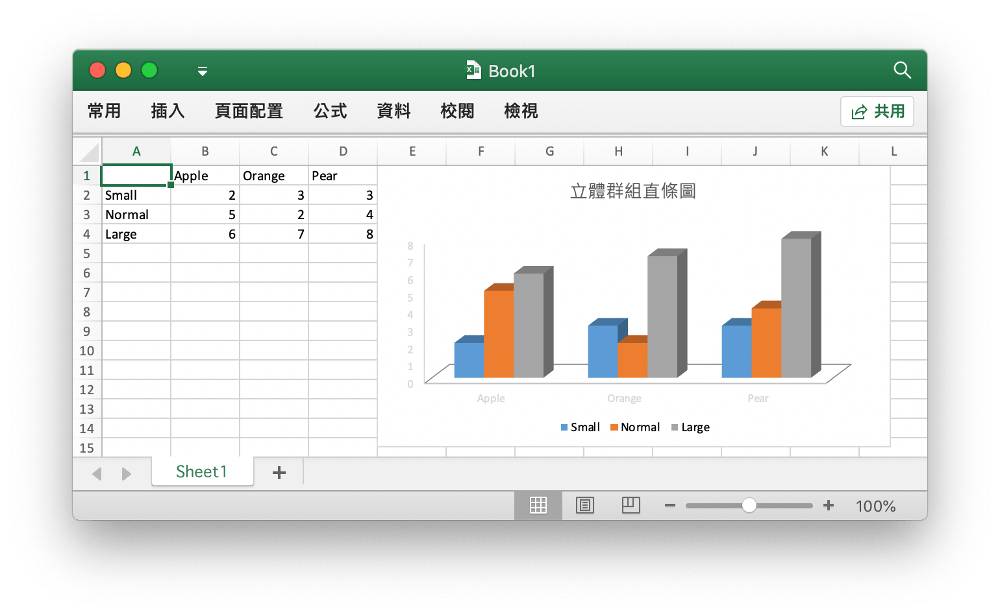

# 快速開始

## 安裝 {#install}

使用最新版本 Excelize 要求您使用的 Go 語言為 1.15 或更高版本。

- 安裝命令

```bash
go get github.com/xuri/excelize
```

- 如果您使用 [Go Modules](https://blog.golang.org/using-go-modules) 管理軟體包，請使用下面的命令來安裝最新版本。

```bash
go get github.com/xuri/excelize/v2
```

## 更新 {#update}

- 更新命令

```bash
go get -u github.com/xuri/excelize/v2
```

## 創建 Excel 文檔 {#NewFile}

下面是一個創建 Excel 文檔的簡單例子：

```go
package main

import (
    "fmt"

    "github.com/xuri/excelize/v2"
)

func main() {
    f := excelize.NewFile()
    // 創建一個工作表
    index := f.NewSheet("Sheet2")
    // 設定儲存格的值
    f.SetCellValue("Sheet2", "A2", "Hello world.")
    f.SetCellValue("Sheet1", "B2", 100)
    // 設定活頁簿的默認工作表
    f.SetActiveSheet(index)
    // 根據指定路徑儲存檔案
    if err := f.SaveAs("Book1.xlsx"); err != nil {
        fmt.Println(err)
    }
}
```

## 讀取 Excel 文檔 {#read}

下面是讀取 Excel 文檔的例子：

```go
package main

import (
    "fmt"

    "github.com/xuri/excelize/v2"
)

func main() {
    f, err := excelize.OpenFile("Book1.xlsx")
    if err != nil {
        fmt.Println(err)
        return
    }
    // 獲取工作表中指定儲存格的值
    cell, err := f.GetCellValue("Sheet1", "B2")
    if err != nil {
        fmt.Println(err)
        return
    }
    fmt.Println(cell)
    // 獲取 Sheet1 上所有儲存格
    rows, err := f.GetRows("Sheet1")
    for _, row := range rows {
        for _, colCell := range row {
            fmt.Print(colCell, "\t")
        }
        fmt.Println()
    }
    if err = f.Close(); err != nil {
        fmt.Println(err)
    }
}
```

## 在 Excel 文檔中創建圖表 {#chart}

使用 Excelize 生成圖表十分簡單，僅需幾行代碼。您可以根據工作表中的已有資料構建圖表，或向工作表中添加資料並創建圖表。

<p align="center"></p>

```go
package main

import (
    "fmt"

    "github.com/xuri/excelize/v2"
)

func main() {
    categories := map[string]string{
        "A2": "Small", "A3": "Normal", "A4": "Large", "B1": "Apple", "C1": "Orange", "D1": "Pear"}
    values := map[string]int{
        "B2": 2, "C2": 3, "D2": 3, "B3": 5, "C3": 2, "D3": 4, "B4": 6, "C4": 7, "D4": 8}
    f := excelize.NewFile()
    for k, v := range categories {
        f.SetCellValue("Sheet1", k, v)
    }
    for k, v := range values {
        f.SetCellValue("Sheet1", k, v)
    }
    if err := f.AddChart("Sheet1", "E1", `{"type":"col3DClustered","series":[{"name":"Sheet1!$A$2","categories":"Sheet1!$B$1:$D$1","values":"Sheet1!$B$2:$D$2"},{"name":"Sheet1!$A$3","categories":"Sheet1!$B$1:$D$1","values":"Sheet1!$B$3:$D$3"},{"name":"Sheet1!$A$4","categories":"Sheet1!$B$1:$D$1","values":"Sheet1!$B$4:$D$4"}],"title":{"name":"立體群組直條圖"}}`); err != nil {
        fmt.Println(err)
        return
    }
    // 根據指定路徑儲存檔案
    if err := f.SaveAs("Book1.xlsx"); err != nil {
        fmt.Println(err)
    }
}
```

## 向 Excel 文檔中插入圖片 {#image}

```go
package main

import (
    "fmt"
    _ "image/gif"
    _ "image/jpeg"
    _ "image/png"
    "fmt"

    "github.com/xuri/excelize/v2"
)

func main() {
    f, err := excelize.OpenFile("Book1.xlsx")
    if err != nil {
        fmt.Println(err)
        return
    }
    // 插入圖片
    if err := f.AddPicture("Sheet1", "A2", "image.png", ""); err != nil {
        fmt.Println(err)
    }
    // 在工作表中插入圖片，並設定圖片的縮放比例
    if err := f.AddPicture("Sheet1", "D2", "image.jpg", `{
        "x_scale": 0.5,
        "y_scale": 0.5
    }`); err != nil {
        fmt.Println(err)
    }
    // 在工作表中插入圖片，並設定圖片的打印屬性
    if err := f.AddPicture("Sheet1", "H2", "image.gif", `{
        "x_offset": 15,
        "y_offset": 10,
        "print_obj": true,
        "lock_aspect_ratio": false,
        "locked": false
    }`); err != nil {
        fmt.Println(err)
    }
    // 儲存檔案
    if err = f.Save(); err != nil {
        fmt.Println(err)
    }
    if err = f.Close(); err != nil {
        fmt.Println(err)
    }
}
```
