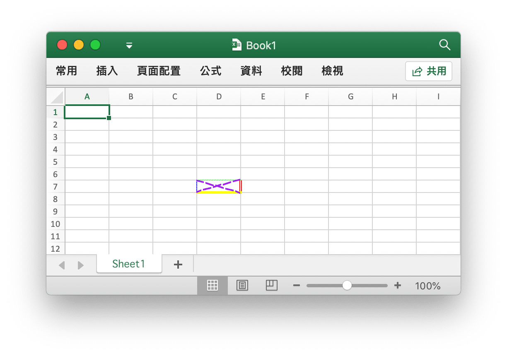
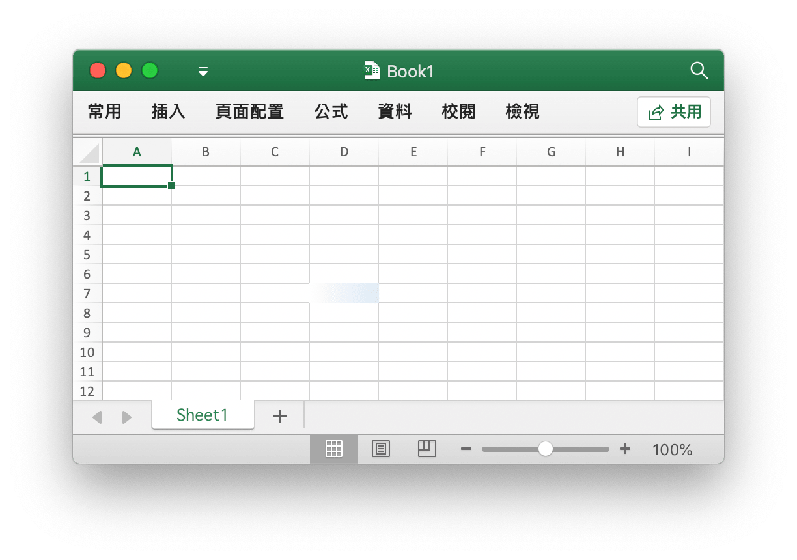
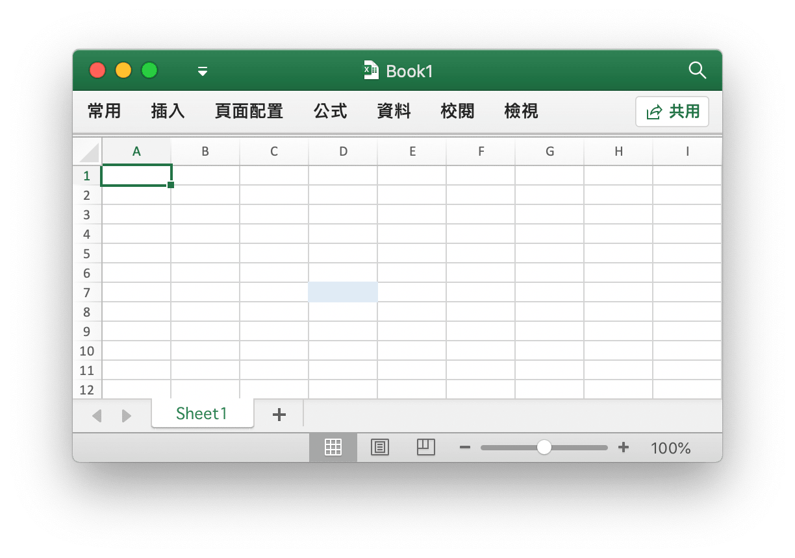
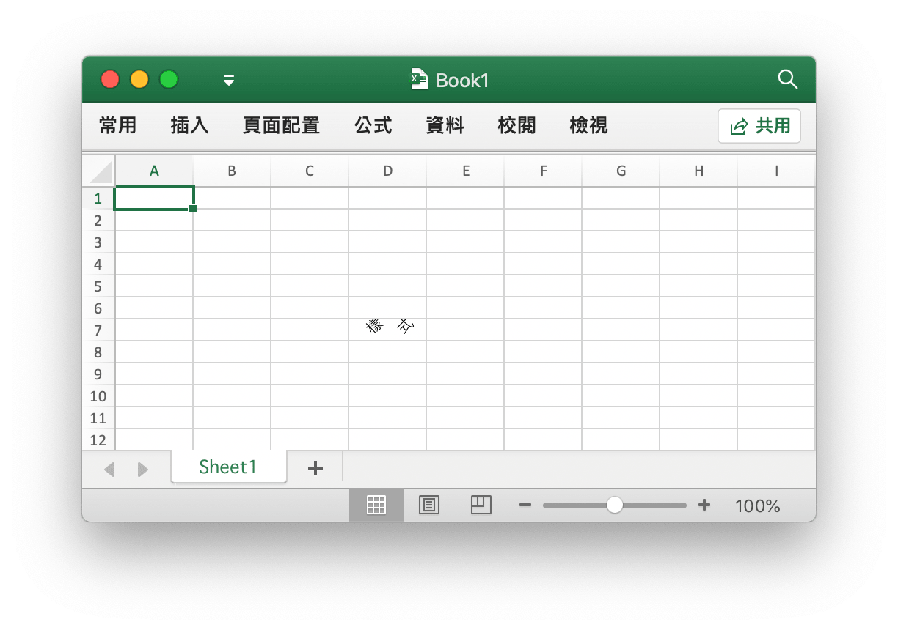
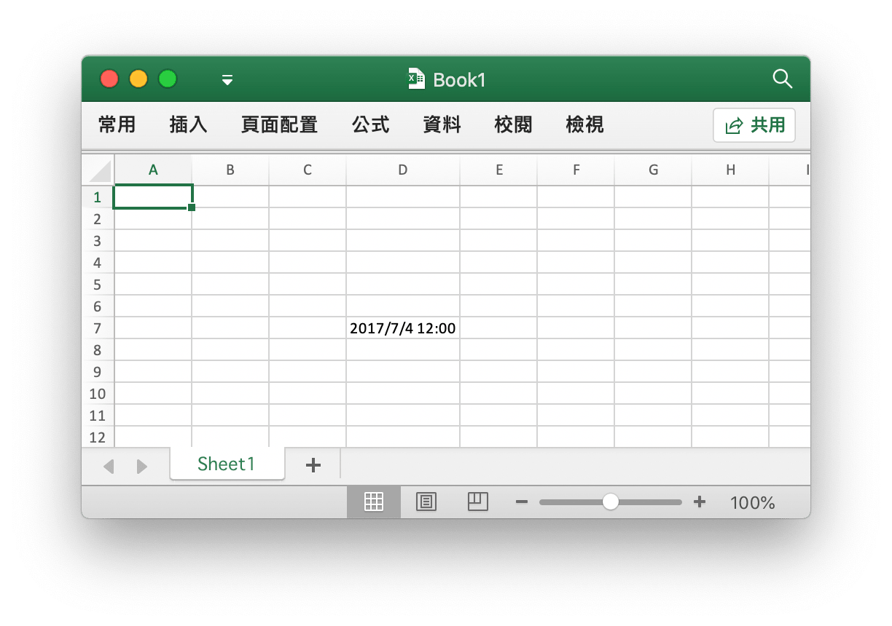
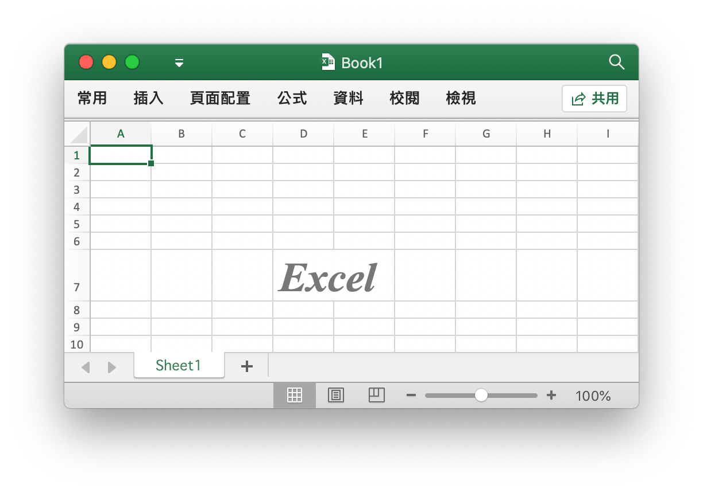
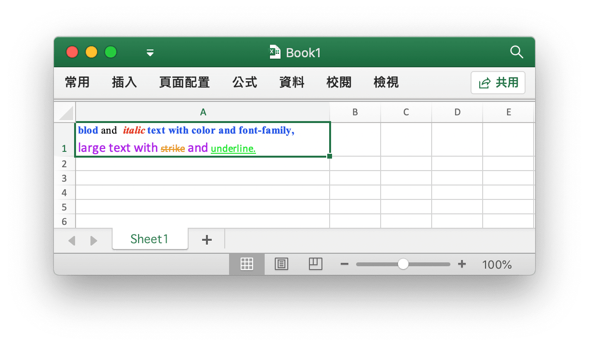
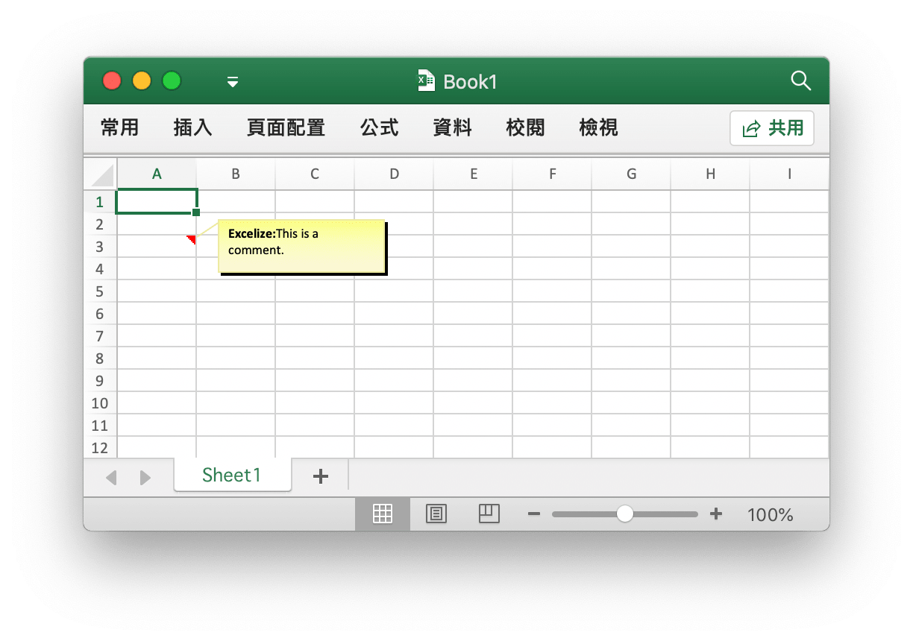

# 儲存格

RichTextRun 定義了富文本的屬性。

```go
type RichTextRun struct {
    Font *Font
    Text string
}
```

HyperlinkOpts 用來指定可選的超鏈接屬性，例如要顯示的文字與屏幕提示文字。

```go
type HyperlinkOpts struct {
    Display *string
    Tooltip *string
}
```

FormulaOpts 用於在 [`SetCellFormula`](cell.md#SetCellFormula) 函數中指定設置特殊公式類型。

```go
type FormulaOpts struct {
    Type *string // 公式類型
    Ref  *string // 共享公式引用
}
```

## 設定儲存格的值 {#SetCellValue}

```go
func (f *File) SetCellValue(sheet, axis string, value interface{}) error
```

根據給定的工作表名和儲存格坐標設定儲存格的值。指定的坐標不應在表格的第一列範圍，使用字符文本設置複數。

|支持的資料類別|
|---|
|int|
|int8|
|int16|
|int32|
|int64|
|uint|
|uint8|
|uint16|
|uint32|
|uint64|
|float32|
|float64|
|string|
|[]byte|
|time.Duration|
|time.Time|
|bool|
|nil|

## 設定布林型值 {#SetCellBool}

```go
func (f *File) SetCellBool(sheet, axis string, value bool) error
```

根據給定的工作表名和儲存格坐標設定布林型儲存格的值。

## 設定默認字符型值 {#SetCellDefault}

```go
func (f *File) SetCellDefault(sheet, axis, value string) error
```

根據給定的工作表名和儲存格坐標設定字符型儲存格的值，字符將不會進行特殊字符過濾。

## 設定實數 {#SetCellInt}

```go
func (f *File) SetCellInt(sheet, axis string, value int) error
```

根據給定的工作表名和儲存格坐標設定實數儲存格的值。

## 設定字符型值 {#SetCellStr}

```go
func (f *File) SetCellStr(sheet, axis, value string) error
```

根據給定的工作表名和儲存格坐標設定字符型儲存格的值，字符將會進行特殊字符過濾，並且字符串的累計長度應不超過 `32767`，多餘的字符將會被忽略。

## 設定儲存格樣式 {#SetCellStyle}

```go
func (f *File) SetCellStyle(sheet, hcell, vcell string, styleID int) error
```

根據給定的工作表名、儲存格坐標區域和樣式索引設定儲存格的值。樣式索引可以通過 [`NewStyle`](style.md#NewStyle) 函數獲取。注意，在同一個坐標區域內的 `diagonalDown` 和 `diagonalUp` 需要保持色彩一致。

- 例1，為名為 `Sheet1` 的工作表 `D7` 儲存格設定邊框樣式：

```go
style, err := f.NewStyle(`{
    "border": [
    {
        "type": "left",
        "color": "0000FF",
        "style": 3
    },
    {
        "type": "top",
        "color": "00FF00",
        "style": 4
    },
    {
        "type": "bottom",
        "color": "FFFF00",
        "style": 5
    },
    {
        "type": "right",
        "color": "FF0000",
        "style": 6
    },
    {
        "type": "diagonalDown",
        "color": "A020F0",
        "style": 7
    },
    {
        "type": "diagonalUp",
        "color": "A020F0",
        "style": 8
    }]
}`)
if err != nil {
    fmt.Println(err)
}
err = f.SetCellStyle("Sheet1", "D7", "D7", style)
```

<p align="center"></p>

儲存格 `D7` 的四個邊框被設定了不同的樣式和色彩，這與調用 [`NewStyle`](style.md#NewStyle) 函數時的參數有關，需要設定不同的樣式可參考該章節的文檔。

- 例2，為名為 `Sheet1` 的工作表 `D7` 儲存格設定漸變樣式：

```go
style, err := f.NewStyle(`{"fill":{"type":"gradient","color":["#FFFFFF","#E0EBF5"],"shading":1}}`)
if err != nil {
    fmt.Println(err)
}
err = f.SetCellStyle("Sheet1", "D7", "D7", style)
```

<p align="center"></p>

儲存格 `D7` 被設定了漸變效果的色彩填滿，漸變填滿效果與調用 [`NewStyle`](style.md#NewStyle) 函數時的參數有關，需要設定不同的樣式可參考該章節的文檔。

- 例3，為名為 `Sheet1` 的工作表 `D7` 儲存格設定純色填滿：

```go
style, err := f.NewStyle(`{"fill":{"type":"pattern","color":["#E0EBF5"],"pattern":1}}`)
if err != nil {
    fmt.Println(err)
}
err = f.SetCellStyle("Sheet1", "D7", "D7", style)
```

<p align="center"></p>

儲存格 `D7` 被設定了純色填滿。

- 例4，為名為 `Sheet1` 的工作表 `D7` 儲存格設定字符間距與旋轉角度：

```go
f.SetCellValue("Sheet1", "D7", "樣式")
style, err := f.NewStyle(`{
    "alignment":
    {
        "horizontal": "center",
        "ident": 1,
        "justify_last_line": true,
        "reading_order": 0,
        "relative_indent": 1,
        "shrink_to_fit": true,
        "text_rotation": 45,
        "vertical": "",
        "wrap_text": true
    }
}`)
if err != nil {
    fmt.Println(err)
}
err = f.SetCellStyle("Sheet1", "D7", "D7", style)
```

<p align="center"></p>

- 例5，Excel 中的日期和時間用實數表示，例如 `2017/7/4  12:00:00 PM` 可以用數字 `42920.5` 來表示。為名為 `Sheet1` 的工作表 `D7` 儲存格設定時間格式：

```go
f.SetCellValue("Sheet1", "D7", 42920.5)
f.SetColWidth("Sheet1", "D", "D", 13)
style, err := f.NewStyle(`{"number_format": 22}`)
if err != nil {
    fmt.Println(err)
}
err = f.SetCellStyle("Sheet1", "D7", "D7", style)
```

<p align="center"></p>

儲存格 `D7` 被設定了時間格式。注意，當應用了時間格式的儲存格寬度過窄無法完整展示時會顯示為 `####`，可以拖拽調整欄寬或者通過調用 `SetColWidth` 函數設定欄寬到合適的大小使其正常顯示。

- 例6，為名為 `Sheet1` 的工作表 `D7` 儲存格設定字型、字號、色彩和傾斜樣式：

```go
f.SetCellValue("Sheet1", "D7", "Excel")
style, err := f.NewStyle(`{
    "font":
    {
        "bold": true,
        "italic": true,
        "family": "Times New Roman",
        "size": 36,
        "color": "#777777"
    }
}`)
if err != nil {
    fmt.Println(err)
}
err = f.SetCellStyle("Sheet1", "D7", "D7", style)
```

<p align="center"></p>

- 例7，鎖定並隱藏名為 `Sheet1` 的工作表 `D7` 儲存格：

```go
style, err := f.NewStyle(`{"protection":{"hidden":true, "locked":true}}`)
if err != nil {
    fmt.Println(err)
}
err = f.SetCellStyle("Sheet1", "D7", "D7", style)
```

要鎖定儲存格或隱藏公式，請保護工作表。在「審閱」選項卡上，單擊「保護工作表」。

## 設定超鏈接 {#SetCellHyperLink}

```go
func (f *File) SetCellHyperLink(sheet, axis, link, linkType string) error
```

根據給定的工作表、儲存格坐標、鏈接資源和資源類別設定儲存格的超鏈接。資源類別分為外部鏈接地址 `External` 和活頁簿內部位置鏈接 `Location` 兩種。每個工作表中的包含最大超鏈接限制為 `65530` 個。

- 例1，為名為 `Sheet1` 的工作表 `A3` 儲存格添加外部鏈接：

```go
err := f.SetCellHyperLink("Sheet1", "A3",
    "https://github.com/360EntSecGroup-Skylar/excelize", "External")
// 為儲存格設定字型和下划線樣式
style, err := f.NewStyle(`{"font":{"color":"#1265BE","underline":"single"}}`)
err = f.SetCellStyle("Sheet1", "A3", "A3", style)
```

- 例2，為名為 `Sheet1` 的工作表 `A3` 儲存格添加內部位置鏈接：

```go
err := f.SetCellHyperLink("Sheet1", "A3", "Sheet1!A40", "Location")
```

## 設定富文本格式 {#SetCellRichText}

```go
func (f *File) SetCellRichText(sheet, cell string, runs []RichTextRun) error
```

根據給定的工作表、儲存格坐標和富文本格式為指定儲存格設定富文本。

例如，在名為 `Sheet1` 的工作表 `A1` 儲存格設定富文本格式：

<p align="center"></p>

```go
package main

import (
    "fmt"

    "github.com/360EntSecGroup-Skylar/excelize/v2"
)

func main() {
    f := excelize.NewFile()
    if err := f.SetRowHeight("Sheet1", 1, 35); err != nil {
        fmt.Println(err)
        return
    }
    if err := f.SetColWidth("Sheet1", "A", "A", 44); err != nil {
        fmt.Println(err)
        return
    }
    if err := f.SetCellRichText("Sheet1", "A1", []excelize.RichTextRun{
        {
            Text: "bold",
            Font: &excelize.Font{
                Bold:   true,
                Color:  "2354e8",
                Family: "Times New Roman",
            },
        },
        {
            Text: " and ",
            Font: &excelize.Font{
                Family: "Times New Roman",
            },
        },
        {
            Text: "italic",
            Font: &excelize.Font{
                Bold:   true,
                Color:  "e83723",
                Italic: true,
                Family: "Times New Roman",
            },
        },
        {
            Text: "text with color and font-family,",
            Font: &excelize.Font{
                Bold:   true,
                Color:  "2354e8",
                Family: "Times New Roman",
            },
        },
        {
            Text: "\r\nlarge text with ",
            Font: &excelize.Font{
                Size:  14,
                Color: "ad23e8",
            },
        },
        {
            Text: "strike",
            Font: &excelize.Font{
                Color:  "e89923",
                Strike: true,
            },
        },
        {
            Text: " and ",
            Font: &excelize.Font{
                Size:  14,
                Color: "ad23e8",
            },
        },
        {
            Text: "underline.",
            Font: &excelize.Font{
                Color:     "23e833",
                Underline: "single",
            },
        },
    }); err != nil {
        fmt.Println(err)
        return
    }
    style, err := f.NewStyle(&excelize.Style{
        Alignment: &excelize.Alignment{
            WrapText: true,
        },
    })
    if err != nil {
        fmt.Println(err)
        return
    }
    if err := f.SetCellStyle("Sheet1", "A1", "A1", style); err != nil {
        fmt.Println(err)
        return
    }
    if err := f.SaveAs("Book1.xlsx"); err != nil {
        fmt.Println(err)
    }
}
```

## 獲取富文本格式 {#GetCellRichText}

```go
func (f *File) GetCellRichText(sheet, cell string) (runs []RichTextRun, err error)
```

根據給定的工作表、儲存格坐標獲取指定儲存格的富文本格式。

## 獲取儲存格的值 {#GetCellValue}

```go
func (f *File) GetCellValue(sheet, axis string) (string, error)
```

根據給定的工作表和儲存格坐標獲取儲存格的值，傳回值將轉換為 `string` 類別。如果可以將儲存格格式應用於儲存格的值，將傳回應用後的值，否則將傳回原始值。

## 按欄獲取全部儲存格的值 {#GetCols}

```go
func (f *File) GetCols(sheet string) ([][]string, error)
```

根據給定的工作表名（大小寫敏感）按欄獲取該工作表上全部儲存格的值，以二維數組形式傳回，其中儲存格的值將轉換為 `string` 類別。如果可以將儲存格格式應用於儲存格的值，將使用應用後的值，否則將使用原始值。

例如，按欄獲取並遍歷輸出名為 `Sheet1` 的工作表上的所有儲存格的值：

```go
cols, err := f.GetCols("Sheet1")
if err != nil {
    fmt.Println(err)
    return
}
for _, col := range cols {
    for _, rowCell := range col {
        fmt.Print(rowCell, "\t")
    }
    fmt.Println()
}
```

## 按列獲取全部儲存格的值 {#GetRows}

```go
func (f *File) GetRows(sheet string) ([][]string, error)
```

根據給定的工作表名（大小寫敏感）按列獲取該工作表上全部儲存格的值，以二維數組形式傳回，其中儲存格的值將轉換為 `string` 類別。如果可以將儲存格格式應用於儲存格的值，將使用應用後的值，否則將使用原始值。

例如，按列獲取並遍歷輸出名為 `Sheet1` 的工作表上的所有儲存格的值：

```go
rows, err := f.GetRows("Sheet1")
if err != nil {
    fmt.Println(err)
    return
}
for _, row := range rows {
    for _, colCell := range row {
        fmt.Print(colCell, "\t")
    }
    fmt.Println()
}
```

## 獲取超鏈接 {#GetCellHyperLink}

```go
func (f *File) GetCellHyperLink(sheet, axis string) (bool, string, error)
```

根據給定的工作表名（大小寫敏感）和儲存格坐標獲取儲存格超鏈接，如果該儲存格存在超鏈接，將傳回 `true` 和鏈接地址，否則將傳回 `false` 和空的鏈接地址。

例如，獲取名為 `Sheet1` 的工作表上坐標為 `H6` 儲存格的超鏈接：

```go
link, target, err := f.GetCellHyperLink("Sheet1", "H6")
```

## 獲取樣式索引 {#GetCellStyle}

```go
func (f *File) GetCellStyle(sheet, axis string) (int, error)
```

根據給定的工作表名（大小寫敏感）和儲存格坐標獲取儲存格樣式索引，獲取到的索引可以在複製儲存格樣式時，作為調用 `SetCellValue` 函數的參數使用。

## 合併儲存格 {#MergeCell}

```go
func (f *File) MergeCell(sheet, hcell, vcell string) error
```

根據給定的工作表名（大小寫敏感）和儲存格坐標區域合併儲存格。例如，合併名為 `Sheet1` 的工作表上 `D3:E9` 區域內的儲存格：

```go
err := f.MergeCell("Sheet1", "D3", "E9")
```

如果給定的儲存格坐標區域與已有的其他合併儲存格相重疊，已有的合併儲存格將會被刪除。

## 取消合併儲存格 {#UnmergeCell}

```go
func (f *File) UnmergeCell(sheet string, hcell, vcell string) error
```

根據給定的工作表名（大小寫敏感）和儲存格坐標區域取消合併儲存格。例如，取消合併名為 `Sheet1` 的工作表上 `D3:E9` 區域內的儲存格：

```go
err := f.UnmergeCell("Sheet1", "D3", "E9")
```

如果給定的儲存格坐標區域包含多個合併儲存格，則全部合併儲存格都將被取消合併。

## 獲取合併儲存格 {#GetMergeCells}

根據給定的工作表名（大小寫敏感）獲取全部合併儲存格的坐標區域和值。

```go
func (f *File) GetMergeCells(sheet string) ([]MergeCell, error)
```

## 添加註解 {#AddComment}

```go
func (f *File) AddComment(sheet, cell, format string) error
```

根據給定的工作表名稱、儲存格坐標和樣式參數（作者與文本信息）添加註解。作者信息最大長度為 255 個字符，最大文本內容長度為 32512 個字符，超出該範圍的字符將會被忽略。例如，為 `Sheet1!$A$3` 儲存格添加註解：

<p align="center"></p>

```go
err := f.AddComment("Sheet1", "A3", `{"author":"Excelize: ","text":"This is a comment."}`)
```

## 獲取註解 {#GetComments}

```go
func (f *File) GetComments() (comments map[string][]Comment)
```

通過該方法可以獲取全部工作表中的註解。

## 設定公式 {#SetCellFormula}

```go
func (f *File) SetCellFormula(sheet, axis, formula string, opts ...FormulaOpts) error
```

根據給定的工作表名（大小寫敏感）和儲存格坐標設定取該儲存格上的公式。公式的結果會在工作表被 Office Excel 應用程式打開時計算，或通過 [CalcCellValue](cell.md#CalcCellValue) 函數計算存儲格的值。

## 獲取公式 {#GetCellFormula}

```go
func (f *File) GetCellFormula(sheet, axis string) (string, error)
```

根據給定的工作表名（大小寫敏感）和儲存格坐標獲取該儲存格上的公式。

## 計算存儲格的值 {#CalcCellValue}

```go
func (f *File) CalcCellValue(sheet, cell string) (result string, err error)
```

根據給定的工作表名（大小寫敏感）和存儲格坐標計算包含公式存儲格的值。該方法目前正在開發中，尚未支持數組函數、表格函數和其他部分函數。

支持的函數列表如下：

```text
ABS
ACOS
ACOSH
ACOT
ACOTH
AND
ARABIC
ASIN
ASINH
ATAN
ATAN2
ATANH
AVERAGE
AVERAGEA
BASE
BESSELI
BESSELJ
BIN2DEC
BIN2HEX
BIN2OCT
BITAND
BITLSHIFT
BITOR
BITRSHIFT
BITXOR
CEILING
CEILING.MATH
CEILING.PRECISE
CHAR
CHOOSE
CLEAN
CODE
COLUMN
COLUMNS
COMBIN
COMBINA
COMPLEX
CONCAT
CONCATENATE
COS
COSH
COT
COTH
COUNT
COUNTA
COUNTBLANK
CSC
CSCH
CUMIPMT
CUMPRINC
DATE
DATEDIF
DEC2BIN
DEC2HEX
DEC2OCT
DECIMAL
DEGREES
ENCODEURL
EVEN
EXACT
EXP
FACT
FACTDOUBLE
FALSE
FIND
FINDB
FISHER
FISHERINV
FIXED
FLOOR
FLOOR.MATH
FLOOR.PRECISE
GAMMA
GAMMALN
GCD
HARMEAN
HEX2BIN
HEX2DEC
HEX2OCT
HLOOKUP
IF
IFERROR
IMABS
IMAGINARY
IMARGUMENT
IMCONJUGATE
IMCOS
IMCOSH
IMCOT
IMCSC
IMCSCH
IMDIV
IMEXP
IMLN
IMLOG10
IMLOG2
IMPOWER
IMPRODUCT
IMREAL
IMSEC
IMSECH
IMSIN
IMSINH
IMSQRT
IMSUB
IMSUM
IMTAN
INT
IPMT
ISBLANK
ISERR
ISERROR
ISEVEN
ISNA
ISNONTEXT
ISNUMBER
ISODD
ISTEXT
ISO.CEILING
ISPMT
KURT
LARGE
LCM
LEFT
LEFTB
LEN
LENB
LN
LOG
LOG10
LOOKUP
LOWER
MAX
MDETERM
MEDIAN
MID
MIDB
MIN
MINA
MOD
MROUND
MULTINOMIAL
MUNIT
N
NA
NORM.DIST
NORMDIST
NORM.INV
NORMINV
NORM.S.DIST
NORMSDIST
NORM.S.INV
NORMSINV
NOT
NOW
OCT2BIN
OCT2DEC
OCT2HEX
ODD
OR
PERCENTILE.INC
PERCENTILE
PERMUT
PERMUTATIONA
PI
PMT
POISSON.DIST
POISSON
POWER
PPMT
PRODUCT
PROPER
QUARTILE
QUARTILE.INC
QUOTIENT
RADIANS
RAND
RANDBETWEEN
REPLACE
REPLACEB
REPT
RIGHT
RIGHTB
ROMAN
ROUND
ROUNDDOWN
ROUNDUP
ROW
ROWS
SEC
SECH
SHEET
SIGN
SIN
SINH
SKEW
SMALL
SQRT
SQRTPI
STDEV
STDEV.S
STDEVA
SUBSTITUTE
SUM
SUMIF
SUMSQ
T
TAN
TANH
TODAY
TRIM
TRUE
TRUNC
UNICHAR
UNICODE
UPPER
VAR.P
VARP
VLOOKUP
```
