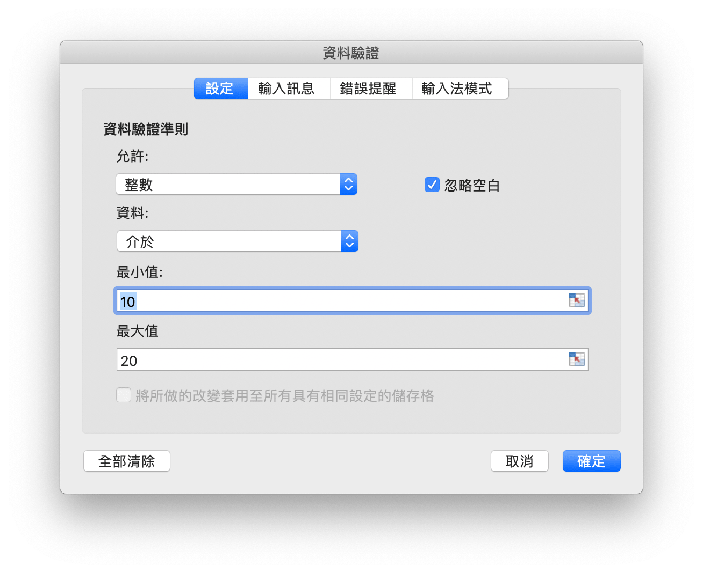
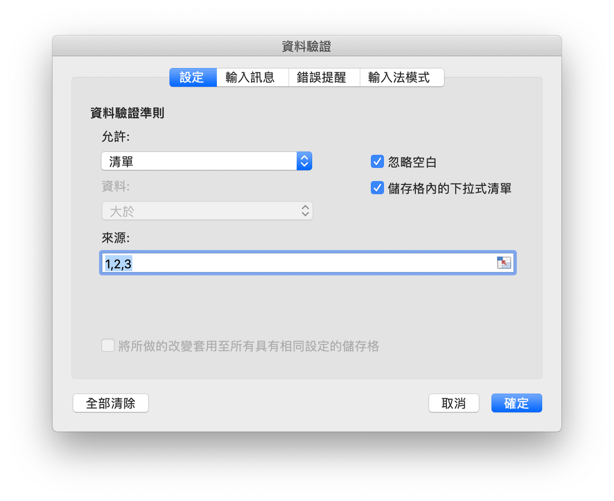
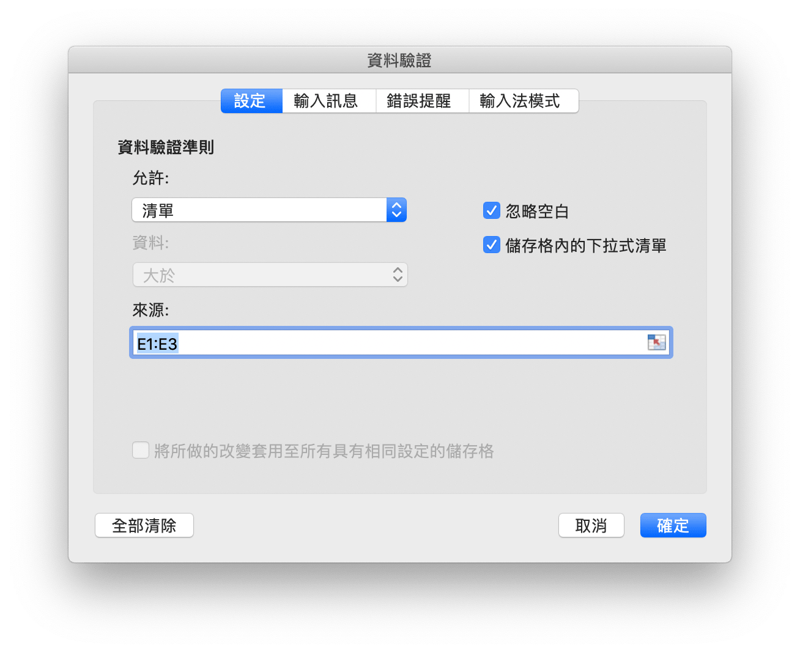

# 資料

## 添加資料驗證 {#AddDataValidation}

```go
func (f *File) AddDataValidation(sheet string, dv *DataValidation)
```

根據給定的工作表名和資料驗證對象設定資料驗證規則，資料驗證對象可透過 `NewDataValidation` 函式創建，資料驗證類別和條件參考[常量](constants.md)中的定義。

例1，為 `Sheet1!A1:B2` 設定包含驗證條件為允許介於整數 10 到 20 的資料驗證規則，輸入無效資料時顯示出錯警告，標題為: "error title"，錯誤信息 "error body":

<p align="center"></p>

```go
dv := excelize.NewDataValidation(true)
dv.SetSqref("A1:B2")
dv.SetRange(10, 20, excelize.DataValidationTypeWhole, excelize.DataValidationOperatorBetween)
dv.SetError(excelize.DataValidationErrorStyleStop, "error title", "error body")
f.AddDataValidation("Sheet1", dv)
```

例2，為 `Sheet1!A3:B4` 設定包含驗證條件為允許大於整數 10 的資料驗證規則，選定儲存格時顯示輸入信息，輸入信息為: "input body":

<p align="center"></p>

```go
dv = excelize.NewDataValidation(true)
dv.SetSqref("A3:B4")
dv.SetRange(10, 20, excelize.DataValidationTypeWhole, excelize.DataValidationOperatorGreaterThan)
dv.SetInput("input title", "input body")
f.AddDataValidation("Sheet1", dv)
```

例3，為 `Sheet1!A5:B6` 設定驗證條件為序列的資料驗證規則，忽略空值並提供下拉箭頭:

<p align="center"></p>

```go
dv = excelize.NewDataValidation(true)
dv.SetSqref("A5:B6")
dv.SetDropList([]string{"1", "2", "3"})
f.AddDataValidation("Sheet1", dv)
```

例4，為 `Sheet1!A7:B8` 設定以 `Sheet1!E1:E3` 為來源的驗證條件，忽略空值並提供下拉箭頭:

<p align="center"></p>

```go
dv := excelize.NewDataValidation(true)
dv.SetSqref("A7:B8")
dv.SetSqrefDropList("$E$1:$E$3")
f.AddDataValidation("Sheet1", dv)
```

## 獲取資料驗證 {#GetDataValidations}

```go
func (f *File) GetDataValidations(sheet string) ([]*DataValidation, error)
```

根據給定的工作表名獲取改工作表中全部資料驗證區域和資料驗證規則。

## 刪除資料驗證 {#DeleteDataValidation}

```go
func (f *File) DeleteDataValidation(sheet string, sqref ...string) error
```

根據給定的工作表名和資料驗證區域刪除資料驗證規則。若未指定資料驗證區域，將刪除給定工作表中全部資料驗證區規則。
