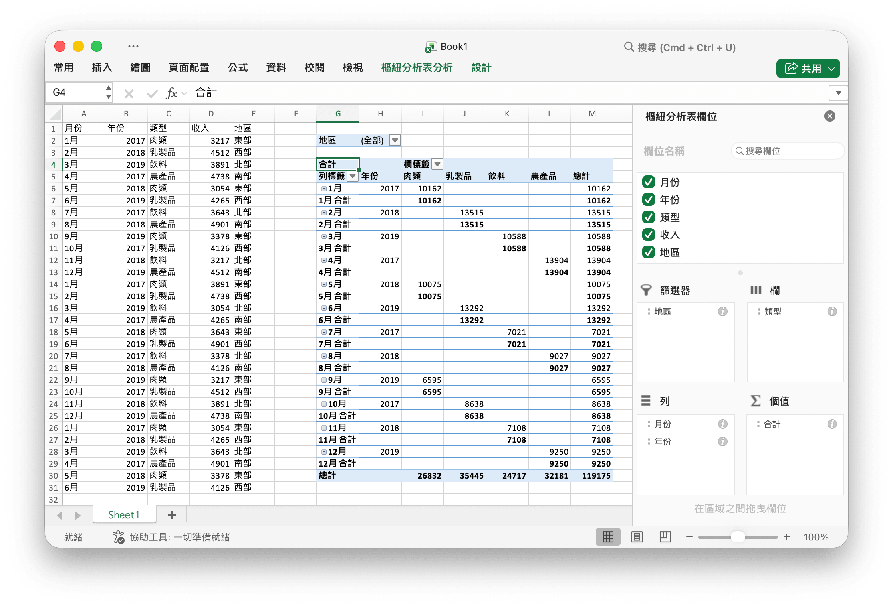

# 樞紐分析表 {#PivotTable}

樞紐分析表是一種交互式的表，是計算、匯總和分析資料的強大工具，可助你瞭解資料中的對比情況、模式和趨勢。

PivotTableOption 定義了樞紐分析表的屬性。

```go
type PivotTableOption struct {
    DataRange           string
    PivotTableRange     string
    Rows                []PivotTableField
    Columns             []PivotTableField
    Data                []PivotTableField
    Filter              []PivotTableField
    RowGrandTotals      bool
    ColGrandTotals      bool
    ShowDrill           bool
    UseAutoFormatting   bool
    PageOverThenDown    bool
    MergeItem           bool
    CompactData         bool
    ShowRowHeaders      bool
    ShowColHeaders      bool
    ShowRowStripes      bool
    ShowColStripes      bool
    ShowLastColumn      bool
    PivotTableStyleName string
}
```

PivotTableField 定義了樞紐分析表的欄位屬性。

```go
type PivotTableField struct {
    Data            string
    Name            string
    Subtotal        string
    DefaultSubtotal bool
}
```

Subtotal 指定適用於數值欄位的聚合函數。默認值為 `Sum`。該屬性的可選值如下：

|可選值|
|---|
|Average|
|Count|
|CountNums|
|Max|
|Min|
|Product|
|StdDev|
|StdDevp|
|Sum|
|Var|
|Varp|

Name 用以指定數值欄位的名稱，最大長度為 `255` 個字符，超出部分的字符將不會被保留。

## 創建樞紐分析表 {#AddPivotTable}

```go
func (f *File) AddPivotTable(opt *PivotTableOption) error
```

根據給定的屬性創建樞紐分析表。

例如，以 `Sheet1!$G$2:$M$34` 作為資料源，在 `Sheet1!$A$1:$E$31` 選區創建樞紐分析表，並按照銷售資料匯總求和:

<p align="center"></p>

```go
package main

import (
    "fmt"
    "math/rand"

    "github.com/xuri/excelize/v2"
)

func main() {
    f := excelize.NewFile()
    // 在工作表中添加資料
    month := []string{"Jan", "Feb", "Mar", "Apr", "May",
        "Jun", "Jul", "Aug", "Sep", "Oct", "Nov", "Dec"}
    year := []int{2017, 2018, 2019}
    types := []string{"Meat", "Dairy", "Beverages", "Produce"}
    region := []string{"East", "West", "North", "South"}
    f.SetSheetRow("Sheet1", "A1", &[]string{"Month", "Year", "Type", "Sales", "Region"})
    for i := 0; i < 30; i++ {
        f.SetCellValue("Sheet1", fmt.Sprintf("A%d", i+2), month[rand.Intn(12)])
        f.SetCellValue("Sheet1", fmt.Sprintf("B%d", i+2), year[rand.Intn(3)])
        f.SetCellValue("Sheet1", fmt.Sprintf("C%d", i+2), types[rand.Intn(4)])
        f.SetCellValue("Sheet1", fmt.Sprintf("D%d", i+2), rand.Intn(5000))
        f.SetCellValue("Sheet1", fmt.Sprintf("E%d", i+2), region[rand.Intn(4)])
    }
    if err := f.AddPivotTable(&excelize.PivotTableOption{
        DataRange:       "Sheet1!$A$1:$E$31",
        PivotTableRange: "Sheet1!$G$2:$M$34",
        Rows: []excelize.PivotTableField{
            {Data: "Month", DefaultSubtotal: true}, {Data: "Year"}},
        Filter: []excelize.PivotTableField{
            {Data: "Region"}},
        Columns: []excelize.PivotTableField{
            {Data: "Type", DefaultSubtotal: true}},
        Data: []excelize.PivotTableField{
            {Data: "Sales", Name: "Summarize", Subtotal: "Sum"}},
        RowGrandTotals: true,
        ColGrandTotals: true,
        ShowDrill:      true,
        ShowRowHeaders: true,
        ShowColHeaders: true,
        ShowLastColumn: true,
    }); err != nil {
        fmt.Println(err)
    }
    if err := f.SaveAs("Book1.xlsx"); err != nil {
        fmt.Println(err)
    }
}
```
