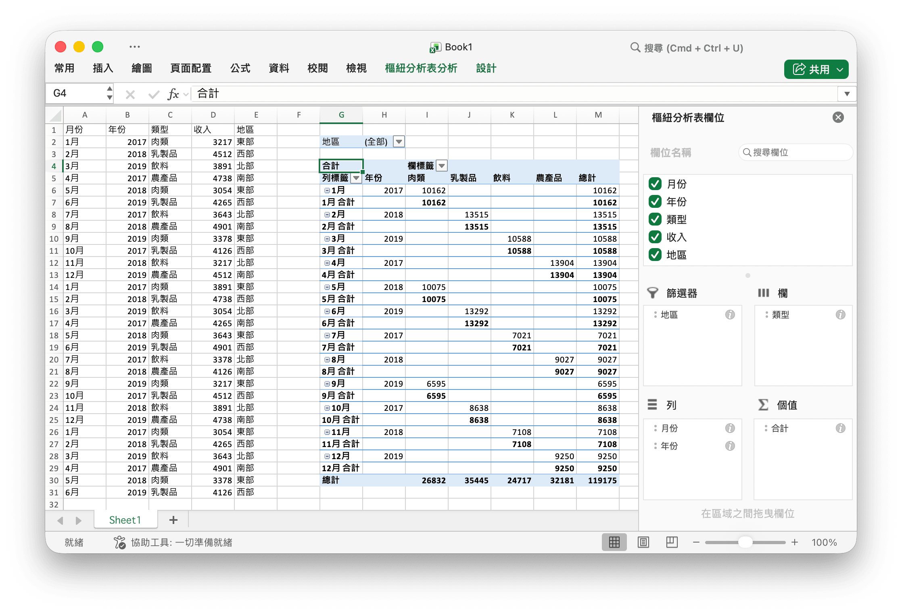

# 樞紐分析表 {#PivotTable}

{{ book.info }}

樞紐分析表是一種交互式的表，是計算、匯總和分析資料的強大工具，可助你瞭解資料中的對比情況、模式和趨勢。

`PivotTableOptions` 定義了樞紐分析表的屬性。

```go
type PivotTableOptions struct {
    DataRange           string
    PivotTableRange     string
    Name                string
    Rows                []PivotTableField
    Columns             []PivotTableField
    Data                []PivotTableField
    Filter              []PivotTableField
    RowGrandTotals      bool
    ColGrandTotals      bool
    ShowDrill           bool
    UseAutoFormatting   bool
    PageOverThenDown    bool
    MergeItem           bool
    ClassicLayout       bool
    CompactData         bool
    ShowError           bool
    ShowRowHeaders      bool
    ShowColHeaders      bool
    ShowRowStripes      bool
    ShowColStripes      bool
    ShowLastColumn      bool
    FieldPrintTitles    bool
    ItemPrintTitles     bool
    PivotTableStyleName string
    // 還包含其他已過濾或未導出的欄位
}
```

`PivotTableStyleName`: 支援的樞紐分析表樣式:

```text
PivotStyleLight1 - PivotStyleLight28
PivotStyleMedium1 - PivotStyleMedium28
PivotStyleDark1 - PivotStyleDark28
```

`PivotTableField` 定義了樞紐分析表的欄位屬性。

```go
type PivotTableField struct {
    Compact         bool
    Data            string
    Name            string
    Outline         bool
    ShowAll         bool
    InsertBlankRow  bool
    Subtotal        string
    DefaultSubtotal bool
    NumFmt          int
    SelectedItems   []string
}
```

`Subtotal` 指定適用於數值欄位的聚合函式。默認值為 `Sum`。該屬性的可選值如下：

|可選值|
|---|
|Average|
|Count|
|CountNums|
|Max|
|Min|
|Product|
|StdDev|
|StdDevp|
|Sum|
|Var|
|Varp|

`Name` 用以指定數值欄位的名稱，最大長度為 `255` 個字符，超出部分的字符將不會被保留。

`SelectedItems` 用以指定樞紐分析表字段中的默認選中項，選中項必須是該字段所引用的存儲格範圍內的值。

## 創建樞紐分析表 {#AddPivotTable}

```go
func (f *File) AddPivotTable(opts *PivotTableOptions) error
```

根據給定的屬性創建樞紐分析表。

例如，以 `Sheet1!G4:M30` 作為資料源，在 `Sheet1!A1:E31` 選區創建樞紐分析表，並按照銷售資料匯總加總:

<p align="center"></p>

```go
package main

import (
    "fmt"

    "github.com/xuri/excelize/v2"
)

func main() {
    f := excelize.NewFile()
    defer func() {
        if err := f.Close(); err != nil {
            fmt.Println(err)
        }
    }()
    // 在工作表中添加資料
    month := []string{"1月", "2月", "3月", "4月", "5月", "6月",
        "7月", "8月", "9月", "10月", "11月", "12月"}
    year := []int{2017, 2018, 2019}
    types := []string{"肉類", "乳製品", "飲料", "農產品"}
    revenue := []int{3217, 4512, 3891, 4738, 3054, 4265, 3643, 4901, 3378, 4126}
    region := []string{"東部", "西部", "北部", "南部"}
    if err := f.SetSheetRow(
        "Sheet1", "A1", &[]string{"月份", "年份", "類型", "收入", "地區"},
    ); err != nil {
        fmt.Println(err)
        return
    }
    for row := 2; row < 32; row++ {
        f.SetCellValue("Sheet1", fmt.Sprintf("A%d", row), month[(row-2)%len(month)])
        f.SetCellValue("Sheet1", fmt.Sprintf("B%d", row), year[(row-2)%len(year)])
        f.SetCellValue("Sheet1", fmt.Sprintf("C%d", row), types[(row-2)%len(types)])
        f.SetCellValue("Sheet1", fmt.Sprintf("D%d", row), revenue[(row-2)%len(revenue)])
        f.SetCellValue("Sheet1", fmt.Sprintf("E%d", row), region[(row-2)%len(region)])
    }
    if err := f.AddPivotTable(&excelize.PivotTableOptions{
        DataRange:       "Sheet1!A1:E31",
        PivotTableRange: "Sheet1!G4:M30",
        Rows: []excelize.PivotTableField{
            {Data: "月份", DefaultSubtotal: true}, {Data: "年份"},
        },
        Filter: []excelize.PivotTableField{
            {Data: "地區"},
        },
        Columns: []excelize.PivotTableField{
            {Data: "類型", DefaultSubtotal: true},
        },
        Data: []excelize.PivotTableField{
            {Data: "收入", Name: "合計", Subtotal: "Sum"},
        },
        RowGrandTotals: true,
        ColGrandTotals: true,
        ShowDrill:      true,
        ShowRowHeaders: true,
        ShowColHeaders: true,
        ShowLastColumn: true,
    }); err != nil {
        fmt.Println(err)
        return
    }
    if err := f.SaveAs("Book1.xlsx"); err != nil {
        fmt.Println(err)
    }
}
```

## 獲取樞紐分析表 {#GetPivotTables}

```go
func (f *File) GetPivotTables(sheet string) ([]PivotTableOptions, error)
```

根據給定的工作表名稱傳回該工作表中的全部樞紐分析表屬性。

## 刪除樞紐分析表 {#DeletePivotTable}

```go
func (f *File) DeletePivotTable(sheet, name string) error
```

根據給定的工作表名稱和樞紐分析表名稱刪除指定樞紐分析表。請注意，該函式不會清除樞紐分析表區域內儲存格的值。
