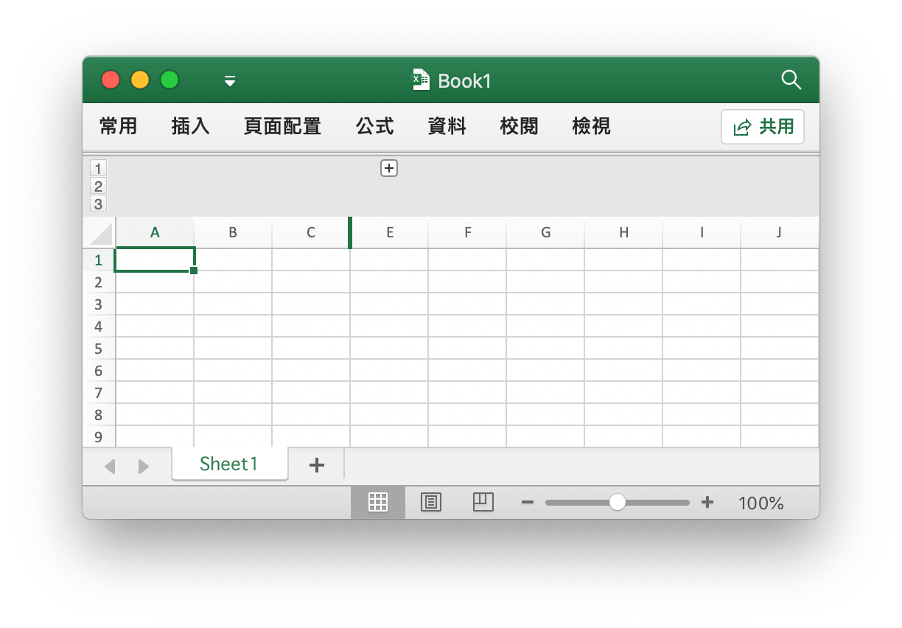

# 工作表

## 設定欄可見性 {#SetColVisible}

```go
func (f *File) SetColVisible(sheet, col string, visible bool) error
```

根據給定的工作表名稱（大小寫敏感）和欄名稱設定欄可見性。例如隱藏名為 `Sheet1` 工作表上的 `D` 欄：

```go
err := f.SetColVisible("Sheet1", "D", false)
```

隱藏名稱為 `Sheet1` 的工作表中的 `D` 至 `F` 欄：

```go
err := f.SetColVisible("Sheet1", "D:F", false)
```

## 設定欄寬度 {#SetColWidth}

```go
func (f *File) SetColWidth(sheet, startCol, endCol string, width float64) error
```

根據給定的工作表名稱（大小寫敏感）、列範圍和寬度值設定單個或多個列的寬度。例如設定名為 `Sheet1` 工作表上 `A` 到 `H` 欄的寬度為 `20`：

```go
f := excelize.NewFile()
err := f.SetColWidth("Sheet1", "A", "H", 20)
```

## 設定列高度 {#SetRowHeight}

```go
func (f *File) SetRowHeight(sheet string, row int, height float64) error
```

根據給定的工作表名稱（大小寫敏感）、列號和高度值設定單列高度。例如設定名為 `Sheet1` 工作表首列的高度為 `50`：

```go
err := f.SetRowHeight("Sheet1", 1, 50)
```

## 設定列可見性 {#SetRowVisible}

```go
func (f *File) SetRowVisible(sheet string, row int, visible bool) error
```

根據給定的工作表名稱（大小寫敏感）和列號設定列可見性。例如隱藏名為 `Sheet1` 工作表上第二列：

```go
err := f.SetRowVisible("Sheet1", 2, false)
```

## 獲取工作表名 {#GetSheetName}

```go
func (f *File) GetSheetName(index int) string
```

根據給定的工作表索引獲取工作表名稱，如果工作表不存在將傳回空字符。

## 獲取欄可見性 {#GetColVisible}

```go
func (f *File) GetColVisible(sheet, column string) (bool, error)
```

根據給定的工作表名稱（大小寫敏感）和列名獲取工作表中指定列的可見性，可見傳回值為 `true`，否則為 `false`。例如，獲取名為 `Sheet1` 的工作表上 `D` 欄的可見性：

```go
visible, err := f.GetColVisible("Sheet1", "D")
```

## 獲取欄寬度 {#GetColWidth}

```go
func (f *File) GetColWidth(sheet, col string) (float64, error)
```

根據給定的工作表和列名獲取工作表中指定列的寬度。

## 獲取列高度 {#GetRowHeight}

```go
func (f *File) GetRowHeight(sheet string, row int) (float64, error)
```

根據給定的工作表名稱（大小寫敏感）和列號獲取工作表中指定列的高度。例如，獲取名為 `Sheet1` 的工作表首列的高度：

```go
height, err := f.GetRowHeight("Sheet1", 1)
```

## 獲取列可見性 {#GetRowVisible}

```go
func (f *File) GetRowVisible(sheet string, row int) (bool, error)
```

根據給定的工作表名稱（大小寫敏感）和列號獲取工作表中指定列的可見性。例如，獲取名為 `Sheet1` 的工作表第 2 列的可見性：

```go
err := f.GetRowVisible("Sheet1", 2)
```

## 獲取工作表索引 {#GetSheetIndex}

```go
func (f *File) GetSheetIndex(name string) int
```

根據給定的工作表名稱（大小寫敏感）獲取該工作表的索引，如果工作表不存在將傳回 `-1`。

獲取到的索引可以在設定活頁簿默認工作表時，作為調用 [`SetActiveSheet()`](workbook.md#SetActiveSheet) 函數的參數使用。

## 獲取工作表映射表 {#GetSheetMap}

```go
func (f *File) GetSheetMap() map[int]string
```

獲取活頁簿中以 ID 和名稱構成的全部工作表、圖表工作表和對話工作表映射表。

```go
f, err := excelize.OpenFile("Book1.xlsx")
if err != nil {
    return
}
for index, name := range f.GetSheetMap() {
    fmt.Println(index, name)
}
```

## 獲取工作表列表 {#GetSheetList}

```go
func (f *File) GetSheetList() []string
```

獲取與活頁簿內順序相一致的，包含工作表、圖表工作表、對話工作表在內的工作表列表。

## 設定工作表名稱 {#SetSheetName}

```go
func (f *File) SetSheetName(oldName, newName string)
```

根據給定的新舊工作表名稱（大小寫敏感）重命名工作表。工作表名稱最多允許使用 31 個字符，此功能僅更改工作表的名稱，而不會更新與儲存格關聯的公式或引用中的工作表名稱。因此使用此功能重命名工作表後可能導致公式錯誤或參考引用問題。

## 設定工作表屬性 {#SetSheetPrOptions}

```go
func (f *File) SetSheetPrOptions(name string, opts ...SheetPrOption) error
```

根據給定的工作表名稱（大小寫敏感）和篩選項設定工作表屬性。

可選屬性列表：

|可選屬性|類別|
|---|---|
|CodeName|string|
|EnableFormatConditionsCalculation|bool|
|Published|bool|
|FitToPage|bool|
|TabColor|string|
|AutoPageBreaks|bool|
|OutlineSummaryBelow|bool|

例如：

```go
f := excelize.NewFile()
const sheet = "Sheet1"

if err := f.SetSheetPrOptions(sheet,
    excelize.CodeName("code"),
    excelize.EnableFormatConditionsCalculation(false),
    excelize.Published(false),
    excelize.FitToPage(true),
    excelize.TabColor("#FFFF00"),
    excelize.AutoPageBreaks(true),
    excelize.OutlineSummaryBelow(false),
); err != nil {
    fmt.Println(err)
}
```

## 獲取工作表屬性 {#GetSheetPrOptions}

```go
func (f *File) GetSheetPrOptions(name string, opts ...SheetPrOptionPtr) error
```

根據給定的工作表名稱（大小寫敏感）和篩選項獲取工作表屬性。

|可選屬性|類別|
|---|---|
|CodeName|string|
|EnableFormatConditionsCalculation|bool|
|Published|bool|
|FitToPage|bool|
|TabColor|string|
|AutoPageBreaks|bool|
|OutlineSummaryBelow|bool|

例如：

```go
f := excelize.NewFile()
const sheet = "Sheet1"

var (
    codeName                          excelize.CodeName
    enableFormatConditionsCalculation excelize.EnableFormatConditionsCalculation
    published                         excelize.Published
    fitToPage                         excelize.FitToPage
    tabColor                          excelize.TabColor
    autoPageBreaks                    excelize.AutoPageBreaks
    outlineSummaryBelow               excelize.OutlineSummaryBelow
)

if err := f.GetSheetPrOptions(sheet,
    &codeName,
    &enableFormatConditionsCalculation,
    &published,
    &fitToPage,
    &tabColor,
    &autoPageBreaks,
    &outlineSummaryBelow,
); err != nil {
    fmt.Println(err)
}
fmt.Println("Defaults:")
fmt.Printf("- codeName: %q\n", codeName)
fmt.Println("- enableFormatConditionsCalculation:", enableFormatConditionsCalculation)
fmt.Println("- published:", published)
fmt.Println("- fitToPage:", fitToPage)
fmt.Printf("- tabColor: %q\n", tabColor)
fmt.Println("- autoPageBreaks:", autoPageBreaks)
fmt.Println("- outlineSummaryBelow:", outlineSummaryBelow)
```

輸出：

```text
Defaults:
- codeName: ""
- enableFormatConditionsCalculation: true
- published: true
- fitToPage: false
- tabColor: ""
- autoPageBreaks: false
- outlineSummaryBelow: true
```

## 插入欄 {#InsertCol}

```go
func (f *File) InsertCol(sheet, column string) error
```

根據給定的工作表名稱（大小寫敏感）和列名稱，在指定列前插入空白列。例如，在名為 `Sheet1` 的工作表的 `C` 欄前插入空白列：

```go
err := f.InsertCol("Sheet1", "C")
```

## 插入列 {#InsertRow}

```go
func (f *File) InsertRow(sheet string, row int) error
```

根據給定的工作表名稱（大小寫敏感）和列號，在指定列前插入空白列。例如，在名為 `Sheet1` 的工作表的第 3 列前插入空白列：

```go
err := f.InsertRow("Sheet1", 3)
```

## 追加複製列 {#DuplicateRow}

```go
func (f *File) DuplicateRow(sheet string, row int) error
```

根據給定的工作表名稱（大小寫敏感）和列號，在該列後追加複製。例如，將名為 `Sheet1` 的工作表的第 2 列複製到第 3 列：

```go
err := f.DuplicateRow("Sheet1", 2)
```

請謹慎使用此方法，這將影響所有對該工作表中原有公式、圖表等資源引用的更改。如果該工作表包含任何引用值，在使用此方法後使用 Excel 應用程式打開它時將可能導致檔案錯誤。excelize 目前僅支持對工作表上部分引用的更新。

## 複製列 {#DuplicateRowTo}

```go
func (f *File) DuplicateRowTo(sheet string, row, row2 int) error
```

根據給定的工作表名稱（大小寫敏感）和列號，在指定列後複製該列。例如，將名為 `Sheet1` 的工作表的第 2 列後複製到第 7 列：

```go
err := f.DuplicateRowTo("Sheet1", 2, 7)
```

請謹慎使用此方法，這將影響所有對該工作表中原有公式、圖表等資源引用的更改。如果該工作表包含任何引用值，在使用此方法後使用 Excel 應用程式打開它時將可能導致檔案錯誤。excelize 目前僅支持對工作表上部分引用的更新。

## 創建列的分級顯示 {#SetRowOutlineLevel}

```go
func (f *File) SetRowOutlineLevel(sheet string, row int, level uint8) error
```

根據給定的工作表名稱（大小寫敏感）、列號和分級參數創建組。例如，在名為 `Sheet1` 的工作表的第 2 列創建 1 級分組。

<p align="center"></p>

```go
err := f.SetRowOutlineLevel("Sheet1", 2, 1)
```

## 創建欄的分級顯示 {#SetColOutlineLevel}

```go
func (f *File) SetColOutlineLevel(sheet, col string, level uint8) error
```

根據給定的工作表名稱（大小寫敏感）、列名稱和分級參數創建組。例如，在名為 `Sheet1` 的工作表的 `D` 欄創建 2 級分組。

<p align="center"></p>

```go
err := f.SetColOutlineLevel("Sheet1", "D", 2)
```

## 獲取列的分級顯示 {#GetRowOutlineLevel}

```go
func (f *File) GetRowOutlineLevel(sheet string, row int) (uint8, error)
```

根據給定的工作表名稱（大小寫敏感）和列號獲取分組級別。例如，獲取名為 `Sheet1` 的工作表第 2 列的分組級別。

```go
err := f.GetRowOutlineLevel("Sheet1", 2)
```

## 獲取欄的分級顯示 {#GetColOutlineLevel}

```go
func (f *File) GetColOutlineLevel(sheet, col string) (uint8, error)
```

根據給定的工作表名稱（大小寫敏感）和列名稱獲取分組分級。例如，獲取名為 `Sheet1` 的工作表的 `D` 欄的分組級別。

```go
level, err := f.GetColOutlineLevel("Sheet1", "D")
```

## 欄迭代器 {#Cols}

```go
func (f *File) Cols(sheet string) (*Cols, error)
```

根據給定的工作表名稱（大小寫敏感）獲取該工作表的欄迭代器。使用欄迭代器進行流式讀取遍歷儲存格：

```go
cols, err := f.Cols("Sheet1")
if err != nil {
    fmt.Println(err)
    return
}
for cols.Next() {
    col, err := cols.Rows()
    if err != nil {
        fmt.Println(err)
    }
    for _, rowCell := range col {
        fmt.Print(rowCell, "\t")
    }
    fmt.Println()
}
```

### 欄迭代器 - 單欄操作

```go
func (cols *Cols) Rows(opts ...Options) ([]string, error)
```

返回當前欄所有列的值。

### 欄迭代器 - 遍歷操作

```go
func (cols *Cols) Next() bool
```

如果下一欄有值存在將返回 `true`。

### 欄迭代器 - 錯誤處理

```go
func (cols *Cols) Error() error
```

當查找下一欄出現錯誤時將返回 `error`。

## 列迭代器 {#Rows}

```go
func (f *File) Rows(sheet string) (*Rows, error)
```

根據給定的工作表名稱（大小寫敏感）獲取該工作表的列迭代器。使用列迭代器進行流式讀取遍歷儲存格：

```go
rows, err := f.Rows("Sheet1")
if err != nil {
    fmt.Println(err)
    return
}
for rows.Next() {
    row, err := rows.Columns()
    if err != nil {
        fmt.Println(err)
    }
    for _, colCell := range row {
        fmt.Print(colCell, "\t")
    }
    fmt.Println()
}
if err = rows.Close(); err != nil {
    fmt.Println(err)
}
```

### 列迭代器 - 單列操作

```go
func (rows *Rows) Columns(opts ...Options) ([]string, error)
```

傳回當前列所有列的值。

### 列迭代器 - 遍歷操作

```go
func (rows *Rows) Next() bool
```

如果下一列有值存在將傳回 `true`。

### 列迭代器 - 錯誤處理

```go
func (rows *Rows) Error() error
```

當查找下一列出現錯誤時將傳回 `error`。

### 列迭代器 - 關閉數據流

```go
func (rows *Rows) Close() error
```

關閉數據流並清理打開工作表時可能產生的系統磁盤緩存。

## 在工作表中搜索 {#SearchSheet}

```go
func (f *File) SearchSheet(sheet, value string, reg ...bool) ([]string, error)
```

根據給定的工作表名稱（大小寫敏感），儲存格值或正則表達式來獲取坐標。此函數僅支持字符串和數字的完全匹配，不支持公式計算後的結果、格式化數字和條件搜索。如果搜索結果是合併的儲存格，將傳回合併區域左上角的坐標。

例如，在名為 `Sheet1` 的工作表中搜索值 `100` 的坐標:

```go
result, err := f.SearchSheet("Sheet1", "100")
```

例如，在名為 `Sheet1` 的工作表中搜索 `0-9` 範圍內數值的坐標:

```go
result, err := f.SearchSheet("Sheet1", "[0-9]", true)
```

## 保護工作表 {#ProtectSheet}

```go
func (f *File) ProtectSheet(sheet string, settings *FormatSheetProtection) error
```

防止其他用戶意外或有意更改、移動或刪除工作表中的資料。可選字段 `AlgorithmName` 支持指定哈希算法 XOR、MD4、MD5、SHA1、SHA256、SHA384 或 SHA512，如果未指定哈希算法，默認使用 XOR 算法。例如，為名為 `Sheet1` 的工作表設定密碼保護，但是允許選擇鎖定的儲存格、選擇未鎖定的儲存格、編輯方案：

<p align="center"></p>

```go
err := f.ProtectSheet("Sheet1", &excelize.FormatSheetProtection{
    AlgorithmName: "SHA-512",
    Password:      "password",
    EditScenarios: false,
})
```

## 取消保護工作表 {#UnprotectSheet}

```go
func (f *File) UnprotectSheet(sheet string) error
```

根據給定的工作表名稱（大小寫敏感）取消保護該工作表，指定第二個可選密碼參數以通過密碼驗證來取消工作表保護。

## 刪除欄 {#RemoveCol}

```go
func (f *File) RemoveCol(sheet, col string) error
```

根據給定的工作表名稱（大小寫敏感）和欄名稱刪除指定欄。例如，刪除名為 `Sheet1` 的 `C` 欄：

```go
err := f.RemoveCol("Sheet1", "C")
```

請謹慎使用此方法，這將影響所有對該工作表中原有公式、圖表等資源引用的更改。如果該工作表包含任何引用值，在使用此方法後使用 Excel 應用程式打開它時將可能導致檔案錯誤。excelize 目前僅支持對工作表上部分引用的更新。

## 刪除列 {#RemoveRow}

```go
func (f *File) RemoveRow(sheet string, row int) error
```

根據給定的工作表名稱（大小寫敏感）和列號刪除指定列。例如，刪除名為 `Sheet1` 的第 `3` 列：

```go
err := f.RemoveRow("Sheet1", 3)
```

請謹慎使用此方法，這將影響所有對該工作表中原有公式、圖表等資源引用的更改。如果該工作表包含任何引用值，在使用此方法後使用 Excel 應用程式打開它時將可能導致檔案錯誤。excelize 目前僅支持對工作表上部分引用的更新。

## 按列賦值 {#SetSheetRow}

```go
func (f *File) SetSheetRow(sheet, axis string, slice interface{}) error
```

根據給定的工作表名稱（大小寫敏感）、起始坐標和 `slice` 類型引用按列賦值。例如，在名為 `Sheet1` 的活頁簿第 `6` 列上，以 `B6` 存儲格作為起始坐標按列賦值：

```go
err := f.SetSheetRow("Sheet1", "B6", &[]interface{}{"1", nil, 2})
```

## 插入分頁符 {#InsertPageBreak}

```go
func (f *File) InsertPageBreak(sheet, cell string) (err error)
```

根據給定的工作表名稱和儲存格坐標插入分頁符。分頁符是將工作表分成單獨的頁面以便打印的分隔線。

## 刪除分頁符 {#RemovePageBreak}

```go
func (f *File) RemovePageBreak(sheet, cell string) (err error)
```

根據給定的工作表名稱和儲存格坐標刪除分頁符。
